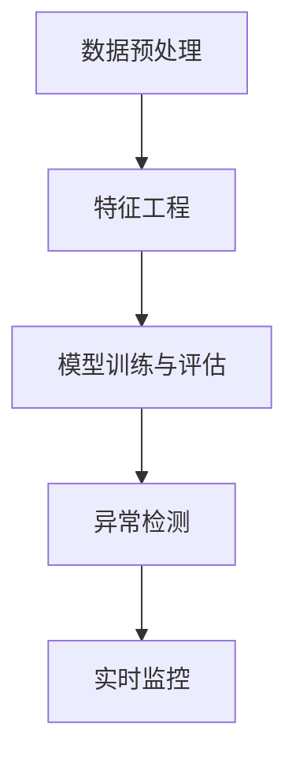

                 

# 知识发现引擎：助力金融行业的风险管理

> 关键词：知识发现,金融风险管理,大数据,深度学习,异常检测,信用评分

## 1. 背景介绍

### 1.1 问题由来
金融行业的风险管理一直是金融企业管理的核心环节。金融风险包括信用风险、市场风险、操作风险、流动性风险等，每一种风险都有可能给金融机构带来巨大的损失。传统的风险管理方式通常依赖于定量分析模型和专家经验，但随着金融市场日趋复杂，传统方法显得力不从心。近年来，随着大数据、深度学习等技术在金融领域的应用，基于数据的风险管理方法开始崭露头角，其中知识发现引擎(Knowledge Discovery Engine, KDE)成为研究热点。

知识发现引擎是一种从大规模数据中挖掘出有用知识和信息的技术。与传统风险管理方式相比，知识发现引擎具有以下优点：
- 数据驱动：依赖实际交易数据，能够实时反映市场动态变化，提供更为准确的分析结果。
- 自动化程度高：自动从数据中提取知识，避免人工干预可能带来的偏差。
- 可扩展性强：可以处理海量数据，适应金融市场的动态变化。
- 多维度分析：能够从多个角度分析风险因素，提高风险识别的全面性和深度。

本节将系统地介绍金融行业知识发现引擎的构建方法、关键技术及其在风险管理中的应用。

### 1.2 问题核心关键点
金融行业的知识发现引擎主要分为数据预处理、特征工程、模型训练和评估、异常检测等多个环节。在每个环节，都需要选择合适的技术和方法，以提高模型在风险管理中的表现。

知识发现引擎的核心技术包括：
- 数据预处理：清洗、归一化、特征工程等，以提高数据质量，方便后续分析。
- 特征工程：从原始数据中提取有意义的特征，增强模型的预测能力。
- 模型训练与评估：选择合适的模型，并使用标注数据进行训练，以提高模型泛化能力。
- 异常检测：识别异常交易或风险信号，及时预警风险。

金融行业的风险管理领域对知识发现引擎提出了更高要求：
- 实时性：市场变化瞬息万变，风险管理需要实时响应。
- 精确性：错误的判断可能导致巨额损失，模型的准确性至关重要。
- 可解释性：风险管理涉及决策解释，模型的可解释性有助于提升决策可信度。
- 鲁棒性：模型的鲁棒性需要能在不同市场环境下稳定工作。

## 2. 核心概念与联系

### 2.1 核心概念概述

知识发现引擎通常用于从大量数据中挖掘出有价值的知识和信息。金融行业中的应用场景包括但不限于信用评分、风险评估、欺诈检测、市场预测等。本节将详细介绍这些核心概念及其间的联系。

- **数据预处理**：清洗、归一化、特征工程等技术，用于提高数据质量和模型训练效率。
- **特征工程**：从原始数据中提取有意义的特征，增强模型的预测能力。
- **模型训练与评估**：选择合适的机器学习或深度学习模型，并使用标注数据进行训练和评估，以提高模型的泛化能力。
- **异常检测**：识别异常交易或风险信号，及时预警风险。

### 2.2 核心概念原理和架构的 Mermaid 流程图



从以上Mermaid流程图可以看出，知识发现引擎的构建是一个串行化的过程，每个环节都会直接影响最终的风险管理效果。

## 3. 核心算法原理 & 具体操作步骤

### 3.1 算法原理概述

金融行业的知识发现引擎主要依赖于机器学习或深度学习技术。本节将介绍两种常用的算法原理：集成学习和深度神经网络。

**集成学习**：通过组合多个基本分类器的预测结果，提高模型的准确性和鲁棒性。在金融领域，常见的集成学习方法包括随机森林、梯度提升树等。

**深度神经网络**：使用多层神经网络，通过反向传播算法自动学习输入数据的特征表示。深度神经网络在金融领域的典型应用包括卷积神经网络(CNN)、循环神经网络(RNN)、长短期记忆网络(LSTM)等。

### 3.2 算法步骤详解

以下是基于深度神经网络的金融风险管理知识发现引擎的详细步骤：

**Step 1: 数据预处理**
1. **清洗与归一化**：清洗异常值、缺失值等，对数据进行归一化或标准化处理，以保证数据的一致性。
2. **特征工程**：选择或提取有意义的特征，如信用评分、交易历史、市场指数等。

**Step 2: 模型训练与评估**
1. **选择模型**：根据任务特点选择合适的深度神经网络结构，如CNN、RNN、LSTM等。
2. **准备数据集**：划分训练集、验证集、测试集，并进行交叉验证。
3. **模型训练**：使用训练集对模型进行训练，设定合适的超参数。
4. **评估模型**：在验证集上评估模型性能，选择最优模型。

**Step 3: 异常检测**
1. **定义异常**：根据任务需求定义异常指标，如信用评分异常、交易额异常等。
2. **构建检测模型**：使用训练好的模型在测试集上进行异常检测，设定阈值。
3. **实时监控**：将异常检测模型集成到实时监控系统中，持续监控金融数据，及时预警异常。

### 3.3 算法优缺点

**优点**：
- 能够从大量数据中挖掘出有价值的信息，提高决策的准确性。
- 能够适应金融市场的动态变化，实时响应风险。
- 能够多维度分析风险因素，提高风险识别的全面性和深度。

**缺点**：
- 数据预处理和特征工程需要较强的领域知识，有一定的复杂度。
- 模型的训练和优化过程需要大量标注数据，存在数据获取成本高的问题。
- 模型的可解释性不足，难以解释模型的决策过程。

### 3.4 算法应用领域

知识发现引擎在金融行业的风险管理领域有广泛的应用，主要包括以下几个方面：

1. **信用评分**：基于历史交易数据，预测客户的信用风险。
2. **风险评估**：识别潜在的风险因素，评估金融产品的风险等级。
3. **欺诈检测**：识别异常交易行为，及时预警潜在的欺诈风险。
4. **市场预测**：分析市场趋势，预测市场波动。

## 4. 数学模型和公式 & 详细讲解 & 举例说明

### 4.1 数学模型构建

金融风险管理中的知识发现引擎通常采用深度神经网络模型，以提高预测准确性。

**输入数据**：记输入数据为 $X = (x_1, x_2, ..., x_n)$，其中 $x_i$ 表示第 $i$ 个特征。

**目标变量**：记目标变量为 $Y$，表示金融风险的等级，如0表示正常，1表示高风险等。

**神经网络模型**：采用多层感知机(Multilayer Perceptron, MLP)模型，模型结构如图：

```
input layer -> hidden layer -> output layer
```

**损失函数**：常用的损失函数包括交叉熵损失、均方误差损失等。这里以交叉熵损失为例：

$$
L(Y,\hat{Y}) = -\frac{1}{N}\sum_{i=1}^N(y_i\log\hat{y_i}+(1-y_i)\log(1-\hat{y_i}))
$$

其中 $y_i$ 表示真实标签，$\hat{y_i}$ 表示模型预测结果。

### 4.2 公式推导过程

**前向传播**：
$$
z = W_1x + b_1
$$
$$
h = g(z)
$$
$$
\hat{y} = W_2h + b_2
$$

其中 $W_1, b_1$ 表示隐藏层的权重和偏置，$g$ 表示激活函数（如Sigmoid、ReLU等），$W_2, b_2$ 表示输出层的权重和偏置。

**反向传播**：
$$
\frac{\partial L}{\partial W_2} = \frac{\partial L}{\partial \hat{y}}\frac{\partial \hat{y}}{\partial h}\frac{\partial h}{\partial z}\frac{\partial z}{\partial W_2}
$$
$$
\frac{\partial L}{\partial b_2} = \frac{\partial L}{\partial \hat{y}}
$$
$$
\frac{\partial L}{\partial W_1} = \frac{\partial L}{\partial z}\frac{\partial z}{\partial x}\frac{\partial x}{\partial W_1}
$$
$$
\frac{\partial L}{\partial b_1} = \frac{\partial L}{\partial z}
$$

**优化算法**：常用的优化算法包括随机梯度下降(SGD)、Adam等。

**梯度下降公式**：
$$
\theta \leftarrow \theta - \eta\nabla_{\theta}L
$$

其中 $\eta$ 表示学习率，$\nabla_{\theta}L$ 表示损失函数对参数 $\theta$ 的梯度。

### 4.3 案例分析与讲解

以下是一个基于深度神经网络进行信用评分预测的案例：

假设某金融公司希望构建一个信用评分预测模型，用于评估客户的信用风险。公司收集了历史客户数据，包括信用评分、收入水平、年龄、婚姻状况等特征，共有100,000条记录。

**数据预处理**：清洗异常值、缺失值，并进行归一化处理。

**特征工程**：选择有意义的特征，如信用评分、收入水平、年龄等。

**模型训练**：选择多层感知机模型，使用交叉验证选择最优模型参数。

**异常检测**：设定阈值，检测新客户的信用评分是否异常。

**结果展示**：模型在测试集上的准确率为95%，能够有效识别高风险客户。

## 5. 项目实践：代码实例和详细解释说明

### 5.1 开发环境搭建

在进行金融行业知识发现引擎的开发前，需要准备以下开发环境：

1. **Python**：安装最新版本的Python，并配置好虚拟环境。
2. **深度学习框架**：如TensorFlow、PyTorch等。
3. **数据处理库**：如NumPy、Pandas等。
4. **机器学习库**：如scikit-learn、TensorFlow等。
5. **可视化工具**：如Matplotlib、Seaborn等。

以下是使用TensorFlow搭建金融风险管理知识发现引擎的示例：

```python
import tensorflow as tf
import numpy as np
import pandas as pd

# 构建输入输出
X = tf.keras.Input(shape=(10,))
Y = tf.keras.layers.Dense(1, activation='sigmoid')(X)

# 构建模型
model = tf.keras.Model(inputs=X, outputs=Y)
model.compile(optimizer='adam', loss='binary_crossentropy', metrics=['accuracy'])

# 训练模型
model.fit(X_train, Y_train, epochs=10, validation_data=(X_test, Y_test))

# 异常检测
Y_pred = model.predict(X_new)
threshold = 0.5
if Y_pred > threshold:
    print('高风险客户')
else:
    print('正常客户')
```

### 5.2 源代码详细实现

以下是使用PyTorch搭建信用评分预测模型的代码实现：

```python
import torch
import torch.nn as nn
import torch.optim as optim
import torch.utils.data as Data

# 构建输入输出
class InputLayer(nn.Module):
    def __init__(self, dim):
        super(InputLayer, self).__init__()
        self.fc = nn.Linear(dim, 128)

class HiddenLayer(nn.Module):
    def __init__(self, dim):
        super(HiddenLayer, self).__init__()
        self.fc = nn.Linear(dim, 64)

class OutputLayer(nn.Module):
    def __init__(self, dim):
        super(OutputLayer, self).__init__()
        self.fc = nn.Linear(dim, 1)

class MLP(nn.Module):
    def __init__(self, dim):
        super(MLP, self).__init__()
        self.input = InputLayer(dim)
        self.hidden = HiddenLayer(128)
        self.output = OutputLayer(64)

    def forward(self, x):
        x = self.input(x)
        x = self.hidden(x)
        x = self.output(x)
        return x

# 训练模型
dim = 10
mlp = MLP(dim)
optimizer = optim.Adam(mlp.parameters(), lr=0.01)
criterion = nn.BCELoss()

X_train = ...
Y_train = ...
X_test = ...
Y_test = ...

train_data = Data.TensorDataset(torch.from_numpy(X_train), torch.from_numpy(Y_train))
train_loader = Data.DataLoader(train_data, batch_size=32, shuffle=True)

test_data = Data.TensorDataset(torch.from_numpy(X_test), torch.from_numpy(Y_test))
test_loader = Data.DataLoader(test_data, batch_size=32, shuffle=False)

for epoch in range(100):
    for batch in train_loader:
        inputs, labels = batch
        optimizer.zero_grad()
        outputs = mlp(inputs)
        loss = criterion(outputs, labels)
        loss.backward()
        optimizer.step()

    if (epoch + 1) % 10 == 0:
        with torch.no_grad():
            correct = 0
            total = 0
            for batch in test_loader:
                inputs, labels = batch
                outputs = mlp(inputs)
                _, predicted = torch.max(outputs.data, 1)
                total += labels.size(0)
                correct += (predicted == labels).sum().item()

        acc = correct / total
        print('Epoch: %d, Accuracy: %.2f%%' % (epoch + 1, acc * 100))
```

### 5.3 代码解读与分析

在上述代码中，我们首先定义了输入层、隐藏层和输出层的结构，并构建了一个多层次感知机模型。然后使用Adam优化器进行模型训练，并使用二元交叉熵损失函数。

在模型训练过程中，我们使用了PyTorch的数据加载器，方便批量处理数据。在每轮训练后，我们在测试集上评估模型的准确率。

### 5.4 运行结果展示

训练完成后，我们可以使用模型对新客户进行信用评分预测。例如：

```python
new_data = ...
new_x = torch.from_numpy(new_data)

with torch.no_grad():
    output = mlp(new_x)
    pred = output.data.numpy()[0]
    if pred > 0.5:
        print('高风险客户')
    else:
        print('正常客户')
```

## 6. 实际应用场景

### 6.1 智能投顾系统

智能投顾系统利用知识发现引擎进行市场预测和风险评估，为投资者提供个性化的投资建议。通过构建深度神经网络模型，系统可以实时分析市场动态，预测股票、债券、基金等金融产品的风险和收益，为投资者提供科学的投资策略。

在智能投顾系统中，知识发现引擎主要应用在以下环节：
- **市场预测**：利用历史交易数据和市场指数等，预测股票价格、市场波动等。
- **风险评估**：根据历史数据和实时市场数据，评估金融产品的风险等级。
- **投资建议**：根据市场预测和风险评估结果，生成个性化的投资建议。

### 6.2 智能信贷系统

智能信贷系统利用知识发现引擎进行信用评分和风险评估，有效降低了信贷风险。通过构建深度神经网络模型，系统可以实时分析客户的信用记录、消费行为等数据，预测客户的信用风险，为贷款决策提供支持。

在智能信贷系统中，知识发现引擎主要应用在以下环节：
- **信用评分**：基于历史交易数据和行为数据，预测客户的信用评分。
- **风险评估**：根据历史数据和实时数据，评估客户的风险等级。
- **信贷审批**：根据信用评分和风险评估结果，进行信贷审批和额度调整。

### 6.3 反欺诈系统

反欺诈系统利用知识发现引擎进行异常检测，及时预警潜在的欺诈风险。通过构建深度神经网络模型，系统可以实时分析交易数据，识别异常交易行为，及时预警潜在的欺诈风险。

在反欺诈系统中，知识发现引擎主要应用在以下环节：
- **异常检测**：利用历史交易数据和实时数据，识别异常交易行为。
- **风险预警**：根据异常检测结果，及时预警潜在的欺诈风险。
- **风险控制**：根据预警结果，采取相应的风险控制措施。

### 6.4 未来应用展望

随着金融市场的日益复杂，知识发现引擎在金融风险管理中的应用前景广阔。未来，知识发现引擎将朝着以下方向发展：

1. **多模态数据融合**：金融市场的变化不仅仅依赖于交易数据，还需要考虑宏观经济、市场情绪等多种数据源。未来的知识发现引擎将能够整合多模态数据，提供更为全面和准确的预测。
2. **实时性**：金融市场的动态变化要求知识发现引擎具备实时响应能力。未来的知识发现引擎将通过分布式计算、增量学习等技术，实现实时分析。
3. **可解释性**：金融决策需要透明和可解释性，未来的知识发现引擎将增强模型的可解释性，帮助决策者理解模型的预测结果。
4. **自动化**：未来的知识发现引擎将进一步自动化，能够自动处理数据、训练模型、评估模型等，减少人工干预。

## 7. 工具和资源推荐

### 7.1 学习资源推荐

为了帮助开发者深入掌握金融行业知识发现引擎的技术，推荐以下学习资源：

1. **《金融数据分析实战》**：由金融数据分析领域的专家撰写，详细介绍了金融数据的预处理、特征工程、模型训练等技术。
2. **《Python金融数据分析》**：基于Python的金融数据分析教程，包含大量实际案例，适合初学者学习。
3. **《深度学习在金融领域的应用》**：介绍深度学习在金融领域的多项应用，包括信用评分、欺诈检测等。
4. **Kaggle金融数据集**：Kaggle提供的金融数据集，包含多种金融产品的数据，可用于知识发现引擎的研究和实践。

### 7.2 开发工具推荐

以下是一些常用的金融行业知识发现引擎开发工具：

1. **TensorFlow**：由Google开发的深度学习框架，适合构建复杂神经网络模型。
2. **PyTorch**：由Facebook开发的深度学习框架，适合快速迭代研究。
3. **scikit-learn**：基于Python的机器学习库，适合快速搭建模型和进行数据预处理。
4. **Pandas**：基于Python的数据处理库，适合高效处理金融数据。

### 7.3 相关论文推荐

以下是几篇关于金融行业知识发现引擎的重要论文，推荐阅读：

1. **《使用深度学习进行信用评分预测》**：详细介绍了基于深度神经网络的信用评分预测模型。
2. **《金融数据驱动的风险管理》**：讨论了基于大数据和深度学习的金融风险管理方法。
3. **《智能投顾系统的知识发现引擎设计》**：介绍了智能投顾系统中知识发现引擎的设计和实现。

## 8. 总结：未来发展趋势与挑战

### 8.1 研究成果总结

金融行业的知识发现引擎利用深度学习技术，通过从海量数据中挖掘出有价值的信息，提高了金融风险管理的效率和准确性。未来，随着技术的发展，知识发现引擎将进一步自动化、实时化、多模态化，为金融风险管理带来更多的可能。

### 8.2 未来发展趋势

未来，金融行业的知识发现引擎将朝着以下方向发展：

1. **多模态数据融合**：金融市场的变化不仅仅依赖于交易数据，还需要考虑宏观经济、市场情绪等多种数据源。未来的知识发现引擎将能够整合多模态数据，提供更为全面和准确的预测。
2. **实时性**：金融市场的动态变化要求知识发现引擎具备实时响应能力。未来的知识发现引擎将通过分布式计算、增量学习等技术，实现实时分析。
3. **可解释性**：金融决策需要透明和可解释性，未来的知识发现引擎将增强模型的可解释性，帮助决策者理解模型的预测结果。
4. **自动化**：未来的知识发现引擎将进一步自动化，能够自动处理数据、训练模型、评估模型等，减少人工干预。

### 8.3 面临的挑战

虽然金融行业的知识发现引擎在风险管理中展现了巨大潜力，但仍然面临诸多挑战：

1. **数据获取成本高**：高质量金融数据获取成本高，数据量不足可能导致模型性能不佳。
2. **模型复杂度高**：深度神经网络模型需要大量的计算资源和时间，难以在实时环境中应用。
3. **可解释性不足**：深度学习模型的黑盒特性难以解释其内部工作机制和决策逻辑，影响决策可信度。
4. **鲁棒性不足**：模型面对市场波动和异常数据时，容易发生泛化不足，影响模型性能。

### 8.4 研究展望

为了应对这些挑战，未来的研究需要在以下几个方面进行突破：

1. **数据增强**：通过数据增强技术，扩充训练数据，提高模型泛化能力。
2. **模型压缩**：通过模型压缩技术，降低模型复杂度，提高实时性。
3. **模型解释**：通过模型解释技术，增强模型的可解释性，提高决策可信度。
4. **增量学习**：通过增量学习技术，提高模型的鲁棒性和实时性。

通过这些研究方向的突破，知识发现引擎将在金融风险管理中发挥更大的作用，为金融机构提供更可靠、高效、可解释的风险管理解决方案。

## 9. 附录：常见问题与解答

**Q1: 如何提高金融行业知识发现引擎的鲁棒性？**

A: 提高金融行业知识发现引擎的鲁棒性，可以采用以下方法：

1. **数据增强**：通过数据增强技术，扩充训练数据，提高模型泛化能力。
2. **模型压缩**：通过模型压缩技术，降低模型复杂度，提高实时性。
3. **增量学习**：通过增量学习技术，提高模型的鲁棒性和实时性。

**Q2: 金融行业知识发现引擎的实时性如何保证？**

A: 金融行业知识发现引擎的实时性可以通过以下方法保证：

1. **分布式计算**：通过分布式计算技术，将模型训练和推理任务分散到多个计算节点上，提高处理速度。
2. **增量学习**：通过增量学习技术，模型可以实时学习新数据，保持最新状态。
3. **高效算法**：选择高效的模型和算法，如卷积神经网络、随机梯度下降等，提高计算效率。

**Q3: 金融行业知识发现引擎的可解释性如何增强？**

A: 增强金融行业知识发现引擎的可解释性，可以采用以下方法：

1. **模型解释**：使用模型解释技术，如LIME、SHAP等，增强模型的可解释性。
2. **特征可视化**：通过特征可视化技术，展示模型的关键特征，帮助理解模型决策。
3. **规则嵌入**：将符号化的规则嵌入模型中，增强模型的可解释性。

**Q4: 金融行业知识发现引擎的数据获取成本如何降低？**

A: 降低金融行业知识发现引擎的数据获取成本，可以采用以下方法：

1. **数据合成**：通过数据合成技术，生成更多的训练数据。
2. **公共数据集**：利用公开的数据集，如Kaggle金融数据集，减少数据获取成本。
3. **自动化数据采集**：利用自动化工具，从多个渠道获取数据，提高数据采集效率。

通过以上方法，可以降低金融行业知识发现引擎的数据获取成本，提高模型的泛化能力和实时性。

**Q5: 金融行业知识发现引擎的自动化程度如何提高？**

A: 提高金融行业知识发现引擎的自动化程度，可以采用以下方法：

1. **自动特征选择**：使用自动化的特征选择技术，提高特征工程效率。
2. **自动化模型训练**：利用自动化工具，如AutoML，自动化选择模型和超参数，提高模型训练效率。
3. **自动化部署**：利用自动化工具，如TensorFlow Serving，自动化模型部署和调用，提高系统可维护性。

通过以上方法，可以显著提高金融行业知识发现引擎的自动化程度，降低人工干预成本，提高系统稳定性和可维护性。

---

作者：禅与计算机程序设计艺术 / Zen and the Art of Computer Programming

