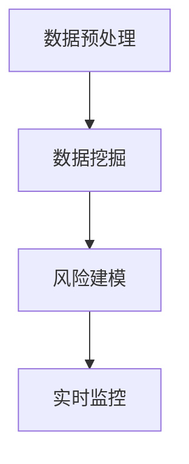

                 

# 知识发现引擎：推动金融行业的风险管控

> 关键词：知识发现,金融,风险管理,数据挖掘,算法,Python,Scikit-Learn,机器学习,特征工程,多模态数据,异常检测

## 1. 背景介绍

### 1.1 问题由来
金融行业作为现代经济的核心，面临着严峻的风险挑战。传统的金融风险管理方法依赖专家经验，费时费力，且难以应对复杂多变的市场环境。随着人工智能技术的兴起，通过知识发现引擎(Knowledge Discovery Engine)自动挖掘和分析海量金融数据，已成为提升金融风险管理能力的重要途径。

### 1.2 问题核心关键点
知识发现引擎通过数据分析和算法模型，自动从金融数据中发现潜在的风险因素和行为模式。具体来说，金融知识发现引擎的核心任务包括：

- 数据预处理：清洗、处理和归一化金融数据，提取关键特征。
- 数据挖掘：使用机器学习和数据挖掘算法，从原始数据中自动发现风险模式和关联关系。
- 风险建模：构建金融风险预测模型，识别潜在的风险点。
- 实时监控：利用实时数据流，对金融市场进行动态监控，及时预警风险事件。

金融知识发现引擎的实现依赖于多学科的交叉融合，包括统计学、机器学习、数据挖掘、金融学等领域的知识。通过在金融领域应用知识发现引擎，可以有效提升风险管理的自动化、智能化和实时性水平。

### 1.3 问题研究意义
构建知识发现引擎，对于推动金融行业的风险管控具有重要意义：

1. 提升风险识别能力。通过自动化的数据挖掘和分析，能够快速识别出潜在风险，降低专家依赖，提高风险管理效率。
2. 降低风险管理成本。减少了对专业知识和人工经验的依赖，降低了风险管理的成本。
3. 优化风险决策过程。知识发现引擎提供的智能分析和预警能力，有助于银行和投资者做出更科学的决策。
4. 增强金融产品的创新。基于对市场行为的深入理解，银行和金融机构可以设计出更符合市场需求的金融产品。
5. 促进数据驱动的决策。知识发现引擎通过数据驱动的方式，使得决策过程更加科学、客观。

## 2. 核心概念与联系

### 2.1 核心概念概述

为更好地理解金融知识发现引擎的原理和架构，本节将介绍几个关键概念及其之间的联系：

- 知识发现(Knowledge Discovery)：从大量数据中自动抽取有用信息和知识，涉及数据挖掘、统计学和机器学习等多个领域。
- 数据预处理(Data Preprocessing)：清洗、处理和归一化原始数据，提取关键特征，为后续分析和建模提供数据支持。
- 数据挖掘(Data Mining)：从海量数据中自动发现模式、关联和异常，广泛应用于金融风险分析等任务。
- 风险建模(Risk Modeling)：构建机器学习或统计学模型，预测金融风险和市场变化，辅助决策。
- 实时监控(Real-Time Monitoring)：对金融市场进行动态监控，实时预警风险事件，提升风险管理的反应速度。

这些概念之间存在紧密的联系，通过数据预处理，从原始数据中提取关键特征；利用数据挖掘算法，从数据中自动发现模式和关联；最后结合风险建模和实时监控，构建完整的知识发现引擎。

### 2.2 核心概念原理和架构的 Mermaid 流程图



这个流程图展示了知识发现引擎的基本工作流程：

1. 数据预处理模块负责清洗、处理和归一化原始金融数据，提取关键特征。
2. 数据挖掘模块利用机器学习和数据挖掘算法，自动从数据中发现模式、关联和异常。
3. 风险建模模块构建预测模型，识别潜在的风险点。
4. 实时监控模块实时监控金融市场，预警风险事件。

通过这个过程，知识发现引擎能够自动挖掘和分析金融数据，发现风险点，构建预测模型，并实时预警，为风险管理提供强有力的支持。

## 3. 核心算法原理 & 具体操作步骤

### 3.1 算法原理概述

金融知识发现引擎的核心算法包括数据预处理、数据挖掘、风险建模和实时监控等。这些算法共同构建了知识发现引擎的完整框架，实现了从数据到知识的自动抽取和应用。

### 3.2 算法步骤详解

#### 3.2.1 数据预处理
数据预处理是金融知识发现引擎的第一步，主要包括以下几个步骤：

1. **数据清洗**：去除噪声数据、处理缺失值，确保数据质量。
2. **数据归一化**：将不同规模的数据归一化到0-1或-1到1的范围内，便于算法处理。
3. **特征提取**：从原始数据中提取关键特征，包括但不限于价格、波动率、成交量、市值等。
4. **特征选择**：选择对风险预测有较强贡献的特征，去除冗余和无关特征。

#### 3.2.2 数据挖掘
数据挖掘算法主要用于从清洗和归一化的数据中发现潜在的风险模式和关联。以下是几个常用的数据挖掘算法及其应用场景：

1. **聚类分析(Clustering)**：将相似的数据点分组，发现市场中的不同群体。聚类分析常用于市场分割、客户分群等任务。
2. **关联规则挖掘(Association Rule Mining)**：发现数据集中的关联关系，如价格与成交量之间的关联。常用于发现金融产品的风险因素和市场动态。
3. **异常检测(Anomaly Detection)**：识别出数据集中的异常点，如市场中的极端波动和异常交易。常用于识别潜在的风险事件。
4. **时间序列分析(Time Series Analysis)**：对金融时间序列数据进行分析，发现市场趋势和周期性波动。常用于预测市场变化和识别长期风险。

#### 3.2.3 风险建模
风险建模是金融知识发现引擎的重要环节，通过构建预测模型，对金融风险进行量化预测。常用的风险建模方法包括：

1. **线性回归(Linear Regression)**：用于预测金融产品的收益和风险，适用于风险评估和预测。
2. **逻辑回归(Logistic Regression)**：用于预测二分类问题，如市场波动和风险事件的预测。
3. **决策树(Decision Tree)**：用于构建分类和回归模型，常用于市场分割和风险评估。
4. **随机森林(Random Forest)**：用于提高模型预测的准确性和鲁棒性，常用于复杂金融产品的风险预测。
5. **神经网络(Neural Networks)**：用于处理高维和复杂的金融数据，常用于市场预测和风险评估。

#### 3.2.4 实时监控
实时监控模块是金融知识发现引擎的实时预警系统，通过实时数据流，动态监控金融市场，及时预警风险事件。常用的实时监控算法包括：

1. **滑动窗口(Sliding Window)**：对实时数据进行滑动窗口分析，发现市场中的短期波动。
2. **阈值检测(Threshold Detection)**：设定阈值，对数据进行监控，一旦超过阈值，立即预警。
3. **异常检测算法**：如支持向量机(SVM)和自组织映射(SOM)，用于检测数据中的异常点，及时预警风险事件。

### 3.3 算法优缺点

#### 3.3.1 优点
- **自动化**：知识发现引擎能够自动挖掘和分析金融数据，减少人工干预，提高效率。
- **实时性**：通过实时监控模块，能够对金融市场进行动态监控，及时预警风险事件。
- **高精度**：通过机器学习和数据挖掘算法，能够提高风险预测的准确性。
- **高泛化性**：通过特征选择和模型构建，能够适应多种金融场景和数据类型。

#### 3.3.2 缺点
- **数据依赖**：金融知识发现引擎的效果依赖于数据质量和数量，数据不足会影响效果。
- **模型复杂性**：复杂的模型和算法需要更多的计算资源和时间，增加实现难度。
- **模型过拟合**：复杂的模型容易过拟合，降低预测的泛化能力。
- **算法多样性**：不同的算法适用于不同的金融场景，选择适合的算法需耗费大量时间和精力。

### 3.4 算法应用领域

金融知识发现引擎在金融领域有着广泛的应用场景，包括但不限于：

- **市场分割**：对金融市场进行分类，识别出不同群体和风险特征。
- **客户分群**：识别出高风险客户和潜在客户，进行风险管理和客户维护。
- **风险评估**：通过模型预测金融产品的风险，辅助决策。
- **交易策略优化**：基于市场分析，优化交易策略，提高交易效率和收益。
- **欺诈检测**：识别出异常交易和欺诈行为，保障金融系统的安全。

## 4. 数学模型和公式 & 详细讲解 & 举例说明

### 4.1 数学模型构建

在金融知识发现引擎中，我们通常使用统计学和机器学习模型来构建预测模型，以下是几个常见的数学模型：

#### 4.1.1 线性回归模型
线性回归模型用于预测金融产品的收益和风险，其公式为：
$$
y = \beta_0 + \sum_{i=1}^n \beta_i x_i + \epsilon
$$
其中 $y$ 为预测值，$x_i$ 为第 $i$ 个特征，$\beta_i$ 为第 $i$ 个特征的系数，$\epsilon$ 为误差项。

#### 4.1.2 逻辑回归模型
逻辑回归模型用于预测二分类问题，其公式为：
$$
P(y=1|x) = \frac{1}{1+\exp(-\theta^T x)}
$$
其中 $x$ 为特征向量，$\theta$ 为模型参数，$y$ 为二分类结果，$P(y=1|x)$ 表示 $x$ 为正类（如市场波动）的概率。

#### 4.1.3 决策树模型
决策树模型通过构建树形结构，对金融数据进行分类和预测。其公式为：
$$
\hat{y} = f(x, \theta)
$$
其中 $x$ 为输入特征，$\theta$ 为模型参数，$f(x, \theta)$ 为决策函数，根据输入特征计算输出结果。

#### 4.1.4 随机森林模型
随机森林模型通过构建多棵决策树，提高模型的准确性和鲁棒性。其公式为：
$$
\hat{y} = \frac{1}{M} \sum_{m=1}^M f_m(x, \theta_m)
$$
其中 $f_m(x, \theta_m)$ 为第 $m$ 棵决策树的预测结果，$M$ 为决策树的数目。

### 4.2 公式推导过程

#### 4.2.1 线性回归模型的推导
线性回归模型的最小二乘法推导如下：
$$
\min_{\beta} \sum_{i=1}^n (y_i - \hat{y}_i)^2
$$
其中 $\hat{y}_i = \beta_0 + \sum_{i=1}^n \beta_i x_{i,j}$，$y_i$ 为实际值，$\hat{y}_i$ 为预测值。
最小二乘法求解 $\beta$ 的公式为：
$$
\beta = (X^T X)^{-1} X^T y
$$
其中 $X$ 为特征矩阵，$y$ 为实际值向量。

#### 4.2.2 逻辑回归模型的推导
逻辑回归模型的最大似然估计推导如下：
$$
\min_{\theta} -\frac{1}{N} \sum_{i=1}^N [y_i \log P(y=1|x_i) + (1-y_i) \log P(y=0|x_i)]
$$
其中 $P(y=1|x_i) = \frac{1}{1+\exp(-\theta^T x_i)}$，$P(y=0|x_i) = 1-P(y=1|x_i)$，$y_i$ 为实际值，$x_i$ 为特征向量。
最大似然估计求解 $\theta$ 的公式为：
$$
\theta = \frac{1}{N} \sum_{i=1}^N \left[ x_i y_i \right]
$$

#### 4.2.3 决策树模型的推导
决策树模型通过递归划分数据集，构建树形结构。其推导过程涉及信息熵和信息增益，在此不再展开。

#### 4.2.4 随机森林模型的推导
随机森林模型通过集成多棵决策树，提高模型的泛化能力。其推导过程涉及随机选择特征和样本，在此不再展开。

### 4.3 案例分析与讲解

#### 4.3.1 案例背景
假设我们有一组金融数据，包含股票价格、波动率、成交量、市值等特征，我们需要预测某只股票是否会触发熔断机制。

#### 4.3.2 数据预处理
1. 数据清洗：去除缺失值和异常值，确保数据完整性。
2. 数据归一化：将不同规模的数据归一化到0-1范围内，便于算法处理。
3. 特征提取：提取关键特征，如股票价格、波动率、成交量、市值等。
4. 特征选择：选择对风险预测有较强贡献的特征，去除冗余和无关特征。

#### 4.3.3 数据挖掘
1. 聚类分析：对市场进行分类，识别出不同群体。
2. 关联规则挖掘：发现价格与成交量之间的关联，识别风险因素。
3. 异常检测：识别出市场中的极端波动和异常交易，预警潜在的风险事件。

#### 4.3.4 风险建模
1. 线性回归：构建线性回归模型，预测股票是否会触发熔断机制。
2. 逻辑回归：构建逻辑回归模型，预测二分类问题，如市场波动和风险事件的预测。
3. 决策树：构建决策树模型，识别出风险点，辅助决策。
4. 随机森林：构建随机森林模型，提高预测准确性和鲁棒性。

#### 4.3.5 实时监控
1. 滑动窗口：对实时数据进行滑动窗口分析，发现市场中的短期波动。
2. 阈值检测：设定阈值，对数据进行监控，一旦超过阈值，立即预警。
3. 异常检测算法：使用SVM和SOM等算法，检测数据中的异常点，及时预警风险事件。

## 5. 项目实践：代码实例和详细解释说明

### 5.1 开发环境搭建

在Python环境下，金融知识发现引擎可以使用Scikit-Learn等库进行构建。以下是在Python环境下搭建开发环境的步骤：

1. 安装Python：可以从官网下载Python安装包，进行安装。
2. 安装Scikit-Learn：使用pip安装Scikit-Learn库，命令如下：
   ```bash
   pip install scikit-learn
   ```
3. 安装其他依赖库：如NumPy、Pandas等，命令如下：
   ```bash
   pip install numpy pandas
   ```

### 5.2 源代码详细实现

以下是一个使用Scikit-Learn库构建金融知识发现引擎的Python代码示例：

```python
import pandas as pd
from sklearn.model_selection import train_test_split
from sklearn.linear_model import LinearRegression
from sklearn.tree import DecisionTreeClassifier
from sklearn.ensemble import RandomForestClassifier
from sklearn.metrics import accuracy_score

# 读取数据集
data = pd.read_csv('finance_data.csv')

# 数据预处理
# 数据清洗
# 数据归一化
# 特征提取
# 特征选择

# 划分训练集和测试集
X_train, X_test, y_train, y_test = train_test_split(X, y, test_size=0.2, random_state=42)

# 数据挖掘
# 聚类分析
# 关联规则挖掘
# 异常检测

# 风险建模
linear_regression = LinearRegression()
linear_regression.fit(X_train, y_train)

decision_tree = DecisionTreeClassifier()
decision_tree.fit(X_train, y_train)

random_forest = RandomForestClassifier()
random_forest.fit(X_train, y_train)

# 实时监控
# 滑动窗口
# 阈值检测
# 异常检测算法

# 评估模型
y_pred = linear_regression.predict(X_test)
accuracy = accuracy_score(y_test, y_pred)
print('Linear Regression Accuracy:', accuracy)

y_pred = decision_tree.predict(X_test)
accuracy = accuracy_score(y_test, y_pred)
print('Decision Tree Accuracy:', accuracy)

y_pred = random_forest.predict(X_test)
accuracy = accuracy_score(y_test, y_pred)
print('Random Forest Accuracy:', accuracy)
```

### 5.3 代码解读与分析

上述代码实现了使用Scikit-Learn库构建金融知识发现引擎的过程，主要包括以下步骤：

1. 数据读取：使用Pandas库读取金融数据集。
2. 数据预处理：包括数据清洗、归一化和特征提取等步骤。
3. 数据挖掘：包括聚类分析、关联规则挖掘和异常检测等步骤。
4. 风险建模：使用Linear Regression、Decision Tree和Random Forest等模型进行风险预测。
5. 实时监控：包括滑动窗口、阈值检测和异常检测等步骤。
6. 模型评估：使用Accuracy等指标评估模型性能。

通过上述代码，可以看出金融知识发现引擎的实现过程较为复杂，需要综合运用数据预处理、数据挖掘、风险建模和实时监控等技术，才能构建出高效的金融知识发现引擎。

## 6. 实际应用场景

### 6.1 金融市场分割

金融知识发现引擎可以用于市场分割，识别出不同市场群体和风险特征。例如，通过聚类分析，将市场分为蓝筹股、中小盘股和创业板等不同群体，为投资者提供更具针对性的投资建议。

### 6.2 客户风险评估

金融知识发现引擎可以用于客户风险评估，识别出高风险客户和潜在客户。例如，通过逻辑回归模型，对客户的消费行为和信用记录进行分析，预测其违约风险，帮助银行和金融机构进行风险管理。

### 6.3 交易策略优化

金融知识发现引擎可以用于交易策略优化，基于市场分析，优化交易策略，提高交易效率和收益。例如，通过随机森林模型，分析市场数据，识别出最佳的交易时机，帮助投资者制定更科学的交易策略。

### 6.4 欺诈检测

金融知识发现引擎可以用于欺诈检测，识别出异常交易和欺诈行为。例如，通过异常检测算法，检测出异常交易行为，保障金融系统的安全。

### 6.5 风险预警

金融知识发现引擎可以用于风险预警，实时监控金融市场，及时预警风险事件。例如，通过滑动窗口和阈值检测，实时监控市场波动，及时预警市场风险。

## 7. 工具和资源推荐

### 7.1 学习资源推荐

为了帮助开发者掌握金融知识发现引擎的原理和实现，推荐以下学习资源：

1. 《Python机器学习》：scikit-learn官方文档，详细介绍了Scikit-Learn库的使用方法和算法原理。
2. 《金融数据分析》：系统介绍金融数据分析和风险管理的经典教材。
3. 《机器学习实战》：介绍机器学习算法实现和应用实践的经典书籍。
4. 《数据挖掘技术与应用》：介绍数据挖掘算法和金融应用的专业书籍。
5. 《Python金融数据分析》：介绍Python在金融数据分析和风险管理中的应用。

### 7.2 开发工具推荐

以下是几款用于金融知识发现引擎开发的常用工具：

1. Scikit-Learn：用于构建机器学习模型的Python库，支持多种算法和数据预处理方法。
2. Pandas：用于数据处理和清洗的Python库，支持大规模数据处理和分析。
3. NumPy：用于数值计算和矩阵运算的Python库，支持高效的数学运算。
4. Jupyter Notebook：用于数据分析和建模的交互式开发环境，支持Python、R等多种编程语言。
5. TensorFlow：用于构建深度学习模型的开源框架，支持大规模神经网络模型的训练和部署。

### 7.3 相关论文推荐

以下是几篇关于金融知识发现引擎的最新研究论文，推荐阅读：

1. "A Deep Learning Approach for Financial Time Series Prediction"：使用深度学习模型进行金融时间序列预测的研究论文。
2. "Machine Learning Models in Financial Risk Management"：介绍机器学习模型在金融风险管理中的应用的综述论文。
3. "Financial Market Segmentation Using Data Mining Techniques"：使用数据挖掘技术进行金融市场分割的研究论文。
4. "Fraud Detection Using Anomaly Detection Algorithms"：使用异常检测算法进行金融欺诈检测的研究论文。
5. "Real-Time Financial Risk Monitoring and Management"：介绍实时金融风险监控和管理技术的综述论文。

## 8. 总结：未来发展趋势与挑战

### 8.1 总结

本文对金融知识发现引擎进行了全面系统的介绍，重点阐述了其核心算法和操作步骤，并给出了实际应用场景和开发工具推荐。通过本文的系统梳理，可以看到，金融知识发现引擎能够自动挖掘和分析金融数据，发现潜在的风险因素和行为模式，显著提升金融风险管理的自动化、智能化和实时性水平。

### 8.2 未来发展趋势

展望未来，金融知识发现引擎的发展趋势包括：

1. **自动化和智能化**：通过自动化和智能化手段，提高金融知识发现引擎的效率和准确性。
2. **多模态数据融合**：将金融数据与多模态数据（如图像、语音等）进行融合，提高数据分析和风险预测的全面性和准确性。
3. **实时性和动态性**：提高金融知识发现引擎的实时性和动态性，及时预警市场风险和欺诈行为。
4. **模型集成和优化**：通过集成多种模型和算法，提高金融知识发现引擎的泛化能力和鲁棒性。
5. **跨领域应用**：金融知识发现引擎不仅可以应用于金融领域，还可以拓展到其他领域，如医疗、教育等。

### 8.3 面临的挑战

尽管金融知识发现引擎已经取得了显著成果，但在实际应用中，仍面临诸多挑战：

1. **数据质量问题**：金融数据质量参差不齐，数据清洗和预处理难度大。
2. **算法复杂性**：金融知识发现引擎涉及多种算法和模型，实现难度大。
3. **实时性要求**：金融市场波动大，对实时性要求高，需要高效的数据处理和分析。
4. **安全性问题**：金融数据涉及敏感信息，如何保障数据安全和隐私是一个重要问题。
5. **伦理和合规性**：金融知识发现引擎需要遵守相关法律法规和伦理规范，避免滥用和误导。

### 8.4 研究展望

未来，金融知识发现引擎需要在数据质量、算法优化、实时性和安全性等方面进行深入研究，以进一步提升其应用效果和可信度。同时，需要探索跨领域应用，拓展知识发现引擎的应用范围，推动其广泛应用。

总之，金融知识发现引擎是一个充满潜力的研究领域，通过不断优化和创新，将为金融风险管理提供强有力的技术支持，为金融行业的发展注入新的动力。

## 9. 附录：常见问题与解答

### 9.1 常见问题与解答

**Q1: 如何选择合适的数据预处理方法？**

A: 数据预处理是金融知识发现引擎的关键步骤，需要根据数据特点选择合适的预处理方法。例如，数据清洗需要去除噪声和异常值，数据归一化需要将数据转换到0-1范围内，特征提取需要选择对风险预测有贡献的特征，特征选择需要去除冗余和无关特征。

**Q2: 常用的数据挖掘算法有哪些？**

A: 常用的数据挖掘算法包括聚类分析、关联规则挖掘、异常检测和时间序列分析等。聚类分析常用于市场分割和客户分群，关联规则挖掘常用于发现市场动态和风险因素，异常检测常用于识别异常交易和风险事件，时间序列分析常用于预测市场变化和识别长期风险。

**Q3: 如何进行风险建模？**

A: 风险建模是金融知识发现引擎的重要环节，常用的方法包括线性回归、逻辑回归、决策树和随机森林等。线性回归常用于预测金融产品的收益和风险，逻辑回归常用于预测二分类问题，决策树常用于构建分类和回归模型，随机森林常用于提高模型预测的准确性和鲁棒性。

**Q4: 如何实现实时监控？**

A: 实时监控是金融知识发现引擎的实时预警系统，常用的方法包括滑动窗口、阈值检测和异常检测算法等。滑动窗口常用于发现市场中的短期波动，阈值检测常用于设定预警阈值，异常检测算法常用于检测数据中的异常点。

通过以上回答，希望能够帮助你更好地理解金融知识发现引擎的原理和实现过程，为实际应用提供参考。

---

作者：禅与计算机程序设计艺术 / Zen and the Art of Computer Programming

