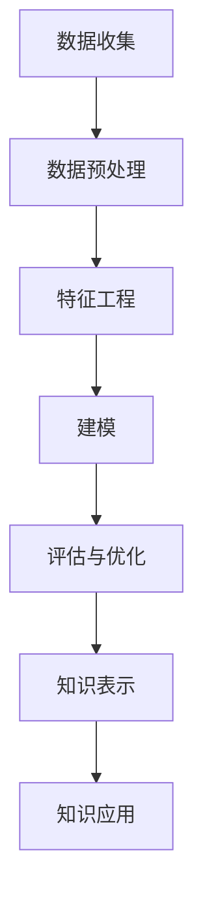

                 

# 知识发现引擎：知识创新的强大引擎

## 1. 背景介绍

在现代社会，知识是推动人类进步的核心动力。从科学研究、工业生产到日常生活，无处不在的知识发现活动正在塑造着我们的世界。然而，知识的发现和应用并非易事，尤其在面对海量、复杂、多样化的数据时，传统手工提取、整理的方法已远远不足。计算机技术的进步，特别是人工智能和大数据技术的兴起，为知识发现提供了新的机遇。

知识发现引擎（Knowledge Discovery Engine, KDE）是知识工程和人工智能领域中的一种重要工具，它通过自动化的方法从海量数据中挖掘、提取和汇总有价值的信息，为知识创新提供有力支撑。本文将深入探讨知识发现引擎的原理、实现和应用，以期为读者提供全面而深入的了解，帮助他们在各自的领域中更好地应用这一强大的技术。

## 2. 核心概念与联系

### 2.1 核心概念概述

知识发现引擎（KDE）是一种基于数据挖掘和人工智能技术，从大型数据库或数据仓库中自动提取和汇总知识的工具。KDE的目标是从原始数据中发现潜在的模式、规则、关联和趋势，并提供易于理解的输出，帮助决策者和数据分析师进行深入分析和知识创新。

KDE的核心概念包括：

- **数据挖掘**：从原始数据中提取有用信息的过程，通常包括清洗、预处理、特征工程、建模和评估等步骤。
- **知识表示**：用逻辑、符号、图形等方式对发现的知识进行编码和组织，以便进行推理和应用。
- **人工智能**：利用机器学习和深度学习等技术，自动化数据挖掘和知识发现过程，提高发现知识的准确性和效率。

### 2.2 核心概念原理和架构的 Mermaid 流程图



这个流程图展示了KDE的核心工作流程：

1. **数据收集**：收集、整合来自不同来源的数据。
2. **数据预处理**：清洗、转换和格式化数据，以提高数据质量。
3. **特征工程**：提取、选择和转换数据特征，以提高模型的预测能力。
4. **建模**：使用机器学习或深度学习模型，对数据进行建模和训练，以发现知识。
5. **评估与优化**：评估模型的性能，并进行必要的调整和优化。
6. **知识表示**：将发现的知识转化为易于理解和应用的形式。
7. **知识应用**：将知识应用于实际问题，进行决策、预测和推荐等。

## 3. 核心算法原理 & 具体操作步骤

### 3.1 算法原理概述

知识发现引擎通常基于数据挖掘算法，结合机器学习、深度学习和自然语言处理等技术，从大规模数据集中自动发现和提取知识。其中，分类、聚类、关联规则和异常检测等算法是最常见的数据挖掘方法，它们能够从原始数据中提取有用的信息，并帮助建立知识模型。

### 3.2 算法步骤详解

**Step 1: 数据收集与预处理**

数据收集和预处理是KDE的基础。数据收集包括从多个数据源（如数据库、日志文件、网络爬虫等）获取数据。数据预处理包括数据清洗、转换、归一化等，以确保数据的质量和一致性。

**Step 2: 特征工程**

特征工程是将原始数据转换为模型能够理解的形式，是提升模型性能的关键步骤。特征工程包括特征提取、选择和变换，如特征选择、特征组合、特征降维等。

**Step 3: 建模与评估**

建模是将预处理后的数据输入到机器学习或深度学习模型中进行训练，以发现数据中的规律和知识。评估则是通过交叉验证、混淆矩阵等方法评估模型性能。

**Step 4: 知识表示**

知识表示是将模型发现的知识以逻辑、符号、图形等方式进行编码，以便于理解和应用。知识表示方法包括规则表示、本体论表示、关系图表示等。

**Step 5: 知识应用**

知识应用是将发现的规则、模式和关联应用于实际问题中，如预测、推荐、决策支持等。

### 3.3 算法优缺点

**优点**：

- 自动化和高效性：KDE能够自动处理大规模数据，发现有用的知识和规律。
- 可解释性：通过规则、本体等形式的知识表示，KDE提供的知识易于理解和解释。
- 灵活性：KDE可以根据不同的业务需求进行定制，满足不同的应用场景。

**缺点**：

- 数据质量和预处理难度：数据质量直接影响KDE的效果，需要严格的数据清洗和预处理。
- 计算资源需求高：KDE通常需要较高的计算资源，特别是对于大规模数据集。
- 结果的准确性依赖于算法和模型：不同的算法和模型可能会发现不同的知识和规律，需要精心选择和调整。

### 3.4 算法应用领域

KDE的应用领域非常广泛，涵盖各个行业和学科。以下是几个典型应用领域：

- **金融行业**：KDE用于风险评估、信用评分、欺诈检测等。
- **医疗领域**：KDE用于疾病预测、基因分析、患者护理等。
- **零售行业**：KDE用于销售预测、客户细分、市场分析等。
- **制造行业**：KDE用于生产流程优化、故障预测、供应链管理等。
- **政府和公共服务**：KDE用于公共安全、城市规划、社会服务优化等。

## 4. 数学模型和公式 & 详细讲解 & 举例说明

### 4.1 数学模型构建

KDE的数学模型构建通常基于统计学和机器学习的基础理论。以下以分类模型为例，介绍KDE的数学模型构建过程。

假设有一组训练样本$(x_i, y_i), i=1,2,\ldots,n$，其中$x_i \in \mathbb{R}^m$为特征向量，$y_i \in \{0,1\}$为目标变量。分类模型的目标是找到一个映射$f(x): \mathbb{R}^m \rightarrow \{0,1\}$，使得$f(x_i) = y_i$对所有样本成立。

### 4.2 公式推导过程

对于分类问题，常用的模型包括逻辑回归、支持向量机（SVM）、随机森林等。这里以逻辑回归为例，推导其数学模型。

逻辑回归的损失函数为：

$$
L(\theta) = -\frac{1}{n} \sum_{i=1}^n [y_i\log \sigma(\theta^Tx_i) + (1-y_i)\log (1-\sigma(\theta^Tx_i))]
$$

其中$\sigma(x) = \frac{1}{1+e^{-x}}$为sigmoid函数，$\theta$为模型参数。

对损失函数求导，得：

$$
\frac{\partial L(\theta)}{\partial \theta} = -\frac{1}{n} \sum_{i=1}^n [y_i(\sigma(\theta^Tx_i)-y_i)]
$$

根据梯度下降算法，模型参数的更新公式为：

$$
\theta \leftarrow \theta - \eta \frac{\partial L(\theta)}{\partial \theta}
$$

其中$\eta$为学习率，通常取较小的值。

### 4.3 案例分析与讲解

以医疗领域中的疾病预测为例，展示KDE的应用。假设有一组患者数据，包含患者的年龄、性别、血压、血糖等特征，以及是否患有某种疾病。通过KDE分析，可以发现疾病与这些特征之间的关联，建立疾病预测模型。具体步骤如下：

1. 收集和预处理数据。
2. 选择和构建特征。
3. 使用逻辑回归等模型进行训练和评估。
4. 通过规则表示等方式表示发现的知识。
5. 将知识应用于新患者的疾病预测。

## 5. 项目实践：代码实例和详细解释说明

### 5.1 开发环境搭建

为了进行KDE项目实践，需要准备如下开发环境：

- **Python**：选择3.7或更高版本。
- **NumPy**：用于科学计算和数组操作。
- **Pandas**：用于数据处理和分析。
- **Scikit-learn**：用于机器学习建模。
- **TensorFlow**：用于深度学习建模。

使用Anaconda创建虚拟环境：

```bash
conda create -n kde-env python=3.7
conda activate kde-env
```

### 5.2 源代码详细实现

以下是一个简单的KDE项目示例，使用Pandas和Scikit-learn进行数据处理和分类模型训练。

```python
import pandas as pd
from sklearn.model_selection import train_test_split
from sklearn.linear_model import LogisticRegression
from sklearn.metrics import accuracy_score

# 读取数据
data = pd.read_csv('patient_data.csv')

# 数据预处理
X = data.drop(['disease'], axis=1)
y = data['disease']

# 特征选择和构建
X_train, X_test, y_train, y_test = train_test_split(X, y, test_size=0.2, random_state=42)

# 训练模型
clf = LogisticRegression()
clf.fit(X_train, y_train)

# 评估模型
y_pred = clf.predict(X_test)
accuracy = accuracy_score(y_test, y_pred)
print(f'Accuracy: {accuracy:.2f}')
```

### 5.3 代码解读与分析

以上代码实现了简单的数据预处理、特征工程、模型训练和评估。详细解读如下：

- 数据读取和预处理：使用Pandas读取CSV文件，并进行特征选择，提取分类目标。
- 模型选择和训练：选择逻辑回归模型，并使用训练集数据进行训练。
- 模型评估：在测试集上使用准确率评估模型性能。

## 6. 实际应用场景

### 6.1 金融风险管理

在金融领域，KDE用于风险评估和信用评分。通过分析历史交易数据，KDE能够发现潜在风险因素，如违约概率、欺诈行为等，帮助金融机构进行风险管理和决策。

### 6.2 医疗疾病预测

KDE在医疗领域主要用于疾病预测、基因分析等。通过对患者历史数据进行分析，KDE能够发现疾病与各种生理指标之间的关系，提供早期预测和个性化治疗方案。

### 6.3 零售市场分析

KDE在零售行业用于销售预测、客户细分等。通过分析销售数据和客户行为，KDE能够发现市场趋势和客户偏好，帮助企业制定更好的营销策略和产品组合。

### 6.4 未来应用展望

未来，KDE将进一步拓展应用领域，实现更加智能化的决策支持。以下是一些未来展望：

- **自动化决策**：KDE结合自然语言处理技术，能够从大量文本数据中提取知识，为自动化决策提供支持。
- **多模态分析**：KDE结合图像、声音等多模态数据，能够进行更加全面和深入的知识发现。
- **实时分析和预测**：KDE结合流式数据处理技术，能够实现实时分析和预测，提高决策的时效性。
- **跨领域融合**：KDE结合其他领域的知识，如自然语言处理、计算机视觉等，实现跨领域知识融合。

## 7. 工具和资源推荐

### 7.1 学习资源推荐

为了帮助开发者系统掌握KDE的理论基础和实践技巧，以下是一些优质的学习资源：

1. 《数据挖掘导论》：由R. Agrawal、J. Gehrke和D. Keedwell著，系统介绍了数据挖掘的基本概念和技术。
2. 《Python数据科学手册》：由Jake VanderPlas著，介绍了Python在数据科学和机器学习中的应用。
3. 《TensorFlow实战》：由Vlad Niculae著，介绍了TensorFlow的深度学习建模和应用。
4. Kaggle：数据科学和机器学习竞赛平台，提供了丰富的数据集和KDE项目实践机会。

### 7.2 开发工具推荐

KDE的开发工具包括Python、NumPy、Pandas、Scikit-learn、TensorFlow等。以下是一些推荐的开发工具：

- **Python**：选择3.7或更高版本。
- **NumPy**：用于科学计算和数组操作。
- **Pandas**：用于数据处理和分析。
- **Scikit-learn**：用于机器学习建模。
- **TensorFlow**：用于深度学习建模。

### 7.3 相关论文推荐

KDE的研究涉及数据挖掘、机器学习、人工智能等多个领域。以下是几篇经典的KDE论文，推荐阅读：

1. "Association Rules in Large Databases: A Data Mining Approach" by R. Agrawal and R. Srikant（1993）。
2. "A Study of Frequent Pattern Growth Algorithms for Association Rule Mining" by C.K. Jiumi and X.C. Gu（2002）。
3. "The Elements of Statistical Learning" by T. Hastie, R. Tibshirani和J. Friedman（2009）。

## 8. 总结：未来发展趋势与挑战

### 8.1 总结

本文对知识发现引擎（KDE）的原理、实现和应用进行了全面系统的介绍。首先阐述了KDE的研究背景和意义，明确了KDE在知识工程和人工智能领域中的重要地位。其次，从原理到实践，详细讲解了KDE的数学模型和核心算法，给出了KDE项目开发的完整代码实例。同时，本文还广泛探讨了KDE在金融、医疗、零售等多个行业领域的应用前景，展示了KDE的广泛应用潜力。此外，本文精选了KDE技术的各类学习资源，力求为读者提供全方位的技术指引。

通过本文的系统梳理，可以看到，KDE技术在知识发现和创新中发挥了巨大作用，为各个行业提供了有力的数据支持和决策依据。未来，伴随KDE技术的发展，知识发现的自动化和智能化程度将进一步提升，推动知识经济的发展。

### 8.2 未来发展趋势

展望未来，KDE技术将呈现以下几个发展趋势：

1. **自动化和智能化程度提高**：KDE将结合自然语言处理、计算机视觉等技术，实现更加智能化的知识发现和决策支持。
2. **多模态数据的融合**：KDE将结合图像、声音等多模态数据，进行更加全面和深入的知识发现。
3. **实时分析和预测**：KDE将结合流式数据处理技术，实现实时分析和预测，提高决策的时效性。
4. **跨领域融合**：KDE将结合其他领域的知识，如自然语言处理、计算机视觉等，实现跨领域知识融合。
5. **联邦学习**：KDE将结合联邦学习技术，保护数据隐私的同时，实现跨机构的数据共享和知识发现。

### 8.3 面临的挑战

尽管KDE技术已经取得了显著进展，但在迈向更加智能化、普适化应用的过程中，它仍面临诸多挑战：

1. **数据质量和预处理难度**：数据质量和预处理直接影响KDE的效果，需要严格的数据清洗和预处理。
2. **计算资源需求高**：KDE通常需要较高的计算资源，特别是对于大规模数据集。
3. **结果的准确性依赖于算法和模型**：不同的算法和模型可能会发现不同的知识和规律，需要精心选择和调整。
4. **解释性和可解释性**：KDE的决策过程和知识表示需要更强的解释性和可解释性，以便于理解和应用。
5. **伦理和安全问题**：KDE需要考虑数据隐私和伦理安全问题，确保数据使用的合规性和安全性。

### 8.4 研究展望

未来，KDE的研究需要在以下几个方面寻求新的突破：

1. **数据预处理自动化**：开发更加智能和自动化的数据预处理技术，提高数据处理效率和准确性。
2. **模型选择和优化**：开发更高效和通用的模型选择和优化方法，提高KDE的性能和稳定性。
3. **多模态和跨领域知识融合**：研究多模态数据的融合方法和跨领域知识融合技术，实现更加全面的知识发现。
4. **实时分析和预测**：结合流式数据处理技术，开发实时分析和预测系统，提高决策的时效性。
5. **解释性和可解释性**：研究更加透明和可解释的KDE技术，提高其可信度和应用范围。

这些研究方向将推动KDE技术向更高层次发展，为知识工程和人工智能领域带来新的突破。面向未来，KDE技术需要与其他人工智能技术进行更深入的融合，共同推动知识发现和创新的进步。

## 9. 附录：常见问题与解答

**Q1：什么是知识发现引擎（KDE）？**

A: 知识发现引擎（KDE）是一种基于数据挖掘和人工智能技术，从大型数据库或数据仓库中自动提取和汇总知识的工具。

**Q2：KDE的建模过程包括哪些步骤？**

A: KDE的建模过程包括以下步骤：数据收集与预处理、特征工程、建模与评估、知识表示和知识应用。

**Q3：KDE的优势和局限性是什么？**

A: KDE的优势包括自动化和高效性、可解释性和灵活性。局限性包括数据质量和预处理难度、计算资源需求高以及结果的准确性依赖于算法和模型。

**Q4：KDE在金融行业有哪些应用？**

A: KDE在金融行业用于风险评估、信用评分、欺诈检测等。

**Q5：未来KDE的发展趋势是什么？**

A: 未来KDE将更加自动化和智能化、多模态数据融合、实时分析和预测、跨领域知识融合和解释性增强。

---

作者：禅与计算机程序设计艺术 / Zen and the Art of Computer Programming

