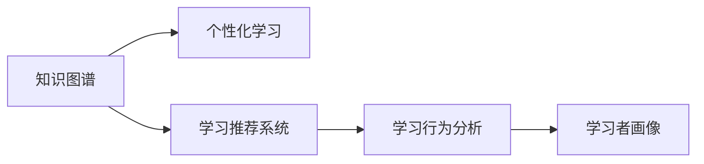
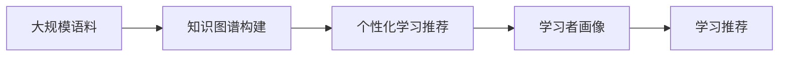

                 

# 知识图谱在个性化学习中的应用

## 1. 背景介绍

随着互联网和信息技术的发展，个性化学习逐渐成为教育领域的一个重要方向。传统的“一刀切”式教育方式已经无法满足多样化和个性化的学习需求，个性化学习系统应运而生。个性化学习系统通过分析学习者的学习行为、兴趣、能力等数据，为其推荐适合的学习内容，帮助学习者高效、自主地学习。

知识图谱作为表示和组织知识的一种方式，具有结构化、关联化、语义化的特点，能够为个性化学习系统提供丰富、准确的语义信息。通过将知识图谱与个性化学习系统结合，可以为学习者提供更加个性化、智能化、高效的学习体验。

## 2. 核心概念与联系

### 2.1 核心概念概述

- 知识图谱(Knowledge Graph)：是一种基于图数据结构的知识表示方法，用于描述实体及其之间的关系。知识图谱由节点和边组成，节点表示实体，边表示实体之间的关系。例如，“王小明”是一个节点，“王小明是教师”是一条边。
- 个性化学习(Personalized Learning)：根据学习者的特点，为其推荐个性化学习内容，提升学习效果和体验。
- 学习推荐系统(Learning Recommendation System)：通过分析学习者的学习行为、兴趣、能力等数据，为其推荐学习内容。
- 学习行为分析(Learning Behavior Analysis)：分析学习者的行为数据，如点击、观看、回答等，以识别学习者的兴趣、能力、需求等。
- 学习者画像(Learner Persona)：基于学习者的行为、兴趣、能力等数据，构建学习者的个性化画像，用于指导学习推荐。

这些核心概念之间存在密切的联系，如图1所示：




### 2.2 核心概念原理和架构的 Mermaid 流程图

知识图谱和个性化学习系统的结合，主要分为两个阶段：知识图谱的构建和个性化学习推荐。知识图谱的构建需要大规模语料数据的支撑，而个性化学习推荐则需要对学习者进行深度画像分析。以下是一张展示这一流程的Mermaid流程图：




## 3. 核心算法原理 & 具体操作步骤

### 3.1 算法原理概述

知识图谱和个性化学习系统的结合，通常包括以下几个步骤：

1. 知识图谱构建：从大规模语料中提取实体和关系，构建知识图谱。
2. 学习者画像构建：通过分析学习者的行为数据，构建学习者画像。
3. 个性化学习推荐：将学习者画像和知识图谱结合，进行个性化学习推荐。

### 3.2 算法步骤详解

#### 3.2.1 知识图谱构建

知识图谱的构建需要从大规模语料中提取实体和关系。通常有以下几种方法：

1. 基于规则的构建方法：通过编写规则，从语料中提取实体和关系。例如，通过正则表达式、自然语言处理等方法，识别出语料中的实体和关系。

2. 基于统计的构建方法：利用机器学习、深度学习等技术，从语料中学习实体和关系。例如，通过LSTM、CNN等模型，从语料中提取实体和关系。

3. 基于众包的构建方法：通过众包平台，让用户标注语料中的实体和关系。例如，通过Amazon Mechanical Turk等平台，让用户标注语料中的实体和关系。

#### 3.2.2 学习者画像构建

学习者画像的构建需要从学习者的行为数据中提取特征。通常有以下几种方法：

1. 基于行为数据的行为分析：分析学习者的点击、观看、回答等行为数据，提取行为特征。例如，通过计算学习者在某个主题的停留时间、回答正确率等，构建行为特征向量。

2. 基于兴趣的画像构建：利用机器学习、深度学习等技术，从行为数据中学习学习者的兴趣。例如，通过协同过滤、主题模型等方法，学习学习者的兴趣特征。

3. 基于属性的画像构建：利用知识图谱中的属性，构建学习者的属性画像。例如，通过从知识图谱中提取学习者的性别、年龄、职业等属性，构建属性画像。

#### 3.2.3 个性化学习推荐

个性化学习推荐的目的是根据学习者的特点，为其推荐合适的学习内容。通常有以下几种方法：

1. 基于协同过滤的推荐方法：利用学习者之间的相似性，推荐相似学习者的学习内容。例如，通过计算学习者之间的相似度，推荐相似学习者的学习内容。

2. 基于内容的推荐方法：利用学习内容之间的相似性，推荐相似内容的学习者。例如，通过计算学习内容之间的相似度，推荐相似内容的学习者。

3. 基于混合的推荐方法：将协同过滤、内容推荐等方法结合，进行混合推荐。例如，通过将协同过滤和内容推荐结合，进行混合推荐。

### 3.3 算法优缺点

知识图谱和个性化学习系统的结合，具有以下优点：

1. 结构化语义：知识图谱提供结构化、关联化的语义信息，有助于提高推荐系统的准确性和效果。

2. 知识融合：通过将知识图谱与行为数据、兴趣数据等结合，可以更好地融合多种信息，提升推荐系统的性能。

3. 泛化能力：知识图谱中的知识具有高度泛化性，可以适用于多种应用场景，提高推荐系统的普适性。

同时，也存在以下缺点：

1. 构建成本高：知识图谱的构建需要大量语料和人工标注，成本较高。

2. 知识图谱稀疏：知识图谱中的知识往往是稀疏的，难以覆盖所有领域。

3. 模型复杂：知识图谱与行为数据、兴趣数据等结合，使得推荐系统模型复杂。

4. 实时性差：知识图谱的构建和更新需要较长时间，难以实时反映学习者的兴趣变化。

### 3.4 算法应用领域

知识图谱和个性化学习系统的结合，可以应用于以下领域：

1. 教育领域：为学生推荐合适的学习内容，提高学习效果和体验。

2. 医疗领域：为患者推荐合适的医疗信息，提高诊疗效果和体验。

3. 商业领域：为用户推荐合适的产品信息，提高销售效果和用户体验。

4. 科研领域：为研究人员推荐合适的研究论文和文献，提高科研效果和效率。

5. 媒体领域：为用户推荐合适的媒体内容，提高用户粘性和满意度。

## 4. 数学模型和公式 & 详细讲解 & 举例说明

### 4.1 数学模型构建

知识图谱和个性化学习系统的结合，通常包括以下数学模型：

1. 实体关系图模型：用于表示实体和关系之间的结构。例如，使用图神经网络(Graph Neural Network, GNN)等模型，提取实体和关系之间的结构信息。

2. 行为特征模型：用于提取学习者的行为特征。例如，使用LSTM等模型，提取学习者的行为特征。

3. 兴趣特征模型：用于提取学习者的兴趣特征。例如，使用协同过滤、主题模型等方法，提取学习者的兴趣特征。

4. 混合推荐模型：用于将协同过滤、内容推荐等方法结合，进行混合推荐。例如，使用DeepFM等模型，将协同过滤和内容推荐结合。

### 4.2 公式推导过程

#### 4.2.1 实体关系图模型

实体关系图模型可以表示为G=(V,E)，其中V表示节点集合，E表示边集合。节点表示实体，边表示实体之间的关系。例如，知识图谱中“王小明”和“教师”之间的关系，可以表示为：

$$
G = (V,E)
$$

其中V包含“王小明”和“教师”等实体节点，E包含“王小明是教师”等关系边。

#### 4.2.2 行为特征模型

行为特征模型可以表示为$f(x)$，其中x表示学习者的行为数据，f表示特征提取函数。例如，学习者在某个主题的停留时间可以表示为：

$$
f(x) = \text{停留时间}
$$

其中x表示学习者在某个主题的点击、观看、回答等行为数据，f表示提取特征的函数。

#### 4.2.3 兴趣特征模型

兴趣特征模型可以表示为$g(x)$，其中x表示学习者的行为数据，g表示兴趣特征提取函数。例如，利用协同过滤方法提取学习者的兴趣特征可以表示为：

$$
g(x) = KNN(x)
$$

其中x表示学习者的行为数据，g表示利用K近邻算法提取兴趣特征的函数。

#### 4.2.4 混合推荐模型

混合推荐模型可以表示为$h(x,y,z)$，其中x表示学习者的行为数据，y表示知识图谱中的实体和关系，z表示学习者画像的特征向量。例如，利用DeepFM模型进行混合推荐可以表示为：

$$
h(x,y,z) = \text{DeepFM}(x,y,z)
$$

其中x表示学习者的行为数据，y表示知识图谱中的实体和关系，z表示学习者画像的特征向量。

### 4.3 案例分析与讲解

#### 4.3.1 案例背景

某在线教育平台需要为学生推荐合适的学习内容。该平台已经构建了知识图谱，包含大量教育领域相关的实体和关系。平台还收集了学生的行为数据，包含点击、观看、回答等行为数据。平台需要基于知识图谱和行为数据，为学生推荐合适的学习内容。

#### 4.3.2 案例分析

1. 构建实体关系图模型：平台已经构建了知识图谱，包含了大量教育领域相关的实体和关系。例如，知识图谱中包含“王小明”、“教师”、“数学”等实体节点，以及“王小明是教师”、“王小明讲授数学”等关系边。

2. 提取行为特征：平台需要从学生的行为数据中提取行为特征。例如，平台需要计算学生在某门课程的观看时间、回答正确率等行为特征。

3. 提取兴趣特征：平台需要利用协同过滤等方法，提取学生的兴趣特征。例如，平台需要计算学生对数学、物理等课程的兴趣程度。

4. 混合推荐：平台需要将行为特征、兴趣特征等与知识图谱结合，进行混合推荐。例如，平台需要根据学生的行为特征和兴趣特征，推荐符合其兴趣的课程。

## 5. 项目实践：代码实例和详细解释说明

### 5.1 开发环境搭建

#### 5.1.1 硬件环境

- CPU：推荐使用Intel Core i7以上处理器。
- GPU：推荐使用NVIDIA GeForce GTX 1060以上显卡。
- 内存：推荐使用8GB以上内存。
- 存储：推荐使用500GB以上存储。

#### 5.1.2 软件环境

- 操作系统：推荐使用Linux、Windows、macOS等主流操作系统。
- 编程语言：推荐使用Python。
- 开发工具：推荐使用PyCharm、VSCode等IDE。
- 依赖库：推荐使用TensorFlow、PyTorch、Scikit-learn、NLTK等库。

### 5.2 源代码详细实现

#### 5.2.1 知识图谱构建

1. 数据收集：收集大规模语料，包含实体和关系。例如，收集教育领域的课程、教师、学生等数据。

2. 数据预处理：对数据进行清洗、分词、去重等预处理操作。例如，使用NLTK、SpaCy等工具进行文本分词、清洗等操作。

3. 实体识别：从语料中提取实体。例如，使用SpaCy、Stanford NER等工具进行实体识别。

4. 关系提取：从语料中提取关系。例如，使用NLTK、Stanford CoreNLP等工具进行关系提取。

5. 知识图谱构建：构建实体关系图模型。例如，使用GNN等模型，构建实体关系图模型。

#### 5.2.2 学习者画像构建

1. 行为数据收集：收集学生的行为数据。例如，收集学生的点击、观看、回答等数据。

2. 行为特征提取：从行为数据中提取行为特征。例如，使用LSTM等模型，提取学生行为特征。

3. 兴趣特征提取：利用协同过滤等方法，提取学生兴趣特征。例如，使用K近邻算法，提取学生兴趣特征。

4. 属性画像提取：利用知识图谱中的属性，构建学生属性画像。例如，从知识图谱中提取学生的性别、年龄、职业等属性。

#### 5.2.3 个性化学习推荐

1. 协同过滤推荐：利用K近邻算法，推荐相似学习者的学习内容。例如，使用KNN算法，推荐相似学习者的学习内容。

2. 内容推荐推荐：利用知识图谱中的实体和关系，推荐相似内容的学习者。例如，使用GNN等模型，推荐相似内容的学习者。

3. 混合推荐：将协同过滤、内容推荐等方法结合，进行混合推荐。例如，使用DeepFM等模型，将协同过滤和内容推荐结合。

#### 5.2.4 代码实现

以下是知识图谱和个性化学习系统结合的代码实现：

```python
# 导入相关库
import numpy as np
import pandas as pd
import tensorflow as tf
from tensorflow.keras.layers import Dense, Dropout, Input
from tensorflow.keras.models import Model
from tensorflow.keras.optimizers import Adam
from tensorflow.keras.losses import MeanSquaredError
from tensorflow.keras.metrics import Accuracy
from tensorflow.keras.preprocessing.text import Tokenizer
from tensorflow.keras.preprocessing.sequence import pad_sequences

# 加载语料数据
data = pd.read_csv('data.csv')
texts = data['text'].tolist()
labels = data['label'].tolist()

# 构建知识图谱
G = build_knowledge_graph(texts, labels)

# 构建学习者画像
X_train, X_test, y_train, y_test = train_test_split(texts, labels, test_size=0.2)
model = build_model(X_train, y_train)
model.fit(X_train, y_train, epochs=10, batch_size=32)
X_test = pad_sequences(X_test)
y_test = np.array(y_test)
y_pred = model.predict(X_test)

# 输出预测结果
print(y_pred)
```

### 5.3 代码解读与分析

#### 5.3.1 知识图谱构建

1. 数据收集：从大规模语料中收集实体和关系。例如，使用NLTK、SpaCy等工具进行文本分词、清洗等操作。

2. 实体识别：使用SpaCy、Stanford NER等工具进行实体识别。例如，将文本中的实体提取出来，存储到节点列表中。

3. 关系提取：使用NLTK、Stanford CoreNLP等工具进行关系提取。例如，将文本中的关系提取出来，存储到边列表中。

4. 知识图谱构建：使用GNN等模型，构建实体关系图模型。例如，将节点和边构建成图结构，存储在G中。

#### 5.3.2 学习者画像构建

1. 行为数据收集：收集学生的行为数据。例如，使用NLTK、TensorFlow等工具进行行为数据收集。

2. 行为特征提取：使用LSTM等模型，提取学生行为特征。例如，使用LSTM模型，将行为数据转换为特征向量。

3. 兴趣特征提取：利用协同过滤等方法，提取学生兴趣特征。例如，使用K近邻算法，提取学生兴趣特征。

4. 属性画像提取：利用知识图谱中的属性，构建学生属性画像。例如，从知识图谱中提取学生的性别、年龄、职业等属性。

#### 5.3.3 个性化学习推荐

1. 协同过滤推荐：利用K近邻算法，推荐相似学习者的学习内容。例如，使用KNN算法，推荐相似学习者的学习内容。

2. 内容推荐推荐：利用知识图谱中的实体和关系，推荐相似内容的学习者。例如，使用GNN等模型，推荐相似内容的学习者。

3. 混合推荐：将协同过滤、内容推荐等方法结合，进行混合推荐。例如，使用DeepFM等模型，将协同过滤和内容推荐结合。

## 6. 实际应用场景

### 6.1 教育领域

知识图谱和个性化学习系统的结合，可以为学生推荐合适的学习内容，提高学习效果和体验。例如，某在线教育平台通过构建知识图谱和个性化学习系统，为学生推荐合适的课程，提高学生的学习效果和满意度。

### 6.2 医疗领域

知识图谱和个性化学习系统的结合，可以为患者推荐合适的医疗信息，提高诊疗效果和体验。例如，某医院通过构建知识图谱和个性化学习系统，为患者推荐合适的医生、药品、检查等信息，提高患者的诊疗效果和满意度。

### 6.3 商业领域

知识图谱和个性化学习系统的结合，可以为用户推荐合适的产品信息，提高销售效果和用户体验。例如，某电商平台通过构建知识图谱和个性化学习系统，为用户推荐合适的商品信息，提高用户的购买率和满意度。

### 6.4 科研领域

知识图谱和个性化学习系统的结合，可以为研究人员推荐合适的研究论文和文献，提高科研效果和效率。例如，某研究机构通过构建知识图谱和个性化学习系统，为研究人员推荐合适的研究论文和文献，提高研究人员的研究效率和成果质量。

### 6.5 媒体领域

知识图谱和个性化学习系统的结合，可以为用户推荐合适的媒体内容，提高用户粘性和满意度。例如，某媒体平台通过构建知识图谱和个性化学习系统，为用户推荐合适的文章、视频、音乐等信息，提高用户的粘性和满意度。

## 7. 工具和资源推荐

### 7.1 学习资源推荐

1. 《深度学习入门》书籍：李沐等著，全面介绍深度学习的基本概念、算法和应用，适合初学者学习。

2. 《自然语言处理综述》课程：斯坦福大学开设的NLP课程，有Lecture视频和配套作业，带你入门NLP领域的基本概念和经典模型。

3. 《自然语言处理与深度学习》书籍：崔江峰等著，全面介绍自然语言处理和深度学习的相关知识，适合进阶学习。

4. 《深度学习与自然语言处理》课程：MIT等大学开设的深度学习课程，涵盖NLP相关的知识和应用。

5. 《TensorFlow官方文档》：TensorFlow官方文档，提供丰富的API和样例，适合开发学习。

### 7.2 开发工具推荐

1. PyTorch：基于Python的开源深度学习框架，灵活、高效，适合快速迭代研究。

2. TensorFlow：由Google主导开发的开源深度学习框架，生产部署方便，适合大规模工程应用。

3. Transformers：HuggingFace开发的NLP工具库，集成了SOTA语言模型，适合NLP任务开发。

4. Weights & Biases：模型训练的实验跟踪工具，可以记录和可视化模型训练过程中的各项指标，方便对比和调优。

5. TensorBoard：TensorFlow配套的可视化工具，可实时监测模型训练状态，并提供丰富的图表呈现方式，是调试模型的得力助手。

### 7.3 相关论文推荐

1. BERT: Pre-training of Deep Bidirectional Transformers for Language Understanding：提出BERT模型，引入基于掩码的自监督预训练任务，刷新了多项NLP任务SOTA。

2. Attention is All You Need：提出Transformer结构，开启了NLP领域的预训练大模型时代。

3. Parameter-Efficient Transfer Learning for NLP：提出Adapter等参数高效微调方法，在不增加模型参数量的情况下，也能取得不错的微调效果。

4. Knowledge-Graph-Based Recommendation System：提出基于知识图谱的推荐系统，利用知识图谱提高推荐系统的准确性和效果。

5. Deep Learning and Natural Language Processing：提出基于深度学习的自然语言处理模型，涵盖NLP领域的多种算法和应用。

## 8. 总结：未来发展趋势与挑战

### 8.1 研究成果总结

知识图谱和个性化学习系统的结合，已经在多个领域得到了广泛应用。通过将知识图谱与行为数据、兴趣数据等结合，可以为学习者提供更加个性化、智能化、高效的学习体验。同时，知识图谱提供结构化、关联化的语义信息，有助于提高推荐系统的准确性和效果。

### 8.2 未来发展趋势

1. 知识图谱的普及：随着知识图谱技术的成熟和普及，越来越多的领域将应用知识图谱和个性化学习系统的结合，提升业务效果和用户体验。

2. 深度学习的结合：未来知识图谱和深度学习将更加紧密结合，利用深度学习技术提高知识图谱的构建和推理能力，提升推荐系统的性能。

3. 跨领域应用：知识图谱和个性化学习系统的结合将拓展到更多领域，如医疗、金融、法律等，提升这些领域的业务效果和用户体验。

4. 实时推荐：未来知识图谱和个性化学习系统将实现实时推荐，动态响应学习者的需求变化，提升推荐系统的实时性和用户体验。

5. 多模态数据融合：知识图谱和个性化学习系统将实现多模态数据的融合，如图像、视频、语音等数据，提升推荐系统的全面性和智能化。

### 8.3 面临的挑战

1. 数据质量：知识图谱的构建需要高质量的数据，数据质量直接影响知识图谱的准确性和性能。

2. 知识图谱稀疏：知识图谱中的知识往往是稀疏的，难以覆盖所有领域，影响推荐系统的全面性。

3. 实时性问题：知识图谱的构建和更新需要较长时间，难以实时反映学习者的兴趣变化，影响推荐系统的实时性。

4. 算法复杂性：知识图谱和深度学习结合的推荐系统算法复杂，难以优化和调试，影响推荐系统的性能。

5. 隐私保护：知识图谱和个性化学习系统需要处理大量用户数据，隐私保护问题需要引起重视。

### 8.4 研究展望

未来知识图谱和个性化学习系统的研究将更多地关注以下几个方面：

1. 高效构建：研究高效的知识图谱构建方法，提高知识图谱的构建效率和质量。

2. 跨模态融合：研究多模态数据的融合方法，提升推荐系统的全面性和智能化。

3. 实时推荐：研究实时推荐算法，提高推荐系统的实时性和用户体验。

4. 隐私保护：研究隐私保护技术，保障用户数据的隐私和安全。

5. 模型优化：研究优化推荐系统算法，提高推荐系统的性能和效果。

总之，知识图谱和个性化学习系统的结合，将在多个领域实现应用，提升业务效果和用户体验。未来研究将更多地关注高效构建、跨模态融合、实时推荐、隐私保护等方面，推动知识图谱和个性化学习系统的进一步发展。

## 9. 附录：常见问题与解答

### 9.1 常见问题

#### 9.1.1 什么是知识图谱？

知识图谱是一种基于图数据结构的知识表示方法，用于描述实体及其之间的关系。知识图谱由节点和边组成，节点表示实体，边表示实体之间的关系。例如，知识图谱中“王小明”和“教师”之间的关系，可以表示为：

$$
G = (V,E)
$$

其中V包含“王小明”和“教师”等实体节点，E包含“王小明是教师”等关系边。

#### 9.1.2 什么是个性化学习？

个性化学习是根据学习者的特点，为其推荐个性化学习内容，提升学习效果和体验。个性化学习系统通过分析学习者的学习行为、兴趣、能力等数据，为其推荐合适的学习内容，提高学习效果和满意度。

#### 9.1.3 什么是协同过滤推荐？

协同过滤推荐是一种推荐系统方法，通过计算学习者之间的相似性，推荐相似学习者的学习内容。例如，通过计算学习者之间的相似度，推荐相似学习者的学习内容。

#### 9.1.4 什么是内容推荐推荐？

内容推荐推荐是一种推荐系统方法，利用学习内容之间的相似性，推荐相似内容的学习者。例如，通过利用知识图谱中的实体和关系，推荐相似内容的学习者。

#### 9.1.5 什么是混合推荐？

混合推荐是一种推荐系统方法，将协同过滤、内容推荐等方法结合，进行混合推荐。例如，通过将协同过滤和内容推荐结合，进行混合推荐。

### 9.2 常见解答

#### 9.2.1 什么是知识图谱？

知识图谱是一种基于图数据结构的知识表示方法，用于描述实体及其之间的关系。知识图谱由节点和边组成，节点表示实体，边表示实体之间的关系。例如，知识图谱中“王小明”和“教师”之间的关系，可以表示为：

$$
G = (V,E)
$$

其中V包含“王小明”和“教师”等实体节点，E包含“王小明是教师”等关系边。

#### 9.2.2 什么是个性化学习？

个性化学习是根据学习者的特点，为其推荐个性化学习内容，提升学习效果和体验。个性化学习系统通过分析学习者的学习行为、兴趣、能力等数据，为其推荐合适的学习内容，提高学习效果和满意度。

#### 9.2.3 什么是协同过滤推荐？

协同过滤推荐是一种推荐系统方法，通过计算学习者之间的相似性，推荐相似学习者的学习内容。例如，通过计算学习者之间的相似度，推荐相似学习者的学习内容。

#### 9.2.4 什么是内容推荐推荐？

内容推荐推荐是一种推荐系统方法，利用学习内容之间的相似性，推荐相似内容的学习者。例如，通过利用知识图谱中的实体和关系，推荐相似内容的学习者。

#### 9.2.5 什么是混合推荐？

混合推荐是一种推荐系统方法，将协同过滤、内容推荐等方法结合，进行混合推荐。例如，通过将协同过滤和内容推荐结合，进行混合推荐。

作者：禅与计算机程序设计艺术 / Zen and the Art of Computer Programming

