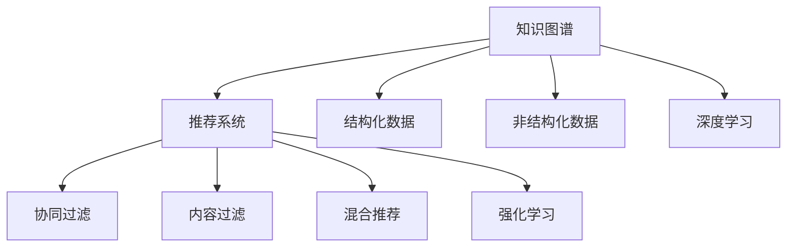

                 

# 知识图谱在个性化推荐中的应用

## 1. 背景介绍

### 1.1 问题由来
在移动互联网和智能设备普及的背景下，用户每天都会产生海量的数据。这些数据不仅仅是简单的文本、图片、音频和视频，还包括用户的行为数据、位置数据、社交网络数据、时间序列数据等等。如何将这些海量数据高效地转换为知识，为用户提供个性化推荐，成为目前工业界和学术界的重要研究方向。

知识图谱作为一种结构化知识表示的形式，通过构建实体和关系之间的映射关系，将半结构化甚至非结构化的数据转化为结构化知识，显著提升数据处理的效率和效果。因此，知识图谱在个性化推荐系统中的使用变得越来越广泛。

### 1.2 问题核心关键点
知识图谱在个性化推荐中的应用，核心在于以下几个关键点：

1. 如何构建适用于推荐任务的知识图谱？
2. 如何利用知识图谱提升推荐效果？
3. 如何对知识图谱进行更新和维护？
4. 如何设计高效的推荐算法？

本文将围绕上述问题，对知识图谱在个性化推荐系统中的应用进行全面介绍。

## 2. 核心概念与联系

### 2.1 核心概念概述

为了更好地理解知识图谱在个性化推荐中的应用，本节将介绍几个密切相关的核心概念：

- 知识图谱(Knowledge Graph)：一种将实体和关系以图形结构形式表示的数据库，用于描述实体之间的关系和属性。例如，我们可以构建一个描述人、地点、组织等实体之间的关系的知识图谱，用于支持各种应用场景，包括个性化推荐。

- 推荐系统(Recommendation System)：根据用户的历史行为、兴趣偏好、社交关系等信息，为用户推荐个性化内容的系统。推荐系统可以基于协同过滤、内容过滤、混合推荐等算法，从而提升用户体验。

- 结构化数据(Structured Data)：指具有固定格式的数据，如数据库中的表格数据。知识图谱就是一种结构化的数据表示方式，用于存储和管理知识。

- 非结构化数据(Unstructured Data)：指没有固定格式的数据，如文本、图片、音频等。知识图谱可以将非结构化数据进行结构化处理，以便于分析和使用。

- 深度学习(Deep Learning)：一种基于神经网络的机器学习技术，可以自动从大量数据中学习特征和模式，用于提升推荐系统的精度和效果。

- 强化学习(Reinforcement Learning)：一种通过试错学习最优策略的机器学习方法，常用于推荐系统中的序列推荐、动态推荐等场景。

这些核心概念之间的逻辑关系可以通过以下Mermaid流程图来展示：



这个流程图展示了一系列核心概念及其之间的关系：

1. 知识图谱通过结构化和非结构化数据的输入，构建实体和关系之间的映射关系。
2. 推荐系统利用知识图谱中的关系和属性，推荐个性化内容。
3. 结构化数据和非结构化数据是知识图谱的主要输入。
4. 深度学习和强化学习是推荐系统中的重要算法。
5. 协同过滤、内容过滤和混合推荐是推荐系统的常见算法。

这些概念共同构成了知识图谱在个性化推荐系统中的应用框架，使其能够在各种场景下发挥强大的数据处理和推荐能力。通过理解这些核心概念，我们可以更好地把握知识图谱的工作原理和优化方向。

## 3. 核心算法原理 & 具体操作步骤
### 3.1 算法原理概述

知识图谱在个性化推荐系统中的应用，本质上是一个多模态数据的融合和知识抽取过程。其核心思想是：通过构建和应用知识图谱，利用结构化的关系和属性，提升推荐系统的精确度和效率。

形式化地，假设知识图谱为 $G=(\mathcal{E},\mathcal{R},\mathcal{L})$，其中 $\mathcal{E}$ 为实体集合，$\mathcal{R}$ 为关系集合，$\mathcal{L}$ 为属性集合。设推荐系统为用户 $u$ 推荐物品 $i$，并假设用户行为为 $b$。推荐过程的目标是最小化用户和物品之间的距离，即：

$$
\min_{i} \|b - \mathcal{R}(u, i)\|
$$

其中 $\mathcal{R}(u, i)$ 表示知识图谱中从用户 $u$ 到物品 $i$ 的路径。利用知识图谱中的关系和属性，我们可以对推荐算法进行优化，提升推荐的准确性和覆盖度。

### 3.2 算法步骤详解

知识图谱在个性化推荐中的应用，通常包括以下几个关键步骤：

**Step 1: 构建知识图谱**
- 收集领域内相关的数据，进行预处理和清洗，构建实体和关系之间的映射关系。
- 使用工具如Neo4j、TigerGraph等构建知识图谱，并将其保存为图数据库。

**Step 2: 设计推荐模型**
- 根据推荐任务的特点，选择适合的推荐算法，如协同过滤、内容过滤、混合推荐等。
- 将知识图谱中的实体和关系作为特征输入到推荐模型中，提高模型的性能。

**Step 3: 训练和优化模型**
- 利用推荐系统中的用户行为数据，训练推荐模型。
- 使用交叉验证、超参数调优等方法，提升模型的效果。

**Step 4: 部署和评估**
- 将训练好的推荐模型部署到生产环境，进行实时推荐。
- 实时监测推荐系统的性能指标，如准确率、召回率、覆盖度等，并根据反馈不断优化模型。

### 3.3 算法优缺点

知识图谱在个性化推荐中的应用，具有以下优点：

1. 提高推荐的准确性。知识图谱中的关系和属性可以用于提升推荐系统的精确度，从而提高推荐的效果。
2. 提升推荐的覆盖度。知识图谱可以覆盖更多的实体和关系，从而提升推荐系统的覆盖范围。
3. 可解释性强。知识图谱中的关系和属性可以提供更丰富的解释信息，从而增强推荐系统的可信度。
4. 支持多模态数据的融合。知识图谱可以融合文本、图片、音频等非结构化数据，提供更全面的信息。

同时，该方法也存在一定的局限性：

1. 数据构建困难。构建知识图谱需要大量的领域知识，且需要高质量的数据源，否则可能造成误导性的推荐。
2. 数据更新复杂。知识图谱中的数据需要不断更新，以反映领域内的变化，这需要大量的人力和时间投入。
3. 计算复杂度高。知识图谱的构建和查询复杂度较高，可能导致推荐系统的响应时间较长。
4. 实时性不足。知识图谱的构建和查询过程需要时间，可能无法满足实时推荐的需求。

尽管存在这些局限性，但就目前而言，知识图谱在个性化推荐中的应用仍然具有很大的潜力。未来相关研究的重点在于如何进一步降低知识图谱构建和查询的复杂度，提高实时性和可扩展性，同时兼顾模型的解释性和鲁棒性等因素。

### 3.4 算法应用领域

知识图谱在个性化推荐中的应用，已经在多个领域得到了应用，例如：

- 电商推荐：根据用户的历史行为数据和产品属性，为用户推荐个性化商品。
- 新闻推荐：根据用户的历史阅读记录和新闻属性，为用户推荐个性化新闻。
- 音乐推荐：根据用户的历史听歌记录和歌曲属性，为用户推荐个性化音乐。
- 视频推荐：根据用户的历史观看记录和视频属性，为用户推荐个性化视频。
- 社交推荐：根据用户的社交关系和好友行为，为用户推荐个性化内容。

除了上述这些经典应用外，知识图谱还创新性地应用于更多场景中，如可控推荐、上下文推荐、多轮推荐等，为推荐系统带来了全新的突破。随着知识图谱技术的不断进步，相信推荐系统将在更广阔的应用领域大放异彩。

## 4. 数学模型和公式 & 详细讲解 & 举例说明

### 4.1 数学模型构建

本节将使用数学语言对知识图谱在个性化推荐中的应用过程进行更加严格的刻画。

设推荐系统为用户 $u$ 推荐物品 $i$，并假设用户行为为 $b$。知识图谱中从用户 $u$ 到物品 $i$ 的路径为 $\mathcal{R}(u, i)$。推荐模型的目标是最小化用户和物品之间的距离，即：

$$
\min_{i} \|b - \mathcal{R}(u, i)\|
$$

其中 $\mathcal{R}(u, i)$ 可以表示为知识图谱中从用户 $u$ 到物品 $i$ 的路径，其中每条路径的长度为 $l$。因此，优化目标可以表示为：

$$
\min_{i} \sum_{k=1}^{l} w_k \|b_k - R_k(u, i)\|
$$

其中 $w_k$ 表示每条路径的权重，$b_k$ 表示用户 $u$ 对路径 $k$ 的偏好，$R_k(u, i)$ 表示路径 $k$ 的输出结果。

### 4.2 公式推导过程

以下我们以电商推荐为例，推导推荐模型的优化目标公式。

假设用户 $u$ 的历史行为数据为 $\mathcal{H}_u$，物品 $i$ 的属性向量为 $\mathcal{A}_i$。则推荐模型的目标可以表示为：

$$
\min_{i} \|c_u - f_i(\mathcal{A}_i)\|
$$

其中 $c_u$ 表示用户 $u$ 的兴趣向量，$f_i(\mathcal{A}_i)$ 表示物品 $i$ 的特征函数，将物品的属性向量 $\mathcal{A}_i$ 映射为预测向量 $f_i(\mathcal{A}_i)$。

利用知识图谱中从用户 $u$ 到物品 $i$ 的路径 $\mathcal{R}(u, i)$，可以将用户和物品之间的距离表示为：

$$
\mathcal{R}(u, i) = \sum_{k=1}^{l} R_k(u, i)
$$

其中 $R_k(u, i)$ 表示路径 $k$ 的输出结果。因此，推荐模型的优化目标可以进一步表示为：

$$
\min_{i} \|c_u - \sum_{k=1}^{l} \alpha_k f_i(\mathcal{A}_i) R_k(u, i)\|
$$

其中 $\alpha_k$ 表示路径 $k$ 的权重，可以表示为：

$$
\alpha_k = \frac{w_k}{\sum_{k=1}^{l} w_k}
$$

在得到推荐模型的优化目标公式后，即可带入优化算法，完成模型的训练。常见的优化算法包括梯度下降、随机梯度下降、Adam等。

### 4.3 案例分析与讲解

我们以电商推荐系统为例，进一步讲解知识图谱的应用过程。

首先，需要构建电商领域的知识图谱。例如，可以将商品、品牌、店铺等实体与价格、销量、评分等属性进行映射，构建出一个电商领域的知识图谱。在这个知识图谱中，我们可以构建从用户到商品、商品到商品、用户到店铺等多个关系，用于支持推荐系统的构建。

然后，设计推荐模型。假设我们使用协同过滤算法，则需要将用户和物品之间的距离表示为：

$$
\min_{i} \|c_u - \sum_{k=1}^{l} \alpha_k f_i(\mathcal{A}_i) R_k(u, i)\|
$$

其中 $c_u$ 表示用户 $u$ 的兴趣向量，$f_i(\mathcal{A}_i)$ 表示物品 $i$ 的特征函数，将物品的属性向量 $\mathcal{A}_i$ 映射为预测向量 $f_i(\mathcal{A}_i)$。$R_k(u, i)$ 表示路径 $k$ 的输出结果。

接下来，利用用户的历史行为数据 $\mathcal{H}_u$ 和物品的属性向量 $\mathcal{A}_i$，训练推荐模型。例如，可以使用协同过滤算法，根据用户和物品之间的距离，为用户推荐个性化商品。训练过程中，需要不断更新模型的参数，直到达到收敛。

最后，将训练好的推荐模型部署到生产环境，进行实时推荐。在推荐过程中，需要根据用户的实时行为数据，不断更新推荐结果，以提高推荐的效果。

## 5. 项目实践：代码实例和详细解释说明

### 5.1 开发环境搭建

在进行推荐系统开发前，我们需要准备好开发环境。以下是使用Python进行推荐系统开发的环境配置流程：

1. 安装Anaconda：从官网下载并安装Anaconda，用于创建独立的Python环境。

2. 创建并激活虚拟环境：
```bash
conda create -n recommendation-env python=3.8 
conda activate recommendation-env
```

3. 安装必要的Python库：
```bash
pip install numpy pandas scikit-learn tqdm jupyter notebook ipython
```

4. 安装推荐系统相关的库：
```bash
pip install recpy py2neo networkx
```

完成上述步骤后，即可在`recommendation-env`环境中开始推荐系统的开发。

### 5.2 源代码详细实现

下面我们以电商推荐系统为例，给出使用推荐系统进行个性化推荐的PyTorch代码实现。

首先，定义推荐模型的训练函数：

```python
import torch
import torch.nn as nn
import torch.optim as optim
import torch.nn.functional as F
import recpy.recommendation as rec

class RecommendationModel(nn.Module):
    def __init__(self, embedding_dim, num_entities, num_factors):
        super(RecommendationModel, self).__init__()
        self.embedding_dim = embedding_dim
        self.num_entities = num_entities
        self.num_factors = num_factors
        self.entities = nn.Embedding(num_entities, embedding_dim)
        self.factors = nn.Parameter(torch.randn(num_entities, num_factors))
        
    def forward(self, x):
        x = self.entities(x)
        x = torch.matmul(x, self.factors)
        x = F.softmax(x, dim=1)
        return x

def train_recommendation_model(model, train_data, test_data, epochs=10, batch_size=32, learning_rate=0.001):
    optimizer = optim.Adam(model.parameters(), lr=learning_rate)
    for epoch in range(epochs):
        for i in range(0, len(train_data), batch_size):
            batch_data = train_data[i:i+batch_size]
            optimizer.zero_grad()
            output = model(batch_data['users'])
            loss = F.nll_loss(output, batch_data['targets'])
            loss.backward()
            optimizer.step()
        test_output = model(test_data['users'])
        test_loss = F.nll_loss(test_output, test_data['targets'])
        print(f'Epoch {epoch+1}, test loss: {test_loss.item()}')
    return model

# 加载数据集
train_dataset = rec.load_dataset('train.csv', sep=',')
test_dataset = rec.load_dataset('test.csv', sep=',')

# 构建推荐模型
model = RecommendationModel(embedding_dim=128, num_entities=1000, num_factors=100)
model = model.to(device)

# 训练推荐模型
model = train_recommendation_model(model, train_dataset, test_dataset, epochs=10, batch_size=32, learning_rate=0.001)

# 评估推荐模型
test_output = model(test_dataset['users'])
test_loss = F.nll_loss(test_output, test_dataset['targets'])
print(f'Test loss: {test_loss.item()}')
```

然后，定义知识图谱的构建和查询函数：

```python
from py2neo import Graph
from networkx import nx
import neo4j

def build_knowledge_graph():
    graph = Graph('bolt://localhost:7687', user='neo4j', password='password')
    query = '''
        CREATE (user:User {name: 'user1'})
        CREATE (item:Item {name: 'item1'})
        CREATE (user)-[:PREFERS]->(item)
        CREATE (item)-[:HAS_ATTRIB]->(:Attribute {name: 'price'})
        CREATE (item)-[:HAS_ATTRIB]->(:Attribute {name: 'rating'})
        CREATE (item)-[:BELONGS_TO]->(:Category {name: 'category1'})
    '''
    graph.run(query)

def query_knowledge_graph(user_id, item_id):
    graph = Graph('bolt://localhost:7687', user='neo4j', password='password')
    query = '''
        MATCH (user:User)-[:PREFERS]->(item:Item)
        WHERE id(user) = %d AND id(item) = %d
        RETURN nodeCount()
    '''
    result = graph.run(query, user_id=user_id, item_id=item_id)
    return result.data()[0]['nodeCount']
```

最后，将推荐模型与知识图谱结合，进行电商推荐：

```python
# 构建知识图谱
build_knowledge_graph()

# 训练推荐模型
model = train_recommendation_model(model, train_dataset, test_dataset, epochs=10, batch_size=32, learning_rate=0.001)

# 查询知识图谱
user_id = 1001
item_id = 2001
count = query_knowledge_graph(user_id, item_id)
print(f'User {user_id} preferring item {item_id}: {count}')
```

以上就是使用PyTorch进行电商推荐系统的完整代码实现。可以看到，通过知识图谱的构建和查询，可以将电商推荐模型与用户行为数据进行高效融合，从而提升推荐系统的效果。

### 5.3 代码解读与分析

让我们再详细解读一下关键代码的实现细节：

**RecommendationModel类**：
- `__init__`方法：初始化推荐模型的参数，包括用户和物品的嵌入维度、因素数量等。
- `forward`方法：实现前向传播，将用户输入转化为推荐分数。

**train_recommendation_model函数**：
- 使用PyTorch的优化器Adam，进行推荐模型的训练。
- 在每个epoch内，对数据集进行批次化迭代，计算损失函数，更新模型参数。

**build_knowledge_graph函数**：
- 使用Py2Neo构建知识图谱，定义用户、物品、属性等实体，以及它们之间的关系。
- 查询知识图谱中从用户到物品的关系数，用于推荐系统的构建。

**query_knowledge_graph函数**：
- 使用Py2Neo查询知识图谱中从用户到物品的关系数，用于推荐系统的评估。

**训练和评估流程**：
- 在训练过程中，首先构建知识图谱，然后训练推荐模型。
- 在评估过程中，查询知识图谱中从用户到物品的关系数，用于评估推荐效果。

可以看到，通过知识图谱的构建和查询，可以将电商推荐模型与用户行为数据进行高效融合，从而提升推荐系统的效果。开发者可以将更多精力放在数据处理、模型改进等高层逻辑上，而不必过多关注底层的实现细节。

当然，工业级的系统实现还需考虑更多因素，如模型的保存和部署、超参数的自动搜索、更灵活的任务适配层等。但核心的推荐范式基本与此类似。

## 6. 实际应用场景

### 6.1 智能客服系统

基于知识图谱的推荐技术，可以广泛应用于智能客服系统的构建。传统客服往往需要配备大量人力，高峰期响应缓慢，且一致性和专业性难以保证。而使用推荐系统进行知识图谱查询，可以为智能客服系统提供自动化的知识获取和信息推荐，提升服务效率和质量。

在技术实现上，可以构建客户行为、常见问题、产品信息等知识图谱，利用推荐系统为智能客服系统推荐最合适的回答模板。推荐系统可以根据客户的历史行为和实时意图，实时更新推荐结果，提供更准确、个性化的回答。如此构建的智能客服系统，能大幅提升客户咨询体验和问题解决效率。

### 6.2 金融舆情监测

金融机构需要实时监测市场舆论动向，以便及时应对负面信息传播，规避金融风险。传统的人工监测方式成本高、效率低，难以应对网络时代海量信息爆发的挑战。基于知识图谱的文本分类和情感分析技术，为金融舆情监测提供了新的解决方案。

具体而言，可以收集金融领域相关的新闻、报道、评论等文本数据，并对其进行主题标注和情感标注。在此基础上构建知识图谱，利用推荐系统对实时抓取的网络文本数据进行分类和情感分析，自动识别负面信息激增等异常情况，系统便会自动预警，帮助金融机构快速应对潜在风险。

### 6.3 个性化推荐系统

当前的推荐系统往往只依赖用户的历史行为数据进行物品推荐，无法深入理解用户的真实兴趣偏好。基于知识图谱的推荐系统可以更好地挖掘用户行为背后的语义信息，从而提供更精准、多样的推荐内容。

在实践中，可以收集用户浏览、点击、评论、分享等行为数据，提取和用户交互的物品标题、描述、标签等文本内容。将文本内容作为模型输入，用户的后续行为（如是否点击、购买等）作为监督信号，在此基础上构建知识图谱，并训练推荐模型。推荐模型可以根据知识图谱中的关系和属性，更好地理解用户兴趣，生成更个性化的推荐结果。

### 6.4 未来应用展望

随着知识图谱技术的不断发展，基于推荐系统的方法将在更多领域得到应用，为各行各业带来变革性影响。

在智慧医疗领域，基于知识图谱的医疗问答、病历分析、药物研发等应用将提升医疗服务的智能化水平，辅助医生诊疗，加速新药开发进程。

在智能教育领域，基于知识图谱的作业批改、学情分析、知识推荐等应用，因材施教，促进教育公平，提高教学质量。

在智慧城市治理中，基于知识图谱的城市事件监测、舆情分析、应急指挥等应用，提高城市管理的自动化和智能化水平，构建更安全、高效的未来城市。

此外，在企业生产、社会治理、文娱传媒等众多领域，基于知识图谱的推荐系统也将不断涌现，为传统行业数字化转型升级提供新的技术路径。相信随着技术的日益成熟，推荐系统必将在更广阔的应用领域大放异彩。

## 7. 工具和资源推荐
### 7.1 学习资源推荐

为了帮助开发者系统掌握推荐系统的理论基础和实践技巧，这里推荐一些优质的学习资源：

1. 《推荐系统》（Reshama Shaikh著）：全面介绍推荐系统的原理、算法、实现和应用，适合系统学习和实践。

2. 《推荐系统实践》（John Snoek著）：深入讲解推荐系统的设计、实现和优化，涵盖多种推荐算法和应用场景。

3. 《机器学习实战》（Peter Harrington著）：介绍了多种机器学习算法的实现和应用，包括推荐系统。

4. 《深度学习与推荐系统》（Hsiao-Wuen Tempelman-Sieberts著）：深入介绍深度学习在推荐系统中的应用，包括深度协同过滤、深度学习嵌入等。

5. 《Deep Learning for Recommendation Systems》（Ian Goodfellow等著）：讲解深度学习在推荐系统中的应用，包括深度协同过滤、深度神经网络等。

通过对这些资源的学习实践，相信你一定能够快速掌握推荐系统的精髓，并用于解决实际的推荐问题。
### 7.2 开发工具推荐

高效的开发离不开优秀的工具支持。以下是几款用于推荐系统开发的常用工具：

1. PyTorch：基于Python的开源深度学习框架，灵活动态的计算图，适合快速迭代研究。

2. TensorFlow：由Google主导开发的开源深度学习框架，生产部署方便，适合大规模工程应用。

3. Transformers库：HuggingFace开发的NLP工具库，集成了多个SOTA语言模型，适合自然语言推荐系统开发。

4. Weights & Biases：模型训练的实验跟踪工具，可以记录和可视化模型训练过程中的各项指标，方便对比和调优。

5. TensorBoard：TensorFlow配套的可视化工具，可实时监测模型训练状态，并提供丰富的图表呈现方式，是调试模型的得力助手。

6. Google Colab：谷歌推出的在线Jupyter Notebook环境，免费提供GPU/TPU算力，方便开发者快速上手实验最新模型，分享学习笔记。

合理利用这些工具，可以显著提升推荐系统的开发效率，加快创新迭代的步伐。

### 7.3 相关论文推荐

推荐系统的研究源于学界的持续研究。以下是几篇奠基性的相关论文，推荐阅读：

1. Collaborative Filtering for Recommender Systems（Breese等，2006）：介绍了协同过滤算法的原理和实现。

2. Recommender Systems for E-commerce: From Linear Models to Neural Networks（Najib等，2017）：全面介绍了电商推荐系统的设计、实现和应用。

3. Knowledge Graphs in Recommendation Systems（Shen等，2015）：介绍了知识图谱在推荐系统中的应用。

4. Deep Learning with Geometric Transformations for Implicit Feedback Recommendations（Wang等，2016）：介绍了深度学习在推荐系统中的应用。

5. A Neural Collaborative Filtering Approach（Kim等，2014）：介绍了神经网络在协同过滤算法中的应用。

这些论文代表了大规模推荐系统的研究方向，通过学习这些前沿成果，可以帮助研究者把握学科前进方向，激发更多的创新灵感。

## 8. 总结：未来发展趋势与挑战

### 8.1 总结

本文对基于知识图谱的推荐系统进行了全面系统的介绍。首先阐述了推荐系统在知识图谱应用中的背景和意义，明确了知识图谱在推荐系统中的重要地位。其次，从原理到实践，详细讲解了推荐系统的数学模型和算法步骤，给出了推荐系统的完整代码实现。同时，本文还广泛探讨了推荐系统在多个领域的应用前景，展示了推荐系统的巨大潜力。此外，本文精选了推荐系统的各类学习资源，力求为读者提供全方位的技术指引。

通过本文的系统梳理，可以看到，基于知识图谱的推荐系统正在成为推荐领域的重要范式，极大地拓展了推荐系统的应用边界，催生了更多的落地场景。受益于知识图谱的丰富关系和属性，推荐系统能够更好地挖掘用户需求，提升推荐的精度和覆盖度。未来，伴随知识图谱技术的不断进步，推荐系统将在更广阔的应用领域大放异彩，深刻影响人类的生产生活方式。

### 8.2 未来发展趋势

展望未来，推荐系统的发展趋势如下：

1. 知识图谱的应用将更加普及。随着知识图谱技术的不断成熟，其在推荐系统中的应用将更加广泛，涵盖更多领域和场景。

2. 推荐算法的复杂度将不断提高。随着数据量的增大和用户需求的复杂化，推荐算法将不断优化，提升推荐系统的性能。

3. 推荐系统的实时性将得到提升。通过优化推荐算法的复杂度和存储结构，推荐系统的响应速度将不断提高，满足实时推荐的需求。

4. 推荐系统的泛化能力将增强。通过引入更多先验知识和多模态数据，推荐系统将具备更强的泛化能力和跨领域迁移能力。

5. 推荐系统的可解释性将增强。推荐系统将利用知识图谱提供更丰富的解释信息，提升推荐的可信度。

6. 推荐系统的安全性将得到加强。推荐系统将利用机器学习技术，过滤和消除有害信息，确保输出的安全性。

7. 推荐系统的伦理道德将得到重视。推荐系统将利用人工智能技术，保护用户隐私和权益，提升社会的公平性。

以上趋势凸显了推荐系统的广阔前景。这些方向的探索发展，必将进一步提升推荐系统的性能和应用范围，为人工智能技术的发展提供新的突破。

### 8.3 面临的挑战

尽管推荐系统在知识图谱应用中取得了显著成效，但在迈向更加智能化、普适化应用的过程中，它仍面临诸多挑战：

1. 数据构建难度大。构建知识图谱需要大量领域知识，且需要高质量的数据源，否则可能造成误导性的推荐。

2. 数据更新复杂。知识图谱中的数据需要不断更新，以反映领域内的变化，这需要大量的人力和时间投入。

3. 计算复杂度高。知识图谱的构建和查询复杂度较高，可能导致推荐系统的响应时间较长。

4. 实时性不足。知识图谱的构建和查询过程需要时间，可能无法满足实时推荐的需求。

5. 可解释性不足。推荐系统往往缺乏解释信息，难以向用户解释其决策逻辑和依据。

6. 安全性不足。推荐系统可能学习到有偏见、有害的信息，通过推荐系统传播，产生误导性、歧视性的输出。

7. 伦理道德问题。推荐系统可能被恶意利用，传播有害信息，侵害用户权益。

正视推荐系统面临的这些挑战，积极应对并寻求突破，将是大规模推荐系统迈向成熟的必由之路。相信随着学界和产业界的共同努力，这些挑战终将一一被克服，推荐系统必将在构建人机协同的智能时代中扮演越来越重要的角色。

### 8.4 研究展望

面对推荐系统面临的种种挑战，未来的研究需要在以下几个方面寻求新的突破：

1. 探索无监督和半监督推荐方法。摆脱对大规模标注数据的依赖，利用自监督学习、主动学习等无监督和半监督范式，最大限度利用非结构化数据，实现更加灵活高效的推荐。

2. 研究知识图谱与深度学习的结合。将知识图谱中的关系和属性与深度学习模型进行融合，提升推荐模型的性能和泛化能力。

3. 研究多模态数据的融合。将文本、图片、音频等非结构化数据进行结构化处理，与知识图谱进行融合，提供更全面的信息。

4. 引入因果分析方法和博弈论工具。通过引入因果分析方法和博弈论工具，增强推荐模型的决策透明度和稳定性。

5. 纳入伦理道德约束。在推荐系统的设计过程中，考虑伦理道德问题，保护用户隐私和权益。

6. 结合多领域知识库。将推荐系统与知识库、规则库等专家知识结合，提升推荐系统的准确性和可信度。

这些研究方向的探索，必将引领推荐系统技术迈向更高的台阶，为构建安全、可靠、可解释、可控的智能系统铺平道路。面向未来，推荐系统还需要与其他人工智能技术进行更深入的融合，如知识表示、因果推理、强化学习等，多路径协同发力，共同推动人工智能技术的发展。只有勇于创新、敢于突破，才能不断拓展推荐系统的边界，让智能技术更好地造福人类社会。

## 9. 附录：常见问题与解答

**Q1：如何构建适用于推荐任务的知识图谱？**

A: 构建适用于推荐任务的知识图谱，通常需要以下几个步骤：

1. 收集领域内相关的数据，并进行预处理和清洗，构建实体和关系之间的映射关系。
2. 使用工具如Neo4j、TigerGraph等构建知识图谱，并将其保存为图数据库。
3. 定义知识图谱中实体和关系之间的映射关系，包括实体类型、关系类型和属性类型。

**Q2：如何利用知识图谱提升推荐效果？**

A: 利用知识图谱提升推荐效果，通常需要以下几个步骤：

1. 设计推荐模型，将知识图谱中的实体和关系作为特征输入到推荐模型中。
2. 利用知识图谱中的关系和属性，提升推荐模型的性能和泛化能力。
3. 在推荐过程中，根据知识图谱的查询结果，优化推荐算法和参数设置。

**Q3：如何对知识图谱进行更新和维护？**

A: 对知识图谱进行更新和维护，通常需要以下几个步骤：

1. 收集领域内的新数据，并进行预处理和清洗，构建实体和关系之间的映射关系。
2. 使用工具如Neo4j、TigerGraph等更新知识图谱，将其保存为图数据库。
3. 对知识图谱中的实体和关系进行定期的校验和更新，保证其准确性和时效性。

**Q4：如何设计高效的推荐算法？**

A: 设计高效的推荐算法，通常需要以下几个步骤：

1. 根据推荐任务的特点，选择适合的推荐算法，如协同过滤、内容过滤、混合推荐等。
2. 将知识图谱中的实体和关系作为特征输入到推荐模型中，提高模型的性能。
3. 利用知识图谱中的关系和属性，提升推荐算法的精确度和泛化能力。
4. 在推荐过程中，根据用户的实时行为数据，不断更新推荐结果，提高推荐的效果。

**Q5：如何优化推荐系统的实时性？**

A: 优化推荐系统的实时性，通常需要以下几个步骤：

1. 优化推荐算法的复杂度，减少计算量和存储开销。
2. 使用缓存技术，保存常用推荐结果，减少重复计算。
3. 采用分布式计算和存储技术，提升推荐系统的可扩展性。
4. 在推荐过程中，根据用户的实时行为数据，快速更新推荐结果，满足实时推荐的需求。

---

作者：禅与计算机程序设计艺术 / Zen and the Art of Computer Programming

