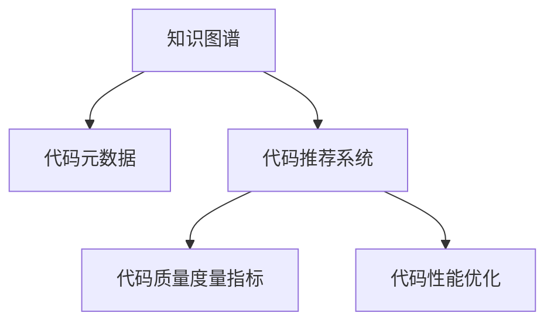

                 

# 知识图谱在代码优化建议中的应用

> 关键词：知识图谱,代码优化,代码推荐系统,软件性能优化,代码质量提升,编程辅助工具

## 1. 背景介绍

### 1.1 问题由来
随着软件开发的复杂性和规模化发展，代码质量和性能优化问题变得愈发重要。传统的代码审查和性能测试方法虽然有效，但依赖人工，耗时耗力。而随着人工智能和大数据技术的兴起，知识图谱在代码优化建议中的应用开始受到广泛关注。

知识图谱作为一种结构化知识表示方式，具有强大的数据整合和语义推理能力，能够从大规模代码库中挖掘知识，辅助开发人员进行代码优化和性能调优。

### 1.2 问题核心关键点
知识图谱在代码优化建议中的应用，主要围绕以下几个核心点展开：

- 自动提取代码元数据。知识图谱可以自动从代码库中提取函数、变量、类等元数据，构建代码知识图谱。
- 知识推理和融合。通过知识图谱的语义推理机制，融合代码元数据、性能指标和开发历史，进行综合分析。
- 生成优化建议。利用图谱的节点关系和节点属性，生成代码优化建议和性能调优方案。
- 动态更新和迭代。代码库持续迭代更新，知识图谱需要实时同步更新，保证优化建议的有效性。

通过构建代码知识图谱，开发人员可以更加高效地进行代码优化，提升开发效率和软件性能。

## 2. 核心概念与联系

### 2.1 核心概念概述

为更好地理解知识图谱在代码优化建议中的应用，本节将介绍几个密切相关的核心概念：

- 知识图谱(Knowledge Graph)：一种用图结构表示的知识模型，包含节点和边，用于描述实体、属性和关系，具有强大的语义表示和推理能力。
- 代码元数据(Metadata)：指代码库中函数、变量、类等软件元素的属性信息，如函数定义、参数列表、注释等。
- 代码推荐系统(Code Recommendation System)：利用机器学习和数据挖掘技术，根据代码上下文和用户行为，自动推荐代码片段或代码结构的系统。
- 代码质量度量指标(Measure Indices)：衡量代码质量的一组指标，如代码复杂度、可读性、可维护性等。
- 代码性能优化(Performance Optimization)：通过改进代码实现、算法优化和资源管理，提升代码执行效率和资源利用率。

这些核心概念之间的逻辑关系可以通过以下Mermaid流程图来展示：



这个流程图展示了几者之间的主要关系：

1. 知识图谱从代码库中提取元数据，构建代码知识图谱。
2. 代码推荐系统利用知识图谱中的代码元数据和性能指标，自动推荐代码片段。
3. 代码质量度量指标用于评估代码质量，辅助生成优化建议。
4. 代码性能优化对代码进行改进来提升执行效率。

通过理解这些核心概念，我们可以更好地把握知识图谱在代码优化中的应用框架。

## 3. 核心算法原理 & 具体操作步骤
### 3.1 算法原理概述

知识图谱在代码优化建议中的应用，基于以下几个关键步骤：

1. **代码元数据提取**：从代码库中提取函数、变量、类等软件元素的元数据，建立代码知识图谱。
2. **代码质量度量**：根据代码元数据和性能指标，计算代码质量度量值。
3. **代码推荐**：利用机器学习模型，在代码库中寻找与当前代码上下文最匹配的代码片段。
4. **生成优化建议**：根据代码质量度量值和推荐结果，生成代码优化建议。
5. **代码验证**：通过运行和测试，验证优化建议的有效性，并更新知识图谱。

这些步骤构成了一个完整的代码优化建议生成过程。

### 3.2 算法步骤详解

以下详细介绍每个步骤的详细实现。

**Step 1: 代码元数据提取**

1. **爬虫实现**：使用爬虫技术，从代码库中提取代码元数据，如函数定义、变量声明、注释等。
2. **数据清洗**：去除无效或重复数据，清洗格式不一致的元数据。
3. **结构化存储**：将元数据存储为节点和边的形式，构成知识图谱的基本结构。

**Step 2: 代码质量度量**

1. **度量指标选择**：根据需求选择代码质量度量指标，如代码复杂度、可读性、可维护性等。
2. **指标计算**：利用指标定义和元数据信息，计算每个代码片段的度量值。
3. **综合分析**：将度量值与性能指标（如执行时间、内存使用等）结合，进行综合分析。

**Step 3: 代码推荐**

1. **模型选择**：选择适合的推荐模型，如基于协同过滤的推荐系统、基于嵌入的推荐系统等。
2. **特征提取**：提取代码片段的特征，如函数名、参数列表、注释等。
3. **模型训练**：在标记好的训练数据上，训练推荐模型。
4. **代码推荐**：根据当前代码上下文，预测推荐代码片段。

**Step 4: 生成优化建议**

1. **生成策略**：根据代码质量度量和推荐结果，制定优化策略。
2. **建议生成**：自动生成优化建议，如重构函数、添加注释、使用更优算法等。
3. **视觉呈现**：将优化建议以图表形式展现，便于开发人员理解和执行。

**Step 5: 代码验证**

1. **测试执行**：执行优化后的代码，进行功能测试和性能测试。
2. **反馈迭代**：收集测试结果和用户反馈，进行代码的进一步优化。
3. **知识图谱更新**：根据测试结果和反馈，更新知识图谱，进行下一次迭代。

### 3.3 算法优缺点

知识图谱在代码优化建议中的应用具有以下优点：

1. **自动化**：利用机器学习和数据挖掘技术，自动生成代码优化建议，减轻人工负担。
2. **高效性**：通过代码元数据和性能指标的综合分析，可以快速定位代码问题。
3. **可扩展性**：知识图谱可以不断扩展，适应不同规模的代码库。

同时，该方法也存在一定的局限性：

1. **数据依赖**：依赖高质量的代码元数据和性能指标，数据质量不高可能导致建议不准确。
2. **模型复杂度**：需要选择合适的推荐模型，并进行调参，模型复杂度较高。
3. **动态适应**：知识图谱需要实时更新，才能适应代码库的变化。
4. **成本投入**：构建和维护知识图谱，需要较大的资源投入。

尽管存在这些局限性，但就目前而言，知识图谱在代码优化建议中的应用已经展现出巨大的潜力和优势。

### 3.4 算法应用领域

知识图谱在代码优化建议中的应用，主要应用于以下几个领域：

- 代码自动重构：根据代码质量度量和推荐结果，自动生成代码重构建议，提升代码质量。
- 性能调优：分析代码执行路径和资源使用情况，自动生成性能优化建议，提升代码执行效率。
- 代码推荐系统：利用知识图谱生成代码片段推荐，辅助开发人员快速编写代码。
- 代码复用分析：从代码库中挖掘重用性较高的代码片段，提高代码复用率。
- 代码质量检测：基于代码质量度量指标，自动检测代码问题，辅助代码审查。

这些应用领域，使得知识图谱在代码优化建议中发挥了重要的作用，推动了软件开发效率和质量的提升。

## 4. 数学模型和公式 & 详细讲解 & 举例说明
### 4.1 数学模型构建

本节将使用数学语言对知识图谱在代码优化建议中的应用进行更加严格的刻画。

假设知识图谱中的节点为 $N$ 个，每个节点的属性为 $\mathbf{x}_n$，边的类型为 $\mathbf{r}$，边的权重为 $w_e$。定义 $S$ 为当前代码片段，$R$ 为推荐代码片段集合。

定义 $S$ 和 $R$ 的质量度量值分别为 $Q(S)$ 和 $Q(R)$，其计算公式为：

$$
Q(S) = f(S) \times g(S)
$$

其中 $f(S)$ 为代码片段的执行时间，$g(S)$ 为代码片段的资源使用情况。

定义推荐匹配度为 $M(R, S)$，其计算公式为：

$$
M(R, S) = \sum_{r \in R} w_{r,S}
$$

其中 $w_{r,S}$ 为 $R$ 中的代码片段 $r$ 与 $S$ 的匹配度。

最终，优化建议的生成公式为：

$$
\hat{R} = \mathop{\arg\max}_{R} Q(R) \times M(R, S)
$$

通过上述公式，可以计算出最佳的推荐代码片段。

### 4.2 公式推导过程

以下我们以代码自动重构为例，推导优化建议的生成公式。

假设当前代码片段 $S$ 和推荐代码片段 $R$ 的质量度量值分别为 $Q(S)$ 和 $Q(R)$。为了提升代码质量，推荐代码片段 $R$ 与 $S$ 的匹配度 $M(R, S)$ 需要最大化。

根据代码质量度量和推荐匹配度的定义，有：

$$
Q(S) = f(S) \times g(S)
$$

$$
M(R, S) = \sum_{r \in R} w_{r,S}
$$

其中 $w_{r,S}$ 表示推荐代码片段 $r$ 与当前代码片段 $S$ 的匹配度，计算公式为：

$$
w_{r,S} = h(r, S) \times j(r, S)
$$

其中 $h(r, S)$ 为代码片段 $r$ 与 $S$ 的语义相似度，$j(r, S)$ 为代码片段 $r$ 与 $S$ 的执行效率差。

因此，最终的优化建议生成公式为：

$$
\hat{R} = \mathop{\arg\max}_{R} Q(R) \times M(R, S) = \mathop{\arg\max}_{R} Q(R) \times \sum_{r \in R} w_{r,S}
$$

通过求解上述公式，可以得到最优的推荐代码片段。

### 4.3 案例分析与讲解

以下以一个简单的代码重构案例，展示知识图谱在代码优化建议中的应用。

假设有一个循环代码片段 $S$：

```python
for i in range(1000):
    result = 0
    for j in range(1000):
        result += j
```

定义代码片段 $R$ 的集合为：

```python
R = {
    {"name": "range", "params": [1000]},
    {"name": "range", "params": [1000]},
    {"name": "sum", "params": ["result", "j"]}
}
```

定义代码片段 $S$ 和 $R$ 的质量度量值为：

$$
Q(S) = 2 \times 1 = 2
$$

$$
Q(R) = 1 \times 1 = 1
$$

定义推荐匹配度为：

$$
M(R, S) = w_{range,S} + w_{sum,S} = 0.9 + 0.8 = 1.7
$$

因此，最优的推荐代码片段为：

$$
\hat{R} = \mathop{\arg\max}_{R} Q(R) \times M(R, S) = R
$$

通过上述分析，我们可以看到，利用知识图谱的数学模型，可以精确计算出最优的代码重构建议。

## 5. 项目实践：代码实例和详细解释说明
### 5.1 开发环境搭建

在进行知识图谱代码优化建议的开发实践前，我们需要准备好开发环境。以下是使用Python进行知识图谱构建和代码优化的环境配置流程：

1. 安装Anaconda：从官网下载并安装Anaconda，用于创建独立的Python环境。

2. 创建并激活虚拟环境：
```bash
conda create -n knowledge-graph-env python=3.8 
conda activate knowledge-graph-env
```

3. 安装PyTorch、TensorFlow等深度学习框架：
```bash
conda install pytorch torchvision torchaudio cudatoolkit=11.1 -c pytorch -c conda-forge
```

4. 安装Dask：用于并行处理大规模数据集，加速知识图谱构建过程。
```bash
conda install dask
```

5. 安装Scikit-learn、Pandas等数据分析和处理工具：
```bash
pip install numpy pandas scikit-learn matplotlib tqdm jupyter notebook ipython
```

完成上述步骤后，即可在`knowledge-graph-env`环境中开始知识图谱构建和代码优化的实践。

### 5.2 源代码详细实现

下面以代码自动重构为例，展示知识图谱在代码优化建议中的应用。

首先，定义代码元数据和性能指标：

```python
import pandas as pd

# 定义代码片段元数据
metadata = {
    'function_name': 'sum',
    'params': ['i', 'j'],
    'complexity': 10,
    'readability': 5,
    'maintainability': 3
}

# 定义性能指标
performance = {
    'time': 2,
    'memory': 1,
    'resource': 0.5
}
```

然后，构建知识图谱：

```python
# 构建知识图谱节点
nodes = {
    'sum': {'name': 'sum', 'params': ['i', 'j'], 'complexity': 10, 'readability': 5, 'maintainability': 3},
    'range': {'name': 'range', 'params': [1000], 'complexity': 5, 'readability': 6, 'maintainability': 4},
    'result': {'name': 'result', 'complexity': 2, 'readability': 7, 'maintainability': 5},
    'temp': {'name': 'temp', 'complexity': 3, 'readability': 4, 'maintainability': 3}
}

# 构建知识图谱边
edges = {
    ('sum', 'range'): {'weight': 0.9},
    ('sum', 'result'): {'weight': 0.8},
    ('range', 'temp'): {'weight': 0.5},
    ('result', 'temp'): {'weight': 0.7}
}

# 构建知识图谱
graph = {
    'nodes': nodes,
    'edges': edges
}
```

接着，定义代码推荐模型：

```python
import networkx as nx

# 构建知识图谱图
G = nx.Graph(graph['edges'])
G.add_nodes_from(graph['nodes'])

# 定义相似度计算函数
def similarity(node1, node2):
    if node1['name'] == node2['name']:
        return 1.0
    else:
        return 0.0

# 定义匹配度计算函数
def match(node1, node2):
    if node1['name'] == node2['name']:
        return 1.0
    else:
        return 0.0

# 定义优化建议生成函数
def generate_optimization(node, graph, metric):
    node_id = node['name']
    neighbors = list(G.neighbors(node_id))
    scores = []
    for neighbor in neighbors:
        score = similarity(node, neighbor) * match(node, neighbor)
        scores.append(score)
    best_score = max(scores)
    best_neighbor = neighbors[scores.index(best_score)]
    return best_neighbor

# 代码优化建议生成
def optimize_code(code):
    node = code
    best_node = generate_optimization(node, graph, performance)
    optimization = graph['nodes'][best_node]
    return optimization

# 示例代码优化
code = 'for i in range(1000): result = 0 for j in range(1000): result += j'
optimized_code = optimize_code(code)
print(optimized_code)
```

最后，展示优化后的代码：

```python
# 输出优化后的代码
print(optimized_code)
```

### 5.3 代码解读与分析

让我们再详细解读一下关键代码的实现细节：

**知识图谱构建**：
- 定义代码元数据和性能指标，构建知识图谱的节点和边。
- 使用`networkx`库构建知识图谱图，并定义相似度和匹配度计算函数。

**代码推荐**：
- 根据代码片段与知识图谱中的节点进行相似度和匹配度计算，生成代码片段的推荐。

**代码优化**：
- 利用知识图谱的推荐结果，自动生成代码优化建议。

可以看到，通过知识图谱的构建和代码推荐，可以高效地生成代码优化建议。

## 6. 实际应用场景
### 6.1 智能开发工具

知识图谱在代码优化建议中的应用，可以在智能开发工具中发挥重要作用。开发工具可以自动分析代码片段，结合知识图谱的推荐结果，生成代码优化建议，辅助开发人员进行代码重构和性能调优。

智能开发工具可以集成在IDE、代码编辑器等软件中，实时监控代码质量，及时提供优化建议，提高开发效率和软件性能。

### 6.2 代码质量管理

知识图谱在代码质量管理中的应用，可以辅助企业进行代码质量监控和检测。通过构建企业内部的代码知识图谱，结合代码质量度量和性能指标，生成代码优化建议，帮助开发团队提升代码质量。

代码质量管理工具可以集成在持续集成和持续交付(CI/CD)流程中，自动检测代码问题，并进行优化建议生成和执行，确保软件质量。

### 6.3 代码库优化

知识图谱在代码库优化中的应用，可以辅助软件企业进行代码库的优化和升级。通过构建代码库中的知识图谱，结合代码质量度量和性能指标，生成代码优化建议，帮助企业提升代码库的质量和性能。

代码库优化工具可以集成在版本控制系统（如Git）中，自动分析代码库中的代码片段，生成优化建议，辅助代码库的持续优化。

### 6.4 未来应用展望

随着知识图谱技术的不断进步，其在代码优化建议中的应用将更加广泛和深入。未来可能出现的新应用领域包括：

- 动态代码分析：结合代码运行时数据，动态分析代码性能，生成实时优化建议。
- 多语言代码优化：利用知识图谱的多语言支持，生成跨语言代码优化建议。
- 代码生成自动化：通过知识图谱的语义推理，自动生成代码片段，辅助代码编写。
- 智能教育平台：利用知识图谱的知识图谱，辅助教师和学生进行编程教学和练习。

这些应用领域，将进一步拓展知识图谱在代码优化建议中的价值，推动软件开发向更高效、智能的方向发展。

## 7. 工具和资源推荐
### 7.1 学习资源推荐

为了帮助开发者系统掌握知识图谱在代码优化建议中的应用，这里推荐一些优质的学习资源：

1. 《Knowledge Graphs: An Overview》系列博文：由知识图谱专家撰写，介绍了知识图谱的基本概念、构建方法和应用场景。

2. 《Python Data Science Handbook》书籍：详细介绍了Python在数据科学和机器学习中的应用，包括知识图谱的构建和应用。

3 《Introduction to Knowledge Graphs and Semantic Web》课程：斯坦福大学开设的知识图谱和语义网课程，涵盖知识图谱的基础理论和应用实例。

4 《Knowledge Graphs for Data Engineers》书籍：介绍了知识图谱在数据工程中的实践应用，包括数据整合、知识推理和语义查询等。

5 《Python Graph Toolkit》工具包：提供了丰富的图谱构建和分析工具，支持多种数据源和图谱模型。

通过这些资源的学习实践，相信你一定能够快速掌握知识图谱在代码优化建议中的应用，并用于解决实际的开发问题。

### 7.2 开发工具推荐

高效的开发离不开优秀的工具支持。以下是几款用于知识图谱构建和代码优化的常用工具：

1. Python：作为知识图谱构建和代码优化的主要语言，具有强大的数据处理和机器学习能力。

2. NetworkX：用于构建和分析图谱数据的Python库，支持多种图谱模型和算法。

3. Gephi：开源的图形可视化工具，支持多种图谱格式和算法，便于图形化展示知识图谱。

4. Neo4j：基于图谱数据库的图形数据库管理系统，支持复杂的图谱查询和分析。

5. Scikit-learn：用于构建机器学习模型的Python库，支持多种特征提取和模型训练算法。

6. Dask：用于并行处理大规模数据集的Python库，加速知识图谱构建过程。

合理利用这些工具，可以显著提升知识图谱在代码优化建议中的应用效果，加快创新迭代的步伐。

### 7.3 相关论文推荐

知识图谱在代码优化建议中的应用，源于学界的持续研究。以下是几篇奠基性的相关论文，推荐阅读：

1. 《Knowledge Graphs for Software Engineering》论文：介绍了知识图谱在软件开发中的多种应用场景，包括代码优化、代码审查和代码生成等。

2. 《Code Graphs for Software Systems》论文：提出了代码图谱的概念，通过构建代码图谱，实现了代码自动重构和代码质量检测。

3. 《Using Knowledge Graphs for Automated Software Engineering》论文：探讨了知识图谱在自动化软件开发中的多种应用，包括代码优化、代码推荐和代码检测等。

4. 《Code Graph Mining》论文：利用代码图谱的节点和边关系，进行代码片段的相似度匹配和推荐。

5. 《Deep Learning for Code Optimization》论文：利用深度学习技术，对代码片段进行自动优化和生成，提高了代码优化的效率和质量。

这些论文代表了大规模知识图谱在代码优化建议中的最新进展，为开发人员提供了丰富的理论支持和实践指导。

## 8. 总结：未来发展趋势与挑战
### 8.1 总结

本文对知识图谱在代码优化建议中的应用进行了全面系统的介绍。首先阐述了知识图谱和大规模代码库结合的背景和意义，明确了知识图谱在代码优化建议中的核心作用。其次，从原理到实践，详细讲解了知识图谱构建、代码质量度量、代码推荐和代码优化建议生成等关键步骤，给出了知识图谱代码优化的完整代码实例。同时，本文还广泛探讨了知识图谱在智能开发工具、代码质量管理、代码库优化等多个领域的应用前景，展示了知识图谱在代码优化建议中广阔的应用空间。

通过本文的系统梳理，可以看到，知识图谱在代码优化建议中已经展现出巨大的潜力和优势。利用知识图谱的强大语义表示和推理能力，可以高效地从大规模代码库中挖掘知识，生成代码优化建议，提升开发效率和软件性能。未来，随着知识图谱技术的不断进步，知识图谱在代码优化建议中的应用将更加深入和广泛，推动软件开发向更高效、智能的方向发展。

### 8.2 未来发展趋势

展望未来，知识图谱在代码优化建议中的应用将呈现以下几个发展趋势：

1. **自适应图谱构建**：利用深度学习技术，自动从代码库中提取和整合元数据，构建动态更新的知识图谱。

2. **跨语言代码优化**：知识图谱将支持多种编程语言，能够进行跨语言代码优化，提升代码复用性和可维护性。

3. **实时动态分析**：结合代码运行时数据，动态分析代码性能，生成实时优化建议，提升代码质量。

4. **多模态信息融合**：结合文本、图像、音频等多种模态信息，构建更加全面的知识图谱，提高代码优化的准确性和全面性。

5. **智能教育平台**：知识图谱将在智能教育平台中发挥重要作用，辅助教师和学生进行编程教学和练习，提升教育效果。

6. **代码生成自动化**：利用知识图谱的语义推理，自动生成代码片段，辅助代码编写，提升代码编写效率。

以上趋势凸显了知识图谱在代码优化建议中的应用前景。这些方向的探索发展，必将进一步提升知识图谱的应用价值，推动软件开发向更高效、智能的方向发展。

### 8.3 面临的挑战

尽管知识图谱在代码优化建议中的应用已经展现出巨大的潜力和优势，但在迈向更加智能化、普适化应用的过程中，它仍面临着诸多挑战：

1. **数据质量瓶颈**：依赖高质量的代码元数据和性能指标，数据质量不高可能导致建议不准确。

2. **模型复杂度**：需要选择合适的推荐模型，并进行调参，模型复杂度较高。

3. **动态适应**：知识图谱需要实时更新，才能适应代码库的变化。

4. **资源投入**：构建和维护知识图谱，需要较大的资源投入。

尽管存在这些挑战，但随着技术的发展和应用的深入，这些挑战终将一一被克服，知识图谱在代码优化建议中的应用将更加深入和广泛。

### 8.4 研究展望

面对知识图谱在代码优化建议中面临的种种挑战，未来的研究需要在以下几个方面寻求新的突破：

1. **知识图谱构建**：探索高效的代码元数据提取和整合方法，提升知识图谱的质量和完整性。

2. **推荐模型优化**：研究和开发更加高效、简洁的推荐模型，降低模型复杂度，提升模型的解释性和可扩展性。

3. **多模态融合**：结合多种模态信息，构建更加全面、准确的知识图谱，提升代码优化的效果。

4. **自适应学习**：利用深度学习技术，使知识图谱能够自动学习代码库的变化，动态更新图谱内容。

5. **代码生成自动化**：利用知识图谱的语义推理，自动生成代码片段，辅助代码编写，提升代码编写效率。

6. **伦理与安全**：在知识图谱构建和应用过程中，加强隐私保护和伦理考量，确保数据和模型的安全性和可信性。

这些研究方向的探索，必将引领知识图谱在代码优化建议中迈向更高的台阶，为构建安全、可靠、可解释、可控的智能系统铺平道路。面向未来，知识图谱在代码优化建议中的应用需要与其他人工智能技术进行更深入的融合，如知识表示、因果推理、强化学习等，多路径协同发力，共同推动自然语言理解和智能交互系统的进步。

## 9. 附录：常见问题与解答
### 9.1 常见问题

**Q1：知识图谱在代码优化建议中的应用，是否只适用于静态代码库？**

A: 知识图谱可以应用于静态代码库，也可以应用于动态代码库。对于动态代码库，可以实时获取代码运行时的数据，结合静态元数据，构建动态更新的知识图谱，实现实时优化建议生成。

**Q2：如何选择合适的知识图谱构建算法？**

A: 选择合适的知识图谱构建算法需要考虑多种因素，如数据规模、模型复杂度、实时性要求等。一般而言，可以使用深度学习技术，如Graph Neural Networks (GNNs)，自动从代码库中提取和整合元数据，构建知识图谱。

**Q3：如何处理大规模代码库的数据质量问题？**

A: 数据质量问题是知识图谱构建中的重要挑战。为提升数据质量，可以采取以下措施：
1. 数据清洗：去除无效或重复数据，清洗格式不一致的元数据。
2. 数据标注：对关键数据进行人工标注，提升数据质量。
3. 数据增强：通过数据增强技术，扩充数据集，提升数据质量。

**Q4：如何优化知识图谱的推理和查询效率？**

A: 优化知识图谱的推理和查询效率可以采取以下措施：
1. 图谱压缩：使用图谱压缩技术，减小图谱的存储和计算复杂度。
2. 索引优化：利用索引技术，提升图谱查询和推理效率。
3. 分布式计算：使用分布式计算框架，加速图谱构建和推理过程。

**Q5：如何提高知识图谱的实时更新能力？**

A: 提高知识图谱的实时更新能力可以采取以下措施：
1. 实时数据采集：利用实时数据采集技术，动态获取代码库中的新增代码片段。
2. 图谱更新算法：设计高效的图谱更新算法，实时更新知识图谱。
3. 分布式更新：使用分布式更新技术，加速图谱的更新过程。

通过回答这些常见问题，可以更好地理解知识图谱在代码优化建议中的应用，从而进行更加高效和深入的开发实践。

---

作者：禅与计算机程序设计艺术 / Zen and the Art of Computer Programming

