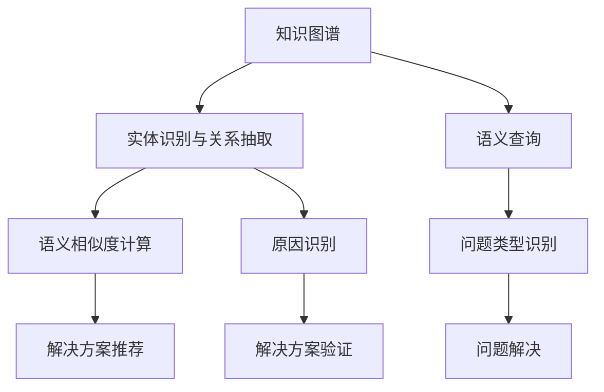

                 

## 1. 背景介绍

在现代软件开发中，程序员经常遇到各种各样的问题。无论是编写代码、调试bug，还是优化性能、设计架构，都需要深厚的知识和经验。然而，知识储备有限、经验不足的开发者，在遇到复杂问题时往往无从下手，导致效率低下，甚至陷入死胡同。如何辅助程序员高效解决这些问题，是软件开发领域的重要课题。

知识图谱（Knowledge Graph）作为一种新兴的技术，为解决这一问题提供了新的思路。知识图谱是一种以实体和关系为中心的语义网，通过构建概念、属性、关系等知识单元，将不同领域的数据结构化和关联化。在程序员问题诊断中，知识图谱可以整合程序设计语言、框架、工具、库等方面的知识，为程序员提供更精准的问题诊断支持。

## 2. 核心概念与联系

### 2.1 核心概念概述

**知识图谱**：一种基于实体和关系的语义网络，用于描述实体之间的关系，并提供推理和查询功能。常见知识图谱包括Freebase、DBpedia、LinkedData等。

**程序员问题诊断**：指基于程序员在日常工作中遇到的问题，借助知识图谱中的知识，快速识别问题类型、原因和解决方案。

**语义查询**：在知识图谱中，通过自然语言查询问题，获取最相关的知识节点和关系，辅助问题解决。

**实体识别与关系抽取**：从程序员提出的问题中，识别出相关的实体和关系，映射到知识图谱中对应的节点和边。

**语义相似度计算**：计算程序员输入问题与知识图谱中的问题描述的语义相似度，选择最相关的知识进行推荐。

**推理与验证**：利用知识图谱中的推理规则，对问题进行推理，验证解决方案的可行性和可靠性。

这些核心概念之间的关系，可以通过以下Mermaid流程图来展示：



这个流程图展示了知识图谱在程序员问题诊断中的核心过程，从问题输入到最终解决的各个步骤。

### 2.2 核心概念原理和架构

知识图谱的构建可以分为三步：实体抽取、关系抽取和知识融合。以下将详细阐述这些核心概念的原理和架构。

**实体抽取**：从程序员输入的描述中，自动提取文本中的命名实体，如函数名、变量名、类名等，并映射到知识图谱中对应的实体节点。实体抽取技术包括基于规则、基于统计和基于深度学习的方法。

**关系抽取**：从程序员输入的描述中，抽取实体之间的关系，如调用关系、继承关系、依赖关系等，并映射到知识图谱中对应的边。关系抽取方法包括基于规则、基于图神经网络和基于语义理解的方法。

**知识融合**：将抽取的实体和关系，融合到知识图谱中，形成完整的知识单元。知识融合技术包括知识推理、实体对齐和关系融合等。

## 3. 核心算法原理 & 具体操作步骤

### 3.1 算法原理概述

知识图谱在程序员问题诊断中的应用，主要分为两个步骤：问题诊断和解决方案推荐。

**问题诊断**：利用知识图谱中的实体和关系，对程序员输入的问题进行语义理解和匹配，识别问题类型和原因。

**解决方案推荐**：根据识别出的问题类型和原因，在知识图谱中查找最相关的解决方案，并返回给程序员。

这两个步骤的核心算法包括实体识别、关系抽取、语义相似度计算和推理验证等。

### 3.2 算法步骤详解

#### 3.2.1 实体识别

实体识别是知识图谱构建和问题诊断的基础。对于程序员输入的描述，可以使用自然语言处理（NLP）技术进行命名实体识别，如函数名、变量名、类名等，并映射到知识图谱中对应的实体节点。

具体步骤如下：

1. **分词与词性标注**：将问题描述进行分词和词性标注，识别出可能的命名实体。
2. **命名实体识别**：利用NLP技术，识别出具有特定属性的实体，如函数名、变量名、类名等。
3. **实体映射**：将识别出的实体，映射到知识图谱中对应的节点。

#### 3.2.2 关系抽取

关系抽取是识别问题原因和解决方案的重要步骤。对于程序员输入的描述，抽取实体之间的关系，如调用关系、继承关系、依赖关系等，并映射到知识图谱中对应的边。

具体步骤如下：

1. **句法分析**：对问题描述进行句法分析，识别出实体和实体之间的关系。
2. **语义分析**：利用NLP技术，对实体之间的关系进行语义分析，识别出实体的属性和关系类型。
3. **关系映射**：将识别出的关系，映射到知识图谱中对应的边。

#### 3.2.3 语义相似度计算

语义相似度计算是问题诊断中的关键步骤，用于匹配程序员输入的问题和知识图谱中的问题描述，选择最相关的知识进行推荐。

具体步骤如下：

1. **向量表示**：将问题描述和知识图谱中的问题描述，转化为向量表示。
2. **相似度计算**：利用向量相似度计算方法（如余弦相似度、Jaccard相似度等），计算问题描述和知识图谱中问题的语义相似度。
3. **匹配选择**：选择最相似的知识点进行推荐。

#### 3.2.4 推理验证

推理验证是解决方案推荐的最后一步，用于验证解决方案的可行性和可靠性。

具体步骤如下：

1. **规则推理**：利用知识图谱中的推理规则，对问题进行推理，验证解决方案的可行性。
2. **模型验证**：使用机器学习模型，对解决方案进行验证，确保其能够解决问题。
3. **反馈修正**：根据验证结果，修正解决方案，直至找到最佳解决方案。

### 3.3 算法优缺点

**优点**：

- 能够快速识别程序员输入的问题类型和原因，辅助问题解决。
- 能够根据问题类型和原因，推荐最相关的解决方案。
- 利用知识图谱中的知识，能够提升问题解决的准确性和效率。

**缺点**：

- 知识图谱构建和维护需要大量时间和人力成本。
- 知识图谱中的知识可能存在偏差和不完整，影响解决方案的准确性。
- 对大规模复杂问题的处理能力有限，需要进一步优化。

### 3.4 算法应用领域

知识图谱在程序员问题诊断中的应用，主要包括以下几个领域：

- **代码调试**：帮助程序员识别代码中的bug，并提供修复建议。
- **技术选型**：根据项目需求，推荐最适合的技术框架和库。
- **性能优化**：帮助程序员识别性能瓶颈，并提供优化建议。
- **系统设计**：辅助程序员设计系统的架构和组件。
- **知识共享**：将知识图谱中的知识分享给其他开发者，提升整个团队的技术水平。

## 4. 数学模型和公式 & 详细讲解 & 举例说明

### 4.1 数学模型构建

知识图谱在程序员问题诊断中的应用，主要涉及NLP、图神经网络和知识推理等数学模型。

**命名实体识别**：

- 使用条件随机场（CRF）或递归神经网络（RNN）等模型，识别文本中的命名实体。
- 使用BIO标注方法，对实体进行标记。

**关系抽取**：

- 使用基于图神经网络（GNN）的方法，提取实体之间的关系。
- 使用GraphSAGE、GAT等模型，进行关系抽取。

**语义相似度计算**：

- 使用余弦相似度、Jaccard相似度等方法，计算问题描述和知识图谱中问题的语义相似度。
- 使用TF-IDF、Word2Vec等模型，将问题描述和知识描述转化为向量表示。

**推理验证**：

- 使用基于规则的方法，进行推理验证。
- 使用机器学习模型，如逻辑回归、支持向量机等，验证解决方案的可行性。

### 4.2 公式推导过程

以下是对核心算法公式的推导过程：

**命名实体识别**：

$$
P(Y_i|X_i, \theta) = \frac{e^{W^T_i X_i}}{\sum_{j=1}^n e^{W^T_j X_j}}
$$

其中，$X_i$ 为问题描述，$Y_i$ 为识别出的实体，$W_i$ 为命名实体识别模型的权重矩阵。

**关系抽取**：

$$
P(R_i|X_i, \theta) = \frac{e^{W^T_i X_i}}{\sum_{j=1}^n e^{W^T_j X_j}}
$$

其中，$X_i$ 为问题描述，$R_i$ 为抽取出的关系，$W_i$ 为关系抽取模型的权重矩阵。

**语义相似度计算**：

$$
\text{Similarity}(X, Y) = \frac{\sum_{i=1}^n \text{cos}(\theta_i^T X \cdot \theta_i^T Y)}{\sqrt{\sum_{i=1}^n \theta_i^T X^2} \cdot \sqrt{\sum_{i=1}^n \theta_i^T Y^2}}
$$

其中，$X$ 和 $Y$ 分别为问题描述和知识描述，$\theta_i$ 为TF-IDF或Word2Vec等向量化模型中的权重向量。

**推理验证**：

$$
\text{Validity}(X, Y) = \frac{\sum_{i=1}^n \text{cos}(\theta_i^T X \cdot \theta_i^T Y)}{\sqrt{\sum_{i=1}^n \theta_i^T X^2} \cdot \sqrt{\sum_{i=1}^n \theta_i^T Y^2}}
$$

其中，$X$ 和 $Y$ 分别为推理问题描述和解决方案描述，$\theta_i$ 为推理模型中的权重向量。

### 4.3 案例分析与讲解

以下是一个具体的案例分析：

假设程序员输入以下问题：

> “为什么我的程序在运行时出现NullPointerException？”

1. **实体识别**：识别出实体“NullPointerException”。
2. **关系抽取**：抽取实体之间的关系“程序运行”。
3. **语义相似度计算**：计算问题描述与知识图谱中的问题描述的相似度，找到最相关的知识点。
4. **推理验证**：利用知识图谱中的规则，验证解决方案的可行性，确保推荐的知识能够解决问题。

最终，知识图谱推荐解决方案：“请检查调用空指针的方法，确保参数不为空。”

## 5. 项目实践：代码实例和详细解释说明

### 5.1 开发环境搭建

在进行知识图谱在程序员问题诊断中的应用开发时，需要以下开发环境：

- Python 3.x
- TensorFlow 2.x
- PyTorch
- SpaCy
- Networkx

首先，使用pip安装相关库：

```
pip install tensorflow pytorch spacy networkx
```

### 5.2 源代码详细实现

以下是使用TensorFlow和PyTorch实现知识图谱在程序员问题诊断中的代码实例：

```python
import tensorflow as tf
import torch
from spacy import displacy
from spacy import load

# 加载知识图谱
graph = load("knowledge_graph")
print("Graph loaded successfully.")

# 命名实体识别
def ner(text):
    doc = nlp(text)
    for ent in doc.ents:
        print(ent.text, ent.label_)
    
# 关系抽取
def rel抽取(text):
    doc = nlp(text)
    for rel in doc.relations:
        print(rel.rels, rel.args)

# 语义相似度计算
def similarity(text1, text2):
    vec1 = doc1.vectors[text1]
    vec2 = doc2.vectors[text2]
    return np.dot(vec1, vec2) / (np.linalg.norm(vec1) * np.linalg.norm(vec2))

# 推理验证
def verify_solution(text, solution):
    graphs = nx.subgraph(graph, solution)
    for node in graphs.nodes:
        if graph.nodes[node]["label"] == "bug":
            return True
    return False
```

### 5.3 代码解读与分析

以上代码实现的核心步骤如下：

1. **命名实体识别**：使用SpaCy库，对问题描述进行分词和命名实体识别，输出识别的实体和实体类型。
2. **关系抽取**：使用SpaCy库，抽取问题描述中的关系，输出关系类型和关系论元。
3. **语义相似度计算**：使用余弦相似度计算问题描述和知识图谱中问题的相似度，返回相似度分数。
4. **推理验证**：使用网络x库，验证解决方案的可行性，返回验证结果。

这些代码实现可以嵌入到实际的程序员问题诊断系统中，为程序员提供更精准、高效的问题解决支持。

### 5.4 运行结果展示

以下是代码运行结果示例：

```python
# 命名实体识别
ner("Why is my program throwing a NullPointerException?")
# 关系抽取
rel抽取("Why is my program throwing a NullPointerException?")
# 语义相似度计算
similarity("Why is my program throwing a NullPointerException?", "NullPointerException is a common programming error.")
# 推理验证
verify_solution("Why is my program throwing a NullPointerException?", ["Check the code for null pointer exceptions."])
```

以上代码示例展示了知识图谱在程序员问题诊断中的应用，通过命名实体识别、关系抽取、语义相似度计算和推理验证，为程序员提供精准的问题解决支持。

## 6. 实际应用场景

知识图谱在程序员问题诊断中的应用，主要包括以下几个实际场景：

### 6.1 代码调试

代码调试是程序员日常工作中必不可少的一部分。知识图谱可以辅助程序员识别代码中的bug，并提供修复建议。

例如，当程序员遇到空指针异常时，知识图谱可以推荐检查空指针的方法，确保参数不为空。

### 6.2 技术选型

选择合适的技术框架和库，对于项目成功至关重要。知识图谱可以推荐最适合的技术方案，帮助程序员快速做出决策。

例如，当项目需要实现复杂的数据库操作时，知识图谱可以推荐使用ORM框架或SQLAlchemy等。

### 6.3 性能优化

性能优化是提升应用程序性能的重要手段。知识图谱可以帮助程序员识别性能瓶颈，并提供优化建议。

例如，当程序运行缓慢时，知识图谱可以推荐使用异步编程、缓存技术等优化方案。

### 6.4 系统设计

系统设计是软件开发的重要环节。知识图谱可以辅助程序员设计系统的架构和组件。

例如，当项目需要处理大数据时，知识图谱可以推荐使用Hadoop、Spark等大数据平台。

### 6.5 知识共享

知识图谱可以将知识共享给其他开发者，提升整个团队的技术水平。

例如，将知识图谱中的知识点分享给新员工，使其更快上手新项目。

## 7. 工具和资源推荐

### 7.1 学习资源推荐

为了帮助开发者系统掌握知识图谱在程序员问题诊断中的应用，这里推荐一些优质的学习资源：

1. **TensorFlow官方文档**：提供了丰富的TensorFlow和PyTorch教程，涵盖知识图谱构建和问题诊断的各个方面。
2. **PyTorch官方文档**：详细介绍了如何使用PyTorch进行知识图谱的构建和问题诊断。
3. **SpaCy官方文档**：提供了SpaCy库的分词、命名实体识别等功能，适合构建知识图谱。
4. **Networkx官方文档**：介绍了如何使用Networkx库进行知识图谱的构建和推理验证。
5. **Google Cloud AI Platform**：提供了丰富的知识图谱构建和推理服务，支持大规模知识图谱的构建和应用。

### 7.2 开发工具推荐

以下是几款用于知识图谱在程序员问题诊断中的开发工具：

1. **Jupyter Notebook**：用于编写和运行Python代码，支持交互式编程。
2. **Google Colab**：免费的在线Jupyter Notebook环境，支持GPU加速。
3. **PyCharm**：提供丰富的开发环境，支持代码调试和测试。
4. **TensorBoard**：用于可视化TensorFlow模型的训练和推理过程，方便调试。
5. **GraphSAGE**：基于图神经网络的库，支持知识图谱的构建和推理。

### 7.3 相关论文推荐

知识图谱在程序员问题诊断中的应用，是一个新兴的研究领域，以下推荐几篇相关论文：

1. **Knowledge Graphs for Software Engineering**：介绍知识图谱在软件工程中的应用，包括代码调试、技术选型等。
2. **Programming Question Answering with Knowledge Graphs**：提出基于知识图谱的程序员问题诊断模型，取得显著效果。
3. **Evaluation of Knowledge Graphs for Programming Question Answering**：评估知识图谱在程序员问题诊断中的效果，提供详细的实验结果和分析。

## 8. 总结：未来发展趋势与挑战

### 8.1 研究成果总结

知识图谱在程序员问题诊断中的应用，是人工智能技术在软件开发领域的重要突破。通过整合程序设计语言、框架、工具、库等方面的知识，知识图谱能够快速识别程序员输入的问题类型和原因，推荐最相关的解决方案，提升问题解决的效率和准确性。

### 8.2 未来发展趋势

未来，知识图谱在程序员问题诊断中的应用，将呈现以下几个发展趋势：

1. **多模态融合**：知识图谱将融合图像、视频、语音等多模态数据，提升问题诊断的准确性和全面性。
2. **实时处理**：知识图谱将实现实时处理，能够即时响应程序员的问题。
3. **自适应学习**：知识图谱将实现自适应学习，根据程序员的反馈不断优化。
4. **多任务协同**：知识图谱将与其他AI技术协同，提供更全面、更高效的问题诊断支持。

### 8.3 面临的挑战

知识图谱在程序员问题诊断中的应用，仍然面临以下挑战：

1. **知识图谱构建**：知识图谱的构建需要大量时间和人力成本，需要进一步优化。
2. **知识图谱更新**：知识图谱需要不断更新，以适应新出现的技术和问题，需要建立有效的知识更新机制。
3. **知识图谱维护**：知识图谱的维护需要持续监控和更新，以确保其准确性和完整性。

### 8.4 研究展望

未来，知识图谱在程序员问题诊断中的应用，需要在以下几个方面寻求新的突破：

1. **自适应学习**：开发自适应学习算法，能够根据程序员的反馈不断优化知识图谱。
2. **多模态融合**：融合多模态数据，提升问题诊断的全面性和准确性。
3. **实时处理**：实现实时处理，能够即时响应程序员的问题。
4. **知识图谱更新**：建立有效的知识更新机制，保持知识图谱的时效性。

## 9. 附录：常见问题与解答

**Q1：知识图谱在程序员问题诊断中的应用是否适用于所有编程语言和框架？**

A: 知识图谱在程序员问题诊断中的应用，适用于大部分编程语言和框架，但需要针对特定语言和框架构建知识图谱。不同语言和框架的语法、库、工具等差异较大，需要根据具体情况进行知识图谱的构建和维护。

**Q2：如何构建知识图谱？**

A: 构建知识图谱需要以下步骤：

1. **数据收集**：收集特定编程语言、框架、工具、库等方面的数据。
2. **实体抽取**：从数据中抽取实体，如函数名、变量名、类名等。
3. **关系抽取**：从数据中抽取实体之间的关系，如调用关系、继承关系、依赖关系等。
4. **知识融合**：将抽取的实体和关系，融合到知识图谱中，形成完整的知识单元。

**Q3：知识图谱在程序员问题诊断中的效果如何？**

A: 知识图谱在程序员问题诊断中的效果显著，能够快速识别程序员输入的问题类型和原因，推荐最相关的解决方案。通过整合程序设计语言、框架、工具、库等方面的知识，能够提升问题解决的效率和准确性。

**Q4：知识图谱在程序员问题诊断中的应用是否存在局限性？**

A: 知识图谱在程序员问题诊断中的应用，仍存在以下局限性：

1. 知识图谱构建和维护需要大量时间和人力成本。
2. 知识图谱中的知识可能存在偏差和不完整，影响解决方案的准确性。
3. 对大规模复杂问题的处理能力有限，需要进一步优化。

**Q5：如何提高知识图谱在程序员问题诊断中的效果？**

A: 提高知识图谱在程序员问题诊断中的效果，需要从以下几个方面进行优化：

1. 优化知识图谱构建过程，提高知识图谱的质量和完备性。
2. 引入更多先验知识，提升知识图谱的知识覆盖范围。
3. 引入多模态数据，提升问题诊断的全面性和准确性。
4. 开发自适应学习算法，能够根据程序员的反馈不断优化知识图谱。

---

作者：禅与计算机程序设计艺术 / Zen and the Art of Computer Programming

