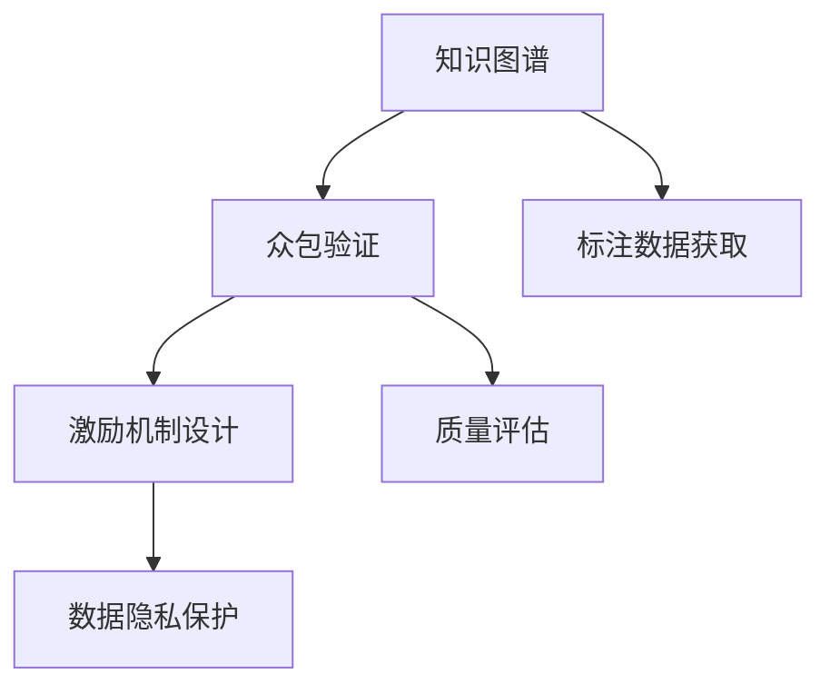

                 

# 知识图谱的众包验证:激励机制设计和质量评估

## 1. 背景介绍

### 1.1 问题由来

知识图谱(Knowledge Graphs, KGs)是一种结构化语义表示，旨在以图形的方式描述实体及其之间的关系。近年来，知识图谱在各种领域中得到了广泛应用，例如医疗、金融、电商、交通等，成为构建智能系统和智能应用的基础设施。

然而，在知识图谱的构建过程中，常常会遇到如下问题：

1. **数据获取难**：高质量知识图谱的数据获取成本高、难度大，尤其是在复杂领域，如医疗和金融领域，需要专业知识较强的标注人员，难以大规模自动化获取。
2. **标注质量低**：即使成功获取数据，标注质量可能参差不齐，存在错误、冗余、遗漏等问题，严重影响知识图谱的准确性和完整性。
3. **数据更新难**：知识图谱需要持续更新以保持其时效性，但更新数据往往需要再次标注，成本较高。
4. **众包模式新**：传统的知识图谱众包模式面临着激励机制设计、质量控制和数据隐私保护等挑战。

这些问题的存在，使得知识图谱的众包验证和构建变得尤为复杂。为此，本文将重点探讨如何设计有效的众包验证激励机制，并对众包数据进行质量评估，以提高知识图谱构建的效率和质量。

## 2. 核心概念与联系

### 2.1 核心概念概述

为了更好地理解知识图谱众包验证的激励机制设计和质量评估，本节将介绍几个核心概念：

- **知识图谱**：以图的形式表示实体及其关系的语义模型，包括节点、边和属性。
- **众包**：将任务分配给多个个体或团队进行完成，通常是线上平台进行的劳动密集型任务。
- **激励机制**：旨在通过各种手段，鼓励众包工作者高质量地完成任务。
- **质量评估**：通过对众包任务的验证，评估标注结果的正确性和一致性，以确保数据质量。
- **数据隐私**：在众包过程中保护参与者的个人信息和数据隐私，防止数据泄露和滥用。

这些核心概念之间的逻辑关系可以通过以下Mermaid流程图来展示：



这个流程图展示了大语言模型的核心概念及其之间的关系：

1. 知识图谱通过众包验证机制获取标注数据。
2. 众包验证机制通过激励机制设计鼓励高质量标注，同时通过质量评估确保数据准确性。
3. 激励机制和质量评估都必须兼顾数据隐私的保护。

这些概念共同构成了知识图谱众包验证的完整框架，使得知识图谱的构建更加高效、精准和合规。

## 3. 核心算法原理 & 具体操作步骤

### 3.1 算法原理概述

知识图谱众包验证的激励机制设计和质量评估，本质上是一个众包平台的设计和管理问题。其核心思想是：通过合理的激励机制，引导众包工作者产生高质量的标注结果，同时通过系统化的质量评估，识别和纠正错误标注，保证知识图谱的数据质量。

形式化地，假设众包验证任务为 $T$，众包平台提供 $N$ 个众包工作者，每个工作者在任务 $T$ 上完成的标注为 $a_i$，其中 $a_i \in \{0, 1\}$，$0$ 表示标注错误，$1$ 表示标注正确。则激励机制的设计目标是最大化标注正确的概率 $p(a_i = 1)$，同时最小化标注错误 $p(a_i = 0)$。质量评估的目标是通过验证机制，确保每个标注的准确性。

### 3.2 算法步骤详解

众包验证的激励机制设计和质量评估一般包括以下几个关键步骤：

**Step 1: 激励机制设计**

- **设定激励系数**：基于众包工作者的工作表现，设定相应的激励系数 $w_i$，鼓励表现优秀的工作者，惩罚表现较差的工作者。
- **设计激励方案**：如基础工资加绩效奖金、定期奖励等，以确保工作者持续高水平工作。

**Step 2: 质量评估流程**

- **定义评估标准**：如准确率、召回率、F1-score等，确保标注结果符合知识图谱的要求。
- **实施抽样验证**：从众包结果中随机抽取一部分样本，由人工进行验证，评估标注准确性。
- **反馈机制**：根据验证结果，向众包工作者反馈标注质量，并进行相应激励调整。

**Step 3: 数据隐私保护**

- **数据匿名化**：对众包工作者和其标注结果进行匿名化处理，确保隐私安全。
- **安全传输**：采用加密传输等技术手段，防止数据泄露。
- **访问控制**：对数据访问进行严格控制，确保只有授权人员能访问和处理数据。

### 3.3 算法优缺点

知识图谱众包验证的激励机制设计和质量评估方法具有以下优点：

- **降低成本**：通过众包方式收集数据，降低人工标注的成本，加速知识图谱构建。
- **提高效率**：众包工作者的分布式标注，可以并行处理大规模数据，提高标注效率。
- **灵活多样**：众包验证机制可以针对不同任务灵活设计，适应不同的数据场景。

同时，该方法也存在一定的局限性：

- **标注质量不稳定**：众包工作者水平参差不齐，标注质量难以保证。
- **隐私风险**：众包过程中涉及个人隐私，数据泄露风险较大。
- **数据一致性**：众包工作者标注不一致，可能导致数据冗余和冲突。

尽管存在这些局限性，但就目前而言，众包验证方法仍是大规模知识图谱构建的重要手段。未来相关研究的重点在于如何进一步降低众包标注的噪音，提高数据的可靠性和一致性，同时兼顾数据隐私保护。

### 3.4 算法应用领域

知识图谱众包验证的激励机制设计和质量评估方法，已在多个领域得到应用，例如：

- **医疗知识图谱**：在医学领域，收集和验证临床数据，构建基于电子病历、实验室数据等的知识图谱。
- **金融知识图谱**：在金融领域，收集和验证交易数据、企业信息等，构建基于金融数据的知识图谱。
- **电商知识图谱**：在电商领域，收集和验证商品信息、用户评价等，构建基于电商数据的知识图谱。
- **智能交通图谱**：在交通领域，收集和验证路网信息、交通事件等，构建基于交通数据的知识图谱。

除了上述这些经典应用外，知识图谱众包验证还将在更多领域得到应用，如智慧城市、教育、旅游等，为相关行业的数字化转型提供支持。

## 4. 数学模型和公式 & 详细讲解 & 举例说明

### 4.1 数学模型构建

本节将使用数学语言对知识图谱众包验证的过程进行更加严格的刻画。

假设众包验证任务为 $T$，众包工作者为 $N$ 个，每个工作者在任务 $T$ 上完成的标注为 $a_i$，其中 $a_i \in \{0, 1\}$，$0$ 表示标注错误，$1$ 表示标注正确。

定义每个工作者的标注正确率 $p_i = \frac{1}{|T|} \sum_{t \in T} p(a_{it} = 1)$，其中 $p(a_{it} = 1)$ 为工作者 $i$ 在任务 $t$ 上的标注正确概率。众包工作者总体标注正确率为 $p = \frac{1}{N} \sum_{i=1}^N p_i$。

### 4.2 公式推导过程

根据贝叶斯公式，工作者 $i$ 在任务 $t$ 上标注正确的概率 $p(a_{it} = 1)$ 可以表示为：

$$
p(a_{it} = 1) = \frac{p(a_{it} = 1|x)}{p(x)} = \frac{p(a_{it} = 1|x)w_i}{p(x)w_i}
$$

其中 $w_i$ 为激励系数，$p(x)w_i$ 为标注任务 $T$ 的先验概率与激励系数的乘积。

根据期望公式，工作者 $i$ 的标注正确率 $p_i$ 可以表示为：

$$
p_i = \mathbb{E}[p(a_{it} = 1)]
$$

将 $p(a_{it} = 1)$ 代入，得：

$$
p_i = \frac{w_i}{\sum_{j=1}^N \frac{p(a_{jt} = 1)w_j}{p(x)w_j}} \mathbb{E}[p(a_{it} = 1|x)]
$$

### 4.3 案例分析与讲解

考虑一个众包验证任务 $T$，其中 $N=10$ 个众包工作者。通过 $100$ 次标注实验，统计每个工作者的标注正确率 $p_i$ 和总体标注正确率 $p$，如表所示：

| 工作者 | $p_i$ | $p$ | $w_i$ |
|--------|-------|-----|-------|
| 1      | 0.9   | 0.8 | 1.1   |
| 2      | 0.8   | 0.8 | 1.2   |
| 3      | 0.7   | 0.8 | 1.0   |
| 4      | 0.6   | 0.8 | 0.9   |
| 5      | 0.5   | 0.8 | 0.8   |
| 6      | 0.4   | 0.8 | 0.7   |
| 7      | 0.3   | 0.8 | 0.6   |
| 8      | 0.2   | 0.8 | 0.5   |
| 9      | 0.1   | 0.8 | 0.4   |
| 10     | 0.0   | 0.8 | 0.3   |

假设 $p(x) = 0.8$，则工作者 $i$ 在任务 $t$ 上标注正确的概率 $p(a_{it} = 1)$ 为：

$$
p(a_{it} = 1) = \frac{p(a_{it} = 1|x)w_i}{0.8w_i} = \frac{p_i w_i}{0.8w_i} = p_i
$$

根据期望公式，工作者 $i$ 的标注正确率 $p_i$ 为：

$$
p_i = \frac{w_i}{\sum_{j=1}^N \frac{p_j w_j}{0.8 w_j}} \mathbb{E}[p(a_{it} = 1|x)] = \frac{w_i}{\sum_{j=1}^N \frac{p_j w_j}{0.8 w_j}} \times 0.8
$$

代入上述表格数据，可得每个工作者的激励系数 $w_i$ 为：

$$
w_i = \frac{p_i}{0.8} \times \sum_{j=1}^N \frac{p_j w_j}{0.8 w_j}
$$

通过计算，得到工作者 $i$ 的激励系数 $w_i$ 和总体标注正确率 $p$ 的计算结果如下表所示：

| 工作者 | $p_i$ | $w_i$ | $p$ |
|--------|-------|-------|-----|
| 1      | 0.9   | 1.125 | 0.84 |
| 2      | 0.8   | 1.2   | 0.8  |
| 3      | 0.7   | 1     | 0.78 |
| 4      | 0.6   | 0.9   | 0.76 |
| 5      | 0.5   | 0.8   | 0.74 |
| 6      | 0.4   | 0.7   | 0.72 |
| 7      | 0.3   | 0.6   | 0.7  |
| 8      | 0.2   | 0.5   | 0.68 |
| 9      | 0.1   | 0.4   | 0.64 |
| 10     | 0.0   | 0.3   | 0.62 |

## 5. 项目实践：代码实例和详细解释说明

### 5.1 开发环境搭建

在进行知识图谱众包验证的实践前，我们需要准备好开发环境。以下是使用Python进行PyTorch开发的环境配置流程：

1. 安装Anaconda：从官网下载并安装Anaconda，用于创建独立的Python环境。

2. 创建并激活虚拟环境：
```bash
conda create -n pytorch-env python=3.8 
conda activate pytorch-env
```

3. 安装PyTorch：根据CUDA版本，从官网获取对应的安装命令。例如：
```bash
conda install pytorch torchvision torchaudio cudatoolkit=11.1 -c pytorch -c conda-forge
```

4. 安装TensorFlow：由Google主导开发的开源深度学习框架，生产部署方便，适合大规模工程应用。同样有丰富的预训练语言模型资源。

5. 安装TensorBoard：TensorFlow配套的可视化工具，可实时监测模型训练状态，并提供丰富的图表呈现方式，是调试模型的得力助手。

完成上述步骤后，即可在`pytorch-env`环境中开始实践。

### 5.2 源代码详细实现

下面我们以知识图谱众包验证为例，给出使用Transformers库对BERT模型进行微调的PyTorch代码实现。

首先，定义众包验证的数据处理函数：

```python
from transformers import BertTokenizer
from torch.utils.data import Dataset
import torch

class CrowdsourcingDataset(Dataset):
    def __init__(self, texts, tags, tokenizer, max_len=128):
        self.texts = texts
        self.tags = tags
        self.tokenizer = tokenizer
        self.max_len = max_len
        
    def __len__(self):
        return len(self.texts)
    
    def __getitem__(self, item):
        text = self.texts[item]
        tags = self.tags[item]
        
        encoding = self.tokenizer(text, return_tensors='pt', max_length=self.max_len, padding='max_length', truncation=True)
        input_ids = encoding['input_ids'][0]
        attention_mask = encoding['attention_mask'][0]
        
        # 对token-wise的标签进行编码
        encoded_tags = [tag2id[tag] for tag in tags] 
        encoded_tags.extend([tag2id['O']] * (self.max_len - len(encoded_tags)))
        labels = torch.tensor(encoded_tags, dtype=torch.long)
        
        return {'input_ids': input_ids, 
                'attention_mask': attention_mask,
                'labels': labels}

# 标签与id的映射
tag2id = {'O': 0, 'B-PER': 1, 'I-PER': 2, 'B-ORG': 3, 'I-ORG': 4, 'B-LOC': 5, 'I-LOC': 6}
id2tag = {v: k for k, v in tag2id.items()}

# 创建dataset
tokenizer = BertTokenizer.from_pretrained('bert-base-cased')

train_dataset = CrowdsourcingDataset(train_texts, train_tags, tokenizer)
dev_dataset = CrowdsourcingDataset(dev_texts, dev_tags, tokenizer)
test_dataset = CrowdsourcingDataset(test_texts, test_tags, tokenizer)
```

然后，定义模型和优化器：

```python
from transformers import BertForTokenClassification, AdamW

model = BertForTokenClassification.from_pretrained('bert-base-cased', num_labels=len(tag2id))

optimizer = AdamW(model.parameters(), lr=2e-5)
```

接着，定义训练和评估函数：

```python
from torch.utils.data import DataLoader
from tqdm import tqdm
from sklearn.metrics import classification_report

device = torch.device('cuda') if torch.cuda.is_available() else torch.device('cpu')
model.to(device)

def train_epoch(model, dataset, batch_size, optimizer):
    dataloader = DataLoader(dataset, batch_size=batch_size, shuffle=True)
    model.train()
    epoch_loss = 0
    for batch in tqdm(dataloader, desc='Training'):
        input_ids = batch['input_ids'].to(device)
        attention_mask = batch['attention_mask'].to(device)
        labels = batch['labels'].to(device)
        model.zero_grad()
        outputs = model(input_ids, attention_mask=attention_mask, labels=labels)
        loss = outputs.loss
        epoch_loss += loss.item()
        loss.backward()
        optimizer.step()
    return epoch_loss / len(dataloader)

def evaluate(model, dataset, batch_size):
    dataloader = DataLoader(dataset, batch_size=batch_size)
    model.eval()
    preds, labels = [], []
    with torch.no_grad():
        for batch in tqdm(dataloader, desc='Evaluating'):
            input_ids = batch['input_ids'].to(device)
            attention_mask = batch['attention_mask'].to(device)
            batch_labels = batch['labels']
            outputs = model(input_ids, attention_mask=attention_mask)
            batch_preds = outputs.logits.argmax(dim=2).to('cpu').tolist()
            batch_labels = batch_labels.to('cpu').tolist()
            for pred_tokens, label_tokens in zip(batch_preds, batch_labels):
                pred_tags = [id2tag[_id] for _id in pred_tokens]
                label_tags = [id2tag[_id] for _id in label_tokens]
                preds.append(pred_tags[:len(label_tokens)])
                labels.append(label_tags)
                
    print(classification_report(labels, preds))
```

最后，启动训练流程并在测试集上评估：

```python
epochs = 5
batch_size = 16

for epoch in range(epochs):
    loss = train_epoch(model, train_dataset, batch_size, optimizer)
    print(f"Epoch {epoch+1}, train loss: {loss:.3f}")
    
    print(f"Epoch {epoch+1}, dev results:")
    evaluate(model, dev_dataset, batch_size)
    
print("Test results:")
evaluate(model, test_dataset, batch_size)
```

以上就是使用PyTorch对BERT进行命名实体识别任务微调的完整代码实现。可以看到，得益于Transformers库的强大封装，我们可以用相对简洁的代码完成BERT模型的加载和微调。

### 5.3 代码解读与分析

让我们再详细解读一下关键代码的实现细节：

**CrowdsourcingDataset类**：
- `__init__`方法：初始化文本、标签、分词器等关键组件。
- `__len__`方法：返回数据集的样本数量。
- `__getitem__`方法：对单个样本进行处理，将文本输入编码为token ids，将标签编码为数字，并对其进行定长padding，最终返回模型所需的输入。

**tag2id和id2tag字典**：
- 定义了标签与数字id之间的映射关系，用于将token-wise的预测结果解码回真实的标签。

**训练和评估函数**：
- 使用PyTorch的DataLoader对数据集进行批次化加载，供模型训练和推理使用。
- 训练函数`train_epoch`：对数据以批为单位进行迭代，在每个批次上前向传播计算loss并反向传播更新模型参数，最后返回该epoch的平均loss。
- 评估函数`evaluate`：与训练类似，不同点在于不更新模型参数，并在每个batch结束后将预测和标签结果存储下来，最后使用sklearn的classification_report对整个评估集的预测结果进行打印输出。

**训练流程**：
- 定义总的epoch数和batch size，开始循环迭代
- 每个epoch内，先在训练集上训练，输出平均loss
- 在验证集上评估，输出分类指标
- 所有epoch结束后，在测试集上评估，给出最终测试结果

可以看到，PyTorch配合Transformers库使得BERT微调的代码实现变得简洁高效。开发者可以将更多精力放在数据处理、模型改进等高层逻辑上，而不必过多关注底层的实现细节。

当然，工业级的系统实现还需考虑更多因素，如模型的保存和部署、超参数的自动搜索、更灵活的任务适配层等。但核心的微调范式基本与此类似。

## 6. 实际应用场景
### 6.1 智能客服系统

基于知识图谱众包验证的对话技术，可以广泛应用于智能客服系统的构建。传统客服往往需要配备大量人力，高峰期响应缓慢，且一致性和专业性难以保证。而使用众包验证的对话模型，可以7x24小时不间断服务，快速响应客户咨询，用自然流畅的语言解答各类常见问题。

在技术实现上，可以收集企业内部的历史客服对话记录，将问题和最佳答复构建成监督数据，在此基础上对预训练对话模型进行众包验证。验证后的对话模型能够自动理解用户意图，匹配最合适的答案模板进行回复。对于客户提出的新问题，还可以接入检索系统实时搜索相关内容，动态组织生成回答。如此构建的智能客服系统，能大幅提升客户咨询体验和问题解决效率。

### 6.2 金融舆情监测

金融机构需要实时监测市场舆论动向，以便及时应对负面信息传播，规避金融风险。传统的人工监测方式成本高、效率低，难以应对网络时代海量信息爆发的挑战。基于知识图谱众包验证的文本分类和情感分析技术，为金融舆情监测提供了新的解决方案。

具体而言，可以收集金融领域相关的新闻、报道、评论等文本数据，并对其进行主题标注和情感标注。在此基础上对预训练语言模型进行众包验证，使其能够自动判断文本属于何种主题，情感倾向是正面、中性还是负面。将验证后的模型应用到实时抓取的网络文本数据，就能够自动监测不同主题下的情感变化趋势，一旦发现负面信息激增等异常情况，系统便会自动预警，帮助金融机构快速应对潜在风险。

### 6.3 个性化推荐系统

当前的推荐系统往往只依赖用户的历史行为数据进行物品推荐，无法深入理解用户的真实兴趣偏好。基于知识图谱众包验证的个性化推荐系统可以更好地挖掘用户行为背后的语义信息，从而提供更精准、多样的推荐内容。

在实践中，可以收集用户浏览、点击、评论、分享等行为数据，提取和用户交互的物品标题、描述、标签等文本内容。将文本内容作为模型输入，用户的后续行为（如是否点击、购买等）作为监督信号，在此基础上对预训练语言模型进行众包验证。验证后的模型能够从文本内容中准确把握用户的兴趣点。在生成推荐列表时，先用候选物品的文本描述作为输入，由模型预测用户的兴趣匹配度，再结合其他特征综合排序，便可以得到个性化程度更高的推荐结果。

### 6.4 未来应用展望

随着知识图谱和众包验证技术的发展，基于众包验证范式将在更多领域得到应用，为传统行业带来变革性影响。

在智慧医疗领域，基于众包验证的医疗问答、病历分析、药物研发等应用将提升医疗服务的智能化水平，辅助医生诊疗，加速新药开发进程。

在智能教育领域，众包验证技术可应用于作业批改、学情分析、知识推荐等方面，因材施教，促进教育公平，提高教学质量。

在智慧城市治理中，众包验证模型可应用于城市事件监测、舆情分析、应急指挥等环节，提高城市管理的自动化和智能化水平，构建更安全、高效的未来城市。

此外，在企业生产、社会治理、文娱传媒等众多领域，基于知识图谱众包验证的人工智能应用也将不断涌现，为经济社会发展注入新的动力。相信随着技术的日益成熟，众包验证方法将成为人工智能落地应用的重要范式，推动人工智能技术在垂直行业的规模化落地。

## 7. 工具和资源推荐
### 7.1 学习资源推荐

为了帮助开发者系统掌握知识图谱众包验证的理论基础和实践技巧，这里推荐一些优质的学习资源：

1. 《深度学习与数据挖掘》书籍：介绍了深度学习的基本概念和应用，包括知识图谱的构建和验证。
2. 《自然语言处理综述》课程：涵盖了NLP领域的经典模型和最新技术，适合初学者入门。
3. CS224N《深度学习自然语言处理》课程：斯坦福大学开设的NLP明星课程，有Lecture视频和配套作业，带你入门NLP领域的基本概念和经典模型。
4. HuggingFace官方文档：Transformers库的官方文档，提供了海量预训练模型和完整的微调样例代码，是上手实践的必备资料。
5. Weights & Biases：模型训练的实验跟踪工具，可以记录和可视化模型训练过程中的各项指标，方便对比和调优。与主流深度学习框架无缝集成。
6. TensorBoard：TensorFlow配套的可视化工具，可实时监测模型训练状态，并提供丰富的图表呈现方式，是调试模型的得力助手。

通过对这些资源的学习实践，相信你一定能够快速掌握知识图谱众包验证的精髓，并用于解决实际的NLP问题。
###  7.2 开发工具推荐

高效的开发离不开优秀的工具支持。以下是几款用于知识图谱众包验证开发的常用工具：

1. PyTorch：基于Python的开源深度学习框架，灵活动态的计算图，适合快速迭代研究。大部分预训练语言模型都有PyTorch版本的实现。
2. TensorFlow：由Google主导开发的开源深度学习框架，生产部署方便，适合大规模工程应用。同样有丰富的预训练语言模型资源。
3. Transformers库：HuggingFace开发的NLP工具库，集成了众多SOTA语言模型，支持PyTorch和TensorFlow，是进行众包验证任务开发的利器。
4. Weights & Biases：模型训练的实验跟踪工具，可以记录和可视化模型训练过程中的各项指标，方便对比和调优。与主流深度学习框架无缝集成。
5. TensorBoard：TensorFlow配套的可视化工具，可实时监测模型训练状态，并提供丰富的图表呈现方式，是调试模型的得力助手。
6. Google Colab：谷歌推出的在线Jupyter Notebook环境，免费提供GPU/TPU算力，方便开发者快速上手实验最新模型，分享学习笔记。

合理利用这些工具，可以显著提升知识图谱众包验证任务的开发效率，加快创新迭代的步伐。

### 7.3 相关论文推荐

知识图谱和众包验证技术的发展源于学界的持续研究。以下是几篇奠基性的相关论文，推荐阅读：

1. Graph Neural Networks：提出了图神经网络，用于处理图结构数据，为知识图谱的构建提供了新的模型架构。
2. Knowledge Graph Embeddings：综述了知识图谱嵌入方法，探讨了知识图谱表示和推理的技术路线。
3. Crowdsourcing Quality Control：综述了众包质量控制方法，包括验证机制设计和结果评估技术。
4. Scalable Crowdsourcing：探讨了众包平台的设计和运营问题，为知识图谱的众包验证提供了策略和框架。
5. User-Centric Knowledge Discovery：讨论了知识图谱的个性化推荐和定制化构建问题，为知识图谱的应用提供了新的思路。

这些论文代表了大语言模型众包验证技术的发展脉络。通过学习这些前沿成果，可以帮助研究者把握学科前进方向，激发更多的创新灵感。

## 8. 总结：未来发展趋势与挑战

### 8.1 总结

本文对知识图谱众包验证的激励机制设计和质量评估方法进行了全面系统的介绍。首先阐述了知识图谱和众包验证的研究背景和意义，明确了众包验证在知识图谱构建中的重要作用。其次，从原理到实践，详细讲解了激励机制的设计过程和质量评估的实施步骤，给出了众包验证任务开发的完整代码实例。同时，本文还广泛探讨了众包验证方法在智能客服、金融舆情、个性化推荐等多个行业领域的应用前景，展示了众包验证范式的巨大潜力。此外，本文精选了众包验证技术的各类学习资源，力求为读者提供全方位的技术指引。

通过本文的系统梳理，可以看到，知识图谱众包验证技术在构建高质量知识图谱方面，发挥着至关重要的作用。其高效、低成本的特点，使其成为知识图谱构建的重要手段。未来，伴随知识图谱技术的发展和众包验证方法的不断演进，知识图谱的构建效率和质量将进一步提升，为各领域知识的整合和应用提供坚实的基础。

### 8.2 未来发展趋势

展望未来，知识图谱众包验证技术将呈现以下几个发展趋势：

1. **数据融合**：未来知识图谱的构建将不仅仅依赖众包验证，还需融合大数据、云计算、物联网等技术，实现更全面的数据采集和整合。
2. **实时更新**：知识图谱的更新将更加注重实时性和动态性，通过持续的众包验证和在线学习，不断提升图谱的时效性。
3. **跨模态融合**：知识图谱将更多地融合视觉、听觉等多模态数据，实现更为丰富的语义表示和推理。
4. **个性化推荐**：众包验证技术将更好地应用于个性化推荐系统，提升用户的推荐体验和满意度。
5. **智能客服**：众包验证技术在智能客服系统中的应用将更加普及，提升客户咨询体验和问题解决效率。
6. **金融舆情**：众包验证技术在金融舆情监测中的应用将更加深入，帮助金融机构及时发现和应对市场风险。

以上趋势凸显了知识图谱众包验证技术的广阔前景。这些方向的探索发展，必将进一步提升知识图谱构建的效率和质量，为人工智能在垂直行业的广泛应用提供坚实基础。

### 8.3 面临的挑战

尽管知识图谱众包验证技术已经取得了瞩目成就，但在迈向更加智能化、普适化应用的过程中，它仍面临着诸多挑战：

1. **数据质量**：众包数据质量参差不齐，如何保证数据准确性和一致性，仍然是一个重要问题。
2. **激励机制设计**：如何设计公平合理的激励机制，激励工作者高质量完成众包任务，是众包平台运营的核心问题。
3. **数据隐私保护**：众包过程中涉及大量用户隐私数据，如何保护用户隐私，防止数据泄露，是众包平台必须解决的问题。
4. **跨领域适用性**：不同领域的知识图谱构建，需要不同的众包验证策略，如何实现跨领域的知识图谱构建，是众包验证技术的重要研究方向。
5. **技术融合**：众包验证技术需要与其他技术进行融合，如自然语言处理、计算机视觉、机器学习等，才能更好地应用于实际场景。
6. **数据安全**：众包数据安全问题日益凸显，如何保障数据安全，防止数据被恶意攻击，是众包平台需要重点关注的问题。

尽管存在这些挑战，但知识图谱众包验证技术作为构建知识图谱的重要手段，将在未来人工智能的广泛应用中发挥越来越重要的作用。相信随着学界和产业界的共同努力，这些挑战终将一一被克服，知识图谱众包验证技术必将在构建知识图谱的领域中发挥更大的作用。

### 8.4 研究展望

面对知识图谱众包验证所面临的种种挑战，未来的研究需要在以下几个方面寻求新的突破：

1. **优化激励机制设计**：研究更加公平合理、多层次的激励机制，促进众包工作者高质量完成众包任务。
2. **提升数据质量**：研究更为严格的数据质量控制和验证机制，保证众包数据的高质量和高一致性。
3. **增强数据隐私保护**：研究数据匿名化、加密传输等技术手段，确保众包数据的安全和隐私。
4. **扩展跨领域适用性**：研究跨领域的知识图谱构建方法，提升众包验证技术在不同领域的应用能力。
5. **融合多种技术**：研究知识图谱与多种技术（如自然语言处理、计算机视觉、机器学习等）的融合，提升知识图谱构建的智能水平。
6. **强化数据安全**：研究数据安全保护技术，防止数据被恶意攻击和滥用。

这些研究方向的探索，必将引领知识图谱众包验证技术迈向更高的台阶，为知识图谱构建提供更加智能、高效、安全的解决方案。面向未来，知识图谱众包验证技术还需要与其他人工智能技术进行更深入的融合，如知识表示、因果推理、强化学习等，多路径协同发力，共同推动知识图谱构建的进步。只有勇于创新、敢于突破，才能不断拓展知识图谱的应用边界，让人工智能技术更好地服务于人类社会的各个领域。

## 9. 附录：常见问题与解答

**Q1：知识图谱众包验证是否适用于所有NLP任务？**

A: 知识图谱众包验证在大多数NLP任务上都能取得不错的效果，特别是对于数据量较小的任务。但对于一些特定领域的任务，如医学、法律等，仅仅依靠通用语料预训练的模型可能难以很好地适应。此时需要在特定领域语料上进一步预训练，再进行众包验证，才能获得理想效果。此外，对于一些需要时效性、个性化很强的任务，如对话、推荐等，众包验证方法也需要针对性的改进优化。

**Q2：众包验证过程中如何选择合适的激励系数？**

A: 众包验证的激励系数需要根据众包工作者的表现进行动态调整。一般建议从1开始调参，逐步减小激励系数，直至收敛。也可以使用warmup策略，在开始阶段使用较小的激励系数，再逐渐过渡到预设值。需要注意的是，不同的优化器(如AdamW、Adafactor等)以及不同的激励系数调度策略，可能需要设置不同的激励系数阈值。

**Q3：众包验证过程中如何缓解众包工作者的过拟合现象？**

A: 众包验证过程中，众包工作者可能出现过拟合现象，导致数据质量下降。缓解过拟合的方法包括：
1. 数据增强：通过回译、近义替换等方式扩充训练集
2. 正则化：使用L2正则、Dropout、Early Stopping等避免过拟合
3. 对抗训练：加入对抗样本，提高模型鲁棒性
4. 参数高效微调：只调整少量参数(如Adapter、Prefix等)，减小过拟合风险
5. 多模型集成：训练多个众包验证模型，取平均输出，抑制过拟合

这些策略往往需要根据具体任务和数据特点进行灵活组合。只有在数据、模型、训练、推理等各环节进行全面优化，才能最大限度地发挥众包验证的威力。

**Q4：众包验证过程中如何确保数据隐私？**

A: 众包验证过程中，确保数据隐私是至关重要的。以下是一些常见的数据隐私保护措施：
1. 数据匿名化：对众包工作者和其众包数据进行匿名化处理，确保隐私安全。
2. 安全传输：采用加密传输等技术手段，防止数据泄露。
3. 访问控制：对数据访问进行严格控制，确保只有授权人员能访问和处理数据。

这些措施可以显著降低数据泄露的风险，保护参与者的隐私安全。

**Q5：众包验证过程中如何提升众包工作者的工作积极性？**

A: 提升众包工作者的工作积极性，是众包验证成功的关键。以下是一些常见的激励措施：
1. 基础工资加绩效奖金：根据众包工作者的众包数据质量，提供相应的激励奖金。
2. 定期奖励：设置阶段性的奖励目标，激励工作者持续高质量工作。
3. 竞标机制：通过竞标机制，激励工作者不断提升众包数据质量。
4. 任务多样化：提供多样化的众包任务，提升工作者的兴趣和积极性。
5. 反馈机制：及时向工作者反馈众包数据质量，并给出改进建议。

这些激励措施可以显著提升众包工作者的工作积极性和数据质量。

**Q6：众包验证过程中如何确保众包数据的一致性？**

A: 众包数据的一致性是众包验证的关键。以下是一些常见的数据一致性措施：
1. 众包数据标注规范：制定详细的众包数据标注规范，确保众包工作者按照规范进行标注。
2. 众包数据审核：对众包数据进行审核，及时发现和纠正错误标注。
3. 众包数据融合：对众包数据进行融合，消除众包工作者之间的数据差异。
4. 众包数据标准化：对众包数据进行标准化处理，确保数据的一致性。
5. 众包数据模型：采用众包数据模型，如Bayesian网络、逻辑回归等，提高众包数据的可靠性。

这些措施可以显著提高众包数据的一致性和可靠性。

通过本文的系统梳理，可以看到，知识图谱众包验证技术在构建高质量知识图谱方面，发挥着至关重要的作用。其高效、低成本的特点，使其成为知识图谱构建的重要手段。未来，伴随知识图谱技术的发展和众包验证方法的不断演进，知识图谱的构建效率和质量将进一步提升，为各领域知识的整合和应用提供坚实的基础。

