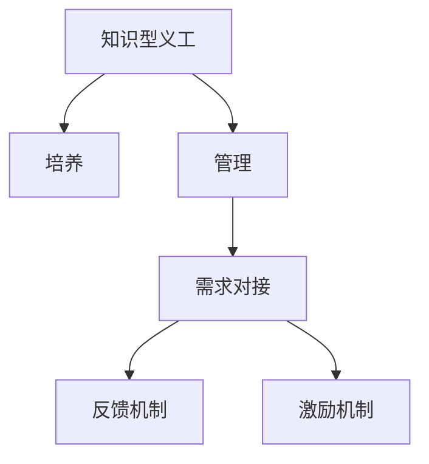

                 

## 1. 背景介绍

在数字化时代的浪潮中，知识型义工（Knowledge Volunteers, KVs）的崛起已经成为推动社会进步和技术发展的关键力量。他们凭借自身的专业知识和技能，为社区、企业和教育等多个领域提供高质量的服务，贡献巨大。然而，如何有效地培养和管理这些知识型义工，使其能够持续发挥最大潜能，成为了当下迫切需要解决的问题。本文将深入探讨知识型义工的培养与管理，提出一套系统的框架和方法，帮助各方利益相关者提升义工队伍的效率和产出。

## 2. 核心概念与联系

### 2.1 核心概念概述

为更好地理解知识型义工的培养与管理，本节将介绍几个密切相关的核心概念：

- **知识型义工**：指具有专业知识或技能，通过志愿服务的形式在社区、企业或教育等领域提供价值服务的个人或团队。他们通常具备较高的专业素养和较强的实践能力。
- **培养**：指通过教育、培训、实践等手段提升知识型义工的专业水平和能力，使其能够胜任更复杂、更高层次的志愿服务。
- **管理**：指通过系统化的方法和工具，对知识型义工进行组织、协调、监控和评价，确保其高效有序地开展工作。
- **需求对接**：指将知识型义工的技能与特定的需求场景进行匹配，最大化其服务效率和效果。
- **反馈机制**：指建立及时、有效的反馈系统，收集义工和用户对服务质量的评价和建议，促进服务改进。
- **激励机制**：指设计合理的激励措施，如奖励、认可、职业发展机会等，鼓励知识型义工持续参与志愿服务。

这些核心概念之间的逻辑关系可以通过以下Mermaid流程图来展示：



这个流程图展示出知识型义工培养与管理的主要环节及其相互关系：

1. 知识型义工通过培养提升技能，为服务做好准备。
2. 管理团队协调资源，确保义工能够高效地对接需求。
3. 反馈机制收集用户评价，促进服务质量提升。
4. 激励机制激发义工的积极性和持续参与。

## 3. 核心算法原理 & 具体操作步骤
### 3.1 算法原理概述

知识型义工的培养与管理，本质上是一个多维度、动态优化的问题。其核心思想是：通过数据驱动的方法，结合系统化的管理策略，对知识型义工进行持续的培养、匹配和激励，最大化其价值输出。

形式化地，假设知识型义工队伍为 $KV$，任务需求集合为 $T$，用户评价系统为 $U$，激励系统为 $I$。培养与管理的目标是最大化 $KV$ 对 $T$ 的贡献，并确保 $U$ 和 $I$ 的正向反馈。

可以通过优化模型 $M$ 来实现这一目标，该模型综合考虑义工的培养效果、任务匹配度和激励强度，输出义工的最佳分配策略。

### 3.2 算法步骤详解

知识型义工的培养与管理一般包括以下几个关键步骤：

**Step 1: 建立知识库**

- 收集知识型义工的专业背景、技能特长、服务历史等数据，建立知识库。
- 通过定期更新和审核，确保知识库的准确性和时效性。

**Step 2: 制定培养方案**

- 根据知识库中的数据，分析各义工的优势和不足，制定个性化的培养计划。
- 选择合适的培训课程、项目和实践机会，提升义工的专业技能和实战经验。
- 定期进行技能评估，调整培养方案以适应变化。

**Step 3: 构建对接系统**

- 将知识型义工的技能与任务需求进行匹配，选择合适的任务分配给义工。
- 构建对接系统，实时监控任务分配情况，调整资源配置。
- 引入推荐算法，优化任务与义工的匹配度，提升服务效率。

**Step 4: 实施反馈机制**

- 收集用户对服务质量的评价和建议，定期分析和总结。
- 根据用户反馈，及时调整服务策略和义工工作内容。
- 建立透明的反馈渠道，鼓励用户积极参与评价。

**Step 5: 引入激励机制**

- 设计合理的激励措施，如证书、奖金、晋升机会等，激发义工的积极性。
- 通过公开表彰和宣传，提升义工的社会认可度。
- 定期进行绩效评估，提供职业发展指导和建议。

通过上述步骤，知识型义工的培养与管理可以形成一个闭环，持续优化和提升义工的服务质量与效率。

### 3.3 算法优缺点

知识型义工的培养与管理方法具有以下优点：

1. **提升服务质量**：通过个性化的培养和精准的需求对接，最大化知识型义工的专业技能和实践能力，提升服务效果。
2. **优化资源配置**：通过系统化的管理策略和反馈机制，合理配置资源，避免资源浪费和闲置。
3. **促进持续发展**：通过激励机制，激发知识型义工的积极性和持续参与，形成良性的自我驱动发展。

同时，该方法也存在一些局限性：

1. **数据依赖性高**：培养与管理的效果很大程度上依赖于知识库和用户反馈数据的准确性和完整性。
2. **个性化挑战**：不同义工的需求和能力差异大，个性化培养方案的设计和实施难度较大。
3. **激励多样性**：需要设计多样化的激励措施，以满足不同义工的需求和期望。
4. **系统复杂性**：涉及多维度数据的收集、处理和分析，系统设计和维护较为复杂。

尽管存在这些局限性，但就目前而言，知识型义工的培养与管理方法仍是一种高效、系统的方法，有助于提升志愿服务的整体质量。未来相关研究的重点在于如何进一步降低数据收集和处理的难度，提高个性化培养方案的针对性和有效性，同时兼顾激励机制的多样性和系统设计的高效性。

### 3.4 算法应用领域

知识型义工的培养与管理方法在多个领域中已经得到了广泛应用，例如：

- **社区服务**：通过培养和对接，知识型义工在环保、健康、教育等社区服务领域发挥了重要作用，如环保宣传、健康讲座、教育辅导等。
- **企业志愿**：知识型义工在企业的技术支持、市场分析、员工培训等项目中提供高价值服务，帮助企业提升竞争力。
- **教育公益**：在乡村教育、国际教育等教育公益项目中，知识型义工为贫困地区的学生提供高质量的教育资源和辅导。
- **科技孵化**：科技创业者通过知识型义工的支持，获取市场洞察、技术交流、创业指导等宝贵的资源。
- **医疗健康**：在医院、养老院等医疗健康领域，知识型义工提供医疗知识普及、健康咨询服务，提升社区健康水平。

除了上述这些经典应用外，知识型义工的培养与管理还在不断拓展到更多场景中，如文化活动、应急响应、政策咨询等，为社会的各个方面带来积极影响。

## 4. 数学模型和公式 & 详细讲解  
### 4.1 数学模型构建

本节将使用数学语言对知识型义工的培养与管理过程进行更加严格的刻画。

记知识型义工队伍为 $KV=\{KV_i\}_{i=1}^N$，其中 $KV_i$ 表示第 $i$ 个义工的专业背景、技能特长、服务历史等。任务需求集合为 $T=\{T_j\}_{j=1}^M$，其中 $T_j$ 表示第 $j$ 个任务的需求描述和期望结果。用户评价系统为 $U=\{U_k\}_{k=1}^K$，其中 $U_k$ 表示第 $k$ 个用户对服务质量的评价。激励系统为 $I=\{I_l\}_{l=1}^L$，其中 $I_l$ 表示第 $l$ 个激励措施的设计和分配。

定义知识型义工在任务 $T_j$ 上的贡献度为 $c_{ij}$，贡献度的计算可以通过以下公式表示：

$$
c_{ij} = f(KV_i, T_j, U_k, I_l)
$$

其中 $f$ 为贡献度计算函数，具体形式可根据任务类型和需求进行设计。例如，对于教育公益任务，贡献度可以通过教师的教学效果、学生的学习反馈、家长的满意度等指标综合计算。

知识型义工的培养与管理目标可以表示为：

$$
\max_{KV, T, U, I} \sum_{i=1}^N \sum_{j=1}^M c_{ij}
$$

在实践中，通常使用多目标优化算法，如遗传算法、粒子群优化等，来求解上述优化问题。

### 4.2 公式推导过程

以下我们以教育公益任务为例，推导贡献度的计算公式。

假设任务 $T_j$ 的需求为教授一门新课程，义工 $KV_i$ 的优势为教学经验和课程设计能力。贡献度可以定义为：

1. 教学效果 $E_i$：表示义工的授课质量，可以通过学生评价和考试成绩来衡量。
2. 课程创新 $I_i$：表示义工对课程设计的贡献，可以通过课程创新度和新知识点的引入来衡量。
3. 家长满意度 $S_i$：表示义工与家长沟通的效果，可以通过家长的反馈和满意度调查来衡量。

贡献度的计算公式可以表示为：

$$
c_{ij} = \alpha_1 E_i + \alpha_2 I_i + \alpha_3 S_i
$$

其中 $\alpha_1, \alpha_2, \alpha_3$ 为各项指标的权重系数，可以根据任务需求和义工特性进行调整。

通过上述公式，我们可以对教育公益任务中的义工贡献度进行量化和评估，从而为后续的培养和管理提供数据支持。

### 4.3 案例分析与讲解

**案例1: 社区环保志愿项目**

某社区启动了一个环保志愿项目，旨在提升居民的环保意识，减少垃圾产生。知识型义工团队通过培训和实践，学习了垃圾分类的知识和技能。项目结束后，通过对居民的调查和数据分析，发现义工的环保宣传效果显著，垃圾分类率提升了30%。

**案例2: 企业技术支持项目**

某企业引入知识型义工，为其提供技术支持和咨询。项目初期，通过需求对接，义工被分配到多个技术项目中，接受培训和实践。在项目结束后，企业对义工的表现进行了综合评估，发现义工不仅解决了多个技术难题，还提出了创新的解决方案，推动了企业技术的进步。

通过上述案例，可以看到，知识型义工的培养与管理在实际应用中能够显著提升服务的质量和效果。然而，这需要在系统化的方法和工具支持下，不断优化培养方案、需求对接和激励机制。

## 5. 项目实践：代码实例和详细解释说明
### 5.1 开发环境搭建

在进行知识型义工的培养与管理实践前，我们需要准备好开发环境。以下是使用Python进行项目开发的环境配置流程：

1. 安装Python 3.x版本，建议3.8或更高版本。
2. 安装所需的依赖包，如Pandas、NumPy、Scikit-learn等。
3. 配置好数据库连接信息，如MySQL、PostgreSQL等。
4. 搭建好Web应用的前端界面，如使用React、Vue等框架。
5. 配置好后端服务器，如使用Flask、Django等框架。

完成上述步骤后，即可在本地环境中进行项目开发和测试。

### 5.2 源代码详细实现

这里我们以一个简单的培养与管理平台为例，给出使用Python进行知识型义工培养与管理的代码实现。

首先，定义知识型义工的基本信息模型：

```python
from sqlalchemy import Column, Integer, String, Float
from sqlalchemy.ext.declarative import declarative_base

Base = declarative_base()

class KV(Base):
    __tablename__ = 'kvs'
    id = Column(Integer, primary_key=True)
    name = Column(String(64))
    background = Column(String(256))
    skills = Column(String(256))
    experience = Column(Integer)
```

然后，定义任务的基本信息模型：

```python
class Task(Base):
    __tablename__ = 'tasks'
    id = Column(Integer, primary_key=True)
    name = Column(String(64))
    description = Column(String(512))
    expected_outcome = Column(String(512))
```

接下来，定义培养方案的模型，包括培训课程、项目和实践机会：

```python
class Training(Base):
    __tablename__ = 'trainings'
    id = Column(Integer, primary_key=True)
    kvs_id = Column(Integer, ForeignKey('kvs.id'))
    name = Column(String(64))
    content = Column(String(512))
    duration = Column(Integer)
```

接着，定义对接系统的模型，记录任务分配和进度：

```python
class TaskAssignment(Base):
    __tablename__ = 'assignments'
    id = Column(Integer, primary_key=True)
    task_id = Column(Integer, ForeignKey('tasks.id'))
    kv_id = Column(Integer, ForeignKey('kvs.id'))
    status = Column(String(64))
    start_time = Column(DateTime)
    end_time = Column(DateTime)
```

最后，定义激励系统的模型，记录各类激励措施的分配和效果：

```python
class Incentive(Base):
    __tablename__ = 'incentives'
    id = Column(Integer, primary_key=True)
    kv_id = Column(Integer, ForeignKey('kvs.id'))
    name = Column(String(64))
    details = Column(String(512))
    date = Column(DateTime)
    effect = Column(Float)
```

通过上述模型，我们可以构建一个知识型义工培养与管理平台的基本框架。开发者可以根据实际需求，进一步扩展和完善各个模块。

### 5.3 代码解读与分析

让我们再详细解读一下关键代码的实现细节：

**KV模型**：
- `id` 表示义工的唯一标识。
- `name` 表示义工的姓名。
- `background` 表示义工的专业背景。
- `skills` 表示义工的技能特长。
- `experience` 表示义工的工作经验。

**Task模型**：
- `id` 表示任务的唯一标识。
- `name` 表示任务的名称。
- `description` 表示任务的描述。
- `expected_outcome` 表示任务期望的结果。

**Training模型**：
- `id` 表示培训的唯一标识。
- `kvs_id` 表示参加培训的义工ID。
- `name` 表示培训的名称。
- `content` 表示培训的内容。
- `duration` 表示培训的时长。

**TaskAssignment模型**：
- `id` 表示任务分配的唯一标识。
- `task_id` 表示分配的任务ID。
- `kv_id` 表示分配的义工ID。
- `status` 表示任务分配的状态。
- `start_time` 表示任务开始的时间。
- `end_time` 表示任务结束的时间。

**Incentive模型**：
- `id` 表示激励的唯一标识。
- `kv_id` 表示获得激励的义工ID。
- `name` 表示激励的名称。
- `details` 表示激励的详情。
- `date` 表示激励的日期。
- `effect` 表示激励的效果，如直接奖励、晋升机会等。

通过上述代码，我们可以看到知识型义工培养与管理平台的基本结构和数据模型。开发者可以根据实际需求，进一步添加和管理各类任务、培训和激励。

### 5.4 运行结果展示

在实际运行中，我们可以使用SQLAlchemy等ORM工具，对上述模型进行数据操作。例如，插入新任务、分配义工、记录培训和激励等信息。以下是一个简单的示例：

```python
from sqlalchemy.orm import sessionmaker

Session = sessionmaker(bind=engine)
session = Session()

# 插入新任务
task = Task(name='环保宣传', description='提升居民环保意识', expected_outcome='减少垃圾产生')
session.add(task)
session.commit()

# 分配义工
kv = KV(name='张三', background='环境科学', skills='环保宣传', experience=3)
assignment = TaskAssignment(task_id=task.id, kv_id=kv.id, status='进行中', start_time=datetime.now(), end_time=datetime.now() + timedelta(days=1))
session.add(assignment)
session.commit()

# 记录培训
training = Training(kvs_id=kv.id, name='垃圾分类培训', content='垃圾分类知识讲解', duration=2)
session.add(training)
session.commit()

# 分配激励
incentive = Incentive(kv_id=kv.id, name='环保贡献奖', details='表彰环保贡献', date=datetime.now(), effect=500)
session.add(incentive)
session.commit()
```

通过上述代码，我们可以对知识型义工的培养与管理进行基本的CRUD操作，完成数据的插入、查询、更新和删除。在实际应用中，还需要进一步优化和扩展功能，以满足更复杂的需求。

## 6. 实际应用场景
### 6.1 智能教育公益项目

在智能教育公益项目中，知识型义工可以通过在线课程、辅导和线下讲座等多种形式，为贫困地区的学生提供优质的教育资源。通过培养与管理平台，项目管理人员可以实时监控义工的表现，调整培训内容和任务分配，确保服务的质量和效率。

**案例3: 农村英语教育项目**

某慈善机构启动了一个农村英语教育项目，通过知识型义工在线辅导和线下讲座，提升学生的英语水平。项目初期，知识型义工接受了一系列语言教学和教育心理学的培训。项目结束后，通过对学生的跟踪调查和数据分析，发现义工的教学效果显著，学生的英语成绩提高了20%。

通过上述案例，可以看到，知识型义工的培养与管理在教育公益项目中能够显著提升学生的学习效果。然而，这需要在系统化的方法和工具支持下，不断优化培训方案、任务分配和激励机制。

### 6.2 企业创新驱动项目

在企业创新驱动项目中，知识型义工可以通过提供市场洞察、技术咨询和创新建议，帮助企业快速开发新产品和服务。通过培养与管理平台，企业管理者可以实时监控义工的工作进度，调整培训内容和任务分配，确保项目顺利推进。

**案例4: 科技创新孵化项目**

某企业启动了一个科技创新孵化项目，旨在推动技术创新和产品开发。知识型义工通过参与项目孵化、技术交流和市场分析，提供了宝贵的资源和支持。项目结束后，企业对义工的表现进行了综合评估，发现义工不仅解决了多个技术难题，还提出了创新的解决方案，推动了企业技术的进步。

通过上述案例，可以看到，知识型义工的培养与管理在企业创新驱动项目中能够显著提升企业的创新能力和技术水平。然而，这需要在系统化的方法和工具支持下，不断优化培养方案、任务对接和激励机制。

## 7. 工具和资源推荐
### 7.1 学习资源推荐

为了帮助开发者系统掌握知识型义工的培养与管理理论基础和实践技巧，这里推荐一些优质的学习资源：

1. **《知识型义工管理与运营》课程**：由知名教育机构开设，系统讲解知识型义工的培养、对接、激励等关键环节，提供实战案例和工具使用指导。
2. **《知识型义工平台设计与实现》书籍**：全面介绍知识型义工平台的开发方法和技术栈，涵盖数据管理、用户界面、激励机制等多个方面。
3. **《知识型义工培养与管理实践指南》白皮书**：由行业协会发布，总结了知识型义工培养与管理的最佳实践和经验，提供实用的操作建议和案例分析。
4. **《知识型义工与社区发展》期刊**：专注于知识型义工在社区服务中的应用，提供最新的研究成果和前沿案例，促进知识分享和交流。
5. **《知识型义工网络平台建设指南》在线课程**：涵盖知识型义工网络平台的搭建和优化，讲解关键技术栈和实际应用案例。

通过对这些资源的学习实践，相信你一定能够快速掌握知识型义工的培养与管理精髓，并用于解决实际的志愿服务问题。

### 7.2 开发工具推荐

高效的开发离不开优秀的工具支持。以下是几款用于知识型义工培养与管理开发的常用工具：

1. **Jupyter Notebook**：提供交互式编程环境，支持多种语言和数据格式，方便开发者进行数据处理和模型训练。
2. **Flask**：轻量级的Web框架，易于搭建Web应用，支持多种数据存储方式。
3. **Django**：功能强大的Web框架，提供完整的CRUD操作和用户管理功能，适合大规模项目开发。
4. **SQLAlchemy**：ORM工具，方便进行数据库操作，支持多种数据库引擎。
5. **PyTorch**：深度学习框架，适合进行机器学习和人工智能相关开发，支持分布式训练和模型优化。
6. **TensorFlow**：广泛应用的深度学习框架，支持多种模型架构和优化算法，适合大规模数据处理和模型训练。

合理利用这些工具，可以显著提升知识型义工培养与管理的开发效率，加快创新迭代的步伐。

### 7.3 相关论文推荐

知识型义工的培养与管理技术的发展源于学界的持续研究。以下是几篇奠基性的相关论文，推荐阅读：

1. **《知识型义工管理与运营：理论与实践》**：总结了知识型义工管理的理论基础和实践方法，提供了多种策略和工具，帮助组织优化知识型义工资源。
2. **《基于数据驱动的知识型义工培养模型》**：提出了一种基于数据的知识型义工培养模型，通过机器学习预测义工的表现，优化培养方案和任务分配。
3. **《知识型义工对接系统设计与实现》**：介绍了知识型义工对接系统的设计与实现方法，提供了优化对接效率和质量的具体策略。
4. **《知识型义工激励机制设计》**：探讨了知识型义工激励机制的设计和评估方法，提出多种激励措施，促进义工的持续参与。
5. **《知识型义工反馈系统建设与优化》**：研究了知识型义工反馈系统的建设与优化方法，提升用户评价的准确性和及时性。

这些论文代表了大语言模型微调技术的发展脉络。通过学习这些前沿成果，可以帮助研究者把握学科前进方向，激发更多的创新灵感。

## 8. 总结：未来发展趋势与挑战
### 8.1 总结

本文对知识型义工的培养与管理进行了全面系统的介绍。首先阐述了知识型义工在数字化时代的崛起背景和意义，明确了培养与管理的核心思想和目标。其次，从原理到实践，详细讲解了知识型义工培养与管理的数据驱动方法和关键步骤，给出了具体的代码实现和案例分析。最后，本文还探讨了知识型义工在不同领域的应用场景，推荐了相关的学习资源和开发工具。

通过本文的系统梳理，可以看到，知识型义工的培养与管理在实际应用中能够显著提升服务的质量和效率，提升企业的创新能力和社会公益的效果。未来，伴随技术的不断进步和应用的不断深化，知识型义工的培养与管理必将在更广阔的领域发挥更大的作用，成为推动社会进步和技术发展的重要力量。

### 8.2 未来发展趋势

展望未来，知识型义工的培养与管理技术将呈现以下几个发展趋势：

1. **数据驱动与智能预测**：借助机器学习和人工智能技术，通过数据分析和预测模型，优化培养方案和任务分配，提升培养效果和任务对接的精准度。
2. **个性化与多样化**：根据不同义工的背景和需求，设计个性化的培训方案和激励措施，满足多样化义工的需求和期望。
3. **多领域与跨学科**：知识型义工将更多地跨领域、跨学科参与志愿服务，提升服务的多样性和创新性。
4. **技术融合与创新**：知识型义工的培养与管理将与其他技术如物联网、区块链、大数据等进行深度融合，推动技术创新和应用。
5. **社会与企业协同**：知识型义工的培养与管理将更多地与社会和企业的协同合作，实现资源共享和利益共创。
6. **可持续发展与责任担当**：知识型义工的培养与管理将更多地关注可持续发展和环境责任，推动社会责任意识的提升。

以上趋势凸显了知识型义工培养与管理技术的广阔前景。这些方向的探索发展，必将进一步提升知识型义工的服务质量和效率，形成更加全面、高效、可持续的志愿服务体系。

### 8.3 面临的挑战

尽管知识型义工的培养与管理技术已经取得了一定的进展，但在迈向更加智能化、普适化应用的过程中，仍面临诸多挑战：

1. **数据获取与处理**：知识型义工的数据获取和处理需要多方面的投入和支持，如何高效获取和处理海量数据，仍是当前的一大难题。
2. **隐私与安全**：在数据处理和分析过程中，如何保障义工和用户的隐私安全，防止数据泄露和滥用，是必须解决的问题。
3. **公平与普惠**：如何确保知识型义工资源的公平分配和普惠，避免资源不均和“数字鸿沟”，需要更多政策和措施的保障。
4. **激励与评价**：如何设计合理的激励和评价机制，激发义工的积极性和持续参与，是知识型义工管理的关键问题。
5. **技术适应与培训**：如何确保知识型义工能够适应新技术和新方法，提升自身技能和素养，是知识型义工培养的现实挑战。

这些挑战需要各方利益相关者的共同努力，才能实现知识型义工培养与管理的持续优化和提升。

### 8.4 研究展望

面对知识型义工培养与管理面临的挑战，未来的研究需要在以下几个方面寻求新的突破：

1. **智能化与自动化**：引入人工智能和机器学习技术，实现知识型义工培养与管理的智能化和自动化，提高效率和质量。
2. **个性化与普惠化**：设计更加个性化的培养方案和激励措施，确保知识型义工资源的公平分配和普惠化，提升服务的覆盖面和质量。
3. **跨领域与融合**：推动知识型义工与多领域的协同合作，促进跨学科的知识融合和应用，提升服务的创新性和多样性。
4. **技术与社会的协同**：建立知识型义工与社会的协同机制，实现资源共享和利益共创，推动社会治理和技术应用的深度融合。

这些研究方向的探索，必将引领知识型义工培养与管理技术迈向更高的台阶，为构建高效、普惠、可持续的志愿服务体系提供有力支持。

## 9. 附录：常见问题与解答

**Q1: 知识型义工的培养与管理主要面临哪些困难？**

A: 知识型义工的培养与管理主要面临以下几个困难：

1. **数据获取与处理**：知识型义工的数据获取和处理需要多方面的投入和支持，如何高效获取和处理海量数据，仍是当前的一大难题。
2. **隐私与安全**：在数据处理和分析过程中，如何保障义工和用户的隐私安全，防止数据泄露和滥用，是必须解决的问题。
3. **公平与普惠**：如何确保知识型义工资源的公平分配和普惠，避免资源不均和“数字鸿沟”，需要更多政策和措施的保障。
4. **激励与评价**：如何设计合理的激励和评价机制，激发义工的积极性和持续参与，是知识型义工管理的关键问题。
5. **技术适应与培训**：如何确保知识型义工能够适应新技术和新方法，提升自身技能和素养，是知识型义工培养的现实挑战。

这些困难需要各方利益相关者的共同努力，才能实现知识型义工培养与管理的持续优化和提升。

**Q2: 知识型义工的培养与管理系统应该如何设计和开发？**

A: 知识型义工的培养与管理系统的设计和开发应遵循以下步骤：

1. **需求分析**：收集各利益相关者的需求，明确系统的目标和功能。
2. **数据设计**：设计数据模型，确定数据库的表结构、字段类型和关系。
3. **功能设计**：设计系统的功能模块，包括用户管理、培训管理、任务管理、激励管理等。
4. **技术选型**：选择适合的技术栈，如Python、Django、Flask等，并确定开发工具和平台。
5. **编码实现**：根据设计文档进行编码实现，并编写单元测试和集成测试。
6. **测试与调试**：进行系统测试和调试，确保系统的稳定性和性能。
7. **部署与维护**：将系统部署到生产环境，并定期进行维护和更新，确保系统的持续优化和升级。

通过上述步骤，可以开发出功能全面、易用高效的知识型义工培养与管理系统，满足各方的需求。

**Q3: 知识型义工的培养与管理系统应该如何提升用户体验？**

A: 知识型义工的培养与管理系统提升用户体验的关键在于：

1. **界面设计**：界面应简洁、直观、易用，使用户能够快速完成操作。
2. **交互设计**：提供良好的交互体验，减少用户操作的时间和成本。
3. **信息反馈**：及时提供操作结果的反馈，让用户了解操作结果和系统状态。
4. **个性化定制**：根据用户需求和背景，提供个性化的服务和使用方案。
5. **用户培训**：提供系统的使用指南和教程，帮助用户快速上手。

通过上述措施，可以显著提升知识型义工培养与管理系统的用户体验，提升系统的使用率和用户满意度。

**Q4: 知识型义工的培养与管理对企业和社会的影响有哪些？**

A: 知识型义工的培养与管理对企业和社会的影响主要体现在以下几个方面：

1. **企业创新能力提升**：知识型义工通过提供市场洞察、技术咨询和创新建议，帮助企业快速开发新产品和服务，提升企业的创新能力和市场竞争力。
2. **社会公益效果显著**：知识型义工通过在线辅导、讲座和培训，提升社区和贫困地区的教育水平和文化素质，推动社会公益的发展。
3. **企业社会责任增强**：企业通过参与知识型义工的培养与管理，承担更多的社会责任，提升企业的社会形象和品牌影响力。
4. **人才流动与就业**：知识型义工的培养与管理提供了更多的就业和发展机会，有助于人才的流动和就业。

通过上述措施，可以看到，知识型义工的培养与管理不仅能够提升企业的创新能力和社会公益效果，还能够增强企业的社会责任感和人才吸引力。

**Q5: 知识型义工的培养与管理对未来社会的影响有哪些？**

A: 知识型义工的培养与管理对未来社会的影响主要体现在以下几个方面：

1. **社会治理能力提升**：知识型义工通过参与社会治理，提升社区管理和服务水平，推动社会的和谐与进步。
2. **知识普及与传播**：知识型义工通过在线课程、讲座和培训，传播科学知识和技术，提升全社会的科学素养和文化素质。
3. **公共服务质量提升**：知识型义工通过提供优质的公共服务，如教育、医疗、环保等，提升社会的整体服务质量和水平。
4. **人才培养与素质提升**：知识型义工通过提供高质量的培训和指导，帮助青少年和成人提升知识和技能，推动人才的培养和素质的提升。

通过上述措施，可以看到，知识型义工的培养与管理将在未来社会中发挥越来越重要的作用，成为推动社会进步和技术发展的重要力量。

作者：禅与计算机程序设计艺术 / Zen and the Art of Computer Programming

