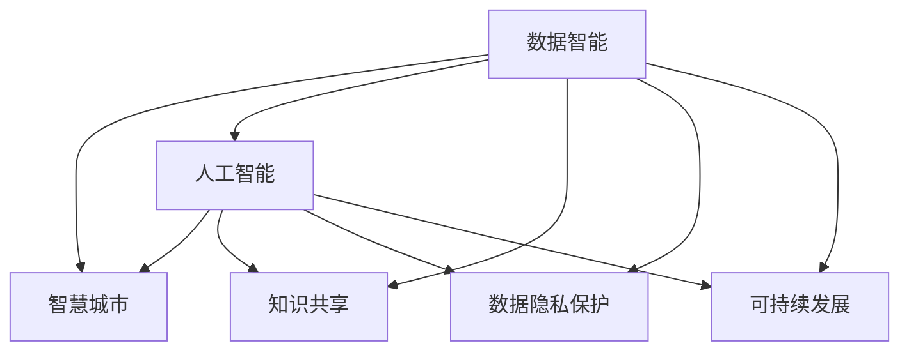

                 

# 知识型社会的特征与挑战

> 关键词：知识型社会, 智慧城市, 数据智能, 人工智能, 知识共享, 隐私保护, 教育普及, 可持续发展

## 1. 背景介绍

### 1.1 问题由来
在人类社会从工业社会向信息社会转型的过程中，知识和智慧在社会进步中的作用愈加凸显。大数据、云计算、物联网等技术的发展，极大地拓宽了数据获取和处理的边界，使得知识型社会成为可能。知识型社会以知识为核心的生产方式，构建起一个以智慧生产和智慧服务为基础的新型经济体系，正在重塑全球价值链。

知识型社会下的数据智能、人工智能、知识共享等技术的应用，将彻底改变社会经济结构。但同时，这一过程中也面临着数据隐私保护、公平教育普及、可持续发展等诸多挑战。本文将从知识型社会的基本特征出发，探讨其面临的主要挑战，并提出相应的解决方案。

### 1.2 问题核心关键点
知识型社会的基本特征包括：
1. **数据驱动**：知识型社会的基础是数据的全面获取和深度分析，数据的价值在各个领域中得以充分体现。
2. **智慧生产**：通过智能制造、智慧农业等技术，大幅提升生产效率和产品质量。
3. **智慧服务**：智慧交通、智慧医疗等服务的普及，极大地提升公共服务的质量和效率。
4. **知识共享**：构建开放式知识平台，促进知识在全社会的流通和利用。
5. **人工智能**：利用大数据、云计算等技术，推动人工智能的深度应用。

这些特征相互支撑，共同构成了知识型社会的基础。但同时，知识型社会也面临着数据隐私保护、公平教育普及、可持续发展等挑战，这些问题将直接影响到社会的整体健康发展。

### 1.3 问题研究意义
探索知识型社会的特征与挑战，对于理解当前社会经济结构变革的趋势，制定相应的政策法规，促进社会公平和可持续发展，具有重要意义：

1. **指导政策制定**：知识型社会的数据驱动、智慧生产和智慧服务，将影响政府在公共服务、企业治理、社会管理等方面的决策，需要政府从中提供强有力的政策支持。
2. **推动技术创新**：知识型社会依赖于数据智能、人工智能等技术的广泛应用，技术创新成为推动社会进步的重要动力。
3. **促进教育普及**：知识型社会要求高素质的劳动人口，需要普及高质量的教育，提高全社会的知识水平。
4. **保障数据隐私**：知识型社会的数据量庞大且敏感，需要制定和实施有效的隐私保护政策，保障公民的数据权利。
5. **推动可持续发展**：知识型社会依赖于资源的合理配置和环境的保护，需要通过技术创新和政策引导，实现经济社会与环境的和谐发展。

综上所述，探索知识型社会的特征与挑战，是理解社会经济结构变革的关键，有助于推动技术进步和社会进步。

## 2. 核心概念与联系

### 2.1 核心概念概述

知识型社会的基本概念包括：

- **数据智能**：基于大数据分析和人工智能技术，实现数据的智能处理和决策支持。
- **智慧城市**：通过物联网、云计算等技术，构建智慧化的城市管理体系，提升城市治理效率。
- **人工智能**：利用机器学习、深度学习等技术，实现智能化的应用服务，提升社会效率。
- **知识共享**：通过开放式平台和标准化的数据接口，促进知识在全社会的流通和利用。
- **数据隐私保护**：在知识型社会中，数据隐私保护是确保社会公平和公正的基础。
- **可持续发展**：知识型社会强调资源的合理利用和环境的保护，推动经济社会的可持续发展。

这些概念之间的联系可以通过以下Mermaid流程图来展示：



这个流程图展示了数据智能、智慧城市、人工智能、知识共享、数据隐私保护和可持续发展之间的关系：

1. 数据智能是智慧城市、人工智能、知识共享的基础，提供数据支持。
2. 智慧城市、人工智能、知识共享共同推动数据智能的深化应用。
3. 数据隐私保护和可持续发展是数据智能、智慧城市、人工智能、知识共享的重要保障。

这些概念共同构成了知识型社会的基础，它们相互支撑，共同促进社会的健康发展。

## 3. 核心算法原理 & 具体操作步骤
### 3.1 算法原理概述

知识型社会的数据智能和人工智能应用，很大程度上依赖于数据的智能分析和处理。以下将重点介绍数据智能的算法原理，同时也会涵盖人工智能的基本实现步骤。

### 3.2 算法步骤详解

#### 3.2.1 数据智能
数据智能的算法步骤主要包括：

1. **数据采集**：通过传感器、网络等方式全面采集数据。
2. **数据清洗**：对采集到的数据进行去噪、处理缺失值等预处理工作。
3. **数据存储**：将清洗后的数据存储在分布式数据库中，以便后续处理。
4. **数据挖掘**：通过机器学习算法，挖掘数据中的潜在规律和知识。
5. **知识图谱构建**：将数据挖掘结果构建成知识图谱，方便后续的知识推理和决策支持。
6. **智能决策**：基于知识图谱和智能算法，进行决策支持和自动化决策。

以智慧城市为例，其数据智能的算法步骤可以概括为：

1. **数据采集**：通过城市物联网设备采集交通、环境、能源等数据。
2. **数据清洗**：对采集到的数据进行去噪、处理缺失值等预处理工作。
3. **数据存储**：将清洗后的数据存储在分布式数据库中。
4. **数据挖掘**：通过机器学习算法，挖掘交通流预测、环境污染检测、能源消耗分析等规律。
5. **知识图谱构建**：将挖掘结果构建成城市交通、环境、能源等领域的应用知识图谱。
6. **智能决策**：基于知识图谱和智能算法，进行交通信号优化、环境污染治理、能源管理等决策。

#### 3.2.2 人工智能
人工智能的算法步骤主要包括：

1. **数据预处理**：对原始数据进行去噪、归一化等预处理。
2. **模型训练**：选择合适的人工智能模型，如神经网络、支持向量机等，进行模型训练。
3. **模型评估**：对训练好的模型进行评估，选择性能最优的模型。
4. **模型部署**：将训练好的模型部署到实际应用中。
5. **模型优化**：根据实际应用效果，对模型进行优化和调整。

以智能推荐系统为例，其人工智能的算法步骤可以概括为：

1. **数据预处理**：对用户行为数据进行去噪、归一化等预处理。
2. **模型训练**：选择合适的人工智能模型，如深度学习模型，进行模型训练。
3. **模型评估**：对训练好的模型进行评估，选择性能最优的模型。
4. **模型部署**：将训练好的模型部署到推荐服务中。
5. **模型优化**：根据实际推荐效果，对模型进行优化和调整。

### 3.3 算法优缺点

数据智能和人工智能的算法优缺点如下：

#### 数据智能的优点：
1. **全面性**：通过全面采集数据，可以获得更加完整的信息，提升决策的全面性。
2. **实时性**：通过智能算法，能够实时处理和分析数据，提升决策的及时性。
3. **系统性**：基于知识图谱的构建，能够系统地整合和利用数据，提升决策的系统性。

#### 数据智能的缺点：
1. **隐私问题**：全面采集数据可能涉及用户隐私问题，需要严格的数据隐私保护。
2. **数据质量**：数据的全面采集和清洗可能存在一定的困难和误差。
3. **模型复杂性**：知识图谱的构建和智能决策需要复杂的模型和算法，计算量较大。

#### 人工智能的优点：
1. **高效性**：通过训练好的模型，能够在短时间内处理大量数据，提升决策的效率。
2. **精确性**：训练好的模型能够精确预测用户行为、市场趋势等，提升决策的准确性。
3. **可扩展性**：人工智能模型可以很容易地扩展到不同的应用场景，提升决策的灵活性。

#### 人工智能的缺点：
1. **数据依赖性**：人工智能模型的效果依赖于数据的质量和量，数据不足可能影响模型性能。
2. **模型风险**：训练好的模型可能存在过拟合等问题，需要进行持续优化和调整。
3. **技术门槛**：训练和优化人工智能模型需要较强的技术能力，对开发者的技术要求较高。

### 3.4 算法应用领域

数据智能和人工智能在各个领域都有广泛的应用，主要包括以下几个方面：

1. **智能制造**：通过机器学习算法对生产过程进行优化，提升生产效率和产品质量。
2. **智慧农业**：通过遥感技术和机器学习算法，进行农田管理、病虫害预测等。
3. **智慧医疗**：通过数据分析和机器学习算法，进行疾病预测、诊断和治疗方案优化。
4. **智慧交通**：通过数据分析和机器学习算法，进行交通流量预测、信号优化等。
5. **智能推荐**：通过机器学习算法，进行商品推荐、内容推荐等。
6. **智能安防**：通过视频分析和人脸识别等技术，进行安防监控和预警。
7. **智慧教育**：通过数据分析和机器学习算法，进行学习行为分析、个性化推荐等。

## 4. 数学模型和公式 & 详细讲解 & 举例说明

### 4.1 数学模型构建

#### 4.1.1 数据智能
在数据智能中，常用的数学模型包括：

- **回归模型**：用于预测连续变量的值，如时间序列预测、房价预测等。
- **分类模型**：用于分类问题，如垃圾邮件分类、客户分类等。
- **聚类模型**：用于将数据分为不同的群组，如市场细分、图像分割等。
- **关联规则模型**：用于发现数据之间的关联性，如购物篮分析、推荐系统等。

#### 4.1.2 人工智能
在人工智能中，常用的数学模型包括：

- **神经网络模型**：用于深度学习和非线性问题，如图像识别、语音识别等。
- **支持向量机模型**：用于分类和回归问题，如文本分类、图像分类等。
- **决策树模型**：用于分类和回归问题，如信用评分、客户细分等。
- **随机森林模型**：用于分类和回归问题，如推荐系统、广告推荐等。

### 4.2 公式推导过程

#### 4.2.1 数据智能
以时间序列预测为例，常用的回归模型包括ARIMA模型，其基本公式为：

$$ y(t) = \sum_{i=1}^p \alpha_i y(t-i) + \sum_{j=1}^q \beta_j y(t-j) + \sum_{k=1}^K \gamma_k \varepsilon(t-k) + \delta_t $$

其中 $y(t)$ 表示预测值，$\alpha_i$ 和 $\beta_j$ 为模型的系数，$\varepsilon(t-k)$ 为误差项，$\delta_t$ 为趋势项。

#### 4.2.2 人工智能
以卷积神经网络模型为例，其基本公式为：

$$ x_1 = w_1 x + b_1 $$
$$ x_2 = f(x_1) $$
$$ x_3 = w_2 x_2 + b_2 $$
$$ \ldots $$
$$ y = f(x_K) $$

其中 $x$ 表示输入，$w$ 和 $b$ 表示权重和偏置，$f$ 表示激活函数，$y$ 表示输出。

### 4.3 案例分析与讲解

#### 4.3.1 数据智能
以智慧城市中的交通流量预测为例，可以使用ARIMA模型进行预测。具体步骤如下：

1. **数据采集**：通过城市物联网设备采集交通流量数据。
2. **数据清洗**：对采集到的数据进行去噪、处理缺失值等预处理工作。
3. **数据存储**：将清洗后的数据存储在分布式数据库中。
4. **模型训练**：使用历史数据训练ARIMA模型。
5. **模型评估**：对训练好的模型进行评估，选择性能最优的模型。
6. **智能决策**：基于训练好的模型，进行交通流量预测，优化信号灯控制。

#### 4.3.2 人工智能
以智能推荐系统为例，可以使用协同过滤算法进行推荐。具体步骤如下：

1. **数据预处理**：对用户行为数据进行去噪、归一化等预处理。
2. **模型训练**：选择协同过滤算法，如基于矩阵分解的模型，进行模型训练。
3. **模型评估**：对训练好的模型进行评估，选择性能最优的模型。
4. **模型部署**：将训练好的模型部署到推荐服务中。
5. **模型优化**：根据实际推荐效果，对模型进行优化和调整。

## 5. 项目实践：代码实例和详细解释说明

### 5.1 开发环境搭建

在进行数据智能和人工智能项目实践前，我们需要准备好开发环境。以下是使用Python进行TensorFlow和Keras开发的环境配置流程：

1. 安装Anaconda：从官网下载并安装Anaconda，用于创建独立的Python环境。

2. 创建并激活虚拟环境：
```bash
conda create -n pytensor-env python=3.8 
conda activate pytensor-env
```

3. 安装TensorFlow：根据CUDA版本，从官网获取对应的安装命令。例如：
```bash
conda install tensorflow -c conda-forge
```

4. 安装Keras：
```bash
conda install keras
```

5. 安装各类工具包：
```bash
pip install numpy pandas scikit-learn matplotlib tqdm jupyter notebook ipython
```

完成上述步骤后，即可在`pytensor-env`环境中开始项目实践。

### 5.2 源代码详细实现

这里我们以智慧城市的交通流量预测为例，给出使用TensorFlow和Keras进行数据智能的PyTorch代码实现。

首先，定义数据预处理函数：

```python
import numpy as np
from tensorflow.keras.preprocessing import sequence

def preprocess_data(data, seq_len):
    X = []
    y = []
    for i in range(len(data)-seq_len-1):
        X.append(data[i:i+seq_len])
        y.append(data[i+seq_len])
    X = np.array(X)
    y = np.array(y)
    return X, y

# 读取数据
data = read_data('traffic_flow.csv')

# 数据预处理
X_train, y_train = preprocess_data(data['train'], seq_len=10)
X_test, y_test = preprocess_data(data['test'], seq_len=10)
```

然后，定义模型和训练函数：

```python
from tensorflow.keras.models import Sequential
from tensorflow.keras.layers import LSTM, Dense

# 定义模型
model = Sequential()
model.add(LSTM(50, input_shape=(seq_len, 1), return_sequences=True))
model.add(LSTM(50))
model.add(Dense(1))
model.compile(optimizer='adam', loss='mse')

# 训练模型
model.fit(X_train, y_train, epochs=50, batch_size=32, validation_data=(X_test, y_test))
```

接着，评估模型：

```python
# 评估模型
y_pred = model.predict(X_test)
print(metrics.mean_squared_error(y_test, y_pred))
```

以上就是使用TensorFlow和Keras进行智慧城市交通流量预测的完整代码实现。可以看到，得益于TensorFlow和Keras的强大封装，我们可以用相对简洁的代码完成模型训练和评估。

### 5.3 代码解读与分析

让我们再详细解读一下关键代码的实现细节：

**preprocess_data函数**：
- `__init__`方法：初始化数据预处理参数，如序列长度。
- `__len__`方法：返回数据集的样本数量。
- `__getitem__`方法：对单个样本进行处理，将输入序列进行定长padding，并输出目标序列。

**LSTM模型**：
- `__init__`方法：定义模型的层次结构和参数。
- `add`方法：添加模型层，包括LSTM层、全连接层等。
- `compile`方法：编译模型，选择优化器和损失函数。
- `fit`方法：训练模型，设置训练轮数和批大小。
- `predict`方法：预测模型，计算预测结果。

**评估模型**：
- `__init__`方法：初始化评估参数，如均方误差。
- `mean_squared_error`方法：计算模型预测结果和真实标签之间的均方误差。

可以看到，TensorFlow和Keras使得数据智能的实现变得简洁高效。开发者可以将更多精力放在数据处理、模型改进等高层逻辑上，而不必过多关注底层的实现细节。

当然，工业级的系统实现还需考虑更多因素，如模型的保存和部署、超参数的自动搜索、更灵活的任务适配层等。但核心的数据智能实现基本与此类似。

## 6. 实际应用场景

### 6.1 智能制造

智慧制造是数据智能和人工智能在工业领域的重要应用之一。通过智能制造，实现生产过程的自动化和智能化，极大地提升生产效率和产品质量。

在实际应用中，智能制造可以分为以下几个阶段：

1. **数据采集**：通过传感器、监测设备等，全面采集生产过程的数据。
2. **数据清洗**：对采集到的数据进行去噪、处理缺失值等预处理工作。
3. **数据存储**：将清洗后的数据存储在分布式数据库中，以便后续处理。
4. **数据挖掘**：通过机器学习算法，挖掘生产过程中的规律和异常。
5. **知识图谱构建**：将挖掘结果构建成生产过程的知识图谱，方便后续的知识推理和决策支持。
6. **智能决策**：基于知识图谱和智能算法，进行生产调度、设备维护、质量控制等决策。

例如，在钢铁生产过程中，可以使用数据智能和人工智能技术，实现高炉炼铁、连铸连轧等环节的优化，提升生产效率和产品质量。

### 6.2 智慧医疗

智慧医疗是数据智能和人工智能在医疗领域的重要应用之一。通过智慧医疗，实现医疗数据的智能化分析和应用，提升医疗服务的质量和效率。

在实际应用中，智慧医疗可以分为以下几个阶段：

1. **数据采集**：通过医院信息系统、穿戴设备等，全面采集病人的健康数据。
2. **数据清洗**：对采集到的数据进行去噪、处理缺失值等预处理工作。
3. **数据存储**：将清洗后的数据存储在分布式数据库中，以便后续处理。
4. **数据挖掘**：通过机器学习算法，挖掘病人的健康状况和疾病风险。
5. **知识图谱构建**：将挖掘结果构建成医疗知识图谱，方便后续的知识推理和决策支持。
6. **智能决策**：基于知识图谱和智能算法，进行疾病诊断、治疗方案优化、智能导诊等决策。

例如，在远程医疗中，可以使用数据智能和人工智能技术，实现病人的远程监测和诊断，提高医疗服务的覆盖面和效率。

### 6.3 智能推荐

智能推荐是数据智能和人工智能在电商、内容服务等领域的重要应用之一。通过智能推荐，实现个性化推荐服务，提升用户体验和平台收益。

在实际应用中，智能推荐可以分为以下几个阶段：

1. **数据采集**：通过用户行为数据、商品属性等，全面采集推荐数据。
2. **数据清洗**：对采集到的数据进行去噪、处理缺失值等预处理工作。
3. **数据存储**：将清洗后的数据存储在分布式数据库中，以便后续处理。
4. **数据挖掘**：通过机器学习算法，挖掘用户的行为模式和偏好。
5. **知识图谱构建**：将挖掘结果构建成推荐知识图谱，方便后续的推荐决策。
6. **智能决策**：基于知识图谱和智能算法，进行个性化推荐服务。

例如，在电商平台中，可以使用数据智能和人工智能技术，实现商品推荐、广告推荐等，提升用户的购物体验和平台的销售收益。

## 7. 工具和资源推荐

### 7.1 学习资源推荐

为了帮助开发者系统掌握数据智能和人工智能的理论基础和实践技巧，这里推荐一些优质的学习资源：

1. **《深度学习》课程**：斯坦福大学开设的深度学习课程，深入浅出地介绍了深度学习的基本概念和常用算法。
2. **《TensorFlow实战》书籍**：TensorFlow官方出版的实战指南，提供了大量的实例和案例，帮助你快速上手TensorFlow开发。
3. **《Keras实战》书籍**：Keras官方出版的实战指南，提供了丰富的实例和案例，帮助你快速上手Keras开发。
4. **Coursera平台**：提供大量的在线课程，涵盖深度学习、机器学习、数据智能等领域。
5. **Kaggle平台**：提供大量的数据集和比赛项目，帮助你实践和提升自己的数据智能和人工智能技能。

通过对这些资源的学习实践，相信你一定能够快速掌握数据智能和人工智能的精髓，并用于解决实际的业务问题。

### 7.2 开发工具推荐

高效的数据智能和人工智能开发离不开优秀的工具支持。以下是几款用于开发和部署数据智能和人工智能系统的常用工具：

1. TensorFlow：由Google主导开发的开源深度学习框架，提供丰富的模型和工具，支持大规模工程应用。
2. Keras：基于TensorFlow的高级API，提供简洁易用的API接口，适合快速原型开发。
3. PyTorch：由Facebook主导开发的开源深度学习框架，灵活高效的动态图机制，适合研究型开发。
4. Scikit-learn：Python机器学习库，提供简单易用的API接口，适合数据挖掘和机器学习任务。
5. H2O.ai：提供高性能的机器学习平台，支持分布式计算和模型优化。
6. Apache Spark：提供分布式计算平台，支持大数据处理和机器学习任务。

合理利用这些工具，可以显著提升数据智能和人工智能的开发效率，加快创新迭代的步伐。

### 7.3 相关论文推荐

数据智能和人工智能的发展源于学界的持续研究。以下是几篇奠基性的相关论文，推荐阅读：

1. **深度学习中的神经网络模型**：提出神经网络模型的基本原理和应用场景，奠定了深度学习的基础。
2. **支持向量机算法**：介绍支持向量机的基本原理和应用场景，提供了有效的分类和回归算法。
3. **协同过滤算法**：介绍协同过滤算法的原理和应用场景，提供了有效的推荐算法。
4. **LSTM神经网络模型**：介绍LSTM模型的基本原理和应用场景，提供了有效的序列数据处理算法。
5. **强化学习算法**：介绍强化学习的基本原理和应用场景，提供了有效的智能决策算法。

这些论文代表了大数据智能和人工智能的发展脉络。通过学习这些前沿成果，可以帮助研究者把握学科前进方向，激发更多的创新灵感。

## 8. 总结：未来发展趋势与挑战

### 8.1 总结

本文对数据智能和人工智能在知识型社会中的应用进行了全面系统的介绍。首先，探讨了数据智能和人工智能的基本概念和特征，明确了它们在知识型社会中的重要地位。其次，从算法原理和具体操作步骤出发，详细讲解了数据智能和人工智能的实现方法。同时，探讨了数据智能和人工智能在智能制造、智慧医疗、智能推荐等多个领域的应用场景，展示了其在推动社会进步方面的巨大潜力。最后，推荐了一些学习资源和工具，以便读者更好地掌握数据智能和人工智能的技能。

通过本文的系统梳理，可以看到，数据智能和人工智能正在成为知识型社会的重要支撑技术，极大地推动了社会生产力的提升和经济结构的转型。未来，随着技术的不断进步，数据智能和人工智能将会在更多领域得到应用，为社会带来更深远的影响。

### 8.2 未来发展趋势

展望未来，数据智能和人工智能技术将呈现以下几个发展趋势：

1. **深度学习技术的不断演进**：深度学习算法和技术将不断演进，提供更加高效和灵活的解决方案。
2. **跨领域应用的扩展**：数据智能和人工智能将广泛应用于更多领域，如自动驾驶、智能家居、智慧城市等。
3. **云计算和分布式计算的普及**：云计算和分布式计算技术将大大提升数据智能和人工智能的计算能力。
4. **模型的可解释性和可信性**：数据智能和人工智能模型将更加注重可解释性和可信性，提升模型的透明度和可靠性。
5. **数据安全和隐私保护**：数据智能和人工智能将更加注重数据安全和隐私保护，保障用户的数据权利。

这些趋势凸显了数据智能和人工智能技术的广阔前景，预示着未来将有更多的创新和突破。

### 8.3 面临的挑战

尽管数据智能和人工智能技术取得了显著的进展，但在迈向更加智能化、普适化应用的过程中，它们仍面临着诸多挑战：

1. **数据质量和多样性**：数据智能和人工智能的性能依赖于数据的质量和多样性，数据不足或数据偏差可能影响模型效果。
2. **模型的复杂性**：数据智能和人工智能模型通常具有较高的复杂性，训练和优化需要较强的技术能力。
3. **计算资源需求**：数据智能和人工智能模型通常需要大量的计算资源，高性能计算设备和算法的优化是其重要的研究方向。
4. **模型的可解释性**：数据智能和人工智能模型的决策过程难以解释，模型缺乏可解释性和可审计性。
5. **数据安全和隐私保护**：数据智能和人工智能模型依赖于大量的敏感数据，数据隐私保护是其重要保障。

这些挑战将直接影响数据智能和人工智能的实际应用效果和普及程度。

### 8.4 研究展望

面对数据智能和人工智能所面临的挑战，未来的研究需要在以下几个方面寻求新的突破：

1. **数据增强技术**：通过数据增强技术，提升数据的多样性和质量，降低模型对标注数据的依赖。
2. **模型压缩和优化**：通过模型压缩和优化技术，降低模型的计算资源需求，提升模型的实时性。
3. **模型的可解释性**：通过可解释性技术，提升模型的透明度和可靠性，帮助用户理解和信任模型。
4. **数据安全和隐私保护**：通过数据安全和隐私保护技术，保障用户的数据权利，提升模型的可信性和普及性。

这些研究方向将推动数据智能和人工智能技术的进一步发展，为知识型社会带来更多创新和突破。

## 9. 附录：常见问题与解答

**Q1：如何选择合适的模型和算法？**

A: 在选择模型和算法时，需要考虑以下几个因素：

1. **数据类型**：不同类型的数据适合不同的模型和算法。如数值型数据适合回归模型，分类数据适合分类模型等。
2. **数据规模**：数据规模的大小也决定了模型的选择。小规模数据适合简单的模型，大规模数据适合复杂的模型。
3. **应用场景**：不同的应用场景需要不同的模型和算法。如推荐系统适合协同过滤算法，医疗领域适合基于规则的模型等。

综合考虑这些因素，选择合适的模型和算法，能够提升模型的效果和效率。

**Q2：数据智能和人工智能在知识型社会中如何发挥作用？**

A: 数据智能和人工智能在知识型社会中主要发挥以下作用：

1. **数据驱动决策**：通过数据智能和人工智能技术，实现数据的全面采集和分析，提升决策的科学性和准确性。
2. **智慧服务和生产**：通过智慧服务、智能生产等技术，提升公共服务、生产效率和产品质量。
3. **知识共享和普及**：通过开放式知识平台，促进知识的流通和利用，推动知识共享和普及。
4. **智能推荐和个性化服务**：通过智能推荐、个性化服务等技术，提升用户体验和平台收益。
5. **可持续发展和环境保护**：通过数据智能和人工智能技术，优化资源配置和环境保护，推动经济社会的可持续发展。

这些作用凸显了数据智能和人工智能在知识型社会中的重要地位，推动了社会生产力的提升和经济结构的转型。

**Q3：数据智能和人工智能在实际应用中面临哪些挑战？**

A: 数据智能和人工智能在实际应用中面临以下挑战：

1. **数据质量和多样性**：数据智能和人工智能的性能依赖于数据的质量和多样性，数据不足或数据偏差可能影响模型效果。
2. **模型的复杂性**：数据智能和人工智能模型通常具有较高的复杂性，训练和优化需要较强的技术能力。
3. **计算资源需求**：数据智能和人工智能模型通常需要大量的计算资源，高性能计算设备和算法的优化是其重要的研究方向。
4. **模型的可解释性**：数据智能和人工智能模型的决策过程难以解释，模型缺乏可解释性和可审计性。
5. **数据安全和隐私保护**：数据智能和人工智能模型依赖于大量的敏感数据，数据隐私保护是其重要保障。

这些挑战将直接影响数据智能和人工智能的实际应用效果和普及程度。

**Q4：数据智能和人工智能的未来发展方向是什么？**

A: 数据智能和人工智能的未来发展方向包括：

1. **深度学习技术的不断演进**：深度学习算法和技术将不断演进，提供更加高效和灵活的解决方案。
2. **跨领域应用的扩展**：数据智能和人工智能将广泛应用于更多领域，如自动驾驶、智能家居、智慧城市等。
3. **云计算和分布式计算的普及**：云计算和分布式计算技术将大大提升数据智能和人工智能的计算能力。
4. **模型的可解释性和可信性**：数据智能和人工智能模型将更加注重可解释性和可信性，提升模型的透明度和可靠性。
5. **数据安全和隐私保护**：数据智能和人工智能模型依赖于大量的敏感数据，数据隐私保护是其重要保障。

这些趋势凸显了数据智能和人工智能技术的广阔前景，预示着未来将有更多的创新和突破。

---

作者：禅与计算机程序设计艺术 / Zen and the Art of Computer Programming

