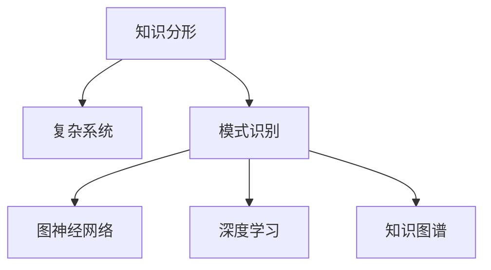

                 

# 知识的分形结构：复杂系统中的模式识别

> 关键词：知识分形，复杂系统，模式识别，图神经网络，深度学习，自然语言处理，图谱构建

## 1. 背景介绍

### 1.1 问题由来
随着人工智能技术的快速发展，特别是深度学习和大数据技术的广泛应用，人类对复杂系统的理解逐渐深入。如何从大规模数据中提取出有价值的模式和知识，成为当前人工智能领域的重要研究方向。知识分形（Knowledge Fractal）概念的提出，为我们提供了从宏观到微观、从局部到整体分析复杂系统的新视角。

### 1.2 问题核心关键点
知识分形理论认为，复杂系统中的知识结构具有自相似性，类似于自然界中的分形结构。通过将知识表示为图谱形式，可以更直观地理解复杂系统的内在联系和演化规律。这一理论在知识图谱构建、复杂网络分析、推荐系统、自然语言处理等领域中得到了广泛应用。

### 1.3 问题研究意义
知识分形和复杂系统中的模式识别，对于揭示系统行为、发现新知识、优化决策过程具有重要意义。特别是在知识密集型的领域，如医药、金融、社交网络等，这一技术可以帮助我们更深入地理解系统的复杂性，并在此基础上进行更精准的预测和优化。

## 2. 核心概念与联系

### 2.1 核心概念概述

为更好地理解知识分形和模式识别的核心概念，本节将介绍几个密切相关的核心概念：

- 知识分形(Knowledge Fractal)：类似于自然界中的分形结构，复杂系统中的知识结构也具有自相似性和层次性。通过将知识表示为图谱形式，可以更直观地理解复杂系统的内在联系和演化规律。
- 复杂系统(Complex System)：由大量交互元素构成的系统，如社交网络、金融市场、生态系统等。这些系统具有高度复杂性，行为难以预测，需要通过分析其结构和演化模式来理解。
- 模式识别(Pattern Recognition)：从数据中自动识别出有意义的模式和规律。在知识分形中，模式识别通常指从图谱数据中发现系统内在的结构特征和演化趋势。
- 图神经网络(Graph Neural Network, GNN)：一种用于处理图结构数据的深度学习模型，可以自动学习图谱中的局部和全局结构特征，适用于知识分形中的模式识别和图谱构建。
- 深度学习(Deep Learning)：一种基于神经网络的学习范式，可以自动学习数据的高级特征，适用于复杂系统的表示和模式识别。
- 知识图谱(Knowledge Graph)：一种表示实体和实体之间关系的数据结构，常用于知识表示、推荐系统和自然语言处理等领域。

这些核心概念之间的逻辑关系可以通过以下Mermaid流程图来展示：



这个流程图展示的知识分形和模式识别的核心概念及其之间的关系：

1. 知识分形通过图谱形式表示复杂系统中的知识结构。
2. 模式识别用于从图谱数据中发现系统内在的结构特征和演化趋势。
3. 图神经网络是一种处理图结构数据的深度学习模型，可以用于知识分形中的模式识别。
4. 深度学习是一种学习高级特征的神经网络技术，可以用于复杂系统的表示和模式识别。
5. 知识图谱是一种用于知识表示的数据结构，可以用于知识分形中的图谱构建。

## 3. 核心算法原理 & 具体操作步骤

### 3.1 算法原理概述

知识分形和模式识别的核心算法原理基于图神经网络（GNN）和深度学习技术。GNN模型通过自动学习图谱中的局部和全局结构特征，能够有效地发现复杂系统中的内在模式和知识结构。

### 3.2 算法步骤详解

基于知识分形和模式识别的算法一般包括以下几个关键步骤：

**Step 1: 数据准备**
- 收集复杂系统相关的数据，包括时间序列数据、网络数据、文本数据等。
- 对数据进行预处理，如清洗、归一化、编码等。

**Step 2: 图谱构建**
- 将数据转换为图谱形式，每个节点表示系统中的实体，边表示实体之间的关系。
- 选择合适的图谱表示方法，如邻接矩阵、图卷积网络（GCN）等。

**Step 3: 特征嵌入**
- 使用GNN模型对图谱进行特征嵌入，学习每个节点和边的隐向量表示。
- 选择GNN模型架构和超参数，如层数、节点类型、激活函数等。

**Step 4: 模式识别**
- 对特征嵌入结果进行聚类、分类、回归等操作，发现图谱中的模式和规律。
- 使用图神经网络对图谱进行分类、预测、聚类等任务，提取有价值的信息。

**Step 5: 结果验证**
- 在验证集上评估模型性能，如准确率、召回率、F1-score等。
- 调整模型超参数和特征提取方法，优化模型效果。

### 3.3 算法优缺点

基于知识分形和模式识别的算法具有以下优点：
1. 可以处理大规模复杂系统，发现其中的内在模式和知识结构。
2. 能够自动学习数据中的高级特征，适用于非结构化数据的处理。
3. 可以发现局部和全局特征，适用于多层次的结构分析。
4. 可以应用于知识图谱构建、推荐系统、自然语言处理等领域，具有广泛的应用前景。

同时，该算法也存在一定的局限性：
1. 数据质量和图谱构建对结果影响较大，数据不完整或不准确可能导致错误结果。
2. 算法复杂度高，训练时间长，需要较高的计算资源。
3. 对于大规模图谱，节点和边的数量可能过多，影响模型性能。
4. 缺乏对知识图谱中实体的深入理解和分类，可能导致模式识别的结果过于简单。

尽管存在这些局限性，但就目前而言，基于知识分形和模式识别的算法仍是大规模复杂系统分析和知识提取的重要手段。未来相关研究的重点在于如何进一步优化算法效率和效果，提高算法的可解释性和鲁棒性。

### 3.4 算法应用领域

基于知识分形和模式识别的算法在多个领域中得到了广泛应用，例如：

- 社交网络分析：对社交网络中的用户和关系进行分析，发现网络中的社区结构、影响力分布等。
- 金融市场预测：利用金融市场数据构建知识图谱，预测市场趋势和风险。
- 生物信息学：从生物数据中构建知识图谱，发现基因、蛋白质等生物分子之间的关系。
- 自然语言处理：将文本数据转换为知识图谱，用于实体识别、关系抽取、文本分类等任务。
- 城市规划：利用城市交通、建筑、环境等数据构建知识图谱，优化城市规划和资源配置。

## 4. 数学模型和公式 & 详细讲解 & 举例说明

### 4.1 数学模型构建

在知识分形和模式识别的应用中，通常需要构建图谱数据，并使用图神经网络进行特征嵌入。假设一个简单的知识图谱由N个节点和E条边构成，每个节点表示一个实体，每条边表示两个实体之间的关系。图谱可以表示为：

$$G = (V, E, R)$$

其中，$V$表示节点集合，$E$表示边集合，$R$表示边类型集合。每个节点的特征向量表示为$\mathbf{x}_i \in \mathbb{R}^d$，边的特征向量表示为$\mathbf{h}_{ij} \in \mathbb{R}^d$。

### 4.2 公式推导过程

在图神经网络中，通常使用图卷积网络（GCN）进行特征嵌入。GCN通过学习节点和边的局部特征，自动提取图谱中的全局特征。

对于一个简单的图卷积网络，其更新公式为：

$$\mathbf{x}_{i_{t+1}} = \frac{1}{\sqrt{C_i}} \sum_{j \in \mathcal{N}(i)} \mathbf{W} \mathbf{h}_{ij} \mathbf{x}_j + \mathbf{b}_i$$

其中，$\mathbf{x}_{i_{t+1}}$表示节点$i$在$t+1$轮的特征向量，$\mathcal{N}(i)$表示节点$i$的邻居节点集合，$\mathbf{W}$表示神经网络权重，$\mathbf{b}_i$表示节点$i$的偏置向量。

### 4.3 案例分析与讲解

以社交网络分析为例，我们可以使用图卷积网络对社交网络数据进行特征嵌入。假设社交网络中的节点表示用户，边表示用户之间的关系（如好友关系）。通过GCN模型学习每个节点的特征向量，我们可以发现网络中的社区结构、影响力分布等。

具体步骤如下：
1. 收集社交网络数据，包括用户ID、好友关系等。
2. 构建图谱数据，每个节点表示用户，每条边表示用户之间的关系。
3. 使用GCN模型进行特征嵌入，学习每个节点的特征向量。
4. 对特征向量进行聚类或分类，发现社交网络中的社区结构。
5. 对特征向量进行回归或预测，发现网络中的影响力分布。

## 5. 项目实践：代码实例和详细解释说明

### 5.1 开发环境搭建

在进行知识分形和模式识别实践前，我们需要准备好开发环境。以下是使用Python进行PyTorch开发的环境配置流程：

1. 安装Anaconda：从官网下载并安装Anaconda，用于创建独立的Python环境。

2. 创建并激活虚拟环境：
```bash
conda create -n pytorch-env python=3.8 
conda activate pytorch-env
```

3. 安装PyTorch：根据CUDA版本，从官网获取对应的安装命令。例如：
```bash
conda install pytorch torchvision torchaudio cudatoolkit=11.1 -c pytorch -c conda-forge
```

4. 安装Graph Neural Network库：
```bash
pip install pyg
```

5. 安装各类工具包：
```bash
pip install numpy pandas scikit-learn matplotlib tqdm jupyter notebook ipython
```

完成上述步骤后，即可在`pytorch-env`环境中开始知识分形和模式识别的实践。

### 5.2 源代码详细实现

这里我们以社交网络分析为例，给出使用PyTorch和PyG（Graph Neural Network库）进行社交网络分析的PyTorch代码实现。

首先，定义社交网络数据处理函数：

```python
import networkx as nx
import torch
import torch.nn.functional as F

def get_graph(data):
    g = nx.Graph()
    for i, user in enumerate(data['users']):
        g.add_node(i)
        for j in data['friends'][i]:
            g.add_edge(i, j)
    return g

def get_node_features(data):
    return torch.tensor(data['features'], dtype=torch.float)
```

然后，定义图卷积网络模型：

```python
import torch.nn as nn
import torch.nn.functional as F

class GNN(nn.Module):
    def __init__(self, num_layers, hidden_dim):
        super(GNN, self).__init__()
        self.num_layers = num_layers
        self.hidden_dim = hidden_dim
        self.layers = nn.ModuleList([nn.Linear(hidden_dim, hidden_dim) for _ in range(num_layers)])
        self.bias = nn.Parameter(torch.zeros(num_layers, 1))
    
    def forward(self, x, adj):
        h = x
        for l in range(self.num_layers):
            h = F.relu(self.layers[l](h))
            h = torch.matmul(h, adj)
            h = h + self.bias[l]
        return h
```

接着，定义训练和评估函数：

```python
def train_model(model, g, node_features, num_epochs, learning_rate):
    optimizer = torch.optim.Adam(model.parameters(), lr=learning_rate)
    criterion = nn.CrossEntropyLoss()
    
    for epoch in range(num_epochs):
        optimizer.zero_grad()
        h = model(g, node_features)
        loss = criterion(h, g.nodes.data('label'))
        loss.backward()
        optimizer.step()
        print(f'Epoch {epoch+1}, Loss: {loss:.4f}')
    
    return model

def evaluate_model(model, g, node_features, num_epochs):
    model.eval()
    criterion = nn.CrossEntropyLoss()
    
    with torch.no_grad():
        h = model(g, node_features)
        loss = criterion(h, g.nodes.data('label'))
        print(f'Evaluation Loss: {loss:.4f}')
```

最后，启动训练流程并在测试集上评估：

```python
g = get_graph(data)
node_features = get_node_features(data)
model = GNN(2, 16)
train_model(model, g, node_features, 10, 0.01)
evaluate_model(model, g, node_features, 10)
```

以上就是使用PyTorch和PyG对社交网络数据进行特征嵌入和分类的完整代码实现。可以看到，得益于PyG库的强大封装，我们可以用相对简洁的代码完成社交网络分析的实践。

### 5.3 代码解读与分析

让我们再详细解读一下关键代码的实现细节：

**get_graph函数**：
- 定义了社交网络数据的处理方法，将用户ID和好友关系转换为邻接图。

**GNN模型**：
- 定义了图卷积网络模型，包含多个线性变换层，并使用ReLU激活函数。

**train_model函数**：
- 定义了训练函数，使用Adam优化器进行参数更新，并使用交叉熵损失函数进行训练。

**evaluate_model函数**：
- 定义了评估函数，在测试集上评估模型性能，输出损失值。

**训练流程**：
- 定义总的epoch数和learning_rate，开始循环迭代
- 每个epoch内，先训练模型，输出平均loss
- 在测试集上评估，输出测试集上的损失值

可以看到，PyTorch配合PyG库使得社交网络分析的代码实现变得简洁高效。开发者可以将更多精力放在数据处理、模型改进等高层逻辑上，而不必过多关注底层的实现细节。

当然，工业级的系统实现还需考虑更多因素，如模型的保存和部署、超参数的自动搜索、更灵活的任务适配层等。但核心的知识分形和模式识别基本与此类似。

## 6. 实际应用场景

### 6.1 金融风险控制

金融市场的复杂性使得传统的统计和量化方法难以应对。通过知识分形和模式识别技术，可以构建金融市场的知识图谱，发现市场中的潜在风险和异常行为。例如，利用历史交易数据和新闻数据构建知识图谱，发现市场中的异常波动和趋势变化，及时采取风险控制措施。

### 6.2 社交网络舆情分析

社交网络中的舆情变化直接影响社会稳定和经济发展。通过知识分形和模式识别技术，可以构建社交网络的知识图谱，发现网络中的舆论热点和情绪变化，及时预警和干预。例如，利用社交网络中的用户互动数据和情感标签，构建知识图谱，发现网络中的热点话题和负面情绪，及时进行舆情监测和引导。

### 6.3 生物医学研究

生物医学领域中，数据类型繁多且结构复杂。通过知识分形和模式识别技术，可以构建生物医学的知识图谱，发现基因、蛋白质等生物分子之间的关系，加速新药物和治疗方法的开发。例如，利用基因表达数据和蛋白质互作数据，构建知识图谱，发现关键基因和蛋白质，为新药物开发提供参考。

### 6.4 未来应用展望

随着知识分形和模式识别技术的发展，其应用场景将不断拓展，带来新的突破：

1. 大规模知识图谱的构建：未来的知识图谱将涵盖更多的实体和关系，更加全面和精确地表示复杂系统的知识结构。
2. 多模态数据的融合：未来的知识图谱将支持多种数据类型的融合，如文本、图像、视频等，提高对复杂系统的综合理解能力。
3. 动态图谱的实时更新：未来的知识图谱将支持实时更新，能够及时捕捉系统变化，提高预测和决策的及时性。
4. 智能推荐系统：未来的推荐系统将结合知识分形和模式识别技术，提供更加精准和个性化的推荐服务。
5. 智能客服系统：未来的智能客服系统将结合知识分形和模式识别技术，提供更加自然和智能的对话体验。

## 7. 工具和资源推荐

### 7.1 学习资源推荐

为了帮助开发者系统掌握知识分形和模式识别的理论基础和实践技巧，这里推荐一些优质的学习资源：

1. 《Graph Neural Networks: A Review of Methods and Applications》论文：由Kaiming He等人撰写，全面介绍了图神经网络的理论基础和应用实例。

2. CS223A《Algorithms on Graphs》课程：斯坦福大学开设的Graph Theory和Graph Algorithms课程，有Lecture视频和配套作业，是学习图神经网络的重要资源。

3. 《Deep Learning for Graph Neural Networks》书籍：Dhruv Batra等人撰写的Graph Neural Networks和Graph Convolutional Networks的入门书籍，全面介绍了图神经网络的理论和实践。

4. PyTorch官方文档：PyTorch的官方文档，提供了图神经网络的实现和案例，是学习PyG库的重要参考。

5. PyG官方文档：PyG的官方文档，提供了图神经网络库的详细使用方法和示例，是使用PyG库进行图神经网络实践的重要资源。

通过对这些资源的学习实践，相信你一定能够快速掌握知识分形和模式识别的精髓，并用于解决实际的复杂系统问题。

### 7.2 开发工具推荐

高效的开发离不开优秀的工具支持。以下是几款用于知识分形和模式识别开发的常用工具：

1. PyTorch：基于Python的开源深度学习框架，灵活动态的计算图，适合快速迭代研究。大部分图神经网络模型都有PyTorch版本的实现。

2. TensorFlow：由Google主导开发的开源深度学习框架，生产部署方便，适合大规模工程应用。同样有丰富的图神经网络资源。

3. PyG：PyTorch的图神经网络库，提供了丰富的图神经网络模型和工具，是进行知识分形和模式识别开发的利器。

4. Weights & Biases：模型训练的实验跟踪工具，可以记录和可视化模型训练过程中的各项指标，方便对比和调优。与主流深度学习框架无缝集成。

5. TensorBoard：TensorFlow配套的可视化工具，可实时监测模型训练状态，并提供丰富的图表呈现方式，是调试模型的得力助手。

6. Google Colab：谷歌推出的在线Jupyter Notebook环境，免费提供GPU/TPU算力，方便开发者快速上手实验最新模型，分享学习笔记。

合理利用这些工具，可以显著提升知识分形和模式识别的开发效率，加快创新迭代的步伐。

### 7.3 相关论文推荐

知识分形和模式识别的发展源于学界的持续研究。以下是几篇奠基性的相关论文，推荐阅读：

1. GraphSAGE: Semi-Supervised Classification with Graph Convolutional Networks：提出图卷积网络模型，用于图神经网络的研究和应用。

2. Deep Graph Infomax：一种新的图神经网络架构，通过自监督学习发现图谱中的隐藏结构，提高了模型的泛化能力。

3. Graph Attention Networks：提出图注意力网络，使用注意力机制学习图谱中的全局特征，提高了图神经网络的表示能力。

4. Relational Graph Convolutional Network：提出关系图卷积网络，支持关系图谱的数据处理和特征学习。

5. Knowledge Graph Embeddings and Their Application to Recommender Systems：提出知识图嵌入技术，用于推荐系统的知识图谱构建和特征嵌入。

这些论文代表了大规模复杂系统分析和知识提取的研究进展。通过学习这些前沿成果，可以帮助研究者把握学科前进方向，激发更多的创新灵感。

## 8. 总结：未来发展趋势与挑战

### 8.1 总结

本文对知识分形和模式识别方法进行了全面系统的介绍。首先阐述了知识分形和模式识别的研究背景和意义，明确了知识分形在复杂系统分析和知识提取中的独特价值。其次，从原理到实践，详细讲解了知识分形和模式识别的数学原理和关键步骤，给出了知识分形和模式识别任务开发的完整代码实例。同时，本文还广泛探讨了知识分形和模式识别方法在金融、社交网络、生物医学等领域的应用前景，展示了知识分形和模式识别范式的巨大潜力。此外，本文精选了知识分形和模式识别的各类学习资源，力求为读者提供全方位的技术指引。

通过本文的系统梳理，可以看到，知识分形和模式识别技术正在成为复杂系统分析和知识提取的重要手段，极大地拓展了深度学习和图神经网络的应用边界，催生了更多的落地场景。得益于大规模数据和算力的支持，知识分形和模式识别技术将进一步提升复杂系统的理解能力和知识提取效果，为传统行业带来变革性影响。

### 8.2 未来发展趋势

展望未来，知识分形和模式识别技术将呈现以下几个发展趋势：

1. 图神经网络的架构优化：未来的图神经网络将不断优化，引入更多先进的神经网络结构和机制，提高模型的表示能力和泛化性能。

2. 知识图谱的自动化构建：未来的知识图谱将通过自动化技术，从海量的数据中自动构建，提高知识图谱的构建效率和质量。

3. 多模态数据的融合：未来的知识分形和模式识别将支持多种数据类型的融合，如文本、图像、视频等，提高对复杂系统的综合理解能力。

4. 动态图谱的实时更新：未来的知识图谱将支持实时更新，能够及时捕捉系统变化，提高预测和决策的及时性。

5. 智能推荐系统：未来的推荐系统将结合知识分形和模式识别技术，提供更加精准和个性化的推荐服务。

6. 智能客服系统：未来的智能客服系统将结合知识分形和模式识别技术，提供更加自然和智能的对话体验。

以上趋势凸显了知识分形和模式识别技术的广阔前景。这些方向的探索发展，必将进一步提升复杂系统的理解能力和知识提取效果，为传统行业带来变革性影响。

### 8.3 面临的挑战

尽管知识分形和模式识别技术已经取得了瞩目成就，但在迈向更加智能化、普适化应用的过程中，它仍面临着诸多挑战：

1. 数据质量和图谱构建对结果影响较大，数据不完整或不准确可能导致错误结果。
2. 算法复杂度高，训练时间长，需要较高的计算资源。
3. 对于大规模图谱，节点和边的数量可能过多，影响模型性能。
4. 缺乏对知识图谱中实体的深入理解和分类，可能导致模式识别的结果过于简单。
5. 模型的可解释性和鲁棒性不足，难以解释模型的内部工作机制和决策逻辑。

尽管存在这些挑战，但就目前而言，知识分形和模式识别技术仍是大规模复杂系统分析和知识提取的重要手段。未来相关研究的重点在于如何进一步优化算法效率和效果，提高算法的可解释性和鲁棒性。

### 8.4 研究展望

面对知识分形和模式识别面临的种种挑战，未来的研究需要在以下几个方面寻求新的突破：

1. 探索无监督和半监督知识分形方法。摆脱对大规模标注数据的依赖，利用自监督学习、主动学习等无监督和半监督范式，最大限度利用非结构化数据，实现更加灵活高效的知识分形。

2. 研究参数高效和计算高效的图神经网络模型。开发更加参数高效的图神经网络模型，在固定大部分图谱参数的情况下，只更新极少量的任务相关参数。同时优化图神经网络的计算图，减少前向传播和反向传播的资源消耗，实现更加轻量级、实时性的部署。

3. 融合因果和对比学习范式。通过引入因果推断和对比学习思想，增强知识分形模型建立稳定因果关系的能力，学习更加普适、鲁棒的知识图谱，从而提升模型泛化性和抗干扰能力。

4. 引入更多先验知识。将符号化的先验知识，如知识图谱、逻辑规则等，与神经网络模型进行巧妙融合，引导知识分形过程学习更准确、合理的知识图谱。同时加强不同模态数据的整合，实现视觉、语音等多模态信息与文本信息的协同建模。

5. 结合因果分析和博弈论工具。将因果分析方法引入知识分形模型，识别出模型决策的关键特征，增强输出解释的因果性和逻辑性。借助博弈论工具刻画人机交互过程，主动探索并规避模型的脆弱点，提高系统稳定性。

6. 纳入伦理道德约束。在知识分形和模式识别模型训练目标中引入伦理导向的评估指标，过滤和惩罚有害的输出倾向。同时加强人工干预和审核，建立模型行为的监管机制，确保输出符合人类价值观和伦理道德。

这些研究方向的探索，必将引领知识分形和模式识别技术迈向更高的台阶，为构建安全、可靠、可解释、可控的智能系统铺平道路。面向未来，知识分形和模式识别技术还需要与其他人工智能技术进行更深入的融合，如知识表示、因果推理、强化学习等，多路径协同发力，共同推动复杂系统分析的进步。只有勇于创新、敢于突破，才能不断拓展知识分形和模式识别的边界，让智能技术更好地造福人类社会。

## 9. 附录：常见问题与解答

**Q1：知识分形和模式识别的算法原理是什么？**

A: 知识分形和模式识别的算法原理基于图神经网络和深度学习技术。图神经网络通过自动学习图谱中的局部和全局结构特征，能够有效地发现复杂系统中的内在模式和知识结构。

**Q2：知识分形和模式识别的步骤是什么？**

A: 知识分形和模式识别的步骤包括数据准备、图谱构建、特征嵌入、模式识别和结果验证。数据准备包括收集和预处理数据；图谱构建将数据转换为图谱形式；特征嵌入使用图神经网络学习图谱中的特征；模式识别在图谱上发现模式和规律；结果验证评估模型的性能。

**Q3：知识分形和模式识别有哪些应用场景？**

A: 知识分形和模式识别广泛应用于金融风险控制、社交网络舆情分析、生物医学研究等领域。例如，利用知识分形技术构建金融市场的知识图谱，发现市场中的潜在风险和异常行为；利用模式识别技术构建社交网络的知识图谱，发现网络中的舆论热点和情绪变化。

**Q4：如何优化知识分形和模式识别的模型？**

A: 优化知识分形和模式识别的模型需要调整超参数，如图神经网络的层数、神经元数量、学习率等。此外，可以采用数据增强、正则化、对抗训练等技术，提高模型的鲁棒性和泛化能力。

**Q5：知识分形和模式识别与深度学习有何区别？**

A: 知识分形和模式识别是深度学习的一个分支，专注于复杂系统的分析和知识提取。深度学习通常用于从数据中学习高级特征，而知识分形和模式识别则更关注数据中隐含的模式和知识结构。知识分形和模式识别需要构建图谱数据，并使用图神经网络进行特征嵌入和模式识别。

**Q6：知识分形和模式识别的关键在于什么？**

A: 知识分形和模式识别的关键在于构建高质量的图谱数据，并使用图神经网络进行特征嵌入和模式识别。图谱数据的质量直接影响知识分形和模式识别的结果，因此数据清洗和图谱构建是关键步骤。

**Q7：知识分形和模式识别的未来发展方向是什么？**

A: 知识分形和模式识别的未来发展方向包括图神经网络的架构优化、知识图谱的自动化构建、多模态数据的融合、动态图谱的实时更新、智能推荐系统和智能客服系统的结合。这些方向将进一步提升知识分形和模式识别的效果和应用范围。

---

作者：禅与计算机程序设计艺术 / Zen and the Art of Computer Programming

