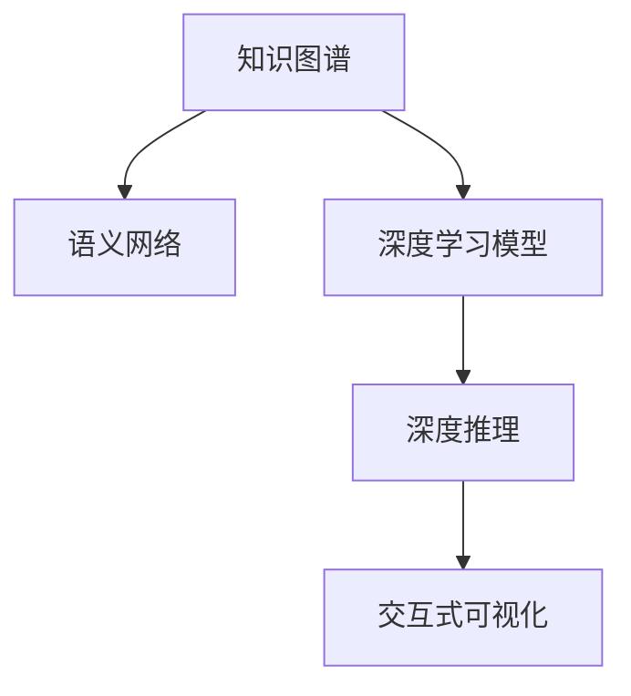

                 

# 知识的可视化工具：辅助理解的新方法

> 关键词：知识可视化, 数据可视, 信息表示, 数据压缩, 语义网络, 深度学习, 深度推理

## 1. 背景介绍

### 1.1 问题由来

在现代知识爆炸的时代，人类的学习和理解方式面临着前所未有的挑战。传统的文字、表格和文档等形式的知识，往往难以直观、全面地表达复杂的关系和信息。尽管计算机存储和处理大量数据的能力强大，但如何让知识以最直观、最易理解的形式呈现，仍然是一个亟待解决的难题。

特别是对于从事科研、工程、医疗等领域的专业人士，他们常常需要处理和理解高度结构化、复杂化的知识体系。现有工具和技术虽然能够提供一些基本的查询、检索功能，但对于深层理解和创新思维的激发，仍显不足。为此，开发一套更为直观、高效的可视化工具，成为提升知识理解和创造力的重要途径。

### 1.2 问题核心关键点

知识的可视化，是指将复杂的知识结构转化为直观、易理解的图形表示，以辅助人类的理解和创新。其核心在于如何将知识表示为数学或图形模型，以及如何利用这些模型进行高效推理和查询。

- **知识表示**：如何将知识编码为图形或向量，保留语义关系和结构信息。
- **图形模型**：如何构建和表示知识图谱、语义网络等图形结构。
- **推理机制**：如何通过图形模型进行深度推理和模式匹配。
- **查询接口**：如何设计直观、易用的查询接口，支持用户进行高效的知识探索。

这些关键点构成了知识可视化工具的设计框架，其目的在于帮助用户快速获取、理解和创新知识。

## 2. 核心概念与联系

### 2.1 核心概念概述

为了更好地理解知识可视化工具的原理和架构，本节将介绍几个密切相关的核心概念：

- **知识图谱(Knowledge Graph)**：一种基于图形结构的知识表示方法，用于存储实体、属性和实体间的关系。通常由节点和边组成，节点表示实体，边表示实体之间的关系。
- **语义网络(Semantic Network)**：一种更为抽象的知识表示方法，使用节点和弧来表示实体和概念之间的关系。与知识图谱相比，语义网络更加灵活，能够表达更复杂的语义关系。
- **深度学习模型**：使用多层神经网络结构进行知识表示和推理的机器学习方法。深度学习模型在知识表示和推理方面具有强大的能力，特别是通过Transformer结构，能够更好地捕捉语义关系和上下文信息。
- **深度推理(Deep Inference)**：利用深度学习模型进行复杂的知识推理和模式匹配。深度推理能够处理大规模、高复杂度的知识图谱，挖掘隐含的深层语义关系。
- **交互式可视化(Interactive Visualization)**：利用图形界面和交互技术，增强用户对知识表示的理解和探索。交互式可视化工具通常包括图形显示、节点编辑、关系查询等功能。

这些核心概念之间的逻辑关系可以通过以下Mermaid流程图来展示：



这个流程图展示了这个框架中各个概念的相互关系：

1. 知识图谱是语义网络的基础，用于存储和表示知识。
2. 深度学习模型可以更好地捕捉语义关系和上下文信息，支持知识表示和推理。
3. 深度推理利用深度学习模型进行复杂知识推理和模式匹配。
4. 交互式可视化提供直观、易用的接口，增强用户对知识的理解和探索。

## 3. 核心算法原理 & 具体操作步骤

### 3.1 算法原理概述

知识可视化工具的核心算法包括知识图谱的构建、语义网络的表示、深度学习的编码以及交互式可视化的渲染。其核心思想是：

1. **知识图谱构建**：从大规模知识库或文本数据中提取实体、属性和关系，构建知识图谱。
2. **语义网络表示**：将知识图谱转换为语义网络，使用节点和弧表示实体和概念之间的关系。
3. **深度学习编码**：使用深度学习模型将语义网络编码为向量表示，保留语义信息。
4. **深度推理**：利用深度学习模型进行复杂的知识推理和模式匹配，挖掘深层语义关系。
5. **交互式可视化**：使用图形界面和交互技术，将深度学习编码的向量表示为直观的图形结构，增强用户对知识的理解。

### 3.2 算法步骤详解

知识可视化工具的具体实现步骤如下：

**Step 1: 知识图谱构建**
1. 数据收集：从大规模知识库或文本数据中提取实体、属性和关系。
2. 图谱构建：使用图数据库或编程语言构建知识图谱，存储实体、属性和关系。

**Step 2: 语义网络表示**
1. 节点定义：定义语义网络中的节点，包括实体和概念。
2. 弧定义：定义节点之间的关系，表示语义关系。
3. 语义网络生成：将知识图谱转换为语义网络，保留语义关系和结构信息。

**Step 3: 深度学习编码**
1. 模型选择：选择合适的深度学习模型，如Transformer、GNN等。
2. 节点编码：使用深度学习模型将语义网络中的节点编码为向量表示。
3. 关系编码：使用深度学习模型将节点间的语义关系编码为向量表示。

**Step 4: 深度推理**
1. 推理模型：构建深度推理模型，如GCN、Attention等，支持复杂推理和模式匹配。
2. 推理执行：输入查询，执行深度推理模型，输出推理结果。

**Step 5: 交互式可视化**
1. 可视化工具：选择合适的可视化工具，如Gephi、Cytoscape等。
2. 图形渲染：将推理结果转换为图形表示，渲染为直观的图形结构。
3. 交互界面：提供交互界面，支持用户进行查询和探索。

### 3.3 算法优缺点

知识可视化工具具有以下优点：

1. **直观性**：图形表示直观易懂，能够帮助用户快速理解复杂的知识体系。
2. **交互性**：支持用户进行查询和探索，增强了知识理解的灵活性和深度。
3. **可扩展性**：支持大规模知识图谱的构建和表示，能够处理海量数据。
4. **自动化推理**：深度学习模型和推理算法能够自动化处理复杂的知识推理任务。

同时，该工具也存在一些局限性：

1. **数据依赖**：知识可视化工具依赖大规模知识库和文本数据，构建和维护成本较高。
2. **算法复杂度**：深度学习模型和深度推理算法复杂度高，计算资源需求大。
3. **结果准确性**：知识推理的准确性受到数据质量、模型选择和参数设置的影响。
4. **用户门槛**：交互式可视化界面对用户有一定的使用门槛，需要一定的学习和适应过程。

### 3.4 算法应用领域

知识可视化工具在多个领域得到广泛应用，具体包括：

- **科研领域**：用于科学文献的引用关系分析、研究趋势可视化等。
- **工程领域**：用于机械设计、电路图分析、软件架构可视化等。
- **医疗领域**：用于疾病诊断、药品研发、医疗知识可视化等。
- **金融领域**：用于风险评估、投资分析、金融知识图谱可视化等。
- **教育领域**：用于知识图谱构建、教学资源可视化、学生学习路径规划等。

这些应用场景展示了知识可视化工具在各个领域的巨大潜力和应用价值。

## 4. 数学模型和公式 & 详细讲解 & 举例说明

### 4.1 数学模型构建

知识可视化工具的数学模型构建包括以下几个关键部分：

1. **知识图谱表示**：使用节点和边表示实体和关系，通常使用邻接矩阵表示。
2. **语义网络表示**：将知识图谱转换为节点和弧表示，通常使用弧表示实体间的关系。
3. **深度学习编码**：使用Transformer或GNN等模型将语义网络编码为向量表示。
4. **深度推理模型**：使用深度学习模型进行复杂的知识推理和模式匹配。

### 4.2 公式推导过程

以下以知识图谱和语义网络为例，推导知识可视化工具的数学模型。

**知识图谱表示**：
- 邻接矩阵 $A$：用于表示知识图谱中的实体关系，$A_{ij}=1$ 表示实体 $i$ 和实体 $j$ 之间存在关系，否则为0。

**语义网络表示**：
- 节点向量 $\mathbf{v}_i$：表示实体 $i$，$\mathbf{v}_i \in \mathbb{R}^d$。
- 弧向量 $\mathbf{w}_{ij}$：表示实体 $i$ 和 $j$ 之间的关系，$\mathbf{w}_{ij} \in \mathbb{R}^d$。

**深度学习编码**：
- Transformer模型：使用自注意力机制，将语义网络编码为向量表示。

**深度推理模型**：
- GCN模型：使用图卷积神经网络，对节点和弧进行编码和推理。

### 4.3 案例分析与讲解

以科学文献引用关系分析为例，展示知识可视化工具的应用。

**数据准备**：
- 收集科学文献数据库中的引用关系，构建知识图谱。

**知识图谱表示**：
- 使用邻接矩阵表示科学文献的引用关系。

**语义网络表示**：
- 将邻接矩阵转换为节点和弧表示的语义网络。

**深度学习编码**：
- 使用Transformer模型将语义网络编码为向量表示。

**深度推理模型**：
- 使用GCN模型进行科学文献的引用关系分析，挖掘引用模式和趋势。

**交互式可视化**：
- 将GCN模型的推理结果转换为图形表示，展示科学文献的引用关系网络。

## 5. 项目实践：代码实例和详细解释说明

### 5.1 开发环境搭建

在进行知识可视化工具的开发前，需要先搭建好开发环境。以下是使用Python进行知识可视化工具开发的环境配置流程：

1. 安装Anaconda：从官网下载并安装Anaconda，用于创建独立的Python环境。

2. 创建并激活虚拟环境：
```bash
conda create -n graph-env python=3.8 
conda activate graph-env
```

3. 安装必要的Python库：
```bash
pip install networkx graphviz py2neo
```

完成上述步骤后，即可在`graph-env`环境中开始开发。

### 5.2 源代码详细实现

以下是一个使用Python进行知识图谱可视化的小例子，展示知识可视化工具的实现过程：

```python
import networkx as nx
import matplotlib.pyplot as plt
import py2neo

# 构建知识图谱
G = nx.Graph()
G.add_node('A')
G.add_node('B')
G.add_edge('A', 'B')

# 将知识图谱转换为图形表示
graph = py2neo.graph.Graph('bolt://localhost:7474')
nodes = [graph.node("A"), graph.node("B")]
edges = [graph.create("http://example.com/edge") for i in range(len(G.edges))]

# 可视化图形
nx.draw(G, with_labels=True, node_size=1000, node_color='lightblue', font_size=10, edge_color='black', arrowsize=2)
plt.show()
```

在这个例子中，我们使用网络X库构建了一个简单的知识图谱，包含节点A和B以及边。然后使用Neo4j数据库将知识图谱转换为图形表示，并使用Matplotlib库进行图形渲染。

### 5.3 代码解读与分析

让我们再详细解读一下关键代码的实现细节：

**网络X库**：
- `nx.Graph()`：用于构建无向图，添加节点和边。
- `nx.draw()`：用于绘制图形，支持节点标签、大小、颜色等参数设置。

**Neo4j库**：
- `py2neo`：用于连接Neo4j数据库，将知识图谱转换为图形表示。
- `graph.node()`和`graph.create()`：用于创建节点和关系，支持自定义属性。

**Matplotlib库**：
- `plt.show()`：用于显示图形，支持多种图形显示方式。

通过这些库的配合使用，我们可以将知识图谱转换为图形表示，并进行可视化渲染。在实际应用中，我们还需要进行更多的优化和改进，以支持更复杂的数据结构和可视化需求。

## 6. 实际应用场景

### 6.1 科研领域

在科研领域，知识可视化工具可以用于科学文献的引用关系分析、研究趋势可视化等。例如，通过构建科学文献的知识图谱，使用GCN模型进行引用关系分析，挖掘引用模式和趋势，能够帮助研究人员快速识别重要文献和研究热点。

### 6.2 工程领域

在工程领域，知识可视化工具可以用于机械设计、电路图分析、软件架构可视化等。例如，通过构建机械设计的知识图谱，使用GCN模型进行结构分析，能够帮助工程师识别关键部件和设计缺陷，优化设计方案。

### 6.3 医疗领域

在医疗领域，知识可视化工具可以用于疾病诊断、药品研发、医疗知识图谱可视化等。例如，通过构建医疗知识图谱，使用深度推理模型进行疾病诊断和药物分析，能够帮助医生快速识别疾病和推荐治疗方案。

### 6.4 金融领域

在金融领域，知识可视化工具可以用于风险评估、投资分析、金融知识图谱可视化等。例如，通过构建金融知识图谱，使用深度推理模型进行风险评估和投资分析，能够帮助金融机构识别风险和优化投资策略。

### 6.5 教育领域

在教育领域，知识可视化工具可以用于知识图谱构建、教学资源可视化、学生学习路径规划等。例如，通过构建教育资源的知识图谱，使用深度推理模型进行学习路径规划，能够帮助学生制定个性化的学习计划。

## 7. 工具和资源推荐

### 7.1 学习资源推荐

为了帮助开发者系统掌握知识可视化工具的理论基础和实践技巧，这里推荐一些优质的学习资源：

1. 《知识图谱与语义网络》书籍：全面介绍了知识图谱和语义网络的理论基础和实践方法。
2. 《深度学习与自然语言处理》课程：涵盖了深度学习在知识表示和推理方面的应用，适合进阶学习。
3. 《数据科学与深度学习》书籍：介绍了深度学习在数据科学中的应用，包括知识图谱和语义网络等。
4. 《TensorFlow与Keras深度学习实战》书籍：介绍了如何使用TensorFlow进行深度学习模型的构建和训练，适合初学者。
5. 《Python知识图谱》书籍：介绍了如何使用Python进行知识图谱的构建和可视化，适合实战练习。

通过对这些资源的学习实践，相信你一定能够快速掌握知识可视化工具的精髓，并用于解决实际的NLP问题。

### 7.2 开发工具推荐

高效的开发离不开优秀的工具支持。以下是几款用于知识可视化工具开发的常用工具：

1. PyTorch：基于Python的开源深度学习框架，灵活动态的计算图，适合快速迭代研究。
2. TensorFlow：由Google主导开发的开源深度学习框架，生产部署方便，适合大规模工程应用。
3. NetworkX：Python中的图库，支持大规模知识图谱的构建和可视化。
4. Graphviz：图形可视化工具，支持多种图形表示和渲染。
5. Py2neo：Python中的Neo4j库，支持与Neo4j数据库的交互。

合理利用这些工具，可以显著提升知识可视化工具的开发效率，加快创新迭代的步伐。

### 7.3 相关论文推荐

知识可视化工具的发展源于学界的持续研究。以下是几篇奠基性的相关论文，推荐阅读：

1. “Knowledge Graphs and Their Reasoning over Linked Data: A Survey”（图谱与链接数据上的推理综述）
2. “A Survey on Knowledge Graphs and their Applications in Healthcare”（医疗领域的图谱应用综述）
3. “Deep Learning for Natural Language Processing: A Survey on Architectures and Applications”（深度学习在NLP中的应用综述）
4. “A Survey on Deep Learning for Graph-Structured Data”（图结构数据上的深度学习综述）
5. “Interactive Knowledge Visualization for Healthcare”（医疗领域的交互式知识可视化）

这些论文代表了大语言模型微调技术的发展脉络。通过学习这些前沿成果，可以帮助研究者把握学科前进方向，激发更多的创新灵感。

## 8. 总结：未来发展趋势与挑战

### 8.1 总结

本文对知识可视化工具进行了全面系统的介绍。首先阐述了知识可视化工具的研究背景和意义，明确了其在辅助理解和创新知识方面的独特价值。其次，从原理到实践，详细讲解了知识可视化工具的数学模型和操作步骤，给出了知识可视化工具的完整代码实例。同时，本文还广泛探讨了知识可视化工具在科研、工程、医疗等多个领域的应用前景，展示了知识可视化工具的巨大潜力。此外，本文精选了知识可视化工具的学习资源，力求为读者提供全方位的技术指引。

通过本文的系统梳理，可以看到，知识可视化工具正在成为科研、工程等领域的重要辅助工具，极大地提升了知识理解和创新的效率。未来，伴随知识图谱的不断发展和大规模知识库的构建，知识可视化工具必将在更多的应用场景中发挥重要作用，成为推动人类认知智能发展的重要手段。

### 8.2 未来发展趋势

展望未来，知识可视化工具的发展趋势包括：

1. **大规模数据处理**：随着大数据技术的发展，知识可视化工具将能够处理更大规模的知识图谱和文本数据，支持更广泛的领域应用。
2. **自动化推理**：利用深度学习模型和推理算法，知识可视化工具将能够自动进行复杂的知识推理和模式匹配，提高推理效率和准确性。
3. **多模态融合**：结合文本、图像、视频等多模态数据，知识可视化工具将能够更全面地表示和理解知识。
4. **交互式体验**：利用虚拟现实、增强现实等技术，知识可视化工具将能够提供更沉浸式的交互体验，增强用户对知识的探索和理解。
5. **个性化定制**：根据用户的兴趣和需求，知识可视化工具将能够提供个性化的知识表示和查询，提升用户的使用体验。

这些趋势将推动知识可视化工具向更加智能化、普适化的方向发展，为科研、工程、医疗等领域带来革命性影响。

### 8.3 面临的挑战

尽管知识可视化工具已经取得了一定的进展，但在向实际应用推广的过程中，仍面临诸多挑战：

1. **数据质量问题**：知识图谱和文本数据的准确性和完备性直接影响知识可视化工具的效果，获取高质量的数据仍是一个难题。
2. **模型复杂度**：深度学习模型和推理算法复杂度高，计算资源需求大，需要更高效的算法和硬件支持。
3. **交互界面设计**：交互式可视化界面对用户有一定的使用门槛，需要更直观、易用的设计。
4. **隐私与安全**：知识可视化工具涉及大量敏感数据，数据隐私和安全问题需要得到充分考虑。
5. **知识更新**：知识图谱和数据模型需要不断更新，以适应新的知识发现和应用需求。

这些挑战需要在未来的研究中不断探索和克服，以推动知识可视化工具的普及和应用。

### 8.4 研究展望

未来，知识可视化工具的研究方向包括：

1. **自动构建知识图谱**：利用深度学习模型和自然语言处理技术，自动从大规模文本数据中构建知识图谱。
2. **多领域应用推广**：将知识可视化工具推广到更多领域，如金融、教育、法律等，提高应用效果和覆盖范围。
3. **深度推理与迁移学习**：结合深度推理和迁移学习技术，提高知识可视化工具的泛化能力和迁移能力。
4. **多模态融合**：融合文本、图像、视频等多模态数据，构建更全面、丰富的知识表示。
5. **交互式可视化技术**：利用虚拟现实、增强现实等技术，提供沉浸式的知识探索体验。
6. **知识推理与因果分析**：结合因果分析方法，增强知识推理的准确性和可解释性。

这些研究方向将推动知识可视化工具向更加智能化、普适化的方向发展，为科研、工程、医疗等领域带来更多创新和突破。

## 9. 附录：常见问题与解答

**Q1：如何构建大规模知识图谱？**

A: 构建大规模知识图谱需要以下几个步骤：
1. 数据收集：从开放数据源、专业数据库等渠道收集大规模数据。
2. 数据清洗：清洗数据，去除重复、错误和无关信息。
3. 实体识别：使用命名实体识别等技术识别实体和属性。
4. 关系提取：使用关系抽取等技术提取实体间的关系。
5. 图谱构建：使用图数据库或编程语言构建知识图谱，存储实体、属性和关系。

**Q2：如何优化知识可视化工具的推理效率？**

A: 优化知识可视化工具的推理效率需要以下几个步骤：
1. 选择高效的推理算法：如GCN、Attention等，提高推理效率。
2. 利用深度学习模型：使用深度学习模型进行知识表示，减少计算量。
3. 并行化计算：利用多核、分布式计算技术，提高推理速度。
4. 数据压缩：使用数据压缩技术，减少存储和传输的开销。

**Q3：知识可视化工具在实际应用中面临哪些挑战？**

A: 知识可视化工具在实际应用中面临以下几个挑战：
1. 数据质量问题：知识图谱和文本数据的准确性和完备性直接影响工具的效果。
2. 计算资源需求高：深度学习模型和推理算法复杂度高，需要更高效的算法和硬件支持。
3. 交互界面设计：交互式可视化界面对用户有一定的使用门槛，需要更直观、易用的设计。
4. 隐私与安全：知识可视化工具涉及大量敏感数据，数据隐私和安全问题需要得到充分考虑。
5. 知识更新：知识图谱和数据模型需要不断更新，以适应新的知识发现和应用需求。

这些挑战需要在未来的研究中不断探索和克服，以推动知识可视化工具的普及和应用。

**Q4：如何设计交互式可视化界面？**

A: 设计交互式可视化界面需要以下几个步骤：
1. 用户需求分析：了解用户的需求和使用场景，设计直观易用的界面。
2. 图形展示设计：选择合适的图形展示方式，如节点图、关系图、热力图等。
3. 交互功能设计：设计节点编辑、关系查询、参数调整等功能，支持用户的操作。
4. 用户体验优化：优化界面响应速度和显示效果，提高用户的使用体验。

通过这些步骤，可以设计出直观、易用、高效的交互式可视化界面，增强用户对知识的探索和理解。

**Q5：如何评估知识可视化工具的效果？**

A: 评估知识可视化工具的效果需要以下几个步骤：
1. 数据集准备：收集测试数据集，涵盖各种知识表示和推理场景。
2. 模型评估：使用精确度、召回率、F1值等指标评估模型效果。
3. 用户反馈：收集用户反馈，评估工具的易用性和实用性。
4. 效果改进：根据评估结果和用户反馈，不断改进和优化工具效果。

通过这些步骤，可以全面评估知识可视化工具的效果，确保其在实际应用中的实用性和准确性。

---

作者：禅与计算机程序设计艺术 / Zen and the Art of Computer Programming

