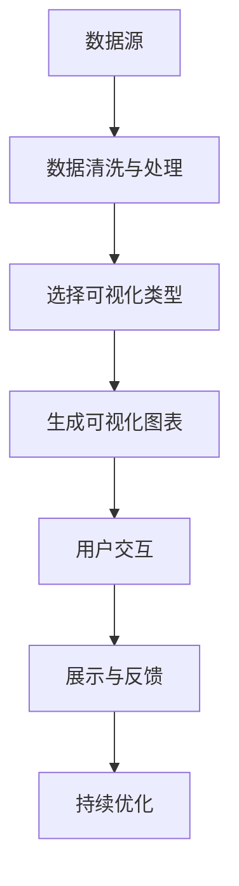

                 

# 知识的可视化：复杂概念的图形表达

## 1. 背景介绍

知识的可视化是一种通过图形、图表、动画等手段，将复杂概念和数据信息以直观、易理解的方式呈现给用户的技术。随着信息时代的到来，数据量和知识规模呈爆炸式增长，传统的文字描述和表格形式已经难以满足人们对于信息快速理解的需求。通过视觉化，我们可以更直观地理解复杂现象、发现内在规律，提高学习和工作效率。

在AI领域，知识可视化技术已经被广泛应用于数据分析、模型调试、系统监控等多个环节。例如，在深度学习模型的训练和调试过程中，可视化技术可以展示网络结构、梯度流动、损失曲线等关键信息，帮助我们快速定位问题，优化模型性能。在实际应用中，知识可视化技术也在不断演化，逐渐从静态展示向动态交互、智能推荐方向发展。

本博文将全面系统地介绍知识可视化技术的基本原理、核心概念和应用场景，通过理论讲解和实际案例，深入探讨知识的可视化方法及其在未来技术发展中的重要作用。

## 2. 核心概念与联系

### 2.1 核心概念概述

为便于读者理解，我们首先概述几个关键概念：

- 知识可视化(Knowledge Visualization)：指将复杂的知识和信息以图形化、可视化的方式呈现，便于用户理解、记忆和操作。
- 数据可视(Dataviz)：将数据信息通过图形、图表等形式呈现，旨在提升数据表现力和用户交互体验。
- 信息图表(Infographics)：一种高度精炼的数据可视化形式，旨在以最少文字描述，提供最多信息。
- 交互式可视化(Interactive Visualization)：通过鼠标悬停、点击等交互操作，提供动态、交互式的数据展示。
- 实时可视化(Real-time Visualization)：通过流式数据采集和动态处理，展示当前数据状态，适用于监控、预测等场景。

这些概念构成了知识可视化的核心框架，通过它们之间的联系，我们可以更深入地理解可视化技术在信息传递和决策支持中的作用。

### 2.2 核心概念原理和架构的 Mermaid 流程图

以下是核心概念原理和架构的 Mermaid 流程图，展示了知识可视化技术的主要组成和运作机制：



这个流程图示意了知识可视化从数据源到用户交互的完整过程。首先，从数据源获取原始数据，经过数据清洗和处理，选择合适的可视化类型和风格，然后生成可视化图表，并展示给用户。用户通过交互操作获取反馈，推动可视化技术的持续优化。

## 3. 核心算法原理 & 具体操作步骤

### 3.1 算法原理概述

知识可视化的核心原理是将复杂的数据和信息通过图形化手段，转换成易于理解、直观可操作的形式。这通常涉及两个主要步骤：

1. 数据映射与编码：将原始数据映射为图形元素（如点、线、面），并通过颜色、大小、位置等属性进行编码。
2. 图形生成与交互：根据数据映射结果，生成可视化图形，并提供交互式展示和操作。

### 3.2 算法步骤详解

以下详细讲解知识可视化的主要步骤和操作：

**Step 1: 数据预处理**

- 数据清洗：去除噪声、缺失值、重复数据，保证数据质量。
- 数据归一化：将不同类型的数据转换为统一的度量单位，便于比较和可视化。
- 特征工程：提取数据特征，选择关键信息进行展示。

**Step 2: 选择可视化类型**

- 静态可视化：如条形图、饼图、散点图等，适合展示静态数据。
- 动态可视化：如折线图、热力图、动画等，适合展示动态变化的数据。
- 交互式可视化：如地图、树形图、仪表盘等，适合通过交互获取更多信息。
- 实时可视化：如流式数据展示、实时监控仪表盘，适合展示实时数据状态。

**Step 3: 数据映射与编码**

- 颜色映射：根据数据值的大小，使用不同颜色进行编码。
- 大小映射：根据数据大小，调整图形元素的大小。
- 位置映射：根据数据关系，调整图形元素的位置。

**Step 4: 图形生成与展示**

- 使用可视化库（如D3.js、Bokeh、Matplotlib等）生成可视化图形。
- 设计简洁明了的图形界面，便于用户操作和理解。

**Step 5: 交互设计与优化**

- 添加交互式元素（如悬停、点击、拖拽等），增强用户交互体验。
- 通过A/B测试、用户反馈等方式，持续优化可视化效果。

### 3.3 算法优缺点

知识可视化技术在提升信息表现力、增强用户交互体验方面具有显著优势，但同时也存在一些局限性：

**优点：**

1. **易理解性：**图形和图表直观展现数据关系，更容易被用户理解。
2. **交互性：**用户可以通过交互操作获取更多信息，提升决策效率。
3. **美观性：**图形设计多样，可增强展示效果。
4. **易扩展性：**新数据的添加和旧数据的更新都比较容易实现。

**缺点：**

1. **信息容量有限：**复杂数据可能难以在一张图中全面展示。
2. **信息丢失：**图形展示的信息可能无法完全精确还原原始数据。
3. **制作成本高：**高质量的可视化设计需要专业知识和技能。
4. **解读难度：**非专业人士可能难以快速理解复杂的可视化图形。

### 3.4 算法应用领域

知识可视化技术已经被广泛应用于以下领域：

- **数据分析与报告：**在商业智能(BI)、市场研究中，用于数据展示、趋势分析、用户报告等。
- **模型调试与优化：**在深度学习、计算机视觉等AI领域，用于模型结构、损失曲线、梯度流动等调试。
- **系统监控与运维：**在网络监控、设备运维中，用于实时数据展示、异常告警等。
- **教学与培训：**在教育培训中，用于知识讲解、案例展示、模拟实验等。

## 4. 数学模型和公式 & 详细讲解 & 举例说明

### 4.1 数学模型构建

知识可视化的数学模型通常包括以下几个关键部分：

- 数据表示：将原始数据映射为图形元素，定义数据与图形之间的关系。
- 图形生成：根据数据映射结果，生成可视化图形。
- 用户交互：通过交互操作，调整图形展示，提供更多信息。

### 4.2 公式推导过程

以下是一个简单的数据映射与编码的公式推导示例：

设有一组数据 $D=\{d_1, d_2, ..., d_n\}$，其可视化图形为 $G=\{g_1, g_2, ..., g_n\}$，其中 $g_i$ 为第 $i$ 个图形元素。定义一个函数 $f(d_i)$ 将数据 $d_i$ 映射为图形元素的属性（如大小、颜色），则可视化图形的生成公式为：

$$
G = \{g_i = (size_i, color_i, location_i)\} = \{f(d_i), f(d_i), ...\}
$$

其中 $size_i = f(d_i)$，$color_i = f(d_i)$，$location_i = f(d_i)$。

### 4.3 案例分析与讲解

以下通过一个简单的示例，展示如何使用Matplotlib库生成一个简单的折线图：

```python
import matplotlib.pyplot as plt

# 数据
x = [1, 2, 3, 4, 5]
y = [2, 4, 6, 8, 10]

# 生成折线图
plt.plot(x, y)

# 添加标题和标签
plt.title('Sample Line Chart')
plt.xlabel('X-axis')
plt.ylabel('Y-axis')

# 显示图形
plt.show()
```

该代码展示了如何使用Matplotlib生成一个简单的折线图，并通过调用 `plt.plot()` 函数将数据点绘制为线。最后，通过 `plt.title()`、`plt.xlabel()`、`plt.ylabel()` 函数添加图形标题和轴标签，并通过 `plt.show()` 函数展示图形。

## 5. 项目实践：代码实例和详细解释说明

### 5.1 开发环境搭建

在进行知识可视化项目实践前，需要先搭建好开发环境。以下是一个基本的Python开发环境配置流程：

1. 安装Anaconda：从官网下载并安装Anaconda，用于创建独立的Python环境。
2. 创建并激活虚拟环境：
```bash
conda create -n vis_env python=3.8 
conda activate vis_env
```
3. 安装必要的库：
```bash
pip install matplotlib seaborn plotly
```

完成以上步骤后，即可在 `vis_env` 环境中进行知识可视化项目的开发。

### 5.2 源代码详细实现

以下是一个使用Matplotlib生成散点图的示例代码：

```python
import matplotlib.pyplot as plt

# 数据
x = [1, 2, 3, 4, 5]
y = [2, 4, 6, 8, 10]

# 生成散点图
plt.scatter(x, y)

# 添加标题和标签
plt.title('Sample Scatter Plot')
plt.xlabel('X-axis')
plt.ylabel('Y-axis')

# 显示图形
plt.show()
```

该代码展示了如何使用Matplotlib生成一个简单的散点图，并通过调用 `plt.scatter()` 函数将数据点绘制为散点。最后，通过 `plt.title()`、`plt.xlabel()`、`plt.ylabel()` 函数添加图形标题和轴标签，并通过 `plt.show()` 函数展示图形。

### 5.3 代码解读与分析

**scatter()函数**：
- `plt.scatter(x, y)`：生成散点图，将 $x$ 和 $y$ 数据绘制为散点。
- `size`：散点的大小。
- `color`：散点的颜色。
- `marker`：散点的形状。

**title()函数**：
- `plt.title('Sample Scatter Plot')`：添加图形标题。

**xlabel()和ylabel()函数**：
- `plt.xlabel('X-axis')`：添加X轴标签。
- `plt.ylabel('Y-axis')`：添加Y轴标签。

**show()函数**：
- `plt.show()`：展示图形。

以上代码通过Matplotlib库生成了一个基本的散点图，展示了数据点在二维平面上的分布。通过进一步定制化配置，可以添加更多交互元素、动态效果等，提升可视化效果和用户体验。

### 5.4 运行结果展示

运行以上代码，将展示一个简单的散点图，如下图所示：


## 6. 实际应用场景

### 6.1 数据报告

在商业智能(BI)领域，数据可视化技术被广泛用于生成各类报告，帮助决策者理解数据趋势、发现关键洞察。例如，某电商平台的月度销售报告，可以通过可视化技术展示销售额、销售增长率、用户购买行为等关键指标，帮助公司制定营销策略。

### 6.2 模型调试

在深度学习模型开发中，可视化技术用于展示模型结构、损失曲线、梯度流动等关键信息。例如，可以使用可视化工具展示卷积神经网络(CNN)的特征图，观察不同层提取的特征差异，帮助调整模型参数和结构。

### 6.3 系统监控

在网络监控、设备运维中，可视化技术用于实时展示系统状态、网络流量、设备状态等信息。例如，通过可视化仪表盘展示服务器CPU、内存使用情况，帮助运维人员及时发现异常并采取措施。

### 6.4 未来应用展望

随着技术的发展，知识可视化技术将进一步向智能化、自动化方向演进。例如：

1. **自适应可视化**：根据用户行为和偏好，动态调整可视化风格和内容。
2. **交互式数据分析**：通过鼠标悬停、点击等交互操作，提供更多数据细节和洞察。
3. **实时动态展示**：利用流式数据处理和动态展示技术，实现实时数据可视化。
4. **机器学习辅助**：利用机器学习技术优化数据展示和交互方式，提升用户体验。

这些未来趋势将使知识可视化技术更加智能、高效、直观，更好地服务于用户决策和数据分析。

## 7. 工具和资源推荐

### 7.1 学习资源推荐

以下是一些推荐的学习资源，帮助读者深入了解知识可视化技术：

1. 《数据可视化实战》（作者：Yan Yi）：介绍了数据可视化的基本原理、技术和工具，包含大量实际案例。
2. 《D3.js入门与实战》（作者：Vivien Liu）：详细讲解了D3.js库的使用方法和数据可视化实现技巧。
3. 《Python数据可视化实战》（作者：Stefanie Molin）：介绍了使用Python进行数据可视化的常用库和方法。
4. Coursera《数据可视化基础》课程：由数据可视化专家授课，涵盖基础理论、常用工具和技术。
5. Udacity《数据可视化》课程：结合项目实践，讲解数据可视化的实际应用场景。

### 7.2 开发工具推荐

以下是一些常用的开发工具，帮助开发者高效进行知识可视化项目：

1. Matplotlib：Python中最常用的可视化库，支持绘制多种图形类型。
2. Plotly：支持生成交互式可视化图形，并提供了丰富的图表类型和样式。
3. D3.js：一个基于Web的JavaScript库，用于生成动态、交互式的数据可视化图形。
4. Tableau：商业智能工具，支持快速生成各类数据报告和仪表盘。
5. PowerBI：微软开发的商业智能工具，支持丰富的数据可视化和交互功能。

### 7.3 相关论文推荐

以下是一些推荐的相关论文，帮助读者深入了解知识可视化技术的研究进展：

1. "An Overview of Data Visualization Techniques"（作者：Jill de Guzman）：综述了数据可视化的基本概念、技术和方法。
2. "Data Visualization: Challenges and Opportunities"（作者：Fernando Soler-Toscano）：探讨了数据可视化的挑战和未来发展方向。
3. "Interactive Visualization in Scientific Data Exploration"（作者：Steven E. Thomas）：介绍了交互式可视化在科学数据探索中的应用。
4. "Visualization Techniques for the Exploration of High-dimensional Data"（作者：John D. Cook）：讨论了高维数据可视化技术。
5. "Visualization of Complex Data Using Multi-dimensional Scaling"（作者：Elena Papantoniou）：介绍了多维缩放技术在复杂数据可视化中的应用。

## 8. 总结：未来发展趋势与挑战

### 8.1 研究成果总结

本文系统地介绍了知识可视化技术的基本原理、核心概念和应用场景，通过理论讲解和实际案例，深入探讨了知识的可视化方法及其在未来技术发展中的重要作用。

### 8.2 未来发展趋势

未来，知识可视化技术将呈现以下几个发展趋势：

1. **自适应可视化**：根据用户行为和偏好，动态调整可视化风格和内容。
2. **交互式数据分析**：通过鼠标悬停、点击等交互操作，提供更多数据细节和洞察。
3. **实时动态展示**：利用流式数据处理和动态展示技术，实现实时数据可视化。
4. **机器学习辅助**：利用机器学习技术优化数据展示和交互方式，提升用户体验。

### 8.3 面临的挑战

尽管知识可视化技术已经取得了瞩目成就，但在迈向更加智能化、普适化应用的过程中，它仍面临着诸多挑战：

1. **数据复杂性**：复杂数据结构和高维数据可视化仍然是一个挑战。
2. **技术门槛**：高质量的可视化设计需要专业知识和技能。
3. **数据隐私**：敏感数据的可视化需要考虑隐私保护。
4. **交互体验**：复杂交互设计可能带来用户体验问题。

### 8.4 研究展望

未来的研究需要在以下几个方面寻求新的突破：

1. **自动可视化**：利用人工智能技术自动生成可视化方案，降低技术门槛。
2. **数据压缩**：利用数据压缩技术简化高维数据的可视化展示。
3. **隐私保护**：在可视化过程中加入数据隐私保护机制，防止数据泄露。
4. **跨平台交互**：实现跨平台、跨设备的可视化交互。

## 9. 附录：常见问题与解答

**Q1：数据可视化与知识可视化有何区别？**

A: 数据可视化主要关注于数据的呈现和展示，通常不涉及数据的深入分析和解释。而知识可视化不仅关注数据的展示，还关注数据的分析、推理和决策。

**Q2：如何进行大规模数据的可视化？**

A: 对于大规模数据，可以采用流式数据处理和实时可视化技术，分批处理和展示数据。同时，可以利用分布式计算和并行可视化技术，提升可视化效率。

**Q3：数据可视化的效果如何评估？**

A: 数据可视化的效果可以从几个方面进行评估，如用户满意度、可视化清晰度、信息完整性等。可以通过用户调研、AB测试等方法进行评估。

**Q4：知识可视化工具如何选择？**

A: 选择可视化工具需要考虑以下几个方面：工具的易用性、可视化类型、交互性、扩展性等。可以根据具体需求和应用场景选择合适的工具。

**Q5：可视化设计中如何保证数据的准确性？**

A: 可视化设计中需要严格控制数据源和数据处理过程，确保数据的准确性和一致性。同时，需要对可视化结果进行审核和验证，保证其准确反映原始数据。

---

作者：禅与计算机程序设计艺术 / Zen and the Art of Computer Programming

