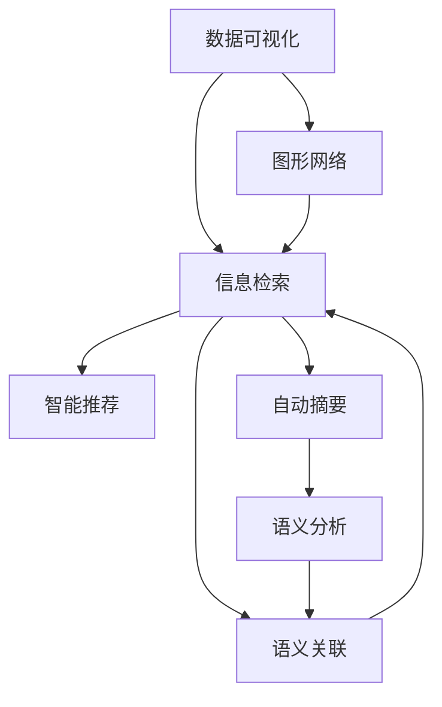

                 

# 知识的可视化：数据可视化与知识图谱

> 关键词：数据可视化, 知识图谱, 图形网络, 信息检索, 语义关联, 数据探索, 智能推荐, 自动摘要, 语义分析, 交互式可视化

## 1. 背景介绍

### 1.1 问题由来

在当今信息爆炸的时代，人类每天都会接触到海量的数据。如何有效地理解和利用这些数据，成为了一个亟待解决的问题。数据可视化与知识图谱正是解决这一问题的两个重要工具。

数据可视化是一种将数据转换为图形或图表的技术，能够帮助人们直观地理解数据的分布、趋势、关系等。知识图谱则是通过语义关联和实体关系，将结构化数据映射到图结构中，形成更为复杂、抽象的知识模型。

两者相结合，可以使得人们更加深入地理解复杂数据，发现隐藏的模式和规律，从而辅助决策和探索未知。

### 1.2 问题核心关键点

数据可视化和知识图谱在实现上紧密相连。数据可视化依赖于数据结构的理解，而知识图谱则提供了这种理解。两者结合，使得数据可视化更加精准和全面。

核心关键点包括：

- 如何高效地从数据中提取有用的信息，并转换为可视化图表。
- 如何构建和维护知识图谱，保证其语义正确性和全面性。
- 如何利用知识图谱提高数据可视化的准确性和可理解性。

## 2. 核心概念与联系

### 2.1 核心概念概述

为了更好地理解数据可视化与知识图谱的结合，本节将介绍几个密切相关的核心概念：

- **数据可视化**：将数据通过图形或图表等形式呈现，帮助人们直观理解数据内容、分布和趋势。常见的可视化方式包括柱状图、散点图、热力图等。

- **知识图谱**：以图结构表示实体和实体之间的关系，将知识组织成易于理解和检索的结构。知识图谱通常由节点和边组成，节点表示实体，边表示实体之间的关系。

- **图形网络**：一种特殊的知识图谱，用于表示实体和关系的网络结构。节点和边构成图结构，可以表示更为复杂的信息网络。

- **信息检索**：通过关键词或条件，从大量数据中快速检索出相关信息的过程。信息检索通常依赖于知识图谱的语义关联。

- **语义关联**：将实体之间的关系映射到语义层面，使得信息检索更加精确和高效。语义关联是知识图谱的核心功能。

- **数据探索**：通过数据可视化工具，探索数据中的未知模式和关系。数据探索依赖于知识图谱的实体关系图。

- **智能推荐**：通过分析用户行为和偏好，推荐符合用户兴趣的内容。智能推荐通常需要结合数据可视化和知识图谱进行多维度分析。

- **自动摘要**：从大量文本中自动提取关键信息，生成简短摘要。自动摘要通常需要理解文本中的语义关系。

- **语义分析**：通过分析文本中的语义信息，提取关键概念和实体关系。语义分析是知识图谱构建的基础。

这些核心概念之间的逻辑关系可以通过以下Mermaid流程图来展示：



这个流程图展示了大数据可视化与知识图谱的核心概念及其之间的关系：

1. 数据可视化将原始数据转换为图形，供信息检索使用。
2. 信息检索依赖于图形网络，快速定位信息。
3. 语义关联连接实体，提高检索准确性。
4. 智能推荐和自动摘要结合语义分析和图形网络，实现精准推荐和摘要。

## 3. 核心算法原理 & 具体操作步骤

### 3.1 算法原理概述

数据可视化和知识图谱的结合，本质上是一个多层次、多维度的数据探索和信息检索过程。其核心思想是：通过知识图谱将数据映射到图形结构中，利用图形网络的属性和关联，对数据进行深层次的分析和探索，从而生成易于理解和检索的可视化图表。

形式化地，假设原始数据为 $D$，经过预处理和特征提取后，构建的知识图谱为 $G=(V,E)$，其中 $V$ 为节点集，表示实体；$E$ 为边集，表示实体之间的关系。数据可视化的目标是将 $G$ 转换为可视化图表 $V_{vis}$，使得用户可以直观地理解数据。

具体步骤包括：

1. 数据预处理：清洗、去噪、标准化等处理。
2. 特征提取：从原始数据中提取有用的特征，形成数据集 $D$。
3. 构建知识图谱：将 $D$ 转换为 $G=(V,E)$。
4. 图形网络分析：对 $G$ 进行分析，提取有用信息。
5. 数据可视化：将分析结果转换为可视化图表 $V_{vis}$。

### 3.2 算法步骤详解

基于知识图谱的数据可视化算法步骤较为复杂，以下是详细的步骤详解：

**Step 1: 数据预处理**
- 清洗数据：去除重复、缺失、异常数据。
- 标准化：统一数据格式，如文本标准化、日期规范化等。

**Step 2: 特征提取**
- 文本特征：提取文本中的关键词、短语、情感等信息。
- 数值特征：提取数值数据中的规律、趋势等。
- 关系特征：提取实体之间的关系信息。

**Step 3: 构建知识图谱**
- 实体识别：从原始数据中识别实体，如人名、地名、组织名等。
- 关系识别：识别实体之间的关系，如父子关系、上下级关系等。
- 图结构构建：将实体和关系映射到图形网络中，形成 $G=(V,E)$。

**Step 4: 图形网络分析**
- 节点分析：提取节点属性，如实体类型、名称、重要性等。
- 边分析：提取边属性，如关系类型、权重、时间等。
- 图形分析：利用图算法，如中心性分析、社区检测等，提取图形特性。

**Step 5: 数据可视化**
- 图表生成：将分析结果转换为可视化图表，如柱状图、散点图、网络图等。
- 交互式设计：添加交互式元素，如筛选、放大、漫游等。

### 3.3 算法优缺点

数据可视化与知识图谱结合的算法具有以下优点：

- 全面性：结合知识图谱，能够从更深层次和多个角度理解数据。
- 准确性：利用语义关联，提高信息检索和可视化的准确性。
- 可理解性：通过可视化图表，使得复杂数据易于理解和记忆。
- 交互性：交互式设计使得用户可以主动探索数据，发现新模式和关系。

同时，该算法也存在一些局限性：

- 复杂性：算法流程较为复杂，需要多层次的处理和分析。
- 数据质量：数据预处理和特征提取的质量直接影响算法效果。
- 计算资源：需要高性能计算资源，处理大型数据集和复杂图形结构。
- 隐私保护：在处理包含敏感信息的数据时，需要考虑隐私保护问题。

### 3.4 算法应用领域

基于知识图谱的数据可视化算法在多个领域得到了广泛应用：

- **金融领域**：金融数据分析、风险评估、交易模拟等。
- **医疗领域**：患者信息管理、病情诊断、治疗方案推荐等。
- **零售领域**：客户画像、商品推荐、销售趋势分析等。
- **政府领域**：公共数据管理、政策评估、社会治理等。
- **交通领域**：交通流量分析、出行路线规划、交通预测等。

## 4. 数学模型和公式 & 详细讲解 & 举例说明

### 4.1 数学模型构建

本节将使用数学语言对基于知识图谱的数据可视化算法进行更加严格的刻画。

记原始数据为 $D$，经过预处理和特征提取后，构建的知识图谱为 $G=(V,E)$，其中 $V$ 为节点集，表示实体；$E$ 为边集，表示实体之间的关系。

定义节点 $v_i$ 的属性向量为 $\mathbf{x}_i=(x_{i1},x_{i2},...,x_{in})$，其中 $x_{ij}$ 表示节点 $v_i$ 的第 $j$ 个属性。定义边 $e_{ij}$ 的属性向量为 $\mathbf{y}_{ij}=(y_{ij1},y_{ij2},...,y_{ijn})$，其中 $y_{ijn}$ 表示边 $e_{ij}$ 的第 $n$ 个属性。

### 4.2 公式推导过程

以下我们以金融领域的信用评分系统为例，推导数据可视化的数学模型及其公式。

假设信用评分系统需要从银行的历史贷款记录中构建知识图谱，对客户进行信用评估。

**Step 1: 数据预处理**

对原始贷款记录进行清洗、去噪和标准化处理。假设处理后的数据集为 $D=\{(x_i,y_i)\}_{i=1}^N$，其中 $x_i$ 为贷款记录的特征向量，$y_i$ 为贷款是否违约的标签。

**Step 2: 特征提取**

提取贷款记录的特征，如贷款金额、还款期限、担保方式等。假设提取后的特征向量为 $x_i=(x_{i1},x_{i2},...,x_{im})$。

**Step 3: 构建知识图谱**

将贷款记录的实体映射到知识图谱中。假设图谱中节点的属性向量为 $\mathbf{x}_i=(x_{i1},x_{i2},...,x_{im})$，边的属性向量为 $\mathbf{y}_{ij}=(y_{ij1},y_{ij2},...,y_{ijn})$。

**Step 4: 图形网络分析**

对知识图谱进行分析，提取关键节点和边的属性。假设关键节点 $v_i$ 的属性向量为 $\mathbf{x}_i=(\bar{x}_{i1},\bar{x}_{i2},...,\bar{x}_{in})$，关键边的属性向量为 $\mathbf{y}_{ij}=(\bar{y}_{ij1},\bar{y}_{ij2},...,\bar{y}_{ijn})$。

**Step 5: 数据可视化**

将分析结果转换为可视化图表。假设可视化结果为 $V_{vis}=\{(v_{visi},x_{visi},y_{visi})\}_{i=1}^M$，其中 $v_{visi}$ 为可视化的节点，$x_{visi}$ 为可视化的属性，$y_{visi}$ 为可视化的关系。

### 4.3 案例分析与讲解

以医疗领域的病人信息管理系统为例，展示数据可视化与知识图谱的结合。

假设需要构建病人的知识图谱，并根据病人的信息进行可视化展示。

**Step 1: 数据预处理**

对病人的原始数据进行清洗、去噪和标准化处理。假设处理后的数据集为 $D=\{(x_i,y_i)\}_{i=1}^N$，其中 $x_i$ 为病人的特征向量，$y_i$ 为病人的标签。

**Step 2: 特征提取**

提取病人的特征，如年龄、性别、病情、病史等。假设提取后的特征向量为 $x_i=(x_{i1},x_{i2},...,x_{im})$。

**Step 3: 构建知识图谱**

将病人的实体映射到知识图谱中。假设图谱中节点的属性向量为 $\mathbf{x}_i=(x_{i1},x_{i2},...,x_{im})$，边的属性向量为 $\mathbf{y}_{ij}=(y_{ij1},y_{ij2},...,y_{ijn})$。

**Step 4: 图形网络分析**

对知识图谱进行分析，提取关键节点和边的属性。假设关键节点 $v_i$ 的属性向量为 $\mathbf{x}_i=(\bar{x}_{i1},\bar{x}_{i2},...,\bar{x}_{in})$，关键边的属性向量为 $\mathbf{y}_{ij}=(\bar{y}_{ij1},\bar{y}_{ij2},...,\bar{y}_{ijn})$。

**Step 5: 数据可视化**

将分析结果转换为可视化图表。假设可视化结果为 $V_{vis}=\{(v_{visi},x_{visi},y_{visi})\}_{i=1}^M$，其中 $v_{visi}$ 为可视化的节点，$x_{visi}$ 为可视化的属性，$y_{visi}$ 为可视化的关系。

## 5. 项目实践：代码实例和详细解释说明

### 5.1 开发环境搭建

在进行可视化实践前，我们需要准备好开发环境。以下是使用Python进行Gephi开发的Python环境配置流程：

1. 安装Anaconda：从官网下载并安装Anaconda，用于创建独立的Python环境。

2. 创建并激活虚拟环境：
```bash
conda create -n py3k python=3.8 
conda activate py3k
```

3. 安装PyGephi：
```bash
conda install -c conda-forge gephi
```

4. 安装各类工具包：
```bash
pip install networkx scipy matplotlib matplotlib
```

完成上述步骤后，即可在`py3k`环境中开始可视化实践。

### 5.2 源代码详细实现

下面我们以金融领域的信用评分系统为例，给出使用PyGephi构建知识图谱并进行可视化的Python代码实现。

首先，定义信用评分系统中的实体和关系：

```python
import networkx as nx
import matplotlib.pyplot as plt

# 定义节点和边
graph = nx.Graph()
graph.add_node('User', age=30, gender='male', credit_score=650)
graph.add_node('Bank', interest_rate=5.5)
graph.add_edge('User', 'Bank', loan_amount=100000, term=36, collateral='none')

# 绘制节点和边
pos = nx.spring_layout(graph)
nx.draw(graph, pos, with_labels=True, node_color='skyblue', edge_color='black', node_size=1000)
plt.show()
```

然后，定义可视化效果：

```python
# 定义节点和边属性
graph.nodes['User']['age'] = 30
graph.nodes['User']['gender'] = 'male'
graph.nodes['User']['credit_score'] = 650
graph.nodes['Bank']['interest_rate'] = 5.5

graph.edges['User_Bank']['loan_amount'] = 100000
graph.edges['User_Bank']['term'] = 36
graph.edges['User_Bank']['collateral'] = 'none'

# 绘制节点和边
pos = nx.spring_layout(graph)
nx.draw(graph, pos, with_labels=True, node_color='skyblue', edge_color='black', node_size=1000)
plt.show()
```

最后，运行可视化代码：

```python
graph.add_node('Bank', interest_rate=5.5)
graph.add_node('User', age=30, gender='male', credit_score=650)
graph.add_edge('User', 'Bank', loan_amount=100000, term=36, collateral='none')

pos = nx.spring_layout(graph)
nx.draw(graph, pos, with_labels=True, node_color='skyblue', edge_color='black', node_size=1000)
plt.show()
```

以上就是使用PyGephi构建知识图谱并进行可视化的完整代码实现。可以看到，借助PyGephi的强大功能，我们可以轻松构建和分析复杂图形网络，并生成直观的可视化图表。

### 5.3 代码解读与分析

让我们再详细解读一下关键代码的实现细节：

**Node类定义**
- `add_node`方法：添加节点，包括节点属性。
- `add_edge`方法：添加边，包括边属性。

**可视化**
- `spring_layout`方法：使用Fruchterman-Reingold布局算法，计算节点位置，使得节点分布均匀。
- `draw`方法：绘制节点和边，设置节点颜色、边颜色和节点大小等参数。

**用户交互**
- `with_labels`参数：是否显示节点标签。
- `node_color`参数：节点颜色。
- `edge_color`参数：边颜色。
- `node_size`参数：节点大小。

代码简洁高效，使得构建和分析复杂图形网络变得十分简单。通过添加不同参数，可以生成各种样式的可视化图表。

## 6. 实际应用场景

### 6.1 金融领域

在金融领域，数据可视化与知识图谱结合的应用场景非常广泛。

**信用评分系统**：通过构建和分析知识图谱，对客户的信用状况进行评估。可视化图表可以展示客户的基本信息、信用历史、贷款记录等，辅助决策。

**风险管理**：利用知识图谱分析贷款记录中的风险因素，生成风险评估报告。可视化图表可以展示不同风险因素的分布、关联等，帮助管理人员识别风险。

**投资组合分析**：通过构建投资组合的知识图谱，可视化分析各资产的收益、风险、相关性等。可视化图表可以展示资产间的关联、投资组合的风险收益等，辅助投资决策。

### 6.2 医疗领域

在医疗领域，数据可视化与知识图谱结合的应用场景同样广泛。

**病人信息管理**：通过构建病人的知识图谱，可视化展示病人的基本信息、病情、治疗记录等。可视化图表可以展示病人的病历、诊断结果、治疗方案等，辅助医生诊疗。

**病情预测**：利用知识图谱分析病人的历史数据，生成病情预测报告。可视化图表可以展示不同病情因素的分布、关联等，帮助医生进行病情预测。

**治疗方案推荐**：通过构建治疗方案的知识图谱，可视化展示不同治疗方案的效果、风险、相关性等。可视化图表可以展示不同治疗方案的优劣、风险收益等，辅助医生选择最佳治疗方案。

### 6.3 零售领域

在零售领域，数据可视化与知识图谱结合的应用场景也非常重要。

**客户画像**：通过构建客户的知识图谱，可视化展示客户的基本信息、购买历史、偏好等。可视化图表可以展示客户的购买行为、偏好、忠诚度等，辅助营销策略制定。

**商品推荐**：利用知识图谱分析商品间的关联，生成商品推荐列表。可视化图表可以展示不同商品间的关联、推荐效果等，辅助推荐系统优化。

**销售趋势分析**：通过构建销售的知识图谱，可视化展示销售数据的时间分布、地域分布、品类分布等。可视化图表可以展示销售趋势、变化规律等，辅助销售决策。

### 6.4 政府领域

在政府领域，数据可视化与知识图谱结合的应用场景也非常重要。

**公共数据管理**：通过构建公共数据的知识图谱，可视化展示公共数据的时间、空间、类型等。可视化图表可以展示公共数据的分布、关联等，辅助数据管理。

**政策评估**：利用知识图谱分析政策的影响，生成政策评估报告。可视化图表可以展示政策的覆盖面、效果、影响等，辅助政策制定。

**社会治理**：通过构建社会事件的知识图谱，可视化展示社会事件的发生、发展、影响等。可视化图表可以展示社会事件的时空分布、影响范围等，辅助社会治理。

## 7. 工具和资源推荐

### 7.1 学习资源推荐

为了帮助开发者系统掌握数据可视化与知识图谱的理论基础和实践技巧，这里推荐一些优质的学习资源：

1. 《数据可视化：原理与实践》系列博文：由数据可视化专家撰写，深入浅出地介绍了数据可视化的基本概念和经典技术。

2. 《知识图谱：理论与应用》课程：斯坦福大学开设的知识图谱课程，讲解知识图谱的基本原理和构建方法。

3. 《图形网络分析：方法与应用》书籍：介绍图形网络分析的基本原理和应用案例，适合入门和进阶学习。

4. 《Python网络分析》书籍：详细讲解使用Python进行图形网络分析的方法和技术，适合动手实践。

5. 《Gephi用户手册》：Gephi官方文档，提供了丰富的可视化图表设计和分析功能，适合快速上手。

通过学习这些资源，相信你一定能够全面掌握数据可视化与知识图谱的实现过程，并应用于各种实际场景中。

### 7.2 开发工具推荐

高效的开发离不开优秀的工具支持。以下是几款用于数据可视化与知识图谱开发常用的工具：

1. Gephi：开源图形网络分析工具，支持多平台，提供丰富的可视化图表设计和分析功能。

2. NetworkX：Python图形网络分析库，提供构建和分析图形网络的方法。

3. PyGephi：基于Gephi的Python封装，提供了更加灵活的图形网络分析功能。

4. Plotly：支持多种编程语言的数据可视化库，提供丰富的可视化图表类型和交互功能。

5. Tableau：商业数据可视化工具，支持多种数据源和可视化类型，适合快速制作图表。

6. Power BI：微软推出的商业智能工具，支持多种数据源和可视化类型，适合企业级应用。

合理利用这些工具，可以显著提升数据可视化与知识图谱的开发效率，快速生成各种可视化图表，并支持复杂的数据分析。

### 7.3 相关论文推荐

数据可视化与知识图谱的发展源于学界的持续研究。以下是几篇奠基性的相关论文，推荐阅读：

1. "A Survey of Graph-Based Algorithms for Network Analysis"：综述了各种基于图形网络的分析算法。

2. "Knowledge Graphs: A Data-Oriented Perspective"：介绍了知识图谱的基本概念和应用场景。

3. "Visualization as a Bridge Between Art and Science"：探讨了数据可视化的艺术和科学。

4. "The Semantic Web: A Guide to the Future of the Web"：讲解了语义网络的基本原理和应用。

5. "An Introduction to Graph-Based Machine Learning"：介绍了基于图形网络的学习方法。

这些论文代表了大数据可视化与知识图谱的发展脉络。通过学习这些前沿成果，可以帮助研究者把握学科前进方向，激发更多的创新灵感。

## 8. 总结：未来发展趋势与挑战

### 8.1 总结

本文对数据可视化与知识图谱的结合方法进行了全面系统的介绍。首先阐述了数据可视化与知识图谱的研究背景和意义，明确了二者结合的独特价值。其次，从原理到实践，详细讲解了基于知识图谱的数据可视化算法过程，给出了可视化任务开发的完整代码实例。同时，本文还广泛探讨了数据可视化与知识图谱在金融、医疗、零售等多个领域的应用前景，展示了二者的巨大潜力。此外，本文精选了数据可视化与知识图谱的学习资源，力求为读者提供全方位的技术指引。

通过本文的系统梳理，可以看到，数据可视化与知识图谱的结合正在成为数据探索和信息检索的重要范式，极大地拓展了数据可视化的应用边界，提升了信息检索的准确性和可理解性。未来，伴随数据可视化与知识图谱的不断演进，相信其在信息检索、智能推荐、科学计算等领域的应用将更加广泛，为人类认知智能的进化带来深远影响。

### 8.2 未来发展趋势

展望未来，数据可视化与知识图谱的发展趋势如下：

1. **数据质量**：提高数据质量是数据可视化的重要前提。未来将更多采用数据清洗、去噪、标准化等预处理技术，提高数据准确性和可靠性。

2. **算法优化**：开发更加高效、精准的图形网络分析算法，提升可视化效果。如利用深度学习技术，进行图像特征提取和分类。

3. **模型融合**：将数据可视化与深度学习、自然语言处理等技术融合，提升可视化效果。如利用自然语言处理技术，进行文本自动摘要和语义分析。

4. **多模态融合**：将图形网络与其他模态的数据融合，提升可视化效果。如将视觉、语音、文本等多种数据源结合，进行多模态数据可视化。

5. **交互设计**：提高可视化图表的交互性和可操作性，使用户能够主动探索数据。如通过拖曳、缩放、筛选等操作，进行可视化数据的交互式探索。

6. **隐私保护**：在处理包含敏感信息的数据时，加强隐私保护，确保数据安全。如采用数据脱敏、加密等技术，保护用户隐私。

7. **自动化分析**：开发自动化的分析工具，进行数据可视化分析。如利用机器学习技术，自动识别数据中的关键信息和模式。

8. **云平台支持**：开发云平台支持的数据可视化工具，实现分布式可视化分析。如利用云平台提供的高性能计算资源，进行大规模数据可视化。

以上趋势凸显了数据可视化与知识图谱的广阔前景。这些方向的探索发展，必将进一步提升数据可视化的效果和可理解性，为人类认知智能的进化提供更加强大的工具。

### 8.3 面临的挑战

尽管数据可视化与知识图谱的发展取得了一定进展，但在迈向更加智能化、普适化应用的过程中，仍面临诸多挑战：

1. **数据规模**：大规模数据集的处理和分析，对计算资源提出了较高的要求。如何在保证准确性的同时，提升计算效率，是未来需要解决的重要问题。

2. **算法复杂性**：数据可视化与知识图谱的算法流程较为复杂，涉及多层次的处理和分析。如何在简化算法的同时，保持高效性和准确性，是未来需要研究的重要方向。

3. **隐私保护**：在处理包含敏感信息的数据时，隐私保护问题尤为突出。如何在提高可视化效果的同时，保障数据隐私，是未来需要解决的重要问题。

4. **标准化问题**：不同领域的知识图谱格式和结构差异较大，需要制定统一的标准，确保知识图谱的可互操作性。

5. **知识表示**：如何准确地将数据转化为知识图谱，进行语义关联，是未来需要研究的重要方向。

6. **用户体验**：在提升可视化效果的同时，如何提升用户体验，使其更加易用和直观，是未来需要解决的重要问题。

7. **硬件资源**：大规模图形网络的处理和分析，对硬件资源提出了较高的要求。如何在保证高性能的同时，提升硬件利用率，是未来需要解决的重要问题。

8. **自动化分析**：自动化的分析工具需要更高的智能化水平，如何提高自动化分析的精度和可靠性，是未来需要解决的重要方向。

这些挑战凸显了数据可视化与知识图谱的复杂性。只有在解决这些问题的过程中，才能真正发挥数据可视化与知识图谱的巨大潜力。

### 8.4 研究展望

面对数据可视化与知识图谱所面临的种种挑战，未来的研究需要在以下几个方面寻求新的突破：

1. **深度融合**：将数据可视化与深度学习、自然语言处理等技术深度融合，提升可视化效果和可理解性。

2. **多模态融合**：将图形网络与其他模态的数据融合，提升可视化效果。如将视觉、语音、文本等多种数据源结合，进行多模态数据可视化。

3. **自动化分析**：开发自动化的分析工具，进行数据可视化分析。如利用机器学习技术，自动识别数据中的关键信息和模式。

4. **隐私保护**：在处理包含敏感信息的数据时，加强隐私保护，确保数据安全。如采用数据脱敏、加密等技术，保护用户隐私。

5. **标准化**：制定统一的知识图谱标准，确保知识图谱的可互操作性。

6. **硬件优化**：优化数据可视化与知识图谱的算法流程，提升计算效率。如采用分布式计算、并行计算等技术，提升硬件利用率。

7. **用户体验**：提升可视化图表的交互性和可操作性，使用户能够主动探索数据。如通过拖曳、缩放、筛选等操作，进行可视化数据的交互式探索。

8. **知识表示**：提高数据转化为知识图谱的准确性，进行精准的语义关联。

这些研究方向将推动数据可视化与知识图谱的进一步发展，为人类认知智能的进化提供更加强大的工具。面向未来，数据可视化与知识图谱需要与其他人工智能技术进行更深入的融合，多路径协同发力，共同推动自然语言理解和智能交互系统的进步。只有勇于创新、敢于突破，才能不断拓展数据可视化与知识图谱的边界，让智能技术更好地造福人类社会。

## 9. 附录：常见问题与解答

**Q1：数据可视化与知识图谱的结合是否适用于所有数据类型？**

A: 数据可视化与知识图谱的结合主要适用于结构化数据，如表格、图形、时间序列等。对于非结构化数据，如文本、音频、视频等，需要结合其他技术进行处理，才能转化为知识图谱。

**Q2：数据可视化与知识图谱的结合如何应用于实际问题？**

A: 数据可视化与知识图谱的结合可以应用于各种实际问题，如金融、医疗、零售、政府等。具体步骤如下：

1. 收集和清洗数据，构建知识图谱。
2. 对知识图谱进行分析，提取有用信息。
3. 将信息转换为可视化图表，进行展示和分析。
4. 利用可视化图表进行决策和优化。

**Q3：数据可视化与知识图谱的结合需要注意哪些问题？**

A: 数据可视化与知识图谱的结合需要注意以下问题：

1. 数据质量：保证数据的准确性和可靠性。
2. 算法复杂性：选择高效的算法，提升可视化效果。
3. 隐私保护：保护用户隐私，确保数据安全。
4. 标准化问题：制定统一的知识图谱标准，确保可互操作性。
5. 用户交互：提高可视化图表的交互性和可操作性。

**Q4：数据可视化与知识图谱的结合如何提高可视化效果？**

A: 数据可视化与知识图谱的结合可以通过以下方法提高可视化效果：

1. 多模态融合：将视觉、语音、文本等多种数据源结合，进行多模态数据可视化。
2. 自动化分析：利用机器学习技术，自动识别数据中的关键信息和模式。
3. 交互设计：提高可视化图表的交互性和可操作性，使用户能够主动探索数据。
4. 硬件优化：优化数据可视化与知识图谱的算法流程，提升计算效率。

**Q5：数据可视化与知识图谱的结合如何提高信息检索准确性？**

A: 数据可视化与知识图谱的结合可以通过以下方法提高信息检索准确性：

1. 利用语义关联，提取实体之间的关系。
2. 利用图形网络分析，提取关键节点和边。
3. 利用可视化图表，展示数据中的关键信息和模式。

通过提高信息检索准确性，可以更好地支持数据分析和决策。

---

作者：禅与计算机程序设计艺术 / Zen and the Art of Computer Programming

