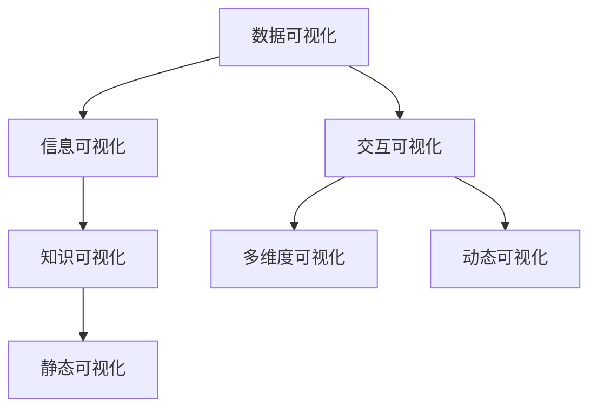

                 

# 知识的可视化：数据可视化技术在理解中的应用

> 关键词：知识可视化, 数据可视化, 数据理解, 数据可视化工具, 信息可视化

## 1. 背景介绍

在信息爆炸的时代，如何有效地理解和利用海量数据，成为了一个巨大的挑战。传统的统计图表、文本报告等方式已经无法满足现代数据处理的复杂性和多样性需求。数据可视化技术作为一种直观、高效的数据展示方式，正在逐渐成为数据理解与分析的重要手段。

数据可视化技术不仅能够帮助人们直观地理解数据的内在结构和关系，还能促进数据驱动决策的科学性和准确性。在商业分析、科学探索、教育培训等众多领域，数据可视化技术都发挥着重要作用。

本文将深入探讨数据可视化技术在理解中的应用，帮助读者全面掌握这一领域的核心概念和关键技术。我们将从基础知识介绍开始，逐步深入算法原理和操作步骤，并通过具体案例分析，展示其在实际应用中的强大能力。

## 2. 核心概念与联系

### 2.1 核心概念概述

在深入了解数据可视化技术之前，首先需要了解几个核心概念：

- **数据可视化(Data Visualization)**：将数据转换为图形或图像的过程。通过可视化的方式，使复杂的数据更易于理解和分析。

- **信息可视化(Information Visualization)**：利用图形化界面展示信息的过程，旨在通过视觉感官引导用户理解信息。

- **知识可视化(Knowledge Visualization)**：通过可视化技术呈现知识结构、关系和层次，帮助用户构建知识体系，进行知识的传递和共享。

- **交互可视化(Interactive Visualization)**：指通过用户交互的方式动态生成或展示数据可视化结果，提升用户体验和分析效率。

- **多维度可视化(Multidimensional Visualization)**：针对高维数据，通过降维等技术展示数据的内在结构和关系。

这些概念相互关联，共同构成了数据可视化的完整框架。通过理解这些概念，可以更好地掌握数据可视化技术的本质和应用方法。

### 2.2 核心概念原理和架构的 Mermaid 流程图



这个流程图展示了数据可视化的主要分支及其相互关系：

- **静态可视化(Static Visualization)**：通过静态图像展示数据，如柱状图、散点图等。
- **动态可视化(Interactive Visualization)**：通过动态生成图形展示数据，如交互式图表、动画等。
- **多维度可视化(Multidimensional Visualization)**：针对高维数据进行可视化展示，如散点矩阵图、平行坐标图等。
- **知识可视化(Knowledge Visualization)**：通过可视化技术展示知识结构，如思维导图、概念图等。

## 3. 核心算法原理 & 具体操作步骤

### 3.1 算法原理概述

数据可视化技术的核心原理可以概括为以下几个步骤：

1. **数据采集与预处理**：收集原始数据，并进行清洗、归一化等预处理步骤，以便于后续的可视化处理。
2. **数据转换**：将原始数据转换为可视化图表所需的数据结构，如将时间序列数据转换为时间线、将类别数据转换为柱状图等。
3. **图表设计**：根据数据特点和分析需求，选择合适的图表类型和设计元素，如颜色、尺寸、位置等。
4. **可视化展示**：将设计好的图表展示给用户，并进行必要的交互处理，如缩放、旋转、过滤等。

### 3.2 算法步骤详解

数据可视化技术的操作步骤如下：

1. **数据采集**：
   - 从不同数据源收集数据，如数据库、日志文件、API接口等。
   - 使用爬虫技术或API接口获取公开数据。

2. **数据预处理**：
   - 清洗数据，去除重复、缺失、异常值等。
   - 对数据进行归一化、标准化等预处理，以便于后续的可视化处理。

3. **数据转换**：
   - 将时间序列数据转换为时间线，使用折线图展示趋势。
   - 将类别数据转换为柱状图、饼图、散点图等，展示分布和关系。
   - 将数值数据转换为箱线图、热力图等，展示分布和相关性。

4. **图表设计**：
   - 根据数据特点和分析需求，选择合适的图表类型，如折线图、柱状图、散点图等。
   - 设计图表元素，如颜色、尺寸、位置、标签等。

5. **可视化展示**：
   - 将设计好的图表展示给用户，并进行必要的交互处理，如缩放、旋转、过滤等。
   - 使用工具包如D3.js、Highcharts、ECharts等实现可视化展示。

### 3.3 算法优缺点

数据可视化技术具有以下优点：

- **直观性强**：通过图形展示数据，易于理解和分析。
- **灵活性高**：可以根据数据特点和需求，选择不同的图表类型和设计元素。
- **交互性强**：可以通过交互手段，动态展示数据，提升用户体验。

同时，也存在一些缺点：

- **数据限制**：无法展示复杂的、非数值型的数据。
- **可视化复杂**：对于高维数据和多维度数据，可视化展示较为困难。
- **设计挑战**：需要精心设计图表，避免误导用户。

### 3.4 算法应用领域

数据可视化技术广泛应用于各个领域：

- **商业分析**：通过可视化展示销售数据、用户行为数据等，帮助企业制定决策。
- **科学探索**：利用可视化展示实验数据、模型结果等，支持科学研究和技术创新。
- **教育培训**：通过可视化展示知识结构、学习进度等，提升教育培训效果。
- **医疗健康**：通过可视化展示患者数据、诊疗信息等，辅助医疗诊断和治疗。
- **城市管理**：通过可视化展示交通流量、环境监测数据等，支持城市管理决策。

## 4. 数学模型和公式 & 详细讲解 & 举例说明

### 4.1 数学模型构建

在数据可视化的过程中，常用的数学模型包括：

- **时间序列模型**：用于展示时间序列数据的趋势和周期性。
- **散点图模型**：用于展示两个变量之间的关系。
- **箱线图模型**：用于展示数据分布的统计特性。
- **热力图模型**：用于展示数据矩阵中的分布和密度。

### 4.2 公式推导过程

以散点图模型为例，展示如何通过数学公式进行可视化处理。

设有一个二维数据集 $(x_i, y_i)$，其中 $i=1,2,...,N$，表示 $N$ 个数据点。散点图的数学公式为：

$$
f(x_i,y_i) = (x_i,y_i)
$$

将数据集 $(x_i, y_i)$ 绘制在二维坐标系上，每个点 $(x_i, y_i)$ 对应一个散点。通过散点图，可以直观地展示数据点之间的关系和分布。

### 4.3 案例分析与讲解

假设我们有一组销售数据，包含时间、销售额、销售地点等字段。通过时间序列模型，可以展示销售额随时间的变化趋势，使用箱线图模型展示不同地点的销售额分布，使用散点图模型展示销售额与销售地点的关系。这些可视化结果可以直观地帮助决策者理解销售数据的内在结构和关系。

## 5. 项目实践：代码实例和详细解释说明

### 5.1 开发环境搭建

在进行可视化项目开发前，需要准备以下开发环境：

- **Python**：安装最新版本的Python，推荐使用Anaconda或Miniconda进行环境管理。
- **Matplotlib**：用于绘制静态图表，是Python中最常用的可视化库之一。
- **Seaborn**：基于Matplotlib，提供了更高级的可视化功能，适合绘制复杂图表。
- **Plotly**：提供了交互式图表和动态图表功能，适合开发Web应用和数据可视化仪表盘。
- **D3.js**：一个基于Web的JavaScript可视化库，适用于开发交互式图表和动态图表。

### 5.2 源代码详细实现

以下是使用Matplotlib绘制简单散点图的Python代码示例：

```python
import matplotlib.pyplot as plt

# 生成随机数据
x = [1, 2, 3, 4, 5]
y = [10, 8, 6, 4, 2]

# 绘制散点图
plt.scatter(x, y)
plt.xlabel('X轴')
plt.ylabel('Y轴')
plt.title('散点图示例')
plt.show()
```

### 5.3 代码解读与分析

以上代码实现了一个简单的散点图，具体步骤如下：

1. **导入库**：导入Matplotlib库，并简化为plt。
2. **生成数据**：生成一组随机数据 $x=[1,2,3,4,5]$ 和 $y=[10,8,6,4,2]$。
3. **绘制散点图**：使用plt.scatter方法绘制散点图，并设置X轴和Y轴的标签和标题。
4. **展示图表**：使用plt.show方法展示图表。

该示例展示了Matplotlib的基本用法，但实际应用中，可能需要更复杂的图表设计和数据处理。

### 5.4 运行结果展示

运行上述代码，将生成一个简单的散点图，如下所示：


## 6. 实际应用场景

### 6.1 商业分析

在商业分析中，数据可视化技术可以展示销售数据、用户行为数据等，帮助企业制定决策。例如，通过时间序列模型展示销售额趋势，通过散点图展示用户行为与销售额的关系，通过箱线图展示不同销售地区的销售额分布，从而帮助企业进行市场分析、客户细分、渠道优化等。

### 6.2 科学探索

在科学探索中，数据可视化技术可以展示实验数据、模型结果等，支持科学研究和技术创新。例如，通过散点图展示不同实验条件下的数据分布，通过热力图展示数据矩阵中的分布和密度，通过三维图表展示数据的多维度结构，从而帮助科学家发现数据中的规律和趋势。

### 6.3 教育培训

在教育培训中，数据可视化技术可以展示知识结构、学习进度等，提升教育培训效果。例如，通过思维导图展示知识体系，通过折线图展示学习进度，通过散点图展示学习效果，从而帮助教师和学生更好地理解和掌握知识。

### 6.4 医疗健康

在医疗健康中，数据可视化技术可以展示患者数据、诊疗信息等，辅助医疗诊断和治疗。例如，通过散点图展示患者的病情变化，通过箱线图展示不同诊疗方案的效果，通过热力图展示药物疗效与副作用的关系，从而帮助医生进行疾病诊断、治疗方案选择等。

### 6.5 城市管理

在城市管理中，数据可视化技术可以展示交通流量、环境监测数据等，支持城市管理决策。例如，通过热力图展示交通流量，通过散点图展示污染源分布，通过折线图展示环境质量变化，从而帮助城市管理部门进行交通规划、污染治理、环境监测等。

## 7. 工具和资源推荐

### 7.1 学习资源推荐

为了帮助开发者系统掌握数据可视化技术，以下是一些优质的学习资源：

1. **《Python数据科学手册》**：介绍了Python中常用的数据可视化库，如Matplotlib、Seaborn、Plotly等，适合初学者入门。
2. **《数据可视化实战》**：详细讲解了如何使用D3.js、Highcharts、ECharts等JavaScript库进行数据可视化，适合Web开发人员学习。
3. **Coursera《数据可视化与探索性数据分析》**：由约翰·霍普金斯大学开设的课程，涵盖数据可视化、统计分析等内容，适合有基础的数据科学学习者。
4. **Kaggle数据可视化比赛**：通过参与Kaggle的数据可视化比赛，实践数据可视化技能，学习最佳实践和案例。
5. **D3.js官方文档**：D3.js的官方文档，提供了详细的API和示例，适合深入学习D3.js技术。

### 7.2 开发工具推荐

以下是一些常用的数据可视化开发工具：

1. **Matplotlib**：Python中最常用的数据可视化库，提供了丰富的静态图表类型，适合绘制静态图表。
2. **Seaborn**：基于Matplotlib，提供了更高级的可视化功能，适合绘制复杂图表。
3. **Plotly**：提供了交互式图表和动态图表功能，适合开发Web应用和数据可视化仪表盘。
4. **D3.js**：一个基于Web的JavaScript可视化库，适用于开发交互式图表和动态图表。
5. **Tableau**：商业化的数据可视化工具，提供了强大的数据可视化和分析功能，适合商业应用。

### 7.3 相关论文推荐

以下是几篇奠基性的相关论文，推荐阅读：

1. **《交互式信息图表的设计与实现》**：介绍了交互式信息图表的设计方法和实现技术，适合了解交互可视化技术。
2. **《数据可视化中的多维度可视化技术》**：讨论了多维度数据可视化的方法和技术，适合了解复杂数据可视化问题。
3. **《可视化在科学探索中的应用》**：介绍了可视化技术在科学探索中的应用实例，适合了解科学可视化技术。
4. **《数据可视化在商业决策中的应用》**：讨论了数据可视化在商业决策中的应用案例，适合了解商业可视化技术。

## 8. 总结：未来发展趋势与挑战

### 8.1 研究成果总结

数据可视化技术在理解和分析数据方面，已经取得了显著进展。通过可视化技术，我们可以更直观、高效地展示和理解数据，促进数据驱动决策的科学性和准确性。

### 8.2 未来发展趋势

展望未来，数据可视化技术将呈现以下几个发展趋势：

1. **交互性增强**：随着交互式可视化技术的发展，用户可以通过交互手段动态生成和展示数据，提升用户体验和分析效率。
2. **多维度可视化扩展**：针对高维数据和多维度数据，可视化技术将不断拓展新的展示方法和工具。
3. **语义化展示**：通过语义化展示数据，提升数据可视化的智能化水平，帮助用户更深刻地理解数据的内在结构和关系。
4. **实时可视化**：随着实时数据流的增加，数据可视化将越来越多地应用于实时分析和监控，支持决策的即时性和动态性。
5. **大数据可视化**：针对大规模数据集，数据可视化技术将进一步优化，支持分布式计算和可视化，提升处理能力。

### 8.3 面临的挑战

尽管数据可视化技术已经取得了显著进展，但在实际应用中，仍然面临一些挑战：

1. **数据复杂性**：面对复杂多变的实际数据，数据可视化技术需要不断创新，以适应不同领域、不同类型的数据。
2. **数据安全性**：数据可视化涉及到敏感数据的展示和处理，需要考虑数据安全和隐私保护问题。
3. **用户界面设计**：复杂的数据可视化界面设计需要专业知识和经验，如何设计直观、易用的用户界面，提升用户体验，是重要的研究方向。
4. **技术融合**：数据可视化需要与其他技术如大数据、云计算、人工智能等深度融合，才能更好地支撑实际应用。

### 8.4 研究展望

未来的数据可视化研究将围绕以下几个方向进行：

1. **智能可视化**：利用人工智能技术，提升数据可视化的智能化水平，支持用户的自动分析和探索。
2. **语义化展示**：通过语义化展示数据，提升用户对数据的理解和分析，支持知识表示和传播。
3. **实时可视化**：针对实时数据流，开发实时可视化技术，支持决策的即时性和动态性。
4. **大数据可视化**：针对大规模数据集，开发高效的数据可视化技术，支持分布式计算和可视化，提升处理能力。

## 9. 附录：常见问题与解答

**Q1：数据可视化与信息可视化有何区别？**

A: 数据可视化主要关注数据的展示和理解，强调数据的内在结构和关系。而信息可视化不仅关注数据的展示，还关注信息传递和知识构建，强调信息的语义和结构。

**Q2：如何选择合适的数据可视化工具？**

A: 选择合适的数据可视化工具需要考虑以下几个因素：
1. 数据类型：不同的数据类型适合不同的可视化工具，如时间序列数据适合使用折线图，分类数据适合使用柱状图等。
2. 分析需求：根据分析需求，选择合适的可视化工具，如交互式图表适合数据分析，静态图表适合数据展示等。
3. 技术栈：选择与技术栈相匹配的可视化工具，如使用Python的Matplotlib、Seaborn等。

**Q3：数据可视化有哪些基本步骤？**

A: 数据可视化的基本步骤包括：
1. 数据采集与预处理：收集原始数据，并进行清洗、归一化等预处理步骤。
2. 数据转换：将原始数据转换为可视化图表所需的数据结构。
3. 图表设计：根据数据特点和分析需求，选择合适的图表类型和设计元素。
4. 可视化展示：将设计好的图表展示给用户，并进行必要的交互处理。

**Q4：如何进行高效的数据可视化？**

A: 进行高效的数据可视化需要考虑以下几个方面：
1. 选择合适的图表类型：根据数据特点和分析需求，选择合适的图表类型，如折线图、柱状图、散点图等。
2. 优化数据处理：对数据进行合理的归一化、降维等处理，提高可视化效果。
3. 交互性增强：通过交互手段，动态展示数据，提升用户体验和分析效率。
4. 简化用户界面：设计直观、易用的用户界面，提升用户体验。

**Q5：如何处理高维数据和多维度数据？**

A: 处理高维数据和多维度数据，常用的方法包括：
1. 降维技术：如主成分分析(PCA)、t-SNE等，将高维数据转换为低维表示，便于可视化展示。
2. 多维度可视化工具：如散点矩阵图、平行坐标图等，展示多维数据的结构和关系。

---

作者：禅与计算机程序设计艺术 / Zen and the Art of Computer Programming

