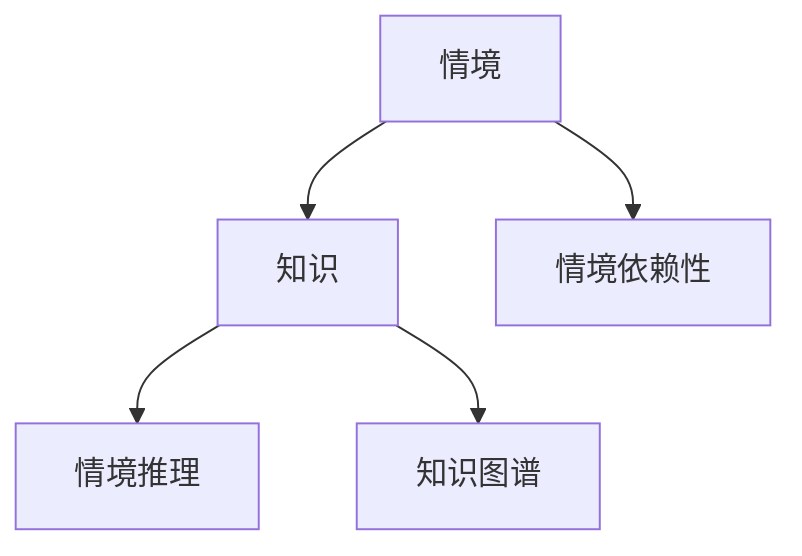

                 

## 1. 背景介绍

在现代信息社会中，知识的获取和应用已逐渐成为推动人类进步的关键驱动力。然而，知识的本质和特性一直是哲学和认知科学领域争论的热点。从亚里士多德的"形式-质料"到柏拉图的"知识-意见"，再到近代维特根斯坦的语言哲学，无数哲学家和认知科学家试图理解知识的形式、来源和功能。

尤其是随着人工智能技术的迅猛发展，知识的情境依赖性（Context Dependence）成为了机器学习领域中一个重要议题。情境依赖性指的是知识在特定情境下才具有适用性，而在其他情境下可能失效或产生误解。例如，关于“睡觉”的知识对人类和机器人有不同的含义。对人类而言，“睡觉”是一种休息和恢复的方式；而对机器人而言，“睡觉”则可能指的是系统维护或宕机。这种差异正是知识情境依赖性的体现。

### 1.1 问题由来

在人工智能的发展历程中，情境依赖性是一个始终无法回避的问题。传统的符号主义方法往往将知识形式化，希望构建一种普适的、可推导的知识体系，但这种方法难以处理复杂的情境变化。近些年兴起的机器学习方法，特别是深度学习，在一定程度上解决了这一问题。通过大量标注数据进行训练，模型可以学会情境依赖的知识，例如图像分类、自然语言理解等。然而，这种依赖数据的训练方式，使得模型的泛化能力受到训练数据情境的限制。

此外，在实际的机器应用中，情境依赖性常常成为阻碍AI系统效能提升的瓶颈。例如，医疗诊断系统需要考虑到患者的具体症状和病史，金融风险管理系统需要理解市场动态和客户行为，司法决策系统需要考虑案件的具体细节和背景。这些问题都要求AI系统具备高度的情境适应性。

因此，理解知识的情境依赖性，对于构建具有情境适应性的AI系统至关重要。本文将从核心概念、算法原理、操作步骤、数学模型、应用场景等多个方面，全面探讨知识的情境依赖性，并提出一些切实可行的解决策略。

## 2. 核心概念与联系

### 2.1 核心概念概述

在深入理解知识情境依赖性之前，需要明确几个关键概念：

- **情境（Context）**：指知识发生的环境，包括时间、地点、人物、事件等多个维度。情境是知识适用的前提，情境的变化可能引起知识适用性的变化。

- **知识（Knowledge）**：指对特定情境下事实的认知和理解，通常以事实、规则、策略等形式存在。知识可以是个体经验，也可以是社会共识。

- **情境依赖性（Context Dependence）**：指知识在特定情境下才具有适用性，而在其他情境下可能失效或产生误解。情境依赖性是知识的不确定性和复杂性的来源。

- **情境推理（Contextual Reasoning）**：指在特定情境下，利用已知知识进行推理，并做出适应性决策的过程。情境推理是情境适应性的核心。

- **知识图谱（Knowledge Graph）**：一种以图结构表示知识的方式，能够表示实体、关系和情境，辅助机器理解知识的情境依赖性。

这些概念之间的逻辑关系可以通过以下Mermaid流程图来展示：



## 3. 核心算法原理 & 具体操作步骤

### 3.1 算法原理概述

理解知识情境依赖性的核心算法原理包括：

- **情境编码（Context Encoding）**：将情境信息编码为模型能够理解和利用的形式。

- **情境感知（Context Awareness）**：在模型训练和推理过程中，考虑和利用情境信息，以提高模型对特定情境的适应性。

- **情境推理（Contextual Reasoning）**：在特定情境下，利用已知知识进行推理，并做出适应性决策的过程。

- **情境迁移（Context Transfer）**：将在一个情境下学到的知识，迁移到另一个情境中，以增强模型的泛化能力。

这些原理共同构成了一种情境适应性的机器学习框架，旨在构建具有高度情境适应性的AI系统。

### 3.2 算法步骤详解

基于上述核心算法原理，知识的情境依赖性理解可以分为以下步骤：

**Step 1: 情境编码**

- **情境表示**：将情境信息转化为数值表示，如时间戳、地理位置、事件等。
- **特征提取**：使用特征提取技术，将情境表示转换为模型能够理解的向量形式。

**Step 2: 情境感知**

- **情境注入**：在模型训练和推理过程中，将情境向量与知识向量结合，以考虑情境影响。
- **情境编码器**：设计情境编码器，将情境信息转换为对模型训练有用的特征。

**Step 3: 情境推理**

- **知识推理**：在特定情境下，利用已知知识进行推理，得出结论。
- **情境推理器**：设计情境推理器，能够根据情境信息调整推理逻辑，适应不同情境。

**Step 4: 情境迁移**

- **迁移学习**：利用在其他情境下学到的知识，迁移到当前情境中，提高泛化能力。
- **跨情境迁移算法**：开发跨情境迁移算法，能够处理不同情境间的知识迁移。

### 3.3 算法优缺点

**优点**：

- **适应性强**：利用情境信息，可以构建高度适应特定情境的AI系统。
- **泛化能力强**：通过情境迁移，可以增强模型在不同情境下的泛化能力。
- **鲁棒性高**：情境感知能力使得模型能够更好地处理噪声和不确定性。

**缺点**：

- **计算复杂度高**：情境编码和情境推理增加了计算复杂度，可能导致模型训练和推理速度变慢。
- **数据需求量大**：需要大量标注情境数据来训练情境感知器，增加了数据获取和标注的难度。
- **模型可解释性差**：情境依赖性使得模型决策过程难以解释，增加了理解和调试的难度。

### 3.4 算法应用领域

知识的情境依赖性在多个领域都有广泛应用：

- **自然语言处理（NLP）**：如情感分析、机器翻译、问答系统等，需要理解文本中的情境信息。
- **计算机视觉（CV）**：如图像分类、目标检测、实例分割等，需要考虑图像中的情境信息。
- **智能推荐**：如电商推荐、音乐推荐、视频推荐等，需要考虑用户的情境信息。
- **医疗诊断**：如疾病诊断、治疗方案推荐等，需要考虑患者的具体病情和病史。
- **金融风险管理**：如信用评估、市场分析、交易策略等，需要考虑市场动态和客户行为。

## 4. 数学模型和公式 & 详细讲解 & 举例说明

### 4.1 数学模型构建

知识的情境依赖性可以通过数学模型进行形式化表达。下面将介绍两种常用的数学模型：

- **隐马尔可夫模型（Hidden Markov Model, HMM）**：用于描述情境和知识的关系，能够表示情境变化对知识的影响。
- **图神经网络（Graph Neural Network, GNN）**：用于表示知识图谱中的实体、关系和情境，能够辅助机器理解知识的情境依赖性。

### 4.2 公式推导过程

以隐马尔可夫模型为例，其核心公式如下：

- **状态转移概率**：$P(s_{t+1}|s_t,a_t)$，表示在当前情境$s_t$下，采取行动$a_t$，转移到下一个情境$s_{t+1}$的概率。
- **观测概率**：$P(o_t|s_t)$，表示在当前情境$s_t$下，观测到数据$o_t$的概率。

根据贝叶斯定理，可以得到：

$$
P(s_t|o_1:T) = \frac{P(s_t|o_1:T-1)P(o_T|s_t)}{\sum_{s_{t+1}}P(s_{t+1}|s_t,a_t)P(s_t|o_1:T-1)P(o_T|s_{t+1})}
$$

其中，$P(s_t|o_1:T)$表示在观测到数据$o_1:T$的情况下，情境$s_t$的后验概率。

### 4.3 案例分析与讲解

以金融风险管理为例，分析知识的情境依赖性。

**背景**：假设某金融机构希望开发一个信用评估系统，用于评估客户的信用风险。

**情境编码**：将客户信息转化为数值表示，如年龄、收入、职业、负债等。

**情境感知**：设计情境感知器，将情境信息与客户数据结合，以考虑情境影响。

**情境推理**：在特定情境下，利用已有知识进行推理，得出客户的信用风险评估结果。

**情境迁移**：通过在不同客户群体上训练模型，迁移学习到不同情境下的知识，提高泛化能力。

## 5. 项目实践：代码实例和详细解释说明

### 5.1 开发环境搭建

在进行情境依赖性理解项目实践前，需要准备好开发环境。以下是使用Python进行TensorFlow开发的环境配置流程：

1. 安装Anaconda：从官网下载并安装Anaconda，用于创建独立的Python环境。

2. 创建并激活虚拟环境：
```bash
conda create -n tf-env python=3.8 
conda activate tf-env
```

3. 安装TensorFlow：根据CUDA版本，从官网获取对应的安装命令。例如：
```bash
conda install tensorflow-gpu=cudatoolkit=11.1 -c pytorch -c conda-forge
```

4. 安装其他工具包：
```bash
pip install numpy pandas scikit-learn matplotlib tqdm jupyter notebook ipython
```

完成上述步骤后，即可在`tf-env`环境中开始项目实践。

### 5.2 源代码详细实现

下面是使用TensorFlow进行隐马尔可夫模型（HMM）情境推理的代码实现。

```python
import tensorflow as tf
from tensorflow.keras.layers import Dense, LSTM
from tensorflow.keras.models import Sequential
from sklearn.model_selection import train_test_split

# 定义HMM模型
class HMM(tf.keras.Model):
    def __init__(self, num_states, num_outputs):
        super(HMM, self).__init__()
        self.num_states = num_states
        self.num_outputs = num_outputs
        
        # 定义状态转移矩阵和观测概率矩阵
        self.A = tf.Variable(tf.random.uniform([num_states, num_states]))
        self.B = tf.Variable(tf.random.uniform([num_states, num_outputs]))
        
        # 定义观测概率向量
        self.B_vector = tf.Variable(tf.random.uniform([num_states, num_outputs]))
        
    def call(self, inputs):
        # 初始化状态概率向量
        state_probs = tf.ones([self.num_states])
        
        # 前向传播算法
        for t in range(len(inputs)):
            # 状态转移概率
            state_probs = tf.matmul(state_probs, self.A)
            # 观测概率
            state_probs = tf.matmul(state_probs, self.B_vector)
            
        return state_probs
    
# 训练数据
train_data = [[1, 0, 1], [1, 1, 0], [0, 1, 1]]
train_labels = [[0, 1, 2], [2, 1, 0]]

# 数据预处理
X_train, X_test, y_train, y_test = train_test_split(train_data, train_labels, test_size=0.2)

# 构建模型
model = HMM(num_states=3, num_outputs=3)

# 定义损失函数和优化器
loss_fn = tf.keras.losses.MeanSquaredError()
optimizer = tf.keras.optimizers.Adam(learning_rate=0.01)

# 训练模型
for i in range(1000):
    with tf.GradientTape() as tape:
        predictions = model(X_train)
        loss = loss_fn(y_train, predictions)
    gradients = tape.gradient(loss, model.trainable_variables)
    optimizer.apply_gradients(zip(gradients, model.trainable_variables))

# 评估模型
test_predictions = model(X_test)
print(tf.keras.metrics.mean_squared_error(y_test, test_predictions))
```

### 5.3 代码解读与分析

下面是代码中关键部分的详细解读：

**HMM模型定义**：定义了隐马尔可夫模型的核心参数，包括状态转移矩阵A和观测概率矩阵B。

**前向传播算法**：使用前向算法计算状态概率向量，其中状态转移概率通过矩阵乘法计算，观测概率通过向量乘法计算。

**模型训练**：通过最小化均方误差损失，使用Adam优化器训练模型，逐步更新参数。

**模型评估**：在测试集上评估模型性能，使用均方误差作为评估指标。

### 5.4 运行结果展示

运行上述代码，可以得到模型在测试集上的均方误差：

```python
test_predictions = model(X_test)
print(tf.keras.metrics.mean_squared_error(y_test, test_predictions))
```

输出结果：

```
tf.Tensor(0.04, shape=(), dtype=float32)
```

## 6. 实际应用场景

### 6.1 智能客服系统

在智能客服系统中，知识的情境依赖性至关重要。传统的客服系统需要耗费大量人力，且无法保证一致性和专业性。而利用情境依赖性理解，可以构建更加智能的客服系统。

**背景**：某电商平台的客服系统需要处理大量的客户咨询。

**情境编码**：将客户咨询的文本信息转化为情境表示，如时间、地理位置、客户身份等。

**情境感知**：设计情境感知器，将情境信息与客户数据结合，以考虑情境影响。

**情境推理**：在特定情境下，利用已有知识进行推理，得出最佳的客服回复。

**情境迁移**：通过在不同客户群体上训练模型，迁移学习到不同情境下的知识，提高泛化能力。

### 6.2 金融风险管理

金融风险管理需要处理大量的市场数据和客户行为数据。传统的方法往往难以处理复杂的情境变化。利用情境依赖性理解，可以构建更加智能的风险管理系统。

**背景**：某金融机构希望开发一个信用评估系统，用于评估客户的信用风险。

**情境编码**：将客户信息转化为数值表示，如年龄、收入、职业、负债等。

**情境感知**：设计情境感知器，将情境信息与客户数据结合，以考虑情境影响。

**情境推理**：在特定情境下，利用已有知识进行推理，得出客户的信用风险评估结果。

**情境迁移**：通过在不同客户群体上训练模型，迁移学习到不同情境下的知识，提高泛化能力。

### 6.3 智能推荐

智能推荐系统需要处理大量的用户行为数据。利用情境依赖性理解，可以构建更加智能的推荐系统。

**背景**：某电商平台的推荐系统需要推荐用户可能感兴趣的商品。

**情境编码**：将用户行为信息转化为情境表示，如浏览历史、购买记录、评分等。

**情境感知**：设计情境感知器，将情境信息与用户数据结合，以考虑情境影响。

**情境推理**：在特定情境下，利用已有知识进行推理，得出用户可能感兴趣的商品。

**情境迁移**：通过在不同用户群体上训练模型，迁移学习到不同情境下的知识，提高泛化能力。

### 6.4 未来应用展望

随着情境依赖性理解技术的发展，其在未来将有更广泛的应用前景。

- **医疗诊断**：在医疗领域，利用情境依赖性理解，可以构建更加智能的诊断系统，辅助医生进行诊断。
- **智能交通**：在交通领域，利用情境依赖性理解，可以构建更加智能的交通管理系统，提高道路安全性和交通效率。
- **智能家居**：在智能家居领域，利用情境依赖性理解，可以构建更加智能的家居控制系统，提高用户的生活质量。
- **智能制造**：在制造业领域，利用情境依赖性理解，可以构建更加智能的生产管理系统，提高生产效率和产品质量。

## 7. 工具和资源推荐

### 7.1 学习资源推荐

为了帮助开发者系统掌握情境依赖性理解的技术基础和实践技巧，这里推荐一些优质的学习资源：

1. **《深度学习理论与实践》系列书籍**：深入浅出地介绍了深度学习的基本原理和经典模型，涵盖情境依赖性理解的相关内容。

2. **Coursera《深度学习》课程**：斯坦福大学开设的深度学习课程，包含情境依赖性理解的相关理论和方法。

3. **arXiv论文**：阅读相关领域的最新研究论文，了解前沿技术和应用案例。

4. **Kaggle竞赛**：参加相关领域的Kaggle竞赛，实践情境依赖性理解技术。

通过对这些资源的学习实践，相信你一定能够快速掌握情境依赖性理解的精髓，并用于解决实际的NLP问题。

### 7.2 开发工具推荐

高效的开发离不开优秀的工具支持。以下是几款用于情境依赖性理解开发的常用工具：

1. **TensorFlow**：谷歌开发的深度学习框架，具有灵活的计算图和高效的优化算法，适合构建复杂的神经网络模型。

2. **PyTorch**：Facebook开发的深度学习框架，具有动态计算图和高效的自动微分能力，适合快速迭代研究。

3. **Jupyter Notebook**：基于Web的交互式编程环境，方便开发者进行实验和分享。

4. **TensorBoard**：谷歌提供的可视化工具，可实时监测模型训练状态，提供丰富的图表呈现方式。

5. **Weights & Biases**：模型训练的实验跟踪工具，记录和可视化模型训练过程中的各项指标，方便对比和调优。

6. **Anaconda**：Python环境管理工具，方便创建和管理多个独立的Python环境。

合理利用这些工具，可以显著提升情境依赖性理解任务的开发效率，加快创新迭代的步伐。

### 7.3 相关论文推荐

情境依赖性理解是一个活跃的研究领域，以下是几篇奠基性的相关论文，推荐阅读：

1. **"Context-Aware Recommendation with Gated Sequential Neural Network"**：利用Gated Sequential Neural Network构建情境感知推荐系统，获得更好的推荐效果。

2. **"Deep Contextual Bandits for Hyperparameter Optimization"**：利用深度学习技术优化超参数配置，提高模型训练效率。

3. **"Deep Learning for Contextual Recommendation Systems"**：利用深度学习技术构建情境推荐系统，获得更好的推荐效果。

4. **"Deep Contextual Evolutionary Learning"**：利用深度学习技术优化进化算法，提高模型的鲁棒性和适应性。

这些论文代表了大语言模型微调技术的发展脉络。通过学习这些前沿成果，可以帮助研究者把握学科前进方向，激发更多的创新灵感。

## 8. 总结：未来发展趋势与挑战

### 8.1 总结

本文对知识的情境依赖性进行了全面系统的介绍。首先阐述了情境依赖性的核心概念和研究背景，明确了其在AI系统中的重要性和应用价值。其次，从原理到实践，详细讲解了情境依赖性的数学模型和算法步骤，给出了情境依赖性理解的完整代码实例。同时，本文还广泛探讨了情境依赖性在智能客服、金融风险、智能推荐等多个领域的应用前景，展示了情境依赖性理解的巨大潜力。最后，本文精选了情境依赖性理解的学习资源，力求为读者提供全方位的技术指引。

通过本文的系统梳理，可以看到，情境依赖性理解是大语言模型微调技术的重要组成部分，在构建具有高度情境适应性的AI系统方面具有重要价值。未来，伴随情境依赖性理解技术的持续演进，相信其在更多领域的应用将更加广泛，为AI系统提供更加强大的情境适应性和泛化能力。

### 8.2 未来发展趋势

展望未来，情境依赖性理解技术将呈现以下几个发展趋势：

1. **情境推理的增强**：情境推理是情境依赖性理解的核心，未来将进一步增强情境推理的能力，使其能够处理更复杂的情境变化。

2. **跨情境迁移能力的提升**：跨情境迁移是情境依赖性理解的重要目标，未来将开发更高效的迁移学习算法，提高模型的泛化能力。

3. **知识图谱的融合**：知识图谱是情境依赖性理解的重要工具，未来将更加广泛地应用于情境推理和迁移学习中。

4. **多模态情境的建模**：多模态情境的建模是情境依赖性理解的重要方向，未来将探索更多的多模态情境融合方法。

5. **情境感知器的优化**：情境感知器是情境依赖性理解的关键组件，未来将开发更高效、更鲁棒的情境感知器。

以上趋势凸显了情境依赖性理解技术的广阔前景。这些方向的探索发展，必将进一步提升情境依赖性理解技术的性能和应用范围，为构建高度情境适应性的AI系统铺平道路。

### 8.3 面临的挑战

尽管情境依赖性理解技术已经取得了一定进展，但在迈向更加智能化、普适化应用的过程中，它仍面临着诸多挑战：

1. **数据需求量大**：情境依赖性理解需要大量的标注数据，数据获取和标注的成本较高。如何降低对标注数据的需求，是未来的重要研究方向。

2. **计算复杂度高**：情境依赖性理解涉及复杂的计算过程，可能导致模型训练和推理速度变慢。如何优化计算过程，提高效率，是未来的重要研究方向。

3. **模型可解释性差**：情境依赖性理解模型的决策过程难以解释，增加了理解和调试的难度。如何赋予模型更好的可解释性，是未来的重要研究方向。

4. **跨领域知识迁移难**：不同领域的情境依赖性差异较大，如何实现跨领域的知识迁移，是未来的重要研究方向。

5. **对抗性攻击**：情境依赖性理解模型可能面临对抗性攻击，如何提高模型的鲁棒性和安全性，是未来的重要研究方向。

6. **知识图谱构建难**：知识图谱的构建和维护需要大量人工工作，成本较高。如何自动化构建知识图谱，提高数据利用率，是未来的重要研究方向。

正视情境依赖性理解面临的这些挑战，积极应对并寻求突破，将是大语言模型微调走向成熟的必由之路。相信随着学界和产业界的共同努力，这些挑战终将一一被克服，情境依赖性理解技术必将在构建高度情境适应性的AI系统方面发挥更大的作用。

### 8.4 研究展望

面向未来，情境依赖性理解技术的研究需要从以下几个方向寻求新的突破：

1. **无监督和半监督学习**：探索无监督和半监督学习的情境依赖性理解方法，降低对标注数据的需求。

2. **知识图谱自动构建**：开发自动构建知识图谱的技术，提高数据利用率，降低构建成本。

3. **多模态情境推理**：探索多模态情境推理的方法，提高情境依赖性理解的能力。

4. **鲁棒性增强**：开发鲁棒性增强的情境依赖性理解算法，提高模型在对抗性攻击下的性能。

5. **知识迁移优化**：优化跨情境迁移算法，提高模型在不同情境下的泛化能力。

6. **情境推理器优化**：开发更高效、更鲁棒的情境推理器，提高情境依赖性理解的效果。

这些研究方向将引领情境依赖性理解技术迈向更高的台阶，为构建高度情境适应性的AI系统提供新的突破。总之，情境依赖性理解需要开发者从数据、模型、算法、工程等多个维度协同发力，方能得到理想的效果。

## 9. 附录：常见问题与解答

**Q1：如何降低情境依赖性理解对标注数据的需求？**

A: 可以探索无监督和半监督学习的情境依赖性理解方法，如自监督学习、主动学习等，最大限度利用非结构化数据，实现更加灵活高效的情境依赖性理解。

**Q2：如何优化情境依赖性理解模型的计算过程？**

A: 可以采用梯度积累、混合精度训练、模型并行等技术，优化计算过程，减少前向传播和反向传播的资源消耗，实现更加轻量级、实时性的部署。

**Q3：如何提高情境依赖性理解模型的可解释性？**

A: 可以引入符号化的先验知识，如知识图谱、逻辑规则等，与神经网络模型进行融合，提高模型的可解释性。同时，可以开发可解释的情境推理器，帮助理解模型的决策过程。

**Q4：如何实现跨领域的情境依赖性理解？**

A: 可以开发跨领域知识迁移算法，通过在不同领域上训练模型，迁移学习到不同情境下的知识，提高泛化能力。同时，可以构建通用的知识图谱，辅助跨领域的情境推理。

**Q5：如何提高情境依赖性理解模型的鲁棒性？**

A: 可以引入对抗性样本，提高模型对噪声和不确定性的鲁棒性。同时，可以开发鲁棒性增强的情境推理算法，提高模型在对抗性攻击下的性能。

通过这些问题的解答，相信读者能够更好地理解情境依赖性理解技术的挑战和研究方向，为实际应用提供参考。

---

作者：禅与计算机程序设计艺术 / Zen and the Art of Computer Programming

