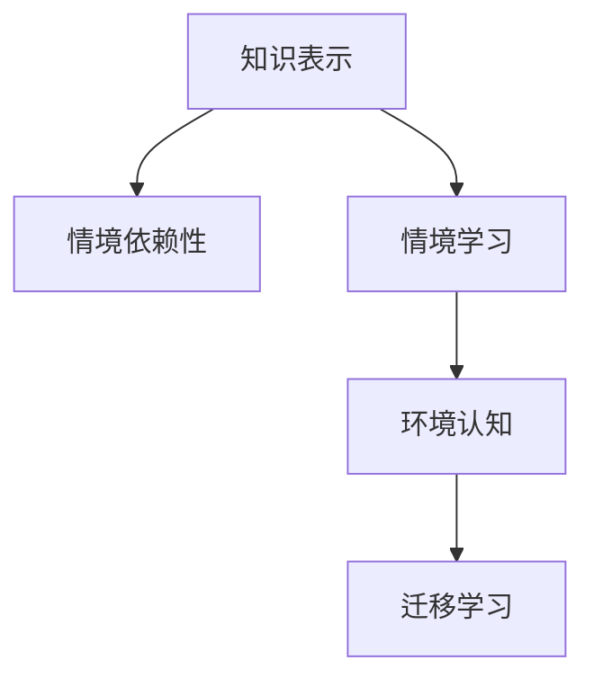

                 

# 知识的情境依赖：环境对学习的影响

> 关键词：知识表示,语境依赖性,情境学习,环境认知,神经网络,迁移学习

## 1. 背景介绍

### 1.1 问题由来
在人工智能的研究和应用中，知识表示（Knowledge Representation）一直是一个核心议题。传统的知识表示方法往往将知识抽象为符号逻辑或统计概率等形式，但这种静态的表示方式难以处理知识的情境依赖性，无法适应动态和复杂的情境变化。近年来，随着神经网络和迁移学习等技术的突破，一种更加灵活和动态的知识表示方式——情境学习（Contextual Learning）逐渐成为研究热点。

情境学习强调知识的情境依赖性，认为知识不仅存在于个体脑内，还与周围环境紧密相关。这种观点首次由德国心理学家缪勒-莱依（Werner W. Müller）于1967年提出，随后被众多认知心理学家进一步发展和验证。情境学习认为，知识是在特定情境下通过互动和适应过程逐渐构建的，知识的理解和应用也离不开环境信息。

这一观点在人工智能领域引起了广泛关注，尤其是在自然语言处理（NLP）和机器人等领域。情境学习不仅为知识表示提供了新的视角，还为模型训练和迁移学习带来了新的方法，推动了人工智能技术的进步。本文将围绕知识的情境依赖性和情境学习，探讨其原理、应用和未来发展方向。

## 2. 核心概念与联系

### 2.1 核心概念概述

为了更好地理解情境学习，我们首先需要介绍几个关键的概念：

1. **知识表示（Knowledge Representation）**：将知识以符号、逻辑或统计形式进行编码，以便机器理解和处理。传统方法如逻辑表示、语义网等，难以捕捉知识的情境依赖性。

2. **情境依赖性（Contextual Dependence）**：知识与环境、情境密切相关，不同情境下知识的意义和应用方式可能不同。情境学习强调知识在特定情境下的构建和应用。

3. **情境学习（Contextual Learning）**：通过与环境的互动和适应，逐渐构建和理解知识，并将知识应用到新的情境中。情境学习强调知识的动态性和情境相关性。

4. **环境认知（Environmental Cognition）**：学习者对周围环境的感知、分析和适应，是情境学习的重要组成部分。环境认知涉及到信息的获取、处理和应用，是实现情境学习的基础。

5. **迁移学习（Transfer Learning）**：将在一个情境中学到的知识迁移到另一个情境中，提高学习效率和效果。情境学习强调情境之间的迁移，而不仅仅是在不同任务之间的迁移。

这些核心概念之间的关系可以通过以下Mermaid流程图来展示：



这个流程图展示了知识表示、情境依赖性、情境学习、环境认知和迁移学习之间的逻辑关系：知识表示是情境学习的基础，情境学习强调知识的情境依赖性，环境认知是情境学习的重要组成部分，迁移学习则是情境学习的重要应用之一。

## 3. 核心算法原理 & 具体操作步骤

### 3.1 算法原理概述

情境学习的基础是环境认知。环境认知模型（Environmental Cognition Model）通过感知、分析和适应环境信息，逐渐构建和更新知识表示。情境学习模型（Contextual Learning Model）利用环境信息指导知识的学习和应用，强调知识的情境依赖性。

情境学习模型的核心是情境编码器（Contextual Encoder）和知识提取器（Knowledge Extractor）。情境编码器负责将环境信息编码为向量形式，知识提取器则利用情境信息对知识进行编码和更新。在训练过程中，情境编码器和知识提取器通过反向传播算法进行联合训练，共同优化知识表示和情境编码。

情境学习模型的一般训练过程如下：

1. 输入环境信息。
2. 环境编码器将环境信息编码为情境向量。
3. 知识提取器利用情境向量更新知识表示。
4. 知识表示用于解决特定情境下的任务。
5. 模型输出预测结果，并根据误差进行反向传播更新参数。
6. 重复上述过程，直至模型收敛。

### 3.2 算法步骤详解

情境学习模型的训练步骤如下：

**Step 1: 数据准备**
- 收集训练数据，包括环境信息、任务描述和目标标签。
- 将环境信息进行预处理，转换为模型可用的向量形式。

**Step 2: 模型初始化**
- 初始化情境编码器和知识提取器。
- 设定模型超参数，如学习率、批大小等。

**Step 3: 前向传播**
- 将环境信息输入情境编码器，得到情境向量。
- 将情境向量输入知识提取器，更新知识表示。
- 知识表示用于解决当前情境下的任务，得到预测结果。

**Step 4: 损失计算**
- 计算模型预测结果与真实标签之间的误差，如交叉熵损失。

**Step 5: 反向传播**
- 根据误差进行反向传播，更新情境编码器和知识提取器的参数。

**Step 6: 迭代更新**
- 重复上述过程，直至模型收敛。

**Step 7: 模型测试**
- 在测试集上评估模型性能，包括准确率、召回率等指标。

### 3.3 算法优缺点

情境学习模型具有以下优点：

1. 强调知识的情境依赖性，能够更好地适应复杂和动态的环境。
2. 利用环境信息进行知识编码和更新，提高了知识的适应性和泛化能力。
3. 通过迁移学习，能够在不同情境下进行知识迁移，提高学习效率和效果。

同时，情境学习模型也存在一些缺点：

1. 对环境信息的要求较高，需要准确、全面地捕捉环境特征。
2. 模型复杂度较高，需要较长的训练时间和计算资源。
3. 情境编码器的设计对模型效果有较大影响，需要根据具体任务进行调整。

### 3.4 算法应用领域

情境学习模型已经在多个领域得到了广泛应用，如自然语言处理、机器人学习、智能推荐等。以下是几个典型的应用场景：

**1. 自然语言处理**
- 情境对话系统：利用用户输入和上下文信息，生成符合情境的对话回复。情境学习能够捕捉对话中的语境变化，提高对话的自然度和流畅性。
- 命名实体识别：在特定情境下识别文本中的命名实体，如人名、地名等。情境学习能够考虑实体在文本中的位置和上下文，提高识别的准确性。

**2. 机器人学习**
- 机器人导航：在复杂环境中，机器人通过与环境的互动，学习路径规划和行为策略。情境学习能够适应不同环境条件，提高机器人的导航效率和鲁棒性。
- 机器人操作：通过情境学习，机器人能够根据环境信息和任务要求，执行复杂的动作序列。

**3. 智能推荐**
- 推荐系统：利用用户行为和环境信息，推荐符合用户兴趣和情境的商品。情境学习能够捕捉用户在不同情境下的兴趣变化，提高推荐的个性化和准确性。
- 广告投放：根据用户环境和行为信息，推荐合适的广告内容。情境学习能够考虑用户的实时需求和兴趣，提高广告的转化率。

## 4. 数学模型和公式 & 详细讲解 & 举例说明

### 4.1 数学模型构建

情境学习模型通常采用神经网络的形式进行构建。其核心结构包括情境编码器和知识提取器，数学模型如下：

$$
\begin{aligned}
& \text{Encoder}(x): \mathbb{R}^n \rightarrow \mathbb{R}^m \\
& \text{Extractor}(c): \mathbb{R}^m \rightarrow \mathbb{R}^k 
\end{aligned}
$$

其中，$x$ 为环境信息，$n$ 为环境信息的维度，$m$ 为情境编码器输出向量的维度，$k$ 为知识表示的维度。

### 4.2 公式推导过程

在训练过程中，情境编码器和知识提取器共同优化。假设环境信息 $x$ 和目标标签 $y$ 已知，目标函数为交叉熵损失：

$$
L = -\frac{1}{N} \sum_{i=1}^N \sum_{j=1}^k y_{i,j} \log \hat{y}_{i,j}
$$

其中，$y_{i,j}$ 为第 $i$ 个样本的第 $j$ 个知识点的真实标签，$\hat{y}_{i,j}$ 为模型预测的知识点概率。

在反向传播过程中，情境编码器和知识提取器的梯度分别计算如下：

$$
\frac{\partial L}{\partial c} = \frac{\partial L}{\partial \hat{y}} \frac{\partial \hat{y}}{\partial c}
$$

$$
\frac{\partial L}{\partial e} = \frac{\partial L}{\partial \hat{y}} \frac{\partial \hat{y}}{\partial c} \frac{\partial c}{\partial e}
$$

其中，$c$ 为情境向量，$e$ 为环境信息，$\frac{\partial L}{\partial \hat{y}}$ 为交叉熵损失对概率的梯度。

### 4.3 案例分析与讲解

**案例1: 情境对话系统**
- 环境信息：用户输入、历史对话记录
- 情境编码器：LSTM网络，提取对话上下文
- 知识提取器：MLP网络，生成对话回复
- 输出：预测对话回复

**案例2: 命名实体识别**
- 环境信息：文本、上下文信息
- 情境编码器：BERT网络，提取文本上下文
- 知识提取器：LSTM网络，识别实体边界
- 输出：实体类型标签

## 5. 项目实践：代码实例和详细解释说明

### 5.1 开发环境搭建

在进行情境学习项目实践前，我们需要准备好开发环境。以下是使用Python进行PyTorch开发的环境配置流程：

1. 安装Anaconda：从官网下载并安装Anaconda，用于创建独立的Python环境。

2. 创建并激活虚拟环境：
```bash
conda create -n contextual-env python=3.8 
conda activate contextual-env
```

3. 安装PyTorch：根据CUDA版本，从官网获取对应的安装命令。例如：
```bash
conda install pytorch torchvision torchaudio cudatoolkit=11.1 -c pytorch -c conda-forge
```

4. 安装相关库：
```bash
pip install torch nn sklearn pandas
```

5. 安装Tensorboard：用于可视化模型训练过程和结果。

```bash
pip install tensorboard
```

完成上述步骤后，即可在`contextual-env`环境中开始情境学习项目的开发。

### 5.2 源代码详细实现

以下是一个简单的情境学习模型实现示例，用于解决命名实体识别任务。

首先，定义模型结构：

```python
import torch
import torch.nn as nn
from torch.nn import functional as F

class Encoder(nn.Module):
    def __init__(self, input_size, hidden_size):
        super(Encoder, self).__init__()
        self.hidden_size = hidden_size
        self.lstm = nn.LSTM(input_size, hidden_size)
        
    def forward(self, x):
        _, (h_n, _) = self.lstm(x)
        return h_n

class Extractor(nn.Module):
    def __init__(self, input_size, hidden_size, output_size):
        super(Extractor, self).__init__()
        self.hidden_size = hidden_size
        self.linear = nn.Linear(hidden_size, output_size)
        
    def forward(self, c):
        y = self.linear(c)
        return y
```

然后，定义训练函数：

```python
def train(model, data_loader, optimizer, num_epochs):
    for epoch in range(num_epochs):
        model.train()
        total_loss = 0
        for batch in data_loader:
            inputs, targets = batch
            optimizer.zero_grad()
            y_pred = model(inputs)
            loss = F.cross_entropy(y_pred, targets)
            loss.backward()
            optimizer.step()
            total_loss += loss.item()
        print(f'Epoch {epoch+1}, loss: {total_loss/len(data_loader)}')
```

最后，启动训练流程：

```python
data_loader = DataLoader(train_dataset, batch_size=16)
optimizer = torch.optim.Adam(model.parameters(), lr=0.001)

num_epochs = 5
train(model, data_loader, optimizer, num_epochs)
```

在训练过程中，模型通过不断调整情境编码器和知识提取器的参数，逐步优化知识表示，提高命名实体识别的准确性。

### 5.3 代码解读与分析

让我们再详细解读一下关键代码的实现细节：

**Encoder类**：
- `__init__`方法：初始化LSTM层，用于提取文本上下文信息。
- `forward`方法：将文本输入LSTM，得到上下文表示。

**Extractor类**：
- `__init__`方法：初始化MLP层，用于对上下文表示进行分类。
- `forward`方法：将上下文表示输入MLP，输出命名实体类型的概率。

**train函数**：
- 循环迭代多个epoch。
- 每个epoch内，对每个样本进行前向传播计算损失，反向传播更新参数。
- 记录每个epoch的总损失，输出平均损失。

**DataLoader**：
- 用于加载和批处理训练数据，支持不同数据格式的转换和处理。

在实际应用中，还需要对模型进行保存和部署，并根据具体任务进行微调优化。通过上述代码示例，可以初步了解情境学习模型的实现方法和关键步骤。

## 6. 实际应用场景

### 6.1 智能客服系统

情境学习模型在智能客服系统中具有广泛应用前景。传统的客服系统依赖于静态知识库和规则，难以应对复杂和动态的用户需求。情境学习模型通过与用户的互动，实时捕捉用户的语境信息，动态构建和更新知识表示，能够提供更加个性化的服务。

具体而言，情境学习模型可以用于：
- 自动理解用户意图和需求，生成自然流畅的对话回复。
- 根据用户的历史行为和上下文信息，推荐合适的解决方案。
- 实时监控用户情绪和反馈，及时调整服务策略。

### 6.2 金融舆情监测

金融市场舆情监测是金融风险管理的重要环节。情境学习模型能够利用文本和图像等多模态信息，实时监测市场舆情变化，为决策提供依据。

具体而言，情境学习模型可以用于：
- 自动抓取和分析社交媒体、新闻报道等文本信息，识别市场情绪和舆情趋势。
- 利用图像识别技术，分析金融图表和新闻图片，提取市场动态信息。
- 通过情境学习，综合多模态信息，提高舆情监测的准确性和及时性。

### 6.3 智能推荐系统

智能推荐系统需要根据用户的环境和行为信息，动态构建推荐策略，提高推荐的个性化和准确性。情境学习模型通过实时捕捉用户情境，动态更新知识表示，能够实现更高效的推荐。

具体而言，情境学习模型可以用于：
- 实时分析用户行为和偏好，动态构建推荐策略。
- 综合考虑用户情境和历史行为，生成个性化推荐内容。
- 通过情境学习，捕捉用户兴趣变化，提升推荐效果。

### 6.4 未来应用展望

随着情境学习技术的不断进步，其应用范围将进一步扩大，推动人工智能技术的深入发展。未来，情境学习将在以下领域得到更广泛的应用：

**1. 医疗诊断**
- 利用病历和症状信息，构建情境学习模型，辅助医生诊断和治疗。
- 通过情境学习，捕捉患者情绪和行为变化，提高诊断的准确性和个性化。

**2. 教育学习**
- 利用学习环境和学生行为信息，构建情境学习模型，提供个性化学习建议。
- 通过情境学习，捕捉学生学习兴趣和效果，动态调整教学策略。

**3. 智能家居**
- 利用环境传感器信息，构建情境学习模型，实现智能家居控制和场景设置。
- 通过情境学习，捕捉用户生活习惯和偏好，提供智能化的家居服务。

## 7. 工具和资源推荐

### 7.1 学习资源推荐

为了帮助开发者系统掌握情境学习的理论和实践，这里推荐一些优质的学习资源：

1. 《Contextual Learning in Artificial Intelligence》：一本关于情境学习的经典书籍，详细介绍了情境学习的理论基础和应用方法。
2. 《Contextual Learning for NLP》课程：斯坦福大学开设的NLP课程，介绍了情境学习在NLP任务中的应用，包括对话系统、命名实体识别等。
3. 《Contextual Learning in Deep Learning》博客：由Google AI撰写的博客，介绍了情境学习在深度学习中的实现方法，包括模型架构和训练技巧。
4. HuggingFace官方文档：Transformers库的官方文档，提供了情境学习模型的样例代码和详细解释。
5. CLUE开源项目：中文语言理解测评基准，涵盖大量不同类型的中文NLP数据集，并提供了情境学习模型的baseline模型。

通过对这些资源的学习实践，相信你一定能够快速掌握情境学习的精髓，并用于解决实际的NLP问题。

### 7.2 开发工具推荐

高效的开发离不开优秀的工具支持。以下是几款用于情境学习开发的常用工具：

1. PyTorch：基于Python的开源深度学习框架，灵活动态的计算图，适合快速迭代研究。大部分情境学习模型都有PyTorch版本的实现。
2. TensorFlow：由Google主导开发的开源深度学习框架，生产部署方便，适合大规模工程应用。同样有丰富的情境学习模型资源。
3. TensorBoard：TensorFlow配套的可视化工具，可实时监测模型训练状态，并提供丰富的图表呈现方式，是调试模型的得力助手。
4. Weights & Biases：模型训练的实验跟踪工具，可以记录和可视化模型训练过程中的各项指标，方便对比和调优。
5. Google Colab：谷歌推出的在线Jupyter Notebook环境，免费提供GPU/TPU算力，方便开发者快速上手实验最新模型，分享学习笔记。

合理利用这些工具，可以显著提升情境学习任务的开发效率，加快创新迭代的步伐。

### 7.3 相关论文推荐

情境学习的发展源于学界的持续研究。以下是几篇奠基性的相关论文，推荐阅读：

1. Contextual Learning in Deep Neural Networks：引入情境编码器，通过上下文信息指导知识学习。
2. Contextual Knowledge Acquisition and Application in AI Systems：讨论情境知识在AI系统中的应用，包括环境感知、知识迁移等。
3. A Survey on Contextual Learning in Artificial Intelligence：系统综述了情境学习在AI领域的研究进展和应用案例。
4. From Knowledge Extraction to Contextual Learning：从知识提取到情境学习，探讨了情境学习的演化过程和挑战。

这些论文代表了大情境学习的发展脉络。通过学习这些前沿成果，可以帮助研究者把握学科前进方向，激发更多的创新灵感。

## 8. 总结：未来发展趋势与挑战

### 8.1 总结

本文对情境学习进行了全面系统的介绍。首先阐述了情境学习的基本概念和原理，明确了知识的情境依赖性，强调了环境信息在知识构建和应用中的重要作用。其次，从模型结构到训练过程，详细讲解了情境学习的数学原理和具体操作步骤，给出了情境学习任务开发的完整代码实例。同时，本文还探讨了情境学习在智能客服、金融舆情、智能推荐等多个领域的应用前景，展示了情境学习范式的巨大潜力。最后，本文精选了情境学习的各类学习资源，力求为读者提供全方位的技术指引。

通过本文的系统梳理，可以看到，情境学习正在成为人工智能领域的重要范式，为知识表示提供了新的视角，极大地拓展了人工智能应用的范围。未来，伴随情境学习技术的不断进步，将有更多领域受益于这一先进技术，推动人工智能技术的持续发展。

### 8.2 未来发展趋势

展望未来，情境学习技术将呈现以下几个发展趋势：

1. 模型复杂度进一步提升。随着深度学习技术和计算资源的不断进步，情境学习模型的复杂度将进一步提升，具备更强的环境感知和知识表示能力。
2. 多模态融合技术发展。情境学习不仅限于文本信息，将更多地融合图像、视频、语音等多元数据，实现更全面、准确的情境感知。
3. 因果学习结合。通过引入因果推理，情境学习模型能够更好地理解因果关系，提高知识的普适性和鲁棒性。
4. 动态学习机制引入。情境学习模型将能够动态更新知识表示，适应环境变化，提高模型的不变性和适应性。
5. 零样本和少样本学习。情境学习模型能够利用部分情境信息，快速适应新任务，减少对大量标注数据的依赖。

以上趋势凸显了情境学习技术的广阔前景。这些方向的探索发展，必将进一步提升情境学习模型的性能和应用范围，为人工智能技术的产业化发展奠定坚实基础。

### 8.3 面临的挑战

尽管情境学习技术已经取得了一定进展，但在迈向更加智能化、普适化应用的过程中，仍面临诸多挑战：

1. 环境信息的质量和全面性。情境学习依赖于环境信息的准确捕捉，如果环境信息不足或不全面，将影响模型的性能。
2. 知识表示的复杂度。情境学习模型的知识表示较为复杂，需要较长的训练时间和计算资源，增加了实际应用的难度。
3. 知识迁移的泛化能力。情境学习模型在不同情境下的迁移能力还有待提高，需要进一步优化模型设计。
4. 模型的可解释性。情境学习模型的决策过程较为复杂，难以进行解释和调试，影响模型的可信度和可靠性。
5. 伦理和安全问题。情境学习模型可能涉及用户隐私和数据安全，需要制定相应的伦理和安全规范。

这些挑战需要我们进一步研究解决，以推动情境学习技术的进一步发展。

### 8.4 研究展望

面向未来，情境学习技术需要在以下几个方面进行深入研究：

1. 优化模型结构和算法。通过引入新的算法和技术，提高情境学习模型的训练效率和效果。
2. 提升环境信息获取能力。通过改进传感器和数据获取技术，提高环境信息的全面性和准确性。
3. 增强知识迁移能力。通过优化模型架构和训练方法，提高情境学习模型在不同情境下的泛化能力。
4. 加强知识表示的可解释性。通过引入可解释的因果推理和符号表示，提高情境学习模型的可解释性和可靠性。
5. 探索新的应用场景。情境学习技术在教育、医疗、金融等多个领域有广泛应用前景，需进一步探索和验证。

这些研究方向将推动情境学习技术不断进步，为人工智能技术的产业化应用提供有力支持。总之，情境学习技术需要从模型设计、数据获取、算法优化等多个维度进行全面优化，方能真正实现其在复杂、动态环境中的高效学习和应用。

## 9. 附录：常见问题与解答

**Q1: 情境学习与传统知识表示方法有何不同？**

A: 情境学习强调知识的情境依赖性，认为知识不仅存在于个体脑内，还与周围环境紧密相关。传统知识表示方法（如逻辑表示、语义网等）则往往将知识抽象为静态的符号或概率形式，难以处理知识的情境变化。情境学习通过与环境的互动和适应，逐步构建和更新知识表示，具有更高的灵活性和适应性。

**Q2: 情境学习模型的训练过程有哪些关键步骤？**

A: 情境学习模型的训练过程主要包括以下步骤：数据准备、模型初始化、前向传播、损失计算、反向传播和迭代更新。数据准备阶段，需要收集环境信息和目标标签。模型初始化阶段，需要初始化情境编码器和知识提取器。前向传播阶段，将环境信息输入模型，得到情境向量和知识表示。损失计算阶段，计算模型预测结果与真实标签之间的误差。反向传播阶段，根据误差进行梯度更新。迭代更新阶段，重复以上过程直至模型收敛。

**Q3: 情境学习模型在实际应用中面临哪些挑战？**

A: 情境学习模型在实际应用中面临以下挑战：
1. 环境信息的质量和全面性：情境学习依赖于环境信息的准确捕捉，如果环境信息不足或不全面，将影响模型的性能。
2. 知识表示的复杂度：情境学习模型的知识表示较为复杂，需要较长的训练时间和计算资源。
3. 知识迁移的泛化能力：情境学习模型在不同情境下的迁移能力还有待提高，需要进一步优化模型设计。
4. 模型的可解释性：情境学习模型的决策过程较为复杂，难以进行解释和调试，影响模型的可信度和可靠性。
5. 伦理和安全问题：情境学习模型可能涉及用户隐私和数据安全，需要制定相应的伦理和安全规范。

**Q4: 情境学习技术在未来有哪些应用前景？**

A: 情境学习技术在未来的应用前景广泛，包括但不限于：
1. 智能客服系统：通过与用户的互动，实时捕捉用户的语境信息，动态构建和更新知识表示，提供更加个性化的服务。
2. 金融舆情监测：利用文本和图像等多模态信息，实时监测市场舆情变化，为决策提供依据。
3. 智能推荐系统：根据用户的环境和行为信息，动态构建推荐策略，提高推荐的个性化和准确性。
4. 医疗诊断：利用病历和症状信息，构建情境学习模型，辅助医生诊断和治疗。
5. 教育学习：利用学习环境和学生行为信息，构建情境学习模型，提供个性化学习建议。

---

作者：禅与计算机程序设计艺术 / Zen and the Art of Computer Programming

