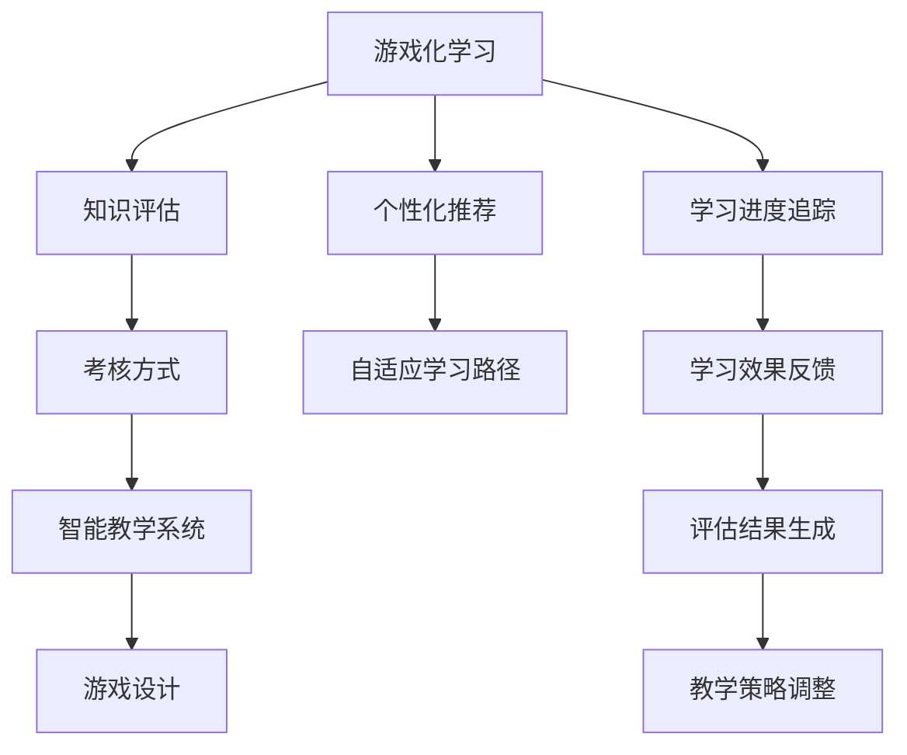

                 

# 知识的游戏化评估：寓教于乐的考核方式

> 关键词：游戏化学习,知识评估,考核方式,教育技术,智能教学系统

## 1. 背景介绍

在当今数字化、信息化快速发展的时代，教育领域也正经历着深刻的变革。传统的以讲授为主的教学方式，逐渐被以学生为中心的、互动式、游戏化的学习模式所取代。游戏化学习（Gamified Learning），即通过设计类似游戏的情境和规则，让学习过程充满趣味性，激发学生的学习动力，从而达到更好的学习效果。而知识的游戏化评估，作为游戏化学习的重要组成部分，通过设计科学合理的评估体系，既能够全面、客观地考核学生的学习成果，又能够提升学生的学习兴趣和参与度，实现真正意义上的寓教于乐。本文将从核心概念出发，深入探讨知识游戏化评估的原理、具体操作步骤及应用场景，以期为教育技术领域提供一些参考。

## 2. 核心概念与联系

### 2.1 核心概念概述

为更好地理解知识的游戏化评估，首先需要明确一些核心概念：

- **游戏化学习（Gamified Learning）**：通过引入游戏元素和机制，如积分、关卡、奖励等，使学习过程更具趣味性和互动性，从而提升学生的学习兴趣和效果。
- **知识评估（Knowledge Assessment）**：衡量和判断学生在知识掌握程度上的水平，是教育评估的重要内容。
- **考核方式（Assessment Methods）**：评估学生学习成果的方法和形式，包括传统的笔试、实验、论文等。
- **智能教学系统（Intelligent Teaching System）**：利用人工智能技术，根据学生的学习行为和表现，自动调整教学内容和难度，提供个性化学习建议的系统。
- **游戏设计（Game Design）**：设计和实现游戏元素、规则、界面等，使其既具备娱乐性，又符合教育目标。

这些核心概念之间有着紧密的联系。游戏化学习通过设计科学合理的游戏机制，激发学生的学习兴趣，智能教学系统则通过分析学生的学习数据，提供个性化的学习建议和评估反馈，而知识评估则是对学生学习成果的全面衡量，确保学生掌握的知识达到教学目标。因此，将知识评估融入游戏化学习，不仅能够提升学习的趣味性和效果，还能通过科学的评估方式，确保教学质量和学生的进步。

### 2.2 核心概念原理和架构的 Mermaid 流程图



这个Mermaid流程图展示了各个核心概念之间的联系：

1. **游戏化学习（A）**：通过引入游戏机制（F、G、H），激发学生的学习兴趣，并实时追踪学习进度（H）。
2. **知识评估（B）**：对学生的学习效果进行全面衡量（J）。
3. **考核方式（C）**：通过多样化的评估方法（如自适应测试、项目评估等），确保评估结果的全面性和准确性。
4. **智能教学系统（D）**：根据学习数据和评估结果，调整教学策略（K），提供个性化的学习建议和路径（G）。
5. **游戏设计（E）**：设计游戏元素和规则，提升学习的趣味性和互动性。

这些概念通过相互作用，形成了一个闭环的学习评估体系，确保学生在享受游戏化学习的过程中，能够不断提升知识水平，并得到科学的评估反馈。

## 3. 核心算法原理 & 具体操作步骤

### 3.1 算法原理概述

知识的游戏化评估，本质上是一个多维度的学习效果衡量和反馈系统。其核心思想是通过科学的游戏化设计，将知识评估融入游戏机制中，从而在提升学生兴趣的同时，确保评估的全面性和客观性。

形式化地，假设学生在学习过程中，通过完成一系列游戏任务（如解谜、挑战、角色扮演等），游戏系统会根据学生的表现和完成情况，给出相应的积分、等级和奖励。知识评估的目标是衡量学生在游戏任务中的知识掌握程度，并根据评估结果，调整游戏难度和内容，以实现个性化学习。

### 3.2 算法步骤详解

基于上述原理，知识的游戏化评估主要包括以下几个关键步骤：

**Step 1: 游戏任务设计**

- **任务目标**：明确每个游戏任务的学习目标，如理解某个概念、掌握某项技能等。
- **任务难度**：根据学生的学习阶段和能力，设计适宜的难度。
- **任务反馈**：设计及时、具体的任务反馈机制，如通过提示、提示框等方式，帮助学生纠正错误，并提供学习建议。

**Step 2: 游戏机制引入**

- **积分系统**：根据学生在任务中的表现，给予相应的积分奖励，用于记录学习进度。
- **等级体系**：通过积分累积，划分不同的等级，激励学生不断提升。
- **奖励机制**：设计多种奖励，如虚拟奖励、实物奖励、荣誉称号等，增强学生的学习动力。

**Step 3: 知识评估模型建立**

- **评估指标**：根据学习目标，设计合适的评估指标，如正确率、解题时间、创意性等。
- **评估方法**：通过自动评分、人工评审、同伴评审等方式，对学生的学习成果进行全面评估。
- **评估反馈**：将评估结果反馈给学生，包括优点、不足和改进建议，帮助学生理解学习效果。

**Step 4: 学习数据分析与优化**

- **数据收集**：收集学生在游戏中的行为数据，如点击次数、停留时间、任务完成情况等。
- **数据分析**：利用数据挖掘和机器学习技术，分析学生的学习模式和效果。
- **优化调整**：根据分析结果，调整游戏难度、任务设计、学习建议等，实现个性化教学。

### 3.3 算法优缺点

知识的游戏化评估具有以下优点：

1. **提升学习动力**：通过游戏化的设计，激发学生的学习兴趣，提升学习积极性和动力。
2. **实时反馈**：通过积分和等级机制，实时反馈学生的学习效果，帮助学生及时调整学习策略。
3. **全面评估**：通过多种评估方法，全面衡量学生的知识掌握程度，确保评估的全面性和客观性。
4. **个性化学习**：根据学生的学习数据，提供个性化的学习建议和路径，提升学习效果。

同时，该方法也存在一些局限性：

1. **游戏设计复杂**：设计科学合理的游戏任务和机制需要较高的技术水平和经验。
2. **资源投入较大**：开发和维护游戏化学习系统需要较大的投入，包括技术、人力、时间等。
3. **学习效果难以量化**：游戏化的学习效果受到多种因素影响，难以进行精确量化评估。
4. **学习动机可能异化**：过分强调积分和奖励，可能导致学生只关注积分，忽视了真正的知识学习。

尽管存在这些局限性，但知识的游戏化评估在提升学习兴趣、激发学习动力方面具有显著优势，是未来教育技术发展的重要方向。

### 3.4 算法应用领域

知识的游戏化评估方法已经在教育领域得到了广泛应用，涉及多个学科和课程，例如：

- **小学数学**：通过设计数学解题游戏，激发学生对数学的兴趣，提升解题能力。
- **英语语言学习**：通过角色扮演和情景模拟游戏，帮助学生提升听说读写能力。
- **科学探究**：通过虚拟实验和探索性任务，让学生在游戏中学习科学知识，培养科学素养。
- **编程教育**：通过编写代码、解决编程问题的游戏，培养学生的逻辑思维和编程技能。
- **艺术教育**：通过绘画、音乐创作等游戏，激发学生的艺术创造力和审美能力。

除了这些传统学科外，知识的游戏化评估还逐渐应用于更多新兴领域，如心理健康、健康教育等，为学生的全面发展提供了更多可能性。

## 4. 数学模型和公式 & 详细讲解 & 举例说明

### 4.1 数学模型构建

知识的游戏化评估可以通过数学模型进行建模，以确保评估过程的科学性和客观性。假设学生在学习过程中，通过完成n个游戏任务，每个任务的难度系数为di，学生在该任务上的表现为其得分si，则总得分为：

$$ S = \sum_{i=1}^{n} s_i \times d_i $$

其中 $s_i$ 表示学生在任务i上的得分，$d_i$ 表示任务i的难度系数。

### 4.2 公式推导过程

根据上述公式，可以对学生的总得分进行计算。其中，$d_i$ 可以根据任务难度和学生能力动态调整。例如，对于英语语言学习任务，$d_i$ 可以设计为：

$$ d_i = \frac{1}{1 + \frac{\Delta_i}{\gamma_i}} $$

其中，$\Delta_i$ 表示任务i与学生当前水平的能力差，$\gamma_i$ 表示任务的平均难度系数。

通过上述公式，可以对学生的学习效果进行全面的衡量，并根据其得分，调整后续任务难度，实现个性化学习。

### 4.3 案例分析与讲解

假设某学生在英语语言学习游戏中，完成了三个任务，每个任务难度系数分别为0.8、0.9、1.0，其得分分别为80分、90分、70分。则其总得分为：

$$ S = 80 \times 0.8 + 90 \times 0.9 + 70 \times 1.0 = 142 $$

根据得分，系统可以判断该学生在该课程上已经掌握了大部分知识，可以进入下一个学习阶段，并调整后续任务难度，如增加阅读和写作的复杂度。

## 5. 项目实践：代码实例和详细解释说明

### 5.1 开发环境搭建

要进行知识游戏化评估的开发实践，需要以下环境配置：

1. 安装Python：使用Anaconda或Miniconda安装Python，并配置虚拟环境。
2. 安装相关库：使用pip安装Flask、TensorFlow、Keras、Pygame等库，搭建开发环境。
3. 设计游戏任务：根据学习目标，设计合适的游戏任务和规则。
4. 开发游戏界面：使用Pygame等库，实现游戏界面和交互。
5. 集成评估模型：使用TensorFlow或PyTorch，实现评估模型的设计和训练。

### 5.2 源代码详细实现

以下是使用Python和Pygame库实现一个简单的数学解谜游戏的示例代码：

```python
import pygame
import random

class Game:
    def __init__(self, screen):
        self.screen = screen
        self.clock = pygame.time.Clock()
        self.font = pygame.font.Font(None, 36)
        self Player = 0
        self enemies = []
        self PlayerRect = pygame.Rect(200, 200, 50, 50)
        self PlayerVel = [0, 0]
        self PlayerColor = (255, 0, 0)
        self PlayerSound = pygame.mixer.Sound('player_sound.wav')
        self Goal = (400, 400)
        self GoalSound = pygame.mixer.Sound('goal_sound.wav')
        self game_over = False
        self score = 0
        self loading = True

    def event_handler(self):
        for event in pygame.event.get():
            if event.type == pygame.QUIT:
                self.game_over = True
            if event.type == pygame.KEYDOWN:
                if event.key == pygame.K_LEFT:
                    self.PlayerVel[0] = -5
                if event.key == pygame.K_RIGHT:
                    self.PlayerVel[0] = 5
                if event.key == pygame.K_UP:
                    self.PlayerVel[1] = -5
                if event.key == pygame.K_DOWN:
                    self.PlayerVel[1] = 5
            if event.type == pygame.KEYUP:
                if event.key == pygame.K_LEFT:
                    self.PlayerVel[0] = 0
                if event.key == pygame.K_RIGHT:
                    self.PlayerVel[0] = 0
                if event.key == pygame.K_UP:
                    self.PlayerVel[1] = 0
                if event.key == pygame.K_DOWN:
                    self.PlayerVel[1] = 0

    def draw(self):
        self.screen.fill((0, 0, 0))
        pygame.draw.rect(self.screen, self.PlayerColor, self.PlayerRect)
        self.screen.blit(self.font.render("Score: " + str(self.score), True, (255, 255, 255)), (10, 10))
        pygame.display.flip()

    def update(self):
        self PlayerRect.move_ip(self.PlayerVel)
        if self.PlayerRect.left < 0:
            self.PlayerRect.left = 0
        if self.PlayerRect.right > 400:
            self.PlayerRect.right = 400
        if self.PlayerRect.top < 0:
            self.PlayerRect.top = 0
        if self.PlayerRect.bottom > 400:
            self.PlayerRect.bottom = 400

    def collide(self):
        for enemy in self.enemies:
            if self.PlayerRect.colliderect(enemy):
                self.game_over = True
                self.PlayerSound.play()

    def game_logic(self):
        if self.PlayerRect.x == 400 and self.PlayerRect.y == 400:
            self.game_over = True
            self.PlayerSound.play()
            self.Score += 1
            self.ScoreSound.play()

    def run(self):
        while not self.game_over:
            self.event_handler()
            self.update()
            self.game_logic()
            self.draw()
            if self.Score == 10:
                self.game_over = True
                self.PlayerSound.play()
                self.ScoreSound.play()
```

### 5.3 代码解读与分析

在上述示例代码中，我们定义了一个简单的数学解谜游戏，通过移动玩家的矩形框，使其在屏幕上移动，完成指定的任务（解谜）。游戏过程中，玩家每成功解一个谜题，就会获得积分，并触发相应的音效和动画。

代码中的关键部分包括：

- `event_handler`方法：处理玩家输入，包括方向键控制。
- `draw`方法：绘制游戏界面，包括玩家的矩形框和分数。
- `update`方法：更新玩家的位置，防止其越界。
- `collide`方法：检测玩家是否与游戏中的敌人（如障碍物）发生碰撞。
- `game_logic`方法：判断玩家是否到达终点，完成指定任务。
- `run`方法：游戏循环，处理玩家输入和游戏逻辑。

通过这些方法，我们实现了简单的游戏逻辑和界面绘制，可以进一步扩展任务和难度，实现更复杂的游戏化评估。

### 5.4 运行结果展示

运行上述代码，即可启动游戏。玩家可以通过方向键控制游戏角色移动，完成指定的解谜任务，并触发相应的音效和动画。游戏的得分将实时显示在界面上。

## 6. 实际应用场景

### 6.1 智能教育系统

知识的游戏化评估在游戏化学习系统中得到了广泛应用。例如，在智能教育系统中，教师可以设计多种游戏任务，激发学生的学习兴趣，并通过游戏任务评估学生的学习效果，实时调整教学策略，提供个性化的学习建议。

在实际操作中，教师可以根据课程目标，设计不同的游戏任务，如数学解题、英语听力、科学实验等。学生通过完成任务，获得积分和奖励，同时系统会根据学生的得分，调整后续任务的难度，确保学生能够不断挑战自己，掌握更多知识。

### 6.2 企业培训系统

企业培训系统也可以引入知识游戏化评估，提升员工的学习效果和培训质量。例如，通过设计职场模拟、项目管理等游戏任务，让员工在互动中学习和成长。

在游戏任务中，员工需要通过解决问题、完成任务等方式，提升自己的知识和技能。系统会实时记录员工的表现，评估其学习效果，并根据得分，调整游戏难度和内容，确保员工能够循序渐进地提升能力。同时，系统可以生成培训报告，帮助员工了解自己的学习进度和不足，制定下一步的学习计划。

### 6.3 远程学习平台

远程学习平台也适合应用知识游戏化评估，提升在线学习的效果。例如，通过设计虚拟课堂、在线实验等游戏任务，让学生在互动中学习和探究。

在虚拟课堂中，学生可以通过完成任务、参与讨论等方式，提升自己的知识和技能。系统会实时记录学生的表现，评估其学习效果，并根据得分，调整游戏难度和内容，确保学生能够不断挑战自己，掌握更多知识。同时，系统可以生成学习报告，帮助学生了解自己的学习进度和不足，制定下一步的学习计划。

### 6.4 未来应用展望

未来，知识的游戏化评估将在更多领域得到应用，为学生和员工的学习、培训提供更多可能性。例如，在游戏化评估中，可以引入更多的互动元素和反馈机制，如实时互动、同伴评审、虚拟导师等，提升学习体验和效果。同时，结合人工智能技术，可以实现更加智能的学习评估，如预测学生未来的学习效果、个性化推荐学习资源等。

## 7. 工具和资源推荐

### 7.1 学习资源推荐

为帮助开发者掌握知识游戏化评估的核心技术，这里推荐一些优质的学习资源：

1. **《游戏化学习设计》（Gamification Design）**：一本系统介绍游戏化学习设计原理和方法的书籍，涵盖游戏任务设计、奖励机制、用户参与度提升等内容。
2. **Coursera的《游戏化学习设计》（Gamification）**：由斯坦福大学开设的在线课程，详细讲解游戏化学习的核心概念和设计方法。
3. **Udemy的《游戏化学习与教育》（Gamification in Learning and Education）**：涵盖游戏化学习的理论基础和实践技巧，通过丰富的案例和实战经验，帮助开发者提升设计能力。
4. **游戏化学习网站（Gamification）**：提供大量的游戏化学习案例和资源，包括游戏任务设计、奖励机制、用户参与度提升等。
5. **Khan Academy（可汗学院）**：一个以游戏化学习著称的教育平台，提供多种学科的学习游戏，适用于不同年龄段的学生。

通过对这些资源的学习实践，相信你一定能够系统掌握知识游戏化评估的核心技术，并应用于实际项目中。

### 7.2 开发工具推荐

高效的开发离不开优秀的工具支持。以下是几款用于知识游戏化评估开发的常用工具：

1. **Python**：Python语言以其简洁易读、功能强大，成为知识游戏化评估开发的首选语言。
2. **Pygame**：一个Python库，用于开发游戏界面和交互，支持丰富的图形和音频功能。
3. **TensorFlow**：由Google开发的深度学习框架，支持高效的神经网络模型设计。
4. **PyTorch**：一个开源的深度学习框架，以其动态计算图和丰富的API支持，成为知识游戏化评估开发的利器。
5. **Flask**：一个Python Web框架，用于搭建游戏化学习系统的后端服务，支持RESTful API开发。
6. **Keras**：一个高层次的深度学习API，提供简单易用的接口，适合快速原型开发。

合理利用这些工具，可以显著提升知识游戏化评估的开发效率，加速创新迭代的步伐。

### 7.3 相关论文推荐

知识游戏化评估的研究源于学界的持续研究。以下是几篇奠基性的相关论文，推荐阅读：

1. **《Gamification in Learning and Education: Conceptual Model and Successful Case of Game-based Learning in Secondary Education》**：分析了游戏化学习的概念模型和成功案例，探讨了游戏化学习在教育中的应用。
2. **《Gamification: How Game Design Elements Increase User Engagement》**：介绍了游戏化学习的核心要素和设计原则，详细讲解了游戏任务和奖励机制的设计方法。
3. **《A Survey on E-Learning Games: A Game-Based Approach to E-Learning》**：系统综述了游戏化学习在游戏设计、学习效果、评估方法等方面的研究成果，为游戏化学习提供了理论和实践指导。
4. **《Educational Gaming: A Review》**：回顾了游戏化学习在教育中的应用和效果，分析了不同学科和年龄段的游戏化学习实践。
5. **《A Study on the Impact of Gamification in E-Learning》**：通过实验和调查，评估了游戏化学习对学生学习效果和兴趣的影响，提供了实证支持。

这些论文代表了大游戏化学习评估的发展脉络。通过学习这些前沿成果，可以帮助研究者把握学科前进方向，激发更多的创新灵感。

## 8. 总结：未来发展趋势与挑战

### 8.1 研究成果总结

本文从知识游戏化评估的核心概念出发，详细讲解了其原理、具体操作步骤及应用场景。通过设计科学合理的游戏任务和评估体系，知识游戏化评估不仅能够提升学生的学习兴趣，还能全面、客观地考核学生的学习效果，实现寓教于乐。

### 8.2 未来发展趋势

展望未来，知识游戏化评估技术将呈现以下几个发展趋势：

1. **游戏任务的多样化**：未来的游戏任务将更加丰富多样，涵盖更多学科和领域，以适应不同年龄段和需求的学生。
2. **奖励机制的多样化**：设计更加多样化和个性化的奖励机制，满足不同学生的需求和期望。
3. **数据驱动的评估**：利用大数据和人工智能技术，对学生的学习行为和效果进行深度分析，提供更加精准的学习建议和评估反馈。
4. **虚拟现实（VR）和增强现实（AR）的应用**：通过VR和AR技术，设计沉浸式和互动性强的学习游戏，提升学习效果和体验。
5. **跨平台的应用**：游戏化学习系统将支持多种平台和设备，如PC、手机、平板等，实现无处不在的学习体验。
6. **AI辅助的评估**：引入人工智能技术，实现自动化的评估和反馈，提升评估的效率和准确性。

### 8.3 面临的挑战

尽管知识游戏化评估技术在提升学习效果方面具有显著优势，但在实际应用中也面临诸多挑战：

1. **设计复杂性**：设计科学合理的游戏任务和奖励机制需要较高的技术水平和经验，需要投入大量的精力和时间。
2. **数据隐私**：在数据驱动的评估中，需要收集和分析学生的学习数据，可能涉及隐私保护问题，需要严格的隐私保护措施。
3. **学习动机异化**：过分强调积分和奖励，可能导致学生只关注积分，忽视了真正的知识学习，需要进行合理引导。
4. **技术门槛**：知识游戏化评估技术涉及多种技术，如游戏设计、深度学习、用户行为分析等，需要具备较高的技术水平。
5. **评估准确性**：游戏化评估的准确性和全面性需要经过严格的验证，确保评估结果的可靠性。

### 8.4 研究展望

面对知识游戏化评估所面临的挑战，未来的研究需要在以下几个方面寻求新的突破：

1. **游戏化评估的标准化**：制定科学合理的游戏化评估标准，确保评估过程的公平性和公正性。
2. **技术融合**：将游戏化评估与其他教育技术进行融合，如虚拟现实、增强现实、人工智能等，提升学习效果和体验。
3. **跨学科应用**：将知识游戏化评估应用于更多学科和领域，如医学、工程、艺术等，拓展应用范围。
4. **个性化学习**：利用大数据和人工智能技术，实现更加个性化的学习评估，满足不同学生的需求。
5. **伦理和社会影响**：研究游戏化评估的伦理和社会影响，确保其应用过程中不损害学生和社会的利益。

这些研究方向的探索，必将引领知识游戏化评估技术迈向更高的台阶，为教育技术的未来发展提供更多可能。

## 9. 附录：常见问题与解答

**Q1: 知识游戏化评估的核心理念是什么？**

A: 知识游戏化评估的核心理念是通过设计科学合理的游戏任务和评估体系，将知识学习融入游戏机制中，激发学生的学习兴趣，提升学习效果，并在游戏化的过程中全面、客观地考核学生的学习成果。

**Q2: 知识游戏化评估的优点有哪些？**

A: 知识游戏化评估的优点包括：
1. 提升学习动力：通过游戏化的设计，激发学生的学习兴趣，提升学习积极性和动力。
2. 实时反馈：通过积分和等级机制，实时反馈学生的学习效果，帮助学生及时调整学习策略。
3. 全面评估：通过多种评估方法，全面衡量学生的知识掌握程度，确保评估的全面性和客观性。
4. 个性化学习：根据学生的学习数据，提供个性化的学习建议和路径，提升学习效果。

**Q3: 知识游戏化评估的缺点有哪些？**

A: 知识游戏化评估的缺点包括：
1. 设计复杂：设计科学合理的游戏任务和奖励机制需要较高的技术水平和经验。
2. 资源投入大：开发和维护游戏化学习系统需要较大的投入，包括技术、人力、时间等。
3. 学习效果难以量化：游戏化的学习效果受到多种因素影响，难以进行精确量化评估。
4. 学习动机可能异化：过分强调积分和奖励，可能导致学生只关注积分，忽视了真正的知识学习。

**Q4: 如何设计科学合理的游戏任务？**

A: 设计科学合理的游戏任务需要遵循以下几个原则：
1. 明确目标：每个游戏任务应该有明确的学习目标，如理解某个概念、掌握某项技能等。
2. 设计难度：根据学生的学习阶段和能力，设计适宜的难度。
3. 及时反馈：设计及时、具体的任务反馈机制，帮助学生纠正错误，并提供学习建议。

**Q5: 如何设计多样化的奖励机制？**

A: 设计多样化的奖励机制可以从以下几个方面入手：
1. 积分奖励：根据学生在任务中的表现，给予相应的积分奖励，用于记录学习进度。
2. 等级体系：通过积分累积，划分不同的等级，激励学生不断提升。
3. 虚拟奖励：设计多种虚拟奖励，如虚拟物品、荣誉称号等，增强学生的学习动力。
4. 实物奖励：根据实际情况，设计适量的实物奖励，激励学生积极参与学习。

通过这些设计，可以确保奖励机制的多样化和有效性，激发学生的学习兴趣，提升学习效果。

通过本文的系统梳理，可以看到，知识的游戏化评估技术在提升学习效果、激发学习兴趣方面具有显著优势，是未来教育技术发展的重要方向。随着技术的不断演进和应用场景的拓展，相信知识游戏化评估将为教育技术领域带来更多的创新和突破，为学生的全面发展提供更多可能性。

