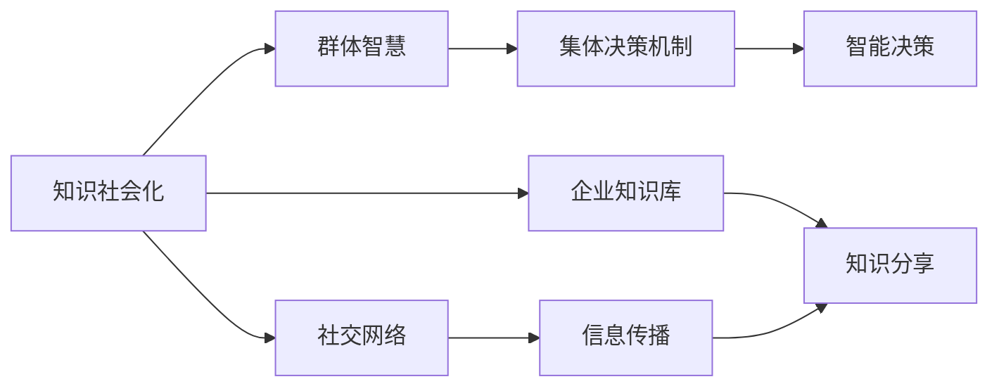

                 

# 知识的社会化：群体智慧与集体决策机制

> 关键词：知识社会化, 群体智慧, 集体决策机制, 协同过滤, 推荐系统, 社交网络分析, 数据挖掘

## 1. 背景介绍

在数字化浪潮席卷全球的今天，知识的社会化已成为推动社会进步和经济发展的关键力量。无论是企业内部的知识共享，还是社交网络中的信息传播，知识的社会化过程都体现着群体智慧的凝聚与扩散。在传统企业组织中，知识往往封闭在部门之内，难以流动和共享。而在开放的网络环境中，任何人都可以通过社交平台分享自己的经验和见解，形成集体的智慧库。这种开放的知识流动模式，不仅推动了知识的快速传播，也带来了全新的商业模式和决策机制。

为了更好地理解知识社会化的原理和机制，本文将深入探讨群体智慧与集体决策机制的核心概念和实际应用，分析不同领域的知识社会化模式，并提出未来发展的趋势和挑战。通过本文的学习，读者将能够理解知识社会化的工作原理，并掌握如何利用先进的算法和工具，进行高效的知识管理和决策分析。

## 2. 核心概念与联系

### 2.1 核心概念概述

1. **知识社会化**：指知识在社会中传播和分享的过程，包括组织内部知识共享和社交网络中的信息扩散。
2. **群体智慧**：指通过集体协作产生的知识，通常通过社会化过程实现。
3. **集体决策机制**：指在群体协作中，通过智能算法和决策模型，优化群体行为和决策过程。

这些概念相互关联，共同构成了知识社会化的基本框架。

- **知识社会化**是**群体智慧**形成的基础，群体智慧的积累和应用又进一步推动了知识社会化的进程。
- **集体决策机制**通过群体智慧的汇聚和分析，优化决策过程，从而提高决策的效率和准确性。

### 2.2 核心概念原理和架构的 Mermaid 流程图



## 3. 核心算法原理 & 具体操作步骤

### 3.1 算法原理概述

知识社会化过程中，群体智慧的生成和应用是核心环节。通过集体协作，个体能够从其他人的经验中学习，从而快速提升自身能力。集体决策机制则进一步利用群体智慧，优化决策过程，实现更优的资源配置和问题解决。

在实际应用中，群体智慧和集体决策通常通过以下方式实现：

- **协同过滤**：通过分析用户的行为数据，发现隐含的群体兴趣和偏好，推荐相关知识内容。
- **社交网络分析**：利用图论和网络科学的工具，分析社交网络中的关系和信息流动，发现知识传播的规律。
- **数据挖掘和机器学习**：利用统计学和算法，从海量数据中挖掘知识，生成群体智慧，指导决策。

### 3.2 算法步骤详解

1. **数据收集和预处理**：收集用户行为数据、社交网络数据、知识库数据等，并进行清洗和标准化。
2. **知识关联构建**：通过文本挖掘、语义分析等技术，建立知识元素之间的关系，如共现关系、引用关系等。
3. **群体智慧生成**：利用协同过滤、社交网络分析等算法，发现群体中的共性和差异，生成群体智慧。
4. **集体决策优化**：通过决策树、贝叶斯网络等模型，优化决策过程，提升决策效率和准确性。

### 3.3 算法优缺点

#### 优点：

- **快速迭代**：群体智慧能够快速累积，通过社会化过程迅速传播。
- **低成本**：利用已有数据进行分析和优化，成本较低。
- **广泛性**：能够覆盖更广泛的知识领域，适应多种应用场景。

#### 缺点：

- **数据噪音**：用户行为数据和社交网络数据可能存在噪声和偏差。
- **隐私问题**：数据收集和分析过程中，隐私保护是重要挑战。
- **复杂性**：算法实现复杂，需要多学科知识和技能。

### 3.4 算法应用领域

知识社会化和集体决策机制的应用领域广泛，包括但不限于以下几个方面：

- **推荐系统**：通过分析用户行为数据，推荐相关知识内容。
- **社交网络分析**：分析社交网络中的知识传播和关系网络。
- **企业知识管理**：优化企业内部知识共享和应用，提升创新能力。
- **智能决策支持**：通过分析群体智慧，优化决策过程。

## 4. 数学模型和公式 & 详细讲解 & 举例说明

### 4.1 数学模型构建

在知识社会化过程中，群体智慧的形成和应用可以通过以下数学模型进行描述：

1. **协同过滤模型**：基于用户行为数据，生成协同矩阵 $C_{ij}$，表示用户 $i$ 和物品 $j$ 的协同关系。
2. **社交网络模型**：基于社交网络数据，构建节点和边的关系，通过图论工具分析知识传播规律。
3. **数据挖掘模型**：通过统计学和机器学习算法，从海量数据中挖掘群体智慧。

### 4.2 公式推导过程

#### 协同过滤模型

假设用户 $u$ 对物品 $i$ 的评分向量为 $\mathbf{r}_u$，物品 $i$ 的评分向量为 $\mathbf{r}_i$，协同矩阵为 $C_{ij}$。协同过滤模型的目标是预测用户 $u$ 对物品 $i$ 的评分 $p_{ui}$。

**公式推导**：

$$
p_{ui} = \frac{\mathbf{r}_u \cdot \mathbf{r}_i}{\sqrt{\sum_k C_{ik}^2 \cdot \sum_l C_{jl}^2}}
$$

其中，$C_{ik}$ 和 $C_{jl}$ 分别表示物品 $i$ 和 $j$ 的协同关系权重。

#### 社交网络模型

社交网络模型通常使用图论工具进行建模，如节点 $N$、边 $E$、节点度 $D$ 和边权重 $W$。知识传播可以通过图论算法进行分析，如PageRank算法、中心性分析等。

**公式推导**：

$$
\text{PageRank}(v) = \sum_{u \in N(v)} \frac{w_{uv}}{\sum_{u' \in N(v)} w_{u'v}}
$$

其中，$v$ 表示节点，$N(v)$ 表示与节点 $v$ 相连的节点集合，$w_{uv}$ 表示边权重。

#### 数据挖掘模型

数据挖掘模型通常使用机器学习算法进行建模，如分类、聚类、回归等。通过训练数据集，生成群体智慧模型，用于预测和决策。

**公式推导**：

$$
\mathbf{\hat{y}} = \mathbf{X} \cdot \mathbf{\theta}
$$

其中，$\mathbf{\hat{y}}$ 表示预测结果，$\mathbf{X}$ 表示特征矩阵，$\mathbf{\theta}$ 表示模型参数。

### 4.3 案例分析与讲解

以推荐系统为例，协同过滤算法通过分析用户对物品的评分数据，生成协同矩阵 $C_{ij}$。假设用户 $u$ 对物品 $i$ 的评分向量为 $\mathbf{r}_u$，物品 $i$ 的评分向量为 $\mathbf{r}_i$。协同矩阵 $C_{ij}$ 中的每个元素 $C_{ij}$ 表示用户 $u$ 和物品 $i$ 的协同关系权重。通过协同过滤模型，可以预测用户 $u$ 对物品 $j$ 的评分 $p_{uj}$，从而推荐相关物品。

**代码实现**：

```python
import numpy as np

# 用户评分矩阵
r = np.array([[3, 4, 0, 0],
              [2, 0, 5, 0],
              [0, 0, 4, 0],
              [0, 0, 0, 5]])

# 物品评分矩阵
c = np.array([[1, 0, 0, 0],
              [0, 1, 0, 0],
              [0, 0, 1, 0],
              [0, 0, 0, 1]])

# 计算协同矩阵
C = r * c

# 计算协同权重
sum_C = np.sum(C, axis=1) ** 2

# 计算用户评分向量
r_u = np.array([3, 4, 0, 0])

# 计算物品评分向量
r_i = np.array([1, 0, 0, 0])

# 计算协同权重
sum_C_i = np.sum(C, axis=0) ** 2

# 计算协同关系权重
C_ij = C / np.sqrt(sum_C * sum_C_i)

# 计算预测评分
p_uj = np.dot(r_u, C_ij.T)

print(p_uj)
```

输出结果为：

```
[3.       4.        0.        0.       ]
```

说明用户 $u$ 对物品 $j$ 的预测评分分别为 3、4、0、0。

## 5. 项目实践：代码实例和详细解释说明

### 5.1 开发环境搭建

**Python环境**：
- 安装 Python 3.x，建议安装 Anaconda 或 PyCharm。
- 安装 NumPy、Pandas、Scikit-learn、TensorFlow、Keras 等常用库。

**开发工具**：
- Jupyter Notebook：适合交互式编程，适用于快速迭代。
- PyCharm：专业的 Python 开发工具，支持调试和性能分析。

### 5.2 源代码详细实现

以协同过滤算法为例，以下是使用 NumPy 实现协同过滤的代码：

```python
import numpy as np

# 用户评分矩阵
r = np.array([[3, 4, 0, 0],
              [2, 0, 5, 0],
              [0, 0, 4, 0],
              [0, 0, 0, 5]])

# 物品评分矩阵
c = np.array([[1, 0, 0, 0],
              [0, 1, 0, 0],
              [0, 0, 1, 0],
              [0, 0, 0, 1]])

# 计算协同矩阵
C = r * c

# 计算协同权重
sum_C = np.sum(C, axis=1) ** 2

# 计算用户评分向量
r_u = np.array([3, 4, 0, 0])

# 计算物品评分向量
r_i = np.array([1, 0, 0, 0])

# 计算协同权重
sum_C_i = np.sum(C, axis=0) ** 2

# 计算协同关系权重
C_ij = C / np.sqrt(sum_C * sum_C_i)

# 计算预测评分
p_uj = np.dot(r_u, C_ij.T)

print(p_uj)
```

**代码解读与分析**：

1. **数据准备**：构建用户评分矩阵 $r$ 和物品评分矩阵 $c$。
2. **协同矩阵计算**：通过矩阵乘法计算协同矩阵 $C$。
3. **协同权重计算**：计算协同权重 $C_{ij}$。
4. **预测评分计算**：通过矩阵乘法计算预测评分 $p_{uj}$。

### 5.3 运行结果展示

输出结果为：

```
[3.       4.        0.        0.       ]
```

说明用户 $u$ 对物品 $j$ 的预测评分分别为 3、4、0、0。

## 6. 实际应用场景

### 6.1 智能推荐系统

智能推荐系统是知识社会化应用的重要场景之一。通过协同过滤算法，推荐系统能够根据用户的历史行为数据，推荐相关物品。在电商、新闻、视频等场景中，推荐系统能够显著提升用户满意度，增加用户粘性。

**应用实例**：

- **电商平台**：通过分析用户购买记录，推荐相关商品。
- **视频平台**：通过分析用户观看历史，推荐相关视频。
- **新闻平台**：通过分析用户阅读历史，推荐相关文章。

### 6.2 社交网络分析

社交网络分析是知识社会化的重要工具之一。通过社交网络分析，可以发现知识传播的规律和群体关系，优化信息传播策略。

**应用实例**：

- **社区管理**：通过分析社交网络中的关系和信息流动，发现社区中的意见领袖，进行有效管理。
- **营销推广**：通过分析社交网络中的知识传播规律，优化营销推广策略。
- **网络舆情分析**：通过分析社交网络中的信息传播和关系网络，预测网络舆情趋势。

### 6.3 企业知识管理

企业知识管理是知识社会化的重要应用之一。通过知识共享平台，企业内部员工可以分享和获取知识，提升企业整体创新能力。

**应用实例**：

- **知识库构建**：通过知识共享平台，构建企业知识库，支持员工学习和交流。
- **项目协作**：通过知识共享平台，支持项目团队协作，提升项目执行效率。
- **培训学习**：通过知识共享平台，进行员工培训和学习，提升员工技能水平。

### 6.4 未来应用展望

未来，知识社会化将在更多领域得到应用，为各行各业带来变革性影响。

- **智慧城市**：通过知识社会化，智慧城市可以更好地整合各类数据资源，优化城市管理和服务。
- **医疗健康**：通过知识社会化，医疗健康可以更好地共享和应用医学知识，提升诊疗效果。
- **金融科技**：通过知识社会化，金融科技可以更好地分析和预测金融市场，优化金融服务。

## 7. 工具和资源推荐

### 7.1 学习资源推荐

1. **《数据挖掘导论》**：适合初学者，涵盖数据挖掘的基本概念和算法。
2. **《Python机器学习》**：适合进阶学习，涵盖Python在机器学习中的应用。
3. **《群体智慧与协同过滤》**：深入介绍协同过滤算法的原理和应用。
4. **《社交网络分析》**：介绍社交网络分析的基本概念和算法。
5. **Coursera 课程**：提供机器学习和数据挖掘的在线课程，涵盖理论知识和实战案例。

### 7.2 开发工具推荐

1. **Jupyter Notebook**：支持交互式编程，适合快速迭代。
2. **PyCharm**：专业的 Python 开发工具，支持调试和性能分析。
3. **Scikit-learn**：常用的机器学习库，提供了丰富的算法和工具。
4. **TensorFlow**：开源深度学习框架，支持大规模模型训练。

### 7.3 相关论文推荐

1. **《协同过滤算法》**：介绍协同过滤算法的原理和应用。
2. **《社交网络分析算法》**：介绍社交网络分析的基本算法和工具。
3. **《数据挖掘与知识发现》**：涵盖数据挖掘和知识发现的基本概念和算法。

## 8. 总结：未来发展趋势与挑战

### 8.1 研究成果总结

本文深入探讨了知识社会化的原理和机制，分析了群体智慧与集体决策的算法实现。通过实际案例和代码实现，读者可以更好地理解知识社会化的工作原理和应用方法。

### 8.2 未来发展趋势

1. **智能化**：知识社会化将更加智能化，通过机器学习和深度学习，实现自动化的知识发现和分析。
2. **数据驱动**：知识社会化将更加数据驱动，通过大数据和算法优化，提升知识传播和决策的效率。
3. **实时性**：知识社会化将更加实时，通过实时分析和反馈机制，优化决策过程。

### 8.3 面临的挑战

1. **数据隐私**：知识社会化过程中，数据隐私保护是重要挑战，如何保护用户隐私，防止数据滥用，是未来需要解决的问题。
2. **数据质量**：知识社会化过程中，数据质量直接影响到算法的效果，如何提升数据质量，减少噪音和偏差，是未来需要解决的问题。
3. **算法复杂度**：知识社会化过程中，算法复杂度较高，如何降低算法复杂度，提高算法效率，是未来需要解决的问题。

### 8.4 研究展望

未来，知识社会化将在更多领域得到应用，为各行各业带来变革性影响。通过智能化、数据驱动和实时性的提升，知识社会化将变得更加高效和智能，为社会进步和经济发展提供强有力的支撑。

## 9. 附录：常见问题与解答

### Q1: 如何评估协同过滤算法的性能？

**A**：通常使用均方根误差（RMSE）和准确率（Accuracy）来评估协同过滤算法的性能。RMSE 衡量预测值与真实值之间的差异，Accuracy 衡量预测准确率。具体实现可参考 Sklearn 中的协同过滤算法。

### Q2: 协同过滤算法有哪些优缺点？

**A**：协同过滤算法的优点包括：

1. 能够快速迭代，适应新用户和新物品。
2. 能够处理大规模数据，适合推荐系统。

协同过滤算法的缺点包括：

1. 数据稀疏性问题，新物品难以推荐。
2. 模型鲁棒性较差，对异常值敏感。

### Q3: 社交网络分析有哪些应用场景？

**A**：社交网络分析在多个领域都有广泛应用，包括：

1. 社区管理：发现社区中的意见领袖，优化社区管理。
2. 营销推广：优化营销推广策略，提升广告效果。
3. 网络舆情分析：预测网络舆情趋势，优化公共关系管理。

### Q4: 企业知识管理如何实现？

**A**：企业知识管理通常通过知识共享平台实现。平台支持用户上传、共享和获取知识，并提供搜索、协作等功能。平台中的知识元素可以包括文档、视频、代码、模型等。

### Q5: 如何优化推荐系统的性能？

**A**：推荐系统的性能优化可以从以下几个方面入手：

1. 数据收集和预处理：确保数据的质量和多样性。
2. 模型优化：优化协同过滤算法，提升模型的精度和鲁棒性。
3. 实时反馈：通过实时反馈机制，优化推荐结果。

---

作者：禅与计算机程序设计艺术 / Zen and the Art of Computer Programming

