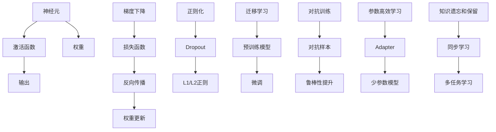

                 

# 知识的神经可塑性：大脑如何适应新信息

## 1. 背景介绍

### 1.1 问题由来

人类大脑具有强大的适应性，能够在不同的环境和经验下快速调整自身结构和功能，以应对新的信息挑战。这种能力被称为“神经可塑性”（Neural Plasticity）。神经可塑性包括突触可塑性、细胞可塑性和系统可塑性，它们分别对应神经元之间连接强度、神经元结构和大脑功能网络的可变性。

神经可塑性是神经科学的核心主题之一，它解释了人类如何学习、记忆、适应和适应变化。然而，随着人工智能（AI）和神经网络的兴起，神经可塑性这一概念也引起了AI研究人员的兴趣，因为AI模型的神经网络同样具有高度可塑性。这使得AI模型能够通过训练适应新的数据分布和任务。

### 1.2 问题核心关键点

理解神经可塑性在AI和神经网络中的作用，有助于优化和改进AI模型。以下是几个关键点：

1. **可塑性机制**：神经网络如何通过梯度下降和反向传播等机制调整权重和激活函数，以适应新的输入数据和任务。
2. **模型适应性**：神经网络如何在新任务上表现得更好，如何从少量数据中学习，以及如何保持老任务的性能。
3. **参数高效学习**：如何在固定大部分权重的情况下，仅更新少部分参数以提高学习效率。
4. **模型泛化能力**：神经网络如何通过迁移学习、正则化和对抗训练等技术提高泛化能力。
5. **知识保留和遗忘**：如何避免模型在新的学习任务中遗忘老的知识。

这些关键点构成了理解神经网络可塑性和优化神经网络性能的基础。

### 1.3 问题研究意义

研究神经网络的可塑性对于改进AI模型、提高性能和加速应用开发具有重要意义：

1. **提高模型性能**：通过理解神经网络的可塑性机制，可以优化模型结构、训练策略和学习率，从而提高模型的性能和效率。
2. **加速模型开发**：通过参数高效学习等技术，可以大大减少训练时间和计算资源，加快模型开发和部署的速度。
3. **增强泛化能力**：通过迁移学习和正则化等技术，可以提高模型在不同数据集和任务上的泛化能力，避免过拟合。
4. **保证知识保留**：通过适当的知识更新和遗忘控制，可以确保模型在不同任务之间保持稳定的性能。
5. **增强模型的鲁棒性**：通过对抗训练等技术，可以提高模型对输入数据的鲁棒性和适应性，增强模型的安全性。

## 2. 核心概念与联系

### 2.1 核心概念概述

为了深入理解神经可塑性，我们首先介绍一些核心概念：

- **神经元（Neuron）**：神经网络的基本单位，通过激活函数处理输入，产生输出信号。
- **权重（Weight）**：连接两个神经元之间的参数，表示信号传递的强度。
- **激活函数（Activation Function）**：非线性函数，对神经元的输出进行非线性映射。
- **梯度下降（Gradient Descent）**：优化算法，通过反向传播计算梯度，最小化损失函数，调整权重。
- **正则化（Regularization）**：避免过拟合的技术，包括L1、L2正则、Dropout等。
- **迁移学习（Transfer Learning）**：将预训练模型用于新任务，提高学习效率。
- **对抗训练（Adversarial Training）**：通过对抗样本训练模型，提高鲁棒性。
- **参数高效学习（Parameter-Efficient Learning）**：仅更新少部分参数，减少计算资源消耗。
- **知识遗忘和保留（Knowledge Forgetting and Retention）**：如何在新学习任务中保留旧知识，避免过度的遗忘。

这些概念相互关联，共同构成了神经网络可塑性的基础。

### 2.2 核心概念原理和架构的 Mermaid 流程图



这个图展示了神经网络中的基本组件和可塑性机制。从神经元输入、激活函数输出，到权重调整、梯度下降、正则化，再到迁移学习、对抗训练、参数高效学习和知识遗忘和保留，每个环节都至关重要。

## 3. 核心算法原理 & 具体操作步骤

### 3.1 算法原理概述

神经网络的可塑性基于梯度下降和反向传播机制。在训练过程中，神经网络通过计算损失函数的梯度，反向传播回传到网络中，调整权重和激活函数，以最小化损失函数。这种调整机制使得神经网络能够适应新的输入数据和任务，提高模型性能。

### 3.2 算法步骤详解

基于梯度下降和反向传播的神经网络训练步骤包括以下几个关键环节：

1. **数据准备**：收集和预处理训练数据，划分训练集、验证集和测试集。
2. **模型初始化**：随机初始化神经网络的权重和激活函数。
3. **前向传播**：将输入数据传递到神经网络中，计算每个神经元的输出。
4. **损失计算**：计算模型输出与真实标签之间的误差，形成损失函数。
5. **反向传播**：计算损失函数对每个权重和激活函数的梯度，反向传播回传到网络中。
6. **权重更新**：根据梯度下降算法，更新权重和激活函数。
7. **验证和测试**：在验证集和测试集上评估模型性能，调整超参数和模型结构。

### 3.3 算法优缺点

神经网络的可塑性具有以下优点：

- **泛化能力强**：通过反向传播和梯度下降机制，神经网络能够适应新数据和新任务，提高泛化能力。
- **参数高效**：通过参数高效学习等技术，可以在固定大部分权重的情况下，仅更新少部分参数，减少计算资源消耗。
- **迁移学习**：通过预训练模型和新任务的微调，可以显著提高模型的学习效率和性能。

但同时也存在一些缺点：

- **过拟合风险**：特别是在数据量较小的情况下，神经网络容易过拟合，泛化性能下降。
- **计算资源消耗大**：神经网络需要大量的计算资源进行训练和推理，特别是在大规模数据集上。
- **可解释性差**：神经网络的结构复杂，难以解释其内部工作机制和决策逻辑。

### 3.4 算法应用领域

神经网络的可塑性在多个领域得到了广泛应用，包括但不限于：

- **计算机视觉**：如图像分类、物体检测、图像分割等任务。
- **自然语言处理**：如文本分类、机器翻译、情感分析等任务。
- **语音识别**：如自动语音识别、说话人识别等任务。
- **推荐系统**：如商品推荐、用户兴趣分析等任务。
- **游戏AI**：如决策树、强化学习等任务。
- **医疗诊断**：如医学图像分析、病历分析等任务。
- **金融预测**：如市场分析、风险评估等任务。

## 4. 数学模型和公式 & 详细讲解 & 举例说明

### 4.1 数学模型构建

神经网络的数学模型可以表示为：

$$
\hat{y} = \sigma(\sum_{i=1}^n w_i x_i + b)
$$

其中，$\sigma$为激活函数，$w_i$为权重，$x_i$为输入，$b$为偏置项。神经网络的结构可以表示为多层的堆叠，每层有多个神经元，前一层的输出作为下一层的输入。

### 4.2 公式推导过程

神经网络的训练过程可以通过反向传播算法进行优化。反向传播的公式推导如下：

1. **前向传播**：

$$
z = \sum_{i=1}^n w_i x_i + b
$$

$$
a = \sigma(z)
$$

2. **计算损失函数**：

$$
L = \frac{1}{m} \sum_{i=1}^m \ell(y_i, \hat{y})
$$

3. **反向传播**：

$$
\frac{\partial L}{\partial w_i} = \frac{1}{m} \sum_{i=1}^m \frac{\partial \ell(y_i, \hat{y})}{\partial a} \cdot \frac{\partial a}{\partial z} \cdot \frac{\partial z}{\partial w_i}
$$

4. **权重更新**：

$$
w_i = w_i - \eta \frac{\partial L}{\partial w_i}
$$

其中，$\eta$为学习率，$\ell$为损失函数，$m$为样本数，$\frac{\partial \ell(y_i, \hat{y})}{\partial a}$为损失函数对激活函数的梯度，$\frac{\partial a}{\partial z}$为激活函数对输入的梯度，$\frac{\partial z}{\partial w_i}$为输入对权重的梯度。

### 4.3 案例分析与讲解

以图像分类任务为例，使用深度卷积神经网络（CNN）进行图像分类。CNN的结构如下：

```
输入层 --> 卷积层 --> 激活层 --> 池化层 --> 全连接层 --> 输出层
```

其中，卷积层和池化层用于提取图像特征，全连接层用于分类。训练过程如下：

1. **数据准备**：收集和预处理图像数据，划分为训练集、验证集和测试集。
2. **模型初始化**：随机初始化卷积层、全连接层和输出层的权重和偏置。
3. **前向传播**：将输入图像传递到卷积层和全连接层，计算输出。
4. **损失计算**：计算模型输出与真实标签之间的误差，形成损失函数。
5. **反向传播**：计算损失函数对每个权重和偏置的梯度，反向传播回传到网络中。
6. **权重更新**：根据梯度下降算法，更新权重和偏置。
7. **验证和测试**：在验证集和测试集上评估模型性能，调整超参数和模型结构。

## 5. 项目实践：代码实例和详细解释说明

### 5.1 开发环境搭建

要实现神经网络的训练和推理，需要搭建一个开发环境。以下是使用Python和TensorFlow进行深度学习开发的环境配置流程：

1. 安装Anaconda：从官网下载并安装Anaconda，用于创建独立的Python环境。
2. 创建并激活虚拟环境：
```bash
conda create -n tf-env python=3.8 
conda activate tf-env
```

3. 安装TensorFlow：根据CUDA版本，从官网获取对应的安装命令。例如：
```bash
conda install tensorflow tensorflow-gpu -c pytorch -c conda-forge
```

4. 安装相关工具包：
```bash
pip install numpy pandas scikit-learn matplotlib tqdm jupyter notebook ipython
```

完成上述步骤后，即可在`tf-env`环境中开始深度学习开发。

### 5.2 源代码详细实现

下面我们以图像分类任务为例，给出使用TensorFlow实现卷积神经网络的代码实现。

首先，定义图像分类任务的数据处理函数：

```python
import tensorflow as tf
from tensorflow.keras.datasets import mnist

def load_data():
    (x_train, y_train), (x_test, y_test) = mnist.load_data()
    x_train, x_test = x_train / 255.0, x_test / 255.0
    x_train = x_train.reshape(-1, 28, 28, 1)
    x_test = x_test.reshape(-1, 28, 28, 1)
    y_train = tf.keras.utils.to_categorical(y_train)
    y_test = tf.keras.utils.to_categorical(y_test)
    return x_train, y_train, x_test, y_test

x_train, y_train, x_test, y_test = load_data()
```

然后，定义卷积神经网络的模型：

```python
from tensorflow.keras import layers

model = tf.keras.Sequential([
    layers.Conv2D(32, (3, 3), activation='relu', input_shape=(28, 28, 1)),
    layers.MaxPooling2D((2, 2)),
    layers.Conv2D(64, (3, 3), activation='relu'),
    layers.MaxPooling2D((2, 2)),
    layers.Flatten(),
    layers.Dense(64, activation='relu'),
    layers.Dense(10, activation='softmax')
])
```

接着，定义训练和评估函数：

```python
batch_size = 128
epochs = 10

model.compile(optimizer='adam', loss='categorical_crossentropy', metrics=['accuracy'])

def train(model, x_train, y_train, x_test, y_test, batch_size, epochs):
    model.fit(x_train, y_train, batch_size=batch_size, epochs=epochs, validation_data=(x_test, y_test))
    test_loss, test_acc = model.evaluate(x_test, y_test)
    print(f'Test accuracy: {test_acc:.2f}')
    return test_acc

test_acc = train(model, x_train, y_train, x_test, y_test, batch_size, epochs)
```

最后，启动训练流程并在测试集上评估：

```python
model.summary()
test_acc = train(model, x_train, y_train, x_test, y_test, batch_size, epochs)
```

以上就是使用TensorFlow实现卷积神经网络进行图像分类的完整代码实现。可以看到，TensorFlow提供了丰富的API，使得深度学习模型的开发和训练变得简洁高效。

### 5.3 代码解读与分析

让我们再详细解读一下关键代码的实现细节：

**load_data函数**：
- 从MNIST数据集中加载训练和测试数据集。
- 对数据进行归一化和重塑，使其符合模型的输入要求。
- 将标签进行独热编码，转换为模型可接受的格式。

**定义模型**：
- 使用Sequential模型定义多层卷积神经网络，包含卷积层、池化层、全连接层和输出层。
- 使用ReLU和Softmax激活函数，分别用于增强非线性能力和多分类输出。

**train函数**：
- 使用Adam优化器和交叉熵损失函数进行模型训练。
- 在每个epoch结束后，评估模型在验证集上的性能，输出测试集上的准确率。
- 使用evaluation函数进行模型评估，输出测试集上的准确率。

通过这些函数和API，可以轻松实现一个简单的卷积神经网络模型，并在MNIST数据集上进行训练和评估。TensorFlow提供了丰富的工具和资源，使得深度学习的开发和研究更加便捷高效。

## 6. 实际应用场景

### 6.1 计算机视觉

神经网络的可塑性在计算机视觉领域得到了广泛应用。例如，通过反向传播算法，神经网络可以学习到图像中的特征和模式，用于图像分类、目标检测、图像分割等任务。

在实际应用中，神经网络通常需要处理大规模的图像数据，进行特征提取和分类。例如，在医疗影像分析中，神经网络可以从X光片、CT图像中提取特征，用于诊断肿瘤、骨折等疾病。

### 6.2 自然语言处理

神经网络的可塑性在自然语言处理领域同样具有重要应用。例如，通过反向传播算法，神经网络可以学习到语言中的语义和语法规则，用于文本分类、机器翻译、情感分析等任务。

在实际应用中，神经网络通常需要处理大规模的文本数据，进行语义理解和生成。例如，在情感分析中，神经网络可以从电影评论、社交媒体评论中提取情感信息，用于评估电影和社交媒体的情感倾向。

### 6.3 语音识别

神经网络的可塑性在语音识别领域也得到了广泛应用。例如，通过反向传播算法，神经网络可以学习到语音中的特征和模式，用于自动语音识别、说话人识别等任务。

在实际应用中，神经网络通常需要处理大规模的语音数据，进行特征提取和分类。例如，在智能语音助手中，神经网络可以从用户的语音指令中提取意图，用于执行各种任务。

### 6.4 未来应用展望

随着神经网络技术的不断发展，未来的应用场景将更加广泛和深入。以下是几个未来的应用展望：

1. **自动驾驶**：神经网络可以通过反向传播算法学习到图像和视频中的特征，用于自动驾驶中的目标检测、车道保持、交通信号识别等任务。
2. **智能家居**：神经网络可以通过反向传播算法学习到环境中的声音和动作，用于智能家居中的语音控制、环境感知等任务。
3. **机器人控制**：神经网络可以通过反向传播算法学习到环境中的特征，用于机器人控制中的路径规划、物体识别等任务。
4. **个性化推荐**：神经网络可以通过反向传播算法学习到用户的兴趣和行为，用于个性化推荐中的商品推荐、内容推荐等任务。
5. **金融预测**：神经网络可以通过反向传播算法学习到市场数据中的特征，用于金融预测中的股票预测、风险评估等任务。

## 7. 工具和资源推荐

### 7.1 学习资源推荐

为了帮助开发者系统掌握神经网络的可塑性，这里推荐一些优质的学习资源：

1. **《深度学习》（Ian Goodfellow著）**：该书是深度学习领域的经典教材，详细介绍了神经网络的基本原理和算法。
2. **CS231n《深度学习计算机视觉》课程**：斯坦福大学开设的计算机视觉课程，涵盖了深度学习在计算机视觉中的应用。
3. **CS224n《深度学习自然语言处理》课程**：斯坦福大学开设的自然语言处理课程，介绍了深度学习在自然语言处理中的应用。
4. **CS280A《深度学习与自然语言处理》课程**：斯坦福大学开设的深度学习与自然语言处理课程，涵盖了许多前沿技术。
5. **《Python深度学习》（François Chollet著）**：该书详细介绍了TensorFlow和Keras的使用方法和深度学习算法。
6. **《TensorFlow深度学习实战》（Manning Publications著）**：该书介绍了TensorFlow在深度学习中的应用，包括图像分类、自然语言处理、语音识别等任务。

通过学习这些资源，相信你一定能够全面掌握神经网络的可塑性，并用于解决实际的深度学习问题。

### 7.2 开发工具推荐

高效的深度学习开发离不开优秀的工具支持。以下是几款用于深度学习开发的常用工具：

1. **TensorFlow**：由Google主导开发的开源深度学习框架，生产部署方便，适合大规模工程应用。
2. **PyTorch**：由Facebook主导开发的开源深度学习框架，灵活性高，适合快速迭代研究。
3. **Keras**：高层次的深度学习API，提供了简单易用的接口，适合初学者入门。
4. **MXNet**：由Apache主导的深度学习框架，支持多种语言和分布式训练。
5. **Caffe**：由伯克利大学开发的深度学习框架，性能高效，适合图像处理任务。
6. **Theano**：由蒙特利尔大学开发的深度学习框架，支持GPU加速和自动微分。

合理利用这些工具，可以显著提升深度学习的开发效率，加快创新迭代的步伐。

### 7.3 相关论文推荐

深度学习领域的研究不断发展，以下是几篇奠基性的相关论文，推荐阅读：

1. **AlexNet: One Million Training Examples for Deep Network**：Hinton等人提出的卷积神经网络架构，开创了深度学习在计算机视觉中的应用。
2. **ImageNet Classification with Deep Convolutional Neural Networks**：Krizhevsky等人提出的卷积神经网络架构，在ImageNet数据集上取得了SOTA性能。
3. **Sequence to Sequence Learning with Neural Networks**：Cho等人提出的神经网络架构，用于机器翻译和语音识别等任务。
4. **Attention Is All You Need**：Vaswani等人提出的Transformer架构，开创了深度学习在自然语言处理中的应用。
5. **BERT: Pre-training of Deep Bidirectional Transformers for Language Understanding**：Devlin等人提出的预训练语言模型，提高了自然语言处理任务的性能。

这些论文代表了大深度学习的研究进展，通过学习这些前沿成果，可以帮助研究者把握学科前进方向，激发更多的创新灵感。

## 8. 总结：未来发展趋势与挑战

### 8.1 研究成果总结

本文对神经网络的可塑性进行了全面系统的介绍。首先阐述了神经网络的基本原理和核心概念，明确了神经网络的可塑性机制和应用场景。其次，从原理到实践，详细讲解了神经网络的训练过程和优化算法，给出了神经网络实现的完整代码实例。同时，本文还广泛探讨了神经网络在计算机视觉、自然语言处理、语音识别等多个领域的应用前景，展示了神经网络技术的广泛应用。

通过本文的系统梳理，可以看到，神经网络的可塑性在深度学习中扮演了重要角色，使得深度学习模型能够适应新数据和新任务，提高模型性能和效率。未来，随着神经网络技术的不断发展，其应用场景将更加广泛和深入。

### 8.2 未来发展趋势

展望未来，神经网络的可塑性将继续引领深度学习技术的发展，主要趋势包括：

1. **神经网络架构的创新**：未来的神经网络将更加复杂和多样，如 Capsule Network、Self-Attention Network 等新架构将进一步拓展神经网络的表达能力。
2. **优化算法的改进**：优化算法如AdamW、Adafactor等将进一步提升神经网络的训练效率和泛化性能。
3. **迁移学习的增强**：迁移学习将更加灵活和高效，通过预训练和多任务学习，提升神经网络的适应性和泛化能力。
4. **对抗训练的普及**：对抗训练将更加普及，通过对抗样本训练神经网络，提升模型的鲁棒性和安全性。
5. **参数高效学习的发展**：参数高效学习将更加普及，通过Adapter、Prefix等技术，提高神经网络的参数效率。
6. **知识遗忘和保留的改进**：通过同步学习和多任务学习，提高神经网络的知识保留和遗忘控制能力。
7. **跨模态学习的突破**：通过将视觉、语音等多模态数据与神经网络结合，提高神经网络的综合理解能力。

这些趋势将进一步提升神经网络的性能和效率，推动深度学习技术的不断进步。

### 8.3 面临的挑战

尽管神经网络的可塑性技术已经取得了显著进展，但在迈向更加智能化、普适化应用的过程中，仍面临以下挑战：

1. **数据依赖性高**：神经网络的训练需要大量的标注数据，特别是在小样本和长尾任务中，标注数据难以获取。
2. **过拟合风险**：特别是在数据量较小的情况下，神经网络容易过拟合，泛化性能下降。
3. **计算资源消耗大**：神经网络的训练和推理需要大量的计算资源，特别是在大规模数据集上。
4. **可解释性差**：神经网络的结构复杂，难以解释其内部工作机制和决策逻辑。
5. **鲁棒性不足**：神经网络面对输入数据的微小扰动，容易产生预测波动，鲁棒性有待提高。
6. **知识遗忘和保留**：如何在新的学习任务中保留老的知识，避免过度的遗忘，仍是一个难题。

这些挑战需要通过更多的研究和技术创新来解决，以推动神经网络技术的进一步发展。

### 8.4 研究展望

未来，神经网络的可塑性研究需要在以下几个方面寻求新的突破：

1. **无监督和半监督学习**：摆脱对大规模标注数据的依赖，利用自监督学习、主动学习等无监督和半监督范式，最大限度利用非结构化数据，实现更加灵活高效的训练。
2. **迁移学习和跨领域学习**：通过预训练和多任务学习，提升神经网络的适应性和泛化能力，推动跨领域学习和领域适应研究。
3. **对抗训练和鲁棒性**：通过对抗样本训练和鲁棒性分析，提高神经网络的鲁棒性和安全性，减少预测波动和误差。
4. **参数高效学习和模型压缩**：通过 Adapter、Prefix等技术，提高神经网络的参数效率和计算效率，减少资源消耗。
5. **知识遗忘和保留**：通过同步学习和多任务学习，提高神经网络的知识保留和遗忘控制能力，避免老知识的丢失。
6. **跨模态学习和多模态融合**：通过将视觉、语音等多模态数据与神经网络结合，提高神经网络的综合理解能力，推动跨模态学习和多模态融合研究。

这些研究方向的探索，必将引领神经网络技术的不断进步，推动深度学习技术的全面发展。

## 9. 附录：常见问题与解答

**Q1：什么是神经网络的可塑性？**

A: 神经网络的可塑性是指神经网络通过反向传播算法调整权重和激活函数，以适应新的输入数据和任务的能力。这种能力使得神经网络能够学习到新的特征和模式，提高模型性能和泛化能力。

**Q2：神经网络的可塑性如何影响模型性能？**

A: 神经网络的可塑性使得模型能够适应新的输入数据和任务，提高模型的泛化能力和性能。通过反向传播算法，神经网络可以学习到输入数据的特征和模式，增强模型的表达能力。同时，通过优化算法和正则化技术，神经网络可以避免过拟合，提高模型的鲁棒性和泛化性能。

**Q3：如何在训练过程中避免过拟合？**

A: 避免过拟合可以通过以下方法：
1. 数据增强：通过回译、近义替换等方式扩充训练集。
2. 正则化：使用L2正则、Dropout、Early Stopping等避免过拟合。
3. 对抗训练：引入对抗样本，提高模型鲁棒性。
4. 参数高效学习：仅更新少量参数，减少计算资源消耗。
5. 迁移学习：通过预训练模型和新任务的微调，提高学习效率。

**Q4：神经网络的可塑性如何应用于实际问题？**

A: 神经网络的可塑性可以应用于各种实际问题，例如：
1. 计算机视觉：如图像分类、目标检测、图像分割等任务。
2. 自然语言处理：如文本分类、机器翻译、情感分析等任务。
3. 语音识别：如自动语音识别、说话人识别等任务。
4. 推荐系统：如商品推荐、内容推荐等任务。
5. 医疗诊断：如医学影像分析、病历分析等任务。

通过理解神经网络的可塑性机制，可以设计更加高效、灵活的模型结构，解决各种实际问题。

**Q5：神经网络的可塑性在未来的发展方向是什么？**

A: 神经网络的可塑性在未来的发展方向包括：
1. 神经网络架构的创新：如 Capsule Network、Self-Attention Network 等新架构将进一步拓展神经网络的表达能力。
2. 优化算法的改进：如 AdamW、Adafactor 等算法将进一步提升神经网络的训练效率和泛化性能。
3. 迁移学习和跨领域学习：通过预训练和多任务学习，提升神经网络的适应性和泛化能力。
4. 对抗训练和鲁棒性：通过对抗样本训练和鲁棒性分析，提高神经网络的鲁棒性和安全性。
5. 参数高效学习和模型压缩：如 Adapter、Prefix 等技术，提高神经网络的参数效率和计算效率。
6. 知识遗忘和保留：通过同步学习和多任务学习，提高神经网络的知识保留和遗忘控制能力。
7. 跨模态学习和多模态融合：将视觉、语音等多模态数据与神经网络结合，提高神经网络的综合理解能力。

这些研究方向的探索，将推动神经网络技术的不断进步，为深度学习的发展带来新的突破。

作者：禅与计算机程序设计艺术 / Zen and the Art of Computer Programming

