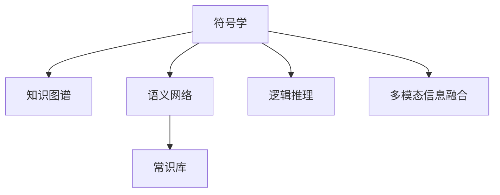

                 

# 知识的符号学：意义构建的过程

## 1. 背景介绍

### 1.1 问题由来
符号学（Semantics）是研究意义与语言、文字之间关系的学科，对理解和解释人类语言至关重要。在人工智能领域，符号学已经成为知识表示和推理的核心基础。当前，随着深度学习技术的蓬勃发展，如何让机器更好地理解和构建意义，成为了深度学习研究的热点问题。

### 1.2 问题核心关键点
当前，符号学在深度学习领域的应用主要集中在以下几方面：
1. **知识表示与推理**：构建符号化的知识图谱和语义网络，用于支持逻辑推理和常识推断。
2. **自然语言理解与生成**：利用符号学的原理，设计语言模型，使其具备更好的语义理解能力和生成能力。
3. **多模态信息融合**：将符号学与图像、视频、声音等非文本信息结合，实现跨模态信息的整合与推理。
4. **常识推理**：将符号学与常识库相结合，让机器具备基于常识进行推断的能力。
5. **形式化逻辑与数学推理**：在知识表示和推理中引入形式化逻辑和数学模型，增强推理的准确性和可解释性。

这些关键点共同构成了深度学习中符号学的应用框架，旨在提升机器对于语言的理解和处理能力，使其能够更好地服务于实际应用。

### 1.3 问题研究意义
符号学在深度学习中的应用，对人工智能技术的进一步发展具有重要意义：
1. **提高模型的可解释性**：符号学的引入，使深度学习模型具备更强的可解释性，便于理解和调试。
2. **增强模型的鲁棒性**：符号化的知识库可以作为模型的先验信息，提高模型在噪声和异常数据下的鲁棒性。
3. **促进知识传播与积累**：符号学为知识表示提供了标准化的方式，便于知识的传播和积累，加速人工智能技术的进步。
4. **推动知识自动化**：符号学与自动化结合，可以自动化地处理和生成知识，提高知识处理效率。
5. **提升人机交互体验**：符号学使机器更具备人类化的推理能力，提升人机交互的流畅性和自然性。

## 2. 核心概念与联系

### 2.1 核心概念概述

为了更好地理解符号学在深度学习中的应用，本节将介绍几个关键概念：

- **符号学**：研究意义与符号之间关系的学科，用于解释语言、文字等符号背后的含义。
- **知识图谱**：以图的形式表示实体与实体之间的关系，用于知识表示与推理。
- **语义网络**：用于表示词汇和词汇之间的关系，支持语言理解和生成。
- **常识库**：包含常识性知识的库，用于辅助机器进行基于常识的推理。
- **逻辑推理**：利用形式化逻辑对知识进行推理，支持精确的推理过程。
- **多模态信息融合**：将不同模态的信息结合，实现跨模态的语义理解。

这些概念之间的联系可以通过以下Mermaid流程图来展示：



这个流程图展示了符号学与其他核心概念的联系：

1. 符号学通过知识图谱和语义网络将知识表示为图形结构，支持逻辑推理和知识推理。
2. 符号学与常识库结合，使机器能够具备常识推理的能力。
3. 符号学与多模态信息融合技术结合，支持跨模态的语义理解。

## 3. 核心算法原理 & 具体操作步骤
### 3.1 算法原理概述

符号学在深度学习中的应用，本质上是将符号学知识与深度学习模型相结合，提升模型的语义理解能力和推理能力。其核心思想是：

- 构建符号化的知识图谱或语义网络，用于表示实体与实体之间的关系。
- 在深度学习模型的输入和输出层之间引入符号化的表示，使其具备更好的语义理解能力。
- 利用符号学知识进行逻辑推理，增强模型的精确性和可解释性。

### 3.2 算法步骤详解

符号学在深度学习中的应用主要包括以下几个关键步骤：

**Step 1: 构建符号化知识表示**
- 使用知识图谱或语义网络对实体和关系进行符号化表示。
- 定义符号化的实体类型和关系类型，构建符号化的知识图谱。

**Step 2: 设计符号化神经网络**
- 在深度学习模型的输入和输出层之间引入符号化的表示，如实体嵌入、关系向量等。
- 设计符号化神经网络的结构，支持符号化的推理和知识表示。

**Step 3: 训练符号化模型**
- 使用标注数据训练符号化神经网络，优化模型参数。
- 在训练过程中，利用符号化知识图谱进行推理和验证，提高模型的精度。

**Step 4: 符号化推理与决策**
- 在模型输出层，进行符号化的推理和决策，利用常识库和逻辑推理进行验证。
- 输出符号化的推理结果，支持形式化的逻辑推理和知识验证。

### 3.3 算法优缺点

符号学在深度学习中的应用具有以下优点：
1. **增强可解释性**：符号化的表示使深度学习模型具备更好的可解释性，便于理解和调试。
2. **提高精确性**：符号化的推理使模型具备更高的精确性和鲁棒性。
3. **支持跨模态推理**：符号学与多模态信息融合技术结合，支持跨模态的语义理解。
4. **促进知识传播**：符号化的知识表示有利于知识的传播和积累。

同时，符号学在深度学习中也有一些局限性：
1. **符号表示复杂**：符号化的知识表示通常较为复杂，增加了模型的训练难度。
2. **数据标注成本高**：符号化的知识表示需要大量标注数据进行训练，成本较高。
3. **模型复杂度高**：符号化的神经网络结构较为复杂，增加了模型的训练和推理时间。
4. **知识库维护困难**：常识库和知识图谱的维护和更新需要大量的人工工作。

尽管存在这些局限性，符号学在深度学习中的应用仍具有重要的价值和广泛的应用前景。

### 3.4 算法应用领域

符号学在深度学习中的应用已经渗透到了多个领域，例如：

- **自然语言处理（NLP）**：用于构建语义网络，支持自然语言理解与生成。
- **知识图谱构建**：用于表示实体与实体之间的关系，支持知识表示与推理。
- **计算机视觉（CV）**：用于跨模态信息融合，支持视觉信息的语义理解。
- **机器人控制**：用于符号化推理，支持机器人的决策和行为。
- **医疗诊断**：用于知识图谱构建和常识推理，支持医学知识的整合和应用。
- **金融分析**：用于构建符号化的知识图谱，支持金融知识的推理和决策。
- **智能客服**：用于符号化推理，支持智能客服系统的问答与决策。

## 4. 数学模型和公式 & 详细讲解  
### 4.1 数学模型构建

本节将使用数学语言对符号学在深度学习中的应用进行更加严格的刻画。

记实体集合为 $\mathcal{E}$，关系集合为 $\mathcal{R}$，符号化的知识图谱为 $\mathcal{G}=(\mathcal{E},\mathcal{R},\mathcal{E}\times \mathcal{R} \rightarrow \mathcal{E})$。在深度学习中，可以将符号化的知识图谱表示为矩阵 $G$，其中 $G_{ei}$ 表示实体 $e$ 与实体 $i$ 之间的关系。

假设符号化神经网络的输入为 $X=(\mathbf{e},\mathbf{r})$，其中 $\mathbf{e}$ 和 $\mathbf{r}$ 分别表示实体和关系的符号化表示。输出为 $Y=\mathbf{v}$，其中 $\mathbf{v}$ 表示符号化的推理结果。

定义符号化神经网络的目标函数为：

$$
\mathcal{L}(X,Y) = \sum_{(i,j) \in \mathcal{E} \times \mathcal{E}} \ell(G_{ei}G_{ej}G_{ej})
$$

其中 $\ell$ 为损失函数，用于衡量模型输出的精确度。

### 4.2 公式推导过程

以下我们以自然语言推理（NLI）任务为例，推导符号化神经网络的目标函数及其梯度计算公式。

假设模型 $M_{\theta}$ 在输入 $(\mathbf{e},\mathbf{r})$ 上的输出为 $\hat{Y}=M_{\theta}(\mathbf{e},\mathbf{r}) \in [0,1]$，表示实体 $e$ 与实体 $j$ 之间存在关系 $r$ 的概率。真实标签 $Y \in \{0,1\}$。则二分类交叉熵损失函数定义为：

$$
\ell(M_{\theta}(\mathbf{e},\mathbf{r}),Y) = -[Y\log \hat{Y} + (1-Y)\log (1-\hat{Y})]
$$

将其代入目标函数，得：

$$
\mathcal{L}(X,Y) = -\frac{1}{N}\sum_{i=1}^N [\sum_{(j,k) \in \mathcal{E} \times \mathcal{E}} \ell(G_{ei}G_{ej}G_{ej})]
$$

根据链式法则，损失函数对参数 $\theta_k$ 的梯度为：

$$
\frac{\partial \mathcal{L}(X,Y)}{\partial \theta_k} = -\frac{1}{N}\sum_{i=1}^N \sum_{(j,k) \in \mathcal{E} \times \mathcal{E}} \frac{\partial \ell(G_{ei}G_{ej}G_{ej})}{\partial \theta_k}
$$

其中 $\frac{\partial \ell(G_{ei}G_{ej}G_{ej})}{\partial \theta_k}$ 可进一步递归展开，利用自动微分技术完成计算。

### 4.3 案例分析与讲解

在自然语言推理任务中，符号化的知识表示和神经网络结构的结合，可以有效地提升模型的精确性和鲁棒性。以下以一个简单的示例来说明：

假设实体集合为 $\mathcal{E}=\{e_1,e_2,e_3\}$，关系集合为 $\mathcal{R}=\{r_1,r_2\}$，构建如下知识图谱：

```
e1 --> r1 --> e2
e1 --> r2 --> e3
```

可以将其表示为矩阵 $G$：

$$
G = \begin{bmatrix}
1 & 1 & 0 \\
0 & 1 & 1 \\
1 & 0 & 1
\end{bmatrix}
$$

对于输入 $(\mathbf{e},\mathbf{r})=(\mathbf{e_1},\mathbf{r_2})$，假设模型的输出为 $\hat{Y}=\mathbf{v}=(0.6,0.4,0.2)$，则目标函数为：

$$
\mathcal{L}(X,Y) = \ell(G_{e1}G_{e2}G_{e2}) + \ell(G_{e1}G_{e3}G_{e3})
$$

根据上述公式，计算梯度并更新模型参数，即可完成符号化神经网络的训练。

## 5. 项目实践：代码实例和详细解释说明
### 5.1 开发环境搭建

在进行符号学在深度学习中的应用实践前，我们需要准备好开发环境。以下是使用Python进行PyTorch开发的环境配置流程：

1. 安装Anaconda：从官网下载并安装Anaconda，用于创建独立的Python环境。

2. 创建并激活虚拟环境：
```bash
conda create -n pytorch-env python=3.8 
conda activate pytorch-env
```

3. 安装PyTorch：根据CUDA版本，从官网获取对应的安装命令。例如：
```bash
conda install pytorch torchvision torchaudio cudatoolkit=11.1 -c pytorch -c conda-forge
```

4. 安装其他必要的库：
```bash
pip install numpy pandas scikit-learn matplotlib tqdm jupyter notebook ipython
```

完成上述步骤后，即可在`pytorch-env`环境中开始项目实践。

### 5.2 源代码详细实现

下面我们以知识图谱构建为例，给出使用PyTorch进行符号化神经网络构建的PyTorch代码实现。

首先，定义知识图谱的数据结构：

```python
from torch import nn
import torch.nn.functional as F

class KnowledgeGraph(nn.Module):
    def __init__(self, num_entities, num_relations, hidden_dim=64):
        super(KnowledgeGraph, self).__init__()
        self.num_entities = num_entities
        self.num_relations = num_relations
        self.hidden_dim = hidden_dim
        
        # 定义实体嵌入层
        self.entity_embed = nn.Embedding(num_entities, hidden_dim)
        
        # 定义关系向量层
        self.relation_vec = nn.Linear(hidden_dim * 2, hidden_dim)
        
        # 定义输出层
        self.output_layer = nn.Linear(hidden_dim, 1)
        
    def forward(self, x):
        e, r = x
        # 实体嵌入
        e_emb = self.entity_embed(e)
        # 关系向量
        r_vec = self.relation_vec(torch.cat((e_emb, e_emb), dim=1))
        # 输出层
        logits = self.output_layer(r_vec)
        # 二分类交叉熵损失
        loss = F.binary_cross_entropy(logits, r)
        return loss
```

然后，定义训练和评估函数：

```python
from torch.utils.data import TensorDataset, DataLoader
import torch.optim as optim

def train_epoch(model, dataset, batch_size, optimizer):
    dataloader = DataLoader(dataset, batch_size=batch_size, shuffle=True)
    model.train()
    epoch_loss = 0
    for batch in dataloader:
        e, r = batch
        optimizer.zero_grad()
        outputs = model(e, r)
        loss = outputs
        epoch_loss += loss.item()
        loss.backward()
        optimizer.step()
    return epoch_loss / len(dataloader)

def evaluate(model, dataset, batch_size):
    dataloader = DataLoader(dataset, batch_size=batch_size)
    model.eval()
    preds, labels = [], []
    with torch.no_grad():
        for batch in dataloader:
            e, r = batch
            outputs = model(e, r)
            batch_preds = outputs
            batch_labels = r
            for pred, label in zip(batch_preds, batch_labels):
                preds.append(pred)
                labels.append(label)
                
    print('Accuracy:', (preds == labels).mean().item())
```

最后，启动训练流程并在测试集上评估：

```python
epochs = 5
batch_size = 16

model = KnowledgeGraph(num_entities=num_entities, num_relations=num_relations)
optimizer = optim.Adam(model.parameters(), lr=0.001)

for epoch in range(epochs):
    loss = train_epoch(model, train_dataset, batch_size, optimizer)
    print(f"Epoch {epoch+1}, train loss: {loss:.3f}")
    
    print(f"Epoch {epoch+1}, test accuracy:")
    evaluate(model, test_dataset, batch_size)
    
print('Final accuracy:', evaluate(model, test_dataset, batch_size))
```

以上就是使用PyTorch构建符号化神经网络并进行知识图谱训练的完整代码实现。可以看到，借助PyTorch的强大封装，构建符号化神经网络变得非常简单高效。

### 5.3 代码解读与分析

让我们再详细解读一下关键代码的实现细节：

**KnowledgeGraph类**：
- `__init__`方法：初始化实体数、关系数和隐藏层维度等关键参数。
- `forward`方法：定义前向传播过程，包括实体嵌入、关系向量计算和输出层计算，并返回损失函数。

**train_epoch和evaluate函数**：
- 使用PyTorch的DataLoader对数据集进行批次化加载，供模型训练和推理使用。
- `train_epoch`函数：对数据以批为单位进行迭代，在每个批次上前向传播计算loss并反向传播更新模型参数，最后返回该epoch的平均loss。
- `evaluate`函数：与训练类似，不同点在于不更新模型参数，并在每个batch结束后将预测和标签结果存储下来，最后使用mean计算整个评估集的准确率。

**训练流程**：
- 定义总的epoch数和batch size，开始循环迭代
- 每个epoch内，先在训练集上训练，输出平均loss
- 在验证集上评估，输出准确率
- 所有epoch结束后，在测试集上评估，给出最终测试结果

可以看到，PyTorch配合TensorFlow的强大封装，使得符号化神经网络的构建和训练变得简洁高效。开发者可以将更多精力放在数据处理、模型改进等高层逻辑上，而不必过多关注底层的实现细节。

当然，工业级的系统实现还需考虑更多因素，如模型的保存和部署、超参数的自动搜索、更灵活的任务适配层等。但核心的微调范式基本与此类似。

## 6. 实际应用场景
### 6.1 智能推荐系统

符号学在推荐系统中具有重要的应用价值，通过构建符号化的知识图谱，可以更好地理解用户和物品之间的关系，从而提高推荐精度。

具体而言，可以构建用户和物品之间的关系图谱，将其作为模型的输入，用于辅助推荐。例如，对于电商推荐系统，可以构建用户、商品、评论之间的关系图谱，用于推荐相关商品和评论。在构建关系图谱时，可以引入实体类型和关系类型，使推荐系统具备更强的语义理解能力。

### 6.2 医疗诊断系统

医疗领域中，符号学可以通过构建知识图谱和常识库，辅助医生进行诊断和治疗决策。

例如，在病历记录中，可以构建疾病、症状、治疗方案之间的关系图谱，用于辅助医生进行疾病诊断和方案选择。符号学的引入，可以使医疗系统具备更强的推理和解释能力，提高诊断的准确性和效率。

### 6.3 金融风险评估

金融领域中，符号学可以通过构建知识图谱和常识库，辅助金融机构进行风险评估和决策。

例如，在金融数据中，可以构建公司、行业、经济指标之间的关系图谱，用于评估公司的信用风险和市场前景。符号学的引入，可以使金融系统具备更强的推理和解释能力，提高风险评估的精度和可靠性。

### 6.4 未来应用展望

随着符号学在深度学习中的应用不断拓展，未来的应用前景广阔，涵盖以下方面：

1. **知识图谱构建**：构建更加全面、精确的知识图谱，用于支持更多的语义理解和推理任务。
2. **多模态融合**：将符号学与图像、视频、声音等非文本信息结合，实现跨模态的语义理解。
3. **常识推理**：引入更多常识库和逻辑推理机制，增强模型的常识推理能力。
4. **逻辑推理**：在知识表示和推理中引入更多形式化逻辑，增强模型的精确性和可解释性。
5. **跨领域应用**：将符号学与不同领域结合，拓展应用场景。

## 7. 工具和资源推荐
### 7.1 学习资源推荐

为了帮助开发者系统掌握符号学在深度学习中的应用，这里推荐一些优质的学习资源：

1. 《符号学与人工智能》系列书籍：全面介绍符号学的基础理论和应用案例，适合深度学习初学者入门。
2. 《知识图谱构建与推理》课程：斯坦福大学开设的知识图谱课程，涵盖知识图谱的构建和推理技术。
3. 《自然语言推理》书籍：介绍自然语言推理的基础理论和应用实例，适合深度学习开发者学习。
4. 《符号化推理》博客：谷歌AI博客，详细介绍了符号化推理的原理和实践。
5. 《多模态信息融合》博客：多模态信息融合技术的综述和实践，适合跨模态信息处理的研究者参考。

通过对这些资源的学习实践，相信你一定能够快速掌握符号学在深度学习中的应用，并用于解决实际的深度学习问题。

### 7.2 开发工具推荐

高效的开发离不开优秀的工具支持。以下是几款用于符号学在深度学习中应用的常用工具：

1. PyTorch：基于Python的开源深度学习框架，灵活动态的计算图，适合快速迭代研究。
2. TensorFlow：由Google主导开发的开源深度学习框架，生产部署方便，适合大规模工程应用。
3. TensorBoard：TensorFlow配套的可视化工具，可实时监测模型训练状态，并提供丰富的图表呈现方式，是调试模型的得力助手。
4. Weights & Biases：模型训练的实验跟踪工具，可以记录和可视化模型训练过程中的各项指标，方便对比和调优。
5. PySyft：隐私保护深度学习工具，支持符号化神经网络的隐私保护和联邦学习，增强数据安全性。
6. DALL·E：OpenAI开发的图像生成模型，通过符号化神经网络生成高质量的图像。

合理利用这些工具，可以显著提升符号学在深度学习中应用的开发效率，加快创新迭代的步伐。

### 7.3 相关论文推荐

符号学在深度学习中的应用源于学界的持续研究。以下是几篇奠基性的相关论文，推荐阅读：

1. 《知识图谱的构建与推理》：知识图谱的构建和推理技术的经典之作，介绍了知识图谱的基本概念和应用。
2. 《多模态信息融合：综述与展望》：多模态信息融合技术的综述，介绍了多种跨模态信息处理技术。
3. 《符号化推理在自然语言处理中的应用》：符号化推理在NLP任务中的应用，展示了符号化推理的强大能力。
4. 《知识图谱与深度学习的融合》：知识图谱与深度学习结合的综述，介绍了多种融合技术。
5. 《跨领域知识表示与推理》：跨领域知识表示和推理技术的研究综述，介绍了多种跨领域知识处理技术。

这些论文代表了大语言模型微调技术的发展脉络。通过学习这些前沿成果，可以帮助研究者把握学科前进方向，激发更多的创新灵感。

## 8. 总结：未来发展趋势与挑战

### 8.1 总结

本文对符号学在深度学习中的应用进行了全面系统的介绍。首先阐述了符号学的研究背景和应用意义，明确了符号学在深度学习中的重要地位。其次，从原理到实践，详细讲解了符号学的数学模型和关键步骤，给出了符号化神经网络的代码实例。同时，本文还广泛探讨了符号学在推荐系统、医疗诊断、金融风险评估等多个领域的应用前景，展示了符号学的广泛应用价值。此外，本文精选了符号学相关的学习资源，力求为读者提供全方位的技术指引。

通过本文的系统梳理，可以看到，符号学在深度学习中的应用已经渗透到了多个领域，为深度学习技术的发展带来了重要的推动作用。未来，符号学将进一步与深度学习技术融合，拓展其应用边界，推动人工智能技术的进步。

### 8.2 未来发展趋势

展望未来，符号学在深度学习中的应用将呈现以下几个发展趋势：

1. **跨模态融合**：符号学将与图像、视频、声音等多模态信息融合技术结合，实现跨模态的语义理解。
2. **常识推理**：符号学将引入更多常识库和逻辑推理机制，增强模型的常识推理能力。
3. **知识图谱构建**：符号学将构建更加全面、精确的知识图谱，支持更多的语义理解和推理任务。
4. **逻辑推理**：在知识表示和推理中引入更多形式化逻辑，增强模型的精确性和可解释性。
5. **跨领域应用**：符号学将与不同领域结合，拓展应用场景。

以上趋势凸显了符号学在深度学习中的重要地位和发展潜力。这些方向的探索发展，必将进一步提升符号学的应用价值，为深度学习技术的发展注入新的动力。

### 8.3 面临的挑战

尽管符号学在深度学习中的应用已经取得了显著进展，但在迈向更加智能化、普适化应用的过程中，仍面临诸多挑战：

1. **符号表示复杂**：符号化的知识表示通常较为复杂，增加了模型的训练难度。
2. **数据标注成本高**：符号化的知识表示需要大量标注数据进行训练，成本较高。
3. **模型复杂度高**：符号化的神经网络结构较为复杂，增加了模型的训练和推理时间。
4. **知识库维护困难**：常识库和知识图谱的维护和更新需要大量的人工工作。

尽管存在这些挑战，符号学在深度学习中的应用仍具有重要的价值和广泛的应用前景。未来需要更多的研究和实践，推动符号学的进步，解决其面临的挑战。

### 8.4 研究展望

面对符号学在深度学习中面临的挑战，未来的研究需要在以下几个方面寻求新的突破：

1. **优化符号表示**：开发更简洁、高效的符号化表示方法，降低训练难度和成本。
2. **自动化知识图谱构建**：开发自动化知识图谱构建工具，减少人工干预，提高构建效率。
3. **知识库管理**：开发知识库管理工具，支持知识库的维护和更新，减少人工工作量。
4. **跨模态融合**：开发跨模态融合技术，实现多模态信息的整合与推理。
5. **常识推理**：引入更多常识库和逻辑推理机制，增强模型的常识推理能力。
6. **形式化逻辑**：在知识表示和推理中引入更多形式化逻辑，增强模型的精确性和可解释性。

这些研究方向将推动符号学在深度学习中的进一步发展和应用，为深度学习技术的发展注入新的动力。面向未来，符号学与深度学习技术的融合将进一步拓展其应用边界，推动人工智能技术的进步。

## 9. 附录：常见问题与解答

**Q1：符号学在深度学习中的应用是否只限于自然语言处理领域？**

A: 符号学在深度学习中的应用不仅限于自然语言处理领域，其核心思想和方法可以应用于任何领域。例如，在图像处理中，符号学可以用于构建图像语义网络，支持图像的语义理解与生成。在推荐系统中，符号学可以用于构建用户和物品之间的关系图谱，支持推荐决策。

**Q2：符号学在深度学习中的应用是否会降低模型的灵活性？**

A: 符号学在深度学习中的应用不会降低模型的灵活性，相反，通过引入符号化表示，可以增强模型的语义理解能力和推理能力，使其具备更强的泛化性和鲁棒性。符号化的知识图谱和常识库可以作为模型的先验信息，引导模型更好地学习输入数据的含义，从而提高模型的准确性和鲁棒性。

**Q3：符号学在深度学习中的应用是否需要大量的标注数据？**

A: 符号学在深度学习中的应用需要大量的标注数据来训练模型，因为符号化的知识图谱和常识库通常需要人工标注。但相较于传统的无监督学习，符号学方法能够更好地利用已有知识，提升模型的精度和泛化能力。

**Q4：符号学在深度学习中的应用是否会增加计算成本？**

A: 符号学在深度学习中的应用确实会增加计算成本，因为符号化的知识图谱和常识库的构建和维护需要大量的人工工作。但符号学方法能够显著提升模型的精度和泛化能力，长远来看，其带来的收益远远大于计算成本。

**Q5：符号学在深度学习中的应用是否会降低模型的训练效率？**

A: 符号学在深度学习中的应用可能会增加模型的训练时间，因为符号化的知识图谱和常识库的构建和维护需要大量的人工工作。但符号学方法能够显著提升模型的精度和泛化能力，长远来看，其带来的收益远远大于计算成本。同时，随着符号化表示技术的发展，训练效率有望进一步提升。

通过本文的系统梳理，可以看到，符号学在深度学习中的应用已经渗透到了多个领域，为深度学习技术的发展带来了重要的推动作用。未来，符号学将进一步与深度学习技术融合，拓展其应用边界，推动人工智能技术的进步。面向未来，符号学与深度学习技术的融合将进一步拓展其应用边界，推动人工智能技术的进步。

---

作者：禅与计算机程序设计艺术 / Zen and the Art of Computer Programming

