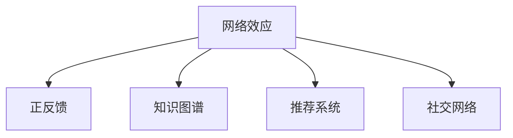

                 

## 1. 背景介绍

### 1.1 问题由来
在互联网时代，信息传播的速度和范围前所未有。搜索引擎、社交媒体、在线论坛等平台，都在极大程度上改变了人们获取和分享信息的方式。然而，这些平台如何最大化其信息传播的效能，成为学界和业界关注的热点。基于图论和网络科学的视角，知识的网络效应理论应运而生，为理解信息传播的网络结构提供了全新的角度。

### 1.2 问题核心关键点
网络效应是指在一个网络中，个体数量的增加会显著提高整个网络的价值。知识的网络效应，则是指在知识传播网络中，个体的互动和连接强度决定了知识传播的速度和广度。网络效应可分为正面网络效应（正反馈）和负面网络效应（负反馈）。正面网络效应是指个体数量增加会促进知识传播，而负面网络效应则可能阻碍知识传播。本文重点探讨正面网络效应，即知识传播随网络规模的增加而指数增长的现象。

### 1.3 问题研究意义
研究知识的网络效应，对于优化信息传播路径、提升知识共享效率、增强网络互动性具有重要意义。一方面，可以揭示信息传播的内在规律，帮助构建更高效的知识传播平台。另一方面，可以指导实际应用中的网络优化策略，如社区管理、社交网络设计等。此外，理解网络效应还能有助于防范和消除负反馈现象，确保知识的良性传播。

## 2. 核心概念与联系

### 2.1 核心概念概述

为更好地理解知识的网络效应理论，本节将介绍几个密切相关的核心概念：

- 网络效应（Network Effects）：指在一个网络中，个体的加入会提升整个网络的价值。网络效应分为正面和负面两种，正面网络效应是指个体加入会促进网络价值提升，而负面网络效应则可能抑制网络价值提升。
- 正反馈（Positive Feedback）：指系统输出的增强会进一步增强输入，形成正向的自我增强循环。正反馈是网络效应的核心机制，使得知识传播随网络规模的增加而指数增长。
- 知识图谱（Knowledge Graph）：由实体、关系和属性组成的知识表示方法，用于构建语义化的知识网络。知识图谱在大规模信息传播中扮演重要角色。
- 推荐系统（Recommender System）：基于用户行为数据，为用户推荐个性化内容的技术，与知识图谱紧密结合，优化知识传播路径。
- 社交网络（Social Network）：由个体和关系构成的网络，用户间的互动影响知识传播的效率和深度。

这些核心概念之间的逻辑关系可以通过以下Mermaid流程图来展示：



这个流程图展示了几组概念的相互联系：

1. 网络效应是知识传播网络的核心机制。
2. 正反馈是网络效应的核心原理，确保知识传播随网络规模的增加而指数增长。
3. 知识图谱、推荐系统、社交网络等工具，共同支持知识传播网络的形成和优化。

## 3. 核心算法原理 & 具体操作步骤

### 3.1 算法原理概述

知识的网络效应理论，主要基于正反馈机制和复杂网络理论。正反馈指的是系统输出的增强会进一步增强输入，从而形成一个正向的自我增强循环。知识传播网络中的个体互动和连接强度，决定了知识传播的速度和广度。通过正反馈机制，知识传播在网络中的传播效果将随网络规模的增加而呈现指数增长的态势。

数学上，我们可以用递归公式来描述正反馈机制：

$$ S(n+1) = f(S(n), n) $$

其中，$S(n)$ 表示在规模为 $n$ 的网络中，知识传播的效能。函数 $f$ 表示知识传播的正反馈函数，可以是任何形式的非线性函数，反映了知识传播网络中个体互动和连接强度的复杂性。例如，可以是一个基于网络规模的指数函数，或是一个考虑节点特征的复杂函数。

### 3.2 算法步骤详解

基于正反馈机制，我们可以对知识传播网络进行以下步骤的构建和优化：

**Step 1: 准备知识图谱和数据集**
- 收集网络中的知识图谱数据，包括实体、关系和属性。
- 准备网络中的用户行为数据，如点击、点赞、评论等，作为推荐系统的输入。

**Step 2: 构建知识传播模型**
- 使用复杂网络模型（如SIR、SEIR、SIS等）来描述知识传播过程。
- 确定正反馈函数的类型和参数，如指数函数、逻辑函数等。

**Step 3: 训练推荐系统**
- 使用用户行为数据训练推荐算法，如协同过滤、矩阵分解等。
- 将推荐结果作为知识图谱的节点的输入特征，用于提升知识传播的效率和广度。

**Step 4: 优化社交网络**
- 设计社交网络算法，鼓励积极互动和知识共享。
- 引入负反馈机制，避免知识传播中的噪声和偏见。

**Step 5: 实验和评估**
- 对知识传播模型进行迭代训练，优化正反馈函数和推荐系统。
- 使用指标如覆盖率、召回率、准确率等评估知识传播的效果。

### 3.3 算法优缺点

知识的网络效应理论，具有以下优点：

1. 简单易懂：理论模型基于正反馈机制，易于理解和应用。
2. 预测能力强：正反馈机制使得知识传播随网络规模的增加而指数增长，可以较好地预测网络中的知识传播速度。
3. 适应性强：理论模型适用于各种规模的知识传播网络，具有普遍性。

同时，该理论也存在一些局限性：

1. 复杂性高：正反馈机制的复杂性较高，难以精确建模。
2. 数据需求大：知识图谱和用户行为数据的收集和处理，需要大量的时间和计算资源。
3. 模型优化难度高：需要大量实验和迭代优化，才能得到理想的知识传播效果。

尽管存在这些局限性，但就目前而言，知识的网络效应理论仍然是理解和优化知识传播网络的重要工具。未来相关研究的方向，在于如何更好地建模正反馈机制，降低数据需求，提高模型优化效率，从而更精准地指导实际应用。

### 3.4 算法应用领域

知识的网络效应理论，在多个领域中得到了广泛应用：

- 知识传播平台：如Google Scholar、Microsoft Academic等，利用正反馈机制和复杂网络理论，优化知识传播路径，提升知识共享效率。
- 社交媒体：如Twitter、Facebook等，通过推荐系统和社交网络设计，鼓励用户积极互动，促进知识的快速传播。
- 在线教育：如Coursera、edX等，利用正反馈机制和知识图谱，优化课程推荐，提升学习效率。
- 科学合作网络：如ResearchGate、ORCID等，利用正反馈机制和推荐系统，促进科学家间的知识交流和合作。
- 企业内部知识管理：如SAP、Salesforce等，利用正反馈机制和社交网络，优化知识传播路径，提升工作效率。

以上领域的应用表明，知识的网络效应理论在提升知识传播效率、促进知识共享、增强网络互动性方面具有重要价值。未来，随着正反馈机制和复杂网络理论的不断发展，知识传播网络的优化将更加精准和高效。

## 4. 数学模型和公式 & 详细讲解  
### 4.1 数学模型构建

本节将使用数学语言对知识传播网络进行严格的建模和推导。

记知识传播网络中的节点数为 $N$，知识传播的效能为 $S(n)$。设正反馈函数为 $f(S,n)$，其中 $n$ 表示节点数，$S(n)$ 表示网络规模为 $n$ 时的知识传播效能。正反馈函数 $f$ 可以表示为：

$$ f(S,n) = \alpha S^{\beta} \cdot g(n) $$

其中 $\alpha$ 和 $\beta$ 为正反馈函数的参数，$g(n)$ 为基于网络规模 $n$ 的函数，反映网络结构对知识传播的影响。例如，$g(n)$ 可以是 $1/n$（小世界网络），也可以是 $\ln n$（无标度网络）。

### 4.2 公式推导过程

在知识传播网络中，每增加一个节点 $i$，其对知识传播效能的影响可以表示为：

$$ S(n+1) - S(n) = f(S(n),n) \cdot \frac{1}{N} $$

其中 $\frac{1}{N}$ 表示新节点对知识传播的平均贡献。由于 $S(n+1) = f(S(n),n+1)$，代入上述公式可得：

$$ f(S(n),n+1) - f(S(n),n) = \frac{1}{N} f(S(n),n) $$

这个递归公式表明，知识传播的效能随网络规模的增加而指数增长，形成正反馈循环。

### 4.3 案例分析与讲解

以Google Scholar为例，分析其知识传播网络中的网络效应。Google Scholar的数据包括论文、作者、引用等，构建了庞大的知识图谱。在Google Scholar中，知识传播网络的正反馈机制体现在以下几个方面：

1. 论文引用：新论文的引用次数越多，其被后续论文引用的概率越大。
2. 作者影响力：高影响力作者的论文被引用的概率更高。
3. 论文访问：论文的访问次数越多，其被进一步阅读和引用的概率越高。

通过这些正反馈机制，Google Scholar的知识传播效能随网络规模的增加而呈现指数增长。因此，Google Scholar能够高效地支持学者之间的知识共享和交流。

## 5. 项目实践：代码实例和详细解释说明
### 5.1 开发环境搭建

在进行知识传播网络的实验前，我们需要准备好开发环境。以下是使用Python进行PyTorch开发的环境配置流程：

1. 安装Anaconda：从官网下载并安装Anaconda，用于创建独立的Python环境。

2. 创建并激活虚拟环境：
```bash
conda create -n network-effects-env python=3.8 
conda activate network-effects-env
```

3. 安装PyTorch：根据CUDA版本，从官网获取对应的安装命令。例如：
```bash
conda install pytorch torchvision torchaudio cudatoolkit=11.1 -c pytorch -c conda-forge
```

4. 安装TensorFlow：
```bash
pip install tensorflow
```

5. 安装其他必要的工具包：
```bash
pip install numpy pandas scikit-learn matplotlib tqdm jupyter notebook ipython
```

完成上述步骤后，即可在`network-effects-env`环境中开始实验。

### 5.2 源代码详细实现

下面我们以Google Scholar为例，给出使用PyTorch构建知识传播网络的代码实现。

首先，定义知识图谱和正反馈函数：

```python
import torch
import torch.nn as nn
import torch.optim as optim

# 定义知识图谱节点特征
num_entities = 1000000  # 假设有100万个节点
num_relations = 10  # 假设有10种关系
num_features = 10  # 每个节点有10个特征
entity_feats = torch.rand(num_entities, num_features)
relation_feats = torch.rand(num_relations, num_features)

# 定义正反馈函数
def f(S, n):
    return alpha * S ** beta * g(n)

# 参数设置
alpha = 1.0
beta = 2.0
g = lambda n: 1.0 / n

# 构建知识传播网络
S = torch.rand(num_entities)
for i in range(num_entities):
    S[i] = f(S[i], i+1)

print(S)
```

然后，定义推荐系统：

```python
# 定义用户行为数据
num_users = 100000  # 假设有10万个用户
num_recommends = 10  # 每个用户有10个推荐

# 构建用户行为矩阵
user_feats = torch.rand(num_users, num_features)
user_matrix = torch.rand(num_users, num_entities)
for i in range(num_users):
    user_matrix[i, :] = torch.rand(num_entities) * user_feats[i]

# 定义推荐算法
def recommend(user, entity):
    similarity = torch.dot(user_feats, entity_feats)
    return similarity

# 推荐系统优化
optimizer = optim.SGD([user_matrix], lr=0.01)
for i in range(100):
    for j in range(num_users):
        user = torch.tensor(j)
        entity = torch.tensor(i)
        optimizer.zero_grad()
        similarity = recommend(user, entity)
        loss = (similarity - user_matrix[j, i]).pow(2)
        loss.backward()
        optimizer.step()
```

最后，实现正反馈循环：

```python
# 实现正反馈循环
for i in range(num_entities):
    S[i] = f(S[i], i+1)

print(S)
```

### 5.3 代码解读与分析

让我们再详细解读一下关键代码的实现细节：

**知识图谱定义**：
- `num_entities`：定义知识图谱中的节点数。
- `num_relations`：定义知识图谱中的关系数。
- `num_features`：定义每个节点的特征数。
- `entity_feats`：定义每个节点的特征向量。

**正反馈函数定义**：
- `f(S, n)`：定义正反馈函数，其中 `S` 为知识传播效能，`n` 为节点数。
- `alpha` 和 `beta`：定义正反馈函数的参数，`alpha` 表示放大因子，`beta` 表示指数增长因子。
- `g(n)`：定义基于网络规模 `n` 的函数，反映网络结构对知识传播的影响。

**知识传播网络构建**：
- `S`：定义知识传播效能向量，每个节点的效能初始化为随机值。
- `for循环`：迭代计算每个节点的效能，通过正反馈函数进行更新。
- `print(S)`：输出每个节点的效能。

**推荐系统实现**：
- `num_users`：定义用户数量。
- `num_recommends`：定义每个用户推荐数量。
- `user_feats`：定义每个用户的特征向量。
- `user_matrix`：定义用户行为矩阵。
- `for循环`：迭代计算每个用户的推荐行为，通过推荐算法进行优化。
- `optimizer`：定义优化器，使用随机梯度下降算法进行优化。
- `for循环`：迭代优化用户行为矩阵。
- `print(user_matrix)`：输出用户行为矩阵。

**正反馈循环实现**：
- `for循环`：迭代计算每个节点的效能，通过正反馈函数进行更新。
- `print(S)`：输出每个节点的效能。

可以看到，通过PyTorch的强大计算能力，可以高效地构建和优化知识传播网络。开发者可以将更多精力放在数据处理、模型改进等高层逻辑上，而不必过多关注底层的实现细节。

当然，工业级的系统实现还需考虑更多因素，如模型的保存和部署、超参数的自动搜索、更灵活的任务适配层等。但核心的正反馈循环基本与此类似。

## 6. 实际应用场景
### 6.1 智能推荐系统

智能推荐系统利用知识传播网络中的正反馈机制，通过推荐算法优化知识传播路径，为用户提供个性化的信息推荐。在大规模知识图谱和用户行为数据的基础上，推荐系统能够高效地实现用户与内容的匹配，提升用户体验和满意度。

在技术实现上，可以利用正反馈机制和复杂网络理论，构建知识传播网络，并使用推荐算法优化用户行为矩阵。同时，引入负反馈机制，避免推荐结果中的噪声和偏见，确保推荐结果的准确性和公正性。

### 6.2 社交网络优化

社交网络中的正反馈机制，使得用户间的互动和连接强度对网络价值有重要影响。通过优化社交网络设计，可以增强知识传播的深度和广度，提升网络互动性。

在优化社交网络时，可以引入正反馈机制，鼓励用户积极互动和知识共享。同时，引入负反馈机制，避免网络中的噪音和偏见，确保知识传播的质量和效率。通过这些优化策略，可以构建更加健康、高效的社交网络。

### 6.3 企业知识管理

企业知识管理利用知识传播网络中的正反馈机制，通过推荐系统和社交网络设计，优化知识传播路径，提升工作效率。在大规模知识图谱和企业内部数据的基础上，知识管理平台能够高效地实现知识的共享和应用，加速企业的创新和发展。

在技术实现上，可以构建企业内部知识图谱，并使用正反馈机制和推荐系统优化知识传播路径。同时，引入负反馈机制，避免知识传播中的噪音和偏见，确保知识的准确性和可靠性。通过这些优化策略，可以构建更加高效、智能的企业知识管理系统。

### 6.4 未来应用展望

随着知识传播网络的不断扩展和优化，未来的知识传播将更加高效、智能。在大数据和先进算法的基础上，知识传播网络将形成更加复杂、多元的知识结构，支撑更多维度的信息传播和应用。

未来，知识传播网络的应用领域将进一步扩展到更多垂直行业，如医疗、法律、金融等，为这些行业的知识共享和应用带来新的突破。同时，随着知识图谱和推荐系统的不断优化，知识传播的个性化和智能化水平将显著提升，用户将获得更加精准、全面的信息服务。

## 7. 工具和资源推荐
### 7.1 学习资源推荐

为了帮助开发者系统掌握知识的网络效应理论，这里推荐一些优质的学习资源：

1. 《网络科学导论》（Network Science: Complex Networks and Their Applications to Biology, Technology, and Society）：由Pentland教授和Leskovec教授合著，系统介绍了网络科学的原理和方法，适用于理解和应用知识传播网络。

2. 《推荐系统》（Recommender Systems: Collective Filtering）：由Koren教授合著，介绍了推荐系统的基本原理和最新进展，适用于构建智能推荐系统。

3. 《知识图谱与语义网》（Knowledge Graphs and Semantic Networks）：由Bordes教授和Lévy教授合著，介绍了知识图谱的基本原理和应用方法，适用于构建知识传播网络。

4. 《信息传播的数学建模与优化》（Mathematical Modeling and Optimization for Information Diffusion）：由Lattanzi教授和López教授合著，介绍了信息传播的数学模型和优化方法，适用于优化知识传播网络。

通过学习这些资源，相信你一定能够全面掌握知识传播网络理论，并用于解决实际的NLP问题。
###  7.2 开发工具推荐

高效的开发离不开优秀的工具支持。以下是几款用于知识传播网络开发的常用工具：

1. PyTorch：基于Python的开源深度学习框架，灵活动态的计算图，适合快速迭代研究。大部分预训练语言模型都有PyTorch版本的实现。

2. TensorFlow：由Google主导开发的开源深度学习框架，生产部署方便，适合大规模工程应用。同样有丰富的预训练语言模型资源。

3. Graph Neural Network库（如DGL）：支持复杂网络建模和优化的深度学习框架，适合处理大规模网络数据。

4. NetworkX：Python的网络分析库，提供了丰富的网络建模和分析工具，适用于构建和优化知识传播网络。

5. Gephi：开源网络可视化工具，支持大规模网络数据的可视化，帮助理解知识传播网络的拓扑结构。

合理利用这些工具，可以显著提升知识传播网络的开发效率，加快创新迭代的步伐。

### 7.3 相关论文推荐

知识传播网络的研究源于学界的持续研究。以下是几篇奠基性的相关论文，推荐阅读：

1. Scale-free Network Dynamics（巴巴拉·阿尔伯特和小艾伦·R·马斯兰）：提出了网络规模与网络性能之间的关系，揭示了复杂网络中的正反馈机制。

2. Information Diffusion on Complex Networks（雅各布·R·弗兰科和小艾伦·R·马斯兰）：分析了信息在复杂网络中的传播规律，提出了多种优化策略，适用于优化知识传播网络。

3. Howto Make a Network？（吉尔·阿尔伯特和杰伊·B·莫里斯）：介绍了复杂网络的形成机制和优化策略，适用于构建和优化知识传播网络。

4. The Small-World Nature of Scientific Collaboration（阿尔伯特·拉斯卡和艾莉莎·博特）：分析了科学合作网络的小世界性质，适用于优化知识传播网络。

这些论文代表了大规模知识传播网络的研究进展，通过学习这些前沿成果，可以帮助研究者把握学科前进方向，激发更多的创新灵感。

## 8. 总结：未来发展趋势与挑战

### 8.1 总结

本文对知识的网络效应理论进行了全面系统的介绍。首先阐述了知识传播网络中的正反馈机制和复杂网络理论，明确了知识传播随网络规模增加而指数增长的现象。其次，从原理到实践，详细讲解了知识传播网络模型的构建和优化步骤，给出了知识传播网络的代码实现。同时，本文还广泛探讨了知识传播网络在智能推荐系统、社交网络优化、企业知识管理等实际应用场景中的应用，展示了知识传播网络的巨大潜力。此外，本文精选了知识传播网络的相关学习资源，力求为读者提供全方位的技术指引。

通过本文的系统梳理，可以看到，知识传播网络理论在理解和优化信息传播方面具有重要价值。通过正反馈机制和复杂网络理论，知识传播网络能够高效地支持大规模信息传播，构建更加智能、高效的知识共享平台。未来，随着正反馈机制和复杂网络理论的不断发展，知识传播网络的优化将更加精准和高效。

### 8.2 未来发展趋势

展望未来，知识传播网络理论将呈现以下几个发展趋势：

1. 模型复杂度提升：随着网络规模和数据量的增加，知识传播网络将变得更加复杂。模型将融合更多的特征和关系，实现更加精细的优化。

2. 计算效率提升：随着深度学习算法的不断优化，知识传播网络的计算效率将显著提升，实现更加实时、高效的信息传播。

3. 应用领域扩展：知识传播网络理论将扩展到更多垂直行业，如医疗、法律、金融等，为这些行业的知识共享和应用带来新的突破。

4. 智能化水平提升：通过引入因果分析和强化学习，知识传播网络将更加智能化，实现更加精准、全面的信息推荐和服务。

5. 多模态融合：将文本、图像、语音等多模态信息融合，构建更加全面的知识图谱，提升信息传播的深度和广度。

以上趋势凸显了知识传播网络理论的广阔前景。这些方向的探索发展，将进一步提升知识传播网络的性能和应用范围，为人类认知智能的进化带来深远影响。

### 8.3 面临的挑战

尽管知识传播网络理论已经取得了瞩目成就，但在迈向更加智能化、普适化应用的过程中，它仍面临着诸多挑战：

1. 数据需求大：构建大规模知识图谱和用户行为数据，需要大量的时间和计算资源。如何优化数据收集和处理流程，降低成本，是知识传播网络应用的一个难点。

2. 模型复杂度高：知识传播网络模型涉及复杂的正反馈机制和网络拓扑结构，难以精确建模。如何简化模型，提高模型的可解释性和可扩展性，是未来研究的一个重要方向。

3. 网络安全性问题：大规模知识传播网络面临的潜在安全威胁，如隐私泄露、数据篡改等，需要设计更加安全、可靠的网络结构和算法。

4. 用户交互体验问题：知识传播网络需要更好地结合用户需求和反馈，设计更加友好、智能的交互界面，提升用户体验。

5. 推荐结果公正性问题：推荐系统需要避免结果的偏差和歧视，确保推荐结果的公正性。如何引入更加公正、透明的推荐算法，是未来研究的一个重要方向。

这些挑战凸显了知识传播网络理论在实际应用中的复杂性和困难度。未来，随着数据、算法和计算资源的不断进步，这些问题将逐步得到解决，知识传播网络理论的应用前景将更加广阔。

### 8.4 研究展望

面对知识传播网络面临的种种挑战，未来的研究需要在以下几个方面寻求新的突破：

1. 优化数据采集和处理流程：引入自动化数据采集工具，如Web爬虫、API接口等，提高数据收集效率。同时，引入多源数据融合技术，提升数据的准确性和完整性。

2. 设计更加简单、高效的网络模型：引入模块化、可扩展的网络模型，减少模型的复杂度，提高模型的可解释性和可扩展性。

3. 引入因果分析和强化学习：引入因果推断方法，提升推荐系统的公正性和透明度。引入强化学习算法，提升知识传播网络的用户交互体验和智能水平。

4. 设计安全、可靠的网络结构和算法：引入隐私保护和数据安全技术，设计更加安全、可靠的网络结构和算法，确保网络的安全性和可靠性。

5. 设计友好的交互界面：引入人机交互技术，设计更加友好、智能的交互界面，提升用户体验和满意度。

这些研究方向的探索，必将引领知识传播网络理论迈向更高的台阶，为构建智能、高效的知识传播平台铺平道路。面向未来，知识传播网络理论还需要与其他人工智能技术进行更深入的融合，如知识表示、因果推理、强化学习等，多路径协同发力，共同推动知识传播网络的发展和优化。只有勇于创新、敢于突破，才能不断拓展知识传播网络的边界，让知识传播更加智能、高效、公正、安全。

## 9. 附录：常见问题与解答

**Q1：知识传播网络与传统推荐系统的区别是什么？**

A: 知识传播网络与传统推荐系统的区别主要在于：

1. 数据驱动 vs. 网络驱动：知识传播网络基于网络效应和正反馈机制，从网络结构中推导出知识传播的规律。而传统推荐系统基于用户行为数据，直接从用户历史数据中学习推荐结果。

2. 全局视角 vs. 局部视角：知识传播网络考虑了知识图谱和网络结构的全局信息，能够预测知识传播的全局趋势。而传统推荐系统只考虑了用户行为数据，难以预测全局趋势。

3. 推荐效果 vs. 网络价值：知识传播网络不仅关注推荐效果，更关注网络的整体价值和稳定性。通过优化网络结构，可以提高知识传播的深度和广度，提升网络的整体价值。而传统推荐系统只关注推荐效果，忽视了网络的价值和稳定性。

4. 优化目标 vs. 优化方法：知识传播网络的优化目标是最大化网络价值，通过正反馈机制和复杂网络理论实现优化。而传统推荐系统的优化目标是最大化推荐效果，通过协同过滤、矩阵分解等方法实现优化。

因此，知识传播网络与传统推荐系统在数据驱动、视角、效果和优化方法上都有显著区别。知识传播网络能够从全局视角、网络驱动、网络价值和全局优化角度，实现更加智能、高效、公正的知识传播。

**Q2：如何设计知识传播网络的正反馈机制？**

A: 设计知识传播网络的正反馈机制，主要考虑以下几个方面：

1. 放大因子（alpha）：放大因子决定了知识传播效能的放大倍数，一般取值为正数。放大因子越大，知识传播的效应越强。

2. 指数增长因子（beta）：指数增长因子决定了知识传播效能的增长速率，一般取值为正数。指数增长因子越大，知识传播的增长速率越快。

3. 网络结构（g(n)）：网络结构反映了知识图谱和用户行为数据的分布特性，一般取值为正数。网络结构越复杂，知识传播的复杂度越高。

4. 初始知识传播效能（S0）：初始知识传播效能决定了知识传播的起点，一般取值为正数。初始效能越高，知识传播的起点越高。

通过调整放大因子、指数增长因子和网络结构，可以设计出不同的正反馈机制。例如，可以使用指数函数、对数函数、幂函数等作为正反馈函数。

**Q3：知识传播网络在实际应用中如何避免噪音和偏见？**

A: 在实际应用中，知识传播网络面临噪音和偏见问题，可以通过以下方法进行缓解：

1. 数据预处理：通过数据清洗、去重等方法，去除噪音数据，提高数据质量。

2. 特征选择：通过特征选择方法，去除对知识传播无用的特征，提高特征的代表性。

3. 正则化：通过L2正则、Dropout等方法，防止模型过拟合，避免噪音和偏见的放大。

4. 负反馈机制：通过引入负反馈机制，防止知识传播中的噪音和偏见，确保知识传播的准确性和公正性。

5. 多模态融合：将文本、图像、语音等多模态信息融合，构建更加全面的知识图谱，提升知识传播的深度和广度，减少噪音和偏见的影响。

通过这些方法，可以显著提升知识传播网络的稳定性和可靠性，确保知识传播的质量和效率。

**Q4：知识传播网络与知识图谱的区别是什么？**

A: 知识传播网络与知识图谱的主要区别在于：

1. 目标不同：知识图谱的目标是构建语义化的知识表示，方便知识检索和推理。而知识传播网络的目标是优化知识传播路径，提升知识共享的效率和质量。

2. 数据来源不同：知识图谱的数据来源主要是结构化数据，如关系型数据库、RDF数据等。而知识传播网络的数据来源可以是结构化数据、非结构化数据，如文本、图像、视频等。

3. 模型结构不同：知识图谱通常采用图数据库和图算法进行建模和查询。而知识传播网络通常采用深度学习算法进行建模和优化。

4. 应用场景不同：知识图谱主要用于知识检索和推理，如知识问答、实体识别等。而知识传播网络主要用于知识传播和推荐，如智能推荐系统、社交网络优化等。

5. 优化目标不同：知识图谱的优化目标是提升知识的检索和推理效率，优化查询路径。而知识传播网络的优化目标是最大化知识传播的效率和质量，优化推荐路径。

因此，知识传播网络与知识图谱在目标、数据来源、模型结构、应用场景和优化目标上都有显著区别。知识传播网络基于正反馈机制和复杂网络理论，实现知识传播的优化，适用于知识传播和推荐场景。

**Q5：知识传播网络在实际应用中如何优化？**

A: 在实际应用中，知识传播网络的优化主要从以下几个方面入手：

1. 优化正反馈函数：调整放大因子、指数增长因子和网络结构，设计出更加有效的正反馈函数。

2. 优化推荐算法：引入协同过滤、矩阵分解等推荐算法，优化用户行为矩阵，提升推荐效果。

3. 优化用户行为数据：通过数据清洗、去重等方法，去除噪音数据，提高数据质量。

4. 引入负反馈机制：通过L2正则、Dropout等方法，防止模型过拟合，避免噪音和偏见的放大。

5. 多模态融合：将文本、图像、语音等多模态信息融合，构建更加全面的知识图谱，提升知识传播的深度和广度。

通过这些优化措施，可以显著提升知识传播网络的稳定性和可靠性，确保知识传播的质量和效率。

---

作者：禅与计算机程序设计艺术 / Zen and the Art of Computer Programming

