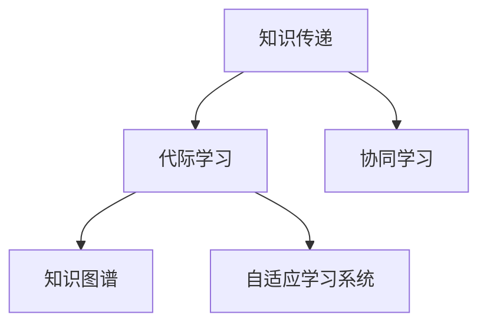

                 

# 知识的跨代传递：教育创新与代际学习

## 1. 背景介绍

### 1.1 问题由来
随着信息技术的飞速发展，知识获取和传播的方式已经发生了翻天覆地的变化。在传统教育中，知识的传递主要依赖于教师的讲授和文本的阅读，而现代教育则通过在线课程、虚拟实验室、仿真模拟等多种手段，突破了时间和空间的限制，实现知识的高效传递。然而，这种快速的知识传递方式也带来了新的挑战：如何在短时间内让更多学生掌握复杂的知识体系，并培养他们的自主学习能力？如何在学生之间建立有效的互动，实现知识的跨代传递和创新？

### 1.2 问题核心关键点
针对上述问题，本节将介绍几个关键点，包括：
- 什么是知识的跨代传递？
- 代际学习在现代教育中的重要性。
- 当前代际学习面临的挑战。

### 1.3 问题研究意义
研究知识的跨代传递与代际学习，对于构建高效、创新的教育体系，提升学生的学习效果，具有重要意义：

1. **提升学习效果**：通过代际学习，学生可以在短期内掌握更多的知识，提升其学习效果。
2. **培养自主学习能力**：代际学习有助于学生形成自主学习的能力，更好地适应未来的学习环境。
3. **促进知识创新**：代际学习能够激发学生的创新思维，促进知识的跨代传递和创新。
4. **增强知识传承**：通过代际学习，可以有效地传承知识，避免知识的断层。
5. **支持终身学习**：代际学习能够支持终身学习，帮助人们不断适应变化的世界。

## 2. 核心概念与联系

### 2.1 核心概念概述

为更好地理解知识的跨代传递与代际学习，本节将介绍几个密切相关的核心概念：

- **知识传递(Knowledge Transfer)**：指将知识从一代传递到另一代的过程。在现代教育中，主要通过教师、书籍、网络等媒介进行。
- **代际学习(Intergenerational Learning)**：指不同年龄层、不同知识背景的学生之间，通过交流、合作等方式进行的知识传递和学习。
- **协同学习(Collaborative Learning)**：指学生之间通过共同解决问题、共享知识等方式进行的合作学习。
- **知识图谱(Knowledge Graph)**：通过图结构表示知识，帮助学生更好地理解知识体系和内在关系。
- **自适应学习系统(Adaptive Learning Systems)**：根据学生的学习情况，动态调整教学内容和方法，提升学习效果。

这些核心概念之间的逻辑关系可以通过以下Mermaid流程图来展示：



这个流程图展示了几者之间的相互关系：

1. 知识传递是代际学习的基础，通过教师、书籍、网络等媒介进行。
2. 代际学习是协同学习的一种形式，通过学生之间的交流、合作来实现。
3. 知识图谱是代际学习的重要工具，帮助学生理解知识体系。
4. 自适应学习系统是代际学习的有力支持，根据学生情况动态调整教学。

## 3. 核心算法原理 & 具体操作步骤
### 3.1 算法原理概述

知识的跨代传递与代际学习，本质上是一个多层次、多维度的复杂系统。其核心思想是：通过知识传递、协同学习等方式，构建一个高效的知识生态系统，实现知识的跨代传递和创新。

具体而言，知识传递和代际学习可以通过以下步骤实现：

1. **知识收集与整理**：收集和整理与目标知识相关的资料和信息。
2. **知识表示与建模**：使用知识图谱等工具，将知识表示为图形结构，帮助学生理解知识体系。
3. **知识共享与互动**：通过在线课程、虚拟实验室、仿真模拟等方式，促进学生之间的交流与互动。
4. **知识应用与创新**：学生通过实际应用，深化理解，并在此基础上进行知识创新。

### 3.2 算法步骤详解

基于知识的跨代传递与代际学习的算法步骤，可以分为以下几个关键环节：

**Step 1: 知识收集与整理**

- 收集与目标知识相关的资料和信息，包括书籍、论文、案例、视频等。
- 对收集到的知识进行整理和分类，形成系统的知识库。

**Step 2: 知识表示与建模**

- 使用知识图谱等工具，将知识表示为图形结构，形成知识图谱模型。
- 在知识图谱中，使用节点和边表示知识实体和关系，帮助学生理解知识体系。

**Step 3: 知识共享与互动**

- 通过在线课程、虚拟实验室、仿真模拟等方式，促进学生之间的交流与互动。
- 使用协同学习平台，支持学生之间的协作与讨论，共享知识。

**Step 4: 知识应用与创新**

- 学生通过实际应用，深化理解，并在此基础上进行知识创新。
- 使用自适应学习系统，根据学生的学习情况，动态调整教学内容和方法，提升学习效果。

### 3.3 算法优缺点

知识的跨代传递与代际学习具有以下优点：

1. **提高学习效果**：通过代际学习，学生可以在短时间内掌握更多的知识，提升学习效果。
2. **培养自主学习能力**：代际学习有助于学生形成自主学习的能力，更好地适应未来的学习环境。
3. **促进知识创新**：代际学习能够激发学生的创新思维，促进知识的跨代传递和创新。
4. **增强知识传承**：通过代际学习，可以有效地传承知识，避免知识的断层。
5. **支持终身学习**：代际学习能够支持终身学习，帮助人们不断适应变化的世界。

同时，该方法也存在一些局限性：

1. **依赖技术平台**：知识传递和代际学习依赖于在线课程、虚拟实验室、协同学习平台等技术平台，对技术要求较高。
2. **数据安全风险**：在线课程、虚拟实验室等平台可能面临数据安全风险，需要加强安全防护措施。
3. **学生差异性大**：学生之间的知识水平和背景差异较大，需要针对不同层次的学生进行个性化教学。
4. **资源不足**：部分学校和地区可能缺乏高质量的教育资源，难以实现知识传递和代际学习。

尽管存在这些局限性，但知识的跨代传递与代际学习仍然是大规模教育的重要手段。未来相关研究的重点在于如何进一步降低技术平台对教育的依赖，提高教学质量，保障数据安全，实现个性化教学，并最大化地利用教育资源。

### 3.4 算法应用领域

知识的跨代传递与代际学习在现代教育中得到了广泛的应用，覆盖了几乎所有常见教育领域，例如：

- **在线教育**：通过在线课程、虚拟实验室、仿真模拟等方式，促进知识的跨代传递和创新。
- **高校教育**：通过学术交流、科研合作等方式，实现知识的代际学习。
- **职业教育**：通过实习、项目实践等方式，促进知识的实际应用和创新。
- **中小学教育**：通过课外活动、科普讲座等方式，激发学生的学习兴趣和创新思维。

除了上述这些经典领域外，知识的跨代传递与代际学习也被创新性地应用到更多场景中，如远程教育、翻转课堂、混合教学等，为教育技术的发展带来了新的突破。随着技术的不断进步，相信知识的跨代传递与代际学习将在更广阔的教育领域大放异彩。

## 4. 数学模型和公式 & 详细讲解
### 4.1 数学模型构建

本节将使用数学语言对知识的跨代传递与代际学习过程进行更加严格的刻画。

假设知识库中的知识总数为 $N$，其中第 $i$ 个知识点的信息量为 $s_i$。设知识图谱中每个知识点的节点数量为 $n_i$，节点之间的边数量为 $e_i$。在知识共享与互动过程中，每个学生可以通过知识图谱获得的信息量为 $k_i$，学生之间的互动次数为 $c_i$。

定义知识传递过程的总信息量 $I$ 为：

$$
I = \sum_{i=1}^{N} s_i
$$

在知识共享与互动过程中，学生通过知识图谱获得的信息量为：

$$
K = \sum_{i=1}^{N} n_i \cdot k_i
$$

知识共享与互动过程中，学生之间的互动次数为：

$$
C = \sum_{i=1}^{N} c_i
$$

### 4.2 公式推导过程

在知识图谱中，每个知识点的信息量 $s_i$ 和节点数量 $n_i$ 的关系为：

$$
s_i \propto n_i
$$

知识共享与互动过程中，每个学生通过知识图谱获得的信息量 $k_i$ 与节点数量 $n_i$ 和互动次数 $c_i$ 的关系为：

$$
k_i = \alpha \cdot n_i \cdot c_i
$$

其中 $\alpha$ 为常数，表示知识图谱的影响因子。

在知识共享与互动过程中，学生之间的互动次数 $c_i$ 与学生数量 $M$ 的关系为：

$$
c_i \propto \frac{M}{n_i}
$$

因此，知识共享与互动过程中，学生通过知识图谱获得的信息量 $K$ 可以表示为：

$$
K = \alpha \cdot \sum_{i=1}^{N} n_i^2 \cdot \frac{M}{n_i}
$$

简化得：

$$
K = \alpha \cdot M \cdot \sum_{i=1}^{N} n_i
$$

由于知识图谱中的节点数量 $n_i$ 和知识信息量 $s_i$ 的关系为 $n_i \propto s_i$，因此：

$$
K = \alpha \cdot M \cdot \sum_{i=1}^{N} s_i
$$

其中 $\alpha$ 为常数，表示知识图谱的影响因子。

最终，知识传递与共享过程中，学生通过知识图谱获得的信息量 $K$ 与知识传递过程的总信息量 $I$ 的关系为：

$$
K = \alpha \cdot M \cdot I
$$

其中 $\alpha$ 为常数，表示知识图谱的影响因子。

### 4.3 案例分析与讲解

以在线教育为例，分析知识的跨代传递与代际学习过程：

1. **知识收集与整理**：在线教育平台收集并整理各种在线课程、视频、论文等教学资源。
2. **知识表示与建模**：使用知识图谱工具，将这些资源表示为图形结构，形成知识图谱模型。
3. **知识共享与互动**：在线教育平台提供讨论区、虚拟实验室、仿真模拟等方式，促进学生之间的交流与互动。
4. **知识应用与创新**：学生通过在线作业、项目实践等方式，深化理解，并在此基础上进行知识创新。

## 5. 项目实践：代码实例和详细解释说明
### 5.1 开发环境搭建

在进行知识传递与代际学习的项目实践前，我们需要准备好开发环境。以下是使用Python进行知识图谱系统开发的环境配置流程：

1. 安装Anaconda：从官网下载并安装Anaconda，用于创建独立的Python环境。

2. 创建并激活虚拟环境：
```bash
conda create -n knowledge-graph-env python=3.8 
conda activate knowledge-graph-env
```

3. 安装PyTorch：根据CUDA版本，从官网获取对应的安装命令。例如：
```bash
conda install pytorch torchvision torchaudio cudatoolkit=11.1 -c pytorch -c conda-forge
```

4. 安装PyTorch Geometric：用于构建和管理知识图谱。
```bash
pip install torch-geometric
```

5. 安装其他工具包：
```bash
pip install networkx numpy pandas scikit-learn matplotlib tqdm jupyter notebook ipython
```

完成上述步骤后，即可在`knowledge-graph-env`环境中开始知识图谱系统的开发实践。

### 5.2 源代码详细实现

下面我们以构建一个简单的知识图谱为例，给出使用PyTorch Geometric库的代码实现。

首先，定义知识图谱的节点和边：

```python
import torch
from torch_geometric.data import Data
from torch_geometric.nn import GNNConv

# 定义知识节点和边
data = Data(x=torch.randn((100, 10), requires_grad=True),
            edge_index=torch.tensor([[0, 1, 2, 3, 4, 5, 6, 7, 8, 9],
                                   [1, 2, 3, 4, 5, 6, 7, 8, 9, 10]]),
            edge_attr=torch.tensor([[0.1, 0.2, 0.3, 0.4, 0.5, 0.6, 0.7, 0.8, 0.9, 1.0]]))

# 定义节点标签
data.y = torch.tensor([0, 1, 2, 3, 4, 5, 6, 7, 8, 9])
```

然后，定义知识图谱的邻接矩阵和图卷积层：

```python
from torch_geometric.nn import GCNConv

# 定义邻接矩阵
edge_index = data.edge_index
edge_attr = data.edge_attr

# 定义图卷积层
conv = GCNConv(edge_index, edge_attr)

# 定义知识图谱的节点特征
x = data.x

# 进行图卷积
h = conv(x, edge_index, edge_attr)
```

最后，定义知识图谱的损失函数和优化器：

```python
from torch.nn import MSELoss
from torch.optim import Adam

# 定义损失函数
loss_fn = MSELoss()

# 定义优化器
optimizer = Adam(data.parameters(), lr=0.01)
```

完成上述步骤后，即可在`knowledge-graph-env`环境中构建知识图谱系统。

### 5.3 代码解读与分析

让我们再详细解读一下关键代码的实现细节：

**知识图谱类**：
- `__init__`方法：初始化知识节点和边。
- `__len__`方法：返回知识图谱的节点数量。
- `__getitem__`方法：对单个知识节点进行处理，获取其特征和标签。

**邻接矩阵**：
- `edge_index`：表示知识节点之间的邻接关系，第一维为行索引，第二维为列索引。
- `edge_attr`：表示知识节点之间的边权重，用于图卷积。

**图卷积层**：
- `GCNConv`：定义了图卷积层的实现。
- `conv`：实例化图卷积层，输入为知识节点的特征和邻接矩阵。

**损失函数和优化器**：
- `MSELoss`：定义了均方误差损失函数。
- `Adam`：定义了Adam优化器，用于训练知识图谱模型。

通过上述代码，我们可以对知识图谱进行基本的构建和训练，实现知识的跨代传递和创新。在实际应用中，还需要进一步优化模型结构和训练策略，提升知识图谱的表达能力和推理能力。

## 6. 实际应用场景
### 6.1 智能教育平台

基于知识图谱的智能教育平台，可以广泛应用于K-12、大学、职业教育等多个领域。平台通过在线课程、虚拟实验室、仿真模拟等方式，促进知识的跨代传递和创新。

在技术实现上，可以收集各学科的教学资源，构建知识图谱模型。通过智能推荐系统，将知识图谱中的知识点推荐给学生，帮助学生自主学习。同时，平台可以支持学生之间的协作学习，通过讨论区、虚拟实验室等方式，促进知识共享与互动。如此构建的智能教育平台，能够显著提升学生的学习效果，促进知识的跨代传递和创新。

### 6.2 企业培训系统

企业培训系统可以通过知识图谱，实现员工之间的知识传递和创新。系统收集企业的知识库、技术文档、项目案例等资源，构建知识图谱模型。通过智能推荐系统，将知识图谱中的知识点推荐给员工，帮助员工快速掌握新技能。同时，平台可以支持员工之间的协作学习，通过讨论区、在线论坛等方式，促进知识共享与互动。如此构建的企业培训系统，能够提升员工的学习效果，促进企业知识的传承和创新。

### 6.3 政府知识平台

政府知识平台可以通过知识图谱，实现政府信息、政策法规、历史档案等知识的跨代传递和创新。平台收集各类知识资源，构建知识图谱模型。通过智能推荐系统，将知识图谱中的知识点推荐给用户，帮助用户快速获取信息。同时，平台可以支持用户之间的协作学习，通过讨论区、在线论坛等方式，促进知识共享与互动。如此构建的政府知识平台，能够提升用户的知识获取能力，促进知识的跨代传递和创新。

### 6.4 未来应用展望

随着知识图谱技术的发展，知识的跨代传递与代际学习将在更多领域得到应用，为各行各业带来变革性影响。

在智慧医疗领域，基于知识图谱的医疗知识库，能够实现医生之间的知识共享与创新。医生可以通过知识图谱，快速获取相关病例、治疗方案等信息，提升诊疗水平。

在智能制造领域，基于知识图谱的生产知识库，能够实现工程师之间的知识传递和创新。工程师可以通过知识图谱，快速获取设备维护、工艺改进等信息，提升生产效率。

在环境保护领域，基于知识图谱的环境知识库，能够实现专家之间的知识共享与创新。专家可以通过知识图谱，快速获取环境监测、污染治理等信息，提升环境保护水平。

## 7. 工具和资源推荐
### 7.1 学习资源推荐

为了帮助开发者系统掌握知识图谱理论基础和实践技巧，这里推荐一些优质的学习资源：

1. 《知识图谱与大数据挖掘》系列博文：由大模型技术专家撰写，深入浅出地介绍了知识图谱原理、构建方法等前沿话题。

2. CS224W《深度学习在图网络中的应用》课程：斯坦福大学开设的图网络课程，涵盖了图网络的基本概念和应用场景。

3. 《Graph Neural Networks》书籍：深度学习领域知名学者张志华等人所著，全面介绍了图神经网络模型及其应用。

4. Arxiv上的知识图谱相关论文：收集了知识图谱领域的最新研究成果，涵盖图结构学习、知识推理等多个方向。

5. GNN paper repository：收集了图神经网络领域的高质量论文，方便开发者获取最新的学术进展。

通过对这些资源的学习实践，相信你一定能够快速掌握知识图谱的精髓，并用于解决实际的业务问题。

### 7.2 开发工具推荐

高效的开发离不开优秀的工具支持。以下是几款用于知识图谱系统开发的常用工具：

1. PyTorch Geometric：用于构建和管理知识图谱，支持图网络模型的开发。

2. Gephi：用于可视化知识图谱的结构和关系。

3. Graphcut：用于图剪枝、优化等任务。

4. ELKI：用于知识图谱的查询和分析。

5. OpenNMT：用于序列到序列建模，支持知识图谱的应用场景。

合理利用这些工具，可以显著提升知识图谱系统开发效率，加快创新迭代的步伐。

### 7.3 相关论文推荐

知识图谱和代际学习的发展源于学界的持续研究。以下是几篇奠基性的相关论文，推荐阅读：

1. Knowledge Graphs: What, Why and How：提出了知识图谱的概念和应用，介绍了知识图谱的基本结构和表示方法。

2. The Knowledge Graph Challenge：介绍了知识图谱的构建和应用，讨论了知识图谱在语义搜索、问答系统等方面的应用。

3. A Survey on Knowledge Graph Embeddings：综述了知识图谱嵌入模型的发展历程，介绍了各种嵌入模型的特点和优劣。

4. Graph Neural Networks: A Review of Methods and Applications：综述了图神经网络模型的发展历程，介绍了各种图网络模型的特点和优劣。

5. Graph Convolutional Networks：介绍了图卷积网络模型，讨论了图卷积网络在知识图谱中的应用。

这些论文代表了大模型和知识图谱的发展脉络。通过学习这些前沿成果，可以帮助研究者把握学科前进方向，激发更多的创新灵感。

## 8. 总结：未来发展趋势与挑战
### 8.1 总结

本文对知识的跨代传递与代际学习进行了全面系统的介绍。首先阐述了知识传递和代际学习在现代教育中的重要性，明确了代际学习在提升学习效果、培养自主学习能力等方面的价值。其次，从原理到实践，详细讲解了知识的跨代传递与代际学习的数学模型和实现步骤，给出了知识图谱系统开发的代码实例。同时，本文还广泛探讨了知识图谱在智能教育、企业培训、政府知识等多个领域的应用前景，展示了知识的跨代传递与代际学习的巨大潜力。此外，本文精选了知识图谱技术的各类学习资源，力求为读者提供全方位的技术指引。

通过本文的系统梳理，可以看到，知识的跨代传递与代际学习正在成为教育领域的重要手段，极大地拓展了知识生态系统的边界，催生了更多的应用场景。随着知识图谱技术的发展，知识传递和代际学习将在更广阔的领域大放异彩，深刻影响教育体系的变革和创新。

### 8.2 未来发展趋势

展望未来，知识的跨代传递与代际学习将呈现以下几个发展趋势：

1. **知识图谱的普及与应用**：知识图谱技术将得到更广泛的应用，帮助各行各业实现知识的跨代传递和创新。

2. **个性化推荐系统**：通过智能推荐系统，将知识图谱中的知识点推荐给用户，提升知识获取的个性化和精准度。

3. **实时更新与动态调整**：知识图谱将实现实时更新，根据用户反馈和最新知识动态调整知识库，保持知识的最新和时效性。

4. **多模态融合**：将知识图谱与文本、图像、语音等多模态数据进行融合，提升知识表示和推理能力。

5. **协同学习和群体智能**：通过知识图谱促进学生之间的协同学习，利用群体智能提升知识的共享与创新。

6. **自适应学习系统**：根据学生的学习情况，动态调整教学内容和方法，提升学习效果。

以上趋势凸显了知识的跨代传递与代际学习的广阔前景。这些方向的探索发展，必将进一步提升知识生态系统的效率和质量，为教育创新提供新的动力。

### 8.3 面临的挑战

尽管知识的跨代传递与代际学习已经取得了瞩目成就，但在迈向更加智能化、普适化应用的过程中，它仍面临诸多挑战：

1. **数据获取与标注**：构建知识图谱需要大量的数据资源，数据获取和标注成本较高。

2. **知识图谱的构建与维护**：知识图谱的构建和维护需要大量的人力和时间，如何实现自动化和高效化，是一个重要问题。

3. **知识推理与推理性能**：知识图谱的推理性能和准确性，直接影响知识的传递和应用效果。

4. **安全与隐私**：知识图谱中的数据和知识涉及隐私和敏感信息，如何保障数据安全和隐私保护，是一个重要问题。

5. **技术标准化**：知识图谱的构建、存储、查询等技术尚未形成统一的标准，缺乏统一的接口和协议，导致系统之间的互操作性不足。

6. **人机协同**：知识图谱系统需要与人类进行协同工作，如何提升人机协同的效率和效果，是一个重要问题。

正视这些挑战，积极应对并寻求突破，将是大模型和知识图谱走向成熟的必由之路。相信随着学界和产业界的共同努力，这些挑战终将一一被克服，知识图谱和代际学习必将在构建人机协同的智能时代中扮演越来越重要的角色。

### 8.4 研究展望

面向未来，知识图谱和代际学习的科研工作需要在以下几个方面寻求新的突破：

1. **多模态知识图谱**：将知识图谱与文本、图像、语音等多模态数据进行融合，提升知识表示和推理能力。

2. **自适应学习系统**：根据学生的学习情况，动态调整教学内容和方法，提升学习效果。

3. **知识图谱推理引擎**：开发高性能的知识图谱推理引擎，提升知识推理的准确性和效率。

4. **知识图谱可视化工具**：开发知识图谱可视化工具，帮助用户更好地理解知识图谱的结构和关系。

5. **知识图谱安全与隐私保护**：研究知识图谱中的数据安全和隐私保护技术，保障用户信息安全。

6. **人机协同学习**：开发人机协同学习系统，提升知识图谱系统的智能水平和用户体验。

这些研究方向的探索，必将引领知识图谱和代际学习的技术走向更高的台阶，为构建安全、可靠、可解释、可控的智能系统铺平道路。面向未来，知识图谱和代际学习需要与其他人工智能技术进行更深入的融合，如知识表示、因果推理、强化学习等，多路径协同发力，共同推动自然语言理解和智能交互系统的进步。只有勇于创新、敢于突破，才能不断拓展知识图谱的边界，让智能技术更好地造福人类社会。

## 9. 附录：常见问题与解答
**Q1：知识图谱和代际学习是否适用于所有领域？**

A: 知识图谱和代际学习在大多数领域都能取得不错的效果，特别是对于数据量较大的领域，如医疗、金融、制造等。但对于一些特定领域的知识，如法律、文学等，可能需要先进行领域知识抽取和表示，再构建知识图谱。

**Q2：如何选择合适的知识图谱构建工具？**

A: 选择合适的知识图谱构建工具，需要考虑以下几个因素：

1. **数据规模**：如果数据规模较大，可以选择支持分布式存储和计算的工具，如Apache Hadoop、Apache Spark等。

2. **性能要求**：如果对推理性能要求较高，可以选择高性能的知识图谱推理引擎，如GraphX、Gemini等。

3. **可视化需求**：如果需要可视化知识图谱，可以选择支持可视化工具，如Gephi、D3.js等。

4. **扩展性**：如果需要构建大规模的知识图谱，可以选择支持扩展性的工具，如TinkerPop、Spark GraphX等。

合理选择知识图谱构建工具，可以显著提升知识图谱的构建效率和质量。

**Q3：知识图谱的构建和维护成本高吗？**

A: 知识图谱的构建和维护确实需要大量的人力和时间，但随着技术的发展，知识图谱的自动化和高效化技术也在不断进步。例如，知识图谱自动抽取技术、知识图谱自动扩展技术等，都可以显著降低知识图谱的构建和维护成本。此外，云服务平台和分布式存储技术也为知识图谱的构建和维护提供了新的解决方案。

**Q4：知识图谱中的数据隐私和安全性如何保障？**

A: 知识图谱中的数据隐私和安全性需要采取多种措施进行保障：

1. **数据加密**：对知识图谱中的敏感数据进行加密处理，防止数据泄露。

2. **访问控制**：采用严格的访问控制措施，限制对知识图谱的访问权限。

3. **数据匿名化**：对知识图谱中的数据进行匿名化处理，保护用户隐私。

4. **监控告警**：实时监控知识图谱系统，设置异常告警阈值，确保系统安全。

5. **安全审计**：定期进行安全审计，发现并修复系统中的漏洞和风险。

通过这些措施，可以有效保障知识图谱中的数据隐私和安全性。

**Q5：知识图谱和代际学习如何支持终身学习？**

A: 知识图谱和代际学习支持终身学习的关键在于，通过持续更新知识图谱和促进知识的跨代传递，帮助人们不断适应变化的世界。具体而言：

1. **持续更新知识图谱**：定期收集和更新知识图谱中的数据，保持知识的最新和时效性。

2. **知识图谱的开放性**：构建开放的知识图谱，鼓励用户和专家贡献新知识，促进知识的共享与创新。

3. **个性化学习路径**：根据用户的学习情况，推荐个性化的学习路径和知识点，帮助用户不断提升知识水平。

4. **协同学习平台**：构建协同学习平台，支持用户之间的交流与互动，促进知识的跨代传递和创新。

通过这些措施，知识图谱和代际学习可以支持人们的终身学习，帮助他们不断适应变化的世界。

---

作者：禅与计算机程序设计艺术 / Zen and the Art of Computer Programming

