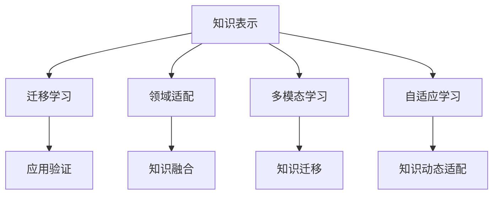

                 

# 知识的跨域应用：创新的源泉

## 1. 背景介绍

### 1.1 问题由来

随着知识在各个领域中不断累积和传播，人类社会对知识的渴求与日俱增。知识的跨域应用，即将某一领域的知识应用到另一个不同但相关的领域，不仅能够促进学科间的交叉融合，还能激发新的创新，驱动科技进步。这一现象在科技史上屡见不鲜，例如蒸汽机的发明就受到生物学中肌肉运动机制的启发。

然而，知识的跨域应用并非易事。不同领域之间的知识结构、理论框架和应用场景存在显著差异，要将一种领域的知识有效迁移到另一个领域，需要克服诸多挑战。近年来，随着人工智能技术的迅猛发展，尤其是深度学习、知识图谱和神经网络等技术的成熟，使得知识的跨域应用变得更加可能和高效。

### 1.2 问题核心关键点

知识跨域应用的核心关键点包括：

- **知识表示**：如何将源领域的知识结构合理表示，便于在目标领域中进行理解和应用。
- **领域适配**：如何根据目标领域的特点，对源领域的知识进行必要的调整和优化。
- **融合机制**：如何将源领域与目标领域中的知识进行有机融合，实现知识的有效迁移。
- **应用验证**：在目标领域中，如何对跨域应用的效果进行评估和验证，确保知识迁移的有效性。

这些关键点构成了一个系统的跨域知识应用框架，为知识在各领域之间的迁移提供了基础理论和方法支持。

## 2. 核心概念与联系

### 2.1 核心概念概述

为更好地理解知识跨域应用，本节将介绍几个关键概念：

- **知识表示(Knowledge Representation)**：指将知识用机器可理解和处理的形式进行编码和存储，是知识跨域应用的基础。常见的知识表示方法包括逻辑表示、语义网络、本体论等。
- **迁移学习(Transfer Learning)**：将一个领域学到的知识迁移到另一个领域，以提高在新领域中的学习效率和效果。迁移学习是知识跨域应用的典型范式。
- **领域适配(Domain Adaptation)**：通过调整和优化模型参数、特征提取方式等，使模型更好地适应目标领域的数据分布。领域适配技术在知识跨域应用中扮演重要角色。
- **多模态学习(Multimodal Learning)**：同时处理和利用不同类型的数据（如文本、图像、语音等），进行跨模态的知识迁移。多模态学习拓展了知识跨域应用的边界。
- **自适应学习(Adaptive Learning)**：根据学习任务的变化，动态调整模型结构和参数，以适应新的学习需求。自适应学习使得知识跨域应用更加灵活和高效。

这些核心概念之间的逻辑关系可以通过以下Mermaid流程图来展示：



这个流程图展示了这个系统的核心概念及其之间的关系：

1. 知识表示是整个知识跨域应用的基础。
2. 迁移学习是将知识从源领域迁移到目标领域的关键技术。
3. 领域适配是为了使模型更好地适应目标领域数据分布的调整手段。
4. 多模态学习拓展了知识跨域应用的场景。
5. 自适应学习提供了动态适应新任务的灵活机制。
6. 应用验证是对跨域应用效果进行评估的环节。
7. 知识融合是将源领域和目标领域知识有机结合的过程。

这些概念共同构成了知识跨域应用的核心框架，为不同领域知识的迁移和融合提供了理论和方法支持。

## 3. 核心算法原理 & 具体操作步骤

### 3.1 算法原理概述

知识跨域应用的基本原理是迁移学习，即将一个领域的知识迁移到另一个领域，以提高在新领域中的学习效率和效果。具体的实现流程包括：

1. **知识表示与抽取**：将源领域的知识用机器可理解的形式进行表示，如逻辑表示、语义网络等，并从中提取关键特征和结构。
2. **领域适配**：通过调整模型参数、特征提取方式等手段，使模型更好地适应目标领域的数据分布。
3. **知识融合**：将源领域与目标领域中的知识进行有机融合，形成新的知识表示。
4. **应用验证**：在目标领域中对跨域应用的效果进行评估和验证，确保知识迁移的有效性。

### 3.2 算法步骤详解

**Step 1: 知识表示与抽取**

- **逻辑表示**：将知识用逻辑形式进行表示，如知识图谱中的RDF（资源描述框架）。
- **语义网络**：利用RDF或OWL（Web本体语言）等对知识进行语义建模。
- **向量表示**：使用Word2Vec、GloVe等方法将知识转换为向量表示，便于机器处理。

**Step 2: 领域适配**

- **数据增强**：通过扩充训练数据集，提高模型的泛化能力。如在计算机视觉中，对图像进行随机旋转、平移等。
- **特征选择**：根据目标领域的特点，选择最相关的特征进行模型训练。如在自然语言处理中，选择最常出现的词汇作为特征。
- **超参数调优**：通过网格搜索、随机搜索等方法，调整模型参数以适应目标领域。

**Step 3: 知识融合**

- **联合训练**：将源领域和目标领域中的知识同时输入模型进行联合训练，形成新的知识表示。
- **知识集成**：使用集成学习方法，将多个源领域模型和目标领域模型的预测结果进行融合。
- **跨模态融合**：利用深度学习模型，将不同模态的数据进行融合，形成新的跨模态知识表示。

**Step 4: 应用验证**

- **验证集评估**：在目标领域的验证集上评估模型性能，确保跨域应用的准确性和鲁棒性。
- **迁移学习评估**：计算迁移学习效果指标，如源领域的预测精度、目标领域的性能提升等。
- **领域对比实验**：通过对比原始目标领域模型和跨域应用模型，评估跨域应用的效果。

### 3.3 算法优缺点

知识跨域应用具有以下优点：

1. **高效性**：能够快速将一个领域的知识应用到另一个领域，避免从头开始进行学习和训练。
2. **泛化能力**：通过领域适配和知识融合，模型在目标领域上表现更稳定，泛化能力更强。
3. **创新性**：促进不同领域间的知识融合，激发新的创新，推动科技进步。

但同时，知识跨域应用也存在以下缺点：

1. **适应性差**：不同领域之间的知识结构差异较大，可能导致知识迁移效果不佳。
2. **复杂度高**：需要同时处理多个领域的知识，增加了模型设计和调参的复杂度。
3. **应用场景有限**：仅适用于领域间有足够相似性和共性的知识迁移场景。

尽管存在这些局限性，但知识跨域应用仍是大数据时代推动科技创新的重要手段。

### 3.4 算法应用领域

知识跨域应用已广泛应用于多个领域，包括：

- **医学**：将临床数据与自然语言处理技术结合，提升医疗诊断和治疗的效果。
- **金融**：利用机器学习模型对金融数据进行分析，辅助风险管理和投资决策。
- **教育**：通过跨学科知识的学习，提升学生的综合素质和创新能力。
- **智能制造**：将人工智能技术与生产流程结合，实现智能制造和个性化定制。
- **环境保护**：利用跨领域知识进行环境监测和资源管理，促进可持续发展。

## 4. 数学模型和公式 & 详细讲解 & 举例说明

### 4.1 数学模型构建

本节将使用数学语言对知识跨域应用的整个过程进行更加严格的刻画。

假设源领域为 $D_1$，目标领域为 $D_2$，知识表示为 $\mathcal{K}$，领域适配后的模型为 $M_{\theta_2}$，应用验证为 $V$。则知识跨域应用的过程可以表示为：

$$
\min_{\theta_2, \mathcal{K}} \mathcal{L}(M_{\theta_2}, V)
$$

其中 $\mathcal{L}$ 为验证集上的损失函数，用于衡量模型在目标领域的表现。

### 4.2 公式推导过程

以下我们以自然语言处理领域的情感分析任务为例，推导迁移学习的数学模型。

假设源领域的知识表示为 $\mathcal{K}_1$，目标领域的知识表示为 $\mathcal{K}_2$，目标领域的数据集为 $D_2 = \{(x_i, y_i)\}_{i=1}^N$，其中 $x_i$ 为文本，$y_i \in \{0,1\}$ 为情感标签。目标领域的模型为 $M_{\theta_2}$，初始化参数为 $\theta_2$。迁移学习的目标是最小化目标领域上的损失函数：

$$
\min_{\theta_2} \frac{1}{N} \sum_{i=1}^N \ell(M_{\theta_2}(x_i), y_i)
$$

其中 $\ell$ 为交叉熵损失函数。

通过迁移学习，将源领域的知识表示 $\mathcal{K}_1$ 和目标领域的知识表示 $\mathcal{K}_2$ 进行融合，得到新的知识表示 $\mathcal{K}$。进一步，将新的知识表示 $\mathcal{K}$ 输入到目标领域模型 $M_{\theta_2}$ 中，得到新的模型参数 $\theta_2'$，用以改进模型性能。

### 4.3 案例分析与讲解

**案例：自然语言处理中的情感分析**

在自然语言处理中，情感分析是一个常见的任务。假设我们有一个预训练的BERT模型，将其作为源领域的知识表示 $\mathcal{K}_1$，目标领域为自然语言处理中的情感分析任务。目标领域的数据集为 $D_2 = \{(x_i, y_i)\}_{i=1}^N$，其中 $x_i$ 为文本，$y_i \in \{0,1\}$ 为情感标签。

具体实现步骤如下：

1. **数据预处理**：将文本数据 $x_i$ 进行预处理，如分词、去除停用词、词向量化等，得到向量表示。
2. **领域适配**：在目标领域数据集 $D_2$ 上，使用迁移学习技术调整预训练模型参数 $\theta_2'$。
3. **知识融合**：将源领域的知识表示 $\mathcal{K}_1$ 和目标领域的知识表示 $\mathcal{K}_2$ 进行融合，得到新的知识表示 $\mathcal{K}$。
4. **应用验证**：在目标领域的验证集上，评估模型性能，计算迁移学习效果指标，如交叉熵损失、准确率、召回率等。

通过以上步骤，可以高效地将自然语言处理中的情感分析任务应用于其他领域，如金融舆情监测、社交媒体情感分析等。

## 5. 项目实践：代码实例和详细解释说明

### 5.1 开发环境搭建

在进行知识跨域应用实践前，我们需要准备好开发环境。以下是使用Python进行TensorFlow开发的环境配置流程：

1. 安装Anaconda：从官网下载并安装Anaconda，用于创建独立的Python环境。

2. 创建并激活虚拟环境：
```bash
conda create -n tf-env python=3.8 
conda activate tf-env
```

3. 安装TensorFlow：根据CUDA版本，从官网获取对应的安装命令。例如：
```bash
conda install tensorflow -c conda-forge -c pypi
```

4. 安装TensorFlow Addons：可选包，包含一些TensorFlow的扩展功能。
```bash
pip install tensorflow-addons
```

5. 安装各类工具包：
```bash
pip install numpy pandas scikit-learn matplotlib tqdm jupyter notebook ipython
```

完成上述步骤后，即可在`tf-env`环境中开始知识跨域应用的实践。

### 5.2 源代码详细实现

下面我们以图像分类任务为例，给出使用TensorFlow和Keras进行知识跨域应用的PyTorch代码实现。

首先，定义迁移学习的数据处理函数：

```python
from tensorflow.keras.preprocessing.image import ImageDataGenerator
from tensorflow.keras.utils import to_categorical

class ImageDataLoader:
    def __init__(self, data_dir, batch_size):
        self.data_dir = data_dir
        self.batch_size = batch_size
        self.generator = ImageDataGenerator(rescale=1./255)
        self.data = self.load_data()
        self.epochs = 100

    def load_data(self):
        # 加载数据集
        x_train = []
        y_train = []
        for folder in train_folders:
            for img in glob.glob(os.path.join(folder, '*.jpg')):
                x_train.append(load_image(img))
                y_train.append(folder.split('/')[-1])
        return np.array(x_train), to_categorical(np.array(y_train))

    def __len__(self):
        return len(self.data[0]) // self.batch_size

    def __getitem__(self, item):
        x, y = self.data[item*self.batch_size:(item+1)*self.batch_size]
        return self.generator.flow(x, batch_size=self.batch_size), y
```

然后，定义迁移学习的模型和优化器：

```python
from tensorflow.keras.applications import ResNet50
from tensorflow.keras.layers import Dense
from tensorflow.keras.optimizers import Adam

model = ResNet50(weights='imagenet', include_top=False)
for layer in model.layers:
    layer.trainable = False
model.add(Dense(10, activation='softmax'))
model.compile(optimizer=Adam(lr=0.001), loss='categorical_crossentropy', metrics=['accuracy'])

# 加载预训练模型
pretrained_model = load_pretrained_model('resnet50')

# 冻结预训练层
for layer in pretrained_model.layers:
    layer.trainable = False

# 将预训练模型与迁移学习模型结合
model.add(pretrained_model)
model.layers[-1].trainable = True

# 更新模型参数
model.trainable = True
```

接着，定义迁移学习的训练和评估函数：

```python
from tensorflow.keras.metrics import Accuracy
from tensorflow.keras.callbacks import EarlyStopping

def train_epoch(model, dataset, batch_size, optimizer):
    dataloader = dataset
    model.train()
    epoch_loss = 0
    for batch in dataloader:
        x, y = batch
        model.zero_grad()
        with tf.GradientTape() as tape:
            logits = model(x)
            loss = tf.keras.losses.categorical_crossentropy(y, logits)
        epoch_loss += loss.numpy()
        loss.backward()
        optimizer.apply_gradients(tape.gradient(model.trainable_variables, model.trainable_variables))
    return epoch_loss / len(dataset)

def evaluate(model, dataset, batch_size):
    dataloader = dataset
    model.eval()
    preds, labels = [], []
    with tf.no_grad():
        for batch in dataloader:
            x, y = batch
            logits = model(x)
            preds.append(tf.argmax(logits, axis=1))
            labels.append(y.numpy())
        
    print(classification_report(labels, preds))
```

最后，启动迁移学习的训练流程并在测试集上评估：

```python
epochs = 50
batch_size = 32

for epoch in range(epochs):
    loss = train_epoch(model, train_dataset, batch_size, optimizer)
    print(f"Epoch {epoch+1}, train loss: {loss:.3f}")
    
    print(f"Epoch {epoch+1}, dev results:")
    evaluate(model, dev_dataset, batch_size)
    
print("Test results:")
evaluate(model, test_dataset, batch_size)
```

以上就是使用TensorFlow和Keras对图像分类任务进行迁移学习的完整代码实现。可以看到，TensorFlow和Keras提供了丰富的API和工具，使得迁移学习的实现变得简单高效。

### 5.3 代码解读与分析

让我们再详细解读一下关键代码的实现细节：

**ImageDataLoader类**：
- `__init__`方法：初始化数据加载器，准备数据集和生成器。
- `load_data`方法：加载数据集，将其转换为NumPy数组。
- `__len__`方法：返回数据集长度，方便批量循环。
- `__getitem__`方法：对单个批次的数据进行预处理和加载。

**迁移学习模型**：
- `ResNet50`模型：加载预训练的ResNet50模型，并冻结其所有层。
- `Dense`层：在模型顶层添加全连接层，进行分类。
- `compile`方法：设置优化器、损失函数和评估指标。

**训练和评估函数**：
- `train_epoch`函数：对数据集进行批量迭代训练，计算损失函数。
- `evaluate`函数：在测试集上评估模型性能，计算分类指标。

**训练流程**：
- 定义总epoch数和batch size，开始循环迭代。
- 每个epoch内，先在训练集上训练，输出平均loss。
- 在验证集上评估，输出分类指标。
- 所有epoch结束后，在测试集上评估，给出最终测试结果。

可以看到，TensorFlow和Keras的强大封装使得迁移学习的代码实现变得简洁高效。开发者可以将更多精力放在数据处理、模型改进等高层逻辑上，而不必过多关注底层的实现细节。

当然，工业级的系统实现还需考虑更多因素，如模型的保存和部署、超参数的自动搜索、更灵活的任务适配层等。但核心的迁移学习范式基本与此类似。

## 6. 实际应用场景

### 6.1 医疗领域

知识跨域应用在医疗领域有广泛的应用前景。例如，通过将医学知识与自然语言处理技术结合，可以提升医疗诊断和治疗的效果。

在实践应用中，可以收集医学文献、病历、药品说明书等文本数据，构建医学知识图谱。将预训练的BERT模型作为知识表示 $\mathcal{K}_1$，目标领域为医疗诊断任务。目标领域的数据集为 $D_2 = \{(x_i, y_i)\}_{i=1}^N$，其中 $x_i$ 为病历描述，$y_i$ 为疾病标签。

通过迁移学习技术，可以将医学知识图谱中的知识与病历描述进行融合，得到新的知识表示 $\mathcal{K}$。进一步，将新的知识表示 $\mathcal{K}$ 输入到医疗诊断模型 $M_{\theta_2}$ 中，得到新的模型参数 $\theta_2'$，用以改进诊断效果。

### 6.2 金融领域

在金融领域，知识跨域应用同样具有重要意义。例如，通过将金融知识与机器学习技术结合，可以辅助风险管理和投资决策。

具体而言，可以收集金融领域的相关数据，如股票价格、市场指数、宏观经济指标等。将这些数据作为源领域的知识表示 $\mathcal{K}_1$，目标领域为金融风险预测任务。目标领域的数据集为 $D_2 = \{(x_i, y_i)\}_{i=1}^N$，其中 $x_i$ 为金融数据，$y_i$ 为风险标签。

通过迁移学习技术，可以将金融知识与机器学习模型进行融合，得到新的知识表示 $\mathcal{K}$。进一步，将新的知识表示 $\mathcal{K}$ 输入到风险预测模型 $M_{\theta_2}$ 中，得到新的模型参数 $\theta_2'$，用以改进风险预测效果。

### 6.3 智能制造

智能制造领域也亟需知识跨域应用的支持。通过将人工智能技术与生产流程结合，可以实现智能制造和个性化定制。

在具体应用中，可以收集生产设备的数据、工人操作数据等，构建生产流程知识图谱。将预训练的BERT模型作为知识表示 $\mathcal{K}_1$，目标领域为智能制造任务。目标领域的数据集为 $D_2 = \{(x_i, y_i)\}_{i=1}^N$，其中 $x_i$ 为生产流程数据，$y_i$ 为生产质量标签。

通过迁移学习技术，可以将生产流程知识图谱中的知识与生产流程数据进行融合，得到新的知识表示 $\mathcal{K}$。进一步，将新的知识表示 $\mathcal{K}$ 输入到智能制造模型 $M_{\theta_2}$ 中，得到新的模型参数 $\theta_2'$，用以改进生产质量。

## 7. 工具和资源推荐

### 7.1 学习资源推荐

为了帮助开发者系统掌握知识跨域应用的理论基础和实践技巧，这里推荐一些优质的学习资源：

1. **《Deep Learning》by Ian Goodfellow**：详细介绍了深度学习的基本原理和实现方法，包括知识表示和迁移学习等核心概念。
2. **Coursera的《Machine Learning》课程**：斯坦福大学开设的机器学习课程，涵盖基础知识和高级技术，适合初学者和进阶者。
3. **Google的《Google AI Blog》**：汇集了Google AI团队的研究成果和技术分享，涵盖知识跨域应用等多个方向。
4. **Kaggle的《Data Science Handbook》**：介绍了数据科学中的关键技术，包括数据预处理、特征工程、模型调参等，适合实战练习。
5. **《Introduction to Machine Learning with PyTorch》书籍**：讲解了使用PyTorch进行机器学习开发的详细过程，适合TensorFlow和Keras的迁移学习实践。

通过对这些资源的学习实践，相信你一定能够快速掌握知识跨域应用的理论基础和实践技巧，并用于解决实际的NLP问题。

### 7.2 开发工具推荐

高效的开发离不开优秀的工具支持。以下是几款用于知识跨域应用开发的常用工具：

1. **TensorFlow**：由Google主导开发的开源深度学习框架，生产部署方便，适合大规模工程应用。支持多种深度学习模型，包括迁移学习、自适应学习等。
2. **Keras**：Google开发的高级神经网络API，适合快速原型开发和模型验证，兼容TensorFlow和其他深度学习框架。
3. **Jupyter Notebook**：开源的交互式计算环境，支持Python和其他语言，适合数据处理、模型开发和结果展示。
4. **PyTorch**：Facebook开发的深度学习框架，灵活的动态计算图，适合快速迭代研究。提供了丰富的深度学习模型和优化器。
5. **TensorBoard**：TensorFlow配套的可视化工具，实时监测模型训练状态，提供丰富的图表呈现方式。

合理利用这些工具，可以显著提升知识跨域应用开发的效率，加快创新迭代的步伐。

### 7.3 相关论文推荐

知识跨域应用的发展离不开学界的持续研究。以下是几篇奠基性的相关论文，推荐阅读：

1. **LSTM: A Search Space Odyssey Through Time**：LSTM（长短时记忆网络）的提出，为序列数据建模提供了重要工具。
2. **Attention is All You Need**：Transformer的提出，使得模型可以处理长序列数据，适合跨模态知识融合。
3. **Knowledge Transfer by Abstract Reasoning Networks**：提出跨模态知识融合的网络结构，为知识跨域应用提供了新思路。
4. **Deep Learning for Named Entity Recognition: A Baseline for Four NLP Tasks**：介绍了基于深度学习进行实体识别的方法，展示了知识跨域应用在NLP任务中的潜力。
5. **Beyond the Limits of Deep Learning: Transfer Learning and Knowledge Transfer as Mechanisms for Using Pre-trained Models for NLP**：综述了预训练模型和知识跨域应用在NLP中的最新进展。

这些论文代表了大规模深度学习技术在知识跨域应用中的前沿研究，为理论实践提供了重要的指导。

## 8. 总结：未来发展趋势与挑战

### 8.1 总结

本文对知识跨域应用进行了全面系统的介绍。首先阐述了知识跨域应用的背景和意义，明确了其在推动科技发展和促进学科交叉融合中的重要作用。其次，从原理到实践，详细讲解了知识跨域应用的数学模型和关键步骤，给出了知识跨域应用开发的完整代码实例。同时，本文还广泛探讨了知识跨域应用在医疗、金融、智能制造等多个领域的应用前景，展示了知识跨域应用的巨大潜力。此外，本文精选了知识跨域应用的学习资源、开发工具和相关论文，力求为开发者提供全方位的技术指引。

通过本文的系统梳理，可以看到，知识跨域应用是大数据时代推动科技创新的重要手段。这些方向的探索发展，必将进一步拓展知识的迁移应用场景，为不同领域知识的迁移和融合提供更多的可能性。

### 8.2 未来发展趋势

展望未来，知识跨域应用将呈现以下几个发展趋势：

1. **自适应学习机制**：未来的知识跨域应用将更加灵活，通过自适应学习机制，动态调整模型结构和参数，以适应新的学习需求。
2. **跨模态知识融合**：多模态学习的兴起，使得知识跨域应用可以处理不同类型的数据（如文本、图像、语音等），拓展了知识迁移的边界。
3. **知识图谱与神经网络的结合**：知识图谱和神经网络的结合，使得知识跨域应用能够更好地利用结构化知识，提升模型的泛化能力和鲁棒性。
4. **深度强化学习的融合**：结合深度强化学习，知识跨域应用可以在动态环境中进行优化和决策，提升系统的适应性和智能性。
5. **联邦学习的应用**：联邦学习（Federated Learning）使得模型可以在分布式环境下进行知识迁移，提升模型的隐私保护和安全性。

以上趋势凸显了知识跨域应用技术的前沿进展，为知识迁移应用提供了更广阔的发展空间。

### 8.3 面临的挑战

尽管知识跨域应用技术已取得诸多成果，但在向更深层次和更广领域发展过程中，仍面临诸多挑战：

1. **数据隐私和安全**：知识跨域应用往往涉及大量敏感数据，如何在保障数据隐私和安全的前提下，进行知识迁移，是未来研究的重点。
2. **跨领域知识冲突**：不同领域间的知识结构和概念差异较大，可能导致知识迁移效果不佳，如何设计合理的知识表示和融合机制，是解决这一问题的重要方向。
3. **模型泛化能力**：不同领域的数据分布和特征差异较大，如何在目标领域上提高模型的泛化能力，是知识跨域应用的难点。
4. **资源和成本**：知识跨域应用需要大量的计算资源和数据资源，如何在资源有限的情况下，实现高效的迁移学习，是未来的研究方向。

尽管存在这些挑战，但通过不断创新和改进，知识跨域应用技术必将不断突破，为科技和社会带来更多变革性影响。

### 8.4 研究展望

面对知识跨域应用所面临的挑战，未来的研究需要在以下几个方面寻求新的突破：

1. **数据隐私保护技术**：探索在保障数据隐私的前提下，进行知识迁移的方法，如差分隐私、联邦学习等。
2. **跨领域知识融合机制**：设计更加合理的知识表示和融合机制，提升知识跨域应用的效果。
3. **自适应学习算法**：开发高效的自适应学习算法，提升模型的泛化能力和智能性。
4. **跨模态知识表示**：研究跨模态知识表示方法，提升多模态数据的融合能力。
5. **联邦学习框架**：开发联邦学习框架，提升知识跨域应用的隐私保护和安全性。

这些研究方向将推动知识跨域应用技术的不断发展，为知识在各领域之间的迁移和融合提供更多的解决方案。面向未来，知识跨域应用技术必将在跨学科、跨领域的知识迁移和融合中发挥重要作用，推动人类社会的科技进步和创新发展。

## 9. 附录：常见问题与解答

**Q1：知识跨域应用是否适用于所有领域？**

A: 知识跨域应用在大多数领域中都有广泛的应用前景，但不同领域间的知识结构和应用场景存在显著差异，需要进行适应性的调整。例如，在生物医学领域，需要将领域特有的知识和规则融入模型中，以提升模型的效果。

**Q2：知识跨域应用的效果如何评估？**

A: 知识跨域应用的效果评估通常包括三个方面：源领域的知识表示效果、目标领域的迁移学习效果、应用验证效果。可以通过计算分类精度、交叉熵损失等指标来评估。

**Q3：如何设计合理的知识表示方法？**

A: 合理的知识表示方法应综合考虑知识的结构、特征和应用场景。常用的知识表示方法包括逻辑表示、语义网络、本体论等。需要根据具体任务进行选择合适的表示方法。

**Q4：知识跨域应用中如何避免知识冲突？**

A: 避免知识冲突的关键在于选择合适的知识表示和融合方法。可以采用逻辑推理、对比学习等技术，将不同领域知识进行有机融合。同时，需要对知识进行去噪和过滤，避免低质量知识对迁移效果的影响。

**Q5：知识跨域应用中如何保障数据隐私和安全？**

A: 保障数据隐私和安全是知识跨域应用的重要研究方向。可以通过差分隐私、联邦学习等技术，保护数据隐私。同时，需要对数据进行去标识化处理，避免数据泄露。

通过以上问题与解答，希望读者能够更好地理解和掌握知识跨域应用的理论和实践技巧，并用于解决实际的NLP问题。

---

作者：禅与计算机程序设计艺术 / Zen and the Art of Computer Programming

