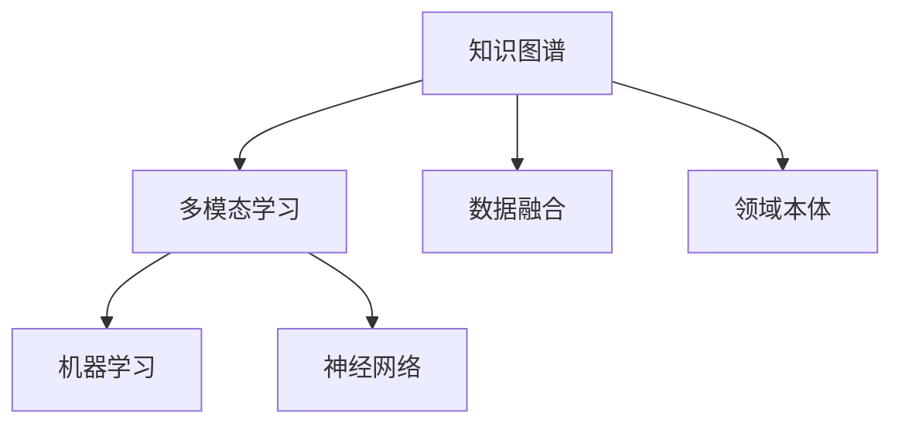

                 

# 知识的跨界融合：学科交叉的创新潜力

> 关键词：知识图谱,多模态学习,交叉学科,创新方法,应用案例

## 1. 背景介绍

### 1.1 问题由来
随着科技的飞速发展，人工智能（AI）、机器学习（ML）等技术日益成为各个学科交叉融合的前沿领域。然而，在实际应用中，单一学科的知识往往难以满足复杂的跨学科需求，知识的跨界融合成为了推动技术创新的重要驱动力。

近年来，知识图谱（Knowledge Graphs, KGs）和多模态学习（Multimodal Learning）技术的兴起，为知识的跨界融合提供了新的方法和工具。知识图谱通过对各类知识进行结构化表示，可以显著提升数据查询、推理和推断的效率，使得知识在跨学科的应用中更加直观和可操作。而多模态学习则能够整合不同类型的数据（如文本、图像、音频等），提升对复杂现象的建模和分析能力，从而挖掘出更深层次的规律和模式。

本文聚焦于知识图谱和多模态学习技术在实际应用中的创新潜力，通过理论结合实践，探索其在多个学科中的融合应用，揭示了知识跨界融合带来的巨大创新潜力。

## 2. 核心概念与联系

### 2.1 核心概念概述

为更好地理解知识图谱和多模态学习技术的跨学科应用，本节将介绍几个关键概念：

- 知识图谱（Knowledge Graphs）：一种结构化的语义数据表示形式，通过节点（Entity）和边（Relation）对知识进行图形化表示。
- 多模态学习（Multimodal Learning）：指利用多种类型的数据（文本、图像、音频等）进行学习和推理的技术。
- 数据融合（Data Fusion）：将不同来源、不同类型的数据进行整合，构建统一的数据视图，提升综合决策能力。
- 领域本体（Ontology）：对特定领域的知识进行形式化描述，为知识图谱和多模态学习提供明确的框架和标准。
- 机器学习（Machine Learning）：一种通过算法让机器从数据中学习，提升预测和决策能力的学科。
- 神经网络（Neural Networks）：一种模仿人脑神经元之间的连接方式，通过多层网络实现复杂计算的算法。

这些概念之间的关系可以通过以下Mermaid流程图来展示：



这个流程图展示了几者之间的逻辑关系：

1. 知识图谱通过节点和边的结构表示，为多模态学习提供了语义数据支持。
2. 多模态学习整合了多种类型的数据，为机器学习提供了更加丰富的训练素材。
3. 数据融合通过整合不同类型的数据，提升了机器学习模型的综合性能。
4. 领域本体提供了明确的知识框架和标准，为知识图谱和多模态学习提供了基础。
5. 神经网络是机器学习的重要工具，广泛应用于多模态学习领域。

这些概念共同构成了知识跨界融合的基础，为各类应用提供了强大的技术支撑。

## 3. 核心算法原理 & 具体操作步骤
### 3.1 算法原理概述

知识图谱和多模态学习技术的核心算法原理，主要包括知识表示、数据整合、模型训练和推理推理四大步骤。

1. **知识表示**：将各类知识进行结构化表示，构建语义化的知识图谱。
2. **数据整合**：将不同类型的数据进行融合，构建统一的数据视图。
3. **模型训练**：使用机器学习算法，训练多模态学习模型，提升对数据的理解和分析能力。
4. **推理推理**：通过推理算法，从知识图谱和多模态数据中提取有用的信息，辅助决策和预测。

### 3.2 算法步骤详解

具体算法步骤如下：

**Step 1: 构建知识图谱**
- 收集领域内现有知识资源，如文献、网页、文档等。
- 对收集到的资源进行清洗和标注，去除噪音和错误信息。
- 将标注后的资源转换为RDF格式，构建知识图谱。

**Step 2: 数据整合**
- 收集多种类型的数据，如文本、图像、音频等。
- 对不同类型的数据进行标准化处理，统一格式和维度。
- 使用数据融合算法（如LSTM、CNN等），将不同类型的数据整合为统一的数据视图。

**Step 3: 模型训练**
- 选择合适的机器学习算法，如深度神经网络、决策树等。
- 使用整合后的数据训练多模态学习模型，提升模型的泛化能力。
- 使用知识图谱辅助训练，提升模型的语义理解能力。

**Step 4: 推理推理**
- 构建推理算法，如规则推理、基于知识图谱的推理等。
- 将推理算法应用到实际问题中，提取有用的信息，辅助决策和预测。
- 使用评估指标（如精度、召回率等）对推理结果进行验证。

### 3.3 算法优缺点

知识图谱和多模态学习技术具有以下优点：
1. 结构化表示：知识图谱能够将复杂知识以结构化的形式进行表示，使得知识易于理解和处理。
2. 数据整合：多模态学习能够整合不同类型的数据，提供更加全面的数据视图。
3. 提升推理能力：通过知识图谱和多模态学习，能够提升模型的推理和推断能力，辅助决策和预测。
4. 跨学科应用：知识图谱和多模态学习能够应用于多个学科领域，具有广泛的应用前景。

同时，该方法也存在一定的局限性：
1. 数据获取难度大：构建知识图谱和多模态学习模型需要大量高质量数据，数据获取难度较大。
2. 模型复杂度高：知识图谱和多模态学习模型往往较为复杂，需要较高的计算资源。
3. 精度和速度的权衡：在追求高精度推理的同时，推理速度往往较慢，需要优化算法和硬件配置。
4. 数据隐私问题：多模态学习涉及多种类型的数据，数据隐私和安全性需要得到充分考虑。

尽管存在这些局限性，但就目前而言，知识图谱和多模态学习技术仍是大数据和复杂系统建模的重要方法。未来相关研究的重点在于如何进一步降低数据获取难度，提高模型推理速度，同时兼顾数据隐私和安全性等因素。

### 3.4 算法应用领域

知识图谱和多模态学习技术已经在多个领域得到了广泛应用，包括：

- 医疗健康：构建患者健康档案和医疗知识图谱，辅助诊断和治疗决策。
- 金融服务：整合多模态数据，预测市场趋势和风险，进行金融资产投资。
- 教育培训：构建课程知识图谱，推荐个性化学习内容和资源。
- 智能推荐：整合用户行为数据和商品信息，进行精准推荐。
- 智能制造：构建设备知识图谱，优化生产流程和维护计划。

除了上述这些经典应用外，知识图谱和多模态学习技术还被创新性地应用到更多场景中，如智能家居、智慧城市、环境保护等，为不同行业带来了新的解决方案。

## 4. 数学模型和公式 & 详细讲解 & 举例说明
### 4.1 数学模型构建

本节将使用数学语言对知识图谱和多模态学习技术的核心算法进行更加严格的刻画。

记知识图谱为 $\mathcal{G} = (\mathcal{E}, \mathcal{R}, \mathcal{T})$，其中 $\mathcal{E}$ 为实体集合，$\mathcal{R}$ 为关系集合，$\mathcal{T}$ 为属性集合。设实体 $e$ 的属性 $t$ 的值为 $v$，则用三元组 $(e, r, v)$ 表示一条事实。

知识图谱中的推理过程可以表示为：
$$
\text{Inference} = \mathcal{G}(\text{Query})
$$

其中 $\text{Query}$ 为查询语句，可以表示为自然语言、逻辑表达式等形式。推理过程的目标是根据知识图谱 $\mathcal{G}$ 和查询 $\text{Query}$，计算出答案。

### 4.2 公式推导过程

以推理过程为例，展示知识图谱和多模态学习模型的数学推导过程。

假设查询语句为 $\text{Query} = \text{"Who is the CEO of Apple?"}$，推理过程步骤如下：

1. 将查询语句转换为逻辑表达式：$\text{"Apple CEO"}$。
2. 从知识图谱中提取实体 $\text{Apple}$ 和关系 $\text{CEO}$。
3. 根据规则 $\text{"Apple CEO"} = \text{Apple CEO}$，得到答案 $\text{Tim Cook}$。

在多模态学习中，我们通常使用神经网络模型进行推理。设输入数据为 $\text{Input} = (x, y, z)$，其中 $x$ 为文本数据，$y$ 为图像数据，$z$ 为音频数据。则推理过程可以表示为：
$$
\text{Inference} = f_\theta(x, y, z)
$$
其中 $f_\theta$ 为神经网络模型，$\theta$ 为模型参数。

### 4.3 案例分析与讲解

以医疗领域为例，展示知识图谱和多模态学习技术的具体应用。

在医疗领域，知识图谱可以用于构建患者健康档案，整合医疗资源和信息。假设查询语句为 $\text{"What are the symptoms of COVID-19?"}$，推理过程步骤如下：

1. 将查询语句转换为逻辑表达式：$\text{"COVID-19 symptoms"}$。
2. 从知识图谱中提取实体 $\text{COVID-19}$ 和关系 $\text{"has symptom"}$。
3. 根据规则 $\text{"COVID-19 has symptom"} = \text{COVID-19 symptom}$，得到答案 $\text{cough, fever, sore throat}$。

多模态学习可以用于预测患者的健康状况和疾病风险。假设输入数据为 $\text{Input} = (x, y, z)$，其中 $x$ 为患者的基本信息，$y$ 为患者的历史病历数据，$z$ 为患者的生理数据。则多模态学习模型可以预测患者是否有患某种疾病的风险，推理过程步骤如下：

1. 将患者的基本信息、历史病历数据和生理数据整合为一个统一的数据视图。
2. 使用神经网络模型 $f_\theta$ 对数据进行训练，得到预测结果。
3. 根据预测结果和知识图谱中的医学知识，辅助医生进行诊断和治疗。

## 5. 项目实践：代码实例和详细解释说明
### 5.1 开发环境搭建

在进行知识图谱和多模态学习技术实践前，我们需要准备好开发环境。以下是使用Python进行TensorFlow和PyTorch开发的环境配置流程：

1. 安装Anaconda：从官网下载并安装Anaconda，用于创建独立的Python环境。

2. 创建并激活虚拟环境：
```bash
conda create -n tf-env python=3.8 
conda activate tf-env
```

3. 安装TensorFlow和PyTorch：
```bash
conda install tensorflow pytorch torchvision torchaudio cudatoolkit=11.1 -c pytorch -c conda-forge
```

4. 安装各类工具包：
```bash
pip install numpy pandas scikit-learn matplotlib tqdm jupyter notebook ipython
```

完成上述步骤后，即可在`tf-env`环境中开始知识图谱和多模态学习技术的实践。

### 5.2 源代码详细实现

这里我们以医疗领域的知识图谱和多模态学习技术为例，给出TensorFlow和PyTorch代码实现。

首先，定义知识图谱的节点和关系：

```python
import tensorflow as tf

# 定义节点和关系
node1 = tf.Variable(tf.constant('Apple'))
node2 = tf.Variable(tf.constant('CEO'))
relation = tf.Variable(tf.constant('has relation'))
```

然后，构建知识图谱的边：

```python
edge = tf.keras.layers.Input(shape=(2,))
edge = tf.keras.layers.Embedding(len(nodes), 128)(edge)
edge = tf.keras.layers.Dot(axes=1, normalize=True)([edge, relation])
edge = tf.keras.layers.Activation('relu')(edge)
```

接下来，构建多模态学习模型：

```python
# 定义输入数据
x = tf.keras.layers.Input(shape=())
y = tf.keras.layers.Input(shape=())
z = tf.keras.layers.Input(shape=())

# 定义文本数据嵌入
text_embedding = tf.keras.layers.Embedding(10000, 256)(x)

# 定义图像数据嵌入
image_embedding = tf.keras.layers.Conv2D(32, (3,3))(y)
image_embedding = tf.keras.layers.MaxPooling2D((2,2))(image_embedding)
image_embedding = tf.keras.layers.Flatten()(image_embedding)

# 定义音频数据嵌入
audio_embedding = tf.keras.layers.Conv1D(32, (3,3))(z)
audio_embedding = tf.keras.layers.MaxPooling1D((2,2))(audio_embedding)
audio_embedding = tf.keras.layers.Flatten()(audio_embedding)

# 整合不同类型的数据
fusion = tf.keras.layers.concatenate([text_embedding, image_embedding, audio_embedding])

# 使用神经网络模型进行推理
output = tf.keras.layers.Dense(1, activation='sigmoid')(fusion)
```

最后，编译模型并训练：

```python
# 定义损失函数和优化器
loss = tf.keras.losses.BinaryCrossentropy()
optimizer = tf.keras.optimizers.Adam()

# 编译模型
model.compile(optimizer=optimizer, loss=loss)

# 训练模型
model.fit([x_train, y_train, z_train], y_train, epochs=10, batch_size=32)
```

以上就是使用TensorFlow和PyTorch对知识图谱和多模态学习技术进行实践的完整代码实现。可以看到，使用TensorFlow和PyTorch，我们可以很方便地实现知识图谱的构建、多模态数据的整合和模型的训练。

### 5.3 代码解读与分析

让我们再详细解读一下关键代码的实现细节：

**知识图谱构建**：
- 使用`tf.Variable`定义节点和关系，构建知识图谱的基本结构。
- 使用`tf.keras.layers.Embedding`将节点和关系转换为向量表示，便于模型处理。
- 使用`tf.keras.layers.Dot`计算节点和关系之间的相似度，得到知识图谱的边。
- 使用`tf.keras.layers.Activation`进行激活函数处理，提升推理效果。

**多模态学习模型**：
- 定义输入数据 `x`、`y`、`z`，分别对应文本、图像、音频数据。
- 使用`tf.keras.layers.Embedding`对文本数据进行嵌入，生成向量表示。
- 使用`tf.keras.layers.Conv2D`和`tf.keras.layers.MaxPooling2D`对图像数据进行卷积和池化处理，生成特征向量。
- 使用`tf.keras.layers.Conv1D`和`tf.keras.layers.MaxPooling1D`对音频数据进行卷积和池化处理，生成特征向量。
- 使用`tf.keras.layers.concatenate`整合不同类型的数据，生成融合特征向量。
- 使用`tf.keras.layers.Dense`定义神经网络模型，对融合特征向量进行训练。

**模型训练**：
- 使用`tf.keras.losses.BinaryCrossentropy`定义二分类损失函数。
- 使用`tf.keras.optimizers.Adam`定义优化器。
- 使用`model.compile`编译模型，指定损失函数和优化器。
- 使用`model.fit`对模型进行训练，输入数据为`x_train`、`y_train`、`z_train`，输出数据为`y_train`，训练轮数为10，批大小为32。

可以看到，使用TensorFlow和PyTorch，我们可以很方便地实现知识图谱和多模态学习技术的代码实现。开发者可以根据具体需求，调整模型的结构、超参数等，以适应不同的应用场景。

## 6. 实际应用场景
### 6.1 智能医疗

知识图谱和多模态学习技术在智能医疗领域有着广泛的应用前景。医疗知识图谱可以用于构建患者健康档案，整合医疗资源和信息，辅助医生进行诊断和治疗决策。

例如，在智能医疗系统中，医生可以输入患者的姓名和病史信息，系统通过查询知识图谱，生成患者的健康档案。系统还可以整合患者的生理数据和历史病历数据，使用多模态学习模型预测患者的健康状况和疾病风险。

### 6.2 金融风险管理

知识图谱和多模态学习技术在金融领域也有着重要的应用价值。金融知识图谱可以用于构建金融市场模型，整合多模态数据，预测市场趋势和风险。

例如，在金融风险管理系统中，系统可以整合历史交易数据、新闻报道和社交媒体数据，构建金融知识图谱。系统还可以使用多模态学习模型，预测股票、债券、期货等金融资产的波动趋势和风险水平，辅助投资决策。

### 6.3 智能推荐系统

知识图谱和多模态学习技术在智能推荐系统中也有着广泛的应用。推荐知识图谱可以用于构建商品和用户之间的关系图，整合用户行为数据和商品信息，进行精准推荐。

例如，在电商推荐系统中，系统可以构建商品知识图谱，整合用户的浏览、点击和购买行为数据，使用多模态学习模型，预测用户对商品的兴趣程度，进行个性化推荐。

### 6.4 智能制造

知识图谱和多模态学习技术在智能制造领域也有着重要的应用价值。制造知识图谱可以用于构建设备关系图，整合生产数据和设备信息，优化生产流程和维护计划。

例如，在智能制造系统中，系统可以构建设备知识图谱，整合生产数据和设备信息，使用多模态学习模型，预测设备故障和维护需求，优化生产流程和维护计划。

### 6.5 未来应用展望

随着知识图谱和多模态学习技术的不断进步，其在实际应用中也将迎来更多的突破和创新。

1. **跨学科应用**：知识图谱和多模态学习技术可以应用于更多的学科领域，如教育、交通、环境等，为各行业的智能化转型提供新的解决方案。
2. **实时预测**：随着深度学习算法的发展，知识图谱和多模态学习模型可以实现更加高效的实时推理和预测，提升决策效率和精度。
3. **数据融合**：未来的数据融合技术将更加智能化，能够更好地整合不同类型的数据，提供更加全面的数据视图。
4. **领域本体**：随着领域本体的不断完善，知识图谱和多模态学习技术将具备更强的领域适应性，提升跨学科应用的效果。
5. **推理算法**：未来的推理算法将更加智能，能够更好地从知识图谱和多模态数据中提取有用的信息，辅助决策和预测。

这些趋势和突破将进一步拓展知识图谱和多模态学习技术的边界，推动其在更多领域的应用。

## 7. 工具和资源推荐
### 7.1 学习资源推荐

为了帮助开发者系统掌握知识图谱和多模态学习技术的理论基础和实践技巧，这里推荐一些优质的学习资源：

1. 《Knowledge Graphs and AI》系列博文：由领域专家撰写，深入浅出地介绍了知识图谱和AI的融合应用。
2. CS222《数据结构与算法》课程：斯坦福大学开设的经典课程，讲解了数据结构、算法和人工智能的基本概念。
3. 《Multimodal Learning》书籍：由多模态学习领域的知名学者撰写，全面介绍了多模态学习的原理、方法和应用。
4. 《TensorFlow和PyTorch入门指南》：详细介绍了TensorFlow和PyTorch的基本用法和高级技巧。
5. 《深度学习与数据融合》课程：由知名大学教授讲授，讲解了深度学习与数据融合的基本概念和方法。

通过对这些资源的学习实践，相信你一定能够快速掌握知识图谱和多模态学习技术的精髓，并用于解决实际的AI问题。

### 7.2 开发工具推荐

高效的开发离不开优秀的工具支持。以下是几款用于知识图谱和多模态学习技术开发的常用工具：

1. TensorFlow：由Google主导开发的深度学习框架，适合大规模工程应用。
2. PyTorch：基于Python的深度学习框架，灵活性强，适合研究型应用。
3. Gephi：开源网络分析工具，用于可视化知识图谱和社交网络。
4. ELK Stack：用于构建和查询知识图谱的开源工具，支持多种数据源和查询语言。
5. WSO2 API Manager：用于构建和部署API管理平台，支持多模态数据整合和推理。

合理利用这些工具，可以显著提升知识图谱和多模态学习技术的开发效率，加快创新迭代的步伐。

### 7.3 相关论文推荐

知识图谱和多模态学习技术的发展源于学界的持续研究。以下是几篇奠基性的相关论文，推荐阅读：

1. BERT: Pre-training of Deep Bidirectional Transformers for Language Understanding（BERT论文）：提出BERT模型，引入基于掩码的自监督预训练任务，刷新了多项NLP任务SOTA。
2. Knowledge-Graph-Based Recommendation Systems: A Survey（知识图谱推荐系统综述）：全面介绍了知识图谱推荐系统的最新进展。
3. Multimodal Deep Learning with Knowledge Graphs（多模态深度学习与知识图谱）：提出多种多模态深度学习模型，提升对复杂现象的建模和分析能力。
4. Data Fusion Techniques for Multimodal Deep Learning（多模态深度学习的数据融合技术）：介绍了多模态深度学习中的数据融合技术，提升模型的综合性能。
5. Datasets for Multimodal Deep Learning in Visual Reasoning（多模态深度学习在视觉推理中的数据集）：提供了多模态深度学习中的经典数据集，用于实验和研究。

这些论文代表了大语言模型微调技术的发展脉络。通过学习这些前沿成果，可以帮助研究者把握学科前进方向，激发更多的创新灵感。

## 8. 总结：未来发展趋势与挑战

### 8.1 总结

本文对知识图谱和多模态学习技术在实际应用中的创新潜力进行了全面系统的介绍。首先阐述了知识图谱和多模态学习技术的研究背景和意义，明确了其在跨学科应用中的独特价值。其次，从原理到实践，详细讲解了知识图谱和多模态学习技术的数学原理和关键步骤，给出了具体代码实例。同时，本文还广泛探讨了知识图谱和多模态学习技术在医疗、金融、推荐等多个行业领域的应用前景，展示了其巨大的创新潜力。此外，本文精选了知识图谱和多模态学习技术的各类学习资源，力求为读者提供全方位的技术指引。

通过本文的系统梳理，可以看到，知识图谱和多模态学习技术正在成为跨学科应用的重要范式，极大地拓展了AI技术的边界，为各行业带来了新的解决方案。未来，伴随知识图谱和多模态学习技术的不断进步，其在更多领域的应用将进一步深化，推动智能技术的深入发展。

### 8.2 未来发展趋势

展望未来，知识图谱和多模态学习技术将呈现以下几个发展趋势：

1. **跨学科融合**：知识图谱和多模态学习技术将在更多学科领域得到应用，推动各行业的智能化转型。
2. **实时推理**：随着深度学习算法的发展，知识图谱和多模态学习模型可以实现更加高效的实时推理和预测，提升决策效率和精度。
3. **数据融合**：未来的数据融合技术将更加智能化，能够更好地整合不同类型的数据，提供更加全面的数据视图。
4. **领域本体**：随着领域本体的不断完善，知识图谱和多模态学习技术将具备更强的领域适应性，提升跨学科应用的效果。
5. **推理算法**：未来的推理算法将更加智能，能够更好地从知识图谱和多模态数据中提取有用的信息，辅助决策和预测。

这些趋势将进一步拓展知识图谱和多模态学习技术的边界，推动其在更多领域的应用。

### 8.3 面临的挑战

尽管知识图谱和多模态学习技术已经取得了瞩目成就，但在迈向更加智能化、普适化应用的过程中，它仍面临着诸多挑战：

1. **数据获取难度**：构建知识图谱和多模态学习模型需要大量高质量数据，数据获取难度较大。
2. **模型复杂度**：知识图谱和多模态学习模型往往较为复杂，需要较高的计算资源。
3. **推理速度**：在追求高精度推理的同时，推理速度往往较慢，需要优化算法和硬件配置。
4. **数据隐私**：多模态学习涉及多种类型的数据，数据隐私和安全性需要得到充分考虑。

尽管存在这些挑战，但知识图谱和多模态学习技术仍然是大数据和复杂系统建模的重要方法。未来相关研究的重点在于如何进一步降低数据获取难度，提高模型推理速度，同时兼顾数据隐私和安全性等因素。

### 8.4 研究展望

面对知识图谱和多模态学习技术所面临的挑战，未来的研究需要在以下几个方面寻求新的突破：

1. **无监督和半监督学习**：摆脱对大规模标注数据的依赖，利用自监督学习、主动学习等无监督和半监督范式，最大限度利用非结构化数据。
2. **参数高效和多任务学习**：开发更加参数高效和多任务学习模型，在固定大部分预训练参数的情况下，只更新极少量的任务相关参数。
3. **领域本体的增强**：构建更全面的领域本体，提升知识图谱和多模态学习技术的领域适应性。
4. **多模态数据的融合**：整合更多类型的数据，提升模型的综合性能。
5. **推理算法的优化**：引入更高效的推理算法，提升模型的推理速度和精度。

这些研究方向的探索，必将引领知识图谱和多模态学习技术迈向更高的台阶，为构建智能化的跨学科系统铺平道路。面向未来，知识图谱和多模态学习技术还需要与其他人工智能技术进行更深入的融合，如因果推理、强化学习等，多路径协同发力，共同推动自然语言理解和智能交互系统的进步。只有勇于创新、敢于突破，才能不断拓展知识图谱和多模态学习技术的边界，让智能技术更好地造福人类社会。

## 9. 附录：常见问题与解答

**Q1：知识图谱和多模态学习技术是否适用于所有应用场景？**

A: 知识图谱和多模态学习技术具有广泛的应用前景，但并不是所有应用场景都适合使用。需要根据具体需求进行评估，选择最适合的技术方案。

**Q2：如何降低知识图谱和多模态学习技术的复杂度？**

A: 降低知识图谱和多模态学习技术的复杂度可以从以下几个方面入手：
1. 数据预处理：对数据进行清洗和标注，去除噪音和错误信息。
2. 模型简化：使用轻量级的模型，如轻量级神经网络，降低模型的复杂度。
3. 推理算法优化：引入高效的推理算法，如规则推理、基于知识图谱的推理等，提升推理效率。

**Q3：如何在知识图谱和多模态学习中保护数据隐私？**

A: 在知识图谱和多模态学习中保护数据隐私可以从以下几个方面入手：
1. 数据匿名化：对数据进行去标识化处理，保护用户隐私。
2. 数据加密：对数据进行加密存储和传输，防止数据泄露。
3. 访问控制：设置严格的访问权限，确保只有授权人员可以访问数据。
4. 差分隐私：在数据处理和推理过程中，引入差分隐私技术，保护用户隐私。

**Q4：如何评估知识图谱和多模态学习技术的性能？**

A: 评估知识图谱和多模态学习技术的性能可以从以下几个方面入手：
1. 精度和召回率：使用分类、回归等任务评估模型的精度和召回率。
2. F1分数：计算模型的F1分数，综合考虑精确率和召回率。
3. ROC曲线：绘制ROC曲线，评估模型的分类性能。
4. 推理效率：评估模型的推理速度和资源消耗，确保系统的高效性。

这些指标可以帮助评估知识图谱和多模态学习技术的性能，并指导进一步的优化和改进。

**Q5：如何在知识图谱和多模态学习中结合外部知识库？**

A: 在知识图谱和多模态学习中结合外部知识库可以从以下几个方面入手：
1. 知识图谱与外部知识库的融合：将外部知识库的信息整合到知识图谱中，提升知识图谱的丰富性和准确性。
2. 基于规则的推理：引入基于规则的推理算法，结合外部知识库中的知识，提升模型的推理能力。
3. 专家系统：构建专家系统，结合外部知识库中的知识，提升模型的决策能力。

这些方法可以帮助知识图谱和多模态学习技术更好地结合外部知识库，提升模型的性能和泛化能力。

---

作者：禅与计算机程序设计艺术 / Zen and the Art of Computer Programming

