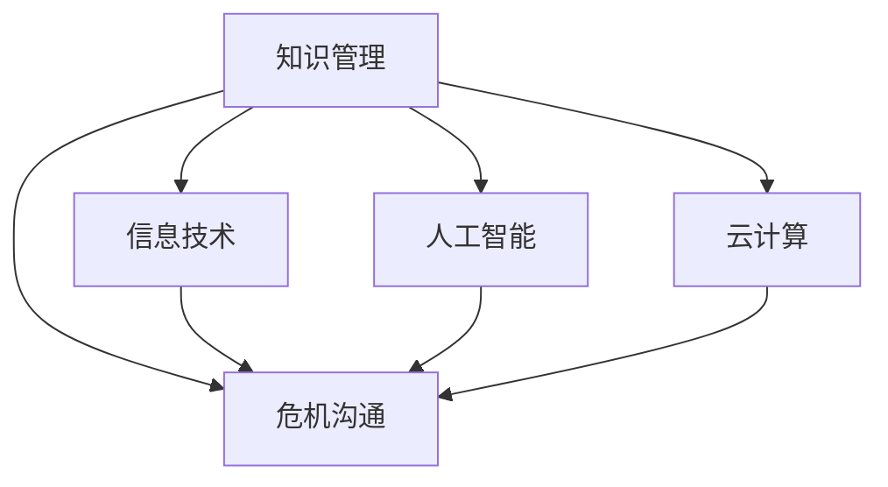

                 

# 知识管理在危机沟通中的作用

## 1. 背景介绍

### 1.1 问题由来
在现代社会，企业面临的危机种类和复杂度日益增加，无论是自然灾害、安全事故、公共健康危机还是市场风险，都对企业的品牌声誉和运营安全构成了严峻的威胁。危机沟通作为企业应对危机的核心策略，成为企业不可或缺的内部管理能力之一。有效的危机沟通不仅能及时化解危机，还能增强企业的公信力和市场竞争力。

### 1.2 问题核心关键点
危机沟通的核心是信息的有效传递和组织。在危机情境下，企业需要迅速、准确地获取、处理和共享相关知识，制定应对措施，并对外发布官方声明，保持公众的信任和理解。传统的危机沟通多依赖人工经验和直觉，缺乏系统化的知识管理和决策支持。随着信息技术和人工智能的发展，知识管理在危机沟通中的应用逐步受到重视。

## 2. 核心概念与联系

### 2.1 核心概念概述

为更好地理解知识管理在危机沟通中的作用，本节将介绍几个密切相关的核心概念：

- **知识管理(Knowledge Management, KM)**：指通过信息技术手段，对企业内部和外部的知识进行获取、存储、共享、应用和创新的全生命周期管理。知识管理的目标是最大化知识资源的价值，提升企业的决策能力和创新能力。

- **危机沟通(Crisis Communication)**：指在危机情境下，企业通过信息传递和沟通策略，与公众、利益相关者、媒体等进行有效互动，消除误解，重建信任，维护企业声誉的过程。危机沟通需要快速反应、准确传递和及时反馈。

- **信息技术(Information Technology, IT)**：涵盖计算机硬件、软件、网络通信等技术和工具，是支持知识管理和危机沟通的重要基础设施。信息技术使得知识的获取和共享更加高效、便捷。

- **人工智能(Artificial Intelligence, AI)**：一种模拟人类智能行为的计算机技术，包括机器学习、自然语言处理、计算机视觉等方向。AI技术能够对海量数据进行深度分析，提供精确的知识提取、智能决策和高效沟通解决方案。

- **云计算(Cloud Computing)**：通过互联网提供计算资源和服务的模式，支持企业进行大规模知识管理和协作。云计算平台能够实现数据的分布式存储和处理，保障知识管理的稳定性和可扩展性。

这些核心概念之间的逻辑关系可以通过以下Mermaid流程图来展示：



这个流程图展示的知识管理在危机沟通中的核心概念及其之间的关系：

1. 知识管理通过信息技术、人工智能和云计算，支持企业构建知识库，实现知识的获取、存储和共享。
2. 危机沟通利用知识管理获取的决策支持，结合信息技术、人工智能和云计算平台，进行信息传递和沟通策略的设计和实施。
3. 信息技术、人工智能和云计算为知识管理提供技术保障，同时也扩展了危机沟通的手段和范围。

## 3. 核心算法原理 & 具体操作步骤
### 3.1 算法原理概述

知识管理在危机沟通中的作用，主要体现在以下几个方面：

- **知识获取**：从企业内外环境获取相关信息，构建知识库。
- **知识存储**：使用数据库和分布式存储技术，存储和管理各类知识资源。
- **知识共享**：通过内部网、知识管理系统等平台，促进企业内部员工之间的知识交流和协作。
- **知识应用**：将知识应用于决策支持、业务流程优化等各个环节，提升企业运营效率。
- **知识创新**：通过分析、挖掘和整合各类知识，不断创新和改进企业的应对策略。

危机沟通中的知识管理，需要通过以下步骤实现：

1. **知识采集与整理**：收集与危机相关的信息，并进行分类、标注和标准化。
2. **知识存储与索引**：构建知识库，设计合理的知识存储结构和索引机制，方便快速检索。
3. **知识检索与推荐**：设计知识检索和推荐算法，根据用户需求和情境，提供相关的知识信息。
4. **知识应用与生成**：将知识应用于危机决策、应急响应和公关策略的设计，生成应对措施和宣传材料。
5. **知识评估与反馈**：定期评估知识管理的效果，收集反馈意见，持续优化知识管理流程。

### 3.2 算法步骤详解

#### 3.2.1 知识采集与整理

1. **信息收集**：从新闻媒体、社交网络、客户反馈等多个渠道，收集与危机相关的信息。
2. **数据清洗**：去除重复、无关和错误的信息，进行数据清洗和预处理。
3. **分类与标注**：根据内容类型和紧急程度，将信息分类并标注关键词，便于后续处理和检索。
4. **标准化**：将信息转换为标准化的数据格式，确保信息的一致性和可用性。

#### 3.2.2 知识存储与索引

1. **构建知识库**：使用关系数据库或文档数据库，构建企业内部的知识库系统。
2. **设计存储结构**：根据知识的类型和结构，设计合理的数据存储结构和索引机制，支持快速检索。
3. **数据管理**：实施数据备份和恢复策略，确保数据的可靠性和完整性。

#### 3.2.3 知识检索与推荐

1. **检索算法设计**：使用文本匹配、分类、聚类等算法，设计高效的知识检索模型。
2. **推荐算法设计**：结合用户的查询行为和兴趣，设计个性化的知识推荐算法，提供相关知识的自动推送。
3. **实时检索与推荐**：设计实时化的检索和推荐系统，确保在危机情境下快速响应。

#### 3.2.4 知识应用与生成

1. **决策支持**：使用知识管理工具，提取与危机相关的知识和统计数据，辅助决策者进行快速分析和判断。
2. **应急响应**：根据知识管理平台提供的信息，制定详细的应急响应计划和操作步骤，确保及时有效地应对危机。
3. **公关材料生成**：利用知识管理平台生成的文档和数据，制作新闻稿、声明函、报告等公关材料，发布于各大媒体。

#### 3.2.5 知识评估与反馈

1. **效果评估**：定期评估知识管理的实施效果，使用指标如响应时间、问题解决率、用户满意度等进行衡量。
2. **反馈机制**：建立知识管理的反馈机制，收集内部员工的建议和意见，持续优化知识管理流程。
3. **持续改进**：根据反馈意见和评估结果，调整知识管理策略和算法，不断提升危机沟通的效果。

### 3.3 算法优缺点

知识管理在危机沟通中的主要优点包括：

- **快速响应**：通过知识管理，企业可以快速获取相关信息，制定应对策略，缩短响应时间。
- **决策支持**：知识管理提供的信息和分析结果，可以帮助企业做出更加精准和快速的决策。
- **知识共享**：知识管理促进了企业内部的信息交流和协作，提升了团队的创新能力和应对能力。
- **降低成本**：知识管理减少了对人工决策的依赖，降低了危机沟通的运营成本。
- **提升公信力**：通过规范的信息发布和透明的知识管理，提升了企业的公信力和品牌声誉。

然而，知识管理在危机沟通中也存在一些缺点：

- **数据质量依赖**：知识管理的效果很大程度上依赖于数据的质量和全面性，若数据收集不充分或错误，会影响决策的准确性。
- **技术复杂性**：知识管理的实施需要复杂的技术支持，对企业内部信息系统的要求较高。
- **人员培训难度**：知识管理的成功实施需要员工的积极参与和持续培训，否则难以发挥其应有的效果。
- **隐私和安全问题**：在知识管理的实施过程中，可能涉及敏感信息，需加强隐私保护和安全管理。

### 3.4 算法应用领域

知识管理在危机沟通中的应用范围广泛，以下是几个主要领域：

1. **企业内部应急响应**：企业内部发生火灾、地震等紧急情况时，通过知识管理快速获取相关知识和应急措施，保障员工安全。
2. **公共安全危机处理**：政府部门在应对公共安全危机（如恐怖袭击、自然灾害）时，通过知识管理整合信息资源，协调各部门的应急响应。
3. **市场风险管理**：金融机构在应对金融危机时，通过知识管理获取市场动向和经济预测，调整投资策略，降低风险。
4. **公共健康危机应对**：医疗机构在应对新冠疫情等公共健康危机时，通过知识管理共享病例信息、治疗方案，提升医疗决策的效率和效果。
5. **品牌危机公关**：企业在品牌遭遇负面事件时，通过知识管理制定公关策略，制作声明函、发布新闻稿，进行危机公关。
6. **合规与法律支持**：企业在应对法律诉讼、合规检查时，通过知识管理获取相关法律法规和案例，制定应对方案。

## 4. 数学模型和公式 & 详细讲解 & 举例说明

### 4.1 数学模型构建

知识管理在危机沟通中的作用可以通过以下几个数学模型来描述：

- **知识库模型**：$KM = (D, S, I, R)$，其中 $D$ 为知识库的存储结构，$S$ 为知识库中的知识，$I$ 为知识检索算法，$R$ 为知识推荐算法。
- **决策支持模型**：$DS = (K, P, A)$，其中 $K$ 为知识库，$P$ 为决策者，$A$ 为应对措施。
- **应急响应模型**：$ER = (C, P, R)$，其中 $C$ 为危机情境，$P$ 为应对计划，$R$ 为应急响应流程。
- **公关材料生成模型**：$PMG = (D, T, O)$，其中 $D$ 为知识库，$T$ 为文本生成算法，$O$ 为宣传材料。
- **效果评估模型**：$EA = (S, R, U, F)$，其中 $S$ 为满意度指标，$R$ 为响应时间，$U$ 为问题解决率，$F$ 为用户反馈。

### 4.2 公式推导过程

以知识库模型为例，知识库的存储结构可以表示为：

$$
D = (C_1, C_2, ..., C_n)
$$

其中 $C_i$ 为知识库中的第 $i$ 个知识条目，包含关键信息、关联知识点和存储地址。

知识库中的知识 $S$ 可以表示为：

$$
S = \{(s_1, k_1), (s_2, k_2), ..., (s_m, k_m)\}
$$

其中 $s_j$ 为第 $j$ 个知识内容，$k_j$ 为该知识的关键字和类别。

知识检索算法 $I$ 可以表示为：

$$
I = (q, k, c)
$$

其中 $q$ 为用户输入的查询字符串，$k$ 为查询关键字，$c$ 为检索结果。

知识推荐算法 $R$ 可以表示为：

$$
R = (u, r, s)
$$

其中 $u$ 为用户行为和兴趣，$r$ 为推荐结果，$s$ 为推荐策略。

### 4.3 案例分析与讲解

假设企业遇到一起公共安全危机，需要快速制定应对措施和发布声明。知识管理平台通过以下步骤实现：

1. **知识采集与整理**：平台自动从新闻网站、社交媒体、企业内部邮件等多个渠道，收集与危机相关的信息，并进行分类、标注和标准化。
2. **知识存储与索引**：构建企业内部的知识库，使用文本匹配算法将信息分类，设计合理的索引机制，确保快速检索。
3. **知识检索与推荐**：用户通过输入查询字符串，平台使用检索算法迅速找到相关知识，并根据用户行为和兴趣，推荐相关的应急响应计划和公关策略。
4. **知识应用与生成**：根据知识管理平台提供的建议，决策者迅速制定应对措施，并使用文本生成算法，自动制作声明函和新闻稿，发布于各大媒体。
5. **知识评估与反馈**：定期评估知识管理的实施效果，收集用户和员工的反馈意见，持续优化知识管理流程。

## 5. 项目实践：代码实例和详细解释说明

### 5.1 开发环境搭建

在进行知识管理项目实践前，我们需要准备好开发环境。以下是使用Python进行知识管理系统开发的常见环境配置流程：

1. 安装Python：从官网下载并安装最新版本的Python，例如Python 3.9或更高版本。
2. 安装Pip：在Python环境下安装Pip，命令为 `python -m ensurepip --default-pip`。
3. 安装相关依赖：使用Pip安装必要的依赖包，例如Flask、SQLAlchemy、NLTK等。
4. 创建虚拟环境：使用Virtualenv创建虚拟环境，命令为 `python -m venv env`。
5. 激活虚拟环境：进入虚拟环境，命令为 `source env/bin/activate`。

### 5.2 源代码详细实现

下面是一个基于Flask框架和SQLAlchemy数据库的知识管理系统示例代码，实现了知识采集、存储、检索和推荐的基本功能：

```python
from flask import Flask, request, jsonify
from sqlalchemy import create_engine, Column, Integer, String
from sqlalchemy.orm import sessionmaker
from sqlalchemy.ext.declarative import declarative_base
from sklearn.feature_extraction.text import TfidfVectorizer
from sklearn.metrics.pairwise import cosine_similarity
import nltk
nltk.download('stopwords')
from nltk.corpus import stopwords

# 创建数据库连接
engine = create_engine('sqlite:///test.db')
Session = sessionmaker(bind=engine)
session = Session()

# 定义知识库模型
Base = declarative_base()

class Knowledge(Base):
    __tablename__ = 'knowledge'
    id = Column(Integer, primary_key=True)
    content = Column(String)
    category = Column(String)
    keywords = Column(String)
    created_at = Column(Integer)

# 初始化数据库
Base.metadata.create_all(engine)

# 创建知识库
def create_knowledge(content, category, keywords):
    new_knowledge = Knowledge(content=content, category=category, keywords=keywords)
    session.add(new_knowledge)
    session.commit()

# 获取知识库
def get_knowledge_by_id(id):
    return session.query(Knowledge).get(id)

# 获取相关知识
def get_related_knowledge(query):
    stop_words = set(stopwords.words('english'))
    query = query.lower().translate(str.maketrans('', '', string.punctuation))
    query = ' '.join([word for word in query.split() if word not in stop_words])
    tfidf = TfidfVectorizer()
    tfidf_matrix = tfidf.fit_transform([k.content for k in session.query(Knowledge).all()])
    query_tfidf = tfidf.transform([query])
    similarity = cosine_similarity(query_tfidf, tfidf_matrix)
    related_ids = [i for i, s in enumerate(similarity[0]) if s > 0.8]
    return [get_knowledge_by_id(i) for i in related_ids]

# 创建Flask应用
app = Flask(__name__)

# 定义API接口
@app.route('/knowledge', methods=['POST'])
def add_knowledge():
    data = request.json
    create_knowledge(data['content'], data['category'], data['keywords'])
    return jsonify({'message': '知识已添加'})

@app.route('/knowledge/<int:id>', methods=['GET'])
def get_knowledge(id):
    knowledge = get_knowledge_by_id(id)
    if knowledge:
        return jsonify({'id': knowledge.id, 'content': knowledge.content, 'category': knowledge.category, 'keywords': knowledge.keywords})
    else:
        return jsonify({'error': '知识不存在'})

@app.route('/knowledge/related', methods=['POST'])
def get_related():
    data = request.json
    query = data['query']
    related_knowledges = get_related_knowledge(query)
    return jsonify([{'id': k.id, 'content': k.content, 'category': k.category, 'keywords': k.keywords} for k in related_knowledges])

# 启动应用
if __name__ == '__main__':
    app.run(debug=True)
```

### 5.3 代码解读与分析

让我们再详细解读一下关键代码的实现细节：

**create_knowledge函数**：
- 创建知识库实体，存储知识内容、类别、关键字和时间戳。

**get_knowledge_by_id函数**：
- 根据ID获取知识库实体的信息，用于查询和显示。

**get_related_knowledge函数**：
- 利用TF-IDF算法计算查询字符串与知识库中所有知识的相似度，返回与查询字符串最相关的知识。

**Flask应用**：
- 定义API接口，使用POST和GET方法添加和查询知识库。
- 使用Flask的路由机制，实现不同的API接口。

### 5.4 运行结果展示

运行上述代码后，启动Flask应用，通过以下命令访问：

```bash
python app.py
```

在浏览器中访问 `http://localhost:5000`，可以看到知识管理系统的UI界面，可以进行知识的添加、查询和相关知识推荐。

## 6. 实际应用场景

### 6.1 企业内部应急响应

在企业内部发生火灾等紧急情况时，知识管理平台可以快速获取相关应急预案、物资清单、疏散路线等信息，帮助员工迅速响应。例如，知识管理平台可以提供以下功能：

- **应急预案查询**：根据事故类型，查询相关的应急预案和操作指南。
- **物资清单查询**：根据事故类型，查询所需的物资清单和存放位置。
- **疏散路线查询**：根据事故地点，查询最近的疏散路线和安全出口。

### 6.2 公共安全危机处理

政府部门在应对恐怖袭击、自然灾害等公共安全危机时，知识管理平台可以快速整合各类信息资源，提供全面的应急响应支持。例如，知识管理平台可以提供以下功能：

- **信息整合**：整合各类新闻报道、社交媒体信息、应急预案等，形成综合的危机情况报告。
- **决策支持**：根据危机情况，推荐相关政策、法律和案例，支持决策者制定应对方案。
- **物资调配**：根据需求，调用物资库存信息，生成物资调配方案。

### 6.3 市场风险管理

金融机构在应对股市崩盘、汇率波动等市场风险时，知识管理平台可以快速获取市场动向、经济预测和风险评估，制定应对策略。例如，知识管理平台可以提供以下功能：

- **市场动向查询**：查询最新的市场新闻、分析报告和专家观点。
- **经济预测查询**：查询相关的经济预测模型和统计数据。
- **风险评估查询**：查询市场风险评估报告和案例。

### 6.4 公共健康危机应对

医疗机构在应对新冠疫情等公共健康危机时，知识管理平台可以快速获取病例信息、治疗方案和物资调配等信息，提升医疗决策的效率和效果。例如，知识管理平台可以提供以下功能：

- **病例信息查询**：查询最新的病例数据和流行病学信息。
- **治疗方案查询**：查询相关的治疗方案和药物信息。
- **物资调配查询**：查询物资库存和调配方案。

### 6.5 品牌危机公关

企业在品牌遭遇负面事件时，知识管理平台可以快速制定公关策略，制作声明函和新闻稿，进行危机公关。例如，知识管理平台可以提供以下功能：

- **声明函生成**：根据用户输入的关键词和情感分析结果，生成声明函草稿。
- **新闻稿生成**：根据用户输入的信息和背景，生成新闻稿草稿。
- **舆论分析**：分析社交媒体上的舆论趋势和情感倾向。

## 7. 工具和资源推荐

### 7.1 学习资源推荐

为了帮助开发者系统掌握知识管理在危机沟通中的应用，这里推荐一些优质的学习资源：

1. **《知识管理与组织学习》**：该书详细介绍了知识管理的理论基础和实践方法，适合对知识管理感兴趣的学习者。
2. **《危机沟通管理》**：该书从危机管理的角度，系统讲解了危机沟通的理论和实践方法，适合企业公关和应急响应人员。
3. **《人工智能在知识管理中的应用》**：该书探讨了人工智能技术在知识管理中的应用，适合对AI技术感兴趣的学习者。
4. **《Python知识管理》**：该书介绍了Python在知识管理中的应用，适合Python开发者。
5. **《Flask Web应用开发实战》**：该书介绍了Flask框架的开发方法，适合Flask开发者。

通过对这些资源的学习实践，相信你一定能够快速掌握知识管理在危机沟通中的应用，并用于解决实际的危机管理问题。

### 7.2 开发工具推荐

高效的开发离不开优秀的工具支持。以下是几款用于知识管理系统的常用工具：

1. **Flask**：轻量级Web框架，易于上手，适合快速开发原型。
2. **SQLAlchemy**：Python ORM框架，支持复杂的数据库操作，适合关系型数据库。
3. **NLTK**：自然语言处理工具包，支持文本分析、情感分析等任务。
4. **Scikit-learn**：机器学习库，支持文本向量化和相似度计算。
5. **TensorFlow**：深度学习框架，支持复杂的模型训练和部署。
6. **Jupyter Notebook**：交互式开发环境，支持代码调试和文档编辑。

合理利用这些工具，可以显著提升知识管理系统的开发效率，加快创新迭代的步伐。

### 7.3 相关论文推荐

知识管理在危机沟通中的应用源于学界的持续研究。以下是几篇奠基性的相关论文，推荐阅读：

1. **《Knowledge Management in Crisis Communication》**：该论文探讨了知识管理在危机沟通中的作用，分析了相关理论和方法。
2. **《Crisis Communication and Information Technology》**：该论文从信息技术的角度，分析了危机沟通的过程和挑战。
3. **《Artificial Intelligence and Knowledge Management》**：该论文探讨了AI技术在知识管理中的应用，分析了相关案例和效果。
4. **《A Survey on Knowledge Management in Crisis Communication》**：该论文综述了知识管理在危机沟通中的应用，分析了当前的研究进展和未来方向。

这些论文代表了大语言模型微调技术的发展脉络。通过学习这些前沿成果，可以帮助研究者把握学科前进方向，激发更多的创新灵感。

## 8. 总结：未来发展趋势与挑战

### 8.1 总结

本文对知识管理在危机沟通中的作用进行了全面系统的介绍。首先阐述了知识管理在危机沟通中的研究背景和意义，明确了知识管理在危机沟通中的核心作用。其次，从原理到实践，详细讲解了知识管理的数学模型和操作步骤，给出了知识管理系统开发的完整代码实例。同时，本文还广泛探讨了知识管理在多个行业领域的应用场景，展示了知识管理范式的广阔前景。最后，本文精选了知识管理的相关学习资源，力求为读者提供全方位的技术指引。

通过本文的系统梳理，可以看到，知识管理在危机沟通中扮演了重要的角色，极大提升了企业的应急响应和决策支持能力。知识管理为危机沟通提供了科学、系统、高效的解决方案，推动了企业危机应对的现代化和智能化进程。

### 8.2 未来发展趋势

展望未来，知识管理在危机沟通中将呈现以下几个发展趋势：

1. **智能化水平提升**：随着AI技术的不断进步，知识管理将更加智能化和自动化，能够更好地处理复杂的危机情境和海量数据。
2. **跨领域应用拓展**：知识管理将不仅仅局限于单一行业，而是向更多领域拓展，如金融、医疗、公共安全等，实现跨领域知识共享和协同。
3. **知识深度挖掘**：知识管理将深入挖掘知识之间的关联性，实现更加精准和高效的知识检索和推荐。
4. **实时动态更新**：知识管理将实现实时动态更新，能够及时响应外部环境的变化，提供最新的知识支持。
5. **用户友好性增强**：知识管理将更加注重用户体验，设计友好的交互界面，提供个性化的知识服务。

### 8.3 面临的挑战

尽管知识管理在危机沟通中已经取得了一定的成果，但在迈向更加智能化、普适化应用的过程中，它仍面临着诸多挑战：

1. **数据获取难度大**：知识管理的实施需要大量的数据支持，特别是在紧急情况下，数据收集可能面临困难。
2. **技术实现复杂**：知识管理的系统实现需要复杂的算法和架构设计，对技术团队的要求较高。
3. **隐私和安全问题**：在知识管理的实施过程中，可能涉及敏感信息，需加强隐私保护和安全管理。
4. **用户参与度低**：知识管理的成功实施需要用户的积极参与和持续反馈，否则难以发挥其应有的效果。
5. **知识时效性差**：知识管理的更新速度可能跟不上外部环境的变化，导致知识的时效性不足。

### 8.4 研究展望

面对知识管理面临的挑战，未来的研究需要在以下几个方面寻求新的突破：

1. **多源数据融合**：将多渠道、多模态的数据源融合到知识管理中，提升数据质量和多样性。
2. **实时动态更新**：实现知识库的实时动态更新，能够及时响应外部环境的变化。
3. **用户行为分析**：通过分析用户的行为和反馈，优化知识推荐算法，提升用户体验。
4. **隐私和安全保护**：加强隐私保护和安全管理，确保知识管理系统的数据安全和用户隐私。
5. **跨领域知识共享**：实现跨领域知识共享和协同，提升知识管理的普适性和可扩展性。

这些研究方向的探索，必将引领知识管理技术迈向更高的台阶，为危机沟通提供更加科学、系统、高效的支持。面向未来，知识管理技术还需要与其他人工智能技术进行更深入的融合，如自然语言处理、机器学习等，多路径协同发力，共同推动危机沟通技术的进步。只有勇于创新、敢于突破，才能不断拓展知识管理的边界，让智能技术更好地造福人类社会。

## 9. 附录：常见问题与解答

**Q1：知识管理在危机沟通中有什么作用？**

A: 知识管理在危机沟通中的作用主要体现在以下几个方面：

1. **信息快速获取**：知识管理能够快速获取与危机相关的信息，为危机决策提供数据支持。
2. **决策支持**：通过知识管理整合各类知识资源，提供决策依据，提升决策的科学性和准确性。
3. **知识共享和协作**：知识管理促进了企业内部的信息交流和协作，提升团队的应急响应能力。
4. **公众沟通**：通过知识管理生成规范的声明函、新闻稿等，提升企业的公信力和品牌形象。

**Q2：知识管理的实施需要哪些关键步骤？**

A: 知识管理的实施需要以下关键步骤：

1. **知识采集与整理**：收集和预处理各类数据，进行分类和标注。
2. **知识存储与索引**：构建知识库，设计存储结构和索引机制。
3. **知识检索与推荐**：设计高效的检索和推荐算法，实现实时响应。
4. **知识应用与生成**：将知识应用于决策支持、应急响应和公关材料生成。
5. **效果评估与反馈**：定期评估知识管理的效果，收集用户反馈，持续优化。

**Q3：知识管理在企业内部应急响应中的应用场景有哪些？**

A: 知识管理在企业内部应急响应中的应用场景包括：

1. **应急预案查询**：根据事故类型，查询相关的应急预案和操作指南。
2. **物资清单查询**：根据事故类型，查询所需的物资清单和存放位置。
3. **疏散路线查询**：根据事故地点，查询最近的疏散路线和安全出口。

**Q4：知识管理在公共安全危机处理中的应用场景有哪些？**

A: 知识管理在公共安全危机处理中的应用场景包括：

1. **信息整合**：整合各类新闻报道、社交媒体信息、应急预案等，形成综合的危机情况报告。
2. **决策支持**：根据危机情况，推荐相关政策、法律和案例，支持决策者制定应对方案。
3. **物资调配**：根据需求，调用物资库存信息，生成物资调配方案。

**Q5：知识管理在品牌危机公关中的应用场景有哪些？**

A: 知识管理在品牌危机公关中的应用场景包括：

1. **声明函生成**：根据用户输入的关键词和情感分析结果，生成声明函草稿。
2. **新闻稿生成**：根据用户输入的信息和背景，生成新闻稿草稿。
3. **舆论分析**：分析社交媒体上的舆论趋势和情感倾向。

通过本文的系统梳理，可以看到，知识管理在危机沟通中扮演了重要的角色，极大提升了企业的应急响应和决策支持能力。知识管理为危机沟通提供了科学、系统、高效的解决方案，推动了企业危机应对的现代化和智能化进程。

---

作者：禅与计算机程序设计艺术 / Zen and the Art of Computer Programming

