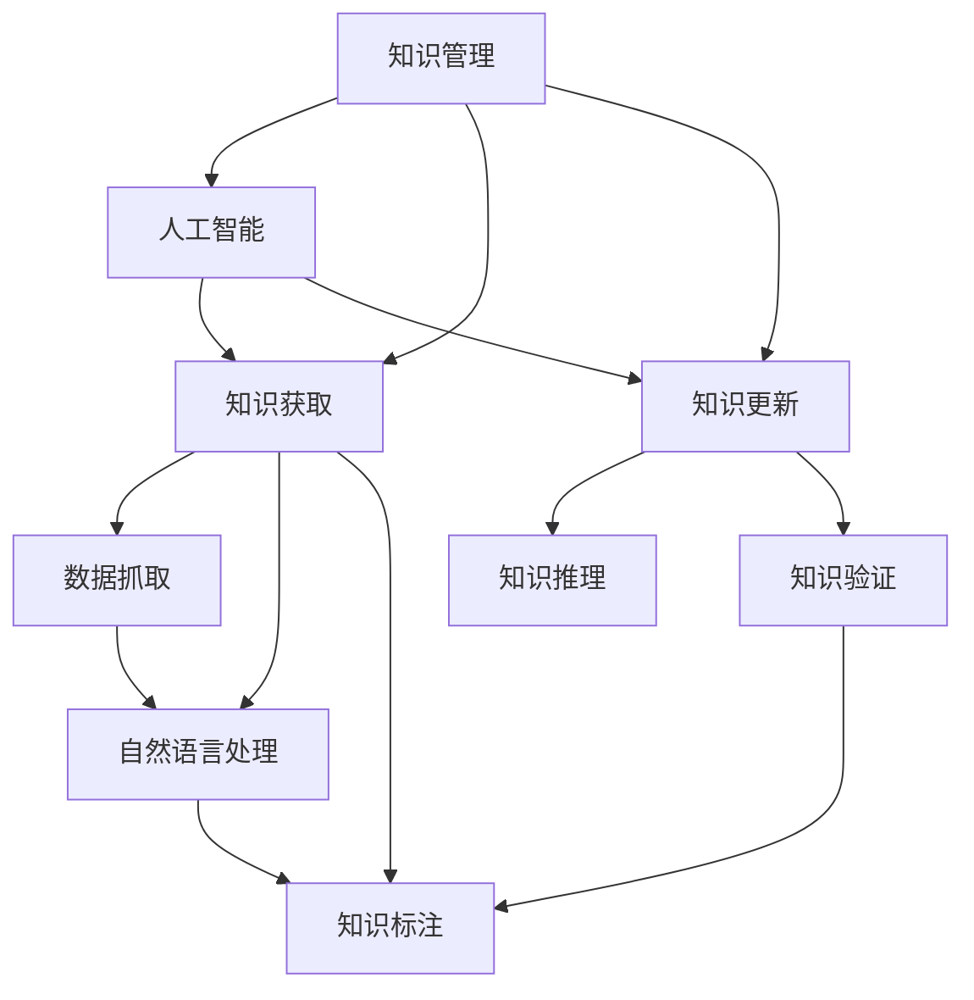

                 

# 知识管理的AI化挑战:知识获取和知识更新

> 关键词：知识管理,人工智能,知识获取,知识更新,语义搜索,知识图谱,知识推理

## 1. 背景介绍

### 1.1 问题由来
在信息化快速发展的今天，知识的积累和获取已经成为驱动社会进步、经济发展的重要动力。然而，随着数据量的爆炸式增长，知识管理也面临着巨大的挑战：

- **数据量大**：随着互联网的普及和数字化的加速，知识的产生和获取速度远远超过了人类的处理能力。
- **知识分散**：知识的存储形式多样化，不仅有结构化的文档、数据库，还有非结构化的文档、网页、图片等，知识之间的关联复杂，难以统一管理。
- **知识更新频繁**：各领域知识更新迅速，如何保证知识的时效性和准确性，成为新的难题。
- **知识获取难度**：海量且零散的知识源，使得知识的筛选、组织和获取变得困难，用户难以快速找到所需信息。

这些问题催生了对于知识管理的AI化需求，希望能借助人工智能技术，自动高效地处理和利用知识，满足知识管理的多样化需求。本文将聚焦于知识管理的AI化挑战，从知识获取和知识更新两个方面，探讨如何通过AI技术优化知识管理的各个环节。

## 2. 核心概念与联系

### 2.1 核心概念概述

为了深入理解知识管理的AI化挑战，我们首先梳理了几个关键概念：

- **知识管理(Knowledge Management, KM)**：指对知识的创建、存储、组织、检索、共享和应用等过程的管理，旨在提升知识价值和应用效率。
- **人工智能(Artificial Intelligence, AI)**：通过模拟人类智能行为，实现对复杂任务的自动化处理和智能决策，提高工作效率和准确性。
- **知识获取(Knowledge Acquisition)**：通过AI技术从不同来源获取知识，自动更新和整合到一个统一的知识库中。
- **知识更新(Knowledge Updating)**：利用AI技术，持续跟踪和更新现有知识库，保持知识的准确性和时效性。

这些概念之间的逻辑关系可以通过以下Mermaid流程图来展示：



这个流程图展示了一个完整的知识管理流程，强调了AI技术在各个环节的应用：

- 数据抓取和自然语言处理，用于知识获取。
- 知识标注和推理，用于知识更新。

这些核心概念和流程构成了知识管理的AI化挑战的核心，通过AI技术的辅助，可以大幅提升知识管理的效率和效果。

## 3. 核心算法原理 & 具体操作步骤

### 3.1 算法原理概述

知识管理的AI化挑战可以分为知识获取和知识更新两个主要部分。接下来，我们将分别介绍这两个部分的算法原理。

## 3.2 算法步骤详解

### 3.2.1 知识获取

知识获取的总体目标是从不同来源自动抓取并整合知识，形成结构化的知识库。其基本步骤如下：

1. **数据抓取**：利用网络爬虫技术，自动从网页、文档、数据库等不同源抓取相关信息。
2. **自然语言处理**：对抓取到的文本进行分词、命名实体识别、关键词提取等处理，形成结构化的语义信息。
3. **知识标注**：对处理后的语义信息进行分类、关联和标注，建立语义图谱。
4. **知识整合**：将标注后的语义信息整合到一个统一的知识库中，形成结构化的知识图谱。

### 3.2.2 知识更新

知识更新的目标是通过AI技术，持续跟踪和更新现有知识库，保持知识的准确性和时效性。其基本步骤如下：

1. **数据采集**：持续从各种数据源采集新数据，如新闻、论文、社交媒体等。
2. **知识推理**：利用推理算法，对新数据进行语义分析和推理，识别出与现有知识相关的新知识。
3. **知识验证**：通过人工和AI相结合的方式，对新知识进行验证和过滤，确保其准确性和可信度。
4. **知识融合**：将验证后的新知识融入现有知识库，更新知识图谱。

## 3.3 算法优缺点

### 3.3.1 知识获取

**优点**：
- 自动化程度高，能够快速处理大量数据。
- 语义处理技术可以提取出更为精准和有价值的信息。

**缺点**：
- 数据抓取范围和质量受限于爬虫能力和网络资源。
- 语义处理和标注过程复杂，依赖人工干预。

### 3.3.2 知识更新

**优点**：
- 自动化跟踪和更新，保持知识的时效性。
- 基于知识图谱的推理可以发现新知识，拓展现有知识库。

**缺点**：
- 推理算法复杂，可能引入错误推理。
- 新知识的验证和过滤过程繁琐。

## 3.4 算法应用领域

基于AI的知识获取和知识更新方法，已经广泛应用于多个领域，包括但不限于：

- **科研领域**：自动抓取和整理科研文献，辅助科研人员快速查找相关资料。
- **医疗领域**：自动抓取和更新医学数据，提供实时的医疗知识支持。
- **教育领域**：自动整理和更新教育资源，辅助教师和学生获取知识。
- **金融领域**：自动抓取和更新金融数据，提供市场动态和投资建议。
- **政府部门**：自动抓取和整理政府公开信息，辅助决策和政策制定。

## 4. 数学模型和公式 & 详细讲解 & 举例说明

### 4.1 数学模型构建

在知识管理中，我们通常使用图结构来表示知识之间的关系。以知识图谱为例，可以构建如下的图模型：

- **节点(Node)**：表示知识实体或概念，如人名、地名、疾病等。
- **边(Edge)**：表示实体之间的关系，如人物关系、地理位置关系、因果关系等。
- **属性(Attribute)**：表示节点的附加信息，如时间、类型、属性值等。

知识图谱可以用三元组的形式表示，即$(节点1, 关系, 节点2)$。

### 4.2 公式推导过程

我们以知识图谱的实体关系抽取为例，展示相关的数学模型和公式。

假设有知识图谱$G(V,E)$，其中$V$为节点集合，$E$为边集合。我们定义关系$R$，并假设节点$v_i$与$v_j$之间存在关系$r$，则三元组可以表示为$(v_i, r, v_j)$。

知识图谱的实体关系抽取过程可以分为两个阶段：

1. **实体抽取**：对文本进行命名实体识别，提取潜在的实体。
2. **关系抽取**：利用模式匹配或监督学习技术，从抽取的实体中识别出关系。

具体来说，假设我们有一组标注数据$D=\{(s_i, r_i, o_i)\}$，其中$s_i$为句子，$r_i$为关系，$o_i$为实体对。目标是从一组未标注数据$S$中识别出相应的关系。

### 4.3 案例分析与讲解

以医疗知识图谱为例，其构建过程如下：

1. **数据抓取**：从医院、科研机构等网站抓取医学文献、病历、临床试验等数据。
2. **实体抽取**：对抓取到的文本进行命名实体识别，提取出人名、疾病名、药物名等实体。
3. **关系抽取**：利用监督学习技术，从抽取的实体中识别出实体之间的关系，如病因、治疗方案等。
4. **知识整合**：将识别出的关系整合到知识图谱中，形成结构化的知识库。

## 5. 项目实践：代码实例和详细解释说明

### 5.1 开发环境搭建

在开始项目实践前，需要配置好开发环境：

1. 安装Python：Python是常用的编程语言，可以使用Anaconda等工具进行安装。
2. 安装Spacy和NLTK：用于自然语言处理。
3. 安装TensorFlow或PyTorch：用于构建深度学习模型。
4. 安装Django或Flask：用于构建Web应用接口。

完成上述步骤后，即可开始知识管理系统的开发。

### 5.2 源代码详细实现

以知识图谱构建为例，展示代码实现过程：

```python
import spacy
from spacy import displacy
from spacy.matcher import Matcher
from spacy.gold import GoldParse

# 加载Spacy模型
nlp = spacy.load('en_core_web_sm')

# 定义三元组
triples = []

# 定义模式
matcher = Matcher(nlp.vocab)
pattern = [{'TEXT': {'text': 'Apple', 'op': '?'}, 
           {'TEXT': {'text': 'is', 'op': '?'},
           {'TEXT': {'text': 'fruit', 'op': '?'}}], 
           lookbehind=True]
matcher.add('Apple_is_fruit', None, pattern)

# 加载训练数据
gold = GoldParse(nlp('Apple is a fruit.'))
for doc in gold:
    span = matcher(doc)
    if span:
        head, start, end = span[0]
        text = nlp(doc[start:end].text)
        triples.append((text.lemma_, 'Apple_is_fruit', text.lemma_))

# 输出三元组
print(triples)
```

以上代码展示了使用Spacy进行实体关系抽取的过程。首先加载Spacy模型，定义模式并加载训练数据，然后对文本进行模式匹配，抽取实体和关系，形成三元组。

### 5.3 代码解读与分析

代码中使用了Spacy库进行自然语言处理，具体步骤如下：

1. 加载Spacy模型：使用`spacy.load`加载预先训练好的英文模型`en_core_web_sm`。
2. 定义模式：使用`Matcher`定义匹配模式，识别出实体关系三元组。
3. 加载训练数据：使用`GoldParse`加载训练数据，并将其转换为模式匹配的对象。
4. 匹配模式：对训练数据进行模式匹配，识别出实体和关系。
5. 输出三元组：将匹配到的实体和关系组合成三元组，并输出。

代码中的关键点在于模式定义和匹配过程。模式定义可以根据具体任务进行调整，以识别不同类型的实体和关系。

## 6. 实际应用场景

### 6.1 医疗知识图谱

医疗领域的数据复杂多样，涉及疾病、症状、药物、治疗方案等多个方面。利用知识图谱技术，可以将这些信息整合在一起，形成统一的知识库。

以疾病知识图谱为例，其构建过程如下：

1. **数据抓取**：从医院、科研机构等网站抓取医学文献、病历、临床试验等数据。
2. **实体抽取**：对抓取到的文本进行命名实体识别，提取出疾病名、症状、药物名等实体。
3. **关系抽取**：利用监督学习技术，从抽取的实体中识别出实体之间的关系，如病因、治疗方案等。
4. **知识整合**：将识别出的关系整合到知识图谱中，形成结构化的知识库。

医疗知识图谱的应用场景包括：
- **疾病诊断**：利用知识图谱辅助医生进行疾病诊断，提高诊断准确性。
- **治疗方案**：根据患者病情，从知识图谱中推荐合适的治疗方案。
- **临床研究**：为科研人员提供实时的医学数据支持，促进医学研究发展。

### 6.2 科研文献管理

科研领域的数据主要来自学术论文、会议报告、专利等文献。利用知识图谱技术，可以自动抓取和整理这些文献，形成知识库。

科研知识图谱的构建过程如下：
1. **数据抓取**：从科研数据库、学术网站等抓取论文、报告、专利等文献。
2. **实体抽取**：对抓取到的文本进行命名实体识别，提取出科研名词、技术术语等实体。
3. **关系抽取**：利用监督学习技术，从抽取的实体中识别出实体之间的关系，如引用关系、研究方向等。
4. **知识整合**：将识别出的关系整合到知识图谱中，形成结构化的知识库。

科研知识图谱的应用场景包括：
- **文献推荐**：利用知识图谱辅助科研人员快速查找相关文献。
- **知识图谱**：为科研人员提供实时的科研数据支持，促进科研创新。
- **科研合作**：帮助科研人员找到合作机会，促进科研协作。

### 6.3 教育资源整合

教育领域的数据主要来自教材、讲义、习题等资源。利用知识图谱技术，可以自动抓取和整理这些资源，形成知识库。

教育知识图谱的构建过程如下：
1. **数据抓取**：从教育平台、教材出版社等抓取教育资源。
2. **实体抽取**：对抓取到的文本进行命名实体识别，提取出知识点、概念等实体。
3. **关系抽取**：利用监督学习技术，从抽取的实体中识别出实体之间的关系，如前后关系、关联关系等。
4. **知识整合**：将识别出的关系整合到知识图谱中，形成结构化的知识库。

教育知识图谱的应用场景包括：
- **课程推荐**：利用知识图谱辅助教师和学生快速查找相关课程。
- **知识图谱**：为教师和学生提供实时的教育资源支持，提升教学和学习效果。
- **智能辅导**：利用知识图谱开发智能辅导系统，辅助学生学习。

## 7. 工具和资源推荐

### 7.1 学习资源推荐

为了帮助开发者系统掌握知识管理的AI化挑战，这里推荐一些优质的学习资源：

1. **《人工智能与知识工程》课程**：由清华大学开设的在线课程，系统讲解了知识工程的原理和应用。
2. **《自然语言处理与深度学习》书籍**：深度学习领域的经典教材，涵盖自然语言处理和知识管理的相关内容。
3. **知识图谱与语义网络**：介绍知识图谱的构建、查询和应用的技术博客和论文。
4. **Wikipedia知识图谱**：开源的知识图谱，包含大量的事实和关系，是学习知识图谱的良好资源。

### 7.2 开发工具推荐

知识管理系统的开发需要多种工具的配合，以下是几款常用的开发工具：

1. **Spacy**：用于自然语言处理，提供命名实体识别、依存关系分析等功能。
2. **TensorFlow**：用于构建深度学习模型，支持图神经网络等算法。
3. **PyTorch**：另一个常用的深度学习框架，提供灵活的动态计算图。
4. **Django**：用于Web应用的开发，提供强大的后端框架。
5. **Flask**：轻量级的Web框架，适合快速开发小型应用。

### 7.3 相关论文推荐

知识管理的AI化挑战是一个前沿的研究方向，以下是几篇重要的相关论文，推荐阅读：

1. **Knowledge Graphs for Science**：利用知识图谱技术构建科研领域的知识库。
2. **Crowdsourced Knowledge Graphs**：介绍如何利用众包技术构建大规模知识图谱。
3. **Semantic Search and Knowledge Discovery**：讨论知识图谱在语义搜索和知识发现中的应用。
4. **Neural Entity Recognition with Knowledge Graphs**：研究知识图谱在实体识别任务中的应用。

## 8. 总结：未来发展趋势与挑战

### 8.1 研究成果总结

知识管理的AI化挑战已经取得了诸多重要成果，包括但不限于：

1. **知识图谱技术**：利用图结构表示知识，提高了知识管理的有序性和可解释性。
2. **自然语言处理**：利用深度学习技术，提高了知识获取的准确性和效率。
3. **知识推理技术**：利用知识图谱和推理算法，提升了知识更新的及时性和准确性。

### 8.2 未来发展趋势

展望未来，知识管理的AI化挑战将呈现以下几个发展趋势：

1. **知识图谱的自动化构建**：未来的知识图谱将更加自动化，能够自动从各种数据源中抓取和整合知识，无需人工干预。
2. **深度学习的普及**：深度学习技术将在知识管理中得到更广泛的应用，提升知识获取和更新的精度和效率。
3. **跨领域知识融合**：知识图谱将突破领域界限，融合多领域知识，构建更全面的知识库。
4. **智能知识图谱**：利用AI技术，实现知识图谱的智能扩展和知识推理，提升知识的实时性和普适性。

### 8.3 面临的挑战

尽管知识管理的AI化挑战已经取得重要进展，但在迈向全面应用的过程中，仍面临诸多挑战：

1. **数据质量问题**：数据抓取和标注过程复杂，数据质量难以保证。
2. **知识图谱的规模和复杂性**：知识图谱的构建和维护难度大，需要投入大量时间和资源。
3. **知识的实时更新**：知识图谱需要不断更新，保持知识的时效性，技术实现难度较大。
4. **知识图谱的可解释性**：知识图谱的推理过程复杂，难以解释和调试。

### 8.4 研究展望

面对知识管理的AI化挑战，未来的研究需要在以下几个方面寻求新的突破：

1. **数据自动采集和标注**：开发更加高效的数据采集和标注工具，提升数据质量。
2. **知识图谱的自动化构建**：研究自动化构建知识图谱的方法，降低人工干预的复杂性。
3. **知识推理的精确性**：研究更加精确的推理算法，提高知识更新的准确性。
4. **知识图谱的可解释性**：研究知识图谱的可解释性技术，提高其可解释性和可信度。

## 9. 附录：常见问题与解答

**Q1: 知识图谱在知识管理中的作用是什么？**

A: 知识图谱在知识管理中起到了以下几个作用：
1. 知识组织：利用图结构将知识组织起来，形成统一的知识库。
2. 知识查询：利用知识图谱进行语义查询，帮助用户快速找到所需知识。
3. 知识推理：利用知识图谱进行推理，发现新的知识和关系。

**Q2: 知识图谱的构建过程涉及哪些步骤？**

A: 知识图谱的构建过程主要包括以下步骤：
1. 数据采集：从不同源采集数据，形成初始知识库。
2. 实体抽取：对采集的数据进行命名实体识别，提取出实体。
3. 关系抽取：利用模式匹配或监督学习技术，识别出实体之间的关系。
4. 知识整合：将抽取的关系整合到知识图谱中，形成结构化的知识库。

**Q3: 知识管理的AI化挑战中，自然语言处理技术起到了什么作用？**

A: 自然语言处理技术在知识管理的AI化挑战中起到了以下几个作用：
1. 数据抓取：通过爬虫技术，自动抓取网页和文档中的文本信息。
2. 实体抽取：利用命名实体识别技术，提取出文本中的实体。
3. 关系抽取：利用模式匹配或监督学习技术，识别出实体之间的关系。

**Q4: 知识图谱在实际应用中面临哪些挑战？**

A: 知识图谱在实际应用中面临以下几个挑战：
1. 数据质量问题：数据采集和标注过程复杂，数据质量难以保证。
2. 知识图谱的规模和复杂性：知识图谱的构建和维护难度大，需要投入大量时间和资源。
3. 知识的实时更新：知识图谱需要不断更新，保持知识的时效性，技术实现难度较大。
4. 知识图谱的可解释性：知识图谱的推理过程复杂，难以解释和调试。

**Q5: 如何提高知识图谱的可解释性？**

A: 提高知识图谱的可解释性，可以从以下几个方面入手：
1. 可视化展示：利用可视化工具，展示知识图谱的结构和推理过程。
2. 推理过程解释：利用解释性算法，解释知识图谱的推理过程。
3. 知识图谱注释：为知识图谱添加注释，帮助用户理解其结构和推理过程。

---

作者：禅与计算机程序设计艺术 / Zen and the Art of Computer Programming

