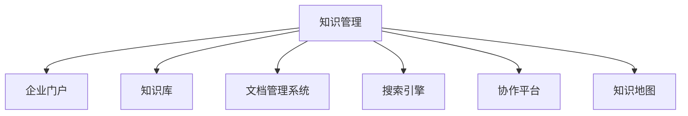

                 

# 知识管理系统：组织智慧的结晶

## 1. 背景介绍

在数字化时代，知识不再以书面的形式存放在书籍中，而是转化为数据流，通过互联网进行流通和共享。知识管理系统的兴起，为组织和企业提供了一个集中管理和利用知识的平台，使得智慧可以被有效地组织、存储、检索和利用，推动创新和效率的提升。

### 1.1 问题由来

知识管理系统的核心在于如何高效地存储和检索知识，使其成为组织智慧的结晶。这一需求在许多企业中日益显现，特别是在全球化和信息化深入发展的情况下，知识管理系统的建设已经成为了企业提升竞争力和创新能力的重要手段。

### 1.2 问题核心关键点

知识管理系统的构建，需要围绕以下几个关键点展开：

- **知识分类和组织**：如何对知识进行分类，并按照某种结构组织起来，以便于检索。
- **知识检索和搜索**：如何快速准确地检索到需要的知识。
- **知识共享和协作**：如何促进知识的共享和团队协作，推动知识的应用和创新。
- **知识更新和迭代**：如何及时更新知识，确保知识的现时性和有效性。

### 1.3 问题研究意义

研究知识管理系统，对于提升企业的创新能力和效率，推动信息时代的知识革命，具有重要意义：

- **提升决策能力**：通过知识共享和检索，使决策者能够更快、更准确地获取所需信息，提升决策质量。
- **加速知识应用**：促进知识在企业内部的快速流转和应用，加速产品创新和流程优化。
- **增强团队协作**：提供协作工具和平台，增强团队成员间的知识交流和合作，提升团队绩效。
- **优化知识管理流程**：通过知识管理系统，建立规范化的知识管理流程，提高企业知识管理的标准化和系统化。

## 2. 核心概念与联系

### 2.1 核心概念概述

为了更好地理解知识管理系统的构建和应用，本节将介绍几个关键概念：

- **知识管理(Knowledge Management, KM)**：涉及知识的创建、存储、检索、共享和应用的过程，以提升组织的知识水平和决策能力。
- **企业门户(Enterprise Portal)**：为内部员工提供访问公司资源和信息系统的集中入口。
- **知识库(Knowledge Base)**：存储知识库和文档数据的容器，支持文档管理、版本控制、权限管理等功能。
- **文档管理系统(Document Management System, DMS)**：用于管理和维护文档的电子化系统，支持文档的创建、编辑、版本控制和权限管理。
- **搜索引擎(Search Engine)**：用于快速检索知识库、文档和文件的系统，支持全文检索、分类检索等功能。
- **协作平台(Collaboration Platform)**：促进团队成员之间知识共享和协作的工具，支持在线会议、文档共享、即时通讯等功能。
- **知识地图(Knowledge Map)**：展现知识库结构和内容的图形化工具，帮助用户快速找到相关知识。

这些核心概念之间的逻辑关系可以通过以下Mermaid流程图来展示：



这个流程图展示出知识管理系统的几个关键组件及其相互关系：

1. 知识管理是整个系统的核心，负责知识的创建、存储、检索、共享和应用。
2. 企业门户是知识管理系统的入口，提供集中访问公司资源的渠道。
3. 知识库和文档管理系统存储和维护知识数据。
4. 搜索引擎提供快速检索功能。
5. 协作平台促进团队协作。
6. 知识地图展现知识结构，帮助用户定位知识。

这些组件相互配合，共同构建出高效的知识管理系统，为企业的知识管理提供坚实的基础。

## 3. 核心算法原理 & 具体操作步骤
### 3.1 算法原理概述

知识管理系统的算法原理主要包括知识分类、组织、检索和共享。以下是这些过程的算法原理概述：

- **知识分类**：使用聚类、分类等算法，将知识按照主题、领域、重要性等维度进行分类。
- **知识组织**：通过构建知识图谱、索引等结构，对知识进行系统化的组织和存储。
- **知识检索**：采用文本检索、向量空间模型、语义检索等技术，快速检索到需要的知识。
- **知识共享**：利用权限控制、版本管理等机制，促进知识的共享和协作。

### 3.2 算法步骤详解

知识管理系统的构建步骤主要包括以下几个关键环节：

1. **需求分析**：明确知识管理系统的需求和目标，制定详细的技术方案。
2. **系统设计**：设计知识管理系统的架构和功能模块，包括企业门户、知识库、文档管理系统、搜索引擎、协作平台和知识地图等。
3. **数据采集和清洗**：从各种渠道收集知识数据，进行清洗和整理，确保数据的准确性和完整性。
4. **系统实现**：根据设计方案进行编码和系统实现，集成各种功能和模块。
5. **系统测试和优化**：对系统进行全面测试，发现并解决潜在的bug，优化系统性能和用户体验。
6. **系统部署和维护**：将系统部署到生产环境，进行日常的维护和升级，确保系统的稳定运行。

### 3.3 算法优缺点

知识管理系统具有以下优点：

1. **提高知识利用效率**：通过集中管理和检索，提升知识的利用效率，减少重复工作。
2. **促进知识共享和协作**：提供协作平台和工具，促进团队成员之间的知识共享和协作。
3. **加速创新和决策**：通过集中管理和检索知识，提升决策质量和速度。
4. **规范知识管理流程**：建立规范化的知识管理流程，提高知识管理的标准化和系统化。

同时，知识管理系统也存在一些局限：

1. **系统复杂度高**：知识管理系统的构建涉及多个模块和技术，系统复杂度高，开发和维护成本较大。
2. **数据质量依赖**：知识管理的质量高度依赖于数据的准确性和完整性，数据质量差将影响系统的整体效果。
3. **用户习惯改变**：知识管理系统需要用户改变原有的工作习惯，如文件存储、检索方式等，用户适应期较长。
4. **安全性和权限管理**：系统涉及敏感信息的存储和处理，必须严格管理权限和安全性，以防止信息泄露。

### 3.4 算法应用领域

知识管理系统广泛应用于各个行业和领域，包括但不限于：

- **教育**：提供课程、教材、论文等知识资源的集中管理和检索。
- **医疗**：存储和检索医疗案例、病历、研究成果等知识，推动医疗领域的创新和应用。
- **金融**：存储和检索金融市场数据、分析报告、研究论文等知识，支持金融决策。
- **制造业**：存储和检索产品设计、工艺流程、技术文档等知识，支持产品开发和流程优化。
- **政府机构**：存储和检索政策法规、研究成果、统计数据等知识，支持政府决策和信息公开。

这些应用场景展示了知识管理系统的广泛应用和巨大价值，推动了各行业的知识管理和应用水平。

## 4. 数学模型和公式 & 详细讲解 & 举例说明
### 4.1 数学模型构建

知识管理系统的核心是知识分类和组织。在数学上，我们可以使用聚类算法和分类算法来实现这一过程。以下是聚类算法和分类算法的数学模型构建：

- **聚类算法**：
  $$
  C = K_Means(X, K)
  $$
  其中，$X$为待分类的数据集，$K$为聚类数。算法流程为：
  1. 随机选取K个初始质心。
  2. 对每个数据点，计算其到质心的距离，分配到最近的簇中。
  3. 更新质心位置，重新分配数据点。
  4. 重复步骤2-3，直到质心不再改变或达到预设的迭代次数。

- **分类算法**：
  $$
  C = K_NN(X, Y)
  $$
  其中，$X$为待分类数据集，$Y$为训练集。算法流程为：
  1. 对每个数据点，计算其到训练集中所有质心的距离。
  2. 分配到距离最近的质心对应的类别。
  3. 统计每个类别的样本数量。
  4. 选择样本数量最多的类别作为最终分类结果。

### 4.2 公式推导过程

以K均值聚类算法为例，推导其核心公式和算法流程：

设$X = \{x_1, x_2, ..., x_n\}$为待聚类数据集，$C = \{c_1, c_2, ..., c_k\}$为聚类簇。初始化时，随机选择$K$个数据点作为初始质心$O^{(0)} = \{o_1^{(0)}, o_2^{(0)}, ..., o_k^{(0)}\}$。算法迭代过程如下：

1. 分配数据点：对于每个数据点$x_i$，计算其到每个质心$o_j^{(t)}$的距离$d_{ij}^{(t)}$，将其分配到最近的簇$c_j$中。

2. 更新质心：对于每个簇$c_j$，计算其中所有数据点的均值$\mu_j^{(t+1)}$作为新的质心。

3. 迭代更新：重复步骤1和2，直到质心不再改变或达到预设的迭代次数。

算法的时间复杂度为$O(nkI)$，其中$n$为数据点数，$k$为聚类数，$I$为迭代次数。

### 4.3 案例分析与讲解

假设我们有一个知识库，存储了大量的学术论文、技术文档、行业报告等。我们需要对这些知识进行分类和组织，以便于快速检索和共享。

1. **数据采集和清洗**：从科研数据库、公司内部文档库等渠道，采集大量的知识数据，并进行清洗和整理。
2. **聚类分析**：使用K均值聚类算法，将知识数据按照主题进行分类，生成知识簇。
3. **分类和索引**：对每个知识簇进行命名和索引，构建知识图谱和索引表。
4. **搜索引擎优化**：为知识库构建搜索引擎，支持全文检索、分类检索和高级搜索功能。
5. **权限控制和协作平台**：设置权限控制和协作平台，方便团队成员进行知识共享和协作。
6. **知识地图**：构建知识地图，展现知识库结构和内容，帮助用户快速定位知识。

通过这一系列步骤，我们便构建出了一个高效的知识管理系统，可以满足企业内部的知识管理需求。

## 5. 项目实践：代码实例和详细解释说明
### 5.1 开发环境搭建

在进行知识管理系统开发前，我们需要准备好开发环境。以下是使用Python进行Flask开发的环境配置流程：

1. 安装Anaconda：从官网下载并安装Anaconda，用于创建独立的Python环境。

2. 创建并激活虚拟环境：
```bash
conda create -n km-env python=3.8 
conda activate km-env
```

3. 安装Flask：
```bash
pip install Flask
```

4. 安装Gunicorn：
```bash
pip install Gunicorn
```

5. 安装Flask-KM：
```bash
pip install Flask-KM
```

6. 安装Flask-Uploads：
```bash
pip install Flask-Uploads
```

完成上述步骤后，即可在`km-env`环境中开始知识管理系统的开发。

### 5.2 源代码详细实现

下面我们以文档管理系统为例，给出使用Flask构建的知识管理系统实现代码。

首先，定义文档管理系统的核心数据模型和视图：

```python
from flask import Flask, render_template, redirect, url_for, request, jsonify
from flask_km import KnowledgeManager, KmDocument, KmUser
from flask_uploads import UploadSet, configure_uploads, IMAGES

app = Flask(__name__)
app.config['UPLOADS_DEFAULT_DEST'] = 'uploads'
app.config['UPLOADS_DEFAULT_URL'] = 'http://127.0.0.1:5000/uploads/'
photos = UploadSet('photos', IMAGES)
configure_uploads(app)

km = KnowledgeManager(app)
km.init_km_app()
```

然后，定义文档管理的CRUD操作：

```python
@app.route('/documents', methods=['GET', 'POST'])
def document_list():
    if request.method == 'POST':
        filename = request.files['file'].filename
        if filename:
            file = photos.save(filename)
            km.add_document(file)
    documents = km.list_documents()
    return render_template('documents.html', documents=documents)

@app.route('/documents/<int:id>/delete', methods=['POST'])
def document_delete(id):
    km.delete_document(id)
    return redirect(url_for('document_list'))

@app.route('/documents/<int:id>/edit', methods=['GET', 'POST'])
def document_edit(id):
    if request.method == 'POST':
        km.update_document(id, request.form.get('title'), request.form.get('content'))
    document = km.get_document(id)
    return render_template('edit_document.html', document=doc)
```

最后，定义用户登录和权限控制：

```python
@app.route('/login', methods=['GET', 'POST'])
def login():
    if request.method == 'POST':
        user = request.form.get('username')
        password = request.form.get('password')
        if km.auth_user(user, password):
            session['user'] = user
            return redirect(url_for('home'))
    return render_template('login.html')

@app.route('/logout', methods=['GET'])
def logout():
    session.pop('user', None)
    return redirect(url_for('login'))

@app.route('/protected')
def protected():
    if 'user' in session:
        return 'Logged in as ' + session['user']
    return redirect(url_for('login'))
```

以上是使用Flask构建文档管理系统的完整代码实现。可以看到，Flask-KM提供了知识管理的API接口，简化了文档管理的实现过程。

### 5.3 代码解读与分析

让我们再详细解读一下关键代码的实现细节：

**Flask-KM库**：
- `KnowledgeManager`类：封装了知识管理系统的核心功能，包括文档管理、权限控制、搜索引擎等。
- `KmDocument`类：定义了文档对象，包括标题、内容、上传文件等属性。
- `KmUser`类：定义了用户对象，包括用户名、密码等属性。

**文档管理**：
- `document_list`函数：实现了文档列表的获取、上传、删除和编辑功能。
- `document_delete`函数：实现了文档的删除功能。
- `document_edit`函数：实现了文档的编辑功能。

**用户登录和权限控制**：
- `login`函数：实现了用户登录功能，检查用户名和密码是否匹配，成功后跳转到主页。
- `logout`函数：实现了用户注销功能，删除当前会话中的用户信息。
- `protected`函数：实现了保护性路由，只有登录用户才能访问。

通过以上代码，我们可以构建出一个功能完整的文档管理系统，用于存储和管理系统内部的知识文档。

### 5.4 运行结果展示

运行上述代码，启动Flask应用，通过浏览器访问`http://127.0.0.1:5000/`，可以看到文档管理系统的首页。用户可以上传文档、查看文档列表、删除文档、编辑文档。管理员可以添加用户、管理权限等。

此外，还可以在文档管理系统中集成搜索引擎、协作平台等功能，进一步完善知识管理系统的功能。

## 6. 实际应用场景
### 6.1 智能图书馆

智能图书馆利用知识管理系统，可以提供更加智能化的借阅、查询、推荐等服务。通过知识管理系统的搜索引擎，用户可以快速找到需要的书籍、期刊、论文等资源。智能推荐系统可以根据用户的历史借阅记录和查询行为，推荐相关书籍和文章，提升用户体验。

### 6.2 企业知识库

企业知识库利用知识管理系统，可以存储和检索企业的各类知识文档，如技术文档、产品手册、培训资料等。通过权限控制和协作平台，企业内部员工可以共享和协作，促进知识的传播和创新。

### 6.3 政府公开数据平台

政府公开数据平台利用知识管理系统，可以存储和检索各类政府公开数据，如统计数据、政策法规、公共服务信息等。通过知识地图和搜索引擎，公众可以方便地查找和下载数据，提升政府信息公开和透明度。

### 6.4 未来应用展望

随着知识管理系统的不断发展，未来的应用场景将更加广泛和多样化。

1. **智能搜索和推荐**：利用AI技术，提升搜索引擎和推荐系统的智能化水平，帮助用户快速找到所需知识。
2. **多语言支持**：支持多语言搜索和文档管理，满足全球化背景下知识共享的需求。
3. **知识图谱和语义检索**：构建知识图谱和语义检索系统，提升知识的准确性和相关性。
4. **跨领域知识融合**：支持跨领域知识的融合和应用，推动知识在不同领域之间的共享和应用。
5. **增强现实和虚拟现实**：利用增强现实和虚拟现实技术，提供更加直观的知识展示和互动体验。

这些应用场景展示了知识管理系统在未来的巨大潜力和应用前景，推动了知识管理的智能化和普及化。

## 7. 工具和资源推荐
### 7.1 学习资源推荐

为了帮助开发者系统掌握知识管理系统的构建技术，这里推荐一些优质的学习资源：

1. **《知识管理系统：组织智慧的结晶》书籍**：全面介绍了知识管理系统的原理、技术和应用，适合深度学习初学者和从业者阅读。
2. **Coursera《信息检索与知识管理》课程**：由斯坦福大学开设的在线课程，系统讲解了信息检索和知识管理的理论和技术，包括搜索引擎、知识库、文档管理系统等。
3. **Django-KM项目**：开源的知识管理系统项目，提供了丰富的API接口和文档管理功能，是学习和实践知识管理系统的良好范例。
4. **KM2020会议论文集**：收录了知识管理领域的最新研究论文和技术进展，提供丰富的学习资源。
5. **Flask-KM官方文档**：Flask-KM库的官方文档，详细介绍了知识管理系统的API接口和使用方法。

通过对这些资源的学习实践，相信你一定能够快速掌握知识管理系统的构建技术，并用于解决实际的NLP问题。

### 7.2 开发工具推荐

高效的开发离不开优秀的工具支持。以下是几款用于知识管理系统开发的常用工具：

1. **Flask**：基于Python的轻量级Web框架，简单易用，适合快速迭代开发。
2. **Django**：Python的全功能Web框架，适合大型项目开发，提供了丰富的ORM和视图工具。
3. **SQLAlchemy**：Python的ORM库，支持数据库操作，方便数据管理和查询。
4. **Flask-KM**：Flask的KM库，提供了知识管理的API接口和文档管理功能，是构建知识管理系统的良好选择。
5. **Flask-Uploads**：Flask的文件上传扩展，支持文件上传、存储和处理，方便文档管理系统实现文件上传功能。

合理利用这些工具，可以显著提升知识管理系统的开发效率，加快创新迭代的步伐。

### 7.3 相关论文推荐

知识管理系统的发展得益于学界的持续研究。以下是几篇奠基性的相关论文，推荐阅读：

1. **《知识管理的价值和重要性》（Knowledge Management: Value and Importance）**：探讨了知识管理在组织中的重要性和应用价值。
2. **《基于内容的用户推荐》（Content-Based Recommendation Systems）**：介绍了基于内容的推荐算法，如协同过滤、基于模型的推荐等。
3. **《智能搜索技术综述》（A Survey on Smart Search Technology）**：综述了智能搜索和推荐技术的发展，提供了丰富的学习资源。
4. **《知识图谱的构建和应用》（Knowledge Graph Construction and Application）**：介绍了知识图谱的构建和应用，提供了知识管理的最新技术进展。
5. **《跨领域知识融合》（Cross-Domain Knowledge Fusion）**：探讨了跨领域知识的融合和应用，推动了知识管理的智能化和普及化。

这些论文代表了大知识管理系统的发展脉络。通过学习这些前沿成果，可以帮助研究者把握学科前进方向，激发更多的创新灵感。

## 8. 总结：未来发展趋势与挑战
### 8.1 总结

本文对知识管理系统的构建和应用进行了全面系统的介绍。首先阐述了知识管理系统的研究背景和意义，明确了知识管理系统的构建目标和关键点。其次，从原理到实践，详细讲解了知识管理系统的核心算法和操作步骤，给出了知识管理系统开发的完整代码实例。同时，本文还广泛探讨了知识管理系统在实际应用中的各类场景，展示了知识管理系统在各个行业中的应用前景。

通过本文的系统梳理，可以看到，知识管理系统的构建和应用，对于提升企业的知识管理和应用水平，推动组织智慧的结晶，具有重要意义。知识管理系统在实际应用中，已经展示了其强大的功能和价值，推动了各行业的知识管理和应用水平。未来，随着技术的不断进步和创新，知识管理系统必将在更广阔的领域中得到应用，进一步推动组织智慧的沉淀和创新。

### 8.2 未来发展趋势

展望未来，知识管理系统的应用和发展将呈现以下几个趋势：

1. **智能化水平提升**：利用AI技术，提升搜索引擎和推荐系统的智能化水平，帮助用户快速找到所需知识。
2. **多语言支持**：支持多语言搜索和文档管理，满足全球化背景下知识共享的需求。
3. **知识图谱和语义检索**：构建知识图谱和语义检索系统，提升知识的准确性和相关性。
4. **跨领域知识融合**：支持跨领域知识的融合和应用，推动知识在不同领域之间的共享和应用。
5. **增强现实和虚拟现实**：利用增强现实和虚拟现实技术，提供更加直观的知识展示和互动体验。

这些趋势展示了知识管理系统在未来的巨大潜力和应用前景，推动了知识管理的智能化和普及化。

### 8.3 面临的挑战

尽管知识管理系统已经取得了一定的成功，但在迈向更加智能化、普适化应用的过程中，它仍面临诸多挑战：

1. **数据质量依赖**：知识管理系统的质量高度依赖于数据的准确性和完整性，数据质量差将影响系统的整体效果。
2. **系统复杂度高**：知识管理系统的构建涉及多个模块和技术，系统复杂度高，开发和维护成本较大。
3. **用户习惯改变**：知识管理系统需要用户改变原有的工作习惯，如文件存储、检索方式等，用户适应期较长。
4. **安全性和权限管理**：系统涉及敏感信息的存储和处理，必须严格管理权限和安全性，以防止信息泄露。

### 8.4 研究展望

面对知识管理系统所面临的挑战，未来的研究需要在以下几个方面寻求新的突破：

1. **数据质量提升**：通过数据清洗和标注技术，提升知识管理系统的数据质量，确保知识的准确性和完整性。
2. **系统架构优化**：优化知识管理系统的架构和设计，提升系统的可扩展性和维护性。
3. **用户适应度提升**：通过用户培训和引导，帮助用户更快适应知识管理系统的使用。
4. **安全性和隐私保护**：加强安全性和隐私保护，确保系统数据的安全性和用户的隐私。

这些研究方向的探索，必将引领知识管理系统的技术进步，推动知识管理的智能化和普及化，为组织智慧的结晶提供坚实的技术支持。

## 9. 附录：常见问题与解答

**Q1：知识管理系统如何提升企业的知识利用效率？**

A: 知识管理系统通过集中存储和检索知识，减少了员工在不同平台之间切换的时间和精力，提升了知识获取的速度和准确性。同时，系统提供了搜索和推荐功能，帮助员工快速找到所需知识，减少了重复工作，提升了知识利用效率。

**Q2：知识管理系统的用户管理功能包括哪些？**

A: 知识管理系统的用户管理功能包括用户注册、登录、权限控制等。管理员可以定义不同的用户角色，设置权限，控制不同角色的访问范围。用户可以修改密码、查看自己的权限和历史记录等。

**Q3：如何构建知识管理系统的搜索功能？**

A: 知识管理系统的搜索功能可以通过构建搜索引擎和索引来实现。首先，对知识数据进行分词和索引，构建倒排索引表。然后，实现搜索算法，支持全文检索、分类检索和高级搜索功能。最后，将搜索结果展示给用户，并提供搜索结果的排序和过滤功能。

**Q4：知识管理系统的知识库功能包括哪些？**

A: 知识管理系统的知识库功能包括文档管理、版本控制、权限管理等。可以存储和检索文本、图片、视频等多媒体文档。系统支持文档的创建、编辑、版本控制和权限管理，确保知识的准确性和安全性。

**Q5：知识管理系统的知识图谱功能包括哪些？**

A: 知识管理系统的知识图谱功能包括构建知识图谱、语义检索和知识推理等。通过构建知识图谱，将知识数据转化为图形结构，方便用户进行检索和分析。利用语义检索技术，提升知识的准确性和相关性。通过知识推理，推动知识在不同领域之间的融合和应用。

通过以上回答，希望你对知识管理系统有更清晰的认识，能够更好地应用于实际工作中，推动组织智慧的结晶。

---

作者：禅与计算机程序设计艺术 / Zen and the Art of Computer Programming

