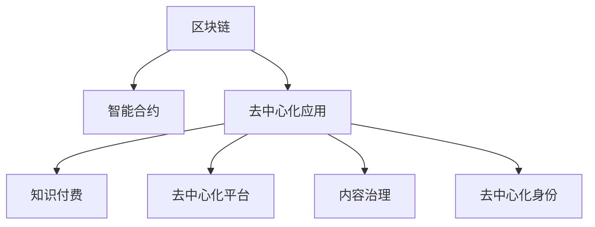
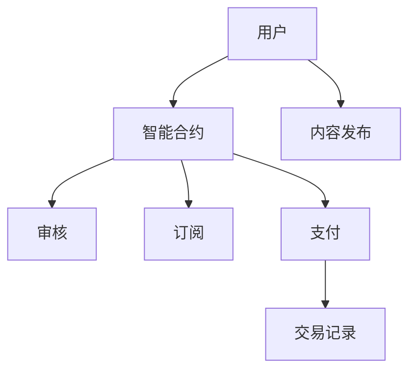

                 

# 知识经济下知识付费的区块链去中心化应用场景

在知识经济时代，知识付费已成为一种新兴的商业模式。用户愿意为有价值的信息付费，寻求知识、技能和经验等信息的快速获取。传统的中心化平台模式存在数据垄断、信息不对称、信任危机等诸多问题，而区块链去中心化技术为此提供了新的解决方案。本文旨在探讨知识付费的区块链去中心化应用场景，分析其原理、优势与挑战，展望未来发展趋势，并提出相应的技术架构和实现方案。

## 1. 背景介绍

随着知识经济的兴起，知识付费行业呈现出蓬勃发展的态势。知识付费平台如得到、知乎、喜马拉雅等，聚集了大量优质的内容创作者和订阅用户，为用户提供专业、实用的知识服务。然而，这些平台普遍存在数据中心化、信息孤岛、内容审查等问题，用户的数据隐私、利益保障和平台信任面临严峻挑战。区块链技术的去中心化特性能够解决传统知识付费平台的部分问题，成为知识付费领域的新趋势。

## 2. 核心概念与联系

### 2.1 核心概念概述

为更好地理解区块链在知识付费领域的应用，本节将介绍几个核心概念及其之间的关系：

- **区块链(Blockchain)**：一种去中心化的分布式账本技术，通过共识机制保证数据的透明和不可篡改。
- **智能合约(Smart Contract)**：一种自动化的合约执行程序，存储在区块链上，确保执行的公正性和可验证性。
- **去中心化应用(Decentralized Application, DApp)**：基于区块链技术的分布式应用，提供无需中介机构的网络服务。
- **知识付费(Knowledge Payment)**：用户为获取有价值的信息付费，获取知识、技能和经验等。
- **去中心化平台(Decentralized Platform)**：使用区块链技术实现去中心化、开放、透明的平台架构。
- **内容治理(Content Governance)**：对知识内容进行审核、监管、激励和治理，确保内容质量和用户体验。
- **去中心化身份(Decentralized Identity)**：基于区块链技术的身份认证机制，保障用户数据隐私和权益。

这些核心概念之间的逻辑关系可以通过以下Mermaid流程图来展示：



这个流程图展示了大语言模型的核心概念及其之间的关系：

1. 区块链作为去中心化的基础技术，提供可靠的数据存储和传输。
2. 智能合约基于区块链，实现自动化的合约执行和管理。
3. 去中心化应用基于区块链，构建无需中介的网络服务。
4. 知识付费利用去中心化应用，实现信息价值交换。
5. 去中心化平台通过区块链技术，保障数据透明和平台信任。
6. 内容治理应用智能合约和区块链技术，确保内容质量和监管。
7. 去中心化身份基于区块链技术，保障用户隐私和权益。

这些概念共同构成了知识付费的区块链去中心化应用框架，为其在知识付费领域的应用提供了理论基础。

## 3. 核心算法原理 & 具体操作步骤

### 3.1 算法原理概述

知识付费的区块链去中心化应用主要涉及以下几个核心算法：

- **区块链共识算法**：如PoW、PoS、DPoS等，确保数据的一致性和可靠性。
- **智能合约编写**：使用Solidity、Solang等智能合约语言，编写知识付费应用的自动化合约。
- **内容发布与审核**：基于区块链的去中心化内容发布与审核机制，确保内容质量和真实性。
- **去中心化支付**：利用区块链的加密支付技术，实现安全和透明的知识付费交易。
- **去中心化身份认证**：使用公钥密码学和区块链技术，实现去中心化的身份认证和管理。
- **内容激励与版权保护**：基于区块链的激励机制和版权保护技术，鼓励优质内容生产，保护创作者权益。

### 3.2 算法步骤详解

基于区块链的去中心化知识付费应用，一般包括以下几个关键步骤：

**Step 1: 准备区块链环境**
- 选择适合的区块链平台，如以太坊、Hyperledger等。
- 搭建区块链节点，部署智能合约，构建去中心化应用。

**Step 2: 设计智能合约**
- 根据知识付费业务需求，设计智能合约功能，包括知识发布、付费、订阅、审核等。
- 使用Solidity等智能合约语言实现合约逻辑，确保其可验证性和安全性。

**Step 3: 实现内容发布与审核**
- 设计内容发布接口，支持用户上传、审核和发布内容。
- 实施去中心化的内容审核机制，采用区块链共识算法和智能合约保证内容真实性和质量。

**Step 4: 实现去中心化支付**
- 使用区块链的加密支付技术，支持用户通过代币或加密货币支付知识费用。
- 确保支付交易的透明性和不可篡改性，保障交易安全和隐私。

**Step 5: 实现去中心化身份认证**
- 使用公钥密码学和区块链技术，实现去中心化的身份认证和管理。
- 通过智能合约和区块链账户，确保用户身份的真实性和不可伪造性。

**Step 6: 实现内容激励与版权保护**
- 设计激励机制，通过智能合约实现对优质内容的奖励和激励。
- 实施版权保护措施，确保创作者知识产权得到保护，防止盗版和侵权。

**Step 7: 部署与测试**
- 部署智能合约和去中心化应用，进行系统测试和优化。
- 在测试环境中模拟真实用户行为，验证系统功能和性能。

**Step 8: 上线与运行**
- 上线去中心化知识付费应用，开放给用户使用。
- 实时监控系统运行情况，及时处理和修复问题，确保系统稳定性和可靠性。

### 3.3 算法优缺点

基于区块链的去中心化知识付费应用具有以下优点：

1. **透明性**：所有交易和合约执行都在区块链上，透明公开，可追溯审计。
2. **安全性**：利用加密技术和共识机制，保障数据安全和交易安全。
3. **去中心化**：无需中介机构，用户直接参与和管理，保障平台信任。
4. **可扩展性**：基于区块链技术，支持大规模用户和内容分布式存储。
5. **智能合约**：自动化执行合约，减少人为干预，提高效率。

同时，该方法也存在一定的局限性：

1. **技术门槛高**：区块链和智能合约需要较高的技术储备和开发成本。
2. **交易成本高**：区块链网络上的交易费用较高，可能增加知识付费的成本。
3. **隐私问题**：去中心化应用可能暴露用户隐私，需采取保护措施。
4. **技术复杂性**：系统设计复杂，需综合考虑安全、性能和用户体验。

尽管存在这些局限性，但区块链去中心化技术在知识付费领域具有巨大的潜力，可提升平台信任度、用户隐私保护和内容质量。

### 3.4 算法应用领域

基于区块链的去中心化知识付费应用，在多个领域具有广泛的应用前景，例如：

- **在线教育平台**：提供去中心化的在线课程和知识付费服务，保障内容质量和用户体验。
- **知识共享社区**：构建去中心化的知识共享平台，促进知识传播和交流。
- **内容创作者联盟**：通过区块链技术实现创作者权益保护和激励，构建开放合作生态。
- **版权交易平台**：实现版权信息的自动登记和交易，保障创作者和用户的利益。
- **学术研究机构**：提供去中心化的科研资料和知识付费服务，促进科研交流和创新。
- **数字出版平台**：实现数字内容的发布、订阅和支付，保障知识产权和用户权益。

除了上述这些领域外，区块链去中心化技术还将在更多场景中得到应用，如供应链管理、金融交易、医疗健康等，为传统行业数字化转型升级提供新的技术路径。

## 4. 数学模型和公式 & 详细讲解 & 举例说明

### 4.1 数学模型构建

本节将使用数学语言对基于区块链的知识付费应用进行更加严格的刻画。

记区块链平台为 $B$，智能合约为 $S$，知识付费应用为 $P$。定义区块链共识算法为 $\text{Consensus}$，智能合约语言为 $\text{Smart Contract}$，内容发布接口为 $\text{Publish}$，去中心化支付机制为 $\text{Payment}$，去中心化身份认证机制为 $\text{Identity}$，内容激励与版权保护机制为 $\text{Incentive}$。

**数学模型**：
- 区块链共识算法：$\text{Consensus}(\text{Block})$
- 智能合约编写：$S \in \text{Smart Contract}(\text{Requirement})$
- 内容发布与审核：$\text{Publish}(\text{Content}, \text{Review})$
- 去中心化支付：$\text{Payment}(\text{Transaction}, \text{Address})$
- 去中心化身份认证：$\text{Identity}(\text{User}, \text{Public Key})$
- 内容激励与版权保护：$\text{Incentive}(\text{Content}, \text{Review}, \text{Reward})$

**公式推导过程**：
- 区块链共识算法：使用PoW或PoS等共识算法，确保区块数据的完整性和一致性。
- 智能合约编写：根据知识付费需求，编写智能合约逻辑，存储在区块链上。
- 内容发布与审核：设计内容发布接口，使用智能合约审核内容，确保内容真实性和质量。
- 去中心化支付：使用加密支付技术，实现用户支付知识费用的去中心化交易。
- 去中心化身份认证：使用公钥密码学和区块链技术，实现用户身份的真实性和不可伪造性。
- 内容激励与版权保护：设计激励机制，通过智能合约实现对优质内容的奖励和激励，实施版权保护措施。

### 4.2 案例分析与讲解

以在线教育平台为例，分析基于区块链的去中心化知识付费应用的实现过程：

1. **智能合约编写**：编写智能合约，实现课程发布、订阅、支付等功能。用户注册账户后，通过智能合约上传课程信息，包括课程内容、价格、期限等。
2. **内容发布与审核**：平台管理员使用智能合约审核课程内容，确保内容质量和真实性。审核通过后，课程信息发布在区块链上，供用户查看和订阅。
3. **去中心化支付**：用户通过智能合约选择课程进行订阅，使用以太币或ERC20代币支付费用。交易记录存储在区块链上，确保支付透明和不可篡改。
4. **去中心化身份认证**：用户注册时，生成公钥密码学证书，存储在区块链上。登录和操作时，使用公钥和私钥进行身份验证，确保用户身份的真实性。
5. **内容激励与版权保护**：平台通过智能合约记录创作者贡献，给予相应奖励和激励。同时，通过区块链技术，保护课程内容的版权，防止盗版和侵权。

**案例图示**：



## 5. 项目实践：代码实例和详细解释说明

### 5.1 开发环境搭建

在进行区块链知识付费应用的开发前，我们需要准备好开发环境。以下是使用Python进行Solidity开发的环境配置流程：

1. 安装Solidity编译器：从官网下载并安装Solidity编译器，用于编译智能合约代码。
2. 安装Ganache或Remix：这两款IDE提供了本地测试网络，方便开发者编写、测试和调试智能合约。
3. 安装Truffle框架：用于构建和管理智能合约项目，支持自动化测试和部署。
4. 安装Metamask：浏览器插件，支持以太坊地址生成和管理，方便开发者进行本地测试。

完成上述步骤后，即可在Ganache或Remix上开始智能合约的开发和测试。

### 5.2 源代码详细实现

这里我们以在线教育平台为例，给出使用Solidity对智能合约进行实现的代码实例。

首先，定义智能合约的基本结构：

```solidity
// SPDX-License-Identifier: MIT
pragma solidity ^0.8.0;

contract Course {
    uint public id;
    string public title;
    uint public price;
    uint public duration;
    bool public isPublished;
    address public creator;
    mapping(address => uint) public balance;
    
    constructor(uint _id, string memory _title, uint _price, uint _duration, bool _isPublished, address _creator) public {
        id = _id;
        title = _title;
        price = _price;
        duration = _duration;
        isPublished = _isPublished;
        creator = _creator;
        balance[creator] = 0;
    }
    
    function publish() public {
        isPublished = true;
        emit CoursePublished(id);
    }
    
    function subscribe() public payable {
        require(isPublished);
        require(msg.value == price);
        balance[msg.sender] += msg.value;
        emit CourseSubscribed(id);
    }
    
    function getBalance(address _user) public view returns (uint) {
        return balance[_user];
    }
    
    event CoursePublished(uint indexed _id);
    event CourseSubscribed(uint indexed _id);
}
```

然后，定义智能合约的优化器函数：

```solidity
pragma solidity ^0.8.0;

contract Course {
    uint public id;
    string public title;
    uint public price;
    uint public duration;
    bool public isPublished;
    address public creator;
    mapping(address => uint) public balance;
    
    constructor(uint _id, string memory _title, uint _price, uint _duration, bool _isPublished, address _creator) public {
        id = _id;
        title = _title;
        price = _price;
        duration = _duration;
        isPublished = _isPublished;
        creator = _creator;
        balance[creator] = 0;
    }
    
    function publish() public {
        isPublished = true;
        emit CoursePublished(id);
    }
    
    function subscribe() public payable {
        require(isPublished);
        require(msg.value == price);
        balance[msg.sender] += msg.value;
        emit CourseSubscribed(id);
    }
    
    function getBalance(address _user) public view returns (uint) {
        return balance[_user];
    }
    
    event CoursePublished(uint indexed _id);
    event CourseSubscribed(uint indexed _id);
    
    // 激励机制
    function reward() public payable {
        require(isPublished);
        require(msg.value >= 100);
        balance[msg.sender] += msg.value / 100;
        emit CourseReward(id);
    }
    
    event CourseReward(uint indexed _id);
}
```

接着，定义智能合约的测试代码：

```solidity
pragma solidity ^0.8.0;

contract CourseTest {
    Course course;
    address payable owner;
    
    constructor() {
        course = new Course(1, "区块链技术入门", 100, 0, false, msg.sender);
        owner = msg.sender;
    }
    
    function testPublish() public {
        course.publish();
        assert(course.isPublished == true);
    }
    
    function testSubscribe() public payable {
        course.subscribe();
        assert(course.balance(owner) == 100);
    }
    
    function testGetBalance() public view {
        assert(course.getBalance(owner) == 100);
    }
    
    function testReward() public payable {
        course.reward();
        assert(course.balance(owner) == 102);
    }
}
```

最后，启动测试流程：

```solidity
// 在Ganache或Remix上运行测试代码
// 部署智能合约
// 测试智能合约功能
```

以上就是使用Solidity对智能合约进行在线教育平台知识付费应用开发的完整代码实现。可以看到，Solidity提供了丰富的智能合约编程功能，使开发者能够轻松实现复杂的业务逻辑。

### 5.3 代码解读与分析

让我们再详细解读一下关键代码的实现细节：

**Course合约**：
- `constructor`：智能合约初始化，创建课程信息并记录创作者地址。
- `publish`：发布课程，设置课程状态为已发布，并触发发布事件。
- `subscribe`：用户订阅课程，支付费用，更新余额，并触发订阅事件。
- `getBalance`：获取用户余额。
- `CoursePublished`：课程发布事件。
- `CourseSubscribed`：课程订阅事件。
- `CourseReward`：课程激励事件。

**CourseTest合约**：
- `testPublish`：测试课程发布功能。
- `testSubscribe`：测试课程订阅功能。
- `testGetBalance`：测试用户余额查询。
- `testReward`：测试课程激励功能。

**代码示例**：
```solidity
// 创建课程
Course course = new Course(1, "区块链技术入门", 100, 0, false, msg.sender);
// 发布课程
course.publish();
// 订阅课程
course.subscribe();
// 获取余额
assert(course.getBalance(owner) == 100);
```

可以看到，通过Solidity智能合约，我们能够实现完整的知识付费业务逻辑，保障用户支付、内容发布和激励机制的透明性和安全性。

## 6. 实际应用场景

### 6.1 在线教育平台

基于区块链的去中心化知识付费应用，可以广泛应用于在线教育平台，提供去中心化的课程发布、订阅和支付功能。平台通过智能合约实现课程信息管理，确保内容质量和知识产权保护。用户通过以太币或ERC20代币支付费用，享受优质课程服务。同时，平台通过智能合约激励优质内容创作者，促进内容多样化和创新。

### 6.2 知识共享社区

在知识共享社区中，去中心化应用可以构建平台，支持用户发布、共享和订阅各类知识内容。智能合约负责内容审核和版权保护，确保内容的真实性和可靠性。用户通过智能合约进行知识分享和交流，通过以太币或代币进行价值交换。社区通过激励机制，鼓励用户创作优质内容，形成良好的知识生态。

### 6.3 内容创作者联盟

基于区块链的去中心化知识付费应用，可以支持内容创作者联盟，实现版权自动登记和内容激励。平台通过智能合约记录创作者贡献，给予相应奖励和激励。同时，区块链技术保障创作者权益，防止盗版和侵权。创作者可以自由发布内容，通过智能合约获取收益，构建开放合作的内容创作生态。

### 6.4 版权交易平台

版权交易平台利用区块链去中心化应用，实现版权信息的自动登记和交易。平台通过智能合约管理版权信息，确保版权登记和交易的透明性和安全性。创作者上传版权作品，平台自动记录并生成区块链记录。版权交易方通过智能合约进行交易，保障交易透明和权益保护。平台通过激励机制，鼓励创作者发布高质量作品，促进版权市场繁荣。

## 7. 工具和资源推荐

### 7.1 学习资源推荐

为了帮助开发者系统掌握区块链知识付费应用的理论基础和实践技巧，这里推荐一些优质的学习资源：

1. **《以太坊智能合约编程与实战》**：系统介绍了智能合约的编程语言和开发工具，提供了大量实际案例和代码实现。
2. **《区块链原理与应用》**：详细介绍区块链技术的原理和应用场景，包括共识算法、加密技术、智能合约等。
3. **《分布式系统设计与实现》**：介绍分布式系统设计的基本原则和实现方法，涵盖一致性、容错性、性能优化等。
4. **《NLP与智能合约》**：探讨自然语言处理和智能合约的结合，介绍基于区块链的智能合约应用场景和实现技术。
5. **《Solidity权威指南》**：详细介绍了Solidity语言特性和开发实践，提供了大量代码示例和调试技巧。

通过对这些资源的学习实践，相信你一定能够快速掌握区块链知识付费应用的精髓，并用于解决实际的业务问题。

### 7.2 开发工具推荐

高效的开发离不开优秀的工具支持。以下是几款用于区块链知识付费应用的开发工具：

1. **Solidity编译器**：如Remix、Truffle等，提供了智能合约开发和测试环境，支持代码编译和运行调试。
2. **以太坊测试网络**：如Ganache、Ropsten等，提供本地的测试网络环境，方便开发者进行智能合约测试和部署。
3. **智能合约测试框架**：如Truffle、OpenZeppelin等，提供自动化测试和审计工具，保障智能合约的安全性和可靠性。
4. **区块链浏览器**：如Etherscan、Blockscout等，提供区块链数据查询和分析功能，方便开发者实时监测智能合约运行情况。
5. **开发IDE**：如Visual Studio Code、PyCharm等，支持智能合约编写和测试，提供代码高亮和调试功能。

合理利用这些工具，可以显著提升区块链知识付费应用的开发效率，加快创新迭代的步伐。

### 7.3 相关论文推荐

区块链知识付费技术的发展源于学界的持续研究。以下是几篇奠基性的相关论文，推荐阅读：

1. **《区块链在知识共享中的应用》**：研究了区块链技术在知识共享平台中的应用，提出基于智能合约的知识共享模型。
2. **《基于区块链的去中心化支付系统》**：介绍了区块链支付技术的原理和实现方法，提供了基于智能合约的支付系统设计。
3. **《智能合约与加密技术的结合》**：探讨了智能合约和加密技术的结合应用，提出了基于区块链的智能合约安全模型。
4. **《分布式共识算法的研究与实践》**：介绍了各类共识算法的原理和优缺点，提供了分布式共识算法的实现方法。
5. **《区块链智能合约的安全与隐私保护》**：研究了区块链智能合约的安全性和隐私保护问题，提出相应的技术和策略。

这些论文代表了大语言模型微调技术的发展脉络。通过学习这些前沿成果，可以帮助研究者把握学科前进方向，激发更多的创新灵感。

## 8. 总结：未来发展趋势与挑战

### 8.1 总结

本文对基于区块链的知识付费应用进行了全面系统的介绍。首先阐述了区块链技术在知识付费领域的应用背景和重要性，明确了去中心化技术在提升平台信任度、用户隐私保护和内容质量方面的独特价值。其次，从原理到实践，详细讲解了知识付费的区块链去中心化应用的数学模型和实现步骤，给出了智能合约的代码实例。同时，本文还广泛探讨了区块链去中心化应用在在线教育平台、知识共享社区、内容创作者联盟、版权交易平台等多个领域的应用前景，展示了区块链技术的广阔应用空间。

通过本文的系统梳理，可以看到，基于区块链的知识付费应用技术正在成为NLP领域的重要范式，极大地拓展了区块链技术的应用边界，催生了更多的落地场景。受益于区块链技术的去中心化特性，知识付费系统能够实现更高的透明度、安全性和用户信任度。未来，伴随区块链技术的发展和普及，知识付费应用必将迎来新的突破，成为推动知识经济发展的关键力量。

### 8.2 未来发展趋势

展望未来，区块链去中心化知识付费应用技术将呈现以下几个发展趋势：

1. **应用场景拓展**：区块链技术将在更多领域得到应用，如供应链管理、金融交易、医疗健康等，为传统行业数字化转型升级提供新的技术路径。
2. **技术演进优化**：区块链共识算法、智能合约语言等核心技术将不断演进和优化，提升系统性能和安全性。
3. **跨链互操作**：不同区块链平台之间的互操作性将得到提升，实现跨链支付、跨链数据共享等功能。
4. **隐私保护增强**：基于区块链的去中心化应用将更加注重用户隐私保护，采用隐私计算等技术手段，保障用户数据安全。
5. **智能合约优化**：引入自动化合约管理、自动化激励机制等，提高智能合约的执行效率和用户体验。
6. **跨链共识机制**：探索新的跨链共识机制，提高区块链系统的去中心化和安全性。

以上趋势凸显了区块链去中心化知识付费应用技术的广阔前景。这些方向的探索发展，必将进一步提升知识付费系统的性能和应用范围，为人类认知智能的进化带来深远影响。

### 8.3 面临的挑战

尽管区块链去中心化知识付费应用技术已经取得了一定进展，但在迈向更加智能化、普适化应用的过程中，它仍面临着诸多挑战：

1. **技术门槛高**：区块链和智能合约需要较高的技术储备和开发成本，入门难度大。
2. **交易成本高**：区块链网络上的交易费用较高，可能增加知识付费的成本。
3. **隐私问题**：去中心化应用可能暴露用户隐私，需采取保护措施。
4. **技术复杂性**：系统设计复杂，需综合考虑安全、性能和用户体验。
5. **跨链互操作**：不同区块链平台之间的互操作性仍需提升，跨链支付和数据共享功能有待完善。
6. **监管与合规**：区块链应用需要符合法律法规要求，确保合规性和安全性。

尽管存在这些挑战，但区块链去中心化技术在知识付费领域具有巨大的潜力，可提升平台信任度、用户隐私保护和内容质量。

### 8.4 研究展望

面向未来，区块链去中心化知识付费应用技术的研究需要在以下几个方面寻求新的突破：

1. **跨链互操作**：探索新的跨链互操作技术，实现不同区块链平台之间的数据和价值流动。
2. **隐私保护**：研究隐私计算、零知识证明等技术，保障用户隐私安全。
3. **智能合约优化**：引入自动化合约管理、自动化激励机制等，提高智能合约的执行效率和用户体验。
4. **共识机制演进**：探索新的共识机制，提高区块链系统的去中心化和安全性。
5. **激励机制创新**：设计新的激励机制，促进优质内容的创作和分享。
6. **监管与合规**：研究区块链应用的合规性，确保法律法规的遵守。

这些研究方向的探索，必将引领区块链去中心化知识付费应用技术迈向更高的台阶，为构建安全、可靠、可解释、可控的智能系统铺平道路。面向未来，区块链去中心化知识付费应用技术还需要与其他人工智能技术进行更深入的融合，如知识表示、因果推理、强化学习等，多路径协同发力，共同推动知识经济的发展。只有勇于创新、敢于突破，才能不断拓展区块链知识付费应用的边界，让智能技术更好地造福人类社会。

## 9. 附录：常见问题与解答

**Q1：区块链知识付费应用的开发难度大吗？**

A: 区块链知识付费应用的开发难度较大，需要掌握区块链和智能合约等技术。但随着相关技术的普及和工具的完善，开发者可以借助现有的开发平台和工具，降低开发难度。

**Q2：区块链知识付费应用如何实现内容审核？**

A: 区块链知识付费应用可以使用智能合约实现内容审核。智能合约定义内容审核规则，记录内容审核结果。用户发布内容后，智能合约自动审核并记录结果，确保内容真实性和质量。

**Q3：区块链知识付费应用如何保障用户隐私？**

A: 区块链知识付费应用可以使用去中心化身份认证机制保障用户隐私。用户注册时，生成公钥密码学证书，存储在区块链上。用户登录和操作时，使用公钥和私钥进行身份验证，确保用户身份的真实性，同时保护用户数据隐私。

**Q4：区块链知识付费应用的交易成本高吗？**

A: 区块链知识付费应用的交易成本较高，主要体现在以太币或代币的转账和交易费用。但随着交易量的增加和技术的改进，交易成本将逐渐降低。

**Q5：区块链知识付费应用如何实现跨链互操作？**

A: 区块链知识付费应用可以通过跨链桥和跨链协议实现跨链互操作。跨链桥可以在不同区块链之间传输数据和价值，跨链协议可以实现跨链支付和数据共享。

---

作者：禅与计算机程序设计艺术 / Zen and the Art of Computer Programming

