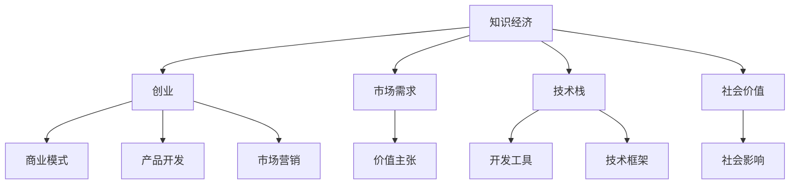

                 

# 知识经济下程序员的创业思路

## 1. 背景介绍

### 1.1 问题由来
随着知识经济的兴起，技术和创意成为推动社会发展的核心动力。程序员作为知识创造的重要力量，正在迎来前所未有的发展机遇。如何在知识经济下，把握创业方向，实现个人价值与社会价值的统一，成为了众多程序员关注的焦点。

### 1.2 问题核心关键点
知识经济下，程序员创业的核心在于将技术创新与市场需求相结合，创造具有社会价值和经济效益的解决方案。这一过程涉及技术栈选择、市场需求分析、商业模式设计等多个关键环节。

### 1.3 问题研究意义
研究知识经济下程序员的创业思路，对于促进技术创新、加速社会转型、培养新一代科技创业人才具有重要意义：

1. 促进技术创新：通过技术突破和应用创新，推动知识经济的发展。
2. 加速社会转型：运用技术手段解决社会问题，提升社会治理能力。
3. 培养创业人才：为程序员提供创业指导和资源支持，加速技术转化为生产力。

## 2. 核心概念与联系

### 2.1 核心概念概述

为更好地理解知识经济下程序员的创业思路，本节将介绍几个密切相关的核心概念：

- 知识经济：以知识为基础，以创新为驱动的经济形态，强调技术和创意在经济活动中的核心作用。
- 创业：利用创新思维和技术手段，创建具有市场竞争力的新公司或业务模式的过程。
- 商业模式：企业通过特定的价值主张，创造并捕获价值的商业模式模型。
- 技术栈：为实现特定产品或服务，所需的技术工具、框架和库的集合。
- 市场需求：用户或企业对产品或服务的需求，是创业方向选择的关键依据。
- 社会价值：产品或服务对社会发展和福祉提升的积极影响。

这些核心概念之间的逻辑关系可以通过以下Mermaid流程图来展示：



这个流程图展示的知识经济下程序员创业的关键要素及其之间的关系：

1. 知识经济是创业的环境和背景。
2. 市场需求和社交价值是创业的驱动力。
3. 技术栈是实现产品或服务的技术手段。
4. 商业模式是创业目标和盈利方式。

这些概念共同构成了程序员创业的理论基础，为创业实践提供了指导。

## 3. 核心算法原理 & 具体操作步骤
### 3.1 算法原理概述

知识经济下程序员的创业思路，本质上是将技术创新与市场需求进行匹配的过程。其核心思想是：利用技术栈选择合适的解决方案，并根据市场需求调整产品或服务的功能和价值主张，以实现商业模式创新和社会价值创造。

形式化地，假设市场需求为 $M$，技术栈为 $T$，社会价值为 $V$。创业的目标是通过选择最优的技术栈 $t \in T$，在给定的市场需求 $M$ 下，最大化社会价值 $V$，即：

$$
\max_{t \in T} V(M,t)
$$

通常，一个技术栈包含多种技术和工具，如前后端框架、数据库、云计算服务等。选择合适的技术栈需要综合考虑技术成熟度、开发效率、性能指标、可维护性等因素。

### 3.2 算法步骤详解

知识经济下程序员创业的一般步骤包括：

**Step 1: 市场需求调研**
- 进行市场调研，收集用户需求、行业动态、竞争分析等信息。
- 分析市场痛点，确定产品或服务的潜在价值。
- 制定市场定位，明确目标用户群体。

**Step 2: 技术栈选择**
- 根据市场需求，选择最合适的技术栈。
- 考虑技术栈的兼容性、可扩展性和社区支持。
- 评估技术栈的开发效率和性能。

**Step 3: 产品设计**
- 根据技术栈设计产品或服务的功能架构。
- 确定产品或服务的核心功能和附加功能。
- 制定产品路线图，设定开发优先级和里程碑。

**Step 4: 开发和测试**
- 组建开发团队，进行代码编写、测试和集成。
- 引入敏捷开发方法，进行迭代开发和持续集成。
- 进行性能测试、安全测试和用户体验测试。

**Step 5: 商业模式设计**
- 根据产品或服务的功能和价值主张，设计商业模式。
- 选择合适的盈利模式，如广告、订阅、交易佣金等。
- 制定定价策略，确保产品的市场竞争力。

**Step 6: 市场推广**
- 制定市场推广策略，选择合适的营销渠道。
- 进行产品演示、用户体验测试和用户反馈收集。
- 进行广告投放、内容营销和社交媒体推广。

**Step 7: 持续迭代**
- 根据用户反馈和市场变化，持续优化产品或服务。
- 引入反馈循环，不断迭代改进。
- 关注市场趋势，适时调整商业模式和技术栈。

以上是知识经济下程序员创业的一般流程。在实际应用中，还需要根据具体产品或服务的特性，对各个环节进行优化设计，如引入更灵活的市场响应机制、开发高效的项目管理工具、集成先进的技术栈等，以进一步提升创业的成功率和竞争力。

### 3.3 算法优缺点

知识经济下程序员的创业方法具有以下优点：

1. 快速响应市场需求：通过技术手段快速实现产品或服务，满足用户需求。
2. 创新驱动发展：利用技术创新推动产品或服务的不断改进，提升竞争力和市场份额。
3. 社会价值显著：通过解决社会问题，创造积极的社会影响。
4. 灵活性高：技术栈和产品形态可以根据市场需求灵活调整。

同时，该方法也存在一定的局限性：

1. 技术门槛高：需要较高的技术储备和开发能力。
2. 市场风险大：市场需求和市场变化不确定，创业成功具有高风险。
3. 资源需求大：初期投入大，包括人力、资金、时间等资源。
4. 缺乏经验：初次创业者经验不足，可能需要较长时间积累和学习。

尽管存在这些局限性，但就目前而言，知识经济下程序员的创业方法仍是创业实践的主流范式。未来相关研究的重点在于如何降低创业门槛，提高创业成功率，同时兼顾社会价值和经济效益。

### 3.4 算法应用领域

知识经济下程序员的创业思路，已经在多个领域得到了成功应用，例如：

- 智能医疗：通过AI技术解决医疗健康问题，如病历分析、疾病诊断、个性化治疗等。
- 智慧教育：利用AI技术提升教育质量，如在线教育、智能答疑、学习行为分析等。
- 金融科技：利用大数据和AI技术提升金融服务效率，如风险管理、智能投顾、金融分析等。
- 智能制造：通过AI技术优化生产流程，提高生产效率，降低生产成本，如预测性维护、质量检测、供应链管理等。
- 能源互联网：利用AI技术优化能源管理，提升能源利用效率，如智能电网、能源调度、能效管理等。
- 环境保护：利用AI技术监测环境变化，提升环境保护水平，如智能监测、污染预测、环保预警等。

除了上述这些经典领域外，知识经济下程序员的创业思路还被创新性地应用到更多场景中，如智能家居、智能交通、健康管理等，为各行各业带来新的变革和机遇。

## 4. 数学模型和公式 & 详细讲解 & 举例说明
### 4.1 数学模型构建

本节将使用数学语言对知识经济下程序员的创业思路进行更加严格的刻画。

记市场需求为 $M$，技术栈为 $T$，社会价值为 $V$。创业的目标是通过选择最优的技术栈 $t \in T$，在给定的市场需求 $M$ 下，最大化社会价值 $V$，即：

$$
\max_{t \in T} V(M,t)
$$

其中，$V$ 为社会价值函数，可以表示为市场需求 $M$ 和技术栈 $t$ 的函数，例如：

$$
V(M,t) = f(M,t) = g(M) \cdot h(t)
$$

其中 $g(M)$ 为市场需求的函数，$h(t)$ 为技术栈的函数。

### 4.2 公式推导过程

以下我们以智能医疗创业为例，推导市场需求和技术栈选择对社会价值的影响。

假设市场需求 $M$ 为病历分析任务，技术栈 $T$ 包括深度学习框架 TensorFlow 和 PyTorch。市场需求 $M$ 与技术栈 $t$ 的选择关系如下：

$$
M = f(t)
$$

其中 $f(t)$ 为技术栈 $t$ 的函数。例如，如果选择 TensorFlow，则 $M = g(tensorflow)$；如果选择 PyTorch，则 $M = g(pytorch)$。

社会价值 $V$ 函数可以表示为：

$$
V(M,t) = g(M) \cdot h(t)
$$

其中 $g(M)$ 为市场需求 $M$ 的函数，例如 $g(M) = 0.8 \cdot M$（市场需求越高，社会价值越高）。$h(t)$ 为技术栈 $t$ 的函数，例如 $h(tensorflow) = 0.9$，$h(pytorch) = 0.95$。

将 $M$ 和 $V$ 代入目标函数，得到：

$$
\max_{t \in \{tensorflow, pytorch\}} V(f(t),t) = \max_{t \in \{tensorflow, pytorch\}} (0.8 \cdot f(t)) \cdot h(t)
$$

其中 $f(tensorflow) = g(tensorflow) = 0.9$，$f(pytorch) = g(pytorch) = 0.95$。

通过求解该优化问题，可以找到最优的技术栈选择。例如，当市场需求 $M$ 较低时，最优选择为 TensorFlow；当市场需求 $M$ 较高时，最优选择为 PyTorch。

### 4.3 案例分析与讲解

下面以智慧教育创业为例，说明如何利用技术栈选择和市场需求分析来设计商业模式。

假设市场需求为在线教育平台，技术栈选择包括前端框架 React 和 Vue，后端框架 Node.js 和 Django。市场需求 $M$ 与技术栈 $t$ 的选择关系如下：

$$
M = f(t)
$$

其中 $f(t)$ 为技术栈 $t$ 的函数。例如，如果选择 React + Node.js，则 $M = g(react, nodejs)$；如果选择 Vue + Django，则 $M = g(vue, django)$。

社会价值 $V$ 函数可以表示为：

$$
V(M,t) = g(M) \cdot h(t)
$$

其中 $g(M)$ 为市场需求 $M$ 的函数，例如 $g(M) = 0.7 \cdot M$（市场需求越高，社会价值越高）。$h(t)$ 为技术栈 $t$ 的函数，例如 $h(react, nodejs) = 0.85$，$h(vue, django) = 0.90$。

将 $M$ 和 $V$ 代入目标函数，得到：

$$
\max_{t \in \{(react, nodejs), (vue, django)\}} V(f(t),t) = \max_{t \in \{(react, nodejs), (vue, django)\}} (0.7 \cdot f(t)) \cdot h(t)
$$

其中 $f((react, nodejs)) = g(react, nodejs) = 0.9$，$f((vue, django)) = g(vue, django) = 0.95$。

通过求解该优化问题，可以找到最优的技术栈选择。例如，当市场需求 $M$ 较低时，最优选择为 React + Node.js；当市场需求 $M$ 较高时，最优选择为 Vue + Django。

根据选择的最优技术栈，设计相应的商业模式，例如：

- 订阅制：用户支付月度或年度订阅费用，获取平台提供的个性化教育资源和在线课程。
- 广告收入：平台通过展示广告和推荐系统获取广告收入。
- 交易佣金：平台与教育机构合作，收取课程交易的佣金。

通过合理的商业模式设计，可以实现技术栈与市场需求的最大化匹配，创造出具有社会价值和经济效益的在线教育平台。

## 5. 项目实践：代码实例和详细解释说明
### 5.1 开发环境搭建

在进行创业实践前，我们需要准备好开发环境。以下是使用Python进行Flask框架开发的环境配置流程：

1. 安装Anaconda：从官网下载并安装Anaconda，用于创建独立的Python环境。

2. 创建并激活虚拟环境：
```bash
conda create -n flask-env python=3.8 
conda activate flask-env
```

3. 安装Flask：
```bash
pip install flask
```

4. 安装SQLAlchemy：
```bash
pip install sqlalchemy
```

5. 安装SQLite：
```bash
pip install sqlite3
```

完成上述步骤后，即可在`flask-env`环境中开始创业实践。

### 5.2 源代码详细实现

这里我们以智慧教育创业为例，给出使用Flask框架和SQLAlchemy进行在线教育平台开发的PyTorch代码实现。

首先，定义数据模型：

```python
from sqlalchemy import create_engine, Column, Integer, String, Float
from sqlalchemy.ext.declarative import declarative_base
from sqlalchemy.orm import sessionmaker

Base = declarative_base()

class User(Base):
    __tablename__ = 'users'
    id = Column(Integer, primary_key=True)
    name = Column(String(50))
    age = Column(Integer)
    email = Column(String(50))
    password = Column(String(50))

class Course(Base):
    __tablename__ = 'courses'
    id = Column(Integer, primary_key=True)
    name = Column(String(50))
    duration = Column(Integer)
    price = Column(Float)
    user_id = Column(Integer, ForeignKey('users.id'))

# 创建数据库连接
engine = create_engine('sqlite:///smartedu.db')
Base.metadata.create_all(engine)
Session = sessionmaker(bind=engine)
```

然后，定义API接口：

```python
from flask import Flask, jsonify, request
from flask_sqlalchemy import SQLAlchemy
from sqlalchemy.orm import sessionmaker

app = Flask(__name__)
app.config['SQLALCHEMY_DATABASE_URI'] = 'sqlite:///smartedu.db'
db = SQLAlchemy(app)
Session = sessionmaker(bind=app.config['SQLALCHEMY_DATABASE_URI'])
session = Session()

# 获取用户列表
@app.route('/users', methods=['GET'])
def get_users():
    users = session.query(User).all()
    return jsonify([{'id': user.id, 'name': user.name, 'age': user.age, 'email': user.email} for user in users])

# 获取课程列表
@app.route('/courses', methods=['GET'])
def get_courses():
    courses = session.query(Course).all()
    return jsonify([{'id': course.id, 'name': course.name, 'duration': course.duration, 'price': course.price} for course in courses])

# 获取用户报名信息
@app.route('/enroll', methods=['POST'])
def enroll():
    data = request.get_json()
    user_id = data['user_id']
    course_id = data['course_id']
    enrollment = {
        'user_id': user_id,
        'course_id': course_id
    }
    session.add(enrollment)
    session.commit()
    return jsonify(enrollment)

# 用户登录验证
@app.route('/login', methods=['POST'])
def login():
    data = request.get_json()
    email = data['email']
    password = data['password']
    user = session.query(User).filter_by(email=email, password=password).first()
    if user:
        return jsonify({'status': 'success', 'user_id': user.id})
    else:
        return jsonify({'status': 'error', 'message': 'Invalid credentials'})

# 用户注册
@app.route('/register', methods=['POST'])
def register():
    data = request.get_json()
    name = data['name']
    age = data['age']
    email = data['email']
    password = data['password']
    user = User(name=name, age=age, email=email, password=password)
    session.add(user)
    session.commit()
    return jsonify({'status': 'success', 'user_id': user.id})

if __name__ == '__main__':
    app.run(debug=True)
```

最后，启动Flask服务，并测试API接口：

```bash
python app.py
```

在浏览器中访问 `http://localhost:5000`，即可测试上述API接口的响应。

### 5.3 代码解读与分析

让我们再详细解读一下关键代码的实现细节：

**User类和Course类**：
- `__init__`方法：初始化用户和课程的姓名、年龄、邮箱、密码、时长和价格等属性。
- `__repr__`方法：返回对象的字符串表示形式，方便调试。

**数据库连接和会话管理**：
- `engine`：创建SQLite数据库连接。
- `Base.metadata.create_all(engine)`：创建数据库表结构。
- `Session`：创建SQLAlchemy会话对象，用于进行数据库操作。

**API接口**：
- `get_users`：获取所有用户的列表，返回JSON格式的用户信息。
- `get_courses`：获取所有课程的列表，返回JSON格式的课程信息。
- `enroll`：获取用户报名信息，将报名数据保存到数据库中。
- `login`：用户登录验证，根据输入的邮箱和密码获取用户信息。
- `register`：用户注册，将用户信息保存到数据库中。

**Flask应用**：
- `app = Flask(__name__)`：创建Flask应用实例。
- `app.config['SQLALCHEMY_DATABASE_URI']`：设置数据库连接URI。
- `SQLAlchemy(app)`：初始化SQLAlchemy。
- `Session = sessionmaker(bind=app.config['SQLALCHEMY_DATABASE_URI'])`：创建SQLAlchemy会话。
- `session = Session()`：创建数据库会话对象。

通过上述代码，我们展示了如何使用Flask框架和SQLAlchemy进行在线教育平台开发的完整过程。可以看到，使用Flask框架进行API接口开发，结合SQLAlchemy进行数据库操作，可以显著简化创业项目的技术栈选择和应用开发。

## 6. 实际应用场景
### 6.1 智能医疗

知识经济下程序员的创业思路，在智能医疗领域也得到了广泛应用。智能医疗通过AI技术提升医疗服务的效率和质量，解决复杂的医学问题，提升患者的治疗效果和生活质量。

在技术实现上，可以收集大量的医学数据，如病历、影像、基因信息等，并利用AI技术进行预训练和微调，构建智能诊断、预测和治疗系统。例如，可以利用BERT模型对病历文本进行语义理解，提取关键信息，辅助医生进行疾病诊断。

### 6.2 智慧教育

知识经济下程序员的创业思路，在智慧教育领域同样具有广阔的应用前景。通过AI技术，智慧教育可以解决教育资源分配不均、教育质量参差不齐等问题，提升教育的公平性和质量。

具体而言，可以通过AI技术进行个性化教学、智能答疑、学习行为分析等。例如，可以开发智能推荐系统，根据学生的学习情况和兴趣，推荐最适合的学习资源和课程，提高学习效果。同时，通过分析学生的学习行为数据，可以发现学生的学习瓶颈和问题，提供个性化的学习建议和干预。

### 6.3 金融科技

知识经济下程序员的创业思路，在金融科技领域也得到了广泛应用。金融科技通过大数据和AI技术，提升金融服务的效率和安全性，解决传统金融领域的痛点。

在技术实现上，可以开发智能投顾、风险管理、金融分析等系统。例如，可以开发智能投顾系统，通过AI技术对市场数据进行分析和预测，帮助用户制定最优的投资策略，提升投资收益。同时，通过AI技术进行风险评估和监控，降低金融风险。

### 6.4 未来应用展望

随着知识经济的发展，基于程序员创业思路的各类技术应用将不断拓展，带来更多的创新机遇。

在智慧城市领域，知识经济下程序员的创业思路可以应用于智慧交通、智能安防、环保监测等，提升城市治理能力和居民生活质量。

在健康管理领域，知识经济下程序员的创业思路可以应用于个性化健康管理、智能医疗咨询、健康数据分析等，提升人们的健康水平。

在农业领域，知识经济下程序员的创业思路可以应用于智能农业、精准农业、农业机器人等，提升农业生产效率和可持续性。

总之，知识经济下程序员的创业思路将为各行各业带来新的创新和变革，推动社会进步和经济发展。

## 7. 工具和资源推荐
### 7.1 学习资源推荐

为了帮助程序员系统掌握知识经济下创业的思路和方法，这里推荐一些优质的学习资源：

1. 《程序员创业指南》系列博文：由创业者和技术专家撰写，涵盖从市场需求分析到商业模式设计的全流程指导。

2. 《商业模式创新》课程：由知名商学院教授开设，介绍商业模式创新的方法和案例，帮助程序员设计高效可行的商业模型。

3. 《技术创业实战》书籍：由成功创业者撰写，结合真实案例，介绍技术创业的关键点和方法论。

4. 《精益创业》书籍：介绍精益创业方法论，帮助程序员快速验证和迭代产品，减少创业风险。

5. 《创业融资》课程：介绍创业融资的流程和技巧，帮助程序员顺利获得投资。

通过对这些资源的学习实践，相信你一定能够系统掌握知识经济下程序员的创业思路，并应用于解决实际的创业问题。

### 7.2 开发工具推荐

高效的开发离不开优秀的工具支持。以下是几款用于知识经济下程序员创业开发的常用工具：

1. Python：作为知识经济下程序员创业的首选语言，具有丰富的生态系统和高效的标准库，方便快速开发。

2. Flask：轻量级的Web框架，简单易用，适合快速搭建API接口。

3. SQLAlchemy：Python的ORM框架，支持多种数据库，方便进行数据库操作。

4. Git：版本控制系统，帮助程序员进行代码管理和协作开发。

5. Docker：容器化技术，方便快速部署和扩展应用。

6. Jupyter Notebook：交互式编程环境，支持代码运行和结果展示，方便快速迭代和调试。

7. GitHub：代码托管平台，方便团队协作和代码版本管理。

合理利用这些工具，可以显著提升知识经济下程序员的创业实践效率，加速技术创新和市场化进程。

### 7.3 相关论文推荐

知识经济下程序员的创业思路，得益于学界的持续研究。以下是几篇奠基性的相关论文，推荐阅读：

1. "The Lean Startup" by Eric Ries：介绍精益创业方法论，强调快速验证和迭代。

2. "Business Model Generation" by Alexander Osterwalder and Yves Pigneur：介绍商业模式创新方法，帮助创业者设计可行的商业模式。

3. "The AI Superpowers: China, Silicon Valley, and the New World Order" by Kai-Fu Lee：探讨AI技术在创业中的作用和潜力。

4. "Deep Learning for Healthcare: Current Status, Trends, and Challenges" by Milana Pereltsvaig：介绍AI在医疗领域的应用和未来趋势。

5. "Artificial Intelligence in Healthcare: The Next 50 Years" by Mark G. Babstract：探讨AI在医疗领域的发展前景和挑战。

这些论文代表了大数据和AI技术在创业中的前沿研究，为程序员提供了丰富的理论和方法论支持。

## 8. 总结：未来发展趋势与挑战

### 8.1 总结

本文对知识经济下程序员的创业思路进行了全面系统的介绍。首先阐述了知识经济下的创业背景和意义，明确了创业者如何在技术创新和市场需求之间寻找平衡，创造具有社会价值和经济效益的解决方案。其次，从理论到实践，详细讲解了知识经济下程序员的创业步骤和技术栈选择方法，给出了创业项目的代码实现和案例分析。同时，本文还广泛探讨了知识经济下程序员的创业思路在智能医疗、智慧教育、金融科技等多个领域的应用前景，展示了创业思路的广阔发展空间。最后，本文精选了知识经济下创业思路的学习资源、开发工具和相关论文，力求为程序员提供全方位的技术指引。

通过本文的系统梳理，可以看到，知识经济下程序员的创业思路将为创业者提供强大的技术支持，帮助他们实现个人价值和社会价值的统一。面向未来，知识经济下程序员的创业思路还将与大数据、AI技术等前沿技术进行更深层次的融合，推动各行业的创新发展。

### 8.2 未来发展趋势

展望未来，知识经济下程序员的创业思路将呈现以下几个发展趋势：

1. 技术融合加速：大数据、AI、区块链等前沿技术将在创业中得到广泛应用，提升创业项目的创新性和市场竞争力。

2. 市场需求多样化：随着社会的发展，市场对各类技术应用的需求将更加多元化，创业者需要更灵活地应对不同的市场需求。

3. 社会价值凸显：创业项目将更加注重社会价值的创造，利用技术手段解决社会问题，提升社会福利。

4. 全球化合作加强：国际合作和技术交流将更加频繁，创业者需要具备跨文化、跨地域的合作能力。

5. 开放创新平台兴起：各类开源社区和创新平台将为创业者提供更多技术资源和市场机会，促进技术创新和创业生态的繁荣。

这些趋势凸显了知识经济下程序员创业思路的广阔前景。这些方向的探索发展，必将引领程序员创业进入新的高度，为社会带来更多的创新和变革。

### 8.3 面临的挑战

尽管知识经济下程序员的创业思路已经取得了显著成果，但在迈向更加智能化、普适化应用的过程中，它仍面临诸多挑战：

1. 技术门槛高：大数据和AI技术的复杂性，要求创业者具备较高的技术储备和开发能力。

2. 市场竞争激烈：各类新兴技术层出不穷，市场竞争日趋激烈，创业者需要不断学习和创新。

3. 资金和人才需求大：创业项目需要大量的资金和人才投入，初期投入大，风险高。

4. 用户隐私和数据安全：创业项目涉及大量的用户数据，如何保障用户隐私和数据安全，需要更高的技术和管理水平。

5. 法律法规约束：各国对大数据和AI技术的法律法规不同，创业者需要了解并遵守相关法规，避免法律风险。

尽管存在这些挑战，但正是这些挑战推动了技术创新和商业模式创新，为知识经济下程序员的创业思路提供了不断进步的动力。

### 8.4 研究展望

面向未来，知识经济下程序员的创业思路需要在以下几个方面进行深入研究：

1. 技术融合创新：研究大数据、AI、区块链等前沿技术在创业中的融合应用，提升创业项目的创新性和竞争力。

2. 市场需求的动态监测：建立市场需求的动态监测系统，及时调整创业方向和策略。

3. 社会价值的最大化：研究如何利用技术手段最大化社会价值，提升创业项目的社会影响力和市场认可度。

4. 开源创新平台的建设：构建开放创新平台，促进技术交流和资源共享，提升创业项目的创新能力和市场机会。

5. 法律法规和伦理规范：研究各国对大数据和AI技术的法律法规和伦理规范，制定合规的创业策略和技术方案。

这些研究方向将为知识经济下程序员的创业思路提供新的思路和方向，推动知识经济下创业生态的不断进步。

## 9. 附录：常见问题与解答

**Q1：知识经济下程序员的创业思路是否适用于所有技术领域？**

A: 知识经济下程序员的创业思路适用于大多数技术领域，特别是数据密集型和技术密集型的领域。然而，对于某些特定领域，如生物医学、物理化学等，需要更多的跨学科知识和专业知识。

**Q2：如何选择最优的技术栈？**

A: 选择最优的技术栈需要综合考虑技术成熟度、开发效率、性能指标、可维护性等因素。一般来说，优先选择成熟的开源技术和社区支持丰富的项目，同时考虑技术栈的扩展性和兼容性。

**Q3：创业过程中如何处理市场风险？**

A: 市场风险是创业过程中不可避免的一部分。可以通过市场调研、小规模试点和用户反馈来降低风险。同时，引入敏捷开发和精益创业方法，快速迭代和调整策略，避免大规模资源浪费。

**Q4：如何保障用户隐私和数据安全？**

A: 保障用户隐私和数据安全是创业项目的重要责任。需要建立完善的数据保护机制，如数据加密、匿名化处理、访问控制等，确保用户数据的安全性和隐私性。

**Q5：如何提高创业项目的社会价值？**

A: 提高创业项目的社会价值需要从产品设计、用户体验和技术创新等多个方面入手。通过深入了解市场需求和社会问题，设计具有社会价值的产品和服务。同时，引入社会责任机制，确保项目在追求经济效益的同时，也关注社会效益。

通过这些常见问题的解答，相信你对知识经济下程序员的创业思路有了更全面的了解。无论是在创业之初还是项目开发中，都能够根据实际情况，灵活应用和调整策略，实现技术创新和社会价值的统一。

---

作者：禅与计算机程序设计艺术 / Zen and the Art of Computer Programming

