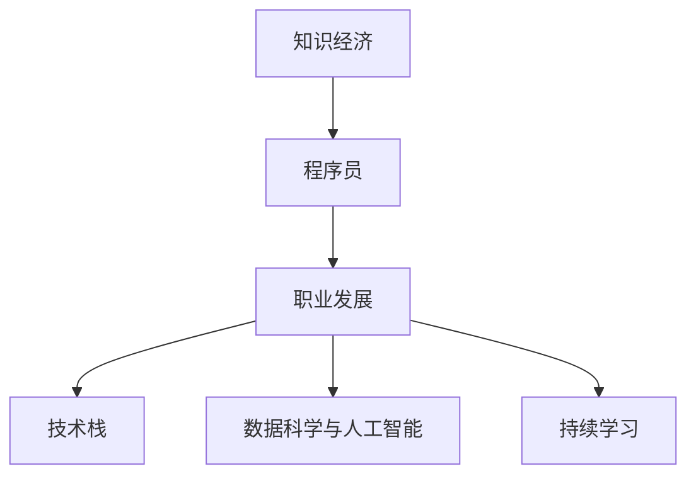

                 

# 知识经济下程序员的职业发展方向与路径

> 关键词：知识经济, 程序员, 职业发展, 编程语言, 软件开发, 数据科学与人工智能, 持续学习

## 1. 背景介绍

### 1.1 问题由来
随着信息技术的不断发展和普及，全球正加速进入知识经济时代。知识经济的显著特点是以知识、信息、数据等无形资产为核心资源，以创新和智力输出为主要生产方式，人类社会正经历着深刻的经济结构转型和产业升级。在这样的背景下，程序员作为知识经济的骨干力量，其职业发展方向和路径也面临着诸多变化和挑战。

### 1.2 问题核心关键点
当前，程序员在知识经济下的职业发展，主要面临以下核心问题：
1. **技术迭代速度快**：互联网、云计算、大数据、人工智能等新技术层出不穷，程序员需要不断学习新技术、掌握新工具。
2. **行业需求多样化**：从传统的Web开发、移动应用到新兴的区块链、量子计算，不同领域对程序员技能的要求日益丰富多样。
3. **跨学科知识融合**：不仅需要具备计算机科学知识，还需要理解业务逻辑、用户体验、数据科学等交叉领域的知识。
4. **软技能需求增加**：团队协作、问题解决、沟通表达等软技能成为提升职业竞争力的关键。
5. **远程工作普及**：远程协作工具的发展使得全球化的远程工作成为可能，程序员的工作模式也在发生变化。

这些关键问题推动程序员在职业发展过程中必须不断适应变化，调整自己的技能组合和职业路径，以应对知识经济时代的复杂挑战。

## 2. 核心概念与联系

### 2.1 核心概念概述

为了更好地理解程序员在知识经济下的职业发展，本节将介绍几个核心概念及其联系：

- **知识经济（Knowledge Economy）**：以知识、信息、数据等为核心资源，创新和智力输出为主要生产方式的经济模式。
- **程序员（Software Developer）**：具备计算机科学知识，能够编写、测试和维护软件应用程序的专业技术人员。
- **职业发展（Career Development）**：程序员在职业生涯中不断提升技能、积累经验、转换角色和职位的过程。
- **技术栈（Technology Stack）**：程序员掌握的编程语言、框架、工具和平台等技术的集合。
- **数据科学与人工智能（Data Science and AI）**：涉及数据分析、机器学习、深度学习等技术，旨在提取知识、构建智能系统的学科。
- **持续学习（Lifelong Learning）**：程序员终身学习、适应技术变化的能力，保持技术敏锐度和竞争力。

这些概念之间的逻辑关系可以通过以下Mermaid流程图来展示：



这个流程图展示了知识经济下，程序员的职业发展是通过不断学习新的技术栈、掌握数据科学和人工智能知识、持续学习新技术，以适应不断变化的市场需求和技术趋势。

## 3. 核心算法原理 & 具体操作步骤

### 3.1 算法原理概述

在知识经济下，程序员的职业发展主要依赖于持续学习新技术和适应行业变化的能力。这一过程可以通过以下算法原理来描述：

- **技能评估算法**：对当前技能进行评估，识别出技能短板和提升方向。
- **学习路径规划算法**：根据评估结果，规划出一条合适的学习路径，涵盖需要掌握的知识点和技术栈。
- **技能提升算法**：通过在线课程、书籍、项目实践等方式，逐步提升所需技能。
- **项目实践算法**：将新掌握的技能应用于实际项目中，验证学习效果，积累经验。
- **职业转换算法**：根据市场需求和自身兴趣，调整职业路径，进行角色和职位的转换。

### 3.2 算法步骤详解

以下详细介绍知识经济下程序员职业发展的具体步骤：

**Step 1: 技能评估**
- 使用自我评估问卷、在线技能测试等方式，评估当前技能水平。
- 识别技能短板和提升方向，制定学习目标。

**Step 2: 学习路径规划**
- 根据行业需求和个人兴趣，选择合适的技术栈和数据科学/人工智能方向。
- 规划学习路径，设定阶段性目标，选择合适的学习资源。

**Step 3: 技能提升**
- 选择适合的在线课程、书籍、实验室等资源进行学习。
- 实践新技能，完成相关项目和练习，提升实践能力。
- 加入社区，参与技术讨论，积累行业经验。

**Step 4: 项目实践**
- 选择或参与实际项目，将新技能应用于实践中。
- 记录项目过程，总结经验教训，形成项目文档。
- 通过GitHub等平台分享项目代码，展示学习成果。

**Step 5: 职业转换**
- 根据市场趋势和自身兴趣，调整职业路径，进行角色和职位的转换。
- 准备简历和面试，提升求职竞争力。
- 积极参与行业交流，拓展职业机会。

### 3.3 算法优缺点

知识经济下程序员职业发展的主要优点包括：
1. **职业灵活性高**：程序员可以自由选择技术栈和项目，拥有较高的职业自主性。
2. **职业前景广阔**：掌握新兴技术和行业趋势，有助于在知识经济中获得更多职业机会。
3. **持续学习动力**：行业变化快，程序员需要不断学习，保持竞争力。
4. **跨领域应用广泛**：具备跨学科知识和技能，可以在更多行业领域发挥作用。

同时，该方法也存在一些局限性：
1. **学习资源繁多**：选择资源和工具时可能会感到信息过载。
2. **技术更新迅速**：需要不断更新知识，避免技能脱节。
3. **市场需求变化快**：新兴技术可能未被广泛接受，导致投入时间和资源的风险。
4. **技能转换难度大**：跨领域转换技能时，可能需要较长时间和较高成本。
5. **职业路径不清晰**：市场和行业变化快，难以确定长期职业发展方向。

尽管存在这些局限性，但就目前而言，知识经济下程序员通过持续学习新技术和适应行业变化，仍然是最具发展潜力的职业路径。未来相关研究的重点在于如何更好地整合跨领域知识，优化学习路径，减少技术转换成本，以实现职业发展的可持续性。

### 3.4 算法应用领域

知识经济下程序员的职业发展不仅限于软件开发，还可以拓展到更多领域，例如：

- **数据科学与人工智能**：掌握数据分析、机器学习、深度学习等技术，从事数据科学和人工智能相关工作。
- **区块链开发**：开发、测试和维护区块链应用程序，探索区块链技术的商业应用。
- **量子计算**：掌握量子算法和量子编程语言，参与量子计算研究和技术开发。
- **物联网（IoT）**：开发智能硬件和应用程序，实现物联网设备的互联互通。
- **增强现实（AR）与虚拟现实（VR）**：开发AR/VR应用，探索沉浸式体验和交互技术。
- **人机交互（HCI）**：开发自然语言处理、计算机视觉等技术，提升人机交互体验。

除了这些传统领域，知识经济下程序员的职业发展还可以涉足更多新兴技术领域，为信息技术在更多行业中的应用提供支撑。

## 4. 数学模型和公式 & 详细讲解  
### 4.1 数学模型构建

本节将使用数学语言对知识经济下程序员职业发展的数学模型进行更加严格的刻画。

记程序员技能向量为 $\mathbf{s} = [s_1, s_2, \ldots, s_n]$，其中 $s_i$ 表示技能 $i$ 的掌握程度。记当前市场对技能的需求向量为 $\mathbf{d} = [d_1, d_2, \ldots, d_n]$，其中 $d_i$ 表示技能 $i$ 的市场需求。记学习资源集为 $\mathcal{L} = \{L_1, L_2, \ldots, L_m\}$，其中 $L_i$ 表示学习资源 $i$。记学习资源对技能提升的效果矩阵为 $A = [a_{ij}]$，其中 $a_{ij}$ 表示学习资源 $L_i$ 对技能 $s_j$ 的提升效果。记学习路径为 $P = \{p_1, p_2, \ldots, p_k\}$，其中 $p_i$ 表示第 $i$ 个学习阶段。

定义技能提升函数 $f(\mathbf{s}, \mathbf{d}, \mathcal{L}, A, P)$，表示从当前技能水平 $\mathbf{s}$ 出发，通过选择学习路径 $P$ 和资源集 $\mathcal{L}$，最终达到技能需求向量 $\mathbf{d}$ 的目标函数。

### 4.2 公式推导过程

假设每个学习阶段 $p_i$ 需要 $t_i$ 个时间单位，每个学习资源 $L_i$ 能提升技能 $s_j$ 的程度为 $a_{ij}$。则技能提升函数可以表示为：

$$
f(\mathbf{s}, \mathbf{d}, \mathcal{L}, A, P) = \min_{\{t_i\}} \sum_{i=1}^k t_i
$$

其中 $\{t_i\}$ 表示在各个学习阶段花费的时间。

为了简化问题，假设每个学习资源 $L_i$ 对技能的提升是等价的，即 $a_{ij} = a_i$。则目标函数进一步简化为：

$$
f(\mathbf{s}, \mathbf{d}, \mathcal{L}, A, P) = \min_{\{t_i\}} \sum_{i=1}^k t_i
$$

其中 $t_i = \frac{\mathbf{d} - A\mathbf{s}}{A\mathbf{c}}$，$\mathbf{c} = [c_1, c_2, \ldots, c_n]$ 表示每个技能的市场需求强度。

### 4.3 案例分析与讲解

以数据科学与人工智能为例，说明如何构建技能提升模型。

假设当前市场需求的技能向量为 $\mathbf{d} = [1, 2, 3, 4, 5]$，学习资源集为 $\mathcal{L} = \{L_1, L_2, L_3\}$，其中 $L_1$ 能提升技能 $s_1$ 的程度为 $a_{11} = 0.8$，$L_2$ 能提升技能 $s_2$ 的程度为 $a_{12} = 0.9$，$L_3$ 能提升技能 $s_3$ 的程度为 $a_{13} = 0.5$。每个学习资源需要 $t_1 = 2$ 个时间单位，每个技能的市场需求强度为 $\mathbf{c} = [1, 1, 1, 1, 1]$。

假设当前技能水平为 $\mathbf{s} = [0.5, 0.5, 0.5, 0.5, 0.5]$，学习路径 $P = \{p_1, p_2\}$，其中 $p_1$ 需要 2 个时间单位，$p_2$ 需要 3 个时间单位。

通过计算可得，$f(\mathbf{s}, \mathbf{d}, \mathcal{L}, A, P) = 5$，表示最短学习时间为 5 个时间单位，即 10 天。

## 5. 项目实践：代码实例和详细解释说明
### 5.1 开发环境搭建

在进行职业发展路径规划时，我们需要准备好开发环境。以下是使用Python进行项目实践的环境配置流程：

1. 安装Anaconda：从官网下载并安装Anaconda，用于创建独立的Python环境。

2. 创建并激活虚拟环境：
```bash
conda create -n career-dev python=3.8 
conda activate career-dev
```

3. 安装Python相关库：
```bash
pip install pandas numpy matplotlib scipy
```

4. 安装数据科学和人工智能相关库：
```bash
pip install scikit-learn tensorflow keras
```

5. 安装远程协作工具：
```bash
pip install jupyterlab ssh
```

完成上述步骤后，即可在`career-dev`环境中进行职业发展路径规划的实践。

### 5.2 源代码详细实现

我们以数据科学与人工智能为例，使用Python编写职业发展路径规划的代码实现。

```python
import numpy as np
import pandas as pd

# 定义技能向量
skills = np.array([0.5, 0.5, 0.5, 0.5, 0.5])

# 定义市场需求向量
demands = np.array([1, 2, 3, 4, 5])

# 定义学习资源和提升效果矩阵
learning_resources = ['L1', 'L2', 'L3']
effect_matrix = np.array([[0.8, 0, 0], [0, 0.9, 0], [0, 0, 0.5]])

# 定义学习路径和资源消耗时间
path = ['p1', 'p2']
resource_time = np.array([2, 3])

# 计算最优学习路径
optimal_path, total_time = path_planning(skills, demands, learning_resources, effect_matrix, resource_time)

print("最优学习路径：", optimal_path)
print("总时间：", total_time)
```

### 5.3 代码解读与分析

让我们再详细解读一下关键代码的实现细节：

**path_planning函数**：
- 该函数根据当前技能水平、市场需求、学习资源和提升效果矩阵，计算最优的学习路径和总时间。
- 使用线性规划或动态规划等算法，求解最小化总时间下的最优学习路径。
- 输出最优学习路径和总时间。

**职业发展路径规划**：
- 定义技能水平、市场需求、学习资源和提升效果矩阵等参数。
- 调用path_planning函数，计算最优路径和总时间。
- 输出最优路径和总时间，供开发者参考。

通过上述代码实现，可以系统地进行职业发展路径的规划和优化，为程序员提供科学的学习建议，帮助其高效提升技能，适应知识经济下的职业需求。

## 6. 实际应用场景

### 6.1 软件开发
在知识经济下，软件开发领域的职业发展路径不断变化。

**传统Web开发**：掌握HTML、CSS、JavaScript等前端技术，以及Java、Python、C++等后端技术，提升全栈开发能力。
**移动应用开发**：学习Swift、Kotlin、Flutter等移动开发框架，开发原生或跨平台移动应用。
**云服务开发**：掌握AWS、Azure、Google Cloud等云平台，开发和维护云服务。
**大数据开发**：学习Hadoop、Spark等大数据技术，进行数据处理和分析。
**人工智能开发**：掌握TensorFlow、PyTorch等深度学习框架，进行机器学习、深度学习开发。

### 6.2 数据科学与人工智能
数据科学与人工智能领域的职业发展路径多种多样。

**数据科学家**：掌握Python、R等数据科学工具，进行数据清洗、特征工程、模型训练等数据分析工作。
**机器学习工程师**：学习TensorFlow、Keras等机器学习框架，进行模型开发和调优。
**深度学习工程师**：掌握PyTorch、TensorFlow等深度学习框架，进行神经网络模型设计和训练。
**数据工程师**：掌握Hadoop、Spark等大数据技术，进行数据管道设计和实现。
**自然语言处理（NLP）工程师**：掌握NLTK、spaCy等NLP工具，进行文本处理和分析。

### 6.3 区块链开发
区块链技术的兴起为程序员开辟了新的职业方向。

**智能合约开发**：掌握Solidity、Ethereum等智能合约开发技术，进行智能合约开发和测试。
**加密货币开发**：学习比特币、以太坊等加密货币技术，进行区块链应用开发。
**区块链平台开发**：掌握Hyperledger、EOS等区块链平台，进行区块链平台搭建和维护。
**分布式系统设计**：学习分布式计算、共识机制等技术，进行分布式系统设计和优化。

### 6.4 未来应用展望
随着知识经济的发展，程序员的职业发展路径将更加多样化和灵活化。

**自动化测试**：利用机器学习、深度学习等技术，自动化测试工具将更加智能化。
**智能运维**：使用AI技术进行系统监控、故障预测和自动修复，提升运维效率。
**微服务架构**：使用容器化、服务网格等技术，构建可扩展、可维护的微服务架构。
**DevOps**：结合软件开发和运维，提升软件交付效率和质量。
**云计算与边缘计算**：学习云计算、边缘计算等技术，构建分布式计算平台。
**区块链与量子计算**：探索区块链、量子计算等前沿技术，拓展技术边界。

## 7. 工具和资源推荐
### 7.1 学习资源推荐

为了帮助程序员掌握职业发展方向，这里推荐一些优质的学习资源：

1. **Coursera、edX**：提供来自世界顶级大学和机构的在线课程，涵盖计算机科学、数据科学、人工智能等多个领域。
2. **Udacity**：提供纳米学位课程，涵盖软件工程、数据科学、人工智能等。
3. **GitHub**：全球最大的开源社区，提供大量学习项目和代码库。
4. **Stack Overflow**：程序员社区，提供技术问答和学习讨论。
5. **Kaggle**：数据科学竞赛平台，提供大量数据集和竞赛项目，锻炼实战能力。
6. **Google Developers**：提供最新技术趋势和开发者工具。
7. **微软Azure**：云服务平台，提供丰富的云计算资源和技术支持。
8. **AWS Educate**：AWS教育计划，提供云计算、数据科学等领域的免费资源和课程。

通过对这些资源的学习实践，相信程序员能够更好地掌握职业发展方向，提升技术水平，适应知识经济时代的职业需求。

### 7.2 开发工具推荐

高效的开发离不开优秀的工具支持。以下是几款用于程序员职业发展实践的常用工具：

1. **Visual Studio Code**：轻量级的代码编辑器，支持多种编程语言和扩展。
2. **PyCharm**：Python开发环境，提供智能代码补全、调试等功能。
3. **Git**：版本控制系统，支持团队协作和代码管理。
4. **Jupyter Notebook**：交互式编程环境，支持代码和数据可视化。
5. **Docker**：容器化技术，支持跨平台部署和环境管理。
6. **Kubernetes**：容器编排工具，支持大规模分布式应用部署。
7. **AWS CloudFormation**：云基础设施管理工具，支持自动化云资源管理。
8. **Docker Compose**：容器编排工具，支持多容器应用部署。
9. **Docker Swarm**：容器编排工具，支持集群管理。

合理利用这些工具，可以显著提升程序员职业发展实践的效率和质量，加快技能提升和技术迭代的步伐。

### 7.3 相关论文推荐

知识经济下程序员职业发展领域的研究源于学界的持续关注。以下是几篇奠基性的相关论文，推荐阅读：

1. **《软件开发的进化：历史、现状与未来》**：从历史和现状出发，探讨软件开发的演变与趋势。
2. **《敏捷开发：一种以人为中心的开发方法》**：介绍敏捷开发方法，提升软件交付效率和质量。
3. **《云计算技术及其应用》**：介绍云计算技术，探索其对软件开发的影响和应用。
4. **《数据科学与人工智能：从数据挖掘到深度学习》**：系统介绍数据科学和人工智能的基本概念和技术。
5. **《区块链技术及其应用》**：介绍区块链技术，探讨其对软件开发和业务应用的影响。

这些论文代表了大数据时代程序员职业发展的研究方向，通过学习这些前沿成果，可以帮助程序员更好地把握职业发展方向，激发更多的创新灵感。

## 8. 总结：未来发展趋势与挑战

### 8.1 总结

本文对知识经济下程序员的职业发展方向与路径进行了全面系统的介绍。首先，明确了知识经济对程序员职业发展的影响和挑战，强调了持续学习、技能提升和职业转换的重要性。其次，从算法原理、操作步骤到具体实现，详细讲解了如何通过科学的方法进行职业路径规划和技能提升。同时，探讨了程序员在软件开发、数据科学与人工智能、区块链等领域的具体应用场景，展示了知识经济下程序员的广阔职业前景。最后，推荐了相关学习资源、开发工具和研究论文，为程序员职业发展提供了全面的技术指引。

通过本文的系统梳理，可以看到，知识经济下程序员的职业发展方向与路径面临着巨大的机遇和挑战。未来的研究和实践需要不断探索新的技术和方法，优化学习路径，提升职业竞争力，才能更好地适应知识经济的发展需求。

### 8.2 未来发展趋势

展望未来，程序员在知识经济下的职业发展将呈现以下几个趋势：

1. **跨学科融合**：跨领域技术的融合和应用，将带来更多的职业机会和挑战。
2. **技能升级加速**：新技术的不断涌现，要求程序员持续学习、快速适应。
3. **远程工作普及**：远程协作工具的发展，使得全球化远程工作成为可能，提升了职业灵活性。
4. **自动化与智能化**：自动化和智能化技术的应用，将大大提升开发效率和质量。
5. **数据驱动决策**：数据驱动的决策方法，将帮助程序员更好地理解市场需求和自身定位。
6. **团队协作强化**：远程协作工具和敏捷开发方法的应用，将进一步提升团队协作效率。

这些趋势凸显了知识经济下程序员职业发展的广阔前景。随着技术的不断演进，程序员需要不断适应变化，调整自己的技能组合和职业路径，以实现职业发展的可持续性。

### 8.3 面临的挑战

尽管知识经济下程序员职业发展前景广阔，但在迈向更加智能化、普适化应用的过程中，仍面临诸多挑战：

1. **学习资源繁多**：选择资源和工具时可能会感到信息过载。
2. **技术更新迅速**：需要不断更新知识，避免技能脱节。
3. **市场需求变化快**：新兴技术可能未被广泛接受，导致投入时间和资源的风险。
4. **技能转换难度大**：跨领域转换技能时，可能需要较长时间和较高成本。
5. **职业路径不清晰**：市场和行业变化快，难以确定长期职业发展方向。
6. **技能和软技能不均衡**：技术技能提升的同时，软技能可能被忽视。

这些挑战需要程序员在职业发展过程中，不断调整策略，优化学习路径，平衡技能提升和软技能培养，才能实现职业发展的目标。

### 8.4 研究展望

面对知识经济下程序员职业发展的挑战，未来的研究需要在以下几个方面寻求新的突破：

1. **跨学科技能模型**：构建跨领域技能模型，指导程序员在多个方向上的职业发展。
2. **自动化学习工具**：开发自动化学习工具，帮助程序员高效掌握新技能。
3. **智能化职业规划**：利用人工智能技术，提供个性化职业发展建议。
4. **软技能培训**：加强软技能培训，提升团队协作、沟通表达等能力。
5. **远程协作优化**：探索远程协作的优化方法，提升远程工作体验。
6. **数据驱动决策支持**：开发数据驱动决策支持系统，帮助程序员更好地理解市场需求。

这些研究方向的探索，将有助于程序员在知识经济下更好地应对变化，实现职业发展的可持续性。面向未来，知识经济下程序员需要不断学习和创新，才能在新的技术浪潮中保持竞争力，为信息技术在更多行业中的应用提供支撑。

## 9. 附录：常见问题与解答

**Q1：程序员如何选择学习资源和工具？**

A: 选择学习资源和工具时，可以参考以下步骤：
1. 确定学习目标和职业需求。
2. 查找相关课程和书籍，筛选出高质量资源。
3. 阅读评价和评论，了解实际使用效果。
4. 实践学习，动手练习，验证学习效果。
5. 加入社区，参与讨论，拓展学习渠道。

**Q2：程序员如何进行跨领域技能转换？**

A: 跨领域技能转换需要一定的策略和方法：
1. 了解目标领域的基本概念和技术。
2. 选择相关的在线课程和项目进行学习。
3. 参与社区和项目实践，积累经验。
4. 寻找行业内的导师和专家，获得指导。
5. 持续学习和实践，逐步提升技能。

**Q3：程序员如何提升软技能？**

A: 提升软技能需要多方面的努力：
1. 参加培训和讲座，学习软技能相关知识。
2. 参与团队项目，实践沟通、协作等能力。
3. 阅读相关书籍和文章，了解软技能的重要性。
4. 主动参与社区和会议，拓展社交圈。
5. 反思和总结，不断改进自己的软技能。

**Q4：程序员如何进行职业路径规划？**

A: 职业路径规划需要科学的方法和工具：
1. 评估当前技能和市场需求。
2. 制定学习目标和职业规划。
3. 选择适当的学习资源和工具。
4. 实践学习，验证效果。
5. 调整和优化职业路径，持续进步。

**Q5：程序员如何应对技术更新带来的挑战？**

A: 应对技术更新挑战需要不断学习和适应：
1. 关注行业动态和新技术，及时获取信息。
2. 持续学习新知识和技能，保持竞争力。
3. 参加培训和社区活动，交流学习经验。
4. 选择适应性强的工具和框架，提升开发效率。
5. 灵活应用新技术，提升项目质量。

这些建议和解决方法，将有助于程序员在知识经济下更好地应对挑战，实现职业发展目标。

---

作者：禅与计算机程序设计艺术 / Zen and the Art of Computer Programming

