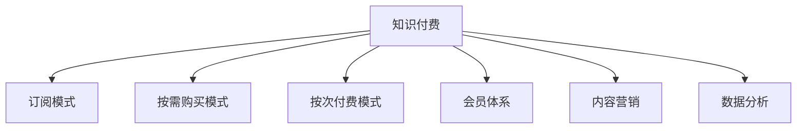

                 

## 1. 背景介绍

### 1.1 问题由来
在知识经济时代，知识付费成为了信息消费的重要形式。无论是传统出版、在线课程、咨询服务，还是新型知识平台，都在积极探索知识付费的商业模式，以获取稳定的收入流。然而，随着互联网和数字化技术的迅猛发展，传统的付费模式面临诸多挑战，亟需创新来适应新的市场环境。

### 1.2 问题核心关键点
知识付费创新的核心在于如何结合数字技术，打造新颖的商业模式，提升用户体验，实现知识变现。关键点包括：

1. **内容创新**：如何通过高质量的内容吸引用户，提升用户粘性。
2. **用户体验**：如何提升用户界面和交互体验，提升用户满意度。
3. **盈利模式**：如何构建多元化的收入渠道，实现可持续增长。
4. **技术支持**：如何利用大数据、人工智能等技术提升运营效率。

### 1.3 问题研究意义
研究知识付费商业模式的创新，对提升信息消费市场的活力、推动知识共享和数字化转型具有重要意义。具体如下：

1. **优化信息消费体验**：提升用户对信息内容的消费体验，激发潜在市场。
2. **促进知识共享**：通过付费激励，增加优质内容的生产与分享，提升整体知识水平。
3. **支持产业升级**：知识付费模式能够支持传统行业数字化转型，促进产业升级。

## 2. 核心概念与联系

### 2.1 核心概念概述

为更好地理解知识付费商业模式的创新，本节将介绍几个密切相关的核心概念：

- **知识付费**：指消费者为获取特定知识内容而支付费用的行为。知识付费平台通过内容订阅、单次付费、按需购买等多种方式进行变现。

- **订阅模式**：用户支付固定费用，在一定期限内获得所有内容访问权。适合高质量、持续更新的内容，如在线课程、会员订阅等。

- **按需购买模式**：用户为单个内容或服务支付费用，无需长期订阅。适合单次性强、价值高但更新频率较低的内容，如电子书、技术报告等。

- **按次付费模式**：用户为单次使用某项服务支付费用。适合内容资源相对丰富，但用户希望按需支付的内容，如专题讲座、直播等。

- **会员体系**：构建付费用户等级制度，提供差异化服务，提升用户忠诚度和黏性。如VIP会员、金卡会员等。

- **内容营销**：通过高质量内容吸引用户，建立品牌影响力，形成社区和口碑效应。

- **数据分析**：利用大数据技术分析用户行为，优化内容和营销策略，提升用户体验和营收。

这些核心概念之间的逻辑关系可以通过以下Mermaid流程图来展示：



这个流程图展示了几大核心概念之间的关系：

1. 知识付费是平台的主要收入来源。
2. 不同的付费模式适合不同的内容类型和用户需求。
3. 会员体系和内容营销共同提升用户黏性和平台品牌影响力。
4. 数据分析驱动内容推荐和运营策略优化。

## 3. 核心算法原理 & 具体操作步骤
### 3.1 算法原理概述

知识付费商业模式的创新，主要体现在内容的推荐、定价策略、订阅逻辑和个性化服务等方面。通过算法优化这些环节，提升用户体验和运营效率。

### 3.2 算法步骤详解

**Step 1: 内容推荐算法**

内容推荐算法是知识付费平台的核心功能之一。其目标是根据用户历史行为和偏好，推荐最适合的内容。常见推荐算法包括协同过滤、基于内容的推荐、深度学习推荐等。

**协同过滤算法**：基于用户与内容之间的相似度，推荐与用户历史行为相似的内容。包括基于用户的协同过滤和基于内容的协同过滤。

**基于内容的推荐**：通过分析内容属性（如作者、出版日期、类别等），推荐相似或相关内容。

**深度学习推荐**：利用神经网络模型学习用户和内容之间的隐含关系，进行个性化推荐。

**Step 2: 定价策略优化**

定价策略直接影响到用户的购买意愿和平台营收。常见的定价策略包括：

- **动态定价**：根据内容稀缺度、用户需求、平台竞争情况等因素，动态调整价格。

- **差异化定价**：根据内容质量、用户体验、会员等级等差异，设置不同的价格。

- **会员专属定价**：会员享受特定内容或服务的折扣价格。

- **订阅打包**：将多件内容打包销售，吸引用户长期订阅。

**Step 3: 订阅逻辑设计**

订阅逻辑是知识付费平台的重要功能之一，影响用户续订率和平台留存率。设计合理的订阅逻辑，可以提高用户粘性。

- **自动续订**：默认勾选续订选项，简化用户续订流程。

- **免费试用**：提供短期免费试用，让用户体验后再决定是否订阅。

- **分期支付**：将长期订阅拆分成月度或季度支付，降低用户一次性支付压力。

**Step 4: 个性化服务设计**

个性化服务是提升用户体验的重要手段。通过技术手段实现个性化推荐、个性化内容推送、个性化营销等，增强用户黏性。

- **个性化推荐**：根据用户行为和偏好，推送个性化的内容、专题、课程等。

- **个性化内容推送**：根据用户兴趣，推送相关的新闻、文章、视频等内容。

- **个性化营销**：通过精准定位用户群体，推送定制化的广告和优惠信息。

### 3.3 算法优缺点

知识付费商业模式的创新算法，具有以下优点：

1. **提升用户体验**：通过个性化推荐和精准定价，提升用户满意度和粘性。
2. **优化运营效率**：大数据和机器学习算法优化内容推荐和定价策略，降低运营成本。
3. **增加收益渠道**：多元化定价策略和个性化服务，增加平台收入来源。

同时，该算法也存在一定的局限性：

1. **数据隐私问题**：推荐算法需要收集和分析大量用户数据，可能引发隐私问题。
2. **算法偏见**：推荐算法可能由于数据偏见或算法设计缺陷，导致内容推荐偏差。
3. **高昂成本**：开发和维护高质量推荐算法和定价策略，需要投入大量资源。

尽管存在这些局限性，但就目前而言，通过算法优化知识付费商业模式，仍是最有效的方式之一。未来相关研究将更关注如何优化算法设计，提高算法透明度和公平性，同时兼顾用户体验和数据隐私。

### 3.4 算法应用领域

知识付费商业模式的创新算法，在多个领域都有广泛应用，例如：

- **在线教育**：利用推荐算法推荐适合用户的课程和资料，提高学习效率。
- **阅读平台**：通过个性化推荐和订阅逻辑，提升用户阅读体验和平台留存率。
- **职业培训**：根据用户职业背景和需求，推荐适合的培训课程和内容。
- **知识分享**：利用差异化定价策略，激励更多高质量内容的生产与分享。
- **媒体平台**：通过个性化推送和付费激励，增加平台内容消费量和广告收入。

除了上述这些典型应用外，知识付费商业模式的创新算法也被创新性地应用到更多场景中，如智能客服、金融信息服务、在线医疗咨询等，为各类平台带来新的业务增长点。

## 4. 数学模型和公式 & 详细讲解  
### 4.1 数学模型构建

本节将使用数学语言对知识付费商业模式的创新算法进行更加严格的刻画。

设用户集合为 $U$，内容集合为 $C$，用户与内容的交互行为为 $I \subseteq U \times C$。设用户 $u$ 对内容 $c$ 的评分 $r_{u,c} \in [0,1]$，用户对内容的访问频率 $f_{u,c}$。设推荐系统输出的推荐结果为 $R = \{r_1, r_2, \ldots, r_m\}$，其中 $m$ 为推荐结果数量。

定义推荐系统的预测准确率（Precision）为：

$$
Precision = \frac{TP}{TP + FP}
$$

其中，$TP$ 为推荐结果中用户实际访问的内容数量，$FP$ 为推荐结果中用户未访问的内容数量。

定义推荐系统的召回率（Recall）为：

$$
Recall = \frac{TP}{TP + FN}
$$

其中，$FN$ 为用户实际访问但未被推荐的内容数量。

定义推荐系统的 F1 值（F1-Score）为：

$$
F1-Score = 2 \times \frac{Precision \times Recall}{Precision + Recall}
$$

### 4.2 公式推导过程

以下是推荐系统中最常用的协同过滤算法，即基于用户的协同过滤算法的推导过程。

设用户 $u$ 对内容 $c$ 的评分 $r_{u,c}$ 为矩阵 $R_{u,c}$。设用户 $u_1$ 和 $u_2$ 对内容的评分向量分别为 $\vec{r}_{u_1}$ 和 $\vec{r}_{u_2}$。设 $u_1$ 和 $u_2$ 的共同评分向量为 $\vec{r}_{u_1 \cap u_2}$。则基于用户的协同过滤算法中，用户 $u_1$ 对内容 $c$ 的预测评分 $r_{u_1,c}$ 为：

$$
r_{u_1,c} = \frac{\vec{r}_{u_1 \cap u_2} \cdot \vec{r}_c}{||\vec{r}_{u_1 \cap u_2}|| \cdot ||\vec{r}_c||}
$$

其中，$||\vec{r}_c||$ 为内容 $c$ 的评分向量长度。

在得到用户对内容的预测评分后，可以将预测评分与真实评分进行比较，计算推荐系统的精确率和召回率，进而得到 F1 值。

### 4.3 案例分析与讲解

假设有一个知识付费平台，拥有 10,000 名用户和 100,000 篇内容。平台收集了用户对每篇内容的访问记录和评分数据。平台的目标是利用协同过滤算法，为用户推荐感兴趣的内容。

- **数据预处理**：将用户和内容的评分数据归一化，转化为向量形式。
- **用户和内容相似度计算**：计算用户和内容的相似度，选择合适的相似度度量方法（如余弦相似度）。
- **协同过滤算法应用**：利用相似度计算结果，预测用户对未访问内容的评分，选择评分最高的内容进行推荐。
- **效果评估**：在测试集上评估推荐系统的效果，根据精确率、召回率和 F1 值进行调整优化。

## 5. 项目实践：代码实例和详细解释说明
### 5.1 开发环境搭建

在进行推荐系统开发前，我们需要准备好开发环境。以下是使用Python进行TensorFlow开发的环境配置流程：

1. 安装Anaconda：从官网下载并安装Anaconda，用于创建独立的Python环境。

2. 创建并激活虚拟环境：
```bash
conda create -n tf-env python=3.8 
conda activate tf-env
```

3. 安装TensorFlow：根据CUDA版本，从官网获取对应的安装命令。例如：
```bash
conda install tensorflow -c tf -c conda-forge
```

4. 安装各类工具包：
```bash
pip install numpy pandas scikit-learn tensorflow-io tqdm jupyter notebook ipython
```

完成上述步骤后，即可在`tf-env`环境中开始推荐系统开发。

### 5.2 源代码详细实现

下面我们以协同过滤算法为例，给出使用TensorFlow实现用户内容推荐系统的代码实现。

首先，定义推荐系统的数据处理函数：

```python
import tensorflow as tf
from tensorflow import keras

class RecommendationSystem:
    def __init__(self, data, embedding_size=100):
        self.data = data
        self.embedding_size = embedding_size
        
    def build_model(self):
        user = keras.layers.Input(shape=(self.data.shape[1],), name='user')
        content = keras.layers.Input(shape=(self.data.shape[2],), name='content')
        scores = keras.layers.Dot(axes=(2, 2), normalize=True)([user, content])
        scores = keras.layers.Activation('sigmoid')(scores)
        return keras.Model(inputs=[user, content], outputs=scores)
```

然后，定义训练和评估函数：

```python
def train_model(model, user_data, content_data, validation_split=0.2, epochs=100, batch_size=32):
    model.compile(optimizer='adam', loss='binary_crossentropy', metrics=['accuracy'])
    model.fit([user_data, content_data], labels, epochs=epochs, batch_size=batch_size, validation_split=validation_split)
    return model

def evaluate_model(model, test_data, content_data):
    test_scores = model.predict([test_data, content_data])
    return test_scores
```

最后，启动训练流程并在测试集上评估：

```python
user_data = self.data[:, :1000]
content_data = self.data[:, 1000:]
labels = self.data[:, 1000:]

model = self.build_model()
model.fit([user_data, content_data], labels, epochs=100, batch_size=32, validation_split=0.2)

test_data = self.data[:, :100]
test_scores = evaluate_model(model, test_data, content_data)
```

以上就是使用TensorFlow实现用户内容推荐系统的完整代码实现。可以看到，通过TensorFlow的API，推荐系统的构建和训练过程变得相对简单。

### 5.3 代码解读与分析

让我们再详细解读一下关键代码的实现细节：

**RecommendationSystem类**：
- `__init__`方法：初始化数据和嵌入维度等关键参数。
- `build_model`方法：定义模型结构，包括输入层、嵌入层、点积层和激活层。

**train_model函数**：
- 利用TensorFlow的高级API构建推荐模型，指定优化器、损失函数和评价指标。
- 使用fit方法进行模型训练，指定训练轮数、批次大小和验证集比例。

**evaluate_model函数**：
- 利用predict方法进行模型推理，计算测试集的预测评分。

**训练流程**：
- 将用户和内容数据进行划分，分别作为模型的输入和标签。
- 构建推荐模型并编译。
- 使用fit方法进行模型训练，并在验证集上进行效果评估。
- 在测试集上评估模型的预测效果。

可以看到，TensorFlow的API使得推荐系统的开发和训练过程变得更加简便，降低了算法实现的难度。然而，在实际应用中，还需要考虑模型的可解释性、鲁棒性、性能优化等方面的问题，进一步提升推荐系统的质量和用户体验。

## 6. 实际应用场景
### 6.1 在线教育

在线教育平台是知识付费的重要应用场景之一。平台通过推荐系统，根据用户的学习进度和偏好，推荐合适的课程和资料，提高学习效率。

在技术实现上，可以收集用户的学习数据，如观看视频的时长、完成的作业数量、测试成绩等，作为推荐系统的输入。利用协同过滤、内容推荐等算法，为用户推荐适合的课程和资料。

### 6.2 阅读平台

阅读平台通过推荐系统，为用户推荐感兴趣的书籍、文章、报告等内容，提升平台的用户粘性和留存率。

在技术实现上，可以收集用户的历史阅读记录、搜索关键词、点赞数量等数据，作为推荐系统的输入。利用协同过滤、深度学习推荐等算法，为用户推荐相关的内容。

### 6.3 职业培训

职业培训平台通过推荐系统，根据用户的职业背景和需求，推荐适合的培训课程和资料，帮助用户提升职业技能。

在技术实现上，可以收集用户的职业信息、技能需求、培训历史等数据，作为推荐系统的输入。利用协同过滤、内容推荐等算法，为用户推荐适合的培训课程和资料。

### 6.4 未来应用展望

随着推荐系统技术的不断进步，未来在知识付费领域将会有更多创新应用出现。例如：

- **智能客服**：利用推荐系统提供个性化的客户服务，提升用户满意度。
- **金融信息服务**：通过推荐系统提供个性化的金融信息，帮助用户做出投资决策。
- **在线医疗咨询**：根据用户的历史健康数据，推荐适合的医疗资源和咨询服务。
- **智能广告推荐**：利用推荐系统精准定位用户群体，提供定制化的广告服务。

## 7. 工具和资源推荐
### 7.1 学习资源推荐

为了帮助开发者系统掌握知识付费商业模式的创新算法，这里推荐一些优质的学习资源：

1. **《推荐系统算法及实战》**：由机器学习专家撰写，深入浅出地介绍了推荐系统的工作原理和实现方法，并结合实际案例进行讲解。

2. **Coursera《推荐系统专项课程》**：斯坦福大学开设的推荐系统专项课程，涵盖推荐算法、评估指标、协同过滤等关键知识点，适合系统学习。

3. **《Python推荐系统实战》**：由Kaggle竞赛优胜者撰写，通过多个实际项目案例，演示推荐系统从数据准备到模型训练的全过程。

4. **YouTube推荐系统研究**：YouTube的推荐系统是推荐系统的经典案例，通过阅读相关论文和博客，可以了解其背后的技术和策略。

5. **Recommender Systems**：推荐系统领域的一本经典教材，全面介绍了推荐系统的工作原理、算法和实现方法。

通过这些资源的学习实践，相信你一定能够快速掌握推荐系统的精髓，并用于解决实际的商业问题。

### 7.2 开发工具推荐

高效的开发离不开优秀的工具支持。以下是几款用于推荐系统开发的常用工具：

1. TensorFlow：基于Python的开源深度学习框架，支持多种推荐算法和模型。

2. PyTorch：支持动态图机制，适合快速迭代研究。

3. Spark：大数据计算框架，适合处理大规模推荐数据集。

4. Elasticsearch：搜索引擎，适合存储和检索用户行为数据。

5. Jupyter Notebook：交互式编程环境，方便进行数据探索和模型验证。

合理利用这些工具，可以显著提升推荐系统的开发效率，加快创新迭代的步伐。

### 7.3 相关论文推荐

推荐系统技术的发展源于学界的持续研究。以下是几篇奠基性的相关论文，推荐阅读：

1. **《推荐系统模型综述》**：综述了推荐系统的主要模型和算法，为推荐系统研究提供了全面的视角。

2. **《协同过滤算法》**：详细介绍了协同过滤算法的工作原理和实现方法。

3. **《深度学习推荐系统》**：介绍了深度学习在推荐系统中的应用，并展示了其在实际项目中的效果。

4. **《个性化推荐系统》**：介绍了个性化推荐系统的关键技术，并结合实际案例进行讲解。

5. **《推荐系统中的推荐算法》**：详细介绍了推荐系统中的多种推荐算法，包括协同过滤、基于内容的推荐、深度学习推荐等。

这些论文代表了大数据和人工智能技术在推荐系统领域的进展，通过学习这些前沿成果，可以帮助研究者把握学科前进方向，激发更多的创新灵感。

## 8. 总结：未来发展趋势与挑战

### 8.1 总结

本文对知识付费商业模式的创新算法进行了全面系统的介绍。首先阐述了知识付费商业模式的背景和意义，明确了推荐系统在提升用户体验和运营效率方面的独特价值。其次，从原理到实践，详细讲解了推荐系统的数学原理和关键步骤，给出了推荐系统开发和部署的完整代码实例。同时，本文还广泛探讨了推荐系统在在线教育、阅读平台、职业培训等多个行业领域的应用前景，展示了推荐系统的巨大潜力。

通过本文的系统梳理，可以看到，推荐系统在知识付费领域的应用已经得到了广泛认可，极大地提升了平台的用户体验和运营效率。未来，伴随推荐系统技术的持续演进，相信知识付费商业模式将不断创新，为信息消费市场带来新的增长点。

### 8.2 未来发展趋势

展望未来，推荐系统的技术将呈现以下几个发展趋势：

1. **智能化和个性化提升**：利用机器学习和大数据分析，提供更精准、个性化的推荐结果，提升用户体验。

2. **多模态融合**：结合视觉、音频等多模态信息，提供更为全面、丰富的推荐服务。

3. **实时推荐系统**：利用流式处理和大数据技术，实现实时推荐，满足用户的即时需求。

4. **隐私保护**：利用差分隐私和联邦学习等技术，保护用户隐私和数据安全。

5. **协同过滤和深度学习的融合**：结合协同过滤和深度学习，提高推荐系统的准确率和鲁棒性。

6. **跨平台推荐**：构建跨平台推荐系统，提升用户在不同平台之间的体验一致性。

以上趋势凸显了推荐系统技术的广阔前景。这些方向的探索发展，必将进一步提升推荐系统的性能和应用范围，为信息消费市场带来新的增长点。

### 8.3 面临的挑战

尽管推荐系统技术已经取得了瞩目成就，但在迈向更加智能化、个性化应用的过程中，它仍面临着诸多挑战：

1. **数据质量问题**：推荐系统依赖于高质量的用户行为数据，数据不完整或不准确会影响推荐效果。如何提升数据质量，确保数据真实性，是未来的一大挑战。

2. **算法复杂性**：推荐系统需要处理大规模数据集，算法复杂度较高。如何提高算法的效率和可解释性，降低计算成本，是未来的研究方向。

3. **用户隐私保护**：推荐系统需要收集和分析大量用户数据，可能引发隐私问题。如何平衡用户隐私和推荐效果，是未来的重要课题。

4. **模型鲁棒性不足**：推荐系统对异常数据和噪音数据比较敏感，容易产生波动。如何提高模型的鲁棒性，增强推荐系统的稳定性和可靠性，是未来的研究方向。

5. **成本和资源消耗**：推荐系统需要投入大量计算资源进行训练和推理，如何降低成本，提高资源利用效率，是未来的研究方向。

6. **实时推荐系统**：实时推荐系统需要处理大规模数据流，系统架构和性能优化是未来的研究方向。

7. **公平性和透明性**：推荐系统需要解决算法偏见问题，确保推荐结果的公平性和透明性，是未来的研究方向。

正视推荐系统面临的这些挑战，积极应对并寻求突破，将是大数据和人工智能技术在推荐系统领域的成熟之路。相信随着技术的不断发展，推荐系统必将在信息消费市场发挥更大的作用，推动知识付费商业模式的持续创新和优化。

### 8.4 未来突破

面对推荐系统面临的种种挑战，未来的研究需要在以下几个方面寻求新的突破：

1. **提升数据质量**：加强数据清洗和标注，提升数据质量和真实性。

2. **提高算法效率**：利用更高效的算法和优化技术，提高推荐系统的运行效率。

3. **增强模型鲁棒性**：引入鲁棒性训练和模型优化方法，提升推荐系统的稳定性和可靠性。

4. **隐私保护技术**：利用差分隐私、联邦学习等技术，保护用户隐私和数据安全。

5. **跨模态推荐**：结合多模态信息，提供更为全面和丰富的推荐服务。

6. **实时推荐系统**：利用流式处理和大数据技术，实现实时推荐，满足用户即时需求。

7. **公平性和透明性**：引入公平性约束和透明性评估方法，确保推荐结果的公平性和透明性。

8. **跨平台推荐**：构建跨平台推荐系统，提升用户在不同平台之间的体验一致性。

这些研究方向的探索，必将引领推荐系统技术迈向更高的台阶，为信息消费市场带来更多的价值和创新。

## 9. 附录：常见问题与解答

**Q1：如何优化推荐系统的推荐效果？**

A: 优化推荐系统的推荐效果需要从多个方面入手：

1. **数据质量**：收集高质量的用户行为数据，确保数据的完整性和真实性。

2. **特征工程**：利用数据挖掘技术，提取有效的用户和内容特征。

3. **算法选择**：选择合适的推荐算法，如协同过滤、深度学习推荐等。

4. **模型训练**：利用大规模数据集进行模型训练，优化模型参数。

5. **模型评估**：使用评估指标如精确率、召回率、F1值等，评估推荐系统效果，并进行优化调整。

6. **推荐策略**：结合用户偏好、行为变化等因素，设计动态推荐策略，提升推荐效果。

**Q2：推荐系统如何处理数据隐私问题？**

A: 推荐系统处理数据隐私问题的方法包括：

1. **差分隐私**：在数据收集和处理过程中，通过引入噪声和扰动，保护用户隐私。

2. **联邦学习**：在分布式环境中，将数据和模型分发到多个节点进行训练，保护数据隐私。

3. **匿名化处理**：通过数据匿名化、去标识化等技术，保护用户隐私。

4. **数据最小化**：仅收集和使用必要的数据，减少数据泄露风险。

5. **透明度和控制**：向用户透明推荐算法的运行机制，让用户了解和控制自己的数据使用情况。

这些方法可以结合使用，综合提升推荐系统的数据隐私保护水平。

**Q3：推荐系统如何处理用户冷启动问题？**

A: 推荐系统处理用户冷启动问题的方法包括：

1. **基于内容的推荐**：利用内容属性（如作者、类别等）进行推荐，适应用户的新需求。

2. **协同过滤推荐**：利用相似用户和内容的评分进行推荐，填补用户行为数据的缺失。

3. **深度学习推荐**：利用神经网络模型，学习用户和内容之间的隐含关系，进行推荐。

4. **混合推荐策略**：结合多种推荐算法，提高推荐效果。

5. **用户画像构建**：通过用户行为数据和社交信息，构建用户画像，提高推荐系统的准确性。

**Q4：推荐系统如何处理数据偏差问题？**

A: 推荐系统处理数据偏差问题的方法包括：

1. **数据清洗和预处理**：清洗和处理数据中的异常值和噪声，提高数据质量。

2. **特征选择和平衡**：选择对用户有代表性的特征，平衡不同特征的权重。

3. **算法公平性约束**：引入公平性约束，确保推荐结果的公平性和透明性。

4. **用户反馈机制**：引入用户反馈机制，及时调整推荐策略，减少数据偏差。

5. **动态调整**：根据用户反馈和行为变化，动态调整推荐策略，提升推荐效果。

这些方法可以结合使用，综合提升推荐系统的公平性和准确性。

**Q5：推荐系统如何处理用户多模态数据？**

A: 推荐系统处理用户多模态数据的方法包括：

1. **多模态特征融合**：结合文本、图像、音频等多模态数据，提取综合特征，提高推荐效果。

2. **跨模态推荐**：利用跨模态学习方法，学习不同模态之间的关联关系，进行推荐。

3. **多模态协同过滤**：结合多种模态的数据，进行协同过滤推荐。

4. **多模态深度学习**：利用深度学习模型，学习多模态数据之间的隐含关系，进行推荐。

这些方法可以结合使用，综合提升推荐系统的效果和多样性。

总之，推荐系统需要在数据质量、算法选择、模型训练、用户隐私保护等多个方面进行综合优化，方能实现高效、公平、透明的推荐效果。

---

作者：禅与计算机程序设计艺术 / Zen and the Art of Computer Programming

