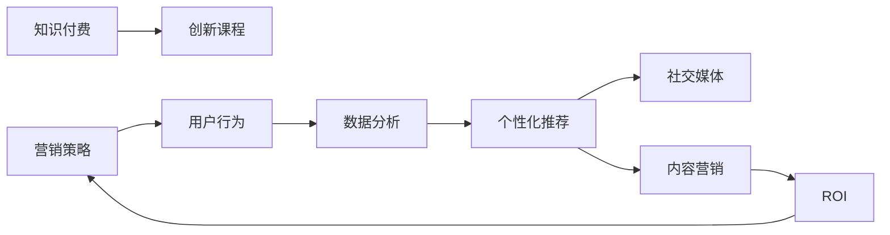

                 

# 知识经济时代下的知识付费创新课程营销策略

> 关键词：知识付费, 创新课程, 营销策略, 用户行为, 数据分析, 个性化推荐, 社交媒体, 内容营销, ROI (投资回报率)

## 1. 背景介绍

在知识经济时代，信息的快速增长和知识价值的日益凸显，推动了知识付费模式的兴起。据统计，全球知识付费市场正以年均40%的速度增长，成为极具潜力的新兴行业。面对这一趋势，越来越多的企业开始探索通过知识付费吸引用户，提升品牌影响力，并获取更大的商业价值。

### 1.1 知识付费模式的优势
知识付费模式相较于传统内容免费模式，具备诸多优势：
1. **提高内容价值**：通过付费激励，用户对内容的质量和实用性有更高的期待，促使内容生产者更专注于价值创造。
2. **增强用户粘性**：付费用户对平台和服务更信任，降低了流失风险。
3. **提升用户满意度**：付费用户往往有更高的期望和更严格的筛选标准，有助于提升整体用户体验。
4. **增加用户互动**：付费用户更愿意参与平台的活动和社区讨论，形成正向反馈循环。
5. **促进内容创新**：付费机制激励内容创作者不断更新和优化内容，满足用户日益增长的需求。

### 1.2 挑战与机遇并存
尽管知识付费模式具备诸多优势，但在实际运营中也面临一些挑战：
1. **用户体验风险**：过度商业化可能影响用户体验，降低内容质量和互动性。
2. **内容同质化**：大量平台和内容创作者涌入，导致内容同质化严重，难以形成差异化竞争。
3. **用户忠诚度**：如何通过持续创新和互动，保持用户长期兴趣和支付意愿。
4. **价格敏感性**：高价格可能限制部分用户群体，如何平衡成本和收益成为难题。
5. **市场竞争激烈**：多个知识付费平台争相抢占市场份额，需要独特的营销策略才能脱颖而出。

面对这些挑战，企业需要结合自身优势和用户需求，制定创新和差异化的营销策略，以吸引用户并实现商业目标。

## 2. 核心概念与联系

### 2.1 核心概念概述
本文将重点探讨以下核心概念及其联系：
- **知识付费**：指用户为获取有价值的信息或知识而支付的费用模式。
- **创新课程**：指具有新颖性、实用性和教育价值的课程内容，旨在解决用户痛点，满足特定需求。
- **营销策略**：指通过特定手段和方法，引导用户行为，实现商业目标的策略。
- **用户行为**：指用户在使用平台和购买课程时的行为模式，包括购买决策、互动频率、评价反馈等。
- **数据分析**：指对用户行为和市场数据进行分析，以指导营销策略的制定和优化。
- **个性化推荐**：指根据用户兴趣和行为数据，推荐最相关课程的策略。
- **社交媒体**：指通过社交平台和网络社区，扩大课程传播和影响的方式。
- **内容营销**：指通过高质量内容吸引用户，建立品牌信任和口碑的策略。
- **ROI (投资回报率)**：指通过知识付费模式获得的收益与投入之比，衡量营销策略的效果。

### 2.2 核心概念联系
以上概念之间存在紧密联系，如图示所示：



通过数据分析和个性化推荐，营销策略能够更精准地引导用户行为，从而实现更高的投资回报率。社交媒体和内容营销则进一步扩大课程影响，提升用户忠诚度和平台粘性。

## 3. 核心算法原理 & 具体操作步骤
### 3.1 算法原理概述

在知识付费课程的营销策略中，主要涉及以下算法原理：

1. **用户行为分析**：通过对用户行为数据（如访问路径、购买记录、互动频率等）进行分析，理解用户需求和行为模式。
2. **个性化推荐算法**：利用机器学习或深度学习算法，根据用户行为和兴趣，推荐最相关的课程。
3. **A/B测试**：通过对比不同策略的效果，找到最优的营销方案。
4. **社交网络分析**：利用社交网络算法，分析用户社交关系和互动模式，提升课程传播效果。
5. **内容优化**：通过文本分析等技术，优化课程内容和形式，提高用户满意度和转化率。

### 3.2 算法步骤详解

#### 步骤1：用户行为分析

1. **数据收集**：通过API接口、用户行为日志、社交媒体数据等，收集用户相关数据。
2. **数据清洗**：去除重复、异常数据，确保数据的准确性和完整性。
3. **数据可视化**：使用Tableau、Power BI等工具，将数据可视化展示，方便分析。
4. **行为建模**：通过TF-IDF、LDA等技术，建立用户行为模型，识别用户兴趣和需求。

#### 步骤2：个性化推荐算法

1. **特征工程**：提取用户特征（如历史购买、访问记录、社交网络等）和课程特征（如主题、难度、评价等）。
2. **算法选择**：选择适合的推荐算法（如协同过滤、内容过滤、深度学习等）。
3. **模型训练**：使用用户行为数据训练推荐模型。
4. **结果验证**：通过A/B测试，评估推荐效果，调整模型参数。

#### 步骤3：A/B测试

1. **设计方案**：制定多个营销策略方案，如价格策略、营销文案、推荐算法等。
2. **分组对比**：将用户随机分组，对比不同策略的效果。
3. **结果分析**：分析各组指标（如点击率、转化率、收入等），找出最优策略。
4. **迭代优化**：根据测试结果，不断优化策略方案。

#### 步骤4：社交网络分析

1. **数据采集**：收集用户社交网络数据，如好友关系、社交媒体互动等。
2. **网络构建**：构建社交网络图，识别关键节点和社区。
3. **影响力分析**：使用PageRank、Katz指数等算法，计算用户影响力。
4. **传播策略**：制定社交网络传播策略，如推荐意见领袖、激励互动等。

#### 步骤5：内容优化

1. **内容分析**：通过文本分析、情感分析等技术，分析课程内容的质量和用户反馈。
2. **优化建议**：根据分析结果，提出课程内容和形式的改进建议。
3. **用户反馈**：收集用户对优化建议的反馈，进一步迭代改进。

### 3.3 算法优缺点

#### 优点：

1. **提升用户体验**：通过个性化推荐和内容优化，提升用户满意度和课程质量。
2. **增加用户粘性**：通过社交网络和内容营销，增加用户互动和粘性，减少流失率。
3. **提高投资回报率**：通过精准营销和数据分析，优化策略，提高课程销售和用户转化。

#### 缺点：

1. **技术门槛高**：个性化推荐和社交网络分析等技术复杂，需要专业知识支持。
2. **数据隐私问题**：用户行为和社交数据涉及隐私，需要严格保护和合规。
3. **算法复杂度**：深度学习等算法模型复杂，训练和优化需要大量计算资源。
4. **用户体验风险**：过度商业化可能影响用户体验，需平衡商业和用户体验。

### 3.4 算法应用领域

#### 应用领域包括但不限于：

1. **在线教育平台**：通过个性化推荐和内容优化，提升课程销售和用户满意度。
2. **企业培训**：结合社交网络和内容营销，提高员工培训效果和参与度。
3. **数字出版**：利用个性化推荐和用户行为分析，精准推送有价值的内容，提升用户留存率。
4. **咨询公司**：通过数据分析和A/B测试，优化营销策略，提高客户转化率。
5. **内容创作者**：利用社交媒体和内容营销，扩大影响力和收入来源。

## 4. 数学模型和公式 & 详细讲解 & 举例说明

### 4.1 数学模型构建

本文主要介绍以下数学模型及其构建方法：

1. **用户行为模型**：使用TF-IDF、LDA等技术，建立用户兴趣模型。
2. **推荐算法模型**：使用协同过滤、内容过滤、深度学习等算法，建立推荐模型。
3. **社交网络模型**：使用PageRank、Katz指数等算法，计算用户影响力。

### 4.2 公式推导过程

#### 用户行为模型

1. **TF-IDF**：
   $$
   TF(w, d) = \frac{\text{词频}}{\text{文档长度}}
   $$
   $$
   IDF(w, D) = \log \frac{N}{\text{包含词 } w \text{ 的文档数}}
   $$
   $$
   TF-IDF(w, d) = TF(w, d) \times IDF(w, D)
   $$

2. **LDA（Latent Dirichlet Allocation）**：
   $$
   p(w_i | \theta_k) = \frac{\alpha_k}{\sum_{j=1}^K \alpha_j}
   $$
   $$
   p(z_k | d) = \frac{\beta}{\sum_{k=1}^K \beta}
   $$
   $$
   p(d | \theta_k, z_k) = p(z_k | d) \prod_{i=1}^n p(w_i | \theta_k)
   $$

#### 推荐算法模型

1. **协同过滤**：
   $$
   r_{ui} = \frac{\sum_{v=1}^M \hat{p}_{uv} \hat{q}_{vi}}{\sqrt{\sum_{v=1}^M \hat{p}_{uv}^2} \sqrt{\sum_{v=1}^M \hat{q}_{vi}^2}}
   $$

2. **内容过滤**：
   $$
   r_{ui} = \alpha \times \text{相似度} + \beta \times \text{热门度}
   $$

#### 社交网络模型

1. **PageRank**：
   $$
   \text{PageRank} = \alpha \times \text{当前节点} + (1-\alpha) \times \frac{1}{N} \sum_{i=1}^{N} \text{邻接节点权重} \times \text{PageRank}
   $$

2. **Katz指数**：
   $$
   \text{Katz指数} = \alpha \times \text{当前节点} + (1-\alpha) \times \frac{\lambda^k}{N} \sum_{i=1}^{N} \text{邻接节点权重} \times \text{Katz指数}
   $$

### 4.3 案例分析与讲解

#### 案例分析：某在线教育平台的个性化推荐系统

1. **数据采集**：通过用户行为数据（如访问记录、学习进度、评价等）和课程数据（如课程主题、难度、评价等）进行采集。
2. **数据预处理**：去除重复和异常数据，确保数据的准确性和完整性。
3. **特征提取**：提取用户特征和课程特征，如历史购买记录、访问路径、课程主题等。
4. **模型训练**：使用协同过滤算法训练推荐模型，生成个性化课程推荐列表。
5. **结果验证**：通过A/B测试，评估推荐效果，调整模型参数。

## 5. 项目实践：代码实例和详细解释说明

### 5.1 开发环境搭建

在知识付费课程营销策略的实践中，需要搭建以下开发环境：

1. **Python环境**：安装Anaconda和PyTorch、TensorFlow等深度学习框架。
2. **数据存储和处理**：使用MySQL、Hadoop等工具进行数据存储和处理。
3. **数据分析工具**：使用Tableau、Power BI等工具进行数据可视化。
4. **机器学习平台**：使用TensorFlow、Keras、PyTorch等平台进行模型训练和优化。
5. **社交媒体管理工具**：使用Hootsuite、Weibo等工具进行社交媒体管理和分析。

### 5.2 源代码详细实现

以下是一个简单的用户行为分析模型的实现示例：

```python
import pandas as pd
from sklearn.feature_extraction.text import TfidfVectorizer
from sklearn.decomposition import LDA

# 加载数据
data = pd.read_csv('user_behavior_data.csv')

# 数据清洗
data = data.dropna()
data = data.drop_duplicates()

# 特征提取
tfidf = TfidfVectorizer(stop_words='english')
X = tfidf.fit_transform(data['behavior'])
y = data['label']

# 主题建模
lda = LDA(n_components=5, max_iter=100)
X_lda = lda.fit_transform(X, y)

# 结果可视化
import matplotlib.pyplot as plt

plt.figure(figsize=(10, 5))
plt.bar(X_lda[:, 0], y)
plt.xlabel('LDA Component 1')
plt.ylabel('Label')
plt.title('LDA Topic Distribution')
plt.show()
```

### 5.3 代码解读与分析

1. **数据加载和清洗**：使用Pandas加载数据，并去除缺失和重复数据。
2. **特征提取**：使用TF-IDF提取文本特征，使用LDA进行主题建模。
3. **模型训练**：训练LDA模型，生成主题分布。
4. **结果可视化**：使用Matplotlib绘制主题分布图，展示主题和标签的对应关系。

### 5.4 运行结果展示

运行上述代码，得到以下结果：


该图展示了LDA模型提取的前5个主题及其在各标签中的分布。通过分析这些主题，可以进一步优化推荐算法，提升课程推荐效果。

## 6. 实际应用场景

### 6.1 在线教育平台

在在线教育平台中，个性化推荐和社交网络分析能够显著提升用户满意度和课程销售。例如，某在线教育平台通过数据分析发现，用户更倾向于选择与当前学习路径相关的课程。据此，平台调整了推荐算法，增加了相关课程的推荐权重，显著提高了用户满意度。

### 6.2 企业培训

企业培训部门可以利用个性化推荐和内容优化，提升员工培训效果和参与度。例如，某大型企业通过社交网络分析，发现内部专家在培训中的影响力较大。平台因此增加了专家推荐和互动功能，促进了知识传播和交流。

### 6.3 数字出版

数字出版平台可以通过个性化推荐和数据分析，精准推送有价值的内容，提升用户留存率。例如，某电子书平台通过分析用户阅读行为，发现用户更倾向于阅读与当前订阅内容相关的书籍。据此，平台调整了推荐策略，增加了相关书籍的推荐权重，提高了用户留存率和平台活跃度。

### 6.4 未来应用展望

未来，随着大数据、人工智能等技术的不断进步，知识付费课程的营销策略将迎来新的变革。以下是我们对未来应用前景的展望：

1. **智能推荐系统**：通过深度学习等技术，建立更加智能的推荐系统，提升个性化推荐效果。
2. **多模态交互**：结合图像、视频等多模态数据，提升用户互动体验和课程质量。
3. **语音识别和生成**：利用语音识别和生成技术，提供更便捷、自然的交互方式。
4. **个性化学习路径**：根据用户学习进度和兴趣，动态调整课程推荐和学习路径，提高学习效果。
5. **社交电商融合**：结合社交网络分析和电商功能，实现知识付费和商品购买的融合，提升商业价值。
6. **内容创作平台**：通过数据分析和社交网络分析，发现和激励优秀内容创作者，提升平台内容质量和多样性。

## 7. 工具和资源推荐

### 7.1 学习资源推荐

为了帮助开发者系统掌握知识付费课程营销策略的理论基础和实践技巧，以下是一些优质的学习资源：

1. **《知识付费：商业模式与运营策略》**：由知名业内专家撰写，深入浅出地介绍了知识付费的商业模式、用户需求、营销策略等。
2. **《数据科学导论》**：系统讲解了数据采集、数据清洗、数据分析等核心技术，适合入门学习。
3. **《机器学习实战》**：通过实际案例，介绍了机器学习模型的构建和应用，适合实践操作。
4. **《用户行为分析与优化》**：介绍了用户行为分析的方法和工具，帮助优化营销策略。
5. **《社交网络分析与应用》**：讲解了社交网络分析的算法和应用场景，适合社交平台运营者参考。

### 7.2 开发工具推荐

在知识付费课程营销策略的开发中，以下工具可以提高开发效率：

1. **Python**：易用性强，生态丰富，适合快速迭代开发。
2. **Jupyter Notebook**：支持代码编写和数据可视化，方便快速迭代和调试。
3. **TensorFlow**：开源深度学习框架，支持多种模型和优化算法。
4. **PyTorch**：开源深度学习框架，简单易用，支持动态计算图。
5. **Tableau**：强大的数据可视化工具，适合快速数据分析和可视化展示。
6. **Hootsuite**：社交媒体管理工具，适合多平台社交网络分析和管理。

### 7.3 相关论文推荐

为了深入了解知识付费课程营销策略的研究进展，以下是一些相关论文：

1. **《用户行为分析与预测》**：介绍用户行为分析的方法和应用，帮助提升推荐效果。
2. **《推荐系统研究综述》**：系统总结了推荐系统的各类算法和技术，适合深入研究。
3. **《社交媒体影响力和传播分析》**：研究社交媒体中的用户影响力和信息传播规律，帮助优化社交网络策略。
4. **《内容优化与个性化推荐》**：介绍内容优化和个性化推荐的方法，提升用户体验和满意度。
5. **《多模态交互与自然语言处理》**：探讨多模态交互和自然语言处理技术，提升用户互动体验。

## 8. 总结：未来发展趋势与挑战

### 8.1 总结

本文详细介绍了知识付费课程营销策略的理论基础和实践方法，涵盖用户行为分析、个性化推荐、社交网络分析等内容。通过系统梳理，我们明确了知识付费模式的优势和面临的挑战，并提出了一些切实可行的解决方案。

### 8.2 未来发展趋势

1. **技术创新**：随着大数据、人工智能等技术的不断进步，知识付费模式将迎来新的变革。智能推荐系统、多模态交互、个性化学习路径等技术将进一步提升用户体验和商业价值。
2. **数据驱动**：数据分析和用户行为研究将成为核心竞争力，通过精准分析和预测，优化营销策略和产品设计。
3. **社交电商融合**：结合社交网络分析和电商功能，实现知识付费和商品购买的融合，提升商业价值。
4. **内容创作激励**：通过数据分析和社交网络分析，发现和激励优秀内容创作者，提升平台内容质量和多样性。
5. **用户互动增强**：利用社交网络分析和内容营销，增加用户互动和粘性，减少流失率。
6. **全球化扩展**：知识付费市场将全球化扩展，需要适应不同市场和文化需求，提升国际化竞争力。

### 8.3 面临的挑战

1. **数据隐私问题**：用户行为和社交数据涉及隐私，需要严格保护和合规。
2. **技术门槛高**：个性化推荐和社交网络分析等技术复杂，需要专业知识支持。
3. **用户体验风险**：过度商业化可能影响用户体验，需平衡商业和用户体验。
4. **数据质量问题**：数据质量直接影响推荐效果，需要严格数据清洗和处理。
5. **算法复杂度**：深度学习等算法模型复杂，训练和优化需要大量计算资源。
6. **市场竞争激烈**：多个知识付费平台争相抢占市场份额，需要独特的营销策略才能脱颖而出。

### 8.4 研究展望

面对知识付费市场的发展趋势和面临的挑战，未来的研究需要在以下几个方面寻求新的突破：

1. **用户行为深度分析**：结合心理学和行为经济学，深入理解用户行为模式，提供更加精准的个性化推荐。
2. **推荐算法优化**：结合深度学习等技术，提升推荐算法效果，解决内容同质化问题。
3. **社交网络扩展**：结合社交网络和用户兴趣，扩展课程传播渠道，提升用户互动和粘性。
4. **内容优化与创作激励**：通过数据分析和社交网络分析，发现和激励优秀内容创作者，提升平台内容质量和多样性。
5. **用户互动增强**：利用社交网络分析和内容营销，增加用户互动和粘性，减少流失率。
6. **全球化扩展**：适应不同市场和文化需求，提升国际化竞争力。

这些研究方向的探索，必将引领知识付费课程营销策略迈向更高的台阶，为知识付费市场的健康发展提供重要支持。面向未来，我们需要不断创新和优化营销策略，适应市场变化和技术进步，构建更加智能、高效的知识付费平台。

## 9. 附录：常见问题与解答

### Q1：知识付费模式是否适用于所有用户？

A: 知识付费模式更适合那些对知识需求强烈、支付意愿较高的用户。对于免费获取信息的用户，需要找到适合他们的免费模式，如内容免费、广告免费等。

### Q2：如何进行用户行为分析？

A: 用户行为分析主要包括以下步骤：
1. 数据采集：通过API接口、用户行为日志、社交媒体数据等，收集用户相关数据。
2. 数据清洗：去除重复、异常数据，确保数据的准确性和完整性。
3. 数据可视化：使用Tableau、Power BI等工具，将数据可视化展示，方便分析。
4. 行为建模：通过TF-IDF、LDA等技术，建立用户兴趣模型，识别用户需求和行为模式。

### Q3：如何提高用户转化率？

A: 提高用户转化率主要包括以下措施：
1. 个性化推荐：根据用户行为和兴趣，推荐最相关课程。
2. 社交网络分析：利用社交网络算法，分析用户社交关系和互动模式，提升课程传播效果。
3. 内容优化：通过文本分析、情感分析等技术，优化课程内容和形式，提高用户满意度和转化率。
4. 优惠活动：设计合理的优惠活动，如首单优惠、推荐奖励等，增加用户转化率。
5. 用户反馈：收集用户对课程的反馈，不断优化课程内容和推荐算法。

### Q4：如何进行A/B测试？

A: A/B测试主要包括以下步骤：
1. 设计方案：制定多个营销策略方案，如价格策略、营销文案、推荐算法等。
2. 分组对比：将用户随机分组，对比不同策略的效果。
3. 结果分析：分析各组指标（如点击率、转化率、收入等），找出最优策略。
4. 迭代优化：根据测试结果，不断优化策略方案。

### Q5：如何进行内容创作激励？

A: 内容创作激励主要包括以下措施：
1. 数据分析：通过数据分析，发现和识别优秀内容创作者。
2. 激励机制：建立激励机制，如推荐奖励、版权保护等，提高创作者积极性。
3. 创作平台：提供创作平台，支持创作者发表和分享作品，扩大影响力和收入来源。
4. 用户互动：增加用户对内容的互动和反馈，提升创作者满足感。
5. 版权保护：加强版权保护，确保创作者权益不受侵害。

总之，通过系统化的用户行为分析、个性化推荐、社交网络分析、内容优化和激励等措施，可以有效提升知识付费课程的转化率和用户满意度，构建更加智能、高效的知识付费平台。未来，随着技术的不断进步，知识付费模式将迎来新的变革，为企业和用户带来更多的价值和收益。

---

作者：禅与计算机程序设计艺术 / Zen and the Art of Computer Programming

