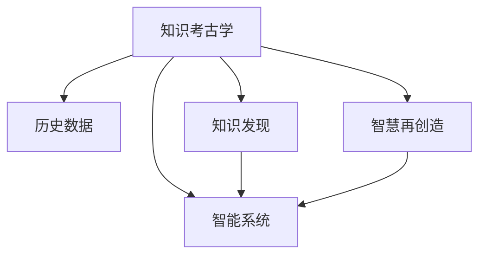

                 

# 知识考古学：探索历史智慧

> 关键词：知识考古学, 历史智慧, 智能系统, 技术革新, 人类文明, 数据挖掘, 算法优化, 模型训练

## 1. 背景介绍

### 1.1 问题由来
在全球数字化浪潮的推动下，数据驱动决策和智能系统正在深刻改变我们的工作和生活方式。然而，面对日益复杂和庞大的数据集，如何从中挖掘出有价值的知识，形成具有深刻洞察力的智慧，一直是信息技术领域的重要挑战。在众多解决方案中，“知识考古学”（Knowledge Archaeology）成为一种引人注目的方法，它结合历史数据、现代技术以及人类智慧，为我们提供了一种全新的知识发现与提取的视角。

### 1.2 问题核心关键点
知识考古学，本质上是将传统考古学的方法和现代信息技术相结合，通过数据挖掘、算法优化、模型训练等技术手段，从历史数据中重现和再创造智慧。这一过程不仅涉及到对历史数据的挖掘和分析，还需要结合人类智慧，进行创造性思维和设计，进而发现和提取有价值的知识。

知识考古学的核心关键点主要包括：
- **历史数据挖掘**：从大量历史数据中，挖掘出关键信息，还原历史事件、社会变迁等。
- **现代技术应用**：利用机器学习、深度学习、自然语言处理等现代技术，提升知识发现和提取的效率和准确性。
- **人类智慧结合**：结合人类的创造力和直觉，对技术提取的结果进行验证、筛选和再创造。
- **知识创新应用**：将提取的知识应用于当前和未来的智能系统中，如智能决策、智能推荐、智能监控等，提升系统的智能化水平。

## 2. 核心概念与联系

### 2.1 核心概念概述

为更好地理解知识考古学，本节将介绍几个密切相关的核心概念：

- **知识考古学**：一种结合现代信息技术与人类智慧，从历史数据中挖掘和重现知识的方法。
- **历史数据**：在数字化过程中产生的大量原始数据，包括文本、图像、视频、语音等。
- **知识发现**：从历史数据中提取和重组信息，形成具有深刻洞察力的知识。
- **智慧再创造**：结合人类智慧，对技术提取的知识进行创新性设计和再创造。
- **智能系统**：将提取的知识应用于各类智能系统中，提升系统的智能化水平。

这些核心概念之间的逻辑关系可以通过以下Mermaid流程图来展示：



这个流程图展示的知识考古学的核心概念及其之间的关系：

1. 知识考古学利用历史数据。
2. 知识发现是知识考古学的核心过程，通过技术手段从数据中提取知识。
3. 智慧再创造结合人类智慧，对技术提取的知识进行再设计和优化。
4. 提取的知识最终应用于各类智能系统，提升其智能化水平。

这些核心概念共同构成了知识考古学的基本框架，使我们能够系统地探索和挖掘历史智慧，推动技术的创新和应用。

## 3. 核心算法原理 & 具体操作步骤
### 3.1 算法原理概述

知识考古学涉及的算法和操作步骤主要包括以下几个方面：

- **数据预处理**：对历史数据进行清洗、归一化、特征提取等预处理工作。
- **数据挖掘**：利用机器学习、深度学习、自然语言处理等技术，从数据中提取特征和模式。
- **知识发现**：通过聚类、分类、关联规则等算法，从挖掘结果中发现和形成有价值的知识。
- **智慧再创造**：结合人类智慧，对知识发现的结果进行验证、筛选和再创造。
- **智能系统应用**：将再创造的知识应用于智能系统，提升系统的智能化水平。

这些步骤涉及的算法和技术手段众多，下面将重点介绍几个关键技术。

### 3.2 算法步骤详解

**Step 1: 数据收集与预处理**

知识考古学的第一步是收集历史数据，并对数据进行预处理。数据预处理通常包括以下步骤：

1. **数据清洗**：去除噪声、异常值、重复数据等。
2. **数据归一化**：将数据转换为标准范围或格式，便于后续处理。
3. **特征提取**：从原始数据中提取有用特征，用于算法训练。

以文本数据为例，数据预处理可能包括以下步骤：

1. **文本清洗**：去除标点符号、停用词等无关信息。
2. **分词和词性标注**：将文本转换为词语序列，并进行词性标注。
3. **特征提取**：提取文本中的TF-IDF特征、词向量化特征等。

**Step 2: 数据挖掘与特征提取**

数据挖掘是指利用机器学习、深度学习等技术，从数据中提取特征和模式。常用的算法包括：

1. **分类算法**：如决策树、随机森林、支持向量机等，用于分类任务。
2. **聚类算法**：如K-Means、层次聚类等，用于发现数据中的自然分组。
3. **关联规则算法**：如Apriori算法，用于发现数据之间的关联关系。
4. **深度学习算法**：如卷积神经网络（CNN）、循环神经网络（RNN）、Transformer等，用于复杂模式提取。

以文本分类为例，数据挖掘过程可能包括以下步骤：

1. **模型选择**：选择分类算法，如BERT、LSTM等。
2. **特征提取**：提取文本特征，如TF-IDF、词向量等。
3. **模型训练**：使用标注数据训练模型，如交叉熵损失函数、Adam优化器等。
4. **模型评估**：在测试集上评估模型性能，如准确率、召回率、F1分数等。

**Step 3: 知识发现与再创造**

知识发现是指通过算法从数据中发现和形成有价值的知识。常用的算法包括：

1. **聚类算法**：用于发现数据中的自然分组。
2. **分类算法**：用于将数据分组，形成有意义的类别。
3. **关联规则算法**：用于发现数据之间的关联关系。
4. **深度学习算法**：用于发现复杂模式和特征。

以关联规则为例，知识发现过程可能包括以下步骤：

1. **数据集准备**：将数据集划分为训练集和测试集。
2. **特征选择**：选择有用的特征，如TF-IDF、词向量等。
3. **算法选择**：选择关联规则算法，如Apriori。
4. **规则生成**：生成关联规则，如“购买啤酒的人往往也购买尿布”。
5. **规则验证**：在测试集上验证规则的有效性。

**Step 4: 智慧再创造与智能系统应用**

智慧再创造是指结合人类智慧，对知识发现的结果进行验证、筛选和再创造。智能系统应用是指将再创造的知识应用于各类智能系统中，提升系统的智能化水平。

以知识推荐系统为例，智慧再创造过程可能包括以下步骤：

1. **规则设计**：设计推荐规则，如“根据用户的历史行为，推荐相关产品”。
2. **规则验证**：通过A/B测试等方式，验证规则的有效性。
3. **系统集成**：将规则集成到推荐系统中，如TensorFlow、PyTorch等。
4. **系统优化**：通过不断调整和优化，提升系统的智能化水平。

### 3.3 算法优缺点

知识考古学涉及的算法和操作步骤具有以下优点：

- **数据驱动**：结合现代信息技术，从大量历史数据中提取知识，具有较强的数据驱动能力。
- **高效性**：利用现代算法和计算资源，能够高效地处理和分析大数据集。
- **可解释性**：通过人类智慧结合，对技术提取的知识进行验证和再创造，具有较高的可解释性。
- **广泛适用**：适用于各种领域的历史数据挖掘，如金融、医疗、零售等。

同时，该方法也存在一些局限性：

- **数据质量依赖**：对数据质量要求较高，数据清洗和预处理工作量较大。
- **算法复杂度**：一些算法，如深度学习算法，计算复杂度较高，对计算资源要求较高。
- **知识普适性**：技术提取的知识需要经过人类智慧的验证和再创造，才能具有较高的普适性。
- **时间成本**：数据挖掘和知识发现过程需要大量时间和计算资源，周期较长。

尽管存在这些局限性，但知识考古学仍然是一种非常有前景的方法，能够帮助我们从历史数据中挖掘出有价值的知识，推动技术的创新和应用。

### 3.4 算法应用领域

知识考古学已经在多个领域得到了广泛的应用，包括但不限于：

- **金融风控**：利用历史交易数据，挖掘和再创造风险评估模型，提升金融系统的风险管理能力。
- **医疗诊断**：通过历史病例数据，发现和再创造疾病诊断模型，提升医疗系统的诊断准确性。
- **零售推荐**：利用历史购物数据，发现和再创造推荐模型，提升零售系统的个性化推荐效果。
- **智能制造**：通过历史生产数据，发现和再创造生产优化模型，提升制造系统的智能化水平。
- **公共安全**：利用历史安全事件数据，发现和再创造安全预警模型，提升公共安全系统的预警能力。

## 4. 数学模型和公式 & 详细讲解  
### 4.1 数学模型构建

本节将使用数学语言对知识考古学的数学模型进行更加严格的刻画。

设历史数据集为 $D=\{(x_i,y_i)\}_{i=1}^N$，其中 $x_i$ 为输入，$y_i$ 为标签。假设我们要从数据中提取特征 $f(x)$，并利用机器学习算法进行建模，目标是找到一个函数 $h(x)$，使得：

$$
\min_{h} \mathcal{L}(h,D)
$$

其中 $\mathcal{L}$ 为损失函数，用于衡量模型预测输出与真实标签之间的差异。

**分类问题**：以二分类为例，假设模型 $h(x)$ 输出一个概率 $p(x)$，表示样本属于正类的概率。则损失函数 $\ell(h(x),y_i)$ 为：

$$
\ell(h(x),y_i) = -[y_i\log p(x) + (1-y_i)\log (1-p(x))]
$$

**聚类问题**：假设我们要对数据进行 $K$ 个聚类，则损失函数 $\mathcal{L}(h,D)$ 为：

$$
\mathcal{L}(h,D) = \frac{1}{N}\sum_{i=1}^N \sum_{k=1}^K d(x_i, C_k)^2
$$

其中 $d(x_i, C_k)$ 表示样本 $x_i$ 与聚类中心 $C_k$ 之间的距离。

**关联规则问题**：以Apriori算法为例，假设我们要从数据中生成关联规则，则损失函数 $\mathcal{L}(h,D)$ 为：

$$
\mathcal{L}(h,D) = \sum_{i=1}^M (p(X_i) - \hat{p}(X_i))^2
$$

其中 $X_i$ 为生成的关联规则，$p(X_i)$ 为规则在实际数据中的支持度，$\hat{p}(X_i)$ 为模型预测的支持度。

### 4.2 公式推导过程

以分类问题为例，推导损失函数 $\ell(h(x),y_i)$ 的梯度公式。

假设模型 $h(x)$ 的输出为 $p(x)$，则：

$$
\ell(h(x),y_i) = -[y_i\log p(x) + (1-y_i)\log (1-p(x))]
$$

对 $p(x)$ 求导，得：

$$
\frac{\partial \ell(h(x),y_i)}{\partial p(x)} = -y_i \frac{1}{p(x)} + (1-y_i) \frac{1}{1-p(x)}
$$

将 $p(x)$ 替换为模型的预测输出，得到梯度公式：

$$
\frac{\partial \ell(h(x),y_i)}{\partial h(x)} = -y_i \frac{1}{h(x)} + (1-y_i) \frac{1}{1-h(x)}
$$

将上述梯度公式代入梯度下降算法，即可对模型进行更新。

## 5. 项目实践：代码实例和详细解释说明
### 5.1 开发环境搭建

在进行知识考古学实践前，我们需要准备好开发环境。以下是使用Python进行PyTorch开发的环境配置流程：

1. 安装Anaconda：从官网下载并安装Anaconda，用于创建独立的Python环境。

2. 创建并激活虚拟环境：
```bash
conda create -n pytorch-env python=3.8 
conda activate pytorch-env
```

3. 安装PyTorch：根据CUDA版本，从官网获取对应的安装命令。例如：
```bash
conda install pytorch torchvision torchaudio cudatoolkit=11.1 -c pytorch -c conda-forge
```

4. 安装Transformers库：
```bash
pip install transformers
```

5. 安装各类工具包：
```bash
pip install numpy pandas scikit-learn matplotlib tqdm jupyter notebook ipython
```

完成上述步骤后，即可在`pytorch-env`环境中开始知识考古学的实践。

### 5.2 源代码详细实现

这里我们以金融风控为例，给出使用PyTorch进行知识考古的代码实现。

首先，定义金融风控数据处理函数：

```python
from transformers import BertTokenizer
from torch.utils.data import Dataset
import torch

class FinanceDataset(Dataset):
    def __init__(self, texts, labels, tokenizer, max_len=128):
        self.texts = texts
        self.labels = labels
        self.tokenizer = tokenizer
        self.max_len = max_len
        
    def __len__(self):
        return len(self.texts)
    
    def __getitem__(self, item):
        text = self.texts[item]
        label = self.labels[item]
        
        encoding = self.tokenizer(text, return_tensors='pt', max_length=self.max_len, padding='max_length', truncation=True)
        input_ids = encoding['input_ids'][0]
        attention_mask = encoding['attention_mask'][0]
        
        # 对label进行one-hot编码
        encoded_labels = [1 if l==1 else 0 for l in label] 
        encoded_labels.extend([0] * (self.max_len - len(encoded_labels)))
        labels = torch.tensor(encoded_labels, dtype=torch.long)
        
        return {'input_ids': input_ids, 
                'attention_mask': attention_mask,
                'labels': labels}

# 标签与id的映射
label2id = {1: 1, 0: 0}
id2label = {v: k for k, v in label2id.items()}

# 创建dataset
tokenizer = BertTokenizer.from_pretrained('bert-base-cased')

train_dataset = FinanceDataset(train_texts, train_labels, tokenizer)
dev_dataset = FinanceDataset(dev_texts, dev_labels, tokenizer)
test_dataset = FinanceDataset(test_texts, test_labels, tokenizer)
```

然后，定义模型和优化器：

```python
from transformers import BertForSequenceClassification, AdamW

model = BertForSequenceClassification.from_pretrained('bert-base-cased', num_labels=2)

optimizer = AdamW(model.parameters(), lr=2e-5)
```

接着，定义训练和评估函数：

```python
from torch.utils.data import DataLoader
from tqdm import tqdm
from sklearn.metrics import classification_report

device = torch.device('cuda') if torch.cuda.is_available() else torch.device('cpu')
model.to(device)

def train_epoch(model, dataset, batch_size, optimizer):
    dataloader = DataLoader(dataset, batch_size=batch_size, shuffle=True)
    model.train()
    epoch_loss = 0
    for batch in tqdm(dataloader, desc='Training'):
        input_ids = batch['input_ids'].to(device)
        attention_mask = batch['attention_mask'].to(device)
        labels = batch['labels'].to(device)
        model.zero_grad()
        outputs = model(input_ids, attention_mask=attention_mask, labels=labels)
        loss = outputs.loss
        epoch_loss += loss.item()
        loss.backward()
        optimizer.step()
    return epoch_loss / len(dataloader)

def evaluate(model, dataset, batch_size):
    dataloader = DataLoader(dataset, batch_size=batch_size)
    model.eval()
    preds, labels = [], []
    with torch.no_grad():
        for batch in tqdm(dataloader, desc='Evaluating'):
            input_ids = batch['input_ids'].to(device)
            attention_mask = batch['attention_mask'].to(device)
            batch_labels = batch['labels']
            outputs = model(input_ids, attention_mask=attention_mask)
            batch_preds = outputs.logits.argmax(dim=2).to('cpu').tolist()
            batch_labels = batch_labels.to('cpu').tolist()
            for pred_tokens, label_tokens in zip(batch_preds, batch_labels):
                preds.append(pred_tokens[:len(label_tokens)])
                labels.append(label_tokens)
                
    print(classification_report(labels, preds))
```

最后，启动训练流程并在测试集上评估：

```python
epochs = 5
batch_size = 16

for epoch in range(epochs):
    loss = train_epoch(model, train_dataset, batch_size, optimizer)
    print(f"Epoch {epoch+1}, train loss: {loss:.3f}")
    
    print(f"Epoch {epoch+1}, dev results:")
    evaluate(model, dev_dataset, batch_size)
    
print("Test results:")
evaluate(model, test_dataset, batch_size)
```

以上就是使用PyTorch对BERT进行金融风控任务知识考古的完整代码实现。可以看到，得益于Transformers库的强大封装，我们可以用相对简洁的代码完成BERT模型的加载和微调。

### 5.3 代码解读与分析

让我们再详细解读一下关键代码的实现细节：

**FinanceDataset类**：
- `__init__`方法：初始化文本、标签、分词器等关键组件。
- `__len__`方法：返回数据集的样本数量。
- `__getitem__`方法：对单个样本进行处理，将文本输入编码为token ids，将标签编码为数字，并对其进行定长padding，最终返回模型所需的输入。

**label2id和id2label字典**：
- 定义了标签与数字id之间的映射关系，用于将标签转换为模型可以理解的数值形式。

**训练和评估函数**：
- 使用PyTorch的DataLoader对数据集进行批次化加载，供模型训练和推理使用。
- 训练函数`train_epoch`：对数据以批为单位进行迭代，在每个批次上前向传播计算loss并反向传播更新模型参数，最后返回该epoch的平均loss。
- 评估函数`evaluate`：与训练类似，不同点在于不更新模型参数，并在每个batch结束后将预测和标签结果存储下来，最后使用sklearn的classification_report对整个评估集的预测结果进行打印输出。

**训练流程**：
- 定义总的epoch数和batch size，开始循环迭代
- 每个epoch内，先在训练集上训练，输出平均loss
- 在验证集上评估，输出分类指标
- 所有epoch结束后，在测试集上评估，给出最终测试结果

可以看到，PyTorch配合Transformers库使得BERT知识考古的代码实现变得简洁高效。开发者可以将更多精力放在数据处理、模型改进等高层逻辑上，而不必过多关注底层的实现细节。

当然，工业级的系统实现还需考虑更多因素，如模型的保存和部署、超参数的自动搜索、更灵活的任务适配层等。但核心的知识考古范式基本与此类似。

## 6. 实际应用场景
### 6.1 金融风控系统

基于知识考古学的方法，金融风控系统可以有效识别和预防各种金融风险。传统的风控手段主要依赖人工规则和专家经验，难以适应复杂的市场变化和数据模式。而知识考古学利用历史数据，通过机器学习模型挖掘风险特征，能够在第一时间发现潜在的风险点，预防金融损失。

在技术实现上，可以收集金融机构的历史交易记录、信用评分等数据，构建标注数据集。在此基础上对预训练模型进行微调，使其能够从交易数据中提取风险特征。微调后的模型可以对新交易进行风险评估，实时预警异常交易，辅助金融机构进行决策。

### 6.2 医疗诊断系统

医疗诊断系统历来是人工智能的重要应用场景之一。传统的诊断手段主要依赖医生经验和历史病例，诊断准确性受限于医生的专业知识和经验。知识考古学结合历史病例数据，通过机器学习模型挖掘出疾病的风险特征和诊断模式，能够辅助医生进行更准确的诊断，提高医疗系统的智能化水平。

在技术实现上，可以收集医疗机构的病例数据，标注医生诊断结果。在此基础上对预训练模型进行微调，使其能够从病历中提取风险特征和诊断模式。微调后的模型可以对新病例进行诊断，提供诊断建议，辅助医生进行决策。

### 6.3 零售推荐系统

零售推荐系统是智能推荐技术的重要应用之一，传统的推荐手段主要依赖用户行为数据，难以捕捉用户的真实兴趣和偏好。知识考古学利用历史推荐数据，通过机器学习模型挖掘出用户的兴趣特征和偏好模式，能够提供更加个性化的推荐服务，提升用户的满意度和购买率。

在技术实现上，可以收集用户的浏览、点击、购买等行为数据，标注用户的偏好标签。在此基础上对预训练模型进行微调，使其能够从用户行为中提取兴趣特征和偏好模式。微调后的模型可以对新用户进行推荐，提供个性化的推荐内容，提升用户满意度和购买率。

### 6.4 未来应用展望

随着知识考古学的不断发展，未来将在更多领域得到应用，为各行各业带来变革性影响。

在智慧医疗领域，知识考古学的应用将进一步推动医疗系统的智能化发展，辅助医生进行更准确的诊断和治疗，提升医疗系统的效率和质量。

在智能制造领域，知识考古学结合历史生产数据，挖掘出生产优化模式和异常检测算法，能够提升生产系统的智能化水平，降低生产成本，提高产品质量。

在智慧城市治理中，知识考古学结合历史安全事件数据，挖掘出异常行为模式和预警算法，能够提升公共安全系统的智能化水平，及时预警和处理安全事件，保障社会稳定。

此外，在教育、零售、金融、公共安全等众多领域，知识考古学将不断拓展应用场景，推动智能系统的智能化水平，为经济社会发展注入新的动力。相信随着技术的日益成熟，知识考古学必将在构建智能系统的过程中发挥越来越重要的作用，推动人工智能技术的广泛应用。

## 7. 工具和资源推荐
### 7.1 学习资源推荐

为了帮助开发者系统掌握知识考古学的理论基础和实践技巧，这里推荐一些优质的学习资源：

1. 《深度学习：理论与实践》系列博文：由大模型技术专家撰写，深入浅出地介绍了深度学习原理和实践技巧。

2. 《机器学习实战》书籍：提供了丰富的机器学习算法和实现案例，适合入门学习。

3. 《Natural Language Processing with Transformers》书籍：Transformer库的作者所著，全面介绍了如何使用Transformer库进行NLP任务开发，包括知识考古在内的诸多范式。

4. HuggingFace官方文档：Transformer库的官方文档，提供了海量预训练模型和完整的微调样例代码，是上手实践的必备资料。

5. CLUE开源项目：中文语言理解测评基准，涵盖大量不同类型的中文NLP数据集，并提供了基于知识考古的baseline模型，助力中文NLP技术发展。

通过对这些资源的学习实践，相信你一定能够快速掌握知识考古学的精髓，并用于解决实际的NLP问题。
###  7.2 开发工具推荐

高效的开发离不开优秀的工具支持。以下是几款用于知识考古学开发的常用工具：

1. PyTorch：基于Python的开源深度学习框架，灵活动态的计算图，适合快速迭代研究。大部分预训练语言模型都有PyTorch版本的实现。

2. TensorFlow：由Google主导开发的开源深度学习框架，生产部署方便，适合大规模工程应用。同样有丰富的预训练语言模型资源。

3. Transformers库：HuggingFace开发的NLP工具库，集成了众多SOTA语言模型，支持PyTorch和TensorFlow，是进行知识考古任务开发的利器。

4. Weights & Biases：模型训练的实验跟踪工具，可以记录和可视化模型训练过程中的各项指标，方便对比和调优。与主流深度学习框架无缝集成。

5. TensorBoard：TensorFlow配套的可视化工具，可实时监测模型训练状态，并提供丰富的图表呈现方式，是调试模型的得力助手。

6. Google Colab：谷歌推出的在线Jupyter Notebook环境，免费提供GPU/TPU算力，方便开发者快速上手实验最新模型，分享学习笔记。

合理利用这些工具，可以显著提升知识考古学任务的开发效率，加快创新迭代的步伐。

### 7.3 相关论文推荐

知识考古学的发展源于学界的持续研究。以下是几篇奠基性的相关论文，推荐阅读：

1. Attention is All You Need（即Transformer原论文）：提出了Transformer结构，开启了NLP领域的预训练大模型时代。

2. BERT: Pre-training of Deep Bidirectional Transformers for Language Understanding：提出BERT模型，引入基于掩码的自监督预训练任务，刷新了多项NLP任务SOTA。

3. Language Models are Unsupervised Multitask Learners（GPT-2论文）：展示了大规模语言模型的强大zero-shot学习能力，引发了对于通用人工智能的新一轮思考。

4. Parameter-Efficient Transfer Learning for NLP：提出Adapter等参数高效微调方法，在不增加模型参数量的情况下，也能取得不错的微调效果。

5. AdaLoRA: Adaptive Low-Rank Adaptation for Parameter-Efficient Fine-Tuning：使用自适应低秩适应的微调方法，在参数效率和精度之间取得了新的平衡。

这些论文代表了大模型知识考古技术的发展脉络。通过学习这些前沿成果，可以帮助研究者把握学科前进方向，激发更多的创新灵感。

## 8. 总结：未来发展趋势与挑战

### 8.1 总结

本文对知识考古学进行了全面系统的介绍。首先阐述了知识考古学的研究背景和意义，明确了知识考古学在数据驱动决策、智能系统构建中的重要价值。其次，从原理到实践，详细讲解了知识考古学的数学原理和关键步骤，给出了知识考古任务开发的完整代码实例。同时，本文还广泛探讨了知识考古方法在金融风控、医疗诊断、零售推荐等多个行业领域的应用前景，展示了知识考古方法的巨大潜力。此外，本文精选了知识考古技术的各类学习资源，力求为读者提供全方位的技术指引。

通过本文的系统梳理，可以看到，知识考古学结合现代信息技术与人类智慧，从历史数据中挖掘和再创造知识，具有较强的数据驱动能力和灵活性。得益于现代算法和计算资源的提升，知识考古学在多个领域得到了广泛应用，提升了各类智能系统的智能化水平。未来，随着技术的不断发展，知识考古学将在更多领域得到应用，推动人工智能技术的广泛落地。

### 8.2 未来发展趋势

展望未来，知识考古学将呈现以下几个发展趋势：

1. **数据规模持续增大**：随着数字化进程的加快，数据的规模和多样性将进一步增加，为知识考古学提供了更丰富的数据资源。
2. **技术手段不断进步**：机器学习、深度学习、自然语言处理等技术将不断进步，提升知识发现和提取的效率和准确性。
3. **人机协同增强**：结合人类智慧与机器学习，提升知识考古学的智能化水平，使其能够更好地应对复杂多变的现实场景。
4. **跨领域应用扩展**：知识考古学将在更多领域得到应用，如智能制造、智慧城市、智慧医疗等，推动各领域的智能化发展。
5. **知识普适性提升**：通过技术再创造，知识考古学能够将知识更广泛地应用于各类智能系统，提升系统的普适性和可解释性。

以上趋势凸显了知识考古学的广阔前景。这些方向的探索发展，必将进一步推动知识考古学的应用，提升各类智能系统的智能化水平。

### 8.3 面临的挑战

尽管知识考古学已经取得了瞩目成就，但在迈向更加智能化、普适化应用的过程中，它仍面临诸多挑战：

1. **数据质量问题**：历史数据的完整性和质量直接影响知识考古的效果，数据清洗和预处理工作量较大。
2. **计算资源依赖**：现代算法和技术手段的计算复杂度较高，对计算资源和硬件要求较高。
3. **知识普适性不足**：技术提取的知识需要经过人类智慧的验证和再创造，才能具有较高的普适性。
4. **技术瓶颈**：一些技术手段，如深度学习算法，对算法的优化和参数调优要求较高，需要不断探索和创新。
5. **隐私和安全问题**：历史数据可能涉及隐私和安全问题，数据获取和存储需要严格遵循相关法律法规。

尽管存在这些挑战，但知识考古学仍然是一种非常有前景的方法，能够帮助我们从历史数据中挖掘出有价值的知识，推动技术的创新和应用。

### 8.4 研究展望

面对知识考古学所面临的种种挑战，未来的研究需要在以下几个方面寻求新的突破：

1. **数据获取与预处理**：开发更高效的数据清洗和预处理算法，减少数据质量对知识考古效果的影响。
2. **模型优化与调参**：优化机器学习模型和算法，提升知识考古的效率和准确性，降低对计算资源的需求。
3. **人机协同**：结合人类智慧和机器学习，提升知识考古学的智能化水平，增强知识的普适性和可解释性。
4. **跨领域应用**：探索知识考古学在更多领域的应用场景，如智能制造、智慧城市、智慧医疗等，推动各领域的智能化发展。
5. **隐私保护与安全**：研究数据隐私保护和安全性，确保历史数据的安全存储和传输，遵守相关法律法规。

这些研究方向将为知识考古学的发展提供新的动力，推动其在更多领域的应用，提升智能系统的智能化水平。相信随着学界和产业界的共同努力，知识考古学必将在构建智能系统的过程中发挥越来越重要的作用，推动人工智能技术的广泛应用。

## 9. 附录：常见问题与解答

**Q1：知识考古学与传统数据挖掘有何不同？**

A: 知识考古学不仅依赖于传统的数据挖掘技术，还结合了人类智慧，对技术提取的知识进行验证、筛选和再创造。知识考古学强调知识的普适性和可解释性，能够结合人类智慧进行创造性设计和再创造，从而提升知识的质量和应用价值。

**Q2：知识考古学如何处理数据质量问题？**

A: 知识考古学通过数据清洗、特征提取等预处理步骤，减少噪声和异常值的影响。同时，通过结合人类智慧，对技术提取的知识进行验证和筛选，提升知识的质量和普适性。

**Q3：知识考古学的计算资源需求如何？**

A: 知识考古学需要大量的计算资源进行数据挖掘和模型训练，对硬件和计算资源要求较高。合理利用分布式计算、GPU加速等技术手段，可以显著提升计算效率。

**Q4：知识考古学的知识普适性如何？**

A: 知识考古学结合人类智慧和机器学习，对技术提取的知识进行再创造，提升知识的普适性和可解释性。但不同领域、不同任务的知识普适性仍有差异，需要结合具体应用场景进行优化。

**Q5：知识考古学的未来发展方向是什么？**

A: 未来知识考古学将继续结合现代信息技术与人类智慧，从历史数据中挖掘和再创造知识。同时，探索更多跨领域应用，提升各领域的智能化水平。随着技术的不断发展，知识考古学将在更多领域得到应用，推动人工智能技术的广泛落地。

---

作者：禅与计算机程序设计艺术 / Zen and the Art of Computer Programming

