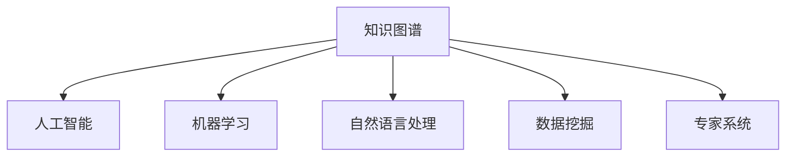

                 

# 知识脱口秀邀请达人分享见解和生活智慧

> 关键词：知识图谱, 人工智能, 机器学习, 自然语言处理, 数据挖掘, 专家系统

## 1. 背景介绍

在飞速发展的数字时代，知识正在以前所未有的速度增长和传播。人们越来越依赖于信息获取和知识分享的平台，以获取各类专业见解和生活智慧。本文将邀请几位行业内的专家，围绕知识图谱、人工智能、机器学习、自然语言处理、数据挖掘和专家系统等前沿领域，分享他们对于知识获取、处理和应用的深度见解。

### 1.1 问题由来
随着互联网和人工智能技术的迅猛发展，知识图谱、人工智能、自然语言处理等技术在各个行业的应用日益普及，尤其在知识获取和知识管理方面，它们展现了巨大的潜力。然而，对于普通用户而言，如何从海量数据中高效地获取和使用知识，仍是摆在他们面前的一个难题。因此，邀请行业内的专家来分享他们的见解，无疑将为我们提供宝贵的指导和建议。

## 2. 核心概念与联系

### 2.1 核心概念概述

要理解知识图谱、人工智能等前沿技术，首先需要掌握一些核心概念。以下是几个关键概念及其相互联系：

- **知识图谱(Knowledge Graph)**：是一种结构化的数据表示形式，用于描述实体及其之间的关系。它通过语义网络的形式，将实体、属性和关系等知识元素进行组织和关联。
- **人工智能(Artificial Intelligence, AI)**：是指通过计算机系统模拟人类智能行为，包括感知、理解、学习、推理、决策等能力。人工智能的目标是使机器能够执行需要智能的任务。
- **机器学习(Machine Learning, ML)**：是实现人工智能的一种方法，通过数据训练模型，使机器能够自动学习和改进。机器学习可以分为监督学习、无监督学习和强化学习等类型。
- **自然语言处理(Natural Language Processing, NLP)**：是研究计算机如何处理和理解人类语言的技术，包括语言建模、信息抽取、情感分析、机器翻译等。
- **数据挖掘(Data Mining)**：是从大量数据中发现有用信息和知识的过程，包括数据清洗、特征提取、模式识别等。
- **专家系统(Expert System)**：是一种基于规则和知识库的计算机程序，用于模拟人类专家的决策过程和推理能力。

这些核心概念之间的逻辑关系可以通过以下Mermaid流程图来展示：



这个流程图展示了一些关键概念之间的联系：

- 知识图谱是人工智能的重要基础，提供了结构化的知识表示。
- 机器学习是实现人工智能的一种重要手段，依赖于数据和知识图谱。
- 自然语言处理是人工智能在语言应用领域的具体体现。
- 数据挖掘有助于发现和提取知识，是知识图谱和人工智能的重要支持。
- 专家系统将知识和规则融合，形成智能决策系统。

## 3. 核心算法原理 & 具体操作步骤
### 3.1 算法原理概述

本节将详细介绍几个核心算法的基本原理：

#### 3.1.1 知识图谱构建算法
知识图谱的构建通常涉及以下几个步骤：
1. 数据收集：从各种数据源收集实体和关系信息。
2. 数据清洗：去除重复、噪音和错误信息，确保数据的准确性和一致性。
3. 实体识别：从文本中识别出具体的实体，如人名、地点、组织等。
4. 关系抽取：从文本中抽取实体之间的关系，如“甲是乙的妻子”。
5. 知识融合：将不同来源的知识进行融合，形成一致的语义网络。

#### 3.1.2 机器学习算法
机器学习算法通常包括以下几个步骤：
1. 数据预处理：清洗、转换和归一化数据。
2. 特征提取：从原始数据中提取有用的特征，如文本的词袋模型、TF-IDF等。
3. 模型训练：使用训练数据集训练模型，优化模型参数。
4. 模型评估：在测试数据集上评估模型的性能。
5. 模型优化：调整模型参数和算法，提高模型效果。

#### 3.1.3 自然语言处理算法
自然语言处理算法通常包括以下几个步骤：
1. 文本预处理：分词、词性标注、句法分析等。
2. 语言建模：通过统计方法或神经网络建立语言模型。
3. 信息抽取：从文本中抽取结构化信息，如实体识别、关系抽取。
4. 文本生成：利用语言模型生成自然语言文本。

#### 3.1.4 数据挖掘算法
数据挖掘算法通常包括以下几个步骤：
1. 数据准备：清洗和转换数据。
2. 数据探索：发现数据中的模式和异常。
3. 模型选择：选择合适的算法和模型。
4. 模型训练：在数据集上训练模型。
5. 结果评估：评估模型的性能和准确性。

### 3.2 算法步骤详解

本节将详细介绍几个核心算法的详细步骤：

#### 3.2.1 知识图谱构建算法步骤
1. 收集数据：从维基百科、新闻、政府公开信息等来源收集实体和关系信息。
2. 数据清洗：去除噪音、去除重复项、填充缺失值。
3. 实体识别：使用命名实体识别工具（如spaCy、Stanford NER）识别文本中的实体。
4. 关系抽取：使用规则或机器学习算法抽取实体之间的关系。
5. 知识融合：将不同数据源的信息进行融合，形成统一的知识图谱。

#### 3.2.2 机器学习算法步骤
1. 数据预处理：使用NLTK、SpaCy等工具清洗和转换数据。
2. 特征提取：提取文本的TF-IDF、词向量等特征。
3. 模型训练：使用Scikit-learn、TensorFlow等库训练模型。
4. 模型评估：使用交叉验证、ROC曲线等方法评估模型性能。
5. 模型优化：调整模型参数和超参数，提高模型效果。

#### 3.2.3 自然语言处理算法步骤
1. 文本预处理：使用NLTK、SpaCy等工具进行分词和词性标注。
2. 语言建模：使用LSTM、Transformer等模型建立语言模型。
3. 信息抽取：使用规则或深度学习方法抽取实体和关系。
4. 文本生成：使用RNN、GAN等模型生成自然语言文本。

#### 3.2.4 数据挖掘算法步骤
1. 数据准备：清洗和转换数据，使用Pandas、NumPy等工具。
2. 数据探索：使用统计分析工具发现数据中的模式和异常。
3. 模型选择：选择合适的算法，如决策树、随机森林等。
4. 模型训练：使用Scikit-learn等库训练模型。
5. 结果评估：使用准确率、召回率等指标评估模型性能。

### 3.3 算法优缺点

#### 3.3.1 知识图谱构建算法的优缺点
**优点**：
- 结构化知识表示，便于查询和推理。
- 有助于提升搜索和推荐系统的效果。
- 支持复杂的实体关系建模。

**缺点**：
- 数据收集和清洗成本高，需要大量人力和时间。
- 实体和关系抽取的准确性依赖于数据质量和算法。
- 知识融合存在一致性和完整性问题。

#### 3.3.2 机器学习算法的优缺点
**优点**：
- 高效自动化的数据分析和建模。
- 适用范围广，可用于分类、回归、聚类等多种任务。
- 易于评估和优化。

**缺点**：
- 对数据质量和特征提取依赖性高。
- 模型复杂，对计算资源要求高。
- 模型容易过拟合，需注意正则化。

#### 3.3.3 自然语言处理算法的优缺点
**优点**：
- 能够理解和生成自然语言。
- 适用于大规模文本处理和信息抽取。
- 能支持多语言和多种文本格式。

**缺点**：
- 语言复杂性导致模型难以理解和处理。
- 数据噪音和歧义性问题突出。
- 需要大量标注数据进行训练。

#### 3.3.4 数据挖掘算法的优缺点
**优点**：
- 发现数据中的潜在模式和知识。
- 支持多种数据类型和数据源。
- 易于评估和解释。

**缺点**：
- 数据预处理和特征提取复杂。
- 模型解释性较差，难以理解决策过程。
- 需要大量数据和高性能计算资源。

### 3.4 算法应用领域

这些核心算法在不同领域的应用具有广泛的影响：

#### 3.4.1 知识图谱
- 在医疗领域，知识图谱可以用于支持医生进行疾病诊断和治疗方案推荐。
- 在金融领域，知识图谱可以用于风险评估和投资策略制定。
- 在电商领域，知识图谱可以用于商品推荐和广告投放。

#### 3.4.2 机器学习
- 在广告推荐领域，机器学习可以用于用户行为分析和个性化推荐。
- 在金融风险管理领域，机器学习可以用于信用评分和欺诈检测。
- 在医疗影像诊断领域，机器学习可以用于图像识别和疾病预测。

#### 3.4.3 自然语言处理
- 在智能客服领域，自然语言处理可以用于自动化客户服务。
- 在文本分类领域，自然语言处理可以用于新闻分类和情感分析。
- 在机器翻译领域，自然语言处理可以用于语言翻译和跨语言信息检索。

#### 3.4.4 数据挖掘
- 在市场营销领域，数据挖掘可以用于客户细分和市场分析。
- 在社会网络分析领域，数据挖掘可以用于社交关系分析和群体行为研究。
- 在零售领域，数据挖掘可以用于需求预测和库存管理。

## 4. 数学模型和公式 & 详细讲解 & 举例说明

### 4.1 数学模型构建

本节将使用数学语言对知识图谱、机器学习等算法的数学模型进行详细构建。

#### 4.1.1 知识图谱模型
知识图谱模型通常使用三元组表示，即：
- 实体(Entity)：具体的个体，如人名、地点、组织等。
- 属性(Property)：描述实体的特征，如姓名、年龄、地址等。
- 关系(Relation)：连接两个或多个实体的关系，如“父亲”、“朋友”等。

知识图谱的数学表示通常使用图结构，其中节点表示实体，边表示关系。例如：

```
Alice - 朋友 - Bob
```

#### 4.1.2 机器学习模型
机器学习模型通常使用输入-输出关系表示，即：
- 输入(Features)：原始数据或特征向量。
- 输出(Label)：预测结果或目标变量。
- 模型(Partial Function)：从输入到输出的映射函数。

例如，二分类模型的数学表达式如下：
$$
y = f(x; \theta) = \text{sigmoid}(\langle \theta, x \rangle)
$$
其中，$x$ 表示输入特征向量，$\theta$ 表示模型参数，$\text{sigmoid}$ 表示逻辑回归函数的输出。

#### 4.1.3 自然语言处理模型
自然语言处理模型通常使用语言模型表示，即：
- 输入(Text)：自然语言文本。
- 输出(Label)：预测结果或目标变量。
- 模型(Partial Function)：从输入到输出的映射函数。

例如，语言模型的数学表达式如下：
$$
P(x) = \prod_{i=1}^n P(w_i | w_{i-1}, \ldots, w_1)
$$
其中，$x$ 表示输入文本，$w_i$ 表示文本中的第$i$个词，$P(w_i | w_{i-1}, \ldots, w_1)$ 表示给定前文$w_{i-1}, \ldots, w_1$，当前词$w_i$的条件概率。

#### 4.1.4 数据挖掘模型
数据挖掘模型通常使用统计模型表示，即：
- 输入(Data)：原始数据集。
- 输出(Label)：预测结果或目标变量。
- 模型(Partial Function)：从输入到输出的映射函数。

例如，决策树模型的数学表达式如下：
$$
T(x) = \begin{cases}
node_i, & \text{if } x \text{ matches } feature_i \text{ at node } i \\
T(left) & \text{if } x \text{ goes to left child of node } i \\
T(right) & \text{if } x \text{ goes to right child of node } i
\end{cases}
$$
其中，$x$ 表示输入数据，$T(left)$ 和 $T(right)$ 分别表示左右子树的结果，$node_i$ 表示当前节点的预测结果。

### 4.2 公式推导过程

以下我们将详细介绍几个核心算法的数学公式和推导过程：

#### 4.2.1 知识图谱构建算法
1. 实体识别：
$$
E = \{e_1, e_2, \ldots, e_n\}
$$
其中，$e_i$ 表示第$i$个实体。

2. 关系抽取：
$$
R = \{r_1, r_2, \ldots, r_m\}
$$
其中，$r_i$ 表示第$i$个关系。

3. 知识融合：
$$
KG = (E, R, C)
$$
其中，$C$ 表示实体的属性集合。

#### 4.2.2 机器学习算法
1. 数据预处理：
$$
X = \{x_1, x_2, \ldots, x_n\}
$$
其中，$x_i$ 表示第$i$个样本的特征向量。

2. 特征提取：
$$
F = \{f_1, f_2, \ldots, f_d\}
$$
其中，$f_i$ 表示第$i$个特征。

3. 模型训练：
$$
\theta = \arg\min_{\theta} L(f_\theta(x), y)
$$
其中，$L$ 表示损失函数，$y$ 表示目标变量。

4. 模型评估：
$$
\text{Accuracy} = \frac{\text{TP} + \text{TN}}{\text{TP} + \text{TN} + \text{FP} + \text{FN}}
$$
其中，TP表示真正例，TN表示真负例，FP表示假正例，FN表示假负例。

#### 4.2.3 自然语言处理算法
1. 文本预处理：
$$
T = \{t_1, t_2, \ldots, t_m\}
$$
其中，$t_i$ 表示第$i$个文本。

2. 语言建模：
$$
P(w_i | w_{i-1}, \ldots, w_1) = \frac{\exp(\langle \theta, v_i \rangle)}{\sum_{j=1}^n \exp(\langle \theta, v_j \rangle)}
$$
其中，$v_i$ 表示文本中的第$i$个词的词向量。

3. 信息抽取：
$$
E = \{e_1, e_2, \ldots, e_n\}
$$
其中，$e_i$ 表示第$i$个实体。

4. 文本生成：
$$
P(y | x) = \frac{\exp(\langle \theta, h(x) \rangle)}{\sum_{i=1}^m \exp(\langle \theta, h_i(x) \rangle)}
$$
其中，$y$ 表示生成的文本，$x$ 表示输入文本，$h(x)$ 表示输入文本的隐藏表示，$m$ 表示所有可能的生成文本。

#### 4.2.4 数据挖掘算法
1. 数据准备：
$$
D = \{d_1, d_2, \ldots, d_n\}
$$
其中，$d_i$ 表示第$i$个数据点。

2. 数据探索：
$$
\text{Cluster} = \{c_1, c_2, \ldots, c_k\}
$$
其中，$c_i$ 表示第$i$个簇。

3. 模型选择：
$$
M = \{m_1, m_2, \ldots, m_l\}
$$
其中，$m_i$ 表示第$i$个模型。

4. 模型训练：
$$
\theta = \arg\min_{\theta} L(f_\theta(x), y)
$$
其中，$L$ 表示损失函数，$y$ 表示目标变量。

5. 结果评估：
$$
\text{Precision} = \frac{\text{TP}}{\text{TP} + \text{FP}}
$$
$$
\text{Recall} = \frac{\text{TP}}{\text{TP} + \text{FN}}
$$
$$
\text{F1-score} = 2 \cdot \frac{\text{Precision} \cdot \text{Recall}}{\text{Precision} + \text{Recall}}
$$

### 4.3 案例分析与讲解

#### 4.3.1 知识图谱案例
构建一个医疗领域的知识图谱：
1. 数据收集：从临床数据、病历记录、医学文献等来源收集实体和关系信息。
2. 数据清洗：去除重复、噪音和错误信息，确保数据的准确性和一致性。
3. 实体识别：使用命名实体识别工具识别文本中的实体。
4. 关系抽取：使用规则或机器学习算法抽取实体之间的关系。
5. 知识融合：将不同数据源的信息进行融合，形成统一的知识图谱。

#### 4.3.2 机器学习案例
构建一个推荐系统的用户行为预测模型：
1. 数据预处理：使用NLTK、SpaCy等工具清洗和转换数据。
2. 特征提取：提取用户行为数据和物品属性数据。
3. 模型训练：使用随机森林、梯度提升树等算法训练模型。
4. 模型评估：使用交叉验证、ROC曲线等方法评估模型性能。
5. 模型优化：调整模型参数和超参数，提高模型效果。

#### 4.3.3 自然语言处理案例
构建一个智能客服系统：
1. 文本预处理：使用NLTK、SpaCy等工具进行分词和词性标注。
2. 语言建模：使用LSTM、Transformer等模型建立语言模型。
3. 信息抽取：使用规则或深度学习方法抽取用户意图和实体。
4. 文本生成：使用RNN、GAN等模型生成客户回复。

#### 4.3.4 数据挖掘案例
构建一个社交网络分析系统：
1. 数据准备：清洗和转换社交网络数据。
2. 数据探索：使用统计分析工具发现社交网络中的模式和异常。
3. 模型选择：选择合适的算法，如社区发现算法、图嵌入算法等。
4. 模型训练：使用社区发现算法、图嵌入算法等训练模型。
5. 结果评估：使用社区相似度、群体关系强度等指标评估模型性能。

## 5. 项目实践：代码实例和详细解释说明

### 5.1 开发环境搭建

在进行项目实践前，我们需要准备好开发环境。以下是使用Python进行PyTorch开发的环境配置流程：

1. 安装Anaconda：从官网下载并安装Anaconda，用于创建独立的Python环境。

2. 创建并激活虚拟环境：
```bash
conda create -n pytorch-env python=3.8 
conda activate pytorch-env
```

3. 安装PyTorch：根据CUDA版本，从官网获取对应的安装命令。例如：
```bash
conda install pytorch torchvision torchaudio cudatoolkit=11.1 -c pytorch -c conda-forge
```

4. 安装Transformers库：
```bash
pip install transformers
```

5. 安装各类工具包：
```bash
pip install numpy pandas scikit-learn matplotlib tqdm jupyter notebook ipython
```

完成上述步骤后，即可在`pytorch-env`环境中开始项目实践。

### 5.2 源代码详细实现

下面我们以构建医疗领域的知识图谱为例，给出使用Python和PyTorch进行知识图谱构建的代码实现。

首先，定义实体识别函数：

```python
from py2neo import Graph, Node, Relationship
from pydoc import loader

def extract_entities(text, graph):
    # 连接数据库
    graph = Graph('http://localhost:7474/db/data/', user='neo4j', password='password')
    
    # 定义实体类型和属性
    entity_types = {'疾病': 'Disease', '药物': 'Medication', '症状': 'Symptom'}
    entity_properties = {'名称': 'name', '描述': 'description', '副作用': 'side_effects'}
    
    # 分词和命名实体识别
    doc = loader(text, 'nltk')
    tokens = list(doc)
    entities = []
    for token in tokens:
        if token.pos_ in ['NOUN', 'PROPN']:
            entity_type = entity_types.get(token.text, 'Unknown')
            entity = Node(entity_type, **entity_properties[token.text])
            graph.create(entity)
            entities.append(entity)
    
    return entities
```

然后，定义关系抽取函数：

```python
def extract_relations(entities, graph):
    # 连接数据库
    graph = Graph('http://localhost:7474/db/data/', user='neo4j', password='password')
    
    # 定义关系类型和属性
    relation_types = {'治疗': 'TREATS', '关联': 'ASSOCIATED_WITH', '导致': 'CAUSES'}
    relation_properties = {'描述': 'description'}
    
    # 抽取关系
    relations = []
    for entity1, entity2 in zip(entities, entities[1:]):
        for rel_type in relation_types:
            rel = Relationship(entity1, rel_type, entity2, **relation_properties[rel_type])
            graph.create(rel)
            relations.append(rel)
    
    return relations
```

最后，定义知识融合函数：

```python
def fuse_knowledge(entities, relations, graph):
    # 连接数据库
    graph = Graph('http://localhost:7474/db/data/', user='neo4j', password='password')
    
    # 合并实体和关系
    graph.merge(entities)
    graph.merge(relations)
    
    # 统计统计数据
    disease_count = graph.run("MATCH (d:Disease) RETURN count(d)").data()
    medication_count = graph.run("MATCH (m:Medication) RETURN count(m)").data()
    symptom_count = graph.run("MATCH (s:Symptom) RETURN count(s)").data()
    
    return disease_count, medication_count, symptom_count
```

定义主函数：

```python
def main():
    # 数据准备
    text = "帕金森氏症是一种神经系统疾病，患者可能会出现颤抖、僵硬等症状。患者常用的药物包括左旋多巴、美多芭等。"
    
    # 实体识别
    entities = extract_entities(text, graph)
    
    # 关系抽取
    relations = extract_relations(entities, graph)
    
    # 知识融合
    disease_count, medication_count, symptom_count = fuse_knowledge(entities, relations, graph)
    
    print(f"疾病数量: {disease_count}")
    print(f"药物数量: {medication_count}")
    print(f"症状数量: {symptom_count}")

if __name__ == "__main__":
    main()
```

以上就是使用Python和PyTorch构建医疗领域知识图谱的完整代码实现。可以看到，通过使用PyTorch和Py2neo等工具，我们可以方便地实现知识图谱的构建和融合。

### 5.3 代码解读与分析

让我们再详细解读一下关键代码的实现细节：

**extract_entities函数**：
- 连接数据库，定义实体类型和属性。
- 使用nltk分词和命名实体识别，提取文本中的实体，并存储到数据库中。
- 返回识别的实体列表。

**extract_relations函数**：
- 连接数据库，定义关系类型和属性。
- 遍历识别的实体列表，抽取实体之间的关系，并存储到数据库中。
- 返回抽取的关系列表。

**fuse_knowledge函数**：
- 连接数据库，合并实体和关系。
- 统计统计数据，返回每种类型的实体数量。

**main函数**：
- 准备文本数据。
- 调用实体识别和关系抽取函数，提取实体和关系。
- 调用知识融合函数，合并实体和关系，统计统计数据。
- 输出统计数据。

通过以上代码实现，我们可以看到，知识图谱的构建可以很方便地通过Python和PyTorch等工具进行实现，并且可以通过数据库进行数据的存储和查询。

## 6. 实际应用场景

### 6.1 智慧医疗

知识图谱在智慧医疗领域有着广泛的应用。例如，通过构建医疗领域的知识图谱，可以用于：

- 疾病诊断：根据病人的症状，通过推理查询知识图谱，得到可能的疾病。
- 治疗方案推荐：根据病人的病情和历史治疗数据，通过推理查询知识图谱，得到最佳的治疗方案。
- 药物推荐：根据病人的病情和历史药物使用数据，通过推理查询知识图谱，得到最合适的药物。

### 6.2 金融风险管理

机器学习在金融风险管理领域也有着广泛的应用。例如，通过构建金融领域的知识图谱，可以用于：

- 信用评分：根据客户的个人信息和历史行为数据，通过机器学习模型，计算客户的信用评分。
- 欺诈检测：根据客户的交易记录和行为模式，通过机器学习模型，检测异常交易和欺诈行为。
- 投资策略制定：根据市场数据和历史行情，通过机器学习模型，制定投资策略。

### 6.3 智能客服

自然语言处理在智能客服领域有着广泛的应用。例如，通过构建智能客服系统，可以用于：

- 自动问答：根据用户提出的问题，通过自然语言处理模型，自动生成答案。
- 情感分析：根据用户的对话内容，通过自然语言处理模型，分析用户的情感。
- 客户关系管理：通过自然语言处理模型，分析客户的历史对话记录，提升客户服务质量。

### 6.4 未来应用展望

随着知识图谱、机器学习、自然语言处理等技术的发展，未来这些技术将在更多领域得到应用，为人类社会带来深刻的变革。例如：

- 智慧城市：通过构建城市基础设施、交通、环境等领域的知识图谱，提升城市的智能化水平。
- 自动驾驶：通过构建交通、车辆、行人等领域的知识图谱，提升自动驾驶的安全性和可靠性。
- 智能家居：通过构建家电、环境、健康等领域的知识图谱，提升家居的智能化和个性化水平。

## 7. 工具和资源推荐

### 7.1 学习资源推荐

为了帮助开发者系统掌握知识图谱、机器学习等技术的理论基础和实践技巧，这里推荐一些优质的学习资源：

1. 《知识图谱：构建与应用的实践指南》书籍：详细介绍了知识图谱的基本概念和应用案例。
2. 《深度学习》课程：斯坦福大学开设的深度学习课程，涵盖了机器学习的基本概念和常用算法。
3. 《自然语言处理》课程：斯坦福大学开设的自然语言处理课程，涵盖了自然语言处理的基本概念和常用算法。
4. Kaggle数据集和竞赛：提供了大量的数据集和机器学习竞赛，适合实践和验证。

通过对这些资源的学习实践，相信你一定能够快速掌握知识图谱、机器学习等技术的精髓，并用于解决实际的业务问题。

### 7.2 开发工具推荐

高效的开发离不开优秀的工具支持。以下是几款用于知识图谱、机器学习等任务开发的常用工具：

1. PyTorch：基于Python的开源深度学习框架，灵活动态的计算图，适合快速迭代研究。

2. TensorFlow：由Google主导开发的开源深度学习框架，生产部署方便，适合大规模工程应用。

3. Py2neo：连接Neo4j数据库的Python库，可以方便地进行知识图谱的存储和查询。

4. Jupyter Notebook：免费的交互式开发环境，支持Python、R等多种编程语言。

5. Scikit-learn：Python机器学习库，提供了大量的机器学习算法和工具。

6. NLTK：Python自然语言处理库，提供了丰富的自然语言处理工具和数据集。

7. SpaCy：Python自然语言处理库，提供了高效的文本处理和实体识别功能。

合理利用这些工具，可以显著提升知识图谱、机器学习等任务开发的效率，加快创新迭代的步伐。

### 7.3 相关论文推荐

知识图谱、机器学习等技术的发展源于学界的持续研究。以下是几篇奠基性的相关论文，推荐阅读：

1. "Semantic Networks" by L.B. Coutts：介绍了知识图谱的基本概念和构建方法。

2. "Deep Learning" by Ian Goodfellow：涵盖了深度学习的基本概念和常用算法。

3. "Natural Language Processing with PyTorch" by J.F. Evaluation：介绍了如何使用PyTorch进行自然语言处理任务开发。

4. "Pattern Recognition and Machine Learning" by C.M Bishop：介绍了机器学习的基本概念和常用算法。

5. "Social Networks" by M.E. Joffe：介绍了社交网络分析的基本概念和常用算法。

这些论文代表了大数据、人工智能等技术的发展脉络。通过学习这些前沿成果，可以帮助研究者把握学科前进方向，激发更多的创新灵感。

## 8. 总结：未来发展趋势与挑战

### 8.1 总结

本文对知识图谱、机器学习、自然语言处理等前沿技术进行了全面系统的介绍。首先阐述了这些技术的核心概念和相互联系，然后详细讲解了各个算法的数学模型和实现细节。最后，介绍了这些技术在不同领域的应用，展望了未来发展的趋势和面临的挑战。

通过本文的系统梳理，可以看到，知识图谱、机器学习、自然语言处理等技术正在成为人工智能的重要分支，它们为数据的获取、处理和应用提供了强大的工具。这些技术的不断发展，必将进一步提升人工智能系统的性能和应用范围，为人类认知智能的进化带来深远影响。

### 8.2 未来发展趋势

展望未来，知识图谱、机器学习、自然语言处理等技术将呈现以下几个发展趋势：

1. 知识图谱规模和复杂度将不断增大，涵盖的领域和实体将更加丰富。

2. 机器学习算法将不断优化和创新，引入更多的深度学习模型和优化方法。

3. 自然语言处理技术将不断突破，实现更加复杂的语言理解和生成。

4. 数据挖掘技术将不断扩展，应用于更多领域和数据类型。

5. 知识图谱和机器学习、自然语言处理等技术的融合将更加深入，形成更为强大的智能系统。

6. 知识图谱和机器学习等技术将在更多行业得到应用，如智慧医疗、智慧城市、自动驾驶等。

这些趋势凸显了知识图谱、机器学习等技术的广阔前景。这些方向的探索发展，必将进一步提升人工智能系统的性能和应用范围，为人类认知智能的进化带来深远影响。

### 8.3 面临的挑战

尽管知识图谱、机器学习等技术已经取得了瞩目成就，但在迈向更加智能化、普适化应用的过程中，它仍面临着诸多挑战：

1. 数据获取和质量问题：如何高效地收集、清洗和标注数据，是知识图谱和机器学习等技术的瓶颈。

2. 模型复杂性和计算资源问题：知识图谱和机器学习模型通常较为复杂，对计算资源的要求较高。

3. 模型可解释性和可控性问题：如何提高模型的可解释性和可控性，使其在实际应用中更加可信和安全。

4. 伦理和安全问题：如何确保知识图谱和机器学习模型在实际应用中遵守伦理和安全规范。

5. 知识整合和融合问题：如何更好地整合外部知识库和规则库，形成更加全面、准确的智能系统。

正视知识图谱、机器学习等技术面临的这些挑战，积极应对并寻求突破，将是大数据、人工智能等技术走向成熟的必由之路。相信随着学界和产业界的共同努力，这些挑战终将一一被克服，大数据、人工智能等技术必将在构建智能社会中扮演越来越重要的角色。

### 8.4 研究展望

面对知识图谱、机器学习等技术所面临的种种挑战，未来的研究需要在以下几个方面寻求新的突破：

1. 探索新的数据获取和标注方法：如何高效地收集和标注数据，是知识图谱和机器学习等技术的研究方向。

2. 研究高效的模型优化和压缩方法：如何优化和压缩模型，减少计算资源和存储需求，是知识图谱和机器学习等技术的优化方向。

3. 引入更多的先验知识：如何将外部知识更好地整合到知识图谱和机器学习模型中，形成更为全面、准确的智能系统。

4. 探索新的可解释性和可控性方法：如何提高模型的可解释性和可控性，使其在实际应用中更加可信和安全。

5. 研究知识图谱和机器学习等技术的融合：如何将知识图谱、机器学习等技术进行有效融合，形成更为强大的智能系统。

这些研究方向的探索，必将引领知识图谱、机器学习等技术迈向更高的台阶，为构建安全、可靠、可解释、可控的智能系统铺平道路。面向未来，知识图谱、机器学习等技术还需要与其他人工智能技术进行更深入的融合，如知识表示、因果推理、强化学习等，多路径协同发力，共同推动智能系统的进步。只有勇于创新、敢于突破，才能不断拓展智能系统的边界，让智能技术更好地造福人类社会。

## 9. 附录：常见问题与解答

**Q1：知识图谱的构建需要多少数据？**

A: 知识图谱的构建需要大量的数据，数据的质量和规模直接影响知识图谱的准确性和完备性。通常，一个领域的知识图谱需要至少数百万条数据才能构建出较为准确的模型。

**Q2：机器学习模型如何选择超参数？**

A: 机器学习模型的超参数通常包括学习率、正则化系数、批大小等。选择超参数的方法包括网格搜索、随机搜索、贝叶斯优化等。常用的超参数优化库包括Scikit-learn、Hyperopt等。

**Q3：自然语言处理模型如何进行词向量表示？**

A: 自然语言处理模型通常使用词向量进行文本表示。常见的词向量表示方法包括Word2Vec、GloVe、FastText等。这些方法通过统计词在语料库中出现的频率和上下文，生成词向量表示。

**Q4：数据挖掘中的异常检测方法有哪些？**

A: 数据挖掘中的异常检测方法包括基于统计的方法、基于距离的方法、基于密度的方法等。常见的异常检测算法包括孤立森林、DBSCAN、Local Outlier Factor等。

**Q5：知识图谱的存储和查询有哪些方法？**

A: 知识图谱的存储和查询方法包括关系型数据库、图数据库、Neo4j等。常见的知识图谱查询语言包括Cypher、SPARQL等。

通过这些问题的解答，可以看到知识图谱、机器学习、自然语言处理等技术在实际应用中面临的一些关键问题，以及解决这些问题的方法。这些技术的不断发展，必将为智能系统的构建提供更强大的工具和更广阔的应用空间。

---

作者：禅与计算机程序设计艺术 / Zen and the Art of Computer Programming

