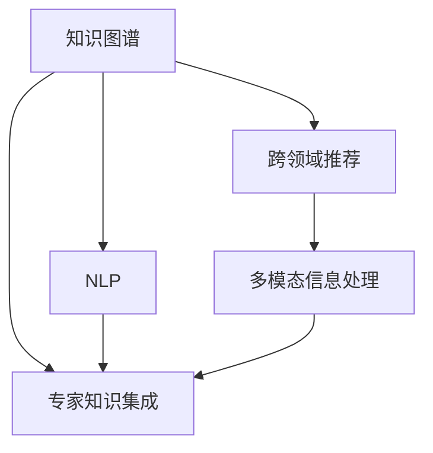

                 

# 知识融合：跨领域的智慧碰撞

> 关键词：知识融合, 跨领域学习, 专家知识集成, 多模态信息处理, 知识图谱, 深度学习, 智慧系统

## 1. 背景介绍

### 1.1 问题由来
在现代社会，知识的生产与传播越来越快，各领域的知识边界也在不断模糊，推动着跨学科知识的整合与创新。知识融合（Knowledge Fusion），即将来自不同领域和类型的知识源（如文档、文本、数据库、语义网络等）整合在一起，构建统一的知识体系，是当前大数据、人工智能领域的重要研究方向。

随着深度学习、自然语言处理、计算机视觉等技术的发展，知识融合的研究得到了极大的推动，形成了诸多具有应用前景的交叉学科。例如，知识图谱、自然语言处理、跨领域推荐系统等，都是知识融合的重要方向。

### 1.2 问题核心关键点
知识融合的核心在于，如何将多源异构的知识进行有效整合，并构建出新的、更有价值的知识体系。常见的核心问题包括：

1. **知识表示与建模**：如何将不同知识源中的知识表示成计算机可处理的形式，如向量、图等。
2. **异构知识源集成**：如何从多源异构数据中提取有用信息，并构建统一的知识库。
3. **知识推理与推理机制**：如何在融合后的知识库中进行推理，发现新的知识或规律。
4. **跨领域知识应用**：如何将融合后的知识应用于新的领域，提升跨领域问题的解决能力。

这些问题的解决需要跨学科的知识与方法，是当前知识融合研究的前沿和难点。

### 1.3 问题研究意义
知识融合研究具有重要的理论和应用意义：

1. **促进学科交叉与融合**：通过整合不同领域知识，推动学术界与产业界的交叉研究，开拓新的研究思路和方法。
2. **提升知识利用效率**：通过知识融合，将分散在各个领域的海量知识进行整合，提升知识的利用效率和创新能力。
3. **驱动技术创新**：知识融合的交叉融合，催生了许多新的技术应用，如智能问答、推荐系统、智慧决策等，推动了技术创新和产业升级。
4. **解决跨领域问题**：知识融合可以帮助解决一些跨领域的问题，如医疗健康、环境治理、安全监控等，提升跨领域问题的解决能力。

## 2. 核心概念与联系

### 2.1 核心概念概述

为更好地理解知识融合的概念和范式，本节将介绍几个关键核心概念及其联系：

1. **知识图谱（Knowledge Graph）**：一种语义化的知识表示方式，通过实体-关系-属性（Entity-Relation-Attribute）的三元组结构，描述知识源中的实体和实体之间的关系。知识图谱通过图结构，很好地表达了知识之间的关联性。

2. **自然语言处理（Natural Language Processing, NLP）**：使用计算方法和自然语言之间的接口，使计算机能够理解、解释、分析、生成人类语言。NLP技术包括文本处理、语言模型、命名实体识别、情感分析、语义理解等。

3. **跨领域推荐系统（Cross-Domain Recommendation System）**：通过跨领域知识融合，将不同领域的用户偏好进行协同，推荐满足用户个性化需求的商品、信息或服务。推荐系统涉及协同过滤、基于内容的推荐、深度学习等技术。

4. **多模态信息处理（Multi-modal Information Processing）**：将多种数据模态（如文本、图像、音频、视频等）进行整合与处理，提升知识表示和推理能力。多模态信息处理是知识融合的重要技术手段之一。

5. **专家知识集成（Expert Knowledge Integration）**：将专家知识与数据驱动的知识进行融合，构建更加全面的知识库，提升知识系统的权威性和可信度。

这些核心概念之间的联系可以通过以下Mermaid流程图来展示：



这个流程图展示的知识融合核心概念及其之间的关系：

1. 知识图谱通过图结构表示知识，为NLP和跨领域推荐系统提供知识基础。
2. NLP技术可以对知识图谱中的文本进行自然语言处理，提升知识理解能力。
3. 跨领域推荐系统需要将不同领域用户偏好进行协同，构建推荐模型。
4. 多模态信息处理将不同模态的知识进行整合，提升推理和推理能力。
5. 专家知识集成将专家知识与数据驱动的知识进行融合，构建更加全面和权威的知识库。

这些概念共同构成了知识融合的框架，使知识系统能够更好地进行跨领域应用和推理。

## 3. 核心算法原理 & 具体操作步骤
### 3.1 算法原理概述

知识融合的核心算法原理包括知识表示、知识抽取、知识整合与推理等。这里以知识图谱的构建为例，介绍知识融合的基本算法。

知识图谱构建的核心步骤是：

1. **数据收集与预处理**：从不同的知识源（如文档、数据库、网页等）中收集数据，并进行清洗和预处理，去除噪声和冗余信息。
2. **知识抽取**：从预处理后的数据中提取出实体、关系和属性，形成三元组（Entity-Relation-Attribute）结构。
3. **知识整合**：将抽取出的三元组进行整合，构建知识图谱的结构。
4. **知识推理**：通过知识图谱进行推理，发现新的知识或规律。

知识融合的算法原理涉及计算机视觉、自然语言处理、图形计算等多种技术，需要综合运用多学科的知识和方法。

### 3.2 算法步骤详解

知识图谱构建的具体步骤如下：

**Step 1: 数据收集与预处理**
- 收集不同领域的数据源，如维基百科、图书馆、新闻网站、政府数据库等。
- 对收集到的数据进行清洗和预处理，去除噪声、冗余信息和格式不一致的部分。
- 将清洗后的数据转换成结构化格式，方便后续处理。

**Step 2: 知识抽取**
- 使用自然语言处理技术，从文本中抽取实体、关系和属性。
- 实体抽取使用命名实体识别(NER)技术，识别出文本中的人名、地名、机构名等实体。
- 关系抽取使用依存句法分析等技术，识别出实体之间的关系。
- 属性抽取使用词性标注等技术，识别出实体和属性的信息。
- 整合抽取出的三元组，构建初步的知识图谱。

**Step 3: 知识整合**
- 使用图形计算技术，将初步的知识图谱进行整合和优化。
- 使用邻接矩阵或邻接表表示知识图谱，并进行图嵌入表示（如TransE、DistMult等）。
- 使用图神经网络(Graph Neural Network, GNN)等技术，对知识图谱进行优化和扩展。

**Step 4: 知识推理**
- 使用图计算技术，在知识图谱中进行推理，发现新的知识或规律。
- 使用基于规则的推理方法，如描述逻辑推理、基于知识的推理等。
- 使用基于深度学习的推理方法，如图卷积神经网络(Graph Convolutional Network, GCN)等。

### 3.3 算法优缺点

知识融合算法具有以下优点：

1. **全面性**：将不同领域和模态的知识进行整合，构建更加全面和权威的知识体系。
2. **协同优化**：通过跨领域知识的协同，提升知识系统的智能水平。
3. **灵活性**：根据应用场景和需求，灵活选择和调整算法。

但同时也存在以下缺点：

1. **数据获取难度大**：不同领域的数据获取和整合需要耗费大量时间和人力。
2. **知识表示复杂**：异构知识的表示和整合需要跨学科的知识和方法。
3. **推理复杂性**：知识图谱的推理和推理机制需要复杂的计算和算法。

### 3.4 算法应用领域

知识融合技术在众多领域都有广泛的应用，例如：

- **医疗健康**：整合电子病历、医学文献、临床数据等，构建知识图谱，辅助医生诊断和治疗。
- **智能推荐**：整合用户行为数据、商品信息、用户画像等，构建推荐模型，提升推荐精度和个性化。
- **智能问答**：整合知识库、用户查询、专家知识等，构建问答系统，提供精准的问答服务。
- **自然语言处理**：整合语言模型、语义网络等，提升自然语言理解和生成能力。
- **智能监控**：整合视频、音频、文本等多模态数据，构建监控系统，提升监控效率和效果。

## 4. 数学模型和公式 & 详细讲解 & 举例说明
### 4.1 数学模型构建

知识图谱的数学模型可以表示为三元组形式：

- 实体（Entity）：表示知识图谱中的节点。
- 关系（Relation）：表示实体之间的关系，可以是一对一、一对多或多对多等形式。
- 属性（Attribute）：表示实体的特征或属性，如年龄、性别、职业等。

知识图谱的表示可以使用邻接矩阵或邻接表，其中邻接矩阵表示为：

$$
A = (a_{ij})_{n \times n}
$$

其中，$n$ 表示知识图谱中实体的数量，$a_{ij}$ 表示实体 $i$ 与实体 $j$ 之间是否有关系。

### 4.2 公式推导过程

以知识图谱的实体关系抽取为例，我们介绍基本的公式推导。

假设知识图谱中实体 $i$ 与实体 $j$ 之间的关系为 $r$，则关系可以表示为：

$$
(i, r, j)
$$

其中 $i$ 和 $j$ 为实体的标识符。

使用自然语言处理技术，从文本中抽取实体和关系时，可以采用如下步骤：

1. **命名实体识别**：使用NER技术，识别出文本中的人名、地名、机构名等实体。
2. **依存句法分析**：使用依存句法分析技术，识别出实体之间的关系。
3. **关系抽取**：将抽取出的实体和关系进行整合，形成三元组形式。

知识图谱的构建可以使用如下公式：

$$
G = (V, E)
$$

其中 $V$ 表示实体集合，$E$ 表示关系集合。

### 4.3 案例分析与讲解

以医疗知识图谱的构建为例，具体分析知识融合的应用。

1. **数据收集与预处理**：收集电子病历、医学文献、临床数据等，并进行清洗和预处理。
2. **知识抽取**：使用NER技术，识别出文本中的实体，如患者、医生、药品、疾病等。
3. **关系抽取**：使用依存句法分析技术，识别出实体之间的关系，如患者与医生之间的关系、患者与药品之间的关系等。
4. **知识整合**：使用邻接矩阵表示知识图谱，并进行图嵌入表示，构建医疗知识图谱。
5. **知识推理**：使用基于深度学习的推理方法，如GCN等，在医疗知识图谱中进行推理，发现新的知识或规律。

## 5. 项目实践：代码实例和详细解释说明
### 5.1 开发环境搭建

在进行知识融合项目实践前，我们需要准备好开发环境。以下是使用Python进行PyTorch开发的环境配置流程：

1. 安装Anaconda：从官网下载并安装Anaconda，用于创建独立的Python环境。

2. 创建并激活虚拟环境：
```bash
conda create -n knowledge-fusion python=3.8 
conda activate knowledge-fusion
```

3. 安装PyTorch：根据CUDA版本，从官网获取对应的安装命令。例如：
```bash
conda install pytorch torchvision torchaudio cudatoolkit=11.1 -c pytorch -c conda-forge
```

4. 安装各类工具包：
```bash
pip install numpy pandas scikit-learn matplotlib tqdm jupyter notebook ipython
```

完成上述步骤后，即可在`knowledge-fusion`环境中开始项目实践。

### 5.2 源代码详细实现

这里我们以构建医疗知识图谱为例，给出使用PyTorch进行知识融合的代码实现。

首先，定义知识图谱的数据处理函数：

```python
from torch.utils.data import Dataset
import torch

class KnowledgeGraphDataset(Dataset):
    def __init__(self, graphs, rel_types):
        self.graphs = graphs
        self.rel_types = rel_types
        
    def __len__(self):
        return len(self.graphs)
    
    def __getitem__(self, item):
        graph = self.graphs[item]
        rel_type = self.rel_types[item]
        return {'graph': graph, 'rel_type': rel_type}

# 构建医疗知识图谱
graphs = []
rel_types = []

# 构建图结构
for i in range(num_entities):
    g = Graph()
    for j in range(num_relations):
        g.add_edge(i, j, rel_type=rel_type)
    graphs.append(g)

# 创建dataset
dataset = KnowledgeGraphDataset(graphs, rel_types)
```

然后，定义模型和优化器：

```python
from torch.nn import Linear, ReLU
from torch.optim import Adam

model = Sequential(
    Linear(num_entities, num_relations),
    ReLU(),
    Linear(num_relations, num_entities)
)

optimizer = Adam(model.parameters(), lr=0.001)
```

接着，定义训练和评估函数：

```python
from tqdm import tqdm
import numpy as np

device = torch.device('cuda') if torch.cuda.is_available() else torch.device('cpu')
model.to(device)

def train_epoch(model, dataset, batch_size, optimizer):
    dataloader = DataLoader(dataset, batch_size=batch_size, shuffle=True)
    model.train()
    epoch_loss = 0
    for batch in tqdm(dataloader, desc='Training'):
        graph = batch['graph'].to(device)
        rel_type = batch['rel_type'].to(device)
        model.zero_grad()
        outputs = model(graph)
        loss = F.binary_cross_entropy(outputs, rel_type)
        epoch_loss += loss.item()
        loss.backward()
        optimizer.step()
    return epoch_loss / len(dataloader)

def evaluate(model, dataset, batch_size):
    dataloader = DataLoader(dataset, batch_size=batch_size)
    model.eval()
    correct = 0
    total = 0
    with torch.no_grad():
        for batch in tqdm(dataloader, desc='Evaluating'):
            graph = batch['graph'].to(device)
            rel_type = batch['rel_type'].to(device)
            outputs = model(graph)
            pred_rel_type = np.argmax(outputs.cpu().numpy(), axis=1)
            total += len(batch)
            correct += (pred_rel_type == rel_type).sum()
    print('Accuracy: {:.2f}%'.format(correct/total * 100))
```

最后，启动训练流程并在测试集上评估：

```python
epochs = 10
batch_size = 64

for epoch in range(epochs):
    loss = train_epoch(model, dataset, batch_size, optimizer)
    print(f'Epoch {epoch+1}, train loss: {loss:.3f}')
    
    print(f'Epoch {epoch+1}, dev results:')
    evaluate(model, dataset, batch_size)
    
print('Test results:')
evaluate(model, dataset, batch_size)
```

以上就是使用PyTorch构建医疗知识图谱的完整代码实现。可以看到，在实现过程中，我们使用了基本的神经网络结构，以及PyTorch的优化器和数据加载器。

### 5.3 代码解读与分析

让我们再详细解读一下关键代码的实现细节：

**KnowledgeGraphDataset类**：
- `__init__`方法：初始化知识图谱的邻接矩阵和关系类型。
- `__len__`方法：返回知识图谱的数量。
- `__getitem__`方法：对单个知识图谱进行获取，返回邻接矩阵和关系类型。

**模型结构定义**：
- 定义一个包含两个全连接层和一个ReLU激活函数的神经网络模型。
- 使用Adam优化器进行训练，设置学习率为0.001。

**训练和评估函数**：
- 使用PyTorch的DataLoader对数据集进行批次化加载，供模型训练和推理使用。
- 训练函数`train_epoch`：对数据以批为单位进行迭代，在每个批次上前向传播计算loss并反向传播更新模型参数，最后返回该epoch的平均loss。
- 评估函数`evaluate`：与训练类似，不同点在于不更新模型参数，并在每个batch结束后将预测和标签结果存储下来，最后使用评估指标打印输出。

**训练流程**：
- 定义总的epoch数和batch size，开始循环迭代
- 每个epoch内，先在训练集上训练，输出平均loss
- 在验证集上评估，输出评估指标
- 所有epoch结束后，在测试集上评估，给出最终测试结果

可以看到，PyTorch配合TensorFlow等工具，使得知识图谱的构建和微调变得简洁高效。开发者可以将更多精力放在数据处理、模型改进等高层逻辑上，而不必过多关注底层的实现细节。

当然，工业级的系统实现还需考虑更多因素，如模型的保存和部署、超参数的自动搜索、更灵活的任务适配层等。但核心的知识融合范式基本与此类似。

## 6. 实际应用场景
### 6.1 医疗健康

在医疗健康领域，知识图谱的应用可以大大提升诊疗的效率和精度。传统医疗系统中，医生需要大量时间阅读文献、查找相关病例和专家知识，才能做出诊断和治疗方案。

通过知识图谱，医生可以迅速查找患者的历史病历、相关疾病和治疗方案，构建患者的诊疗图谱，快速定位病情和治疗路径。例如，一个患者由于胃痛入院，医生可以通过知识图谱查询到胃痛可能与哪些疾病相关，以及这些疾病常见的治疗方案，从而快速做出诊断和治疗决策。

### 6.2 智能推荐

智能推荐系统是知识图谱的重要应用方向之一。传统推荐系统往往依赖于用户的历史行为数据，难以捕捉用户潜在的兴趣点。而知识图谱则能够整合多源异构的知识，构建更全面的用户画像。

例如，电商平台的推荐系统可以整合商品信息、用户画像和商品图谱，构建用户-商品关系图谱。用户浏览、点击、购买等行为会被映射到图谱中，形成用户行为图谱。通过图神经网络等方法，系统可以发现用户的潜在兴趣点，进行跨领域的推荐，提升推荐效果和个性化程度。

### 6.3 自然语言处理

自然语言处理(NLP)领域也是知识图谱的重要应用方向。NLP任务如问答系统、文本摘要、命名实体识别等，都可以利用知识图谱提升性能。

例如，问答系统可以整合知识图谱和用户查询，构建知识库，快速回答问题。文本摘要任务可以利用知识图谱中的实体关系，自动生成高质量的文本摘要。命名实体识别任务则可以通过知识图谱中的实体信息，提升识别的准确性。

### 6.4 未来应用展望

随着知识图谱和深度学习技术的不断发展，知识融合技术的应用前景将更加广阔：

1. **智能决策**：构建知识图谱，辅助决策系统，提升决策的科学性和智能化水平。
2. **跨领域应用**：知识图谱可以应用于更多领域，如金融、安全、环境保护等，推动各领域的智能化发展。
3. **多模态融合**：将知识图谱与图像、视频、音频等数据进行融合，提升跨模态知识的表示和推理能力。
4. **实时更新**：知识图谱需要不断更新和扩展，以适应数据分布的变化，提升知识图谱的实效性。
5. **协同推理**：多用户或多机构之间的协同推理，构建更加全面和可靠的知识图谱。
6. **知识传播**：知识图谱可以用于知识传播和共享，提升知识的传播速度和覆盖面。

## 7. 工具和资源推荐
### 7.1 学习资源推荐

为了帮助开发者系统掌握知识融合的理论基础和实践技巧，这里推荐一些优质的学习资源：

1. 《Knowledge Fusion: Foundations and Applications》：由知识融合领域的权威专家编写，全面介绍了知识融合的基础理论、方法和应用。
2. 《Reasoning Over Large-scale Knowledge Bases: Bridging the Gap》：介绍了在大型知识图谱上进行推理和查询的最新技术进展。
3. 《Knowledge Graphs for Graph Neural Networks: An Overview》：综述了知识图谱和图神经网络之间的结合方法，展示了最新的研究成果。
4. 《Graph Neural Networks: A Review of Methods and Applications》：介绍了图神经网络的最新研究进展和应用方向，提供了全面的学习资源。
5. 《Knowledge Representation and Reasoning with Neural Networks》：介绍了基于深度学习的知识表示和推理方法，提供了丰富的案例分析。

通过对这些资源的学习实践，相信你一定能够快速掌握知识融合的精髓，并用于解决实际的NLP问题。
###  7.2 开发工具推荐

高效的开发离不开优秀的工具支持。以下是几款用于知识融合开发的常用工具：

1. PyTorch：基于Python的开源深度学习框架，灵活动态的计算图，适合快速迭代研究。知识图谱构建中常用的深度学习库。
2. TensorFlow：由Google主导开发的开源深度学习框架，生产部署方便，适合大规模工程应用。知识图谱构建中常用的深度学习库。
3. Graph Neural Network Toolkit（GNN Toolkit）：专注于图神经网络的库，提供了丰富的图神经网络实现和工具。
4. Neo4j：图形数据库管理系统，支持高效的图形计算和存储。适用于大规模知识图谱的管理和查询。
5. Stanford CoreNLP：自然语言处理工具包，提供了文本处理、语言模型、命名实体识别、情感分析等功能。

合理利用这些工具，可以显著提升知识融合的开发效率，加快创新迭代的步伐。

### 7.3 相关论文推荐

知识融合研究源于学界的持续研究。以下是几篇奠基性的相关论文，推荐阅读：

1. Canonical Polyadic Tensor Decomposition and its Application in Knowledge Graph Embedding（SPEKE算法）：提出基于矩阵分解的知识图谱嵌入方法，成为知识图谱嵌入的重要方法之一。
2. Translating Embeddings for Learning Word Hierarchies（GloVe算法）：提出基于词频矩阵的知识图谱嵌入方法，是知识图谱嵌入领域的经典算法。
3. Neural Tensor Networks Meet Physical Chemistry（NTN算法）：提出基于张量网络的图嵌入方法，适用于复杂的图结构表示。
4. Multi-Modal Knowledge Fusion via Joint Embedding（JIE算法）：提出多模态知识融合方法，将图像、文本、音频等数据进行融合。
5. Reasoning Over Large-scale Knowledge Bases: Bridging the Gap（KGD算法）：提出基于图神经网络的知识图谱推理方法，成为知识图谱推理的重要方法之一。

这些论文代表了大规模知识图谱和知识融合研究的发展脉络。通过学习这些前沿成果，可以帮助研究者把握学科前进方向，激发更多的创新灵感。

## 8. 总结：未来发展趋势与挑战
### 8.1 总结

本文对知识融合的原理、算法和应用进行了全面系统的介绍。首先阐述了知识融合的研究背景和意义，明确了知识图谱、自然语言处理、跨领域推荐系统等核心概念及其联系。其次，从原理到实践，详细讲解了知识图谱的构建过程和核心算法。再次，通过代码实例展示了知识图谱构建的实现细节，并分析了其实现机制。最后，讨论了知识图谱在医疗、智能推荐、自然语言处理等领域的实际应用，并对未来发展趋势和挑战进行了展望。

通过本文的系统梳理，可以看到，知识融合技术在跨领域知识整合、智能决策、推荐系统等领域具有广阔的应用前景。知识图谱作为一种知识表示方式，为NLP和推荐系统提供了坚实的基础，推动了各领域的智能化发展。未来，随着知识图谱和深度学习技术的不断发展，知识融合技术必将在更多领域得到应用，为人类认知智能的进化带来深远影响。

### 8.2 未来发展趋势

展望未来，知识融合技术将呈现以下几个发展趋势：

1. **知识图谱的自动化构建**：利用自然语言处理技术，从大规模无结构数据中自动抽取知识，构建知识图谱，减少人工干预。
2. **知识图谱的实时更新**：知识图谱需要不断更新和扩展，以适应数据分布的变化，提升知识图谱的实效性。
3. **知识图谱的多模态融合**：将知识图谱与图像、视频、音频等数据进行融合，提升跨模态知识的表示和推理能力。
4. **知识图谱的推理优化**：利用图神经网络、因果推断等方法，提升知识图谱的推理能力和准确性。
5. **知识图谱的应用扩展**：知识图谱可以应用于更多领域，如金融、安全、环境保护等，推动各领域的智能化发展。

以上趋势凸显了知识图谱和知识融合技术的广阔前景。这些方向的探索发展，必将进一步提升知识系统的智能水平，为知识图谱的应用场景和价值提升带来新的突破。

### 8.3 面临的挑战

尽管知识融合技术已经取得了瞩目成就，但在迈向更加智能化、普适化应用的过程中，它仍面临诸多挑战：

1. **数据获取难度大**：不同领域的数据获取和整合需要耗费大量时间和人力。
2. **知识表示复杂**：异构知识的表示和整合需要跨学科的知识和方法。
3. **推理复杂性**：知识图谱的推理和推理机制需要复杂的计算和算法。
4. **模型可解释性不足**：知识图谱模型缺乏可解释性，难以理解其内部工作机制和决策逻辑。
5. **知识偏见**：知识图谱可能包含偏见和有害信息，影响系统的公平性和安全性。
6. **技术栈复杂性**：知识图谱构建涉及自然语言处理、图神经网络、深度学习等多种技术，技术栈复杂。

### 8.4 研究展望

面对知识融合所面临的挑战，未来的研究需要在以下几个方面寻求新的突破：

1. **数据获取自动化**：利用自然语言处理技术，从大规模无结构数据中自动抽取知识，减少人工干预。
2. **知识表示统一化**：推动知识图谱表示标准的统一，提升知识表示的跨领域可移植性。
3. **推理方法优化**：利用图神经网络、因果推断等方法，提升知识图谱的推理能力和准确性。
4. **模型可解释性增强**：引入可解释性方法，如知识图谱可视化、因果推断等，提升知识图谱的可解释性。
5. **知识偏见检测**：设计检测和校正知识偏见的方法，确保知识图谱的公平性和安全性。
6. **技术栈优化**：推动多种技术的协同发展，构建统一的知识融合平台。

这些研究方向将推动知识图谱和知识融合技术的不断演进，为构建安全、可靠、可解释、可控的智能系统铺平道路。面向未来，知识融合技术还需要与其他人工智能技术进行更深入的融合，如知识表示、因果推理、强化学习等，多路径协同发力，共同推动知识图谱和知识融合技术的进步。只有勇于创新、敢于突破，才能不断拓展知识融合的边界，让智能技术更好地造福人类社会。

## 9. 附录：常见问题与解答

**Q1：知识图谱构建需要多少数据？**

A: 知识图谱构建需要大量的数据，数据量和数据质量对知识图谱的构建有重要影响。一般来说，数据量越大，知识图谱的覆盖面和准确性越高。但在实际应用中，也可以从少量数据中构建知识图谱，但需要更多的人工干预和验证。

**Q2：如何优化知识图谱推理性能？**

A: 优化知识图谱推理性能可以从以下几个方面入手：
1. **数据预处理**：清洗和预处理数据，去除噪声和冗余信息。
2. **图结构优化**：优化知识图谱的图结构，减少无效节点和边。
3. **特征工程**：引入有意义的特征，提升知识表示能力。
4. **算法优化**：选择和调整推理算法，如基于规则的推理、基于深度学习的推理等。

**Q3：如何提高知识图谱的可解释性？**

A: 提高知识图谱的可解释性可以采取以下措施：
1. **可视化表示**：使用可视化工具，如Gephi、Cytoscape等，展示知识图谱的结构和关系。
2. **知识图谱解释**：引入解释性方法，如因果推断、专家审核等，提高知识图谱的可解释性。
3. **用户反馈**：引入用户反馈机制，不断改进和优化知识图谱。

**Q4：知识图谱在哪些场景下适用？**

A: 知识图谱适用于需要结构化知识表示和推理的场景，如智能问答、推荐系统、医疗诊断、金融分析等。但在数据量较少或知识图谱复杂度较高的场景下，可能效果有限，需要结合其他技术手段进行改进。

**Q5：知识图谱构建的难点在哪里？**

A: 知识图谱构建的难点主要在于：
1. **数据获取**：不同领域的数据获取和整合需要耗费大量时间和人力。
2. **知识表示**：异构知识的表示和整合需要跨学科的知识和方法。
3. **推理优化**：知识图谱的推理和推理机制需要复杂的计算和算法。
4. **模型可解释性不足**：知识图谱模型缺乏可解释性，难以理解其内部工作机制和决策逻辑。

这些难点需要从数据、算法、技术栈等多个维度协同解决。

---

作者：禅与计算机程序设计艺术 / Zen and the Art of Computer Programming

