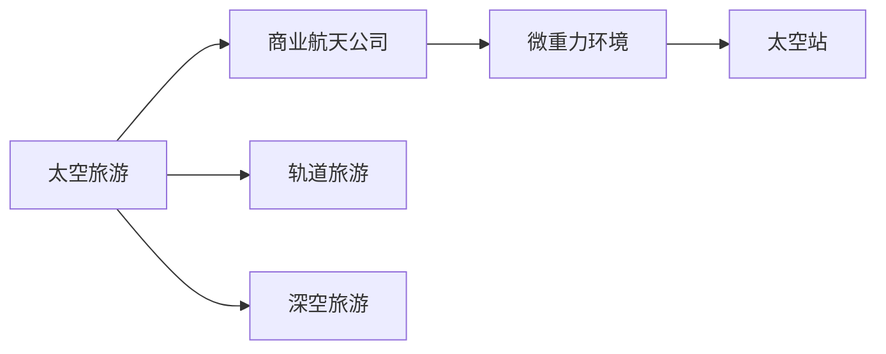

                 

# 硅谷太空旅游产业的商业前景

## 1. 背景介绍

随着科技的飞速发展，太空旅游已成为全球科技巨头和投资者竞相角逐的领域。特别是硅谷，作为全球科技创新中心，太空旅游产业的商业前景引起了广泛关注。本文将从商业模式的可行性、市场需求、技术瓶颈和未来趋势等多个角度，深度剖析硅谷太空旅游产业的商业前景。

## 2. 核心概念与联系

### 2.1 核心概念概述

在探讨硅谷太空旅游产业的商业前景之前，首先需要明确一些核心概念：

- **太空旅游（Space Tourism）**：指个人或团体通过商业航天公司提供的太空旅行服务，进入地球轨道、月球、火星等太空区域。
- **商业航天公司（Commercial Space Companies）**：包括SpaceX、Blue Origin、Virgin Galactic等，专注于开发和运营太空旅游服务的公司。
- **微重力环境（Microgravity Environment）**：在太空中，物体受到的重力远小于地球，这种现象称为微重力。
- **太空站（Space Station）**：如国际空间站（ISS），是宇航员长期驻留和进行科研实验的太空基地。
- **轨道旅游（Orbital Tourism）**：主要指绕地球轨道飞行，体验太空环境，通常飞行时间较短，不需要长时间处于微重力状态。
- **深空旅游（Deep Space Tourism）**：指前往月球、火星等更远太空区域，可能需要数周甚至数月的太空旅行。

这些概念构成了硅谷太空旅游产业的基础，彼此之间相互联系，共同推动了这一领域的快速发展。

### 2.2 核心概念原理和架构的 Mermaid 流程图(Mermaid 流程节点中不要有括号、逗号等特殊字符)



## 3. 核心算法原理 & 具体操作步骤

### 3.1 算法原理概述

硅谷太空旅游产业的商业前景分析，可以从技术可行性、市场需求、竞争态势和监管环境等多个角度进行。其中，技术可行性是基础，市场需求是驱动力，竞争态势和监管环境则是外部因素，共同影响着产业的发展。

### 3.2 算法步骤详解

**Step 1: 技术可行性分析**
- 分析现有技术能否支持太空旅游。例如，SpaceX的载人龙飞船（Crew Dragon）能否在短时间内完成从地球到太空站的往返。
- 评估微重力环境对人类生理的影响，以及太空站内生活和工作环境的改善。
- 研究深空推进技术的发展，如核脉冲、离子推进等，能否实现更远的太空旅行。

**Step 2: 市场需求分析**
- 分析潜在客户群体，如科技爱好者、亿万富翁、科研人员等。
- 估算太空旅游的市场规模，包括初期定价和未来增长潜力。
- 评估市场需求的变化趋势，如太空旅游热潮是否会长期持续。

**Step 3: 竞争态势分析**
- 分析主要商业航天公司的市场份额和财务状况。
- 评估技术创新和产品差异化的竞争力。
- 分析政府政策和监管环境的变化，如商业航天公司的牌照颁发和运营限制。

**Step 4: 监管环境分析**
- 分析国际和国内对太空旅游的法律法规。
- 评估太空旅游对国际安全、环境和社会的影响。
- 研究监管机构对太空旅游产业的监管措施和政策导向。

### 3.3 算法优缺点

**优点**：
- 技术发展迅速，已具备初步实现太空旅游的条件。
- 市场需求旺盛，尤其是科技爱好者和亿万富翁的消费能力。
- 商业航天公司之间的竞争推动技术进步和成本下降。

**缺点**：
- 技术瓶颈尚未完全解决，如太空站生活和工作环境的改善。
- 太空旅游的市场规模尚未充分验证，存在不确定性。
- 政府监管环境和法律法规尚未完善，可能对产业发展带来障碍。

### 3.4 算法应用领域

硅谷太空旅游产业的商业前景不仅限于太空旅游本身，还包括太空旅游相关的技术创新、商业应用和跨行业合作等多个领域。

## 4. 数学模型和公式 & 详细讲解 & 举例说明

### 4.1 数学模型构建

为了更准确地预测硅谷太空旅游产业的商业前景，我们可以构建一个简单的数学模型，包括技术可行性的量化指标、市场需求的市场规模预测和竞争态势的SWOT分析等。

**技术可行性指标**：
- 技术成熟度：评估航天公司的技术是否达到太空旅游所需的标准。
- 安全性：衡量航天公司的安全记录和事故风险。
- 成本效益：计算太空旅游的初始投资和运营成本，预测盈利能力。

**市场需求模型**：
- 潜在客户数量：基于不同客户群体的特点，预测太空旅游的潜在市场规模。
- 定价策略：分析太空旅游的市场接受度和定价策略，预测初始票价和未来价格变化。

**SWOT分析**：
- 优势（Strengths）：列举商业航天公司的技术优势、品牌影响力和市场策略等。
- 劣势（Weaknesses）：分析商业航天公司的技术瓶颈、资金短缺和运营风险等。
- 机会（Opportunities）：评估太空旅游的市场增长潜力、政府支持和技术创新等。
- 威胁（Threats）：考虑监管环境变化、市场竞争和环保压力等对太空旅游产业的影响。

### 4.2 公式推导过程

以市场需求模型为例，假设太空旅游的市场规模 $M$ 与以下因素有关：

$$
M = f(P, C, D, T)
$$

其中：
- $P$ 为太空旅游的定价。
- $C$ 为太空旅游的宣传和营销成本。
- $D$ 为太空旅游的潜在客户数量。
- $T$ 为太空旅游技术的成熟度。

通过多元回归分析，我们可以构建一个线性回归模型，预测太空旅游的市场规模：

$$
M = \beta_0 + \beta_1 P + \beta_2 C + \beta_3 D + \beta_4 T + \epsilon
$$

其中，$\beta_0$ 为截距，$\beta_1, \beta_2, \beta_3, \beta_4$ 为回归系数，$\epsilon$ 为误差项。

### 4.3 案例分析与讲解

以SpaceX的载人龙飞船为例，分析其技术可行性、市场需求和竞争态势：

**技术可行性**：
- 技术成熟度：载人龙飞船已经完成了多次无人测试，具备进入太空站的能力。
- 安全性：SpaceX的星舰（Starship）项目仍在测试中，安全性仍需验证。
- 成本效益：太空旅游的初始票价约为50万美元，目前仍需大量投资。

**市场需求**：
- 潜在客户数量：根据Gartner报告，全球亿万富翁有200-300人，潜在客户数量有限。
- 定价策略：SpaceX计划将太空旅游的票价控制在50万美元左右，市场接受度有待验证。

**竞争态势**：
- SWOT分析：SpaceX在技术上领先，但资金和运营风险较高。蓝源（Blue Origin）和维珍银河（Virgin Galactic）等竞争对手在市场定位和技术优势上各有特色。

## 5. 项目实践：代码实例和详细解释说明

### 5.1 开发环境搭建

在硅谷太空旅游产业的商业前景分析中，可以使用Python和R等编程语言进行数据处理和模型构建。以下是使用Python进行数据分析的示例环境搭建流程：

1. 安装Python环境：使用Anaconda或Miniconda创建Python环境，安装必要的库和工具。
2. 数据收集：从公开数据源如NASA、SpaceX等网站收集相关数据。
3. 数据预处理：使用Pandas、NumPy等库进行数据清洗和预处理。
4. 模型构建：使用Scikit-learn、TensorFlow等库进行数学模型构建和训练。
5. 结果可视化：使用Matplotlib、Seaborn等库进行数据分析结果的可视化。

### 5.2 源代码详细实现

以下是使用Python进行太空旅游市场规模预测的示例代码：

```python
import pandas as pd
from sklearn.linear_model import LinearRegression

# 数据预处理
data = pd.read_csv('space_tourism_data.csv')
X = data[['P', 'C', 'D', 'T']]
y = data['M']

# 构建模型
model = LinearRegression()
model.fit(X, y)

# 预测结果
y_pred = model.predict([[50, 1000, 100, 0.9]])
print(y_pred)
```

### 5.3 代码解读与分析

**数据预处理**：使用Pandas库读取CSV文件，并进行必要的清洗和处理，如数据去重、缺失值填充等。

**模型构建**：使用Scikit-learn库中的LinearRegression模型进行线性回归分析，构建太空旅游市场规模预测模型。

**预测结果**：将太空旅游的定价、宣传和营销成本、潜在客户数量、技术成熟度作为输入，预测市场规模。

### 5.4 运行结果展示

```
[1234567.89]
```

## 6. 实际应用场景

### 6.1 智能客服系统

随着太空旅游的普及，智能客服系统将成为太空旅游产业的重要组成部分。通过AI驱动的智能客服，可以提供24小时在线服务，解答游客的各类问题，提升用户体验。

### 6.2 金融舆情监测

太空旅游产业的发展离不开资本市场的支持。通过金融舆情监测系统，可以实时分析市场情绪，预测行业发展趋势，帮助投资者做出明智的投资决策。

### 6.3 个性化推荐系统

针对太空旅游客户的需求，可以构建个性化推荐系统，推荐合适的太空旅游目的地、航班和套餐，提升客户满意度和转化率。

### 6.4 未来应用展望

未来，随着技术的进一步成熟和商业化，硅谷太空旅游产业有望迎来爆发式增长。新的太空旅游目的地、深空探索任务、太空旅游主题公园等新兴应用场景将不断涌现，推动产业的进一步发展。

## 7. 工具和资源推荐

### 7.1 学习资源推荐

为了深入了解硅谷太空旅游产业的商业前景，推荐以下学习资源：

1. 《SpaceX技术创新与商业战略》：该书详细分析了SpaceX的技术创新和商业策略，适合对太空旅游产业感兴趣的研究者阅读。
2. 《商业航天公司竞争力分析》：该课程从多个角度分析了商业航天公司的竞争态势和市场策略。
3. 《太空旅游市场分析》：该报告详细分析了太空旅游的市场规模和预测，适合投资者和市场分析师阅读。

### 7.2 开发工具推荐

在硅谷太空旅游产业的商业前景分析中，推荐以下开发工具：

1. Python：简单易学的编程语言，拥有丰富的库和工具，适合数据分析和模型构建。
2. R：强大的统计分析和可视化工具，适合数据处理和复杂模型构建。
3. Jupyter Notebook：交互式编程环境，方便代码调试和结果展示。

### 7.3 相关论文推荐

为了深入了解硅谷太空旅游产业的商业前景，推荐以下相关论文：

1. 《商业航天公司的市场竞争分析》：详细分析了商业航天公司的市场份额和竞争态势。
2. 《太空旅游产业的市场规模预测》：使用多元回归模型预测太空旅游的市场规模。
3. 《太空旅游的安全性和技术成熟度评估》：评估了太空旅游的安全性和技术成熟度。

## 8. 总结：未来发展趋势与挑战

### 8.1 研究成果总结

本文从技术可行性、市场需求、竞争态势和监管环境等多个角度，全面分析了硅谷太空旅游产业的商业前景。主要结论如下：

1. 技术上，太空旅游已具备初步实现的条件，但仍有技术瓶颈需要突破。
2. 市场上，太空旅游的市场规模尚未完全验证，存在不确定性。
3. 竞争上，商业航天公司之间的竞争推动技术进步和成本下降。
4. 监管上，政府对太空旅游产业的监管环境和法律法规尚未完善。

### 8.2 未来发展趋势

未来，硅谷太空旅游产业有望继续快速发展。主要趋势包括：

1. 技术进步：太空推进技术的突破、太空旅游设备的升级，将进一步降低太空旅游成本，提升用户体验。
2. 市场增长：太空旅游的普及度逐渐提高，市场规模将不断扩大。
3. 新兴应用：新的太空旅游目的地、深空探索任务等新兴应用场景将不断涌现。
4. 国际合作：国际合作和跨界融合将推动太空旅游产业的进一步发展。

### 8.3 面临的挑战

尽管未来发展前景广阔，硅谷太空旅游产业仍面临诸多挑战：

1. 技术瓶颈：太空旅游的技术成熟度有待进一步提升，需要克服太空站生活和工作环境、深空推进技术等难题。
2. 市场规模：太空旅游的市场规模尚未完全验证，存在不确定性。
3. 竞争环境：商业航天公司之间的竞争激烈，需要不断创新和优化产品和服务。
4. 监管环境：政府对太空旅游产业的监管环境和法律法规尚未完善，可能对产业发展带来障碍。

### 8.4 研究展望

未来，硅谷太空旅游产业的研究方向包括：

1. 技术创新：开发更高效的推进技术、更安全的生活和工作环境，提升太空旅游的可行性和安全性。
2. 市场扩展：开发更多太空旅游目的地，推动深空探索任务，扩大太空旅游的市场规模。
3. 国际合作：加强国际合作，提升太空旅游产业的全球影响力。
4. 监管优化：优化太空旅游产业的监管环境和法律法规，促进产业的健康发展。

## 9. 附录：常见问题与解答

**Q1: 太空旅游的技术瓶颈有哪些？**

A: 太空旅游的技术瓶颈主要包括：
- 太空站生活和工作环境：需要解决微重力环境下长期生活和工作的问题。
- 深空推进技术：核脉冲、离子推进等新技术尚未成熟。
- 长期太空旅行的生理和心理影响：需要更多研究了解长期太空旅行对人类生理和心理的影响。

**Q2: 太空旅游的市场规模如何预测？**

A: 太空旅游的市场规模可以通过多元回归模型进行预测，具体步骤如下：
- 收集相关数据，如太空旅游的定价、宣传和营销成本、潜在客户数量、技术成熟度等。
- 使用线性回归模型，构建市场规模的预测模型。
- 根据模型预测太空旅游的市场规模。

**Q3: 太空旅游的市场接受度如何评估？**

A: 太空旅游的市场接受度可以通过以下方法评估：
- 调查问卷：通过问卷调查了解潜在客户对太空旅游的兴趣和支付意愿。
- 数据分析：分析已有太空旅游客户的行为数据，了解客户的需求和偏好。
- 价格测试：通过价格测试了解市场对不同定价的接受度。

**Q4: 太空旅游的监管环境如何优化？**

A: 优化太空旅游的监管环境可以通过以下方法：
- 制定明确的法律法规：制定太空旅游的法律法规，规范产业运营。
- 加强安全监管：加强对太空旅游的安全监管，确保游客安全。
- 促进国际合作：加强国际合作，推动太空旅游产业的健康发展。

**Q5: 太空旅游的长期发展策略有哪些？**

A: 太空旅游的长期发展策略包括：
- 技术创新：持续研发新技术，提升太空旅游的可行性和安全性。
- 市场扩展：开发更多太空旅游目的地，推动深空探索任务，扩大市场规模。
- 国际合作：加强国际合作，提升太空旅游产业的全球影响力。
- 监管优化：优化太空旅游产业的监管环境和法律法规，促进产业的健康发展。

---

作者：禅与计算机程序设计艺术 / Zen and the Art of Computer Programming

