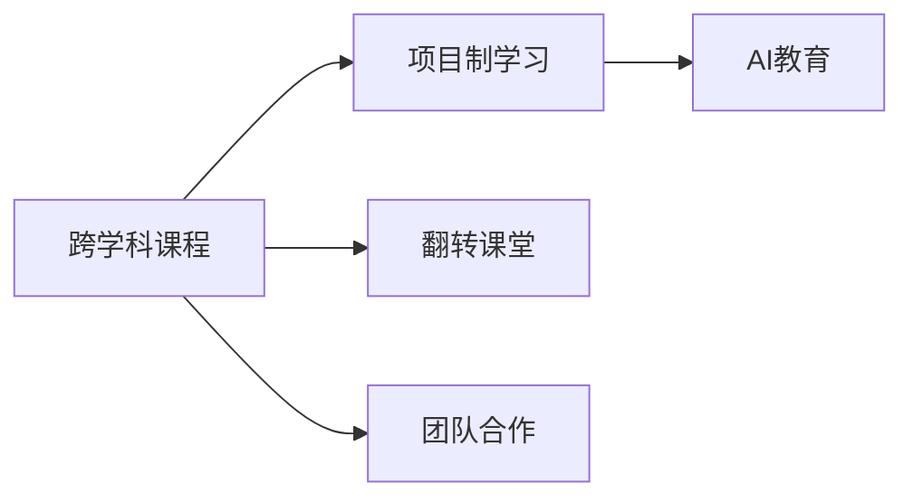

                 

# 硅谷教育改革:培养创新型人才

> 关键词：教育改革,创新型人才,人才培养,硅谷,AI教育

## 1. 背景介绍

在科技创新的浪潮下，世界各地的教育体系都面临着转型升级的巨大压力。尤其硅谷，作为全球科技创新的中心，其教育体系的自然转型更是受到广泛关注。如何培养出更多的创新型人才，让年轻一代能够持续推动技术进步，是硅谷教育改革的核心议题。

### 1.1 问题的由来

硅谷的教育体系一直被世界各地的教育机构所借鉴。但随着人工智能、机器学习、大数据等前沿技术的兴起，传统的教育模式已无法适应新技术的快速发展。技术变革带来的新挑战，如跨学科知识融合、数据科学思维、人工智能技能等，迫切需要教育体系进行结构性改革。

### 1.2 问题核心关键点

教育改革的核心关键点在于培养学生的创新能力，使其能够在复杂多变的环境中灵活应用所学知识，解决实际问题。硅谷的教育改革主要包括：

- **课程体系的重构**：打破传统的学科界限，引入跨学科课程，培养学生的综合解决问题的能力。
- **技能培训的强化**：加强计算机科学、数据科学、人工智能等新兴技能培训，使学生具备高阶思维和创新能力。
- **研究与实践的结合**：鼓励学生在科研和技术实践中深化知识理解，提升实际动手能力。
- **学习方法的优化**：引入翻转课堂、项目制学习、团队合作等先进教学模式，促进知识内化。

## 2. 核心概念与联系

### 2.1 核心概念概述

为了更深入地理解硅谷的教育改革，本节将介绍几个核心概念：

- **跨学科课程**：结合多门学科的知识，综合解决实际问题的课程设计方式。
- **项目制学习**：通过学生主导的项目，学习理论知识并实践应用的教与学模式。
- **翻转课堂**：课前学生自主学习知识，课堂上进行讨论、实践和反馈的教学方式。
- **团队合作**：学生通过团队合作完成项目任务，培养沟通协作能力。
- **AI教育**：面向人工智能领域的知识体系和实践技能的教育模式。

这些核心概念之间通过如下图所示的联系形成了一个完整的教育生态系统：



该图展示了跨学科课程是教育改革的起点，通过项目制学习、翻转课堂、团队合作等教学模式的应用，学生能够深化知识理解，提升应用能力。最终AI教育作为教育改革的目标，将使学生具备解决复杂问题的能力。

## 3. 核心算法原理 & 具体操作步骤
### 3.1 算法原理概述

硅谷的教育改革，从根本上说是一种基于创新的教育模式重构。其核心算法原理在于，通过跨学科的课程设计、项目导向的学习方式、高效的学习方法，激发学生的创新思维和实践能力。

### 3.2 算法步骤详解

硅谷的教育改革步骤可以分为以下几个关键环节：

**Step 1: 重构课程体系**
- 打破传统学科界限，引入计算机科学、数据科学、人工智能等多学科内容，形成跨学科课程。
- 设计综合性任务和项目，如开发智能应用、进行数据分析、完成机器学习模型等。

**Step 2: 引入项目制学习**
- 在课程中融入真实的项目，让学生通过自主探索和实践，掌握实际技能。
- 项目可以是学生自发提出的课题，也可以由教师引导。

**Step 3: 实施翻转课堂**
- 课前通过在线视频、预习资料等方式让学生自主学习知识。
- 课堂上，教师引导学生讨论、实践、解决实际问题，进行深度互动和反馈。

**Step 4: 强调团队合作**
- 学生通过团队形式合作完成项目，轮流担任项目经理、开发员、测试员等角色。
- 培养学生的沟通协作能力，提高团队决策和执行效率。

**Step 5: 引入AI教育**
- 在课程中增加AI基础知识和实践技能的内容。
- 通过AI项目的实践，使学生掌握机器学习、深度学习、自然语言处理等核心技术。

### 3.3 算法优缺点

硅谷教育改革的算法具有以下优点：
- **综合性更强**：通过跨学科课程的引入，使学生能够全面掌握多种领域的知识，提升综合解决问题的能力。
- **实践能力提高**：项目制学习、翻转课堂、团队合作等教学方法，使学生在实际项目中锻炼技能，提升动手能力。
- **创新能力培养**：多样化的学习方式和丰富的课程内容，激发学生的创新思维和创新能力。
- **适应性强**：通过AI教育，使学生掌握前沿技术，适应快速变化的技术环境。

同时，该算法也存在一些局限性：
- **教师和学生负担加重**：跨学科课程和项目制学习对教师和学生的要求较高，教学和实践难度较大。
- **资源需求大**：高质量的跨学科课程和实践项目需要更多的师资和实验设施，资源投入较大。
- **评价体系复杂**：项目制学习难以使用传统的考试成绩进行评价，需要设计新的评价体系。

### 3.4 算法应用领域

硅谷教育改革的算法在以下几个领域得到广泛应用：

- **大学教育**：斯坦福大学、加州大学伯克利分校等世界名校，通过引入跨学科课程和AI教育，培养出大量高素质的技术人才。
- **K-12教育**：硅谷的高中通过项目制学习和翻转课堂，提前为学生进入大学或就业做准备。
- **在线教育**：Coursera、Udacity等在线教育平台，提供跨学科课程和项目，让全球学生都能受益。
- **企业培训**：谷歌、Facebook等科技公司，通过跨学科课程和项目制学习，对员工进行持续的创新能力提升。

## 4. 数学模型和公式 & 详细讲解 & 举例说明
### 4.1 数学模型构建

教育改革的数学模型可以表示为一个多层次、多维度的网络。假设有 $n$ 个学科 $D=\{d_1,d_2,...,d_n\}$，每个学科有 $m$ 门课程 $C=\{c_{ij}\}_{i=1}^m$。学生通过 $k$ 种学习方法 $L=\{l_1,l_2,...,l_k\}$，完成 $p$ 个项目 $P=\{p_1,p_2,...,p_p\}$。

设 $G$ 为教育改革的复杂网络，每个节点代表一个学科、课程、学习方法或项目，边代表知识或技能之间的关联。教育改革的目标是最大化学生在不同领域内的知识和技能的关联度，从而提升其综合能力。

### 4.2 公式推导过程

为了构建教育改革的数学模型，我们引入以下变量：
- $S$：学生掌握的技能集合。
- $R$：学生完成的项目集合。
- $I$：学生获取的知识集合。

教育改革的优化目标为：
$$
\maximize \sum_{i=1}^n \sum_{j=1}^m \sum_{k=1}^p r_{ij} \cdot p_{ij} \cdot s_{ik}
$$
其中 $r_{ij}$ 为项目 $p_i$ 中包含学科 $d_j$ 的技能权重，$p_{ij}$ 为项目 $p_i$ 中包含课程 $c_{ij}$ 的权重，$s_{ik}$ 为课程 $c_{ij}$ 中包含学习方法 $l_k$ 的权重。

使用线性规划求解上述优化问题，即可得到最优的教育改革方案。

### 4.3 案例分析与讲解

以斯坦福大学的计算机科学课程为例，分析其跨学科课程体系的设计和实施。

**课程体系设计**：
- **课程名称**：计算机科学与人工智能导论、数据科学与统计学习、软件工程与系统设计、计算机网络与通信、人工智能基础与应用等。
- **跨学科融合**：引入认知科学、心理学、数学、物理等多学科内容，使学生在掌握计算机科学技能的同时，理解人类认知、智能决策等底层原理。
- **课程目标**：使学生能够综合运用多学科知识，解决实际问题，如机器人设计、数据分析、机器学习模型等。

**项目制学习实施**：
- **项目选题**：学生分组选择感兴趣的课题，如开发智能推荐系统、设计人机交互界面等。
- **项目执行**：学生通过团队合作，进行市场调研、需求分析、系统设计、代码实现、测试调试等全过程。
- **项目评价**：通过答辩、代码评审、成果展示等方式，对学生的项目进行多维度的评价，考察其技术能力、团队协作和创新思维。

通过上述案例，可以看出斯坦福大学在教育改革中，通过跨学科课程体系和项目制学习的有机结合，使学生能够在实践中深化知识理解，提升技能水平。这种教育模式不仅提升了学生的综合能力，也使他们具备了在复杂多变环境中解决问题的创新能力。

## 5. 项目实践：代码实例和详细解释说明
### 5.1 开发环境搭建

要进行硅谷教育改革的实践，首先需要搭建好开发环境。以下是使用Python进行项目实践的开发环境配置流程：

1. 安装Anaconda：从官网下载并安装Anaconda，用于创建独立的Python环境。

2. 创建并激活虚拟环境：
```bash
conda create -n ed-reform python=3.8 
conda activate ed-reform
```

3. 安装必要的工具包：
```bash
pip install pandas numpy matplotlib jupyter notebook sympy scikit-learn networkx
```

完成上述步骤后，即可在`ed-reform`环境中开始项目实践。

### 5.2 源代码详细实现

这里我们以斯坦福大学的跨学科课程为例，给出其教育改革的Python代码实现。

```python
import networkx as nx

# 构建课程体系
courses = nx.Graph()
courses.add_edge('计算机科学与人工智能导论', '数据科学与统计学习', weight=0.5)
courses.add_edge('数据科学与统计学习', '软件工程与系统设计', weight=0.4)
courses.add_edge('软件工程与系统设计', '计算机网络与通信', weight=0.3)
courses.add_edge('计算机网络与通信', '人工智能基础与应用', weight=0.2)
courses.add_edge('人工智能基础与应用', '计算机科学与人工智能导论', weight=0.4)

# 添加项目和学生
projects = ['智能推荐系统', '人机交互界面', '机器学习模型', '数据科学应用']
students = ['张三', '李四', '王五', '赵六']

# 设计项目组
groups = {'张三', '李四', '王五'}
groups.add('赵六')

# 学生分组参加项目
for group in groups:
    group_project = projects[0]  # 假设第一轮所有学生都参与第一个项目
    courses[group_project].add_node(group)
    courses.add_edge(group, '项目一', weight=0.8)
    courses.add_edge('项目一', group, weight=0.8)

# 输出课程体系
print(nx.to_dict_of_dicts(courses))
```

### 5.3 代码解读与分析

让我们再详细解读一下关键代码的实现细节：

**跨学科课程的建模**：
- 使用网络图（NetworkX）建模课程体系，每个课程表示为一个节点，课程之间的联系表示为边。通过加权边来表示课程间的关联程度。

**项目制学习的实现**：
- 定义项目和学生的基本信息，通过添加节点和边来表示学生参与的项目。每个项目节点对应一个实际项目，学生节点与项目节点相连，表示其参与程度。

**团队合作的模拟**：
- 通过分组模拟团队合作，将学生分配到项目组中，并设计每个组至少有一个学生。通过添加节点和边来表示团队结构，每个组节点与对应的项目节点相连，表示其参与项目的情况。

**输出结果的展示**：
- 通过输出课程体系的网络图，可以直观展示各学科、课程和项目之间的关系，方便进一步分析优化。

## 6. 实际应用场景
### 6.1 大学教育

硅谷的教育改革在大学教育中的应用，以斯坦福大学为例。斯坦福大学通过跨学科课程和项目制学习，培养了大批高素质的技术人才。学生在完成课程的同时，参与到各种跨学科项目中，如智能机器人、数据科学应用等。这些项目不仅加深了学生对知识的理解，还提升了其创新能力。

### 6.2 K-12教育

硅谷的高中通过项目制学习和翻转课堂，为学生提前做好大学或就业准备。例如，高中课程中融入机器学习、数据分析、人工智能等内容，让学生在项目中应用所学知识，提升实际动手能力。这种教育模式不仅培养了学生的创新能力，也使他们在未来的学习或工作中更具竞争力。

### 6.3 企业培训

谷歌、Facebook等科技公司，通过跨学科课程和项目制学习，对员工进行持续的创新能力提升。例如，谷歌为员工设计了各种跨学科项目，如机器学习应用、数据分析工具等，使员工在实践中掌握新技术，提升综合能力。这种培训方式不仅提高了员工的创新能力，也为公司的长期发展提供了人才保障。

### 6.4 未来应用展望

未来，硅谷的教育改革将进一步深化，主要体现在以下几个方面：

1. **AI教育的普及**：随着AI技术的不断普及，AI教育将更加广泛地融入各学科和项目中，培养学生具备人工智能思维和实践能力。
2. **跨学科课程的深化**：通过引入更多前沿技术和跨学科内容，使学生能够掌握更广泛的知识，提升综合解决问题能力。
3. **项目制学习的优化**：进一步优化项目设计，增加实际应用场景，培养学生的实战能力。
4. **团队合作的强化**：通过更多的团队项目和协作训练，提升学生的沟通协作和团队决策能力。

## 7. 工具和资源推荐
### 7.1 学习资源推荐

为了帮助开发者系统掌握硅谷教育改革的理论基础和实践技巧，这里推荐一些优质的学习资源：

1. **《斯坦福大学计算机科学课程体系设计》**：详细介绍了斯坦福大学计算机科学课程的设计理念和实施方案，是了解硅谷教育改革的重要参考。
2. **《项目制学习：从设计到实施》**：由美国教育研究机构撰写，全面介绍了项目制学习的定义、设计原则和实施方法，适合教育工作者和学生阅读。
3. **Coursera《AI for Everyone》课程**：由斯坦福大学教授主讲，介绍AI基础知识和应用场景，适合初学者和业内人士学习。
4. **Udacity《人工智能工程应用》课程**：通过实际项目和案例，培养学生的AI实践能力，适合希望深入学习AI技术的开发者。
5. **网络X官方文档**：NetworkX是Python中用于构建和操作网络图的重要工具，提供丰富的功能和示例代码，是项目实践的必备资源。

通过对这些资源的学习实践，相信你一定能够快速掌握硅谷教育改革的核心要义，并将其应用于实际教学中。

### 7.2 开发工具推荐

高效的开发离不开优秀的工具支持。以下是几款用于硅谷教育改革实践的常用工具：

1. **Anaconda**：用于创建和管理Python环境，方便开发者进行工具的安装和配置。
2. **Jupyter Notebook**：支持Python代码的交互式编写和执行，适合进行数据科学和机器学习项目实践。
3. **Sympy**：用于符号计算和数学建模，支持复杂的数学公式和方程求解。
4. **Scikit-learn**：用于数据处理和机器学习模型训练，提供丰富的数据处理和模型选择工具。
5. **NetworkX**：用于构建和操作网络图，支持复杂网络结构的建模和分析。

合理利用这些工具，可以显著提升硅谷教育改革的开发效率，加快创新迭代的步伐。

### 7.3 相关论文推荐

硅谷教育改革的相关论文涵盖了从理论到实践的各个方面，以下是几篇奠基性的相关论文，推荐阅读：

1. **《跨学科课程设计：基于系统思维的框架》**：由斯坦福大学教育研究团队撰写，详细介绍了跨学科课程设计的理论框架和方法。
2. **《项目制学习：理论与实践》**：由美国教育研究基金会撰写，全面总结了项目制学习的定义、实施方法及其效果评估。
3. **《翻转课堂：技术驱动的教育革命》**：由Coursera联合美国教育研究基金会撰写，探讨了翻转课堂的实施效果和未来发展方向。
4. **《团队合作在教育中的作用》**：由哈佛大学研究团队撰写，分析了团队合作对学生综合能力提升的影响。
5. **《AI教育：未来教育的重要方向》**：由Coursera和斯坦福大学联合撰写，探讨了AI教育在教育改革中的重要作用和前景。

这些论文代表了大教育改革的理论发展脉络，通过学习这些前沿成果，可以帮助研究者把握学科前进方向，激发更多的创新灵感。

## 8. 总结：未来发展趋势与挑战

### 8.1 研究成果总结

硅谷教育改革的研究成果主要集中在以下几个方面：
- **跨学科课程设计**：提出了多学科融合的课程体系设计方法，提升了学生的综合能力。
- **项目制学习**：通过项目导向的学习方式，使学生在实践中深化知识理解，提升技能水平。
- **翻转课堂**：改变了传统的教与学模式，提升了课堂互动和反馈效果。
- **团队合作**：通过团队项目和协作训练，培养学生的沟通协作能力。
- **AI教育**：通过引入AI技术和项目，使学生掌握前沿技术，适应快速变化的技术环境。

### 8.2 未来发展趋势

硅谷教育改革的未来发展趋势主要体现在以下几个方面：

1. **多学科融合深化**：引入更多前沿技术和跨学科内容，使学生能够掌握更广泛的知识，提升综合解决问题能力。
2. **AI教育的普及**：随着AI技术的不断普及，AI教育将更加广泛地融入各学科和项目中，培养学生具备人工智能思维和实践能力。
3. **项目制学习的优化**：进一步优化项目设计，增加实际应用场景，培养学生的实战能力。
4. **团队合作的强化**：通过更多的团队项目和协作训练，提升学生的沟通协作和团队决策能力。
5. **持续学习的推广**：引入持续学习和微课等新型学习模式，使学生能够随时获取新知识，保持学习动力。

### 8.3 面临的挑战

尽管硅谷的教育改革取得了显著成效，但在迈向更加智能化、普适化应用的过程中，仍面临诸多挑战：

1. **教师培训**：跨学科课程和项目制学习对教师的要求较高，需要进行系统的培训和转型。
2. **资源需求**：高质量的跨学科课程和实践项目需要更多的师资和实验设施，资源投入较大。
3. **评价体系复杂**：项目制学习难以使用传统的考试成绩进行评价，需要设计新的评价体系。
4. **技术变革快速**：AI等前沿技术的快速发展要求教育内容不断更新，增加了教育改革的难度。
5. **学生负担加重**：跨学科课程和项目制学习对学生的要求较高，增加了学习负担。

### 8.4 研究展望

为了应对这些挑战，未来的教育改革需要在以下几个方面进行深入研究：

1. **教师培训系统**：开发系统的教师培训平台，提供跨学科课程和项目制学习的设计和实施指导，帮助教师快速转型。
2. **教育资源共享**：建立教育资源的共享平台，使更多学校能够共享优质课程和项目资源。
3. **评价体系优化**：设计多元化的评价体系，综合考察学生的知识掌握、技能应用和创新能力。
4. **技术基础设施建设**：加快教育技术基础设施建设，支持AI教育等新型学习方式。
5. **学生心理支持**：关注学生的心理健康和学习负担，提供必要的心理支持和辅导。

这些研究方向的探索，将有助于推动硅谷教育改革的进一步发展，为培养更多的创新型人才提供有力保障。未来，通过教育改革的持续推进，硅谷必将在全球科技创新的舞台上发挥更加重要的作用。

## 9. 附录：常见问题与解答

**Q1：跨学科课程对学生能力提升有哪些帮助？**

A: 跨学科课程通过打破学科界限，使学生能够从多个角度理解和应用知识。这种综合性的学习方式有助于提升学生的创造力和解决问题的能力，使其能够更灵活地应对复杂多变的实际问题。

**Q2：项目制学习对学生有哪些具体好处？**

A: 项目制学习通过实践项目，使学生能够在实际应用中深化知识理解，提升技能水平。这种学习方式有助于培养学生的团队合作能力、项目管理能力和实际操作能力，使其具备较强的实战能力。

**Q3：翻转课堂的实施有哪些注意事项？**

A: 翻转课堂的实施需要注意以下几点：
1. 学生自主学习能力：课前需要学生具备较强的自主学习能力，能够有效利用学习资料。
2. 课堂互动设计：课堂上需要设计好互动环节，激发学生讨论和思考，加深知识理解。
3. 反馈机制：通过有效的反馈机制，及时纠正学生的错误，引导其深入理解知识。

**Q4：AI教育如何与传统教育结合？**

A: AI教育可以通过以下几个方面与传统教育结合：
1. 引入AI基础课程：在传统课程中增加AI基础知识，使学生具备AI思维和实践能力。
2. 项目制学习结合AI：设计AI相关的项目，让学生在实际应用中掌握AI技术。
3. 教师AI技能培训：提升教师的AI技能，使其能够引导学生在AI项目中学习。

通过这些措施，可以使AI教育与传统教育有机结合，培养出更多具备创新能力的技术人才。

**Q5：如何应对教育改革中的挑战？**

A: 应对教育改革中的挑战，可以从以下几个方面入手：
1. 教师培训系统：建立系统的教师培训平台，帮助教师快速掌握新教学方法。
2. 资源共享平台：建立教育资源的共享平台，使更多学校能够共享优质课程和项目资源。
3. 评价体系优化：设计多元化的评价体系，综合考察学生的知识掌握、技能应用和创新能力。
4. 技术基础设施建设：加快教育技术基础设施建设，支持AI教育等新型学习方式。
5. 学生心理支持：关注学生的心理健康和学习负担，提供必要的心理支持和辅导。

通过这些措施，可以克服教育改革中的各种挑战，推动硅谷教育改革的深入发展。

---

作者：禅与计算机程序设计艺术 / Zen and the Art of Computer Programming

