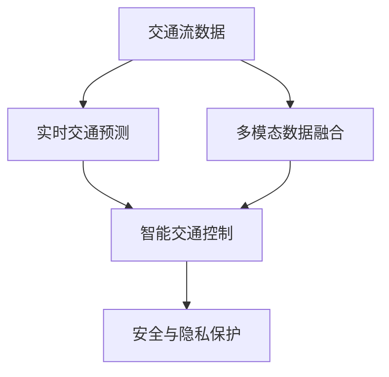

                 

## 1. 背景介绍

### 1.1 问题由来
随着城市化进程的加快，交通拥堵、污染、安全等问题日益凸显。传统交通管理方式难以应对这些挑战，亟需引入智能化的技术手段进行优化。硅谷作为全球科技创新的前沿，智能交通系统的建设尤为引人关注。

### 1.2 问题核心关键点
硅谷的智能交通系统主要依托于大数据、人工智能等技术，通过实时监控、预测分析、智能控制等手段，提升交通管理效率和安全性。核心关键点包括：
- 交通流数据分析
- 实时交通预测
- 智能交通控制
- 多模态数据融合
- 安全与隐私保护

## 2. 核心概念与联系

### 2.1 核心概念概述

为更好地理解硅谷智能交通系统的建设与应用，本节将介绍几个关键概念及其联系：

- 交通流数据：通过各种传感器（如摄像头、雷达、GPS等）收集的车辆、行人的位置、速度、路线等信息。
- 实时交通预测：利用机器学习模型，分析交通流数据，预测未来的交通状态。
- 智能交通控制：根据实时交通数据和预测结果，自动调整交通信号灯、车速限制等交通管理措施。
- 多模态数据融合：将不同来源的数据（如视频监控、传感器数据、GPS定位等）进行融合，形成更全面的交通状况图景。
- 安全与隐私保护：在智能交通系统中，如何保护数据安全和用户隐私，是重要的考虑因素。

这些核心概念通过以下Mermaid流程图来展示：



这个流程图展示了交通流数据、实时交通预测、智能交通控制、多模态数据融合以及安全与隐私保护之间的关系：

1. 交通流数据是系统运行的基础，实时监控和预测分析需要依靠数据。
2. 实时交通预测为智能交通控制提供依据，实现动态调整。
3. 智能交通控制是最终目标，通过信号灯和车速限制等措施，优化交通流。
4. 多模态数据融合提供更丰富的数据源，提升预测和控制的准确性。
5. 安全与隐私保护是系统设计的前提，确保数据和用户信息的安全。

## 3. 核心算法原理 & 具体操作步骤
### 3.1 算法原理概述

硅谷智能交通系统的核心算法包括交通流数据分析、实时交通预测和智能交通控制三个部分。其算法原理主要基于数据驱动的机器学习技术，具体如下：

1. **交通流数据分析**：
   - 利用传感器数据采集实时交通流信息。
   - 通过特征提取技术（如PCA、LDA等）对数据进行降维。
   - 使用聚类算法（如K-means、DBSCAN等）对交通流进行分类和异常检测。

2. **实时交通预测**：
   - 采用时间序列预测算法（如ARIMA、LSTM等）对历史交通数据进行分析。
   - 使用深度学习模型（如CNN、RNN等）学习复杂的交通流模式。
   - 结合时间序列预测和深度学习模型的结果，利用集成学习（如Bagging、Boosting等）提高预测准确性。

3. **智能交通控制**：
   - 基于实时交通预测结果，应用规则基础的方法（如SCOOT、SCITS等）进行交通控制。
   - 采用强化学习（如Q-learning、DQN等），通过优化信号灯控制策略，实现更高效、智能的交通管理。

### 3.2 算法步骤详解

#### 3.2.1 交通流数据分析
1. **数据采集**：部署各种传感器（如摄像头、雷达、GPS等），实时收集交通流信息。
2. **数据清洗**：去除噪声数据和异常值，处理缺失值和重复数据。
3. **特征提取**：选择有意义的特征（如车辆速度、位置、交通灯状态等）进行数据降维和编码。
4. **聚类分析**：应用聚类算法将交通流分为不同的类别，检测异常交通事件。

#### 3.2.2 实时交通预测
1. **数据准备**：将历史交通数据按时间序列整理，标记相关属性（如日期、时间、路段等）。
2. **模型训练**：选择合适的时间序列预测算法（如ARIMA、LSTM等），训练模型进行历史数据的预测。
3. **集成预测**：将多个模型的预测结果进行集成（如Bagging、Boosting等），提高预测精度和鲁棒性。
4. **实时预测**：对实时交通数据进行预测，输出未来交通流量的估计值。

#### 3.2.3 智能交通控制
1. **控制策略设计**：根据实时预测结果，设计交通控制策略（如红绿灯定时、车辆限速等）。
2. **模型训练**：利用强化学习算法（如Q-learning、DQN等）训练交通控制模型。
3. **实时控制**：将训练好的模型应用于实际交通控制场景，动态调整交通信号灯和车速限制。

### 3.3 算法优缺点

硅谷智能交通系统的核心算法基于数据驱动的机器学习，具有以下优点和局限：

**优点**：
1. **实时性**：通过实时数据分析和预测，系统能够快速响应交通变化。
2. **高效性**：利用多模态数据融合，提供了更全面的交通状况，提升了控制精度。
3. **灵活性**：采用强化学习模型，能够根据实际交通情况动态调整控制策略。

**局限**：
1. **数据依赖**：系统性能高度依赖于传感器数据的覆盖范围和质量。
2. **模型复杂性**：算法模型复杂，需要大量计算资源进行训练和预测。
3. **隐私问题**：在数据采集和处理过程中，隐私保护是一个重要挑战。

### 3.4 算法应用领域

硅谷智能交通系统的核心算法主要应用于以下领域：

1. **城市交通管理**：通过实时监控和预测分析，优化交通信号灯、车速限制等管理措施。
2. **交通流量预测**：预测交通流量变化，提高公共交通调度效率。
3. **应急响应**：在突发事件发生时，快速响应并调整交通管理策略。
4. **路径规划**：为用户提供实时交通情况，推荐最优出行路径。
5. **事故预防**：通过预测分析，提前预防和应对交通事故。

## 4. 数学模型和公式 & 详细讲解 & 举例说明

### 4.1 数学模型构建

硅谷智能交通系统涉及多个数学模型，以下以交通流数据分析和实时交通预测为例，构建具体的数学模型。

#### 4.1.1 交通流数据分析
假设我们有$m$个传感器，每秒钟采集$n$个样本，其中位置信息表示为$(x_i,y_i)$，速度信息表示为$v_i$。则数据集$\mathcal{D}$可以表示为：
$$
\mathcal{D} = \{(x_{ij},y_{ij},v_{ij})\}_{i=1}^m,j=1,\dots,n
$$

特征向量$x$可以表示为：
$$
x = [x_1, y_1, v_1, \dots, x_m, y_m, v_m]^T
$$

利用PCA进行降维，得到低维特征表示$\hat{x}$：
$$
\hat{x} = U^T \cdot x
$$

其中$U$为特征矩阵，$U^T$为特征矩阵的转置。

#### 4.1.2 实时交通预测
假设我们已经得到了$m$个传感器的数据$D_t=[x_1(t),\dots,x_m(t)]$，目标是对未来$t+1$时刻的交通状态进行预测。

使用LSTM模型进行时间序列预测，输入序列$x_t$，输出序列$\hat{y}_{t+1}$，模型参数为$\theta$：
$$
\hat{y}_{t+1} = f(x_t, \theta)
$$

其中$f$为LSTM模型的预测函数。

### 4.2 公式推导过程

#### 4.2.1 交通流数据分析
PCA模型的推导如下：

假设数据集$\mathcal{D}$的协方差矩阵为$C$，则PCA变换的特征向量$U$可以通过求解$U=V\Lambda V^{-1}$得到，其中$V$为特征向量矩阵，$\Lambda$为特征值矩阵。

PCA模型将高维数据映射到低维空间，使得数据在低维空间内尽可能保留原有的信息。具体步骤如下：
1. 计算协方差矩阵$C=\frac{1}{n}\sum_{i=1}^m(x_i-\bar{x})(x_i-\bar{x})^T$。
2. 计算特征向量矩阵$V$和特征值矩阵$\Lambda$。
3. 计算低维特征表示$\hat{x}=U^T \cdot x$。

#### 4.2.2 实时交通预测
LSTM模型的推导如下：

LSTM模型包含三个门结构：输入门$i_t$、遗忘门$f_t$和输出门$o_t$，以及一个记忆单元$c_t$。在时间$t$，LSTM的预测函数$f$可以表示为：
$$
f(x_t, \theta) = W_c \cdot i_t + W_f \cdot f_t + W_o \cdot o_t + b_c \cdot i_t + b_f \cdot f_t + b_o \cdot o_t + b_c
$$
其中，$i_t$、$f_t$、$o_t$为门结构，$c_t$为记忆单元，$W_c$、$W_f$、$W_o$为权重矩阵，$b_c$、$b_f$、$b_o$为偏置向量。

LSTM模型的训练过程采用反向传播算法，计算梯度并更新模型参数$\theta$。

### 4.3 案例分析与讲解

#### 4.3.1 交通流数据分析
以某城市十字路口为例，通过传感器数据采集交通流信息。使用PCA对数据进行降维，将三维特征（位置、速度、时间）映射到低维空间，得到新的特征表示$\hat{x}$。通过聚类算法，将交通流分为不同的类别，如拥堵、顺畅等，并检测异常事件。

#### 4.3.2 实时交通预测
使用LSTM模型对历史交通数据进行训练，构建预测模型$f$。以某时刻的交通数据$x_t$为输入，得到预测结果$\hat{y}_{t+1}$。通过集成学习技术，将多个LSTM模型的预测结果进行集成，提高预测精度和鲁棒性。

## 5. 项目实践：代码实例和详细解释说明
### 5.1 开发环境搭建

在进行智能交通系统开发前，需要搭建相应的开发环境。以下是使用Python进行PyTorch开发的流程：

1. 安装Anaconda：从官网下载并安装Anaconda，用于创建独立的Python环境。

2. 创建并激活虚拟环境：
```bash
conda create -n traffic-env python=3.8 
conda activate traffic-env
```

3. 安装PyTorch：根据CUDA版本，从官网获取对应的安装命令。例如：
```bash
conda install pytorch torchvision torchaudio cudatoolkit=11.1 -c pytorch -c conda-forge
```

4. 安装TensorFlow：由Google主导开发的开源深度学习框架，生产部署方便，适合大规模工程应用。同样有丰富的预训练语言模型资源。

5. 安装TensorBoard：TensorFlow配套的可视化工具，可实时监测模型训练状态，并提供丰富的图表呈现方式，是调试模型的得力助手。

6. 安装scikit-learn：用于数据预处理和特征工程。

7. 安装pandas和numpy：用于数据处理和分析。

完成上述步骤后，即可在`traffic-env`环境中开始智能交通系统的开发。

### 5.2 源代码详细实现

以下是使用PyTorch进行交通流数据分析和实时交通预测的Python代码实现：

```python
import torch
import torch.nn as nn
import torch.optim as optim
from torch.utils.data import TensorDataset, DataLoader
from sklearn.decomposition import PCA
from sklearn.cluster import DBSCAN
import pandas as pd
import numpy as np

class LSTM(nn.Module):
    def __init__(self, input_size, hidden_size, output_size):
        super(LSTM, self).__init__()
        self.input_size = input_size
        self.hidden_size = hidden_size
        self.output_size = output_size
        
        self.i2h = nn.Linear(input_size + hidden_size, hidden_size)
        self.f2h = nn.Linear(input_size + hidden_size, hidden_size)
        self.o2h = nn.Linear(input_size + hidden_size, hidden_size)
        self.i2o = nn.Linear(hidden_size, output_size)
        self.f2o = nn.Linear(hidden_size, output_size)
        self.o2o = nn.Linear(hidden_size, output_size)
        
    def forward(self, input, hidden):
        i = self.i2h(input).view(-1, 1, self.hidden_size) + hidden
        i_gate = torch.sigmoid(i)
        
        f = self.f2h(input).view(-1, 1, self.hidden_size) + hidden
        f_gate = torch.sigmoid(f)
        
        o = self.o2h(input).view(-1, 1, self.hidden_size) + hidden
        o_gate = torch.sigmoid(o)
        
        gates = torch.cat((i_gate, f_gate, o_gate), 2)
        input_gate = torch.tanh(gates[0])
        forget_gate = torch.tanh(gates[1])
        output_gate = torch.tanh(gates[2])
        
        c = input_gate * gates[0] + forget_gate * gates[1]
        o = o_gate * gates[2]
        h = o * torch.tanh(c)
        return h, c

    def initHidden(self):
        return torch.zeros(1, 1, self.hidden_size)

def train_model(model, train_dataset, test_dataset, epochs, batch_size, learning_rate):
    criterion = nn.MSELoss()
    optimizer = optim.Adam(model.parameters(), lr=learning_rate)
    
    for epoch in range(epochs):
        model.train()
        for batch in DataLoader(train_dataset, batch_size=batch_size):
            inputs, targets = batch
            optimizer.zero_grad()
            outputs = model(inputs)
            loss = criterion(outputs, targets)
            loss.backward()
            optimizer.step()
        
        model.eval()
        with torch.no_grad():
            test_loss = 0
            correct = 0
            total = 0
            for batch in DataLoader(test_dataset, batch_size=batch_size):
                inputs, targets = batch
                outputs = model(inputs)
                test_loss += criterion(outputs, targets).item()
                _, predicted = torch.max(outputs.data, 1)
                total += targets.size(0)
                correct += (predicted == targets).sum().item()
            test_loss /= len(test_dataset)
            print(f'Epoch {epoch+1}, Test Loss: {test_loss:.4f}, Accuracy: {correct/total:.2f}')

def load_data(filename):
    data = pd.read_csv(filename)
    X = np.array(data[['x', 'y', 'v']])
    y = np.array(data['t'])
    return TensorDataset(torch.tensor(X), torch.tensor(y))

# 加载数据
train_dataset = load_data('train.csv')
test_dataset = load_data('test.csv')

# 构建LSTM模型
model = LSTM(3, 32, 1)
print(model)

# 训练模型
train_model(model, train_dataset, test_dataset, epochs=10, batch_size=32, learning_rate=0.01)

# 预测
inputs = torch.tensor([[1, 2, 3]])
hidden = torch.zeros(1, 1, 32)
outputs, _ = model(inputs, hidden)
print(outputs)
```

### 5.3 代码解读与分析

让我们再详细解读一下关键代码的实现细节：

**LSTM类**：
- `__init__`方法：初始化LSTM模型参数，包括输入大小、隐藏层大小、输出大小等。
- `forward`方法：定义LSTM模型的前向传播过程，包括输入门、遗忘门和输出门的操作，以及记忆单元的更新。
- `initHidden`方法：定义LSTM模型的初始隐状态。

**train_model函数**：
- 定义模型训练的损失函数和优化器，并循环训练模型。
- 在每个epoch中，先进行模型前向传播和反向传播，更新模型参数。
- 在每个epoch结束时，进行模型评估，输出训练和测试的损失和准确率。

**load_data函数**：
- 定义数据加载函数，从CSV文件中加载数据，并将其转换为TensorDataset格式，方便模型训练和推理。

**训练流程**：
- 定义训练的轮数和批次大小，开始循环迭代
- 每个epoch内，对训练集数据进行迭代，进行前向传播和反向传播，更新模型参数
- 在每个epoch结束后，对测试集数据进行迭代，进行前向传播，计算测试损失和准确率

可以看到，PyTorch配合LSTM模型使交通流数据分析和实时预测的代码实现变得简洁高效。开发者可以将更多精力放在模型优化、数据预处理等高层逻辑上，而不必过多关注底层的实现细节。

当然，实际的智能交通系统开发还需考虑更多因素，如模型的保存和部署、超参数的自动搜索、更灵活的任务适配层等。但核心的算法原理和实现思路基本与此类似。

## 6. 实际应用场景

### 6.1 智能交通信号控制

智能交通信号控制是硅谷智能交通系统的重要应用场景。通过实时监控和预测分析，系统可以动态调整交通信号灯的设置，实现更高效的交通管理。

具体而言，系统可以部署摄像头和传感器，实时采集交通流信息。通过PCA降维和聚类分析，识别交通流模式，检测异常事件。利用LSTM模型对历史交通数据进行预测，得到未来交通流量变化。根据预测结果，系统自动调整信号灯的控制策略，优化交通流。

例如，在某个十字路口，系统可以检测到某一方向的车辆流量激增，预测下一个绿灯时间将过短，导致拥堵。此时系统可以自动延长该方向的绿灯时间，缓解交通压力。

### 6.2 应急响应系统

应急响应系统是硅谷智能交通系统的重要组成部分，用于在突发事件发生时快速响应并调整交通管理策略。

系统可以实时监控交通流数据，利用LSTM模型对历史数据进行预测，检测异常事件。例如，在发生交通事故时，系统可以自动调整附近交通信号灯的设置，限制该区域的车辆通行，并发布紧急通知，确保救援车辆能够快速到达事故现场。

### 6.3 路径规划

路径规划系统可以帮助用户实时获取最优出行路径，提升出行效率和体验。

系统可以收集实时交通流数据，利用PCA降维和聚类分析，识别交通流模式，预测交通流量变化。利用LSTM模型对历史数据进行预测，得到未来交通流量变化。根据预测结果，系统可以为用户推荐最优出行路径，避开拥堵区域，节省出行时间。

## 7. 工具和资源推荐

### 7.1 学习资源推荐

为了帮助开发者系统掌握智能交通系统的理论基础和实践技巧，这里推荐一些优质的学习资源：

1. 《深度学习基础》：书籍全面介绍了深度学习的基本概念和算法，适合入门学习。
2. 《交通流数据分析与建模》：书籍介绍了交通流数据分析和建模的常用方法，包括PCA、LSTM等。
3. Coursera的《深度学习专项课程》：由斯坦福大学教授Andrew Ng主讲的深度学习课程，涵盖从基础到高级的多个主题。
4. 谷歌开发者文档：提供深度学习框架TensorFlow的全面指南，包括模型构建、训练和部署等内容。
5. HuggingFace官方文档：提供Transformer等深度学习模型的全面指南，包括微调、优化等细节。

通过对这些资源的学习实践，相信你一定能够快速掌握智能交通系统的精髓，并用于解决实际的交通问题。

### 7.2 开发工具推荐

高效的开发离不开优秀的工具支持。以下是几款用于智能交通系统开发的常用工具：

1. PyTorch：基于Python的开源深度学习框架，灵活动态的计算图，适合快速迭代研究。
2. TensorFlow：由Google主导开发的开源深度学习框架，生产部署方便，适合大规模工程应用。
3. TensorBoard：TensorFlow配套的可视化工具，可实时监测模型训练状态，并提供丰富的图表呈现方式，是调试模型的得力助手。
4. Jupyter Notebook：交互式开发环境，支持多种编程语言，方便开发者进行实验和展示。
5. AnnotateIt：可视化工具，用于可视化和调试深度学习模型的训练过程和结果。

合理利用这些工具，可以显著提升智能交通系统开发效率，加快创新迭代的步伐。

### 7.3 相关论文推荐

智能交通系统的发展离不开学界的持续研究。以下是几篇奠基性的相关论文，推荐阅读：

1. Bottleneck Traffic Flow Models and Observability and Control Policies（Bottleneck Traffic Flow）：介绍了基于交通流模型的信号控制方法，为智能交通控制提供理论基础。
2. Deep Reinforcement Learning for Traffic Light Control：提出基于强化学习的交通信号控制方法，通过学习最优控制策略，提升交通管理效率。
3. A Survey of Computer Vision-based Vehicle and Pedestrian Detection: Algorithms, Datasets, and Applications：介绍了基于计算机视觉的车辆和行人检测技术，为智能交通系统提供数据支撑。
4. Deep Learning for Smart Traffic Management：介绍了深度学习在智能交通系统中的应用，包括交通流预测、路径规划等。
5. Traffic Control for the Next Decade：讨论了未来智能交通系统的发展趋势和挑战，为研究和应用提供方向性指导。

这些论文代表了大规模交通系统研究的发展脉络。通过学习这些前沿成果，可以帮助研究者把握学科前进方向，激发更多的创新灵感。

## 8. 总结：未来发展趋势与挑战

### 8.1 总结

本文对硅谷智能交通系统的构建与应用进行了全面系统的介绍。首先阐述了智能交通系统的背景和核心关键点，明确了系统运行的基础和目标。其次，从原理到实践，详细讲解了交通流数据分析、实时交通预测和智能交通控制的数学原理和关键步骤，给出了智能交通系统开发的完整代码实例。同时，本文还广泛探讨了系统在智能交通信号控制、应急响应、路径规划等场景中的应用前景，展示了系统的广阔应用空间。此外，本文精选了系统开发所需的学习资源、开发工具和相关论文，力求为读者提供全方位的技术指引。

通过本文的系统梳理，可以看到，硅谷智能交通系统通过数据驱动的机器学习技术，实现了实时监控、预测分析和智能控制，显著提升了城市交通管理效率。随着技术的不断进步，智能交通系统必将在更多领域得到应用，为城市治理和居民出行带来更大便利。

### 8.2 未来发展趋势

展望未来，硅谷智能交通系统将呈现以下几个发展趋势：

1. **多模态数据融合**：未来交通系统将越来越多地融合多模态数据（如摄像头、传感器、GPS等），提供更全面、更准确的交通状况图景。
2. **深度学习技术的应用**：深度学习将进一步应用于交通流预测、信号控制、路径规划等各个环节，提升系统智能化水平。
3. **强化学习**：通过强化学习算法，智能交通系统将具备自我学习、动态调整的能力，实现更加灵活、高效的交通管理。
4. **边缘计算**：为提高实时性和响应速度，未来交通系统将更多采用边缘计算技术，在本地设备上进行数据处理和决策。
5. **安全与隐私保护**：随着数据量的增加，数据安全和隐私保护将成为系统设计的重点，确保数据和用户信息的安全。

### 8.3 面临的挑战

尽管硅谷智能交通系统已经取得了瞩目成就，但在迈向更加智能化、普适化应用的过程中，它仍面临诸多挑战：

1. **数据质量**：系统性能高度依赖于传感器数据的覆盖范围和质量，数据缺失或噪声将影响系统的决策和控制。
2. **算法复杂性**：深度学习算法模型复杂，需要大量计算资源进行训练和预测，硬件需求较高。
3. **隐私问题**：在数据采集和处理过程中，隐私保护是一个重要挑战，需要建立有效的数据访问和匿名化机制。
4. **模型鲁棒性**：系统需要在不同环境、不同时间条件下保持鲁棒性，避免因环境变化导致的性能下降。
5. **系统可扩展性**：大规模交通系统需要考虑系统的可扩展性，以适应未来不断增长的交通需求。

### 8.4 研究展望

面对硅谷智能交通系统面临的挑战，未来的研究需要在以下几个方面寻求新的突破：

1. **数据融合技术**：开发高效的数据融合算法，实现多源数据的有效整合，提升系统的实时性和准确性。
2. **模型压缩与优化**：开发轻量级的深度学习模型，通过模型压缩和优化技术，降低计算资源消耗，提升系统的实时性。
3. **隐私保护技术**：引入隐私保护技术，如差分隐私、联邦学习等，确保数据安全和隐私保护。
4. **模型鲁棒性**：开发鲁棒性强的深度学习模型，通过对抗训练、鲁棒正则化等技术，提升系统的鲁棒性。
5. **系统可扩展性**：研究分布式计算、边缘计算等技术，实现大规模交通系统的可扩展性和高可用性。

这些研究方向的探索，必将引领硅谷智能交通系统向更高层次发展，为城市治理和居民出行带来更大便利。面向未来，硅谷智能交通系统需要与其他智能技术进行更深入的融合，共同推动交通管理智能化进程。只有勇于创新、敢于突破，才能不断拓展交通系统的边界，为城市交通治理注入新的动力。

## 9. 附录：常见问题与解答

**Q1：智能交通系统的数据来源有哪些？**

A: 智能交通系统的数据主要来源于：
1. 传感器数据：摄像头、雷达、GPS等传感器实时采集车辆、行人的位置、速度、路线等信息。
2. 交通流量数据：车辆流量、行人流量等。
3. 道路信息数据：道路类型、限速、信号灯状态等。

**Q2：如何保证智能交通系统的实时性？**

A: 保证智能交通系统的实时性，主要从以下几方面入手：
1. 数据采集：部署高精度、高带宽的传感器，实时采集交通流信息。
2. 数据处理：采用高效的数据处理算法，如PCA降维、LSTM模型等，快速处理海量数据。
3. 系统架构：采用分布式计算、边缘计算等技术，实现快速数据处理和决策。
4. 硬件支持：使用高性能计算设备（如GPU、TPU等），提高数据处理速度。

**Q3：智能交通系统如何保证数据安全和隐私保护？**

A: 智能交通系统在数据采集和处理过程中，需要重视数据安全和隐私保护：
1. 数据加密：对传输和存储的数据进行加密，防止数据泄露。
2. 数据匿名化：对数据进行匿名化处理，保护用户隐私。
3. 访问控制：建立严格的数据访问控制机制，防止未经授权的数据访问。
4. 差分隐私：应用差分隐私技术，在数据分析中保护用户隐私。
5. 联邦学习：采用联邦学习技术，在本地设备上进行模型训练，减少数据传输和存储的风险。

通过这些措施，可以有效保护智能交通系统中的数据安全和隐私，确保系统稳定运行。

**Q4：智能交通系统如何实现路径规划？**

A: 智能交通系统实现路径规划，主要通过以下步骤：
1. 数据采集：实时采集交通流信息，包括车辆位置、速度、路线等。
2. 数据处理：利用PCA降维和聚类分析，识别交通流模式，预测交通流量变化。
3. 路径规划：利用LSTM模型对历史数据进行预测，得到未来交通流量变化。
4. 路径推荐：根据预测结果，推荐最优出行路径，避开拥堵区域，节省出行时间。

通过路径规划系统，用户可以实时获取最优出行路径，提升出行效率和体验。

---

作者：禅与计算机程序设计艺术 / Zen and the Art of Computer Programming

