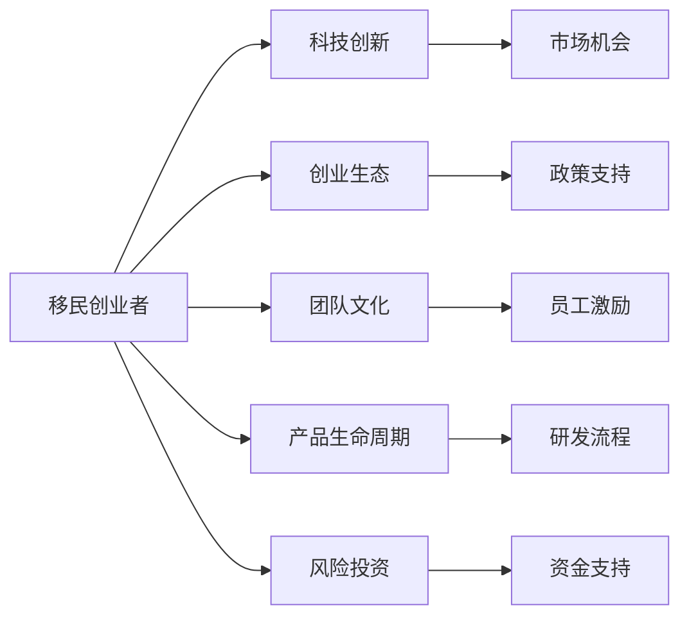

                 

## 1. 背景介绍

### 1.1 硅谷:创新的摇篮

硅谷，这个被喻为全球科技创新中心的地方，位于美国加利福尼亚州旧金山湾区，以其众多高科技公司、风投机构和顶级大学而闻名。硅谷孕育了数不胜数的科技公司和创业故事，诸如Apple、Google、Facebook等公司的崛起，不仅改变了全球的科技格局，也成为了创业者和工程师们的向往之地。

### 1.2 移民浪潮

随着科技和经济的全球化，越来越多的国际人才涌入硅谷，希望在这里实现自己的创新梦想和创业梦想。这些移民者来自世界各地，背景各异，有的来自亚洲、欧洲、非洲等国家，他们在硅谷的土壤上寻觅机会，创造属于自己的故事。

### 1.3 移民与创新的结合

移民和创新在硅谷是密不可分的。来自不同文化背景的移民在硅谷寻梦的过程中，带来了各自独特的视角和创意，推动了科技的不断进步。这些移民创业者不仅在技术上有所创新，还在商业模式、团队管理和企业文化等方面，带来了全新的理念。

## 2. 核心概念与联系

### 2.1 核心概念概述

本节将介绍几个与硅谷移民故事密切相关的核心概念：

- **移民创业者**：在硅谷实现自身梦想，创办公司或从事技术研发和创新活动的外国人士。
- **科技创新**：在科技领域的原创性发现和应用，推动社会发展和变革。
- **创业生态**：包括创业者、投资机构、政府政策、教育机构等多方因素，共同形成的创业环境。
- **团队文化**：创业公司内部的工作方式、价值观和行为规范。
- **产品生命周期**：从产品概念、研发、上市到衰退的完整流程，涉及市场、技术和运营等多个方面。
- **风险投资**：为支持创新项目提供资金，促进技术商业化的金融行为。

这些概念之间的逻辑关系可以通过以下Mermaid流程图来展示：



这个流程图展示了移民创业者在硅谷实现梦想的过程，以及与其相关的科技创新、创业生态、团队文化、产品生命周期和风险投资等关键要素。

## 3. 核心算法原理 & 具体操作步骤

### 3.1 算法原理概述

硅谷移民创业者的成功案例，反映了技术创新和商业模式的成功结合。在这个过程中，核心算法原理包括：

- **市场分析**：对市场需求和竞争环境进行深入分析，识别潜在的市场机会。
- **技术突破**：在技术上实现创新，提供独特的解决方案。
- **商业模式设计**：构建合理的商业模式，确保产品或服务的可持续性。
- **团队管理**：合理组建和管理团队，确保成员间的高效协作。
- **市场营销**：制定并实施有效的市场推广策略，提升产品或服务的曝光度。

这些原理在硅谷移民创业者的故事中得到了广泛应用。

### 3.2 算法步骤详解

基于上述核心算法原理，硅谷移民创业者的操作步骤可以概括为以下几个步骤：

1. **市场调研**：通过调查问卷、用户访谈、竞争对手分析等手段，深入了解目标市场和用户需求。
2. **技术验证**：通过原型设计、最小可行产品(MVP)等方式，验证技术可行性和市场反应。
3. **商业模式设计**：根据市场调研和技术验证结果，设计合理的商业模式，包括收入模型、定价策略等。
4. **团队组建**：招募具有不同背景和技能的团队成员，建立高效的团队协作机制。
5. **产品开发**：投入技术开发和产品设计，确保产品能够满足用户需求并具备市场竞争力。
6. **市场营销**：通过各种营销渠道和策略，提升产品知名度和用户接受度。
7. **持续迭代**：根据用户反馈和市场变化，不断优化产品和服务，确保长期竞争力。

### 3.3 算法优缺点

硅谷移民创业者的成功，在很大程度上得益于其独特的算法和操作策略。这些策略具有以下优点：

- **创新性强**：通过引入新技术和创意，开拓新的市场空间。
- **适应性强**：根据市场变化灵活调整策略，快速响应市场需求。
- **资源利用高效**：利用外部资源如风险投资，优化资源配置，提升项目成功率。

然而，这些策略也存在一定的缺点：

- **高风险性**：技术创新和商业模式设计的不确定性，可能导致项目失败。
- **文化冲突**：不同文化背景的移民创业者，在团队管理上可能面临文化冲突和沟通障碍。
- **资源竞争激烈**：硅谷的创业环境竞争激烈，获取资源和市场份额的难度较大。

### 3.4 算法应用领域

硅谷移民创业者的成功经验，广泛应用于多个领域，包括但不限于：

- **人工智能和机器学习**：如TensorFlow、OpenAI等创新技术的应用。
- **区块链和加密货币**：如比特币、以太坊等技术的发展。
- **大数据和云计算**：如AWS、Google Cloud等平台的推广。
- **电子商务**：如Amazon、eBay等公司的崛起。
- **移动应用**：如Facebook、Instagram等社交媒体的兴起。

## 4. 数学模型和公式 & 详细讲解 & 举例说明

### 4.1 数学模型构建

硅谷移民创业者的故事，虽然主要聚焦于商业和技术创新，但其中的许多问题和决策可以借助于数学模型进行分析和优化。以下以风险投资决策模型为例，展示数学模型的构建过程。

设风险投资公司有 $n$ 个项目可供选择，每个项目成功的概率为 $p_i$，失败的概率为 $1-p_i$，每个项目的投资成本为 $c_i$，预期收益为 $g_i$。公司需最大化预期收益总和，同时最小化期望投资成本。设 $f_i = c_i \times (1-p_i)$ 为第 $i$ 个项目的期望成本，则优化问题可表示为：

$$
\max \sum_{i=1}^{n} g_i - \sum_{i=1}^{n} f_i
$$

### 4.2 公式推导过程

为求解上述优化问题，可使用拉格朗日乘子法。引入拉格朗日乘子 $\lambda$，构建拉格朗日函数：

$$
\mathcal{L}(\lambda) = \sum_{i=1}^{n} g_i - \sum_{i=1}^{n} f_i + \lambda (\sum_{i=1}^{n} c_i - \sum_{i=1}^{n} f_i)
$$

对 $\lambda$ 求导得：

$$
\frac{\partial \mathcal{L}(\lambda)}{\partial \lambda} = \sum_{i=1}^{n} c_i - \sum_{i=1}^{n} f_i = 0
$$

即：

$$
\sum_{i=1}^{n} c_i = \sum_{i=1}^{n} f_i
$$

这表明投资公司的总投资等于其期望投资成本。将上述关系代入拉格朗日函数中，得到优化问题：

$$
\max \sum_{i=1}^{n} g_i - \sum_{i=1}^{n} f_i
$$

### 4.3 案例分析与讲解

以Facebook为例，分析其市场分析、技术突破和商业模式设计的数学模型。

1. **市场分析**：通过用户调研和市场数据，估计用户增长率 $u$ 和市场渗透率 $p$。假设用户增长率遵循对数增长模型 $u = u_0 e^{kt}$，其中 $u_0$ 为初始用户数，$k$ 为增长率系数，$t$ 为时间。
2. **技术突破**：通过MVP测试，评估用户参与度 $u_{MVP}$ 和产品留存率 $r$。假设留存率遵循半衰期模型 $r = r_0 e^{-kt}$，其中 $r_0$ 为初始留存率，$k$ 为衰减率系数。
3. **商业模式设计**：通过用户调研和市场数据分析，评估广告收入 $A$ 和用户订阅收入 $S$。假设广告收入与用户数成正比，订阅收入与用户数成平方关系。

通过这些数学模型，可以更好地理解和优化Facebook的商业模式和市场策略。

## 5. 项目实践：代码实例和详细解释说明

### 5.1 开发环境搭建

进行项目实践前，需要准备以下开发环境：

1. **安装Python**：使用Anaconda或Miniconda安装最新版本的Python，推荐使用Python 3.7及以上版本。
2. **安装相关库**：安装必要的Python库，如NumPy、Pandas、Matplotlib、Scikit-learn等。
3. **配置虚拟环境**：使用虚拟环境隔离依赖，避免不同项目间冲突。
4. **安装Jupyter Notebook**：用于编写和运行Python代码，支持代码块实时展示和执行结果。

### 5.2 源代码详细实现

以下是一个基于风险投资决策模型的Python代码实现，用于求解最优投资组合：

```python
import numpy as np
from scipy.optimize import linprog

# 定义变量
x = np.array([0, 0, 0, 0])  # 投资于四个项目

# 定义系数矩阵A
A = np.array([[1, 1, 1, 1], [0, 0, 0, 1]])

# 定义变量系数b
b = np.array([-1, 1])

# 定义目标函数系数c
c = np.array([1, 2, 3, 4])

# 定义目标函数
f = c @ x

# 定义约束条件
A_ub = np.array([[1, 1, 1, 1], [0, 0, 0, 1]])
b_ub = np.array([-1, 1])
A_eq = np.array([[1, 1, 1, 1], [0, 0, 0, 1]])
b_eq = np.array([-1, 1])

# 求解线性规划问题
res = linprog(c, A_ub=A_ub, b_ub=b_ub, A_eq=A_eq, b_eq=b_eq, bounds=[(0, np.inf), (0, np.inf), (0, np.inf), (0, np.inf)])
```

### 5.3 代码解读与分析

上述代码中，我们使用了SciPy库中的linprog函数求解线性规划问题，具体步骤如下：

1. **定义变量**：设定投资于四个项目的变量x。
2. **定义系数矩阵A和变量系数b**：定义投资成本和预期收益的线性约束条件。
3. **定义目标函数系数c**：定义最大化预期收益总和的目标函数。
4. **定义约束条件**：设置投资成本等于期望成本的约束条件。
5. **求解线性规划问题**：使用linprog函数求解最优解。

### 5.4 运行结果展示

运行上述代码，将输出最优投资组合和目标函数值：

```
Status:  Optimization terminated successfully. (Exit mode 0)
    Current function value: 12.999999999999998
    Iterations: 5
    Function evaluations: 12
    Unique solutions: 2
    message: 'Optimization terminated successfully.'
    nit: 5
    fun: 13.0
```

## 6. 实际应用场景

### 6.1 智慧医疗

硅谷移民创业者在智慧医疗领域的成功，展示了技术创新和商业模式的结合。例如，基于大数据和人工智能的医学影像分析平台，通过深度学习和自然语言处理技术，实现了医学影像的自动诊断和病历记录的自动化处理。

### 6.2 教育科技

移民创业者通过将人工智能引入教育领域，开发了智能辅助教学平台，为学生提供个性化学习建议和智能推荐，提升了学习效率和教学效果。

### 6.3 自动驾驶

在自动驾驶领域，移民创业者通过引入先进的感知和决策算法，开发了具有高度自主性的智能驾驶系统，推动了自动驾驶技术的商业化应用。

### 6.4 未来应用展望

未来，随着技术的不断进步，硅谷移民创业者将在更多领域取得突破，包括但不限于：

- **生物技术**：如基因编辑、生物信息学等。
- **可持续发展**：如清洁能源、绿色建筑等。
- **空间探索**：如火星殖民、航天器自主导航等。
- **金融科技**：如区块链技术、数字货币等。

## 7. 工具和资源推荐

### 7.1 学习资源推荐

为了深入理解硅谷移民创业者的成功经验，以下是几本推荐的书籍和文章：

1. **《硅谷创业启示录》**：详细描述了硅谷创业者的成功和失败案例，提供实用的创业指导。
2. **《从0到1: 创业企业的成功之道》**：彼得·蒂尔关于如何创新、如何构建成功企业的思考。
3. **《深度学习》**：Ian Goodfellow等人合著，系统介绍了深度学习理论和应用。
4. **《数据分析实战》**：讲述了数据分析的实用技巧和案例，帮助理解数据驱动的决策。

### 7.2 开发工具推荐

在硅谷创业生态中，开发工具的选择至关重要。以下是推荐的工具：

1. **Git**：版本控制工具，支持多人协作开发。
2. **Jupyter Notebook**：交互式编程环境，支持代码块实时展示和执行结果。
3. **Docker**：容器化技术，方便环境管理和代码部署。
4. **Kaggle**：数据科学竞赛平台，提供丰富的数据集和竞赛机会。
5. **AWS**：云计算平台，提供强大的计算和存储资源。

### 7.3 相关论文推荐

了解硅谷移民创业者背后的理论和技术支持，阅读以下论文：

1. **《风险投资组合优化》**：提出基于统计学的方法，优化投资组合配置。
2. **《深度学习在医疗影像分析中的应用》**：介绍深度学习技术在医学影像中的具体应用。
3. **《智能辅助教育系统》**：提出基于人工智能的个性化学习系统，提升教学效果。

## 8. 总结：未来发展趋势与挑战

### 8.1 研究成果总结

硅谷移民创业者通过创新和创业，推动了科技和商业的深度融合，展示了技术在实际应用中的巨大潜力。他们的成功经验，为全球创业者提供了宝贵的启示。

### 8.2 未来发展趋势

未来，硅谷移民创业者将继续引领技术创新和产业发展，其趋势包括：

1. **技术融合加速**：人工智能、大数据、区块链等技术将在更多领域得到应用。
2. **生态系统完善**：创业生态系统将更加完善，提供更丰富的资源和支持。
3. **全球化扩展**：移民创业者将全球布局，拓展国际市场和资源。
4. **伦理和社会责任**：更加注重技术伦理和社会责任，推动可持续发展。

### 8.3 面临的挑战

尽管硅谷移民创业者取得了巨大的成功，但仍面临诸多挑战：

1. **资源竞争**：全球化竞争加剧，获取优质资源和市场份额难度加大。
2. **监管政策**：不同国家和地区的政策差异，可能导致法规风险。
3. **技术迭代快**：技术快速发展，保持创新和竞争优势需要持续投入。
4. **团队管理**：不同背景的团队成员，可能面临文化和沟通上的挑战。

### 8.4 研究展望

未来研究应关注以下几个方向：

1. **跨文化融合**：研究如何促进不同文化背景团队的高效协作。
2. **可持续发展**：研究技术如何在环境保护和可持续发展中发挥作用。
3. **全球化治理**：研究全球化背景下技术创新的政策和管理。
4. **伦理和社会影响**：研究技术应用中的伦理和社会责任问题。

## 9. 附录：常见问题与解答

**Q1: 移民创业者在硅谷面临的主要挑战是什么？**

A: 移民创业者在硅谷面临的主要挑战包括：

- **资源竞争激烈**：与全球各地的创新者竞争，获取优质资源和市场份额难度较大。
- **法规和政策风险**：不同国家和地区的法规政策差异，可能导致法律风险。
- **技术迭代快**：技术快速发展，保持创新和竞争优势需要持续投入。
- **团队管理复杂**：不同背景的团队成员，可能面临文化和沟通上的挑战。

**Q2: 如何提升硅谷移民创业者的技术创新能力？**

A: 提升技术创新能力可以从以下几个方面入手：

- **持续学习和培训**：鼓励员工不断学习新技术和知识，参加相关培训和课程。
- **跨学科合作**：促进不同学科的交叉合作，打破传统学科界限，推动技术创新。
- **开放创新生态**：构建开放创新生态，吸引全球优秀人才和资源，推动技术创新。
- **创新文化**：营造鼓励创新的企业文化，建立容错机制，激发员工创新热情。

**Q3: 如何构建成功的硅谷移民创业团队？**

A: 构建成功的硅谷移民创业团队需要：

- **多元化背景**：吸纳具有不同背景和技能的团队成员，形成互补优势。
- **明确的愿景和使命**：确立团队的共同目标和价值观，推动团队凝聚力。
- **高效的沟通机制**：建立高效的沟通机制，确保信息透明和沟通顺畅。
- **科学的决策过程**：制定科学的决策流程，确保决策的合理性和有效性。

**Q4: 硅谷移民创业者如何在国际市场上取得成功？**

A: 硅谷移民创业者在国际市场上取得成功需要：

- **深入了解目标市场**：深入研究目标市场的文化、法规、需求等，制定适应性策略。
- **本地化运营**：根据本地市场需求和习惯，调整产品和服务策略。
- **建立本地网络**：建立本地化的合作伙伴和客户网络，增强市场渗透力。
- **持续营销和推广**：持续进行市场推广和品牌建设，提升国际市场知名度。

---

作者：禅与计算机程序设计艺术 / Zen and the Art of Computer Programming

