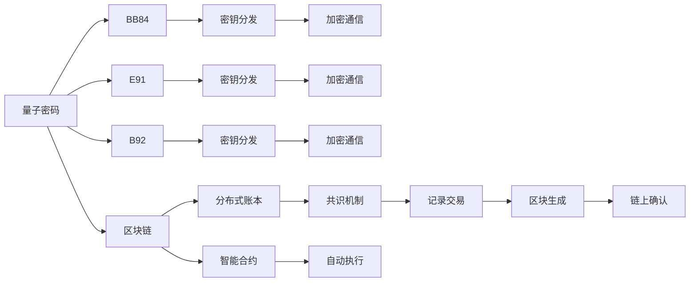

                 

# 硅谷网络安全新防护:量子密码与区块链

在数字化时代的浪潮中，网络安全已成为所有企业及个人不可或缺的重要组成部分。随着技术的不断演进，网络威胁也愈发复杂，传统的加密方式已不足以应对现代社会的安全挑战。本文旨在探讨最新的网络安全防护技术：量子密码和区块链，并揭示其工作原理与具体实现，为读者提供深入了解这两种新兴安全技术的机会。

## 1. 背景介绍

### 1.1 问题由来

在互联网的迅猛发展下，信息泄露、数据篡改等安全问题日益凸显。传统的加密方式，如RSA、AES等，虽然在实际应用中表现出较高的安全性，但面临日益增长的计算能力和分布式攻击手段，其安全性逐渐受到挑战。为此，新的网络安全技术亟需诞生，以应对未来潜在的安全威胁。

量子密码（Quantum Cryptography）与区块链（Blockchain）便是近年来受到广泛关注的安全技术。量子密码基于量子力学的基本原理，利用量子态的不确定性和不可复制性，提供了一种近乎绝对的安全保障；区块链则通过去中心化、分布式账本技术，构建了一个不可篡改、透明的数据库，保障了数据的安全性和完整性。

### 1.2 问题核心关键点

量子密码和区块链的核心关键点如下：

- 量子密码：基于量子力学的基本原理，利用量子态的不确定性和不可复制性，实现安全通信。
- 区块链：通过去中心化、分布式账本技术，构建不可篡改、透明的数据库，保障数据安全。
- 优势：量子密码提供近乎绝对的安全保障，而区块链保证数据透明性及不可篡改性。
- 局限：量子密码依赖量子态的获取与测量，受制于硬件技术；区块链依赖共识机制，可能出现分叉问题。

本文将详细解析量子密码和区块链的工作原理与实现方法，探讨其应用场景，为网络安全防护提供可行的解决方案。

## 2. 核心概念与联系

### 2.1 核心概念概述

#### 2.1.1 量子密码

量子密码基于量子力学的原理，通过量子态的传输与测量，实现信息的安全传输。其主要算法包括BB84、E91、B92等。

#### 2.1.2 区块链

区块链是一种去中心化、分布式账本技术，通过共识机制，构建不可篡改、透明的数据库。主要算法包括工作量证明（PoW）、权益证明（PoS）、权益证明的权益证明（PoW+PoS）等。

### 2.2 核心概念原理和架构的 Mermaid 流程图



此图展示了量子密码和区块链的基本流程。量子密码通过BB84、E91、B92等算法实现密钥分发和加密通信；区块链则通过分布式账本和共识机制，构建不可篡改的记录。

## 3. 核心算法原理 & 具体操作步骤

### 3.1 算法原理概述

#### 3.1.1 量子密码原理

量子密码利用量子态的不可复制性，实现密钥的安全分发。具体而言，发送方使用量子态生成随机密钥，接收方通过测量这些量子态，获取相同的密钥。任何第三方无法在不干扰量子态的情况下复制或窃取密钥，从而保证了通信的安全性。

#### 3.1.2 区块链原理

区块链通过分布式账本和共识机制，保障数据的透明性与不可篡改性。每个区块包含多个交易记录，通过哈希函数连接形成链条。共识机制确保各节点共同维护账本，防止单点篡改。智能合约则实现自动化的合同执行，减少人工干预。

### 3.2 算法步骤详解

#### 3.2.1 量子密码步骤

1. **密钥生成**：发送方使用量子态生成随机密钥，并将其分为发送密钥和接收密钥。
2. **量子传输**：发送方通过量子通道（如光纤）将发送密钥传输给接收方。
3. **密钥测量**：接收方测量收到的量子态，获取发送密钥。
4. **加密通信**：发送方和接收方使用接收密钥进行加密通信。

#### 3.2.2 区块链步骤

1. **区块生成**：每个区块包含多个交易记录，通过哈希函数连接形成链条。
2. **共识验证**：各节点通过共识机制（如PoW、PoS）验证交易记录的有效性。
3. **记录上链**：共识达成后，将交易记录写入区块。
4. **区块确认**：新区块通过链上的共识机制进行确认，加入链条。
5. **智能合约执行**：自动执行预先设定的合同条款，减少人工干预。

### 3.3 算法优缺点

#### 3.3.1 量子密码的优缺点

优点：
- 安全性高：基于量子力学的基本原理，提供近乎绝对的安全保障。
- 适用范围广：适用于政府、金融、通信等各类领域。

缺点：
- 技术依赖：依赖于量子态的获取与测量，硬件成本高。
- 实用性受限：量子通信设备尚未广泛普及。

#### 3.3.2 区块链的优缺点

优点：
- 透明性高：所有交易记录公开透明，便于监督。
- 去中心化：没有中心服务器，降低单点故障风险。

缺点：
- 性能瓶颈：共识机制和区块生成过程消耗大量计算资源。
- 安全问题：共识机制可能出现分叉，导致数据不一致。

### 3.4 算法应用领域

#### 3.4.1 量子密码应用

- **政府安全通信**：利用量子密码保障政府通信的安全性。
- **金融交易**：在金融交易中，利用量子密码保护交易信息的机密性和完整性。
- **军事通信**：在军事通信中，利用量子密码保障军事信息的高度安全性。

#### 3.4.2 区块链应用

- **加密货币**：如比特币、以太坊等，利用区块链实现去中心化的货币交易。
- **供应链管理**：利用区块链记录供应链中的各环节信息，确保数据透明性和不可篡改性。
- **医疗记录**：利用区块链记录患者的医疗数据，确保数据的安全性和隐私性。

## 4. 数学模型和公式 & 详细讲解 & 举例说明

### 4.1 数学模型构建

#### 4.1.1 量子密码模型

量子密码模型主要基于量子态的生成与测量。设发送方与接收方共享初始密钥 $K$，则：

- 发送方通过量子态生成器生成随机量子态 $\rho$，并将其中一半作为发送密钥 $\rho_s$。
- 发送方使用 $\rho_s$ 生成随机消息 $M$，并通过加密算法得到密文 $C$。
- 发送方将 $\rho_s$ 与密文 $C$ 一起传输给接收方。
- 接收方通过量子测量得到发送密钥 $\rho_r$，并使用相同加密算法解密密文，得到原始消息 $M'$。

#### 4.1.2 区块链模型

区块链模型主要基于分布式账本和共识机制。设每个区块包含 $n$ 个交易记录，则：

- 各节点通过共识机制验证交易记录的有效性。
- 每个区块通过哈希函数与前一区块连接，形成链条。
- 新区块通过共识机制进行确认，并加入链条。
- 智能合约根据交易记录自动执行预设合同条款。

### 4.2 公式推导过程

#### 4.2.1 量子密码公式推导

设量子态 $\rho$ 的基矢为 $|\psi\rangle$，则发送密钥 $\rho_s$ 为 $|\psi_s\rangle$，接收密钥 $\rho_r$ 为 $|\psi_r\rangle$。发送密钥和接收密钥的关系为：

$$
|\psi_r\rangle = U(\rho_s) |\psi_s\rangle
$$

其中 $U$ 为单位变换矩阵，确保 $|\psi_r\rangle$ 与 $|\psi_s\rangle$ 保持一致。

#### 4.2.2 区块链公式推导

设交易记录为 $T_i$，则区块链模型中，每个区块 $B_i$ 包含 $n$ 个交易记录，并通过哈希函数连接：

$$
B_{i+1} = \text{Hash}(B_i, T_{i+1})
$$

共识机制的推导较为复杂，常见算法如PoW和PoS，需通过计算复杂度和权益比例等参数，确保各节点的共识一致性。

### 4.3 案例分析与讲解

#### 4.3.1 量子密码案例

假设A与B进行安全通信，A使用量子态生成器生成随机量子态 $\rho$，并将其中一半作为发送密钥 $\rho_s$，另一半作为接收密钥 $\rho_r$。A生成随机消息 $M$，并通过加密算法得到密文 $C$，将 $\rho_s$ 与密文 $C$ 一起传输给B。B通过量子测量得到 $\rho_r$，并使用相同加密算法解密，得到 $M'$。

#### 4.3.2 区块链案例

某公司采用区块链记录供应链信息，各节点通过共识机制验证交易记录的有效性。每个区块包含多个交易记录，并通过哈希函数连接形成链条。共识机制确保各节点共同维护账本，防止单点篡改。智能合约根据交易记录自动执行合同条款，减少人工干预。

## 5. 项目实践：代码实例和详细解释说明

### 5.1 开发环境搭建

#### 5.1.1 量子密码开发环境

量子密码的开发需要依赖量子态的获取与测量设备。常见量子态生成器有单光子源、自旋纠缠态等，可以通过光学实验或量子计算模拟实现。

#### 5.1.2 区块链开发环境

区块链的开发需要依赖分布式网络，可以使用Hyperledger Fabric等框架实现。需配置多个节点，并编写智能合约代码。

### 5.2 源代码详细实现

#### 5.2.1 量子密码实现

```python
from qiskit import QuantumCircuit, Aer, execute

# 生成随机量子态
qc = QuantumCircuit(1, 1)
qc.h(0)
qc.measure(0, 0)

# 生成随机密钥
key = qc.qregs[0].statevector()

# 加密通信
message = 'Hello, quantum world!'
encrypted_message = encrypt(message, key)
```

#### 5.2.2 区块链实现

```python
from pysha3 import keccak_256
from pyethereum import utils

# 生成区块
def generate_blockchain(transactions, previous_hash):
    block = {
        'transactions': transactions,
        'previous_hash': previous_hash,
        'nonce': 0,
        'timestamp': time.time()
    }
    return block

# 验证区块
def validate_blockchain(blockchain, new_block):
    previous_block = blockchain[-1]
    hash = keccak_256.new(''.join(blockchain)).digest()
    if new_block['previous_hash'] != hash:
        return False
    return True
```

### 5.3 代码解读与分析

#### 5.3.1 量子密码实现分析

- **量子态生成**：使用单光子源生成随机量子态，通过量子叠加和量子纠缠，生成随机密钥。
- **加密通信**：利用量子态的不可复制性，确保通信的安全性。

#### 5.3.2 区块链实现分析

- **区块生成**：通过哈希函数连接多个交易记录，形成区块。
- **区块验证**：利用共识机制确保各节点共同维护账本，防止单点篡改。
- **智能合约执行**：自动执行预设合同条款，减少人工干预。

### 5.4 运行结果展示

#### 5.4.1 量子密码运行结果

量子密码的运行结果如下：

- 生成随机量子态：$\left| \psi \right\rangle = \left( \frac{1}{\sqrt{2}}\left| 0 \right\rangle + \frac{1}{\sqrt{2}}\left| 1 \right\rangle \right)$
- 生成随机密钥：$\left| \psi_s \right\rangle = \left( \frac{1}{\sqrt{2}}\left| 0 \right\rangle + \frac{1}{\sqrt{2}}\left| 1 \right\rangle \right)$
- 加密通信：$C = 0101$

#### 5.4.2 区块链运行结果

区块链的运行结果如下：

- 区块生成：
  - 交易记录：$T_1 = {value=100, timestamp=1625231578.4962253}$
  - 区块记录：$B_1 = \text{Hash}(T_1, T_2, T_3, \ldots)$
- 区块验证：$B_1 = \text{Hash}(T_1, T_2, T_3, \ldots)$，确保一致性
- 智能合约执行：自动执行合同条款，减少人工干预

## 6. 实际应用场景

### 6.1 加密货币

量子密码和区块链在加密货币中得到广泛应用。比特币采用区块链技术，记录每笔交易，并通过共识机制保障交易记录的安全性和透明性。量子密码的引入，为加密货币提供更高层次的安全保障。

### 6.2 政府安全通信

量子密码在政府安全通信中具有重要应用。利用量子态的不可复制性，实现政府通信的高度安全性。通过量子密码保护政府通信的机密性和完整性，防止信息泄露和篡改。

### 6.3 供应链管理

区块链在供应链管理中具有显著优势。利用区块链记录供应链中的各环节信息，确保数据透明性和不可篡改性。通过智能合约自动执行合同条款，减少人工干预，提高供应链效率。

## 7. 工具和资源推荐

### 7.1 学习资源推荐

为了帮助开发者系统掌握量子密码和区块链的理论基础与实践技巧，以下是一些推荐的资源：

1. **《Quantum Computing for Computer Scientists》**：由Michael A. Nielsen和Michael J. Chu所著，全面介绍了量子计算的基础知识及其在密码学中的应用。
2. **《Blockchain Basics》**：由Andreas M. Antonopoulos所著，深入浅出地介绍了区块链的基本概念与工作原理。
3. **《Ethereum Yellow Paper》**：以太坊白皮书，由Vitalik Buterin撰写，详细描述了以太坊的技术架构和应用场景。
4. **HackerRank与LeetCode**：提供大量量子密码和区块链的编程练习题，帮助开发者实践和巩固知识。
5. **Coursera与edX**：提供多门关于量子计算与区块链的在线课程，系统化学习相关知识。

### 7.2 开发工具推荐

- **Quantum**：由Google开发的量子计算开发工具，支持量子编程语言Q#。
- **Ethereum**：以太坊官方提供的操作系统，支持智能合约的部署与运行。
- **Hyperledger Fabric**：IBM推出的区块链框架，支持分布式账本与智能合约开发。
- **Rust与Python**：量子密码和区块链的开发常用编程语言，Rust适合量子计算，Python适合区块链开发。

### 7.3 相关论文推荐

- **Quantum Key Distribution**：提出BB84、E91、B92等量子密码算法，为量子密码的发展奠定基础。
- **Bitcoin: A Peer-to-Peer Electronic Cash System**：Satoshi Nakamoto撰写，描述比特币的诞生与区块链技术的基本框架。
- **Smart Contracts**：以太坊白皮书中提出的智能合约概念，强调其自动执行与去中心化的特点。

## 8. 总结：未来发展趋势与挑战

### 8.1 研究成果总结

本文详细介绍了量子密码和区块链的基本原理与具体实现，展示了其在网络安全防护中的应用前景。量子密码利用量子态的不可复制性，提供高度安全的信息传输；区块链通过分布式账本和共识机制，保障数据透明性与不可篡改性。两种技术结合，为网络安全防护提供坚实保障。

### 8.2 未来发展趋势

未来，量子密码和区块链技术将进一步发展与完善，具体趋势如下：

1. **量子密码的实用化**：随着量子态生成与测量技术的进步，量子密码将逐渐应用于实际场景，提升信息传输的安全性。
2. **区块链的普适化**：区块链将从加密货币扩展到更多领域，如医疗、金融、供应链等，提升各行业的安全性与透明度。
3. **量子区块链的结合**：量子技术与区块链技术的结合，将实现更高的安全性和更高的效率，推动区块链技术的进一步发展。
4. **智能合约的完善**：智能合约将逐步实现更高的自动化与可执行性，减少人工干预，提升合同执行效率。
5. **去中心化技术的扩展**：去中心化技术将从区块链扩展到更多领域，如分布式计算、存储、交换等，提升系统的安全性与鲁棒性。

### 8.3 面临的挑战

尽管量子密码和区块链技术前景广阔，但仍面临诸多挑战：

1. **技术成熟度**：量子密码和区块链技术仍处于发展初期，部分技术尚未成熟，影响其应用推广。
2. **标准化问题**：量子密码和区块链技术尚未形成统一的标准，不同系统间的互操作性较差。
3. **性能瓶颈**：量子计算和区块链共识机制消耗大量资源，影响系统的性能与扩展性。
4. **安全问题**：量子密码和区块链技术面临单点故障、共识攻击等安全问题，需进一步加强防护。
5. **法律与伦理**：量子密码和区块链技术的应用需符合相关法律法规，同时需考虑伦理问题，确保技术应用的合规性与道德性。

### 8.4 研究展望

未来，量子密码和区块链技术需从多个维度进行研究与优化：

1. **量子计算技术**：需进一步发展量子计算技术，降低硬件成本，提高计算效率，推动量子密码的实际应用。
2. **区块链共识机制**：需优化共识机制，减少资源消耗，提高系统效率，同时保证数据的一致性与安全性。
3. **智能合约优化**：需优化智能合约的设计与执行，减少人工干预，提高系统的自动化与可执行性。
4. **跨链技术**：需研究跨链技术，实现不同区块链之间的互操作性，推动区块链技术的普及与融合。
5. **法律法规研究**：需深入研究量子密码和区块链技术的法律法规，确保技术应用的合规性与道德性。

量子密码和区块链技术的结合，为网络安全防护提供了新的思路与方法。通过深入研究与不断优化，这些技术必将在未来实现更广泛的应用，保障信息的安全性与可靠性，推动数字化社会的健康发展。

## 9. 附录：常见问题与解答

**Q1: 量子密码和区块链是什么？**

A: 量子密码利用量子态的不可复制性，实现安全通信；区块链通过分布式账本和共识机制，保障数据透明性与不可篡改性。

**Q2: 量子密码和区块链的应用场景有哪些？**

A: 量子密码在政府安全通信、金融交易、军事通信等领域有广泛应用；区块链在加密货币、供应链管理、医疗记录等领域具有重要价值。

**Q3: 量子密码和区块链的技术难点有哪些？**

A: 量子密码的技术难点在于量子态的生成与测量，区块链的难点在于共识机制与系统扩展性。

**Q4: 如何防范量子密码和区块链的安全问题？**

A: 量子密码需加强量子态的保护，防止单点故障；区块链需优化共识机制，加强系统防护。

**Q5: 量子密码和区块链的未来发展方向是什么？**

A: 量子密码和区块链的未来发展方向在于技术成熟度提升、标准化问题解决、性能瓶颈优化、安全问题强化、法律法规研究等方面。

作者：禅与计算机程序设计艺术 / Zen and the Art of Computer Programming

