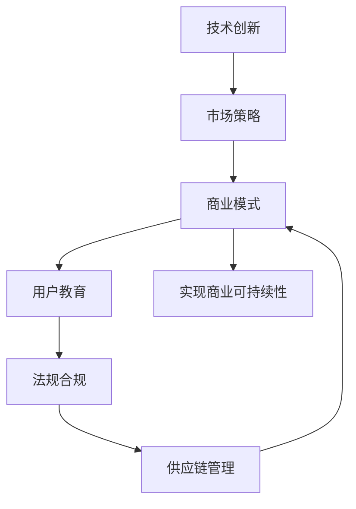

                 

# 硅谷食品科技公司的商业化道路

> 关键词：食品科技, 人工智能, 商业化, 硅谷, 技术创新, 商业模式, 市场应用

## 1. 背景介绍

### 1.1 问题由来
随着人口增长和消费升级，全球食品行业面临严峻挑战：粮食浪费、食品安全、可持续生产、个性化营养等。硅谷作为全球科技创新中心，近年来涌现出一批食品科技初创公司，利用先进的技术手段，力图破解这些问题，为食品行业带来革命性变化。本文将系统介绍硅谷食品科技公司从技术研发到商业化的成功经验，帮助读者理解这一领域的发展趋势和应用价值。

### 1.2 问题核心关键点
食品科技公司商业化面临的核心挑战包括：
- 技术验证：确保产品技术可行且具备竞争优势。
- 市场定位：明确目标市场和用户群体，制定精准的市场策略。
- 商业模型：构建可持续的盈利模式，实现商业可持续性。
- 用户教育：提高消费者对新技术的认知和接受度。
- 法规合规：确保产品符合各项法律法规和食品安全标准。
- 供应链管理：建立高效、安全的供应链体系，保障产品稳定供应。

本文将从技术创新、市场策略、商业模式、用户教育、法规合规和供应链管理等方面，深入剖析硅谷食品科技公司的商业化道路，为读者提供全面的视角和借鉴。

## 2. 核心概念与联系

### 2.1 核心概念概述

硅谷食品科技公司商业化涉及多个核心概念：

- **食品科技(FoodTech)**：运用科技手段优化食品生产、加工、分销和消费的全链条，实现更高效、更安全、更营养的食品解决方案。
- **人工智能(AI)**：包括机器学习、自然语言处理、计算机视觉等技术，用于食品质量检测、营养分析、供应链优化等领域。
- **商业模式(Business Model)**：指食品科技公司的盈利方式，包括直接销售、订阅服务、合作伙伴关系等。
- **市场应用(Market Application)**：指技术在具体食品场景中的应用，如智能农业、健康食品、食品追溯等。

这些概念之间存在密切联系，共同构成硅谷食品科技公司商业化的核心框架。

- **技术创新**：是实现市场应用的基础，通过AI等技术手段，提升食品科技公司产品的科技含量。
- **市场策略**：基于市场需求和技术优势，制定精准的营销和市场推广计划。
- **商业模式**：确保技术应用的经济性和可持续性，实现商业循环。
- **用户教育**：提高消费者对新技术的认知，增加用户粘性和品牌忠诚度。
- **法规合规**：确保产品符合食品安全和环保法规，避免法律风险。
- **供应链管理**：优化供应链体系，保障食品质量和供应链稳定。

### 2.2 核心概念原理和架构的 Mermaid 流程图



这个流程图展示了硅谷食品科技公司商业化过程中各关键概念的相互关联和作用机制。

## 3. 核心算法原理 & 具体操作步骤
### 3.1 算法原理概述

硅谷食品科技公司商业化过程中，涉及的核心算法包括：

- **机器学习算法**：用于食品质量检测、营养分析、供应链优化等，提高生产效率和食品安全。
- **自然语言处理(NLP)**：用于食品知识管理、用户反馈分析等，提升用户体验和互动。
- **计算机视觉**：用于食品识别、图像分析、质量检测等，提高食品品质控制。
- **推荐系统**：用于个性化食品推荐、个性化营养方案等，增加用户粘性。

这些算法通过在食品科技公司的具体应用，实现了技术的商业化价值。

### 3.2 算法步骤详解

硅谷食品科技公司商业化的具体算法步骤如下：

1. **数据收集与预处理**：
   - 收集食品相关的数据，包括种植、加工、消费等各个环节的数据。
   - 清洗和预处理数据，去除噪声和异常值。

2. **模型训练与评估**：
   - 使用机器学习、自然语言处理等算法，训练食品质量检测、营养分析、供应链优化等模型。
   - 在训练集上评估模型性能，通过交叉验证等手段，调整模型参数。

3. **模型部署与应用**：
   - 将训练好的模型部署到实际应用场景中，如智能农业、健康食品、食品追溯等。
   - 收集用户反馈和业务数据，优化模型性能。

4. **业务集成与优化**：
   - 将模型集成到现有业务系统中，实现食品生产、加工、分销和消费的全链条优化。
   - 通过数据分析和业务迭代，不断提升产品和服务质量。

### 3.3 算法优缺点

硅谷食品科技公司商业化的核心算法具有以下优缺点：

**优点**：
- **高效性**：自动化技术能大幅提升生产效率和食品安全，降低人力成本。
- **智能化**：智能算法能提高决策的科学性和准确性，优化供应链和用户体验。
- **可扩展性**：算法和技术平台可快速扩展到不同的食品场景和市场，提高市场竞争力。

**缺点**：
- **数据依赖性**：算法的精度和效果高度依赖数据质量，数据获取和处理成本高。
- **模型复杂性**：大模型和高维数据的处理需要高性能计算资源，对硬件要求高。
- **法规合规**：算法应用需符合各项法律法规，增加合规成本。

### 3.4 算法应用领域

硅谷食品科技公司商业化的核心算法应用于多个领域：

- **智能农业**：利用机器学习和计算机视觉技术，优化种植、灌溉、病虫害防治等农业生产环节。
- **健康食品**：使用营养分析算法，为用户提供个性化的饮食方案和健康食品推荐。
- **食品追溯**：通过区块链和自然语言处理技术，实现食品生产、加工、分销全链条的可追溯性。
- **食品质量检测**：利用机器视觉和深度学习技术，实现食品质量在线检测和自动分拣。
- **供应链优化**：运用推荐系统和智能算法，优化物流和库存管理，降低成本和提高效率。

## 4. 数学模型和公式 & 详细讲解 & 举例说明

### 4.1 数学模型构建

本节将使用数学语言对硅谷食品科技公司商业化过程中的核心算法进行更加严格的刻画。

**食品质量检测模型**：
- 输入：食品图像和描述
- 输出：食品质量评分
- 目标：最小化预测误差

**营养分析模型**：
- 输入：食品成分和营养成分
- 输出：个性化饮食方案
- 目标：最大化用户满意度

**推荐系统模型**：
- 输入：用户历史行为和食品属性
- 输出：个性化食品推荐
- 目标：最大化点击率和用户留存率

### 4.2 公式推导过程

**食品质量检测模型的数学模型**：
- 假设模型为 $M: \mathcal{I} \times \mathcal{D} \rightarrow [0,1]$，其中 $\mathcal{I}$ 为输入空间，$\mathcal{D}$ 为描述空间，$[0,1]$ 为评分空间。
- 定义损失函数 $\mathcal{L}(M) = \frac{1}{N} \sum_{i=1}^N (y_i - M(x_i))^2$
- 通过梯度下降法，最小化损失函数 $\mathcal{L}(M)$

**营养分析模型的数学模型**：
- 假设模型为 $N: \mathcal{F} \rightarrow \mathcal{R}^m$，其中 $\mathcal{F}$ 为食品成分空间，$\mathcal{R}^m$ 为营养方案空间。
- 定义损失函数 $\mathcal{L}(N) = \sum_{i=1}^N \Vert N(x_i) - z_i \Vert^2$
- 通过梯度下降法，最小化损失函数 $\mathcal{L}(N)$

**推荐系统模型的数学模型**：
- 假设模型为 $R: \mathcal{U} \times \mathcal{P} \rightarrow [0,1]$，其中 $\mathcal{U}$ 为用户空间，$\mathcal{P}$ 为产品空间。
- 定义损失函数 $\mathcal{L}(R) = \sum_{(i,j)} L_{ij}(R(u_i, p_j))$
- 通过梯度下降法，最小化损失函数 $\mathcal{L}(R)$

### 4.3 案例分析与讲解

**智能农业案例**：
- 数据收集：收集种植环境数据、作物生长数据、气象数据等。
- 模型训练：使用机器学习算法，预测作物生长周期和病虫害发生概率。
- 模型应用：将模型集成到智能灌溉和病虫害防治系统中，实现自动化管理。

**健康食品案例**：
- 数据收集：收集用户健康数据、饮食偏好等。
- 模型训练：使用营养分析算法，生成个性化饮食方案。
- 模型应用：通过APP推荐健康食品，并根据用户反馈不断优化推荐策略。

**食品追溯案例**：
- 数据收集：记录食品生产、加工、分销全链条的信息。
- 模型训练：使用自然语言处理算法，提取和验证食品信息。
- 模型应用：建立食品追溯系统，提高食品透明度和可追溯性。

## 5. 项目实践：代码实例和详细解释说明

### 5.1 开发环境搭建

在进行项目实践前，我们需要准备好开发环境。以下是使用Python进行深度学习开发的环境配置流程：

1. 安装Anaconda：从官网下载并安装Anaconda，用于创建独立的Python环境。

2. 创建并激活虚拟环境：
```bash
conda create -n pytorch-env python=3.8 
conda activate pytorch-env
```

3. 安装PyTorch：根据CUDA版本，从官网获取对应的安装命令。例如：
```bash
conda install pytorch torchvision torchaudio cudatoolkit=11.1 -c pytorch -c conda-forge
```

4. 安装TensorFlow：由Google主导开发的开源深度学习框架，生产部署方便，适合大规模工程应用。同样有丰富的预训练语言模型资源。

5. 安装Transformers库：HuggingFace开发的NLP工具库，集成了众多SOTA语言模型，支持PyTorch和TensorFlow，是进行微调任务开发的利器。

6. 安装各类工具包：
```bash
pip install numpy pandas scikit-learn matplotlib tqdm jupyter notebook ipython
```

完成上述步骤后，即可在`pytorch-env`环境中开始项目实践。

### 5.2 源代码详细实现

这里我们以健康食品推荐系统为例，给出使用Transformers库对BERT模型进行微调的PyTorch代码实现。

首先，定义推荐系统数据处理函数：

```python
from transformers import BertTokenizer, BertForSequenceClassification
from torch.utils.data import Dataset
import torch

class HealthFoodDataset(Dataset):
    def __init__(self, texts, labels, tokenizer, max_len=128):
        self.texts = texts
        self.labels = labels
        self.tokenizer = tokenizer
        self.max_len = max_len
        
    def __len__(self):
        return len(self.texts)
    
    def __getitem__(self, item):
        text = self.texts[item]
        label = self.labels[item]
        
        encoding = self.tokenizer(text, return_tensors='pt', max_length=self.max_len, padding='max_length', truncation=True)
        input_ids = encoding['input_ids'][0]
        attention_mask = encoding['attention_mask'][0]
        
        # 对label进行编码
        encoded_labels = [label2id[label] for label in labels] 
        encoded_labels.extend([label2id['O']] * (self.max_len - len(encoded_labels)))
        labels = torch.tensor(encoded_labels, dtype=torch.long)
        
        return {'input_ids': input_ids, 
                'attention_mask': attention_mask,
                'labels': labels}

# 标签与id的映射
label2id = {'O': 0, '健康': 1, '高糖': 2, '高脂肪': 3, '高盐': 4, '低脂': 5, '低糖': 6, '低盐': 7}
id2label = {v: k for k, v in label2id.items()}

# 创建dataset
tokenizer = BertTokenizer.from_pretrained('bert-base-cased')

train_dataset = HealthFoodDataset(train_texts, train_labels, tokenizer)
dev_dataset = HealthFoodDataset(dev_texts, dev_labels, tokenizer)
test_dataset = HealthFoodDataset(test_texts, test_labels, tokenizer)
```

然后，定义模型和优化器：

```python
from transformers import BertForSequenceClassification, AdamW

model = BertForSequenceClassification.from_pretrained('bert-base-cased', num_labels=len(label2id))

optimizer = AdamW(model.parameters(), lr=2e-5)
```

接着，定义训练和评估函数：

```python
from torch.utils.data import DataLoader
from tqdm import tqdm
from sklearn.metrics import classification_report

device = torch.device('cuda') if torch.cuda.is_available() else torch.device('cpu')
model.to(device)

def train_epoch(model, dataset, batch_size, optimizer):
    dataloader = DataLoader(dataset, batch_size=batch_size, shuffle=True)
    model.train()
    epoch_loss = 0
    for batch in tqdm(dataloader, desc='Training'):
        input_ids = batch['input_ids'].to(device)
        attention_mask = batch['attention_mask'].to(device)
        labels = batch['labels'].to(device)
        model.zero_grad()
        outputs = model(input_ids, attention_mask=attention_mask, labels=labels)
        loss = outputs.loss
        epoch_loss += loss.item()
        loss.backward()
        optimizer.step()
    return epoch_loss / len(dataloader)

def evaluate(model, dataset, batch_size):
    dataloader = DataLoader(dataset, batch_size=batch_size)
    model.eval()
    preds, labels = [], []
    with torch.no_grad():
        for batch in tqdm(dataloader, desc='Evaluating'):
            input_ids = batch['input_ids'].to(device)
            attention_mask = batch['attention_mask'].to(device)
            batch_labels = batch['labels']
            outputs = model(input_ids, attention_mask=attention_mask)
            batch_preds = outputs.logits.argmax(dim=2).to('cpu').tolist()
            batch_labels = batch_labels.to('cpu').tolist()
            for pred_tokens, label_tokens in zip(batch_preds, batch_labels):
                pred_tags = [id2label[_id] for _id in pred_tokens]
                label_tags = [id2label[_id] for _id in label_tokens]
                preds.append(pred_tags[:len(label_tags)])
                labels.append(label_tags)
                
    print(classification_report(labels, preds))
```

最后，启动训练流程并在测试集上评估：

```python
epochs = 5
batch_size = 16

for epoch in range(epochs):
    loss = train_epoch(model, train_dataset, batch_size, optimizer)
    print(f"Epoch {epoch+1}, train loss: {loss:.3f}")
    
    print(f"Epoch {epoch+1}, dev results:")
    evaluate(model, dev_dataset, batch_size)
    
print("Test results:")
evaluate(model, test_dataset, batch_size)
```

以上就是使用PyTorch对BERT进行健康食品推荐系统微调的完整代码实现。可以看到，得益于Transformers库的强大封装，我们可以用相对简洁的代码完成BERT模型的加载和微调。

### 5.3 代码解读与分析

让我们再详细解读一下关键代码的实现细节：

**HealthFoodDataset类**：
- `__init__`方法：初始化文本、标签、分词器等关键组件。
- `__len__`方法：返回数据集的样本数量。
- `__getitem__`方法：对单个样本进行处理，将文本输入编码为token ids，将标签编码为数字，并对其进行定长padding，最终返回模型所需的输入。

**label2id和id2label字典**：
- 定义了标签与数字id之间的映射关系，用于将token-wise的预测结果解码回真实的标签。

**训练和评估函数**：
- 使用PyTorch的DataLoader对数据集进行批次化加载，供模型训练和推理使用。
- 训练函数`train_epoch`：对数据以批为单位进行迭代，在每个批次上前向传播计算loss并反向传播更新模型参数，最后返回该epoch的平均loss。
- 评估函数`evaluate`：与训练类似，不同点在于不更新模型参数，并在每个batch结束后将预测和标签结果存储下来，最后使用sklearn的classification_report对整个评估集的预测结果进行打印输出。

**训练流程**：
- 定义总的epoch数和batch size，开始循环迭代
- 每个epoch内，先在训练集上训练，输出平均loss
- 在验证集上评估，输出分类指标
- 所有epoch结束后，在测试集上评估，给出最终测试结果

可以看到，PyTorch配合Transformers库使得BERT微调的代码实现变得简洁高效。开发者可以将更多精力放在数据处理、模型改进等高层逻辑上，而不必过多关注底层的实现细节。

当然，工业级的系统实现还需考虑更多因素，如模型的保存和部署、超参数的自动搜索、更灵活的任务适配层等。但核心的微调范式基本与此类似。

## 6. 实际应用场景

### 6.1 智能农业

基于大模型微调的智能农业技术，可以实时监测农作物生长状态，预测病虫害发生概率，优化灌溉和施肥策略。通过机器学习和计算机视觉技术，实现农业生产的智能化、精准化和高效化。

### 6.2 健康食品

微调技术可以应用于健康食品的个性化推荐，用户可以根据自身的健康数据，选择适合自己的饮食方案。通过自然语言处理技术，还可以对食品信息进行语义分析，提升用户体验。

### 6.3 食品追溯

利用区块链和自然语言处理技术，可以实现食品生产、加工、分销全链条的可追溯性。用户可以通过APP实时查询食品的来源、生产日期、质量检测等信息，增强食品安全和信任度。

### 6.4 食品质量检测

通过机器视觉和深度学习技术，可以实现食品质量在线检测和自动分拣。智能检测系统可以自动识别食品缺陷，减少人工检测成本，提高产品质量和生产效率。

### 6.5 供应链优化

运用推荐系统和智能算法，可以优化物流和库存管理，降低成本和提高效率。通过预测需求、优化路线和资源配置，实现食品供应链的智能化管理。

## 7. 工具和资源推荐

### 7.1 学习资源推荐

为了帮助开发者系统掌握食品科技公司商业化的理论基础和实践技巧，这里推荐一些优质的学习资源：

1. **《食品科技与未来农业》**：一本介绍食品科技最新发展和未来趋势的书籍，涵盖智能农业、健康食品、食品追溯等诸多前沿话题。

2. **CS221《人工智能导论》课程**：斯坦福大学开设的AI入门课程，讲解了机器学习、深度学习、自然语言处理等基本概念和前沿算法，适合食品科技公司技术人员的培训。

3. **Coursera《食品科技与营养》课程**：提供食品科技和营养相关的课程，帮助食品科技公司理解相关背景知识和应用场景。

4. **Kaggle食品科技竞赛**：参加Kaggle举办的食品科技竞赛，通过实战演练提升技术水平和创新能力。

通过对这些资源的学习实践，相信你一定能够快速掌握食品科技公司商业化的精髓，并用于解决实际的食品问题。

### 7.2 开发工具推荐

高效的开发离不开优秀的工具支持。以下是几款用于食品科技公司商业化开发的常用工具：

1. **PyTorch**：基于Python的开源深度学习框架，灵活动态的计算图，适合快速迭代研究。大部分预训练语言模型都有PyTorch版本的实现。

2. **TensorFlow**：由Google主导开发的开源深度学习框架，生产部署方便，适合大规模工程应用。同样有丰富的预训练语言模型资源。

3. **Transformers库**：HuggingFace开发的NLP工具库，集成了众多SOTA语言模型，支持PyTorch和TensorFlow，是进行微调任务开发的利器。

4. **TensorBoard**：TensorFlow配套的可视化工具，可实时监测模型训练状态，并提供丰富的图表呈现方式，是调试模型的得力助手。

5. **Weights & Biases**：模型训练的实验跟踪工具，可以记录和可视化模型训练过程中的各项指标，方便对比和调优。与主流深度学习框架无缝集成。

6. **Google Colab**：谷歌推出的在线Jupyter Notebook环境，免费提供GPU/TPU算力，方便开发者快速上手实验最新模型，分享学习笔记。

合理利用这些工具，可以显著提升食品科技公司商业化任务的开发效率，加快创新迭代的步伐。

### 7.3 相关论文推荐

食品科技公司商业化涉及的技术研究主要集中在以下几个方向：

1. **智能农业**：利用机器学习和计算机视觉技术，优化农业生产全链条。相关论文包括《智能农业机器人：现状、挑战与未来》、《基于深度学习的农业智能化生产技术综述》等。

2. **健康食品**：通过营养分析算法，生成个性化饮食方案，提升健康水平。相关论文包括《基于机器学习的个性化饮食推荐系统》、《健康食品的营养分析与推荐》等。

3. **食品追溯**：利用区块链和自然语言处理技术，实现食品全链条的可追溯性。相关论文包括《基于区块链的食品追溯系统》、《食品全链条可追溯性研究》等。

4. **食品质量检测**：通过机器视觉和深度学习技术，实现食品质量在线检测和自动分拣。相关论文包括《深度学习在食品质量检测中的应用》、《基于计算机视觉的食品质量检测技术》等。

5. **供应链优化**：运用推荐系统和智能算法，优化物流和库存管理。相关论文包括《智能供应链管理系统设计》、《基于推荐系统的食品供应链优化》等。

这些论文代表了食品科技公司商业化技术的发展脉络。通过学习这些前沿成果，可以帮助研究者把握学科前进方向，激发更多的创新灵感。

## 8. 总结：未来发展趋势与挑战

### 8.1 总结

本文对硅谷食品科技公司从技术研发到商业化的成功经验进行了全面系统的介绍。首先阐述了食品科技公司商业化面临的技术挑战和市场机会，明确了微调技术在食品科技公司商业化中的核心作用。其次，从技术创新、市场策略、商业模式、用户教育、法规合规和供应链管理等方面，详细讲解了食品科技公司商业化的具体操作流程和关键点。最后，通过实例和分析，展示了微调技术在实际应用场景中的强大功能和潜力。

通过本文的系统梳理，可以看到，硅谷食品科技公司商业化成功经验的核心在于技术创新和市场策略的紧密结合。技术驱动市场，市场反哺技术，二者相辅相成，推动了食品科技公司的发展和壮大。相信随着技术的不断进步和市场需求的不断增长，硅谷食品科技公司将进一步拓展应用场景，实现更广阔的市场前景。

### 8.2 未来发展趋势

展望未来，硅谷食品科技公司商业化将呈现以下几个发展趋势：

1. **技术融合**：结合人工智能、物联网、区块链等技术，实现食品全链条智能化管理。通过多技术融合，提升食品生产、加工、分销和消费的效率和安全性。

2. **个性化定制**：通过深度学习和大数据分析，实现个性化食品推荐、个性化营养方案等，满足用户多样化的需求。

3. **可持续发展**：利用智能算法和数据驱动决策，实现食品生产和消费的可持续性。通过优化资源配置，减少浪费和污染。

4. **全球化布局**：随着食品科技公司的技术成熟和市场需求增加，全球化的商业布局将成为重要方向。通过国际化的市场推广和本地化运营，拓展全球食品市场。

5. **跨界合作**：食品科技公司将与农业、医疗、环保等跨界领域的企业合作，共同推动食品产业的绿色发展。

### 8.3 面临的挑战

尽管硅谷食品科技公司商业化取得了一些成功，但在迈向更加智能化、普适化应用的过程中，它仍面临着诸多挑战：

1. **技术复杂性**：食品科技公司涉及的技术领域广泛，跨学科知识需求高，技术实现难度大。

2. **数据获取困难**：食品科技公司需要大量高质量的食品数据，数据获取和处理成本高，且数据隐私和伦理问题也需要引起重视。

3. **法规合规**：食品科技公司需要符合食品安全和环保法规，增加合规成本和风险。

4. **市场接受度**：消费者对新技术的接受度需要进一步提升，市场推广和教育成本高。

5. **供应链风险**：食品供应链的复杂性和不确定性，增加了供应链管理难度。

6. **资源限制**：食品科技公司需要大量资金和资源支持技术研发和市场推广，资金和资源限制可能成为发展瓶颈。

### 8.4 研究展望

未来，硅谷食品科技公司需要从以下几个方面进行深入研究和探索：

1. **新技术开发**：持续研发和引入新技术，如智能机器人、精准农业等，提升食品生产效率和安全性。

2. **数据治理**：建立数据治理框架，确保数据质量和隐私安全，推动食品科技公司健康发展。

3. **市场推广**：加强市场教育和推广，提高消费者对新技术的认知和接受度，拓展市场空间。

4. **跨界合作**：与不同领域的合作伙伴共同探索创新应用，实现技术协同和市场协同。

5. **可持续发展**：推动食品科技公司实现绿色、低碳、环保的发展目标，为全球食品产业的可持续发展贡献力量。

这些研究方向将为硅谷食品科技公司提供新的发展机遇，推动食品科技公司向更高的目标迈进。相信在政府、企业、学术界的共同努力下，硅谷食品科技公司将进一步拓展应用场景，实现更广阔的市场前景。

## 9. 附录：常见问题与解答

**Q1：食品科技公司如何选择合适的技术平台？**

A: 食品科技公司应根据自身的业务需求和资源状况，选择合适的技术平台。需要考虑平台的性能、易用性、生态系统等因素。例如，对于深度学习任务，可以选择PyTorch、TensorFlow等；对于NLP任务，可以选择HuggingFace的Transformers库等。

**Q2：食品科技公司如何平衡技术创新和市场推广？**

A: 食品科技公司应优先解决市场痛点，进行针对性创新。通过用户反馈和市场调研，确定技术创新的方向和重点。同时，需要制定有效的市场推广策略，提升消费者对新技术的认知和接受度。

**Q3：食品科技公司如何处理数据隐私问题？**

A: 食品科技公司应遵守相关法律法规，保护用户隐私数据。可以通过数据匿名化、差分隐私等技术手段，确保数据隐私安全。同时，需要建立透明的数据使用政策，提升用户信任度。

**Q4：食品科技公司如何应对供应链风险？**

A: 食品科技公司应建立稳健的供应链管理体系，优化供应链流程，减少风险和不确定性。可以通过区块链技术实现供应链透明化，提升供应链的追溯和监管能力。

**Q5：食品科技公司如何实现可持续发展？**

A: 食品科技公司应结合智能化技术，优化资源配置，减少浪费和污染。可以通过数据分析和预测，实现精准生产、精准物流，提升资源利用效率。同时，需要关注环境保护和社会责任，实现绿色发展。

通过这些问题的探讨，相信读者对硅谷食品科技公司的商业化道路有了更清晰的认识。硅谷食品科技公司将持续创新，引领食品行业进入智能化、个性化、可持续发展的未来。

