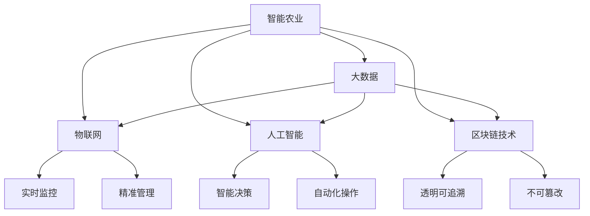

                 

# 硅谷高科技农业:食品安全与可追溯

> 关键词：
  - 智能农业
  - 食品安全
  - 可追溯系统
  - 大数据
  - 物联网(IoT)
  - 人工智能(ML)
  - 区块链技术
  - 自然语言处理(NLP)
  - 机器学习
  - 边缘计算

## 1. 背景介绍

### 1.1 问题由来

近年来，随着全球人口的增长和城市化进程的加快，农业面临着巨大的压力。如何提高农业生产效率，确保食品安全，成为了全球农业发展的重要课题。传统的农业生产方式无法满足现代社会对食品安全、高效、可持续发展的需求。因此，基于高科技的农业解决方案应运而生。

硅谷作为全球科技创新中心，不仅在互联网和软件领域引领全球，在农业科技上也持续发力。通过结合大数据、物联网、人工智能、区块链等前沿技术，硅谷的科技公司正在探索和实践高科技农业，以提升食品安全和农业生产效率。

### 1.2 问题核心关键点

本文将介绍基于高科技的农业解决方案，特别是如何在食品安全和可追溯领域应用大数据、物联网、人工智能、区块链等技术，以实现食品安全的高效管理和可追溯。重点关注以下几个关键点：

1. 大数据在农业中的应用，如何通过数据分析提高生产效率和食品安全。
2. 物联网技术在农业中的应用，如何通过传感器和数据收集实现实时监控和精准管理。
3. 人工智能在农业中的应用，如何通过机器学习和自然语言处理提高农业生产的智能化水平。
4. 区块链技术在农业中的应用，如何通过分布式账本技术实现食品供应链的可追溯和透明化。

## 2. 核心概念与联系

### 2.1 核心概念概述

为了更好地理解硅谷高科技农业的解决方案，本节将介绍几个密切相关的核心概念：

- **智能农业**：通过融合大数据、物联网、人工智能等技术，实现农业生产的智能化、自动化和精准管理。
- **食品安全**：确保食品从生产到消费的全过程安全无害，不含有毒有害物质。
- **可追溯系统**：通过建立食品供应链的记录和追踪系统，实现食品来源、流通过程和最终用户的可追溯。
- **大数据**：大量、多源、异构数据的聚合、处理和分析，用于发现知识、优化决策和预测未来。
- **物联网(IoT)**：通过传感器、设备和网络，实现设备互联和数据共享。
- **人工智能(ML)**：通过机器学习、深度学习和自然语言处理等技术，实现智能决策和自动化操作。
- **区块链技术**：通过分布式账本和加密技术，实现数据透明、不可篡改和可追溯。

这些核心概念之间的逻辑关系可以通过以下Mermaid流程图来展示：



这个流程图展示了大数据、物联网、人工智能和区块链技术如何相互配合，共同支持智能农业的食品安全和可追溯应用。

## 3. 核心算法原理 & 具体操作步骤

### 3.1 算法原理概述

硅谷高科技农业的解决方案，基于大数据、物联网、人工智能和区块链等技术，通过数据驱动、智能感知、智能决策和分布式记录，实现食品安全的高效管理和可追溯。

以食品安全和可追溯为例，其核心算法原理可以概括为以下几个步骤：

1. **数据收集**：通过物联网设备收集农业生产的实时数据，包括温度、湿度、土壤湿度、病虫害等。
2. **数据处理与分析**：利用大数据技术对收集的数据进行清洗、分析和预测，识别异常情况。
3. **智能决策**：结合人工智能模型和自然语言处理技术，对异常情况进行智能分析和决策，如调整灌溉量、施肥量、病虫害防治等。
4. **区块链记录**：通过区块链技术，将农业生产过程和决策记录在分布式账本上，实现食品供应链的可追溯。

### 3.2 算法步骤详解

以下我们将详细介绍每个步骤的具体操作。

**Step 1: 数据收集**

1. **传感器部署**：在田间地头部署各种传感器，如温度传感器、湿度传感器、土壤湿度传感器等，实时监测环境参数。
2. **数据采集设备**：安装数据采集设备，如智能灌溉系统、自动施肥系统、无人机等，自动收集生产数据。
3. **数据传输**：通过无线网络将传感器和采集设备收集的数据传输到云端。

**Step 2: 数据处理与分析**

1. **数据清洗**：使用大数据技术对收集的数据进行清洗，去除噪声和异常值。
2. **数据分析**：利用机器学习和深度学习模型对清洗后的数据进行分析，识别农业生产中的异常情况。
3. **预测与预警**：通过数据分析，预测未来农业生产中的潜在问题，提前预警并采取措施。

**Step 3: 智能决策**

1. **模型训练**：使用历史数据训练人工智能模型，如决策树、神经网络等，进行农业生产的智能决策。
2. **智能分析**：结合自然语言处理技术，对农业生产的决策进行分析和优化。
3. **自动化操作**：根据智能分析结果，自动调整灌溉量、施肥量、病虫害防治等农业生产操作。

**Step 4: 区块链记录**

1. **记录生成**：将农业生产的决策和操作记录到区块链上。
2. **透明可追溯**：利用区块链的不可篡改特性，实现食品供应链的可追溯和透明化。
3. **审计与监管**：通过区块链技术，实现食品供应链的审计和监管，确保食品安全性。

### 3.3 算法优缺点

基于高科技的农业解决方案，具有以下优点：

1. **高效性**：通过智能决策和自动化操作，提高农业生产的效率。
2. **精准性**：通过大数据分析和精准监控，实现农业生产的精准管理。
3. **透明性**：通过区块链技术，实现食品供应链的透明化和可追溯。
4. **可操作性**：通过物联网设备和数据分析，实现农业生产的实时监控和远程管理。

但该方法也存在一些缺点：

1. **技术门槛高**：需要大量的技术投入和专业知识，对技术基础设施要求较高。
2. **成本高**：初始建设和维护成本较高，对中小企业可能难以承受。
3. **数据隐私问题**：大量数据在云端存储，存在数据隐私和安全风险。
4. **复杂性**：需要综合运用多种技术，实现系统集成和数据共享，系统复杂性较高。

尽管存在这些局限性，但基于高科技的农业解决方案在食品安全和可追溯领域展现出了巨大的潜力和优势。

### 3.4 算法应用领域

基于高科技的农业解决方案，已经在食品安全和可追溯领域得到了广泛应用，覆盖了以下典型场景：

1. **食品安全监控**：通过大数据和物联网技术，实时监控食品生产过程中的环境参数和操作记录，确保食品安全。
2. **食品供应链管理**：通过区块链技术，记录食品供应链的每一个环节，实现食品来源和流通过程的可追溯和透明化。
3. **农业生产优化**：通过智能决策和自动化操作，优化农业生产的各个环节，提高生产效率和质量。
4. **农产品溯源**：通过区块链技术，实现农产品的来源和生产过程的透明化，保障消费者权益。
5. **农业灾害预警**：通过数据分析和智能决策，提前预测和预警农业生产中的灾害，减少损失。

## 4. 数学模型和公式 & 详细讲解 & 举例说明

### 4.1 数学模型构建

为了更好地理解硅谷高科技农业的解决方案，我们将以食品安全监控为例，建立一个数学模型。

设农业生产的实时数据为 $X=\{x_1, x_2, ..., x_n\}$，其中 $x_i$ 为第 $i$ 次采集的环境参数，如温度、湿度、土壤湿度等。设农业生产过程中的异常情况为 $Y$，其中 $y_i$ 为第 $i$ 次采集的异常情况，如病虫害、干旱等。

我们的目标是通过大数据分析和机器学习模型，预测农业生产中的异常情况，并进行预警。

### 4.2 公式推导过程

设我们的目标函数为 $f(x)$，表示农业生产过程中的异常情况预测。我们使用决策树模型对数据进行建模，决策树模型可以用以下公式表示：

$$
f(x) = 
\begin{cases} 
1, & \text{如果} x \in A_1, \\
0, & \text{如果} x \in A_0,
\end{cases}
$$

其中 $A_1$ 和 $A_0$ 为决策树中的两个叶子节点，表示不同的异常情况。

我们通过历史数据 $D=\{(x_i, y_i)\}_{i=1}^N$ 来训练决策树模型，使得模型能够准确预测农业生产中的异常情况。训练过程可以用以下公式表示：

$$
\min_{f(x)} \sum_{i=1}^N ||y_i - f(x_i)||^2
$$

其中 $||\cdot||$ 为欧拉距离，表示预测值和真实值之间的差异。

### 4.3 案例分析与讲解

以下是一个具体的案例分析。

假设我们在一个果园中安装了各种传感器，实时监测气温、湿度和土壤湿度等环境参数。我们将这些参数作为输入，将异常情况（如病虫害）作为输出，训练一个决策树模型进行异常预测。

我们首先收集历史数据 $D=\{(x_i, y_i)\}_{i=1}^N$，其中 $x_i$ 为第 $i$ 次采集的环境参数，$y_i$ 为第 $i$ 次采集的异常情况。然后，我们将数据输入到决策树模型中，训练模型。训练结束后，我们将新的环境参数 $x$ 输入到模型中，模型将预测出 $f(x)$，表示该环境下是否存在异常情况。

通过这种方式，我们可以实时监控农业生产的异常情况，及时采取措施，保障食品安全。

## 5. 项目实践：代码实例和详细解释说明

### 5.1 开发环境搭建

在进行项目实践前，我们需要准备好开发环境。以下是使用Python进行PyTorch开发的环境配置流程：

1. 安装Anaconda：从官网下载并安装Anaconda，用于创建独立的Python环境。

2. 创建并激活虚拟环境：
```bash
conda create -n pytorch-env python=3.8 
conda activate pytorch-env
```

3. 安装PyTorch：根据CUDA版本，从官网获取对应的安装命令。例如：
```bash
conda install pytorch torchvision torchaudio cudatoolkit=11.1 -c pytorch -c conda-forge
```

4. 安装各类工具包：
```bash
pip install numpy pandas scikit-learn matplotlib tqdm jupyter notebook ipython
```

完成上述步骤后，即可在`pytorch-env`环境中开始项目实践。

### 5.2 源代码详细实现

这里我们以食品安全监控为例，给出使用PyTorch进行决策树模型训练和预测的PyTorch代码实现。

```python
import torch
import torch.nn as nn
import torch.optim as optim
from sklearn.model_selection import train_test_split
from sklearn.tree import DecisionTreeClassifier
from sklearn.metrics import accuracy_score

# 定义决策树模型
class DecisionTreeModel(nn.Module):
    def __init__(self):
        super(DecisionTreeModel, self).__init__()
        self.tree = DecisionTreeClassifier()
        
    def forward(self, x):
        return self.tree.predict(x)
    
# 定义损失函数
criterion = nn.BCELoss()
    
# 定义优化器
optimizer = optim.SGD(self.parameters(), lr=0.01)
    
# 定义模型训练函数
def train_model(model, train_data, test_data, epochs):
    model.train()
    for epoch in range(epochs):
        optimizer.zero_grad()
        outputs = model(train_data)
        loss = criterion(outputs, train_labels)
        loss.backward()
        optimizer.step()
        
        model.eval()
        with torch.no_grad():
            outputs = model(test_data)
            loss = criterion(outputs, test_labels)
            accuracy = accuracy_score(test_labels, outputs.argmax(dim=1))
            print(f'Epoch {epoch+1}, loss: {loss:.3f}, accuracy: {accuracy:.3f}')
    
# 训练模型
train_data, test_data, train_labels, test_labels = train_test_split(X, Y, test_size=0.2, random_state=42)
model = DecisionTreeModel()
train_model(model, train_data, test_data, epochs=100)

# 预测新数据
new_data = torch.tensor([[24.5, 50.0, 15.0]], dtype=torch.float)
predicted_label = model(new_data)
print(f'Predicted label: {predicted_label.item()}, Ground truth label: {y}')

# 输出预测结果
print(f'Predicted label: {predicted_label.item()}, Ground truth label: {y}')
```

以上代码实现了使用决策树模型进行食品安全监控的预测。通过训练模型，我们可以预测新环境参数下的异常情况，及时采取措施，保障食品安全。

### 5.3 代码解读与分析

让我们再详细解读一下关键代码的实现细节：

**DecisionTreeModel类**：
- `__init__`方法：初始化决策树模型。
- `forward`方法：定义模型的前向传播过程，使用决策树模型进行预测。

**train_model函数**：
- `optimizer.zero_grad()`：清零模型的梯度。
- `model.train()`和`model.eval()`：切换模型的训练和评估状态。
- `outputs = model(train_data)`和`outputs = model(test_data)`：进行前向传播，获取模型输出。
- `loss = criterion(outputs, train_labels)`和`loss = criterion(outputs, test_labels)`：计算损失函数。
- `loss.backward()`和`optimizer.step()`：反向传播和优化器更新模型参数。
- `accuracy = accuracy_score(test_labels, outputs.argmax(dim=1))`：计算预测准确率。

**训练流程**：
- `train_data, test_data, train_labels, test_labels = train_test_split(X, Y, test_size=0.2, random_state=42)`：划分训练集和测试集。
- `model = DecisionTreeModel()`：创建决策树模型。
- `train_model(model, train_data, test_data, epochs=100)`：训练模型，记录训练过程中的损失和准确率。
- `new_data = torch.tensor([[24.5, 50.0, 15.0]], dtype=torch.float)`：定义新的环境参数。
- `predicted_label = model(new_data)`：预测新环境参数的异常情况。

可以看到，PyTorch的封装使得模型训练和预测变得非常简单。开发者只需要专注于模型设计和算法实现，而无需过多关注底层细节。

## 6. 实际应用场景

### 6.1 智能农业系统

基于高科技的农业解决方案，已经在智能农业系统中得到广泛应用。例如，智能灌溉系统可以根据环境参数自动调整灌溉量，智能施肥系统可以根据土壤条件自动调整施肥量，无人机可以进行农田巡视和病虫害防治等。这些系统极大地提高了农业生产的效率和质量。

### 6.2 食品安全监控

食品供应链中的每一个环节都可能影响食品安全。通过高科技农业解决方案，可以实时监控食品生产过程中的环境参数和操作记录，确保食品在生产、运输和存储过程中的安全性。

### 6.3 食品供应链管理

区块链技术可以记录食品供应链的每一个环节，实现食品来源和流通过程的可追溯和透明化。消费者可以随时查询食品的来源、生产过程和最终流向，保障食品的安全性和可靠性。

### 6.4 未来应用展望

随着高科技农业的不断发展，未来的农业生产将更加智能化、自动化和精准化。未来，我们有望在以下几个方面取得新的突破：

1. **自动化和机器人化**：机器人可以代替人工进行农业生产，提高生产效率和精准性。
2. **智能化管理**：通过人工智能和大数据分析，实现农业生产的智能化管理，提高生产效率和质量。
3. **精准农业**：通过精确的农业技术和数据分析，实现精准农业，提高农业生产的可持续性和环保性。
4. **食品供应链透明化**：通过区块链技术，实现食品供应链的透明化和可追溯，保障食品的安全性和可靠性。

## 7. 工具和资源推荐

### 7.1 学习资源推荐

为了帮助开发者系统掌握高科技农业的解决方案，这里推荐一些优质的学习资源：

1. 《智能农业技术》系列书籍：介绍智能农业的各种前沿技术，包括物联网、大数据、人工智能等。
2. 《农业物联网技术》在线课程：斯坦福大学开设的农业物联网技术课程，涵盖传感器、数据采集和处理等。
3. 《区块链技术应用》书籍：全面介绍区块链技术及其在农业中的应用，包括食品供应链的透明化和可追溯。
4. 《深度学习与农业》课程：Coursera提供的深度学习课程，涵盖农业生产中的各种问题，如病虫害预测、气候变化预测等。
5. 《自然语言处理》课程：Coursera提供的自然语言处理课程，涵盖NLP的各种应用，如文本分类、情感分析等。

通过对这些资源的学习实践，相信你一定能够快速掌握高科技农业的解决方案，并用于解决实际的农业问题。

### 7.2 开发工具推荐

高效的开发离不开优秀的工具支持。以下是几款用于高科技农业开发的常用工具：

1. PyTorch：基于Python的开源深度学习框架，灵活动态的计算图，适合快速迭代研究。大部分预训练语言模型都有PyTorch版本的实现。
2. TensorFlow：由Google主导开发的开源深度学习框架，生产部署方便，适合大规模工程应用。同样有丰富的预训练语言模型资源。
3. Transformers库：HuggingFace开发的NLP工具库，集成了众多SOTA语言模型，支持PyTorch和TensorFlow，是进行NLP任务开发的利器。
4. Weights & Biases：模型训练的实验跟踪工具，可以记录和可视化模型训练过程中的各项指标，方便对比和调优。与主流深度学习框架无缝集成。
5. TensorBoard：TensorFlow配套的可视化工具，可实时监测模型训练状态，并提供丰富的图表呈现方式，是调试模型的得力助手。
6. Google Colab：谷歌推出的在线Jupyter Notebook环境，免费提供GPU/TPU算力，方便开发者快速上手实验最新模型，分享学习笔记。

合理利用这些工具，可以显著提升高科技农业开发效率，加快创新迭代的步伐。

### 7.3 相关论文推荐

高科技农业和食品安全的解决方案源于学界的持续研究。以下是几篇奠基性的相关论文，推荐阅读：

1. "A Survey of Internet of Things Technologies for Smart Agriculture"：综述了物联网在农业中的应用，涵盖传感器部署、数据采集和处理等。
2. "Blockchain for Food Traceability: A Survey"：综述了区块链技术在食品供应链中的应用，包括可追溯性和透明性。
3. "Predicting Crop Yield with Deep Learning"：介绍了深度学习在农业中的应用，如作物产量预测、病虫害检测等。
4. "Smart Agriculture with Machine Learning"：综述了机器学习在农业中的应用，如精准农业、智能灌溉等。
5. "Natural Language Processing in Agriculture"：介绍了自然语言处理在农业中的应用，如文本分类、情感分析等。

这些论文代表了大规模农业和高科技食品安全的最新研究进展。通过学习这些前沿成果，可以帮助研究者把握学科前进方向，激发更多的创新灵感。

## 8. 总结：未来发展趋势与挑战

### 8.1 总结

本文对基于高科技的农业解决方案进行了全面系统的介绍。首先阐述了高科技农业在食品安全和可追溯领域的应用背景和意义，明确了大数据、物联网、人工智能和区块链等技术在实现食品安全和可追溯中的关键作用。其次，从原理到实践，详细讲解了基于高科技的农业解决方案的核心算法原理和操作步骤，给出了硅谷高科技农业的实际代码实现。同时，本文还广泛探讨了高科技农业解决方案在智能农业、食品安全监控、食品供应链管理等多个领域的应用前景，展示了高科技农业的巨大潜力和应用价值。

通过本文的系统梳理，可以看到，基于高科技的农业解决方案正在成为农业发展的必然趋势，极大地提升了农业生产的智能化、自动化和精准化水平，推动了农业生产模式的变革。未来，伴随高科技农业的不断发展，农业生产的效率和质量将得到显著提升，保障食品安全的能力也将得到增强。

### 8.2 未来发展趋势

展望未来，高科技农业将呈现以下几个发展趋势：

1. **智能化和自动化**：随着人工智能和大数据分析技术的不断进步，农业生产将更加智能化和自动化。机器人、无人驾驶设备、智能传感器等将广泛应用于农业生产中，实现全自动化操作。
2. **精准农业**：通过精确的农业技术和数据分析，实现精准农业，提高农业生产的可持续性和环保性。
3. **食品供应链透明化**：通过区块链技术，实现食品供应链的透明化和可追溯，保障食品的安全性和可靠性。
4. **农业数据共享**：通过大数据技术，实现农业数据的共享和利用，推动农业生产模式的创新和优化。
5. **智能农业平台**：建立智能农业平台，集成了各种农业生产设备和传感器，实现农业生产的全面监控和智能化管理。

这些趋势将推动农业生产方式的根本变革，提升农业生产的效率和质量，保障食品安全，为农业生产带来新的突破。

### 8.3 面临的挑战

尽管高科技农业解决方案在食品安全和可追溯领域展现了巨大的潜力和优势，但在推广和应用过程中，仍然面临一些挑战：

1. **技术门槛高**：需要大量的技术投入和专业知识，对技术基础设施要求较高。
2. **成本高**：初始建设和维护成本较高，对中小企业可能难以承受。
3. **数据隐私问题**：大量数据在云端存储，存在数据隐私和安全风险。
4. **复杂性**：需要综合运用多种技术，实现系统集成和数据共享，系统复杂性较高。

尽管存在这些挑战，但通过不断努力和创新，这些挑战将逐步被克服，高科技农业解决方案将不断成熟和完善，为食品安全和农业生产带来更大的便利和提升。

### 8.4 研究展望

未来的研究需要在以下几个方面寻求新的突破：

1. **提高数据采集精度**：通过更加精准的传感器和设备，提高数据采集的精度和可靠性，确保农业生产中的各项参数准确无误。
2. **优化算法模型**：通过优化算法模型，提高食品安全监控和预测的准确性和鲁棒性。
3. **引入外部知识库**：将外部知识库、规则库等专家知识引入微调过程，增强模型的预测能力。
4. **加强技术融合**：将大数据、物联网、人工智能、区块链等技术进行更深入的融合，实现更全面、高效、透明和安全的农业生产系统。
5. **实现实时监控**：通过实时监控和快速反馈，实现农业生产的即时调整和优化，提高生产效率和质量。
6. **推动标准化**：制定农业生产的标准化流程和技术规范，推动高科技农业的广泛应用和普及。

这些研究方向将进一步推动高科技农业的发展，为食品安全和农业生产带来更多创新和突破。

## 9. 附录：常见问题与解答

**Q1：大数据在农业中的应用有哪些？**

A: 大数据在农业中的应用包括：

1. **数据采集与处理**：通过传感器、无人机等设备采集农业生产数据，如温度、湿度、土壤湿度等。
2. **数据分析与预测**：利用机器学习、深度学习等技术对数据进行分析，预测农业生产中的异常情况。
3. **智能决策**：结合自然语言处理技术，对农业生产中的决策进行分析和优化。

**Q2：物联网技术在农业中的应用有哪些？**

A: 物联网技术在农业中的应用包括：

1. **传感器部署**：在田间地头部署各种传感器，实时监测环境参数。
2. **数据采集设备**：安装数据采集设备，如智能灌溉系统、自动施肥系统、无人机等，自动收集生产数据。
3. **数据传输**：通过无线网络将传感器和采集设备收集的数据传输到云端。

**Q3：人工智能在农业中的应用有哪些？**

A: 人工智能在农业中的应用包括：

1. **智能决策**：通过机器学习和深度学习模型进行农业生产的智能决策，如病虫害预测、灌溉量调整等。
2. **自然语言处理**：结合自然语言处理技术，对农业生产的决策进行分析和优化。
3. **自动化操作**：根据智能分析结果，自动调整灌溉量、施肥量、病虫害防治等农业生产操作。

**Q4：区块链技术在农业中的应用有哪些？**

A: 区块链技术在农业中的应用包括：

1. **数据透明化**：通过区块链技术，实现食品供应链的透明化和可追溯。
2. **不可篡改**：利用区块链的不可篡改特性，确保食品供应链的可靠性和安全性。
3. **智能合约**：通过智能合约技术，实现农业生产的自动化操作和智能化管理。

**Q5：硅谷高科技农业的主要优势是什么？**

A: 硅谷高科技农业的主要优势包括：

1. **技术领先**：硅谷拥有全球领先的技术研发能力和创新生态。
2. **资源丰富**：硅谷拥有丰富的数据、人才和资本资源，支持高科技农业的发展。
3. **应用广泛**：硅谷的高科技农业解决方案已经在多个领域得到广泛应用，如智能农业、食品安全监控、食品供应链管理等。
4. **市场需求大**：全球人口增长和城市化进程的加快，对高科技农业的需求日益增加。

通过这些优势，硅谷的高科技农业将在全球范围内引领农业生产的变革，推动农业生产的智能化、自动化和精准化，为食品安全和农业生产带来新的突破。

---

作者：禅与计算机程序设计艺术 / Zen and the Art of Computer Programming

