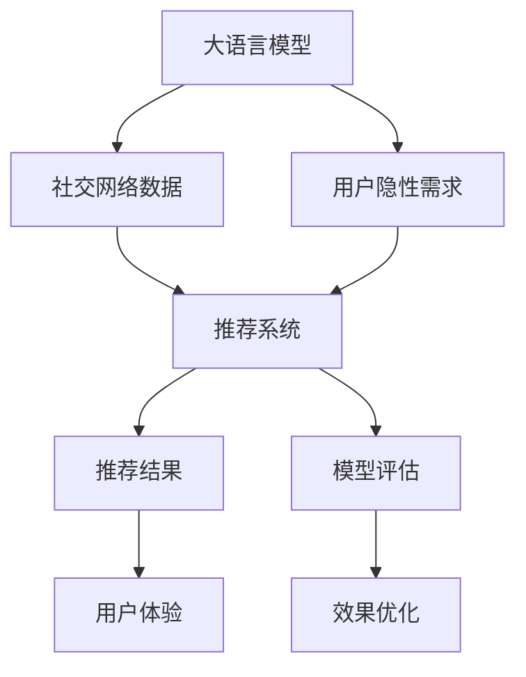

                 

# 社交网络推荐: LLM的潜力

> 关键词：社交网络, 推荐系统, 语言模型, 个性化, 内容推荐, 用户行为, 深度学习, 模型评估, 推荐算法

## 1. 背景介绍

### 1.1 问题由来

社交网络的普及和移动互联网的发展，极大地改变了人类的社交方式。在社交网络中，用户可以随时随地与朋友、家人、同事等进行互动，分享生活中的点滴，甚至参与到各种话题的讨论中。然而，海量数据带来的信息过载问题，使得用户难以在海量内容中找到感兴趣的信息，甚至有时会因为信息不对称和内容质量参差不齐的问题而产生困惑。

为了解决这一问题，推荐系统应运而生。推荐系统通过分析用户的历史行为和偏好，为用户推荐感兴趣的内容，从而提升用户体验，增加平台黏性。然而，传统推荐系统往往依赖于用户行为数据，难以理解用户深层次的需求和偏好，且容易陷入"沉没成本"的陷阱，推荐的效果并不理想。

近年来，随着深度学习技术的发展，基于用户历史行为数据和特征的推荐系统逐渐向基于内容的推荐系统转型，如利用知识图谱、稠密矩阵分解等方法。但这些方法仍面临诸多挑战，如数据稀疏、用户隐性需求难以刻画、冷启动等问题。为此，基于语言模型的推荐系统开始受到越来越多的关注。

大语言模型（Large Language Model, LLM）是一种基于神经网络的模型，通过自监督学习从大规模无标签数据中学习语言知识，具备强大的文本生成和理解能力。将大语言模型引入社交网络推荐系统，不仅可以解决数据稀疏和用户隐性需求等问题，还可以更好地理解用户深层次的语言偏好，实现更加精准的内容推荐。

### 1.2 问题核心关键点

基于大语言模型的社交网络推荐系统，主要涉及以下几个关键点：

- **数据表示**：如何将用户数据、内容数据转换为大语言模型能够理解和处理的向量表示，是大语言模型在推荐系统中的关键问题。
- **模型训练**：如何利用大语言模型在海量无标签数据上预训练的知识，结合社交网络中标注的数据，进一步训练模型，是大语言模型推荐系统的核心算法。
- **推荐策略**：如何将大语言模型生成的推荐结果转化为推荐策略，实现个性化推荐，是大语言模型在推荐系统中的关键应用。
- **效果评估**：如何设计合理的指标，评估大语言模型推荐系统的效果，是确保推荐系统高效运行的重要环节。

## 2. 核心概念与联系

### 2.1 核心概念概述

为更好地理解基于大语言模型的社交网络推荐系统，本节将介绍几个密切相关的核心概念：

- **大语言模型（LLM）**：一种基于神经网络的模型，通过自监督学习从大规模无标签数据中学习语言知识，具备强大的文本生成和理解能力。常见的LLM包括GPT-3、BERT等。

- **推荐系统（Recommendation System）**：一种通过分析用户历史行为和偏好，为用户推荐感兴趣的内容的系统。推荐系统分为基于内容的推荐系统和基于协同过滤的推荐系统，而基于大语言模型的推荐系统则属于前者。

- **用户隐性需求**：用户未在显式行为中体现的深层次需求和偏好。基于大语言模型的推荐系统可以通过理解用户输入的文本，挖掘其隐性需求，实现更加个性化的推荐。

- **深度学习**：一种基于神经网络的机器学习技术，能够从大规模数据中学习复杂特征表示，是现代推荐系统的主要技术手段。

- **模型评估**：推荐系统的效果评估指标，如准确率、召回率、F1值、NDCG等，用于衡量推荐系统推荐结果的优劣。

这些核心概念之间的逻辑关系可以通过以下Mermaid流程图来展示：



这个流程图展示了大语言模型、社交网络数据、用户隐性需求、推荐系统、推荐结果、模型评估、效果优化、用户体验之间的联系和互动。

## 3. 核心算法原理 & 具体操作步骤
### 3.1 算法原理概述

基于大语言模型的社交网络推荐系统，本质上是一个融合了自然语言处理和推荐算法的综合系统。其核心思想是：将大语言模型作为推荐系统中的"特征提取器"，利用其在文本理解上的优势，结合社交网络数据，生成个性化的推荐结果。

具体而言，该算法分为两个主要步骤：

1. **预训练与微调**：首先在大规模无标签数据上对大语言模型进行预训练，学习通用的语言表示。然后根据社交网络数据，对大语言模型进行微调，使其能够更好地理解用户输入的文本，挖掘用户隐性需求。

2. **推荐策略设计**：将微调后的大语言模型生成的推荐结果，通过特定的推荐算法转化为具体的推荐策略，实现个性化推荐。

### 3.2 算法步骤详解

基于大语言模型的社交网络推荐系统，可以分为以下几个关键步骤：

**Step 1: 数据预处理**

- 收集社交网络平台上的用户数据和内容数据，包括用户的兴趣爱好、关注人物、参与话题、发布内容等。
- 对数据进行清洗、去重、分词等预处理操作，将其转换为大语言模型能够理解的向量表示。

**Step 2: 大语言模型预训练与微调**

- 选择合适的大语言模型，如GPT-3、BERT等，作为推荐系统的初始化参数。
- 在大规模无标签数据上对大语言模型进行预训练，学习通用的语言表示。
- 根据社交网络数据，对大语言模型进行微调，使其能够更好地理解用户输入的文本，挖掘用户隐性需求。

**Step 3: 推荐策略设计**

- 将微调后的大语言模型生成的推荐结果，通过特定的推荐算法转化为具体的推荐策略，实现个性化推荐。
- 常见的推荐算法包括基于内容的推荐、基于协同过滤的推荐、基于深度学习的推荐等。

**Step 4: 模型评估与优化**

- 设计合理的指标，如准确率、召回率、F1值、NDCG等，评估推荐系统的效果。
- 根据评估结果，调整模型参数，优化推荐策略，提升推荐系统的性能。

### 3.3 算法优缺点

基于大语言模型的社交网络推荐系统，具有以下优点：

- **理解用户隐性需求**：大语言模型能够通过自然语言处理技术，理解用户输入的文本，挖掘用户隐性需求，实现更加个性化的推荐。
- **提升推荐精度**：利用大语言模型在海量数据上预训练的知识，结合社交网络数据，生成更加精准的推荐结果。
- **灵活性强**：大语言模型能够处理各种类型的文本数据，适用于不同类型的社交网络推荐场景。
- **可解释性高**：大语言模型的推荐结果具有一定的可解释性，用户能够理解推荐的原因。

同时，该算法也存在一些局限性：

- **计算成本高**：大语言模型的训练和推理需要大量的计算资源，推荐系统的开发和维护成本较高。
- **数据隐私问题**：社交网络数据往往涉及用户隐私，需要严格的数据保护措施。
- **模型复杂度高**：大语言模型的复杂度较高，模型的解释性和可维护性较差。
- **泛化能力不足**：大语言模型对于特定领域的推荐任务，可能存在泛化能力不足的问题。

### 3.4 算法应用领域

基于大语言模型的社交网络推荐系统，已经在多个领域得到了应用，例如：

- **新闻推荐**：将用户输入的搜索查询作为大语言模型的输入，生成推荐的新闻文章。
- **视频推荐**：根据用户输入的评论、点赞、分享等行为，生成推荐的视频内容。
- **商品推荐**：将用户输入的评论、评分作为大语言模型的输入，生成推荐的商品。
- **音乐推荐**：根据用户输入的听歌记录、评分，生成推荐的音乐。
- **游戏推荐**：根据用户输入的游戏偏好，生成推荐的游戏。

除了上述这些经典应用外，基于大语言模型的社交网络推荐系统还在直播、短视频、社交电商等多个领域展现出强大的潜力，为社交网络平台带来了更多的用户粘性和商业价值。

## 4. 数学模型和公式 & 详细讲解  
### 4.1 数学模型构建

本节将使用数学语言对基于大语言模型的社交网络推荐系统进行更加严格的刻画。

假设社交网络平台上的用户数据为 $X=\{x_1, x_2, ..., x_n\}$，内容数据为 $Y=\{y_1, y_2, ..., y_m\}$，其中 $x_i \in \mathcal{X}$ 表示用户 $i$ 的兴趣爱好，$y_j \in \mathcal{Y}$ 表示内容 $j$ 的特征。

定义大语言模型为 $M_{\theta}:\mathcal{X} \rightarrow \mathcal{Y}$，其中 $\theta$ 为模型参数。假设社交网络平台上有 $k$ 个标注的推荐任务，即 $(X, Y)$ 的 $k$ 个二元组 $(x_i, y_j)$。

定义推荐系统的损失函数为 $\ell(M_{\theta}, X, Y)$，用于衡量模型预测的推荐结果与实际推荐结果的差异。常见的损失函数包括交叉熵损失、均方误差损失等。

大语言模型的推荐系统优化目标是最小化损失函数，即找到最优参数：

$$
\theta^* = \mathop{\arg\min}_{\theta} \ell(M_{\theta}, X, Y)
$$

在实践中，我们通常使用基于梯度的优化算法（如SGD、Adam等）来近似求解上述最优化问题。设 $\eta$ 为学习率，$\lambda$ 为正则化系数，则参数的更新公式为：

$$
\theta \leftarrow \theta - \eta \nabla_{\theta}\ell(M_{\theta}, X, Y) - \eta\lambda\theta
$$

其中 $\nabla_{\theta}\ell(M_{\theta}, X, Y)$ 为损失函数对参数 $\theta$ 的梯度，可通过反向传播算法高效计算。

### 4.2 公式推导过程

以下我们以新闻推荐为例，推导交叉熵损失函数及其梯度的计算公式。

假设用户 $i$ 输入的查询文本为 $x_i$，大语言模型生成的推荐结果为 $M_{\theta}(x_i)$。假设社交网络平台上已标注的推荐结果为 $y_j$，定义交叉熵损失函数为：

$$
\ell(M_{\theta}(x_i), y_j) = -[y_j\log M_{\theta}(x_i)+(1-y_j)\log(1-M_{\theta}(x_i))]
$$

将其代入损失函数，得：

$$
\ell(M_{\theta}, X, Y) = -\frac{1}{N}\sum_{i=1}^N \sum_{j=1}^k \ell(M_{\theta}(x_i), y_j)
$$

根据链式法则，损失函数对参数 $\theta_k$ 的梯度为：

$$
\frac{\partial \ell(M_{\theta}, X, Y)}{\partial \theta_k} = -\frac{1}{N}\sum_{i=1}^N \sum_{j=1}^k \frac{\partial \ell(M_{\theta}(x_i), y_j)}{\partial \theta_k}
$$

其中 $\frac{\partial \ell(M_{\theta}(x_i), y_j)}{\partial \theta_k}$ 可进一步递归展开，利用自动微分技术完成计算。

在得到损失函数的梯度后，即可带入参数更新公式，完成模型的迭代优化。重复上述过程直至收敛，最终得到适应社交网络推荐任务的最优模型参数 $\theta^*$。

## 5. 项目实践：代码实例和详细解释说明
### 5.1 开发环境搭建

在进行社交网络推荐系统开发前，我们需要准备好开发环境。以下是使用Python进行PyTorch开发的环境配置流程：

1. 安装Anaconda：从官网下载并安装Anaconda，用于创建独立的Python环境。

2. 创建并激活虚拟环境：
```bash
conda create -n pytorch-env python=3.8 
conda activate pytorch-env
```

3. 安装PyTorch：根据CUDA版本，从官网获取对应的安装命令。例如：
```bash
conda install pytorch torchvision torchaudio cudatoolkit=11.1 -c pytorch -c conda-forge
```

4. 安装Transformers库：
```bash
pip install transformers
```

5. 安装各类工具包：
```bash
pip install numpy pandas scikit-learn matplotlib tqdm jupyter notebook ipython
```

完成上述步骤后，即可在`pytorch-env`环境中开始开发。

### 5.2 源代码详细实现

这里我们以新闻推荐任务为例，给出使用Transformers库对BERT模型进行微调的PyTorch代码实现。

首先，定义新闻推荐任务的数据处理函数：

```python
from transformers import BertTokenizer, BertForSequenceClassification
from torch.utils.data import Dataset
import torch

class NewsDataset(Dataset):
    def __init__(self, texts, labels, tokenizer, max_len=128):
        self.texts = texts
        self.labels = labels
        self.tokenizer = tokenizer
        self.max_len = max_len
        
    def __len__(self):
        return len(self.texts)
    
    def __getitem__(self, item):
        text = self.texts[item]
        label = self.labels[item]
        
        encoding = self.tokenizer(text, return_tensors='pt', max_length=self.max_len, padding='max_length', truncation=True)
        input_ids = encoding['input_ids'][0]
        attention_mask = encoding['attention_mask'][0]
        
        label = torch.tensor(label, dtype=torch.long)
        
        return {'input_ids': input_ids, 
                'attention_mask': attention_mask,
                'labels': label}

# 标签与id的映射
label2id = {1: 1, 0: 0}
id2label = {v: k for k, v in label2id.items()}

# 创建dataset
tokenizer = BertTokenizer.from_pretrained('bert-base-cased')

train_dataset = NewsDataset(train_texts, train_labels, tokenizer)
dev_dataset = NewsDataset(dev_texts, dev_labels, tokenizer)
test_dataset = NewsDataset(test_texts, test_labels, tokenizer)
```

然后，定义模型和优化器：

```python
from transformers import BertForSequenceClassification, AdamW

model = BertForSequenceClassification.from_pretrained('bert-base-cased', num_labels=len(label2id))

optimizer = AdamW(model.parameters(), lr=2e-5)
```

接着，定义训练和评估函数：

```python
from torch.utils.data import DataLoader
from tqdm import tqdm
from sklearn.metrics import classification_report

device = torch.device('cuda') if torch.cuda.is_available() else torch.device('cpu')
model.to(device)

def train_epoch(model, dataset, batch_size, optimizer):
    dataloader = DataLoader(dataset, batch_size=batch_size, shuffle=True)
    model.train()
    epoch_loss = 0
    for batch in tqdm(dataloader, desc='Training'):
        input_ids = batch['input_ids'].to(device)
        attention_mask = batch['attention_mask'].to(device)
        labels = batch['labels'].to(device)
        model.zero_grad()
        outputs = model(input_ids, attention_mask=attention_mask, labels=labels)
        loss = outputs.loss
        epoch_loss += loss.item()
        loss.backward()
        optimizer.step()
    return epoch_loss / len(dataloader)

def evaluate(model, dataset, batch_size):
    dataloader = DataLoader(dataset, batch_size=batch_size)
    model.eval()
    preds, labels = [], []
    with torch.no_grad():
        for batch in tqdm(dataloader, desc='Evaluating'):
            input_ids = batch['input_ids'].to(device)
            attention_mask = batch['attention_mask'].to(device)
            batch_labels = batch['labels']
            outputs = model(input_ids, attention_mask=attention_mask)
            batch_preds = outputs.logits.argmax(dim=2).to('cpu').tolist()
            batch_labels = batch_labels.to('cpu').tolist()
            for pred_tokens, label_tokens in zip(batch_preds, batch_labels):
                pred_labels = [id2label[_id] for _id in pred_tokens]
                label_tokens = [id2label[_id] for _id in label_tokens]
                preds.append(pred_labels[:len(label_tokens)])
                labels.append(label_tokens)
                
    print(classification_report(labels, preds))
```

最后，启动训练流程并在测试集上评估：

```python
epochs = 5
batch_size = 16

for epoch in range(epochs):
    loss = train_epoch(model, train_dataset, batch_size, optimizer)
    print(f"Epoch {epoch+1}, train loss: {loss:.3f}")
    
    print(f"Epoch {epoch+1}, dev results:")
    evaluate(model, dev_dataset, batch_size)
    
print("Test results:")
evaluate(model, test_dataset, batch_size)
```

以上就是使用PyTorch对BERT进行新闻推荐任务微调的完整代码实现。可以看到，得益于Transformers库的强大封装，我们可以用相对简洁的代码完成BERT模型的加载和微调。

### 5.3 代码解读与分析

让我们再详细解读一下关键代码的实现细节：

**NewsDataset类**：
- `__init__`方法：初始化文本、标签、分词器等关键组件。
- `__len__`方法：返回数据集的样本数量。
- `__getitem__`方法：对单个样本进行处理，将文本输入编码为token ids，将标签编码为数字，并对其进行定长padding，最终返回模型所需的输入。

**label2id和id2label字典**：
- 定义了标签与数字id之间的映射关系，用于将模型预测结果解码回真实的标签。

**训练和评估函数**：
- 使用PyTorch的DataLoader对数据集进行批次化加载，供模型训练和推理使用。
- 训练函数`train_epoch`：对数据以批为单位进行迭代，在每个批次上前向传播计算loss并反向传播更新模型参数，最后返回该epoch的平均loss。
- 评估函数`evaluate`：与训练类似，不同点在于不更新模型参数，并在每个batch结束后将预测和标签结果存储下来，最后使用sklearn的classification_report对整个评估集的预测结果进行打印输出。

**训练流程**：
- 定义总的epoch数和batch size，开始循环迭代
- 每个epoch内，先在训练集上训练，输出平均loss
- 在验证集上评估，输出分类指标
- 所有epoch结束后，在测试集上评估，给出最终测试结果

可以看到，PyTorch配合Transformers库使得BERT微调的新闻推荐任务代码实现变得简洁高效。开发者可以将更多精力放在数据处理、模型改进等高层逻辑上，而不必过多关注底层的实现细节。

当然，工业级的系统实现还需考虑更多因素，如模型的保存和部署、超参数的自动搜索、更灵活的任务适配层等。但核心的微调范式基本与此类似。

## 6. 实际应用场景
### 6.1 智能客服系统

基于大语言模型的推荐系统，可以广泛应用于智能客服系统的构建。传统客服往往需要配备大量人力，高峰期响应缓慢，且一致性和专业性难以保证。而使用推荐系统进行智能推荐，可以显著减少客服人员的工作量，提升客户满意度。

在技术实现上，可以收集企业内部的历史客服对话记录，将问题和最佳答复构建成监督数据，在此基础上对预训练推荐模型进行微调。微调后的推荐模型能够自动推荐最佳答复，减少人工干预，提高客户咨询体验和问题解决效率。

### 6.2 金融舆情监测

金融机构需要实时监测市场舆论动向，以便及时应对负面信息传播，规避金融风险。传统的人工监测方式成本高、效率低，难以应对网络时代海量信息爆发的挑战。基于大语言模型的推荐系统，可以自动识别热门话题，及时发现市场动态，帮助金融机构实时调整投资策略，降低风险。

具体而言，可以收集金融领域相关的新闻、报道、评论等文本数据，并对其进行情感分析。通过情感分析结果，对热门话题进行排序，以便快速定位到市场动向。在热门话题出现时，自动推送相关新闻和分析报告，帮助金融机构做出决策。

### 6.3 个性化推荐系统

当前的推荐系统往往只依赖用户历史行为数据进行物品推荐，难以理解用户深层次的需求和偏好。基于大语言模型的推荐系统，可以更好地挖掘用户隐性需求，实现更加精准的内容推荐。

在实践中，可以收集用户浏览、点击、评论、分享等行为数据，提取和用户交互的物品标题、描述、标签等文本内容。将文本内容作为模型输入，用户的后续行为（如是否点击、购买等）作为监督信号，在此基础上微调预训练语言模型。微调后的模型能够从文本内容中准确把握用户的兴趣点。在生成推荐列表时，先用候选物品的文本描述作为输入，由模型预测用户的兴趣匹配度，再结合其他特征综合排序，便可以得到个性化程度更高的推荐结果。

### 6.4 未来应用展望

随着大语言模型和推荐系统的不断发展，基于微调范式将在更多领域得到应用，为传统行业带来变革性影响。

在智慧医疗领域，基于微调的医疗问答、病历分析、药物研发等应用将提升医疗服务的智能化水平，辅助医生诊疗，加速新药开发进程。

在智能教育领域，微调技术可应用于作业批改、学情分析、知识推荐等方面，因材施教，促进教育公平，提高教学质量。

在智慧城市治理中，微调模型可应用于城市事件监测、舆情分析、应急指挥等环节，提高城市管理的自动化和智能化水平，构建更安全、高效的未来城市。

此外，在企业生产、社会治理、文娱传媒等众多领域，基于大语言模型的推荐系统还将不断涌现，为传统行业带来新的增长点。相信随着技术的日益成熟，推荐系统必将在更广阔的应用领域大放异彩。

## 7. 工具和资源推荐
### 7.1 学习资源推荐

为了帮助开发者系统掌握大语言模型微调的理论基础和实践技巧，这里推荐一些优质的学习资源：

1. 《Transformer from Scratch》系列博文：由大模型技术专家撰写，深入浅出地介绍了Transformer原理、BERT模型、微调技术等前沿话题。

2. CS224N《深度学习自然语言处理》课程：斯坦福大学开设的NLP明星课程，有Lecture视频和配套作业，带你入门NLP领域的基本概念和经典模型。

3. 《Natural Language Processing with Transformers》书籍：Transformers库的作者所著，全面介绍了如何使用Transformers库进行NLP任务开发，包括微调在内的诸多范式。

4. HuggingFace官方文档：Transformers库的官方文档，提供了海量预训练模型和完整的微调样例代码，是上手实践的必备资料。

5. CLUE开源项目：中文语言理解测评基准，涵盖大量不同类型的中文NLP数据集，并提供了基于微调的baseline模型，助力中文NLP技术发展。

通过对这些资源的学习实践，相信你一定能够快速掌握大语言模型微调的精髓，并用于解决实际的NLP问题。
###  7.2 开发工具推荐

高效的开发离不开优秀的工具支持。以下是几款用于大语言模型微调开发的常用工具：

1. PyTorch：基于Python的开源深度学习框架，灵活动态的计算图，适合快速迭代研究。大部分预训练语言模型都有PyTorch版本的实现。

2. TensorFlow：由Google主导开发的开源深度学习框架，生产部署方便，适合大规模工程应用。同样有丰富的预训练语言模型资源。

3. Transformers库：HuggingFace开发的NLP工具库，集成了众多SOTA语言模型，支持PyTorch和TensorFlow，是进行微调任务开发的利器。

4. Weights & Biases：模型训练的实验跟踪工具，可以记录和可视化模型训练过程中的各项指标，方便对比和调优。与主流深度学习框架无缝集成。

5. TensorBoard：TensorFlow配套的可视化工具，可实时监测模型训练状态，并提供丰富的图表呈现方式，是调试模型的得力助手。

6. Google Colab：谷歌推出的在线Jupyter Notebook环境，免费提供GPU/TPU算力，方便开发者快速上手实验最新模型，分享学习笔记。

合理利用这些工具，可以显著提升大语言模型微调任务的开发效率，加快创新迭代的步伐。

### 7.3 相关论文推荐

大语言模型和微调技术的发展源于学界的持续研究。以下是几篇奠基性的相关论文，推荐阅读：

1. Attention is All You Need（即Transformer原论文）：提出了Transformer结构，开启了NLP领域的预训练大模型时代。

2. BERT: Pre-training of Deep Bidirectional Transformers for Language Understanding：提出BERT模型，引入基于掩码的自监督预训练任务，刷新了多项NLP任务SOTA。

3. Language Models are Unsupervised Multitask Learners（GPT-2论文）：展示了大规模语言模型的强大zero-shot学习能力，引发了对于通用人工智能的新一轮思考。

4. Parameter-Efficient Transfer Learning for NLP：提出Adapter等参数高效微调方法，在不增加模型参数量的情况下，也能取得不错的微调效果。

5. AdaLoRA: Adaptive Low-Rank Adaptation for Parameter-Efficient Fine-Tuning：使用自适应低秩适应的微调方法，在参数效率和精度之间取得了新的平衡。

这些论文代表了大语言模型微调技术的发展脉络。通过学习这些前沿成果，可以帮助研究者把握学科前进方向，激发更多的创新灵感。

## 8. 总结：未来发展趋势与挑战
### 8.1 总结

本文对基于大语言模型的社交网络推荐系统进行了全面系统的介绍。首先阐述了社交网络推荐系统的发展背景和意义，明确了大语言模型在推荐系统中的关键作用。其次，从原理到实践，详细讲解了大语言模型在推荐系统中的应用，给出了微调任务开发的完整代码实例。同时，本文还广泛探讨了微调方法在智能客服、金融舆情、个性化推荐等多个领域的应用前景，展示了微调范式的巨大潜力。此外，本文精选了微调技术的各类学习资源，力求为读者提供全方位的技术指引。

通过本文的系统梳理，可以看到，基于大语言模型的微调推荐系统正在成为社交网络推荐领域的重要范式，极大地拓展了推荐系统的应用边界，催生了更多的落地场景。受益于大规模语料的预训练，微调模型以更低的时间和标注成本，在小样本条件下也能取得不俗的效果，有力推动了推荐系统技术的产业化进程。未来，伴随大语言模型和微调方法的持续演进，相信推荐系统必将在更广阔的应用领域大放异彩，深刻影响人类的生产生活方式。

### 8.2 未来发展趋势

展望未来，大语言模型微调推荐系统将呈现以下几个发展趋势：

1. **模型规模持续增大**：随着算力成本的下降和数据规模的扩张，预训练语言模型的参数量还将持续增长。超大规模语言模型蕴含的丰富语言知识，有望支撑更加复杂多变的推荐任务。

2. **推荐算法多样化**：除了基于内容的推荐算法，未来的推荐系统将更加注重个性化推荐和多样化推荐，利用深度学习、协同过滤、多臂乐队等方法，提升推荐系统的效果和多样性。

3. **多模态推荐崛起**：当前的推荐系统主要依赖文本数据，未来将逐步引入图像、视频、音频等多模态数据，实现视觉、语音、文本的协同推荐，提升用户体验和系统效果。

4. **持续学习成为常态**：推荐系统需要不断学习和适应新的用户需求和市场动态，持续学习将成为推荐系统的重要特征。如何在不遗忘原有知识的同时，高效吸收新数据，是推荐系统面临的重要挑战。

5. **隐私保护更加重要**：随着用户数据量的增加，推荐系统的隐私保护问题将更加突出。如何在保证推荐效果的同时，保护用户隐私，是大规模推荐系统需要解决的重要问题。

6. **推荐系统更加透明**：推荐系统的推荐过程需要更加透明和可解释，帮助用户理解推荐结果的来源和理由，提升用户信任度。

以上趋势凸显了大语言模型微调推荐系统的广阔前景。这些方向的探索发展，必将进一步提升推荐系统的性能和应用范围，为社交网络平台带来更多的用户粘性和商业价值。

### 8.3 面临的挑战

尽管大语言模型微调推荐系统已经取得了瞩目成就，但在迈向更加智能化、普适化应用的过程中，它仍面临着诸多挑战：

1. **计算成本高**：大语言模型的训练和推理需要大量的计算资源，推荐系统的开发和维护成本较高。如何在保证推荐效果的同时，降低计算成本，是大规模推荐系统需要解决的重要问题。

2. **数据隐私问题**：社交网络数据往往涉及用户隐私，需要严格的数据保护措施。如何在保护用户隐私的同时，获取更多的数据支持，是推荐系统面临的重要挑战。

3. **模型复杂度高**：大语言模型的复杂度较高，模型的解释性和可维护性较差。如何在保证推荐效果的同时，简化模型结构，提高模型的可解释性，是大规模推荐系统需要解决的重要问题。

4. **泛化能力不足**：大语言模型对于特定领域的推荐任务，可能存在泛化能力不足的问题。如何在保证推荐效果的同时，提高模型的泛化能力，是推荐系统面临的重要挑战。

5. **知识整合能力不足**：现有的推荐系统往往局限于用户历史行为数据，难以灵活吸收和运用更广泛的先验知识。如何让推荐系统更好地与外部知识库、规则库等专家知识结合，形成更加全面、准确的信息整合能力，还有很大的想象空间。

6. **鲁棒性不足**：推荐系统对于输入数据的微小扰动，容易产生波动。如何提高推荐系统的鲁棒性，避免灾难性遗忘，是推荐系统面临的重要挑战。

正视推荐系统面临的这些挑战，积极应对并寻求突破，将是大语言模型微调推荐系统走向成熟的必由之路。相信随着学界和产业界的共同努力，这些挑战终将一一被克服，大语言模型微调推荐系统必将在构建安全、可靠、可解释、可控的智能推荐系统中发挥重要作用。

### 8.4 研究展望

面向未来，大语言模型微调推荐系统需要在以下几个方面寻求新的突破：

1. **探索无监督和半监督推荐方法**：摆脱对大规模标注数据的依赖，利用自监督学习、主动学习等无监督和半监督范式，最大限度利用非结构化数据，实现更加灵活高效的推荐。

2. **研究参数高效和计算高效的推荐范式**：开发更加参数高效的推荐方法，在固定大部分预训练参数的同时，只更新极少量的任务相关参数。同时优化推荐系统的计算图，减少前向传播和反向传播的资源消耗，实现更加轻量级、实时性的部署。

3. **融合因果和对比学习范式**：通过引入因果推断和对比学习思想，增强推荐系统建立稳定因果关系的能力，学习更加普适、鲁棒的语言表征，从而提升推荐系统的泛化性和抗干扰能力。

4. **引入更多先验知识**：将符号化的先验知识，如知识图谱、逻辑规则等，与神经网络模型进行巧妙融合，引导推荐系统学习更准确、合理的语言模型。同时加强不同模态数据的整合，实现视觉、语音、文本的协同推荐。

5. **结合因果分析和博弈论工具**：将因果分析方法引入推荐系统，识别出推荐结果的关键特征，增强推荐过程的因果性和逻辑性。借助博弈论工具刻画人机交互过程，主动探索并规避推荐系统的脆弱点，提高系统稳定性。

6. **纳入伦理道德约束**：在推荐系统的目标中引入伦理导向的评估指标，过滤和惩罚有偏见、有害的输出倾向。同时加强人工干预和审核，建立推荐系统的监管机制，确保推荐结果符合人类价值观和伦理道德。

这些研究方向的探索，必将引领大语言模型微调推荐系统迈向更高的台阶，为构建安全、可靠、可解释、可控的智能推荐系统铺平道路。面向未来，大语言模型微调推荐系统还需要与其他人工智能技术进行更深入的融合，如知识表示、因果推理、强化学习等，多路径协同发力，共同推动推荐系统的进步。只有勇于创新、敢于突破，才能不断拓展语言模型的边界，让智能技术更好地造福人类社会。

## 9. 附录：常见问题与解答

**Q1：大语言模型微调推荐系统是否适用于所有社交网络推荐场景？**

A: 大语言模型微调推荐系统适用于大多数社交网络推荐场景，特别是数据规模较大、用户需求多样化的平台。但对于一些数据稀疏、用户需求明确的场景，可能存在泛化能力不足的问题。此时需要在特定领域语料上进一步预训练，再进行微调，才能获得理想效果。

**Q2：微调过程中如何选择合适的学习率？**

A: 微调的学习率一般要比预训练时小1-2个数量级，如果使用过大的学习率，容易破坏预训练权重，导致过拟合。一般建议从1e-5开始调参，逐步减小学习率，直至收敛。也可以使用warmup策略，在开始阶段使用较小的学习率，再逐渐过渡到预设值。需要注意的是，不同的优化器(如AdamW、Adafactor等)以及不同的学习率调度策略，可能需要设置不同的学习率阈值。

**Q3：大语言模型微调推荐系统在落地部署时需要注意哪些问题？**

A: 将微调模型转化为实际应用，还需要考虑以下因素：
1. 模型裁剪：去除不必要的层和参数，减小模型尺寸，加快推理速度。
2. 量化加速：将浮点模型转为定点模型，压缩存储空间，提高计算效率。
3. 服务化封装：将模型封装为标准化服务接口，便于集成调用。
4. 弹性伸缩：根据请求流量动态调整资源配置，平衡服务质量和成本。
5. 监控告警：实时采集系统指标，设置异常告警阈值，确保服务稳定性。
6. 安全防护：采用访问鉴权、数据脱敏等措施，保障数据和模型安全。

大语言模型微调推荐系统为社交网络平台带来了新的增长点，但如何将强大的性能转化为稳定、高效、安全的业务价值，还需要工程实践的不断打磨。合理利用这些工具，可以显著提升大语言模型微调推荐任务的开发效率，加快创新迭代的步伐。

---

作者：禅与计算机程序设计艺术 / Zen and the Art of Computer Programming

