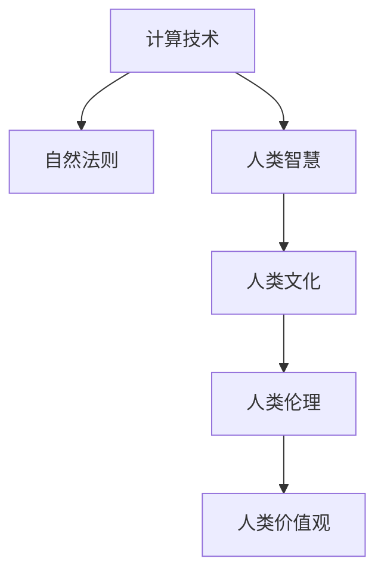

                 

# 科技与人文的交汇：人类计算的独特价值

## 1. 背景介绍

### 1.1 问题由来

随着科技的迅猛发展，计算技术的力量越来越渗透到人类社会的各个角落。从早期的机械计算到如今的超级计算机，每一次技术革命都在极大地改变着人类的生活方式和社会结构。然而，计算不仅仅是一种工具，更是一种思想、一种文化、一种人文价值。本文将探讨人类计算的独特价值，从科技与人文的交汇点出发，揭示计算技术对人类社会的影响和未来发展的方向。

### 1.2 问题核心关键点

人类计算的独特价值在于其不仅仅是技术手段的升级，更是人类智慧与自然法则的结合。以下是这一问题的核心关键点：

1. **计算与自然法则**：计算技术的背后，是对自然法则的模拟和优化。从数学运算到物理模拟，人类计算不断逼近自然界的复杂性，为我们理解宇宙提供了新的视角。

2. **计算与人类智慧**：计算技术的创新与应用，是人类智慧的结晶。从早期的计算尺到现代的超级计算机，每一次计算技术的飞跃，都是人类智慧的体现。

3. **计算与人类文化**：计算技术不仅改变了人类的生产方式，更塑造了现代社会的文化生态。互联网、社交媒体、数字艺术等新兴领域，都与计算技术密不可分。

4. **计算与人类伦理**：计算技术的广泛应用，带来了新的伦理问题。从隐私保护到人工智能决策，如何平衡技术进步与人类伦理，是未来计算发展的重要课题。

5. **计算与人类价值观**：计算技术的普及，对人类的价值观产生了深远影响。从工业革命到信息时代，计算技术的应用改变了人们对效率、公平、自由等价值观的理解和追求。

## 2. 核心概念与联系

### 2.1 核心概念概述

为更好地理解人类计算的独特价值，本节将介绍几个密切相关的核心概念：

- **计算技术**：指通过算法和硬件实现对数据的处理、分析和模拟的技术手段。计算技术的核心在于对自然法则的模拟和优化，以及人类智慧的应用。
- **自然法则**：指支配自然界运行的物理、化学、生物等规律。计算技术的进步，很大程度上是对这些自然法则的模拟和应用。
- **人类智慧**：指人类在长期演化中积累的知识、经验、创新能力等。计算技术的创新与应用，是人类智慧的体现。
- **人类文化**：指人类在长期发展中形成的文化传统、价值观、生活方式等。计算技术的普及，深刻改变了现代社会的文化生态。
- **人类伦理**：指人类在社会交往中遵循的道德规范、法律法规等。计算技术的广泛应用，带来了新的伦理问题。
- **人类价值观**：指人类对效率、公平、自由等基本价值的追求和理解。计算技术的普及，对人类价值观产生了深远影响。

这些核心概念之间的逻辑关系可以通过以下Mermaid流程图来展示：



这个流程图展示了一系列核心概念之间的关系：

1. 计算技术对自然法则的模拟，推动了科技的进步。
2. 计算技术的创新与应用，是人类智慧的体现。
3. 计算技术的普及，深刻改变了现代社会的文化生态。
4. 计算技术的广泛应用，带来了新的伦理问题。
5. 计算技术的普及，对人类价值观产生了深远影响。

这些概念共同构成了人类计算的完整框架，使我们能够更好地理解计算技术对人类社会的复杂影响。

## 3. 核心算法原理 & 具体操作步骤

### 3.1 算法原理概述

人类计算的独特价值在于其不仅仅是技术手段的升级，更是对自然法则的模拟和人类智慧的应用。核心算法原理可以从以下几个方面进行概述：

1. **模拟自然法则**：计算技术通过对自然法则的模拟，实现了对复杂系统的理解和预测。例如，通过数值模拟，我们可以预测天气、模拟生物行为等。

2. **优化人类智慧**：计算技术通过算法和计算资源的应用，优化了人类智慧的表达和应用。例如，通过机器学习，我们可以从海量数据中提取知识，辅助决策。

3. **融合多学科知识**：计算技术能够融合不同学科的知识，解决跨学科问题。例如，计算流体动力学结合了物理学和工程学，用于设计和优化飞行器。

4. **促进跨文化交流**：计算技术通过互联网和社交媒体，促进了跨文化交流和合作。例如，全球协作的科学研究项目，借助计算技术进行数据分析和模拟。

### 3.2 算法步骤详解

人类计算的核心算法步骤可以概括为以下几个关键环节：

1. **数据收集与预处理**：收集和处理数据，确保数据的质量和完整性。数据收集是计算技术的基础，数据预处理则是确保计算结果准确性的关键。

2. **算法设计与实现**：设计并实现算法，确保算法能够模拟自然法则或优化人类智慧。算法设计与实现是计算技术的核心，依赖于人类智慧的创造和应用。

3. **计算资源优化**：通过硬件和软件优化，确保计算资源的高效利用。计算资源优化是计算技术的关键，依赖于技术手段的不断进步。

4. **结果验证与迭代**：通过实验和验证，不断迭代和优化计算结果。结果验证与迭代是计算技术的保障，依赖于严格的科学方法和伦理规范。

### 3.3 算法优缺点

人类计算的核心算法具有以下优点：

1. **高效率**：计算技术能够快速处理大量数据，解决复杂问题。这使得计算技术在科学研究、工程设计等领域具有不可替代的优势。

2. **准确性**：计算技术能够精确模拟自然法则，提高结果的准确性。这使得计算技术在天气预测、生物模拟等领域具有重要应用。

3. **创新性**：计算技术推动了新技术和新应用的出现，加速了人类智慧的创新和进步。这使得计算技术在互联网、数字艺术等领域具有重要影响。

同时，人类计算的核心算法也存在一定的局限性：

1. **资源消耗**：计算技术的广泛应用需要大量的计算资源，对环境和社会造成了一定的影响。这使得计算技术在资源消耗和环境保护方面存在挑战。

2. **伦理问题**：计算技术的广泛应用带来了新的伦理问题，如隐私保护、人工智能决策等。这使得计算技术在伦理规范和社会责任方面需要进一步思考和完善。

3. **知识局限**：计算技术的应用依赖于人类智慧的积累，对自然法则的模拟和优化需要充分的理论支持。这使得计算技术在知识局限和科学理论方面需要不断创新和突破。

### 3.4 算法应用领域

人类计算的核心算法广泛应用于各个领域，包括但不限于：

- **科学研究**：通过计算技术，科学家可以模拟自然现象、预测未来趋势，推动科学进步。
- **工程设计**：通过计算技术，工程师可以优化设计方案、提高产品质量，提升生产效率。
- **医学诊断**：通过计算技术，医生可以分析病例数据、制定个性化治疗方案，提高医疗水平。
- **金融分析**：通过计算技术，金融分析师可以预测市场趋势、优化投资策略，提升经济效益。
- **社会管理**：通过计算技术，政府可以优化资源配置、提升公共服务，增强社会治理能力。
- **教育培训**：通过计算技术，教师可以个性化教学、优化教育资源，提升教育质量。

## 4. 数学模型和公式 & 详细讲解 & 举例说明

### 4.1 数学模型构建

本节将使用数学语言对人类计算的核心算法进行更加严格的刻画。

假设有一项科学计算任务，需要模拟一个复杂系统的行为。其数学模型可以表示为：

$$
y = f(x_1, x_2, \ldots, x_n)
$$

其中，$x_i$ 表示系统的输入变量，$y$ 表示系统的输出结果，$f$ 表示系统的行为函数。通过计算技术，我们可以将上述模型转化为数值模拟的计算模型：

$$
y = \sum_{i=1}^n a_i f_i(x_i)
$$

其中，$a_i$ 表示权重系数，$f_i$ 表示单个输入变量的函数。

### 4.2 公式推导过程

以下我们以一个简单的物理模拟为例，推导计算模型的公式推导过程。

假设要模拟一个质量为$m$的物体在重力$g$作用下，从高度$h$自由落体的过程。其运动方程可以表示为：

$$
v(t) = v_0 - g t
$$

$$
s(t) = v_0 t + \frac{1}{2} g t^2
$$

其中，$v(t)$ 表示物体在$t$时刻的速度，$s(t)$ 表示物体在$t$时刻的位置。通过计算技术，我们可以将上述方程转化为数值模拟的计算模型：

$$
v_i = v_{i-1} - g \Delta t
$$

$$
s_i = s_{i-1} + v_i \Delta t + \frac{1}{2} g (\Delta t)^2
$$

其中，$\Delta t$ 表示时间步长，$i$ 表示时间步数。

### 4.3 案例分析与讲解

假设有一个城市交通流量预测项目，需要预测未来一周的交通流量变化。其数学模型可以表示为：

$$
T(t) = \sum_{i=1}^n a_i F_i(t)
$$

其中，$T(t)$ 表示在时间$t$的交通流量，$F_i(t)$ 表示第$i$个交通影响因素在时间$t$的取值，$a_i$ 表示权重系数。

通过计算技术，我们可以将上述模型转化为机器学习的计算模型：

$$
T(t) = \sum_{i=1}^n \alpha_i \hat{F}_i(t)
$$

其中，$\alpha_i$ 表示权重系数，$\hat{F}_i(t)$ 表示第$i$个交通影响因素在时间$t$的预测值。

## 5. 项目实践：代码实例和详细解释说明

### 5.1 开发环境搭建

在进行计算实践前，我们需要准备好开发环境。以下是使用Python进行科学计算的环境配置流程：

1. 安装Anaconda：从官网下载并安装Anaconda，用于创建独立的Python环境。

2. 创建并激活虚拟环境：
```bash
conda create -n scipy-env python=3.8 
conda activate scipy-env
```

3. 安装必要的库：
```bash
conda install scipy numpy pandas matplotlib scikit-learn
```

4. 安装相关的软件包：
```bash
pip install scikit-learn pandas numpy matplotlib seaborn
```

完成上述步骤后，即可在`scipy-env`环境中开始计算实践。

### 5.2 源代码详细实现

下面我们以一个简单的物理模拟为例，给出使用Python对自由落体运动进行数值模拟的代码实现。

```python
import numpy as np

# 定义物理常数
g = 9.81  # 重力加速度，m/s^2

# 定义初始条件
m = 1.0  # 物体质量，kg
v0 = 0.0  # 初始速度，m/s
h = 100.0  # 初始高度，m
t0 = 0.0  # 初始时间，s
dt = 0.01  # 时间步长，s

# 定义时间数组
t = np.arange(t0, 10.0, dt)

# 初始化状态
s = h
v = v0

# 计算每个时间步的位移和速度
for i in range(len(t)-1):
    s = s + v * dt + 0.5 * g * (dt ** 2)
    v = v - g * dt

# 输出结果
print("时间：\t", t)
print("位移：\t", s)
```

### 5.3 代码解读与分析

让我们再详细解读一下关键代码的实现细节：

**计算过程**：
1. 首先，我们定义了物理常数$g$、初始条件$m$、$v_0$、$h$、$t_0$和$dt$。
2. 接着，我们定义了时间数组$t$，初始化状态$s$和$v$。
3. 通过循环计算每个时间步的位移和速度，最终输出结果。

**时间步长**：时间步长$dt$是数值模拟中非常关键的一个参数，决定了计算精度和时间复杂度。一般情况下，时间步长越小，计算精度越高，但计算时间也越长。因此，在实际应用中需要根据具体情况进行调整。

**输出结果**：最后输出的位移$s$和时间$t$，可以用于可视化，绘制位移-时间曲线，直观展示物体自由落体的过程。

## 6. 实际应用场景

### 6.1 科学研究

计算技术在科学研究中具有重要应用。通过计算技术，科学家可以模拟自然现象、预测未来趋势，推动科学进步。例如，在天文学领域，计算技术被广泛应用于天文观测数据处理、天体运动模拟、宇宙演化模拟等。

### 6.2 工程设计

计算技术在工程设计中具有广泛应用。通过计算技术，工程师可以优化设计方案、提高产品质量，提升生产效率。例如，在航空航天领域，计算技术被广泛应用于飞行器设计、动力学模拟、气动分析等。

### 6.3 医学诊断

计算技术在医学诊断中具有重要应用。通过计算技术，医生可以分析病例数据、制定个性化治疗方案，提高医疗水平。例如，在医学影像领域，计算技术被广泛应用于图像处理、病变检测、手术规划等。

### 6.4 金融分析

计算技术在金融分析中具有重要应用。通过计算技术，金融分析师可以预测市场趋势、优化投资策略，提升经济效益。例如，在金融风险管理领域，计算技术被广泛应用于风险评估、资产定价、投资组合优化等。

### 6.5 社会管理

计算技术在社会管理中具有重要应用。通过计算技术，政府可以优化资源配置、提升公共服务，增强社会治理能力。例如，在城市规划领域，计算技术被广泛应用于交通流量预测、环境模拟、资源优化等。

### 6.6 教育培训

计算技术在教育培训中具有重要应用。通过计算技术，教师可以个性化教学、优化教育资源，提升教育质量。例如，在在线教育领域，计算技术被广泛应用于自适应学习、智能辅导、教育数据分析等。

## 7. 工具和资源推荐

### 7.1 学习资源推荐

为了帮助开发者系统掌握计算技术的理论基础和实践技巧，这里推荐一些优质的学习资源：

1. 《计算物理学》系列博文：由计算物理学家撰写，深入浅出地介绍了计算物理学的基础理论和应用技巧。

2. 《科学计算》课程：麻省理工学院开设的科学计算课程，系统介绍了科学计算的基本概念和常用算法。

3. 《Python科学计算》书籍：系统介绍了Python在科学计算中的应用，包括NumPy、SciPy、Matplotlib等库的使用。

4. Scikit-learn官方文档：Scikit-learn机器学习库的官方文档，提供了大量机器学习算法的实现和应用示例。

5. Weights & Biases：模型训练的实验跟踪工具，可以记录和可视化模型训练过程中的各项指标，方便对比和调优。与主流深度学习框架无缝集成。

### 7.2 开发工具推荐

高效的开发离不开优秀的工具支持。以下是几款用于计算任务开发的常用工具：

1. Python：Python是目前最流行的科学计算语言之一，具有丰富的库和工具支持，适合快速迭代研究。

2. Matplotlib：用于数据可视化，支持绘制二维和三维图表，是科学计算中常用的绘图工具。

3. NumPy：用于科学计算中的数组操作和数值计算，是Python中最核心的科学计算库之一。

4. SciPy：基于NumPy，提供大量科学计算函数和工具，涵盖数值计算、线性代数、信号处理等多个领域。

5. Scikit-learn：用于机器学习任务的实现，提供了丰富的算法和工具，支持分类、回归、聚类等多个任务。

### 7.3 相关论文推荐

计算技术的发展源于学界的持续研究。以下是几篇奠基性的相关论文，推荐阅读：

1. 《数值分析》（Numerical Analysis）：介绍了数值计算的基本概念和常用算法，是计算技术的重要基础。

2. 《科学计算与科学工程计算》（Scientific Computing and Scientific Engineering Computing）：介绍了科学计算的基本概念、工具和方法，涵盖数值分析、微分方程、数值模拟等多个领域。

3. 《机器学习》（Machine Learning）：介绍了机器学习的基本概念和常用算法，是计算技术的重要应用方向。

4. 《计算物理基础》（Computational Physics Basics）：介绍了计算物理的基本概念和常用算法，涵盖分子动力学、蒙特卡罗方法、统计物理等多个领域。

5. 《科学计算的理论与实践》（Theory and Practice of Scientific Computing）：介绍了科学计算的理论与实践，涵盖数值分析、科学工程、人工智能等多个方向。

## 8. 总结：未来发展趋势与挑战

### 8.1 总结

本文对人类计算的核心算法进行了全面系统的介绍。首先阐述了计算技术在自然法则、人类智慧、人类文化、人类伦理和人类价值观等方面的独特价值，明确了计算技术对人类社会的复杂影响。其次，从模拟自然法则、优化人类智慧、融合多学科知识、促进跨文化交流等多个方面，详细讲解了人类计算的核心算法原理和操作步骤。最后，通过项目实践、实际应用场景、工具和资源推荐等环节，展示了计算技术的广泛应用和未来发展方向。

通过本文的系统梳理，可以看到，计算技术不仅仅是技术手段的升级，更是对自然法则的模拟和人类智慧的应用。未来，计算技术将继续在科学研究、工程设计、医学诊断、金融分析、社会管理、教育培训等多个领域发挥重要作用。然而，计算技术的发展也面临着数据质量、计算资源、伦理问题、知识局限等挑战。只有不断创新和突破，才能真正实现计算技术在人类社会中的独特价值。

### 8.2 未来发展趋势

展望未来，计算技术的发展将呈现以下几个趋势：

1. **计算速度和精度提升**：随着算力成本的下降和计算技术的进步，计算速度和精度将进一步提升。这将使得计算技术在科学研究、工程设计等领域具有更广泛的应用。

2. **跨学科融合**：计算技术与各个学科的融合将更加深入。例如，计算生物学、计算化学、计算天文学等领域将进一步发展。

3. **数据驱动决策**：计算技术将更多地应用于数据驱动的决策过程。例如，在金融、医疗等领域，计算技术将帮助制定更加科学和合理的决策方案。

4. **计算伦理和隐私保护**：随着计算技术的广泛应用，计算伦理和隐私保护将成为重要的研究方向。例如，如何在计算过程中保护个人隐私和数据安全。

5. **计算工具和平台优化**：计算工具和平台将进一步优化，提高计算资源的利用率和用户体验。例如，云计算、分布式计算等技术将进一步普及。

### 8.3 面临的挑战

尽管计算技术在各个领域都取得了显著进展，但在迈向更加智能化、普适化应用的过程中，仍面临以下挑战：

1. **数据质量和多样性**：计算技术的应用依赖于高质量的数据，但数据获取和处理往往面临多样性、不完整性等问题。如何获取更多高质量的数据，是未来计算技术的重要挑战。

2. **计算资源和环境成本**：计算技术的应用需要大量的计算资源，对环境和社会造成了一定的影响。如何降低计算资源的消耗，减少环境成本，是未来计算技术的重要方向。

3. **计算伦理和隐私保护**：计算技术的应用带来了新的伦理问题，如隐私保护、人工智能决策等。如何制定合理的伦理规范，保护数据隐私和安全，是未来计算技术的重要课题。

4. **知识局限和理论突破**：计算技术的应用依赖于人类智慧的积累，对自然法则的模拟和优化需要充分的理论支持。如何突破现有知识局限，实现新的理论突破，是未来计算技术的重要方向。

5. **计算工具和平台优化**：计算工具和平台需要进一步优化，提高计算资源的利用率和用户体验。例如，云计算、分布式计算等技术需要进一步普及和优化。

### 8.4 研究展望

面向未来，计算技术的研究需要在以下几个方面寻求新的突破：

1. **多学科融合**：计算技术与各个学科的融合将更加深入，实现跨学科的协同创新。例如，计算生物学、计算化学、计算天文学等领域将进一步发展。

2. **数据驱动决策**：计算技术将更多地应用于数据驱动的决策过程，推动科学决策和智能治理。例如，在金融、医疗等领域，计算技术将帮助制定更加科学和合理的决策方案。

3. **计算伦理和隐私保护**：计算技术的应用需要制定合理的伦理规范，保护数据隐私和安全。例如，如何在计算过程中保护个人隐私和数据安全，将成为重要的研究方向。

4. **计算工具和平台优化**：计算工具和平台需要进一步优化，提高计算资源的利用率和用户体验。例如，云计算、分布式计算等技术需要进一步普及和优化。

5. **知识局限和理论突破**：计算技术的应用依赖于人类智慧的积累，对自然法则的模拟和优化需要充分的理论支持。如何突破现有知识局限，实现新的理论突破，是未来计算技术的重要方向。

总之，计算技术的发展需要从多个维度协同发力，才能真正实现其在人类社会中的独特价值。面向未来，计算技术将继续在科学研究、工程设计、医学诊断、金融分析、社会管理、教育培训等多个领域发挥重要作用。只有不断创新和突破，才能真正实现计算技术在人类社会中的独特价值。

## 9. 附录：常见问题与解答

**Q1：计算技术与自然法则的模拟和优化有何关系？**

A: 计算技术通过对自然法则的模拟和优化，实现了对复杂系统的理解和预测。例如，通过数值模拟，我们可以预测天气、模拟生物行为等。计算技术为自然法则的模拟和优化提供了强大的工具和方法。

**Q2：计算技术如何促进跨文化交流？**

A: 计算技术通过互联网和社交媒体，促进了跨文化交流和合作。例如，全球协作的科学研究项目，借助计算技术进行数据分析和模拟。计算技术为跨文化交流提供了新的平台和工具。

**Q3：计算技术在科学研究中的应用有哪些？**

A: 计算技术在科学研究中具有广泛应用。例如，在天文学领域，计算技术被广泛应用于天文观测数据处理、天体运动模拟、宇宙演化模拟等。在物理学、化学、生物学等多个领域，计算技术也具有重要应用。

**Q4：计算技术如何处理伦理问题？**

A: 计算技术的应用需要制定合理的伦理规范，保护数据隐私和安全。例如，在医疗、金融等领域，计算技术的应用需要遵循严格的伦理规范，确保数据的安全和隐私。

**Q5：计算技术如何推动社会进步？**

A: 计算技术在社会管理、教育培训、公共服务等领域具有重要应用。例如，在城市规划领域，计算技术被广泛应用于交通流量预测、环境模拟、资源优化等。计算技术为社会进步提供了新的工具和方法。

总之，计算技术不仅仅是技术手段的升级，更是对自然法则的模拟和人类智慧的应用。计算技术的发展将进一步推动科学研究、工程设计、医学诊断、金融分析、社会管理、教育培训等多个领域的发展。然而，计算技术的发展也面临着数据质量、计算资源、伦理问题、知识局限等挑战。只有不断创新和突破，才能真正实现计算技术在人类社会中的独特价值。

