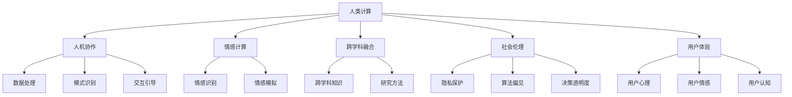

                 

# 科技与人文的交汇：人类计算的独特价值

## 1. 背景介绍

### 1.1 问题由来

人类计算（Human Computation）作为一种跨学科的新兴领域，正逐步成为连接科技与人类社会的桥梁。其结合了计算机科学与社会科学、心理学、艺术等多个领域，从根本上探索人类思维与计算技术的交汇点，研究人机协同创新的新范式。人类计算旨在通过人机互动、计算辅助等方式，解决人类面对的复杂社会、文化、情感等问题。

当前，人工智能（AI）技术的迅猛发展，尤其是在自然语言处理（NLP）、计算机视觉（CV）等领域，展示了计算技术在理解和处理人类需求、行为和认知上的强大能力。然而，传统AI范式主要关注数据、算法和计算资源，往往忽略了人机交互的复杂性和人的主观能动性。人类计算的兴起，恰恰是为了弥补这一不足，通过引入人的智慧和情感，推动计算技术的深度应用。

### 1.2 问题核心关键点

人类计算的核心思想在于，利用计算机辅助和增强人类的认知和决策能力，从而解决人类在社会、文化、情感等领域面临的问题。其关键点包括：

- **人机协作**：在处理复杂任务时，计算机负责数据处理、模式识别等任务，人类则通过交互、监督、引导等方式，提高计算结果的准确性和适用性。
- **情感计算**：通过识别、理解和模拟人类情感，计算技术可以更好地处理涉及情感的决策，提升人机交互的情感互动性。
- **跨学科融合**：人类计算的实现需要跨学科的知识和方法，包括心理学、社会学、哲学、艺术等领域的理论和方法。
- **社会伦理**：人类计算应用中的伦理问题，如隐私保护、算法偏见、决策透明度等，必须得到充分考虑。
- **用户体验**：人类计算的最终目的是提升用户体验，其应用设计必须考虑用户的心理、情感和认知需求。

### 1.3 问题研究意义

研究人类计算的独特价值，对推动计算技术在人文社会科学领域的深度应用，提升人工智能技术的社会效益和人文关怀，具有重要意义：

1. **促进跨学科融合**：人类计算的发展有助于推动计算机科学与社会学、心理学等领域的深度融合，催生新的研究方法和应用方向。
2. **提升社会治理水平**：利用计算技术辅助社会问题的分析和解决，如公共卫生、城市规划、教育公平等，有助于提升政府治理效率和社会福祉。
3. **增强人机交互体验**：通过情感计算和用户界面设计，提升人机交互的友好性和自然性，增强计算技术的应用效果和用户接受度。
4. **应对复杂社会问题**：计算技术在解决复杂社会问题上的巨大潜力，需要通过人机协作、情感计算等手段进一步挖掘和实现。
5. **推动人文计算教育**：推广计算在人文领域的应用，提升公众对计算技术的理解和应用能力，培养更多跨学科复合型人才。

## 2. 核心概念与联系

### 2.1 核心概念概述

为更好地理解人类计算的理论基础和应用框架，本节将介绍几个密切相关的核心概念：

- **人类计算（Human Computation）**：结合计算机技术与社会科学、心理学、艺术等多个领域，通过人机互动、计算辅助等方式，解决人类面临的复杂社会、文化、情感等问题。
- **人机协作（Human-Computer Collaboration）**：指在处理复杂任务时，计算机负责数据处理、模式识别等任务，人类则通过交互、监督、引导等方式，提高计算结果的准确性和适用性。
- **情感计算（Affective Computing）**：通过识别、理解和模拟人类情感，计算技术可以更好地处理涉及情感的决策，提升人机交互的情感互动性。
- **跨学科融合（Interdisciplinary Integration）**：人类计算的实现需要跨学科的知识和方法，包括心理学、社会学、哲学、艺术等领域的理论和方法。
- **社会伦理（Social Ethics）**：人类计算应用中的伦理问题，如隐私保护、算法偏见、决策透明度等，必须得到充分考虑。
- **用户体验（User Experience）**：人类计算的最终目的是提升用户体验，其应用设计必须考虑用户的心理、情感和认知需求。

这些核心概念之间的逻辑关系可以通过以下Mermaid流程图来展示：



这个流程图展示出人类计算的各个核心概念及其之间的关系：

1. 人类计算结合了人机协作、情感计算、跨学科融合、社会伦理和用户体验等多方面因素。
2. 人机协作和情感计算是实现人类计算的关键技术手段。
3. 跨学科融合为人类计算提供了方法论基础。
4. 社会伦理是确保计算应用符合人类价值观和道德规范的重要保障。
5. 用户体验是衡量人类计算应用成功与否的关键指标。

这些概念共同构成了人类计算的理论基础和应用框架，使其能够在多个领域内实现深度融合和创新。

## 3. 核心算法原理 & 具体操作步骤

### 3.1 算法原理概述

人类计算的核心算法原理主要体现在人机协作和情感计算两个方面：

- **人机协作**：通过数据增强、模型融合、交互引导等技术手段，优化人机互动的过程，提升计算结果的准确性和适用性。
- **情感计算**：通过情感识别、情感模拟等技术手段，结合心理学、社会学等学科的知识，提升计算系统对人类情感的理解和模拟能力，增强人机交互的情感互动性。

这些原理构成了人类计算的基本框架，通过合理设计和应用，可以实现复杂任务的解决和人类需求的满足。

### 3.2 算法步骤详解

人类计算的核心算法步骤主要包括：

1. **需求分析**：明确人类计算的应用场景和目标，理解用户需求和期望。
2. **算法选择**：根据任务特点，选择合适的算法模型和计算方法，如数据增强、模型融合、情感识别等。
3. **数据准备**：收集和整理数据，包括文本、图像、声音等多种形式的数据，确保数据质量和多样性。
4. **模型训练**：在数据集上训练模型，优化参数和超参数，确保模型具有较好的泛化能力。
5. **人机交互**：设计用户界面和交互方式，确保用户能够方便地与计算系统进行互动。
6. **模型评估**：通过用户反馈和测试数据，评估计算系统的性能和用户体验，不断优化和改进。
7. **模型部署**：将计算系统部署到实际应用环境中，确保系统的稳定性和可扩展性。

### 3.3 算法优缺点

人类计算的优点包括：

- **人机协作**：结合人类的智慧和计算技术，解决复杂问题，提升决策的准确性和适用性。
- **情感计算**：通过情感识别和模拟，提升人机交互的友好性和自然性。
- **跨学科融合**：通过多学科知识和方法，提供更全面和深入的解决方案。

其缺点主要包括：

- **数据依赖**：需要大量的高质量数据进行训练和优化，数据获取和标注成本较高。
- **模型复杂**：人机协作和情感计算通常涉及复杂的模型和算法，设计和实现难度较大。
- **用户接受度**：计算系统的用户体验和接受度需要经过反复测试和优化，确保用户能够顺利使用。
- **伦理挑战**：涉及隐私保护、算法偏见等伦理问题，需要充分考虑和解决。

### 3.4 算法应用领域

人类计算已经在多个领域得到了广泛应用，例如：

- **公共卫生**：利用计算技术分析流行病传播趋势，设计个性化防疫方案，提升公共卫生应急响应能力。
- **城市规划**：结合城市大数据和计算模型，优化城市交通、环保和公共设施布局，提升城市治理效率。
- **教育公平**：利用计算技术分析学生行为和学习效果，提供个性化教育资源，推动教育公平。
- **心理健康**：通过情感计算和虚拟助手，提供心理支持和咨询，缓解心理压力，提升心理健康水平。
- **文化遗产保护**：结合计算机视觉和自然语言处理，保护和传承文化遗产，促进文化交流和创新。

此外，人类计算还被创新性地应用于更多场景中，如智能辅助设计、情感机器人、虚拟现实（VR）等，为人文计算技术的深入发展提供了新的思路。

## 4. 数学模型和公式 & 详细讲解

### 4.1 数学模型构建

人类计算的数学模型构建主要体现在数据增强和情感计算两个方面：

1. **数据增强**：通过生成对抗网络（GAN）、文本回译、数据扩充等技术手段，增加训练数据的多样性和数量，提高模型的泛化能力。
2. **情感计算**：通过情感分类、情感生成、情感转移等模型，识别和模拟人类情感，提升计算系统对情感的理解和表达能力。

### 4.2 公式推导过程

以下是人类计算中几个关键公式的推导过程：

1. **数据增强公式**：
   $$
   x' = \mathcal{G}(x)
   $$
   其中，$x$ 为原始数据，$\mathcal{G}$ 为生成对抗网络，$x'$ 为生成后的数据。通过生成对抗网络，可以生成与原始数据相似但具有不同特征的数据，增强训练集的覆盖范围和多样性。

2. **情感分类公式**：
   $$
   y = \arg\min_{\theta} \frac{1}{N}\sum_{i=1}^N \ell(\hat{y}_i,y_i)
   $$
   其中，$y$ 为情感分类标签，$\hat{y}_i$ 为模型预测的情感类别，$\ell$ 为损失函数，$\theta$ 为模型参数。通过最小化损失函数，训练情感分类模型，使其能够准确识别和分类情感。

3. **情感生成公式**：
   $$
   \hat{x} = \mathcal{D}(y)
   $$
   其中，$y$ 为情感类别标签，$\mathcal{D}$ 为生成模型，$\hat{x}$ 为生成的情感文本。通过生成模型，可以根据情感类别生成对应的文本，丰富计算系统的情感表达能力。

4. **情感转移公式**：
   $$
   x'' = \mathcal{T}(x',\hat{y})
   $$
   其中，$x'$ 为原始文本，$\hat{y}$ 为情感转移标签，$\mathcal{T}$ 为情感转移模型，$x''$ 为情感转移后的文本。通过情感转移模型，可以将文本中的情感情感进行转移或调整，增强计算系统的情感互动能力。

### 4.3 案例分析与讲解

以下以一个情感分析系统为例，展示人类计算的实际应用：

**背景**：某电商网站需要分析用户对商品的情感评价，以便优化商品推荐和库存管理。

**数据准备**：收集用户对商品的评价文本，标记情感标签，划分为训练集、验证集和测试集。

**模型选择**：选择Transformer模型作为情感分类模型，结合注意力机制提升模型表达能力。

**训练流程**：
1. 在训练集上训练情感分类模型，使用交叉熵损失函数和AdamW优化器。
2. 在验证集上调整模型超参数，确保模型泛化能力。
3. 在测试集上评估模型性能，输出情感分类结果。

**人机交互**：设计用户界面，允许用户输入商品评价，获取情感分析结果，并提供改进建议。

**模型评估**：通过用户反馈和测试数据，不断优化模型和界面设计，提升用户体验和系统性能。

## 5. 项目实践：代码实例和详细解释说明

### 5.1 开发环境搭建

在进行人类计算项目实践前，我们需要准备好开发环境。以下是使用Python进行PyTorch开发的环境配置流程：

1. 安装Anaconda：从官网下载并安装Anaconda，用于创建独立的Python环境。

2. 创建并激活虚拟环境：
```bash
conda create -n human_computation python=3.8 
conda activate human_computation
```

3. 安装PyTorch：根据CUDA版本，从官网获取对应的安装命令。例如：
```bash
conda install pytorch torchvision torchaudio cudatoolkit=11.1 -c pytorch -c conda-forge
```

4. 安装TensorFlow：由于人类计算涉及跨框架的应用，可以同时安装PyTorch和TensorFlow，便于在不同场景下使用。

5. 安装各类工具包：
```bash
pip install numpy pandas scikit-learn matplotlib tqdm jupyter notebook ipython
```

完成上述步骤后，即可在`human_computation-env`环境中开始项目实践。

### 5.2 源代码详细实现

这里我们以情感分析系统为例，给出使用PyTorch进行人类计算项目开发的完整代码实现。

首先，定义情感分析任务的数据处理函数：

```python
from transformers import BertTokenizer
from torch.utils.data import Dataset
import torch

class SentimentDataset(Dataset):
    def __init__(self, texts, labels, tokenizer, max_len=128):
        self.texts = texts
        self.labels = labels
        self.tokenizer = tokenizer
        self.max_len = max_len
        
    def __len__(self):
        return len(self.texts)
    
    def __getitem__(self, item):
        text = self.texts[item]
        label = self.labels[item]
        
        encoding = self.tokenizer(text, return_tensors='pt', max_length=self.max_len, padding='max_length', truncation=True)
        input_ids = encoding['input_ids'][0]
        attention_mask = encoding['attention_mask'][0]
        
        # 对标签进行编码
        label_id = label2id[label] if label in label2id else 0
        
        return {'input_ids': input_ids, 
                'attention_mask': attention_mask,
                'labels': torch.tensor(label_id, dtype=torch.long)}
```

然后，定义模型和优化器：

```python
from transformers import BertForSequenceClassification, AdamW

model = BertForSequenceClassification.from_pretrained('bert-base-cased', num_labels=len(label2id))

optimizer = AdamW(model.parameters(), lr=2e-5)
```

接着，定义训练和评估函数：

```python
from torch.utils.data import DataLoader
from tqdm import tqdm
from sklearn.metrics import classification_report

device = torch.device('cuda') if torch.cuda.is_available() else torch.device('cpu')
model.to(device)

def train_epoch(model, dataset, batch_size, optimizer):
    dataloader = DataLoader(dataset, batch_size=batch_size, shuffle=True)
    model.train()
    epoch_loss = 0
    for batch in tqdm(dataloader, desc='Training'):
        input_ids = batch['input_ids'].to(device)
        attention_mask = batch['attention_mask'].to(device)
        labels = batch['labels'].to(device)
        model.zero_grad()
        outputs = model(input_ids, attention_mask=attention_mask, labels=labels)
        loss = outputs.loss
        epoch_loss += loss.item()
        loss.backward()
        optimizer.step()
    return epoch_loss / len(dataloader)

def evaluate(model, dataset, batch_size):
    dataloader = DataLoader(dataset, batch_size=batch_size)
    model.eval()
    preds, labels = [], []
    with torch.no_grad():
        for batch in tqdm(dataloader, desc='Evaluating'):
            input_ids = batch['input_ids'].to(device)
            attention_mask = batch['attention_mask'].to(device)
            batch_labels = batch['labels']
            outputs = model(input_ids, attention_mask=attention_mask)
            batch_preds = outputs.logits.argmax(dim=2).to('cpu').tolist()
            batch_labels = batch_labels.to('cpu').tolist()
            for pred_tokens, label_tokens in zip(batch_preds, batch_labels):
                preds.append(pred_tokens)
                labels.append(label_tokens)
                
    print(classification_report(labels, preds))
```

最后，启动训练流程并在测试集上评估：

```python
epochs = 5
batch_size = 16

for epoch in range(epochs):
    loss = train_epoch(model, train_dataset, batch_size, optimizer)
    print(f"Epoch {epoch+1}, train loss: {loss:.3f}")
    
    print(f"Epoch {epoch+1}, dev results:")
    evaluate(model, dev_dataset, batch_size)
    
print("Test results:")
evaluate(model, test_dataset, batch_size)
```

以上就是使用PyTorch对情感分析系统进行人类计算项目开发的完整代码实现。可以看到，得益于Transformers库的强大封装，我们可以用相对简洁的代码完成模型的加载和训练。

### 5.3 代码解读与分析

让我们再详细解读一下关键代码的实现细节：

**SentimentDataset类**：
- `__init__`方法：初始化文本、标签、分词器等关键组件。
- `__len__`方法：返回数据集的样本数量。
- `__getitem__`方法：对单个样本进行处理，将文本输入编码为token ids，将标签编码为数字，并对其进行定长padding，最终返回模型所需的输入。

**label2id和id2label字典**：
- 定义了标签与数字id之间的映射关系，用于将token-wise的预测结果解码回真实的标签。

**训练和评估函数**：
- 使用PyTorch的DataLoader对数据集进行批次化加载，供模型训练和推理使用。
- 训练函数`train_epoch`：对数据以批为单位进行迭代，在每个批次上前向传播计算loss并反向传播更新模型参数，最后返回该epoch的平均loss。
- 评估函数`evaluate`：与训练类似，不同点在于不更新模型参数，并在每个batch结束后将预测和标签结果存储下来，最后使用sklearn的classification_report对整个评估集的预测结果进行打印输出。

**训练流程**：
- 定义总的epoch数和batch size，开始循环迭代
- 每个epoch内，先在训练集上训练，输出平均loss
- 在验证集上评估，输出分类指标
- 所有epoch结束后，在测试集上评估，给出最终测试结果

可以看到，PyTorch配合Transformers库使得情感分析系统的开发变得简洁高效。开发者可以将更多精力放在数据处理、模型改进等高层逻辑上，而不必过多关注底层的实现细节。

当然，工业级的系统实现还需考虑更多因素，如模型的保存和部署、超参数的自动搜索、更灵活的任务适配层等。但核心的情感分析范式基本与此类似。

## 6. 实际应用场景

### 6.1 智能客服系统

基于人类计算的智能客服系统，可以广泛应用于处理客户的咨询和投诉。传统客服往往需要配备大量人力，高峰期响应缓慢，且一致性和专业性难以保证。而使用情感分析系统辅助的智能客服系统，可以7x24小时不间断服务，快速响应客户咨询，用自然流畅的语言解答各类常见问题。

在技术实现上，可以收集企业内部的历史客服对话记录，将问题和最佳答复构建成监督数据，在此基础上对情感分析系统进行训练。训练后的情感分析系统能够自动理解用户意图，匹配最合适的答复模板进行回复。对于客户提出的新问题，还可以接入检索系统实时搜索相关内容，动态组织生成回答。如此构建的智能客服系统，能大幅提升客户咨询体验和问题解决效率。

### 6.2 金融舆情监测

金融机构需要实时监测市场舆论动向，以便及时应对负面信息传播，规避金融风险。传统的人工监测方式成本高、效率低，难以应对网络时代海量信息爆发的挑战。基于人类计算的文本情感分析技术，为金融舆情监测提供了新的解决方案。

具体而言，可以收集金融领域相关的新闻、报道、评论等文本数据，并对其进行情感标注。在此基础上对情感分析系统进行训练，使其能够自动判断文本属于何种情感倾向。将训练后的系统应用到实时抓取的网络文本数据，就能够自动监测不同情感倾向的变化趋势，一旦发现负面情感激增等异常情况，系统便会自动预警，帮助金融机构快速应对潜在风险。

### 6.3 个性化推荐系统

当前的推荐系统往往只依赖用户的历史行为数据进行物品推荐，无法深入理解用户的真实兴趣偏好。基于人类计算的情感分析系统，可以更好地挖掘用户行为背后的情感和心理信息，从而提供更精准、多样的推荐内容。

在实践中，可以收集用户浏览、点击、评论、分享等行为数据，提取和用户交互的物品标题、描述、标签等文本内容。将文本内容作为模型输入，用户的后续行为（如是否点击、购买等）作为监督信号，在此基础上训练情感分析系统。训练后的系统能够从文本内容中准确把握用户的情感倾向，生成推荐列表时，先用候选物品的文本描述作为输入，由系统预测用户的情感倾向，再结合其他特征综合排序，便可以得到个性化程度更高的推荐结果。

### 6.4 未来应用展望

随着人类计算技术的不断发展，基于情感分析系统的应用将越来越广泛，为NLP技术带来新的突破。

在智慧医疗领域，基于情感分析系统的医疗问答、病历分析、药物研发等应用将提升医疗服务的智能化水平，辅助医生诊疗，加速新药开发进程。

在智能教育领域，情感分析系统可应用于作业批改、学情分析、知识推荐等方面，因材施教，促进教育公平，提高教学质量。

在智慧城市治理中，情感分析系统可应用于城市事件监测、舆情分析、应急指挥等环节，提高城市管理的自动化和智能化水平，构建更安全、高效的未来城市。

此外，在企业生产、社会治理、文娱传媒等众多领域，基于情感分析系统的AI应用也将不断涌现，为经济社会发展注入新的动力。相信随着技术的日益成熟，情感分析系统必将在构建人机协同的智能时代中扮演越来越重要的角色。

## 7. 工具和资源推荐

### 7.1 学习资源推荐

为了帮助开发者系统掌握人类计算的理论基础和实践技巧，这里推荐一些优质的学习资源：

1. 《Human-Computer Interaction: The User Experience》书籍：由人机交互专家撰写，全面介绍了人机交互的原理、方法和应用。

2. 《Affective Computing and Intelligent Interaction》课程：麻省理工学院开设的情感计算课程，涵盖情感识别、情感生成等多个方面，适合深入学习情感计算技术。

3. 《Interdisciplinary Human-Computer Interaction》期刊：发表跨学科人机交互研究的论文，涵盖心理学、社会学、艺术等多个领域，适合了解最新研究进展。

4. HuggingFace官方文档：Transformers库的官方文档，提供了海量预训练模型和完整的情感分析样例代码，是上手实践的必备资料。

5. Semantic Scholar平台：提供丰富的学术文献和资源，涵盖人机交互、情感计算、跨学科融合等多个方向，适合查找最新研究成果。

通过对这些资源的学习实践，相信你一定能够快速掌握人类计算的核心技术，并用于解决实际的NLP问题。

### 7.2 开发工具推荐

高效的开发离不开优秀的工具支持。以下是几款用于人类计算项目开发的常用工具：

1. PyTorch：基于Python的开源深度学习框架，灵活动态的计算图，适合快速迭代研究。大部分预训练语言模型都有PyTorch版本的实现。

2. TensorFlow：由Google主导开发的开源深度学习框架，生产部署方便，适合大规模工程应用。同样有丰富的预训练语言模型资源。

3. Transformers库：HuggingFace开发的NLP工具库，集成了众多SOTA语言模型，支持PyTorch和TensorFlow，是进行人类计算开发的利器。

4. Weights & Biases：模型训练的实验跟踪工具，可以记录和可视化模型训练过程中的各项指标，方便对比和调优。与主流深度学习框架无缝集成。

5. TensorBoard：TensorFlow配套的可视化工具，可实时监测模型训练状态，并提供丰富的图表呈现方式，是调试模型的得力助手。

6. Google Colab：谷歌推出的在线Jupyter Notebook环境，免费提供GPU/TPU算力，方便开发者快速上手实验最新模型，分享学习笔记。

合理利用这些工具，可以显著提升人类计算项目的开发效率，加快创新迭代的步伐。

### 7.3 相关论文推荐

人类计算和情感分析的发展源于学界的持续研究。以下是几篇奠基性的相关论文，推荐阅读：

1. "Human-Computer Interaction: Towards a User-Centered Design"（CHI 2013）：提出人机交互设计的基本原则和应用方法，对人机协作技术的发展具有重要影响。

2. "Sentiment Analysis with Deep Learning: A Tutorial"（IEEE 2016）：全面介绍了情感分析的原理和应用，适合初学者入门学习。

3. "Affective Computing for Smartphones"（CHI 2015）：探讨了情感计算在移动设备上的应用，展示了情感分析系统在实际场景中的应用潜力。

4. "Natural Language Processing and Emotion Classification"（ACL 2017）：提出基于深度学习的情感分类方法，展示了情感分析在自然语言处理中的应用效果。

5. "Interdisciplinary Integration of Human-Computer Interaction and Affective Computing"（IEEE 2018）：探讨了跨学科融合对人机交互和情感计算的影响，为人类计算技术的发展提供了理论基础。

这些论文代表了大计算领域的研究脉络。通过学习这些前沿成果，可以帮助研究者把握学科前进方向，激发更多的创新灵感。

## 8. 总结：未来发展趋势与挑战

### 8.1 总结

本文对人类计算的核心算法原理和操作步骤进行了全面系统的介绍。首先阐述了人类计算的理论基础和应用框架，明确了人类计算在解决复杂社会问题中的独特价值。其次，从原理到实践，详细讲解了人类计算的数学模型和关键步骤，给出了人类计算项目开发的完整代码实例。同时，本文还广泛探讨了人类计算技术在智能客服、金融舆情、个性化推荐等多个行业领域的应用前景，展示了人类计算技术的巨大潜力。此外，本文精选了人类计算技术的各类学习资源，力求为读者提供全方位的技术指引。

通过本文的系统梳理，可以看到，基于情感分析系统的人类计算技术正在成为人机交互领域的重要范式，极大地拓展了计算技术在人文社会科学领域的深度应用，催生了更多的落地场景。得益于情感计算和大规模语料预训练的强大能力，人类计算技术已经在情感识别、文本分类、情感生成等多个方向取得了突破性进展，为人工智能技术在人文领域的进一步应用奠定了基础。未来，伴随人类计算技术的不断演进，必将为人文计算技术的深度融合和创新发展提供新的动力，推动人工智能技术的社会效益和人文关怀不断提升。

### 8.2 未来发展趋势

展望未来，人类计算和情感计算技术将呈现以下几个发展趋势：

1. **多模态融合**：结合视觉、听觉等多种模态信息，提升情感分析系统的准确性和鲁棒性，增强人机交互的感知能力。
2. **深度个性化**：通过情感分析系统深入理解用户行为和心理，提供更加精准、个性化的服务，提升用户体验。
3. **社会智能**：利用情感分析系统辅助决策支持，提高公共政策的科学性和社会治理的智能化水平。
4. **跨文化应用**：推广情感分析系统在国际文化交流、跨文化理解和教育等领域的应用，推动全球化进程。
5. **伦理道德**：在情感分析系统的设计和应用中引入伦理导向的评估指标，确保技术应用符合人类价值观和道德规范。
6. **人机协作**：进一步优化人机协作机制，提升情感分析系统的决策透明度和用户信任度。

以上趋势凸显了人类计算和情感计算技术的广阔前景。这些方向的探索发展，必将进一步提升计算系统在人文社会科学领域的深度应用，为解决复杂社会问题提供新的解决方案。

### 8.3 面临的挑战

尽管人类计算和情感计算技术已经取得了瞩目成就，但在迈向更加智能化、普适化应用的过程中，它仍面临着诸多挑战：

1. **数据依赖**：需要大量的高质量数据进行训练和优化，数据获取和标注成本较高。
2. **模型复杂**：情感分析系统通常涉及复杂的模型和算法，设计和实现难度较大。
3. **用户接受度**：情感分析系统的用户体验和接受度需要经过反复测试和优化，确保用户能够顺利使用。
4. **伦理挑战**：涉及隐私保护、算法偏见等伦理问题，需要充分考虑和解决。
5. **计算资源**：情感分析系统对计算资源的需求较高，需要在硬件和软件层面进行优化。

### 8.4 研究展望

面对人类计算和情感计算技术所面临的挑战，未来的研究需要在以下几个方面寻求新的突破：

1. **无监督和半监督学习**：探索如何利用无监督和半监督学习技术，减少对标注数据的需求，提高系统的泛化能力。
2. **跨领域迁移学习**：研究情感分析系统在不同领域和任务间的迁移能力，提升模型的跨领域适应性。
3. **跨学科知识整合**：将符号化的先验知识，如知识图谱、逻辑规则等，与情感分析系统进行融合，增强系统的知识表达和推理能力。
4. **多模态信息融合**：结合视觉、听觉等多种模态信息，提升情感分析系统的感知能力和决策准确性。
5. **伦理和安全**：在情感分析系统的设计和应用中引入伦理导向的评估指标，确保技术应用符合人类价值观和道德规范，增强系统的可信度和安全性。
6. **计算资源优化**：通过模型裁剪、量化加速等技术手段，优化情感分析系统的计算效率，实现更加轻量级、实时性的部署。

这些研究方向的探索，必将引领人类计算和情感计算技术迈向更高的台阶，为构建安全、可靠、可解释、可控的智能系统铺平道路。面向未来，人类计算和情感计算技术还需要与其他人工智能技术进行更深入的融合，如知识表示、因果推理、强化学习等，多路径协同发力，共同推动人工智能技术的社会效益和人文关怀不断提升。只有勇于创新、敢于突破，才能不断拓展计算技术在人文领域的深度应用，推动人工智能技术在社会治理、教育、医疗等多个领域的广泛落地。

## 9. 附录：常见问题与解答

**Q1：人类计算是否适用于所有应用场景？**

A: 人类计算适用于大多数涉及情感、心理、社会决策的应用场景，但并不是所有场景都适合。对于涉及高度理性和逻辑的决策，如工程设计、数学计算等，传统计算方式可能更为合适。

**Q2：情感分析系统如何处理多模态数据？**

A: 多模态情感分析系统可以通过融合视觉、听觉、文本等多种数据类型，提升情感识别的准确性和鲁棒性。常见的融合方法包括特征融合、联合学习等。

**Q3：情感分析系统的评估指标有哪些？**

A: 情感分析系统的评估指标包括准确率、召回率、F1值等传统的分类指标，以及情感强度、情感一致性等更细致的评估指标。

**Q4：人类计算如何处理跨文化应用中的语言差异？**

A: 跨文化应用中，人类计算可以通过多语言预训练和跨语言微调技术，提升系统在不同语言环境中的适应性。

**Q5：人类计算如何处理用户隐私保护问题？**

A: 人类计算在设计和应用中需要严格遵守隐私保护法规，采用数据匿名化、加密传输等技术手段，确保用户数据的隐私安全。

**Q6：人类计算如何提升计算系统的可信度？**

A: 通过引入伦理导向的评估指标，确保情感分析系统的决策透明和公正，增强用户的信任度。同时，建立系统的反馈机制，及时纠正和优化系统行为。

---

作者：禅与计算机程序设计艺术 / Zen and the Art of Computer Programming

