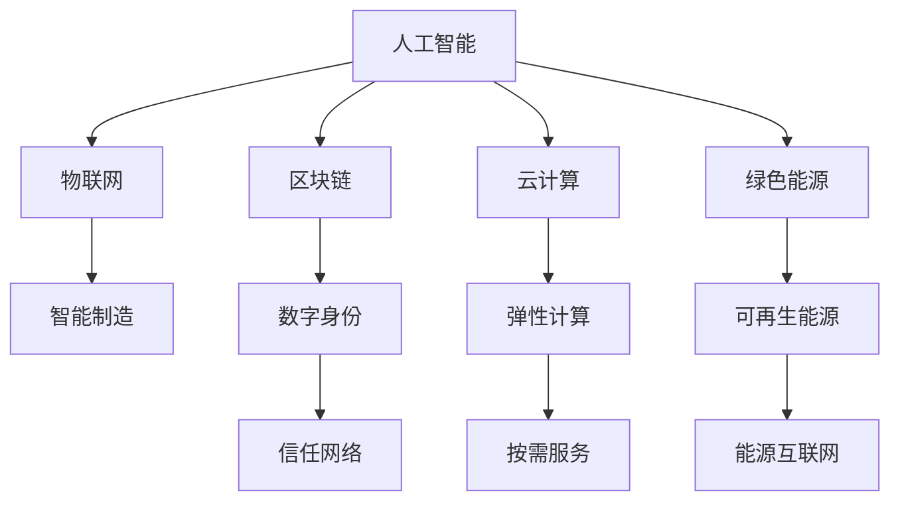
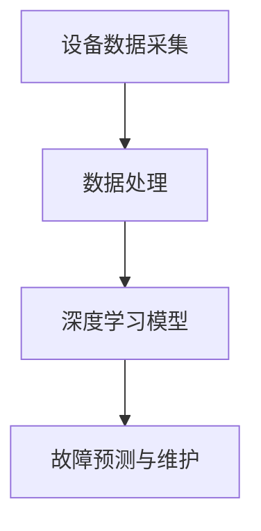
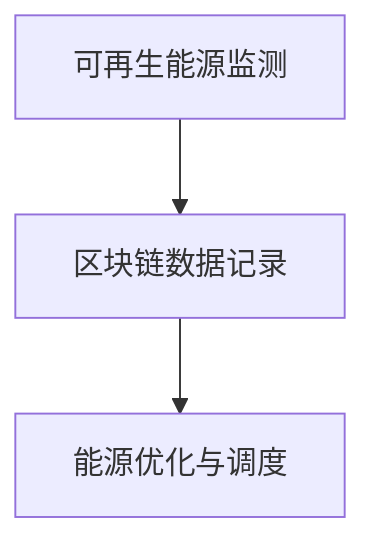

                 

# 科技向善：用科技的力量解决社会问题

> 关键词：科技伦理,社会问题,人工智能,可持续发展,区块链,物联网,云计算,绿色能源

## 1. 背景介绍

### 1.1 问题由来

随着科技的迅猛发展，人工智能、物联网、区块链等新技术正在深刻改变我们的社会生活。然而，在带来便捷与高效的同时，科技发展也带来了诸多社会问题。从数据隐私到网络安全，从自动化就业到算法偏见，科技与社会的和谐共生正面临前所未有的挑战。

当前，科技伦理和社会责任已经成为全球科技发展的重要议题。如何平衡创新与责任，让科技服务于社会，推动可持续发展，成为摆在科技工作者面前的重要课题。

### 1.2 问题核心关键点

科技向善的核心理念在于：科技应当以人为本，注重社会影响，追求可持续发展的长远目标。其主要包括以下几个关键点：

1. **伦理导向**：科技开发应遵循道德规范，确保产品和服务的使用不损害用户权益，促进社会公平。
2. **隐私保护**：科技应用需重视用户隐私，避免数据滥用，确保信息安全。
3. **透明性与可解释性**：科技产品应具备高度透明性，能够解释其决策过程，增强用户信任。
4. **公平与公正**：科技应用需关注边缘群体，避免算法偏见，促进社会包容。
5. **可持续发展**：科技发展应注重环境友好，支持绿色能源和资源循环利用。

本文将聚焦于科技向善的理念，探讨如何用科技力量解决社会问题，特别是在人工智能、区块链、物联网、云计算和绿色能源等领域的应用。

## 2. 核心概念与联系

### 2.1 核心概念概述

为更好地理解科技向善的实现路径，本节将介绍几个密切相关的核心概念：

- **人工智能(AI)**：以算法、计算和数据为基础，通过模拟人类智能实现任务处理的技术。
- **物联网(IoT)**：将各种传感器和设备连接起来，实现物与物的智能互联。
- **区块链(Blockchain)**：一种去中心化的分布式账本技术，用于安全记录和共享数据。
- **云计算(Cloud Computing)**：通过网络提供可伸缩的计算资源和数据存储服务。
- **绿色能源(Green Energy)**：利用可再生资源，如太阳能、风能等，减少对化石燃料的依赖，保护环境。

这些核心概念之间的逻辑关系可以通过以下Mermaid流程图来展示：



这个流程图展示了几大技术之间的关联：

1. **人工智能**：在物联网、区块链、云计算和绿色能源等多个领域中都有广泛应用，促进智能化转型。
2. **物联网**：通过人工智能技术实现智能设备间的互联和协同工作，推动智能制造、智慧城市等应用。
3. **区块链**：利用分布式技术，提供透明、可信的数据记录和共享机制，应用于数字身份验证、供应链管理等。
4. **云计算**：为人工智能、物联网、区块链等技术提供基础设施支撑，实现按需计算和资源共享。
5. **绿色能源**：通过物联网和区块链技术实现可再生能源的高效管理和共享，推动可持续发展。

这些概念共同构成了科技向善的基础框架，为解决社会问题提供了技术手段。

## 3. 核心算法原理 & 具体操作步骤

### 3.1 算法原理概述

科技向善的核心算法原理主要包括：

- **机器学习与深度学习**：利用数据训练模型，实现自动化的任务处理和决策支持。
- **自然语言处理(NLP)**：使计算机能够理解和处理人类语言，实现智能对话、情感分析等。
- **计算机视觉(CV)**：使计算机能够识别和理解图像和视频内容，应用于自动驾驶、医学影像分析等。
- **物联网数据处理**：收集和分析设备产生的数据，实现智能控制和优化。
- **区块链共识算法**：通过去中心化的共识机制，确保数据记录的安全和透明。
- **云计算资源管理**：优化计算资源分配，提高系统性能和可用性。
- **绿色能源优化**：通过数据分析和控制策略，实现能源的高效利用和环境保护。

这些算法和技术原理共同构成了科技向善的底层逻辑，为解决社会问题提供了技术支撑。

### 3.2 算法步骤详解

科技向善的实现步骤主要包括以下几个关键环节：

**Step 1: 问题识别与分析**

- 确定需要解决的社会问题，如环境保护、医疗健康、教育公平等。
- 分析问题的根本原因和关键因素，如数据不足、资源分配不公、决策透明度低等。

**Step 2: 技术需求与方案设计**

- 根据问题分析结果，确定所需的技术方案，如使用人工智能进行数据处理，利用区块链提高透明度等。
- 设计详细的技术实现路径，包括数据获取、模型训练、系统集成等。

**Step 3: 模型训练与优化**

- 收集和清洗相关数据，进行特征工程和数据预处理。
- 选择合适的算法和模型，进行训练和优化，确保模型性能和泛化能力。
- 引入正则化、对抗训练等技术，提高模型的鲁棒性和可解释性。

**Step 4: 系统集成与部署**

- 将训练好的模型集成到实际应用中，与相关系统进行接口对接。
- 进行系统测试和调试，确保系统稳定性和性能。
- 部署系统到生产环境，监控运行状态，进行持续优化。

**Step 5: 效果评估与反馈**

- 收集用户反馈和系统运行数据，评估模型效果和社会影响。
- 根据评估结果，进行模型迭代和优化，不断提升系统性能。
- 定期发布评估报告，公开技术进展和社会影响，接受社会监督。

通过这些步骤，科技向善的目标可以实现从技术设计到实际应用的全程优化。

### 3.3 算法优缺点

科技向善的算法技术具有以下优点：

1. **高效性**：利用自动化技术，大幅提升任务处理效率，降低人力成本。
2. **精确性**：通过数据分析和模型优化，提高决策的科学性和准确性。
3. **透明性**：实现系统流程和决策过程的可视化，增强用户和公众的信任。
4. **可扩展性**：借助云计算等基础设施，实现系统规模的灵活扩展。
5. **可持续性**：利用绿色能源和资源循环技术，实现环境友好的发展目标。

同时，这些技术也存在一些局限性：

1. **数据依赖性**：需要大量的高质量数据支持，数据不足会影响模型性能。
2. **隐私风险**：数据收集和处理过程中可能涉及隐私问题，需确保数据安全。
3. **算法偏见**：模型训练数据可能存在偏差，需注意避免算法偏见。
4. **复杂性**：部分技术实现复杂，需具备较强的技术背景和经验。
5. **成本高昂**：部分技术部署和维护成本较高，需投入大量资源。

## 4. 数学模型和公式 & 详细讲解 & 举例说明

### 4.1 数学模型构建

本节将使用数学语言对科技向善的相关算法进行更加严格的刻画。

**人工智能算法**：

设训练样本数据为 $D=\{(x_i,y_i)\}_{i=1}^N$，其中 $x_i$ 为输入，$y_i$ 为标签。目标是将模型 $M_{\theta}$ 拟合到训练数据上，最小化损失函数 $\mathcal{L}(\theta)$：

$$
\mathcal{L}(\theta) = \frac{1}{N}\sum_{i=1}^N \ell(M_{\theta}(x_i),y_i)
$$

其中 $\ell$ 为损失函数，如均方误差、交叉熵等。

**物联网数据处理**：

设传感器节点数为 $N$，采样时间为 $t$，采集数据为 $x_t$。目标是对数据进行去噪、降维和聚类处理，得到新的数据表示 $z_t$。可以使用PCA（主成分分析）算法实现降维，目标函数为：

$$
\min_{z_t} \sum_{i=1}^N \|x_i-z_i\|^2_2
$$

**区块链共识算法**：

设节点数为 $N$，交易数为 $T$。共识算法需确保所有节点达成一致，避免双花攻击。常用的共识算法包括PoW（工作量证明）、PoS（权益证明）等。共识过程可以看作是求解优化问题：

$$
\min_{b} \sum_{i=1}^N |b_i-b|_1
$$

其中 $b$ 为目标共识结果，$b_i$ 为节点 $i$ 的共识结果。

### 4.2 公式推导过程

以下我们以深度学习模型训练为例，推导其中的核心算法步骤。

**深度学习训练过程**：

设深度学习模型为 $M_{\theta}=\{h_l, \theta_l\}_{l=1}^L$，其中 $h_l$ 为第 $l$ 层的神经网络，$\theta_l$ 为对应的权重参数。目标是通过训练数据 $D$ 更新模型参数 $\theta$：

$$
\theta \leftarrow \theta - \eta \nabla_{\theta}\mathcal{L}(\theta)
$$

其中 $\eta$ 为学习率，$\nabla_{\theta}\mathcal{L}(\theta)$ 为损失函数对参数 $\theta$ 的梯度。通过反向传播算法，计算梯度并更新模型参数。

**区块链共识过程**：

设节点数为 $N$，交易数为 $T$。共识算法需确保所有节点达成一致，避免双花攻击。常用的共识算法包括PoW（工作量证明）、PoS（权益证明）等。共识过程可以看作是求解优化问题：

$$
\min_{b} \sum_{i=1}^N |b_i-b|_1
$$

其中 $b$ 为目标共识结果，$b_i$ 为节点 $i$ 的共识结果。通过迭代计算，不断更新共识结果，直到所有节点达成一致。

### 4.3 案例分析与讲解

**智能制造系统**：

在智能制造领域，通过物联网技术收集设备运行数据，使用深度学习模型进行故障预测和维护。系统整体架构如下：



系统具体实现步骤如下：

1. 通过传感器收集设备运行数据，如温度、振动、电流等。
2. 对数据进行去噪、降维和特征提取，使用PCA算法实现降维，得到新的数据表示。
3. 使用深度学习模型对数据进行分析，实现故障预测和维护。

**绿色能源管理**：

在绿色能源管理领域，通过物联网技术实时监测太阳能、风能等可再生能源的运行状态，使用区块链技术进行数据记录和共享。系统整体架构如下：



系统具体实现步骤如下：

1. 通过物联网技术实时监测可再生能源的运行状态，如发电功率、储能状态等。
2. 使用区块链技术对监测数据进行记录和共享，确保数据的安全和透明。
3. 使用优化算法对数据进行分析，实现能源的高效利用和调度。

## 5. 项目实践：代码实例和详细解释说明

### 5.1 开发环境搭建

在进行科技向善的项目实践前，我们需要准备好开发环境。以下是使用Python进行项目开发的环境配置流程：

1. 安装Anaconda：从官网下载并安装Anaconda，用于创建独立的Python环境。

2. 创建并激活虚拟环境：
```bash
conda create -n project-env python=3.8 
conda activate project-env
```

3. 安装必要的Python包和工具：
```bash
pip install numpy pandas scikit-learn torch torchvision transformers
```

4. 安装相关的开发工具：
```bash
pip install jupyter notebook pycharm
```

完成上述步骤后，即可在`project-env`环境中开始项目实践。

### 5.2 源代码详细实现

这里我们以智能制造系统为例，给出使用深度学习模型进行故障预测的PyTorch代码实现。

首先，定义深度学习模型：

```python
import torch
import torch.nn as nn
import torch.nn.functional as F

class Net(nn.Module):
    def __init__(self):
        super(Net, self).__init__()
        self.fc1 = nn.Linear(8, 64)
        self.fc2 = nn.Linear(64, 1)
        
    def forward(self, x):
        x = F.relu(self.fc1(x))
        x = self.fc2(x)
        return x

model = Net()
model.to('cuda')
```

然后，定义训练函数：

```python
def train(model, data_loader, epochs, lr):
    optimizer = torch.optim.Adam(model.parameters(), lr=lr)
    for epoch in range(epochs):
        for data, target in data_loader:
            data, target = data.to('cuda'), target.to('cuda')
            optimizer.zero_grad()
            output = model(data)
            loss = F.mse_loss(output, target)
            loss.backward()
            optimizer.step()
```

接着，定义测试函数：

```python
def test(model, data_loader):
    model.eval()
    correct = 0
    total = 0
    with torch.no_grad():
        for data, target in data_loader:
            data, target = data.to('cuda'), target.to('cuda')
            output = model(data)
            _, predicted = torch.max(output.data, 1)
            total += target.size(0)
            correct += (predicted == target).sum().item()
    return correct / total
```

最后，启动训练流程：

```python
from torch.utils.data import DataLoader
from sklearn.datasets import make_regression

# 生成训练数据
X, y = make_regression(n_samples=1000, n_features=8, n_informative=8, noise=0.1)

# 数据预处理
X = torch.from_numpy(X).float()
y = torch.from_numpy(y).float()

# 划分训练集和测试集
train_data, test_data = torch.utils.data.random_split(X, [800, 200])

# 创建数据加载器
train_loader = DataLoader(train_data, batch_size=32, shuffle=True)
test_loader = DataLoader(test_data, batch_size=32)

# 训练模型
train(model, train_loader, epochs=10, lr=0.001)

# 测试模型
test_acc = test(model, test_loader)
print(f'Test Accuracy: {test_acc:.3f}')
```

以上就是使用PyTorch进行深度学习模型训练的完整代码实现。可以看到，利用Python的科学计算库和深度学习框架，可以方便地实现模型的训练和测试。

### 5.3 代码解读与分析

让我们再详细解读一下关键代码的实现细节：

**Net类**：
- `__init__`方法：初始化深度学习模型，包括定义全连接层。
- `forward`方法：定义前向传播过程，包括激活函数和输出层。

**train函数**：
- 定义优化器和学习率。
- 在每个epoch内，对训练集数据进行迭代训练。
- 在每个batch内，将数据和目标标签送到GPU进行计算。
- 计算损失函数，反向传播更新模型参数。

**test函数**：
- 将模型设为评估模式。
- 在测试集上迭代测试数据，计算预测准确率。

**主程序**：
- 生成随机数据集。
- 对数据进行预处理，划分训练集和测试集。
- 创建数据加载器，方便数据迭代。
- 训练模型并测试性能。

可以看到，这些代码虽然只是深度学习模型的简单实现，但其中包含了模型设计、数据处理、优化器选择、损失函数计算等关键步骤。通过这些步骤，可以实现深度学习模型的高效训练和推理。

## 6. 实际应用场景

### 6.1 智能制造

在智能制造领域，利用科技向善的理念，通过物联网和深度学习技术，可以实现智能设备的状态监测和预测维护，大幅提高生产效率和设备利用率。具体应用场景包括：

- **设备状态监测**：通过传感器收集设备的运行数据，如温度、振动、电流等，实时监测设备状态。
- **故障预测与诊断**：利用深度学习模型对监测数据进行分析，实现故障预测和诊断。
- **预防性维护**：根据故障预测结果，提前进行维护，避免设备故障。

这些应用不仅提高了生产效率，还降低了设备维护成本，推动了制造业的智能化转型。

### 6.2 智慧城市

在智慧城市建设中，利用科技向善的理念，通过物联网和区块链技术，可以实现城市管理的智能化和透明化。具体应用场景包括：

- **城市事件监测**：通过传感器和摄像头，实时监测城市中的各种事件，如交通拥堵、环境污染等。
- **数据记录与共享**：利用区块链技术，确保数据记录的透明和可信。
- **智能调度与控制**：根据监测数据，进行智能调度，优化城市资源配置。

这些应用不仅提高了城市管理效率，还增强了城市管理的透明度，提升了市民的幸福感和安全感。

### 6.3 环境保护

在环境保护领域，利用科技向善的理念，通过物联网和绿色能源技术，可以实现资源的循环利用和环境保护。具体应用场景包括：

- **可再生能源监测**：通过物联网技术实时监测太阳能、风能等可再生能源的运行状态。
- **能源优化与调度**：利用优化算法对数据进行分析，实现能源的高效利用和调度。
- **环境监测与保护**：通过传感器监测环境污染，采取措施进行保护。

这些应用不仅提高了能源利用效率，还保护了环境，推动了绿色发展。

### 6.4 未来应用展望

随着科技向善理念的深入实践，未来科技将更多地应用于解决社会问题，推动社会进步。以下列举几个未来应用展望：

1. **医疗健康**：利用深度学习技术，实现疾病预测、诊断和治疗，提升医疗服务质量。
2. **教育公平**：通过个性化推荐系统，实现教育的公平与个性化，提高教育质量。
3. **社会治理**：利用区块链技术，实现数据记录和共享，提升政府治理效率。
4. **环境保护**：通过物联网技术，实现资源的循环利用和环境保护，推动绿色发展。
5. **数字身份**：利用区块链技术，实现身份验证和数据安全，保障用户隐私。

## 7. 工具和资源推荐

### 7.1 学习资源推荐

为了帮助开发者系统掌握科技向善的理念和实践，这里推荐一些优质的学习资源：

1. **《AI伦理》系列课程**：由斯坦福大学、麻省理工学院等顶尖高校开设的课程，探讨人工智能的伦理和社会影响。
2. **《区块链技术与应用》课程**：由区块链领域专家开设的课程，介绍区块链的基础知识和应用案例。
3. **《物联网与智能制造》课程**：由工业界专家开设的课程，介绍物联网技术在制造业中的应用。
4. **《绿色能源管理》书籍**：介绍绿色能源的开发、管理和应用，推动可持续发展的实用指南。
5. **《人工智能伦理与社会》书籍**：探讨人工智能的伦理和社会影响，提出科技向善的实现路径。

通过对这些资源的学习实践，相信你一定能够系统掌握科技向善的理念和实践技巧，并用于解决实际的科技和社会问题。

### 7.2 开发工具推荐

高效的开发离不开优秀的工具支持。以下是几款用于科技向善开发的常用工具：

1. **PyTorch**：基于Python的开源深度学习框架，灵活动态的计算图，适合快速迭代研究。
2. **TensorFlow**：由Google主导开发的开源深度学习框架，生产部署方便，适合大规模工程应用。
3. **HuggingFace Transformers库**：提供了大量预训练语言模型，方便微调和应用。
4. **Jupyter Notebook**：开源的交互式计算环境，方便进行数据处理、模型训练和结果展示。
5. **PyCharm**：Python IDE，提供了强大的代码编辑器和调试工具，支持丰富的科学计算库。
6. **Visual Studio Code**：轻量级编辑器，支持Python、JavaScript等多种语言，适合开发复杂项目。

合理利用这些工具，可以显著提升科技向善的开发效率，加快创新迭代的步伐。

### 7.3 相关论文推荐

科技向善的发展源于学界的持续研究。以下是几篇奠基性的相关论文，推荐阅读：

1. **《人工智能伦理与社会影响》**：探讨人工智能的伦理和社会影响，提出科技向善的理念。
2. **《区块链技术与安全》**：介绍区块链技术的基础知识和应用，探讨数据安全和隐私保护。
3. **《物联网与智能制造》**：介绍物联网技术在制造业中的应用，推动制造业的智能化转型。
4. **《绿色能源管理与优化》**：介绍绿色能源的开发、管理和应用，推动可持续发展的实践。
5. **《深度学习在医疗健康中的应用》**：探讨深度学习技术在医疗健康中的应用，提升医疗服务质量。

这些论文代表了大数据、人工智能和区块链技术的发展脉络。通过学习这些前沿成果，可以帮助研究者把握学科前进方向，激发更多的创新灵感。

## 8. 总结：未来发展趋势与挑战

### 8.1 总结

本文对科技向善的理念和实践进行了全面系统的介绍。首先阐述了科技向善的核心理念，即科技应当以人为本，注重社会影响，追求可持续发展的长远目标。接着，从原理到实践，详细讲解了人工智能、物联网、区块链、云计算和绿色能源等技术的应用，展示了科技向善在实际应用中的广阔前景。

通过本文的系统梳理，可以看到，科技向善的理念和实践已经在多个领域得到应用，为解决社会问题提供了新的思路和方法。未来，伴随科技向善理念的深入实践，更多科技创新将应用于社会问题的解决，推动人类社会的可持续发展。

### 8.2 未来发展趋势

展望未来，科技向善将呈现以下几个发展趋势：

1. **人工智能伦理**：随着人工智能技术的广泛应用，人工智能伦理和社会影响将受到更多关注。科技向善理念将推动人工智能技术的健康发展。
2. **智慧城市建设**：通过物联网和区块链技术，智慧城市建设将更加智能化和透明化，提升城市管理效率和市民幸福感。
3. **环境保护与绿色能源**：绿色能源和环境保护将成为科技向善的重要方向，推动可持续发展目标的实现。
4. **医疗健康与社会公平**：深度学习技术将应用于医疗健康领域，实现疾病预测、诊断和治疗，推动社会公平与健康。
5. **数字身份与安全**：区块链技术将应用于数字身份验证和数据安全，保障用户隐私和信息安全。

这些趋势凸显了科技向善的理念在社会进步中的重要作用，科技工作者将承担更多社会责任，推动科技与社会和谐共生。

### 8.3 面临的挑战

尽管科技向善理念在实践中已经取得显著成果，但在迈向更加智能化、普适化应用的过程中，仍面临诸多挑战：

1. **数据隐私与安全**：数据收集和处理过程中可能涉及隐私问题，需确保数据安全。
2. **算法偏见与公平**：模型训练数据可能存在偏差，需注意避免算法偏见。
3. **技术普及与普适性**：部分技术在普及过程中面临普适性问题，需加强技术推广和普及。
4. **资源与成本**：部分技术部署和维护成本较高，需投入大量资源。
5. **伦理与社会责任**：科技向善需要考虑伦理与社会责任，避免技术滥用。

这些挑战需要科技工作者共同努力，通过技术创新和社会监督，逐步克服。

### 8.4 研究展望

面向未来，科技向善的研究需要在以下几个方面寻求新的突破：

1. **技术创新与融合**：将大数据、人工智能和区块链等技术进行深度融合，推动科技向善理念的实践。
2. **社会监督与伦理审查**：建立科技向善的社会监督机制，确保科技应用符合伦理规范。
3. **国际合作与标准化**：推动国际合作与技术标准化，促进科技向善理念的全球推广。
4. **应用示范与推广**：在实际应用中进行科技向善的示范与推广，推动社会进步。

通过这些研究方向的探索，必将引领科技向善理念的进一步实践，为构建安全、可靠、可解释、可控的智能系统铺平道路。面向未来，科技向善需要更多跨学科的协同创新，共同推动科技与社会和谐共生。

## 9. 附录：常见问题与解答

**Q1：如何平衡科技向善与商业利益？**

A: 科技向善与商业利益并不矛盾，而是互为补充的关系。科技向善强调以人为本，注重社会影响，而商业利益的追求也是科技发展的动力之一。通过科技向善的理念，可以更好地把握科技应用的伦理规范，避免过度追求商业利益而忽视社会影响。企业可以通过商业模式创新，如社会企业、共享经济等，实现科技向善与商业利益的双赢。

**Q2：科技向善是否意味着牺牲技术性能？**

A: 科技向善并不意味着牺牲技术性能，而是通过技术创新和社会责任的结合，提升技术应用的综合效益。通过优化算法、改进模型、提升数据质量等手段，可以在不降低技术性能的前提下，实现科技向善的目标。同时，科技向善的理念也鼓励技术开发者在产品设计中更多地考虑用户体验和社会影响，提升技术的实用性和社会价值。

**Q3：科技向善的实施过程中如何避免技术滥用？**

A: 科技向善的实施需要建立健全的社会监督机制，确保技术应用的透明度和可解释性。可以通过技术透明化、用户知情权、算法审查等方式，防止技术滥用。同时，科技开发者也应主动承担社会责任，遵循伦理规范，确保技术应用的公平性和公正性。

**Q4：科技向善如何在不同文化背景和社会制度下推广？**

A: 科技向善的推广需要考虑不同文化背景和社会制度的影响。在推广过程中，应尊重当地文化习俗，通过本地化定制和适应性设计，增强技术应用的普适性。同时，应加强跨文化交流和国际合作，推动科技向善理念的全球普及。

**Q5：科技向善的未来发展方向是什么？**

A: 科技向善的未来发展方向包括技术创新、社会监督、国际合作等方面。技术创新是科技向善的基础，通过技术创新实现更高效、更公平、更透明的应用。社会监督是科技向善的保障，通过社会监督确保技术应用的伦理规范。国际合作是科技向善的推动，通过国际合作促进科技向善理念的全球推广。

总之，科技向善是科技工作者的一项重要使命，需要通过技术创新和社会责任的结合，推动科技与社会和谐共生，实现可持续发展目标。

---

作者：禅与计算机程序设计艺术 / Zen and the Art of Computer Programming

