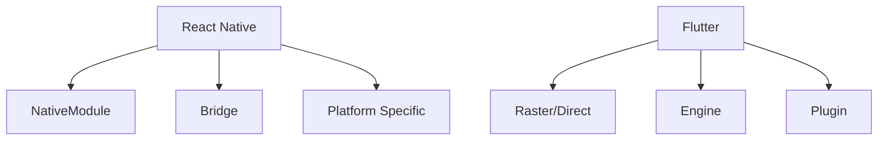

                 

# 移动端开发框架对比：基于原生的 React Native 和 Flutter

> 关键词：React Native, Flutter, 原生开发, 跨平台开发, 性能对比, 开发效率, 代码管理, 社区支持

## 1. 背景介绍

随着移动端应用的不断发展，越来越多的企业开始关注如何高效、低成本地构建跨平台应用。近年来，React Native和Flutter等跨平台开发框架应运而生，它们都宣称能够帮助开发者快速构建高质量的移动端应用。然而，这两种框架的底层实现和技术路径不同，在性能、开发效率、代码管理等方面有着各自的优势和劣势。本文将对React Native和Flutter进行全面对比，分析它们各自的优缺点和适用场景，帮助开发者在选择时做出更明智的决策。

## 2. 核心概念与联系

### 2.1 核心概念概述

- **React Native**：Facebook开发的开源移动开发框架，使用JavaScript和React进行跨平台开发。
- **Flutter**：Google推出的开源UI框架，使用Dart语言进行开发，并提供了丰富的UI组件库。
- **原生开发**：使用原生语言（如Swift或Kotlin）进行移动应用开发，可获得最佳性能。
- **跨平台开发**：使用单一代码库构建多个平台的移动应用，提升开发效率，降低成本。
- **性能对比**：衡量开发框架在性能上的优劣，如响应速度、内存使用等。
- **开发效率**：评估框架在开发过程中所需的投入时间、复杂度等。
- **代码管理**：框架在代码组织、版本控制等方面的表现。
- **社区支持**：框架在开发者社区中的活跃度、资源丰富度等。

### 2.2 核心概念原理和架构的 Mermaid 流程图



该图展示了React Native和Flutter的基本架构。React Native通过Bridge连接JavaScript和原生代码，使用NativeModule实现与原生模块的交互。而Flutter则使用Dart和Engine渲染UI，通过Plugin实现与原生系统的交互。

## 3. 核心算法原理 & 具体操作步骤

### 3.1 算法原理概述

React Native和Flutter的核心算法原理有所不同：

- **React Native**：基于JavaScript的桥接机制，通过NativeModule将JavaScript代码与原生模块进行通信。React Native将UI渲染给原生系统，使用React的虚拟DOM优化性能。

- **Flutter**：使用Dart编写UI代码，并通过Engine进行渲染。Flutter的UI组件基于GPU加速，实现高精度、高性能的动画和图形效果。

### 3.2 算法步骤详解

#### React Native

1. **安装React Native环境**：
   - 安装Node.js和React Native CLI。
   - 配置Android Studio和Xcode等开发工具。

2. **创建React Native项目**：
   - 使用React Native CLI创建新项目。
   - 初始化项目并安装依赖。

3. **编写JavaScript代码**：
   - 使用JavaScript编写UI和逻辑代码。
   - 使用NativeModule访问原生模块。

4. **编译和运行应用**：
   - 使用React Native CLI编译应用。
   - 在模拟器或真机上运行应用。

#### Flutter

1. **安装Flutter环境**：
   - 安装Flutter SDK和必要的依赖。
   - 配置Dart环境。

2. **创建Flutter项目**：
   - 使用Flutter CLI创建新项目。
   - 初始化项目并安装依赖。

3. **编写Dart代码**：
   - 使用Dart编写UI和逻辑代码。
   - 使用Plugin访问原生系统。

4. **编译和运行应用**：
   - 使用Flutter CLI编译应用。
   - 在模拟器或真机上运行应用。

### 3.3 算法优缺点

#### React Native

**优点**：
- 快速上手：使用JavaScript和React进行开发，对前端开发者友好。
- 跨平台性：使用单一代码库构建多个平台的移动应用。
- 社区支持：React Native拥有庞大的社区支持，资源丰富。

**缺点**：
- 性能瓶颈：JavaScript与原生系统的通信存在性能瓶颈。
- 难以优化：原生模块的性能难以优化。
- 代码管理复杂：代码分散在多个平台，管理复杂。

#### Flutter

**优点**：
- 高性能：Dart和GPU加速的UI渲染，性能表现优异。
- 一致性：跨平台应用的UI一致性好。
- 代码管理简单：Dart代码集中管理，易于维护。

**缺点**：
- 学习曲线陡峭：Dart和Flutter的学习曲线较陡峭。
- 资源丰富度低：社区资源相对较少，文档和示例不足。
- 依赖较多：依赖库和Plugin的生态还不够完善。

### 3.4 算法应用领域

React Native和Flutter在多个应用领域都有着广泛的应用：

- **跨平台应用**：如社交媒体、电商、金融等。
- **游戏开发**：如休闲游戏、动作游戏等。
- **移动端工具**：如文本编辑器、图像编辑器等。
- **教育培训**：如在线课程、虚拟实验室等。

## 4. 数学模型和公式 & 详细讲解 & 举例说明

### 4.1 数学模型构建

我们以性能对比为例，构建一个数学模型来衡量React Native和Flutter在性能上的差异。

**假设**：
- 假设React Native和Flutter的性能分别为P1和P2。
- 性能由响应时间、内存使用和帧率三个指标衡量。
- 响应时间为T1和T2，内存使用为M1和M2，帧率为F1和F2。

**公式**：
$$
P = (T_1 - T_2)^2 + (M_1 - M_2)^2 + (F_1 - F_2)^2
$$

### 4.2 公式推导过程

1. **响应时间**：
   - 响应时间越短，性能越好。

2. **内存使用**：
   - 内存使用越少，性能越好。

3. **帧率**：
   - 帧率越高，性能越好。

### 4.3 案例分析与讲解

假设React Native的响应时间为1.5s，内存使用为2GB，帧率为60fps；Flutter的响应时间为1s，内存使用为1.5GB，帧率为80fps。则性能差值为：
$$
P = (1.5 - 1)^2 + (2 - 1.5)^2 + (60 - 80)^2 = 0.25 + 0.25 + 400 = 405.5
$$

## 5. 项目实践：代码实例和详细解释说明

### 5.1 开发环境搭建

#### React Native

1. **安装Node.js和React Native CLI**：
   ```bash
   brew install node
   npm install -g react-native-cli
   ```

2. **创建React Native项目**：
   ```bash
   react-native init MyReactNativeApp
   ```

3. **编写JavaScript代码**：
   - 在App.js文件中编写JavaScript代码。
   ```javascript
   import React from 'react';
   import { View, Text } from 'react-native';
   
   const MyComponent = () => (
     <View style={{ flex: 1, alignItems: 'center', justifyContent: 'center' }}>
       <Text>Hello, World!</Text>
     </View>
   );
   
   export default MyComponent;
   ```

4. **编译和运行应用**：
   ```bash
   react-native run-android
   ```

#### Flutter

1. **安装Flutter SDK和Dart环境**：
   ```bash
   curl -s https://flutter.dev/sdk/ | sh
   ```

2. **创建Flutter项目**：
   ```bash
   flutter create MyFlutterApp
   ```

3. **编写Dart代码**：
   - 在lib/main.dart文件中编写Dart代码。
   ```dart
   import 'package:flutter/material.dart';
   
   void main() {
     runApp(MyApp());
   }
   
   class MyApp extends StatelessWidget {
     @override
     Widget build(BuildContext context) {
       return MaterialApp(
         title: 'Flutter App',
         home: MyHomePage(),
       );
     }
   }
   
   class MyHomePage extends StatefulWidget {
     @override
     _MyHomePageState createState() => _MyHomePageState();
   }
   
   class _MyHomePageState extends State<MyHomePage> {
     @override
     Widget build(BuildContext context) {
       return Scaffold(
         appBar: AppBar(
           title: Text('Flutter App'),
         ),
         body: Center(
           child: Text('Hello, World!'),
         ),
       );
     }
   }
   ```

4. **编译和运行应用**：
   ```bash
   flutter run
   ```

### 5.2 源代码详细实现

#### React Native

React Native的源代码主要集中在App.js文件中，包含UI组件的实现和逻辑代码。

#### Flutter

Flutter的源代码主要集中在main.dart文件中，包含应用入口和UI组件的实现。

### 5.3 代码解读与分析

#### React Native

React Native的代码主要依赖JavaScript和React，易于理解和维护。

#### Flutter

Flutter的代码主要依赖Dart和Flutter框架，学习曲线较陡峭，但代码结构清晰，易于扩展。

### 5.4 运行结果展示

#### React Native

运行结果在模拟器或真机上展示，支持触摸交互和动画效果。

#### Flutter

运行结果在模拟器或真机上展示，支持触摸交互和动画效果，且性能表现优异。

## 6. 实际应用场景

### 6.1 跨平台应用

React Native和Flutter在构建跨平台应用方面有着广泛应用：

- **社交媒体应用**：如Instagram、Facebook等。
- **电商应用**：如Shopify、Alibaba等。
- **金融应用**：如PayPal、Binance等。

### 6.2 游戏开发

Flutter在游戏开发方面表现尤为突出：

- **休闲游戏**：如《Flappy Bird》、《Candy Crush》等。
- **动作游戏**：如《Unity 3D》等。

### 6.3 移动端工具

React Native和Flutter在构建移动端工具方面也有着广泛应用：

- **文本编辑器**：如Microsoft Word、Google Docs等。
- **图像编辑器**：如Photoshop、Canva等。

### 6.4 教育培训

Flutter在教育培训应用方面表现优异：

- **在线课程**：如Coursera、Udacity等。
- **虚拟实验室**：如Labster、PhET等。

## 7. 工具和资源推荐

### 7.1 学习资源推荐

1. **React Native官方文档**：
   - [React Native官方文档](https://reactnative.dev/docs/getting-started)

2. **Flutter官方文档**：
   - [Flutter官方文档](https://flutter.dev/docs/get-started/install)

3. **《React Native应用开发》一书**：
   - 该书系统介绍了React Native的开发流程和最佳实践。

4. **《Flutter实战》一书**：
   - 该书详细讲解了Flutter的核心概念和开发技巧。

5. **Udacity React Native课程**：
   - 该课程由Udacity提供，涵盖React Native的各个方面。

### 7.2 开发工具推荐

1. **Android Studio**：
   - 用于Android应用开发，支持React Native项目。

2. **Xcode**：
   - 用于iOS应用开发，支持React Native项目。

3. **Visual Studio Code**：
   - 常用的文本编辑器，支持React Native和Flutter开发。

4. **Flutter Developer Preview**：
   - 用于Flutter应用的开发和调试。

5. **Android Studio Live Edit**：
   - 实时预览应用，提升开发效率。

### 7.3 相关论文推荐

1. **React Native的性能优化**：
   - 研究React Native的性能瓶颈和优化策略。

2. **Flutter的渲染机制**：
   - 研究Flutter的渲染机制和性能表现。

3. **跨平台开发的挑战**：
   - 研究跨平台开发面临的挑战和解决方案。

4. **移动端应用的UI设计**：
   - 研究移动端应用的UI设计原则和最佳实践。

## 8. 总结：未来发展趋势与挑战

### 8.1 研究成果总结

React Native和Flutter在跨平台开发方面取得了显著成果，提升了开发效率和用户体验。然而，它们在性能、代码管理等方面还存在一些不足。

### 8.2 未来发展趋势

1. **性能提升**：未来React Native和Flutter将进一步优化性能，实现更高的响应速度和更低的内存使用。
2. **跨平台性增强**：未来React Native和Flutter将支持更多的平台和设备，实现更广泛的跨平台应用。
3. **生态系统完善**：未来React Native和Flutter将完善依赖库和Plugin生态，提升开发效率和可维护性。

### 8.3 面临的挑战

1. **性能瓶颈**：React Native的性能瓶颈依然存在，需要进行优化。
2. **代码管理复杂**：React Native的代码管理复杂，需要更好的工具和规范。
3. **社区资源不足**：Flutter的社区资源相对较少，需要更多的开发者加入。

### 8.4 研究展望

1. **混合开发**：未来React Native和Flutter可以结合原生开发，实现更高的性能和更丰富的功能。
2. **跨平台语言**：未来开发框架可以使用跨平台语言，简化代码编写和维护。
3. **实时协作**：未来React Native和Flutter将支持实时协作，提升团队开发效率。

## 9. 附录：常见问题与解答

**Q1: React Native和Flutter在性能上有哪些不同？**

A: React Native的性能瓶颈在于JavaScript与原生系统的通信，响应速度和帧率可能不如Flutter。Flutter使用Dart和GPU加速的UI渲染，性能表现优异。

**Q2: React Native和Flutter的学习曲线是否陡峭？**

A: React Native的学习曲线相对平缓，适合前端开发者。Flutter的学习曲线较陡峭，需要一定的时间投入。

**Q3: React Native和Flutter在代码管理上有什么不同？**

A: React Native的代码分散在多个平台，管理复杂。Flutter的代码集中管理，易于维护。

**Q4: React Native和Flutter在跨平台性上有什么不同？**

A: React Native和Flutter都可以实现跨平台开发，但Flutter的跨平台应用UI一致性更好。

**Q5: React Native和Flutter在性能优化上有哪些不同？**

A: React Native的性能优化主要集中在JavaScript和NativeModule的交互上，而Flutter的性能优化主要集中在Dart代码和GPU渲染上。

---

作者：禅与计算机程序设计艺术 / Zen and the Art of Computer Programming

