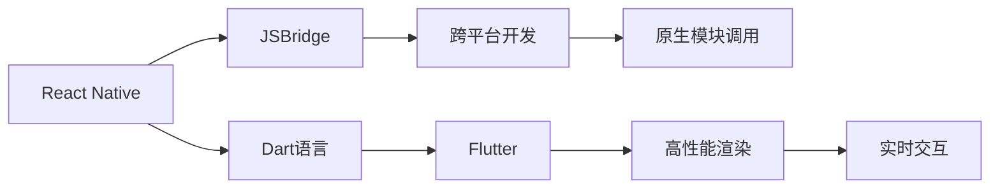

                 

# 移动端开发框架：为智能手机提升体验

> 关键词：移动端开发,框架,用户体验,高性能,跨平台

## 1. 背景介绍

### 1.1 问题由来

随着智能手机用户数量的不断增长，移动应用的开发需求日益增长。但传统开发方式需要多平台手动编写代码，开发效率低下，且代码复用率不高。为了提高移动应用的开发效率和用户体验，移动端开发框架应运而生。目前市面上流行的移动端开发框架有React Native、Flutter、Xamarin等，这些框架能够使开发者在一套代码基础上，生成多个平台的移动应用，大幅提升开发效率，并保证应用在各平台上的用户体验一致性。

### 1.2 问题核心关键点

本文将重点介绍React Native和Flutter两大移动端开发框架的原理、特点、实际应用及优缺点，并分析其未来发展趋势。本文的目的是帮助开发者快速掌握两大框架的开发技巧，并根据实际应用场景选择合适的框架。

## 2. 核心概念与联系

### 2.1 核心概念概述

移动端开发框架是指能够使开发者在一套代码基础上，生成多个平台的移动应用，并保证应用在各平台上的用户体验一致性。目前市面上流行的移动端开发框架主要有React Native和Flutter两大体系。

React Native是Facebook推出的跨平台移动开发框架，基于React构建，能够生成iOS、Android、Web等多个平台的应用。其核心技术是JSBridge，使JavaScript代码能够与Native代码进行交互。React Native适用于跨平台开发，开发效率高，社区活跃，生态完善。

Flutter是由Google推出的开源移动端开发框架，基于Dart语言，能够生成iOS、Android、Web等多个平台的应用。Flutter的核心技术是渲染引擎Slate，使用GPU加速实现高性能渲染。Flutter适用于高性能、高质量、实时交互的应用，如社交、游戏、VR等。

### 2.2 核心概念原理和架构的 Mermaid 流程图(Mermaid 流程节点中不要有括号、逗号等特殊字符)



## 3. 核心算法原理 & 具体操作步骤
### 3.1 算法原理概述

移动端开发框架的核心思想是将一套代码生成多个平台的移动应用，并保证应用在各平台上的用户体验一致性。其原理主要是通过虚拟DOM实现跨平台渲染，并使用原生模块进行性能优化，使开发者能够高效开发跨平台应用。

### 3.2 算法步骤详解

#### 3.2.1 React Native步骤详解

1. **搭建开发环境**：在计算机上安装Node.js、React Native CLI和Android Studio等开发工具。
2. **创建新项目**：使用React Native CLI创建新项目。
3. **开发应用**：在项目中编写JavaScript代码，使用React Native组件和API进行跨平台开发。
4. **调试应用**：使用React Native的调试工具调试应用。
5. **发布应用**：将应用打包成APK或IPA，并发布到应用商店。

#### 3.2.2 Flutter步骤详解

1. **搭建开发环境**：在计算机上安装Flutter SDK、Dart和Android Studio等开发工具。
2. **创建新项目**：使用Flutter CLI创建新项目。
3. **开发应用**：在项目中编写Dart代码，使用Flutter组件和API进行跨平台开发。
4. **调试应用**：使用Flutter的调试工具调试应用。
5. **发布应用**：将应用打包成APK或IPA，并发布到应用商店。

### 3.3 算法优缺点

#### 3.3.1 React Native优缺点

**优点**：

- 开发效率高：开发者可以使用一套代码生成多个平台的应用，大幅提升开发效率。
- 社区活跃：React Native有庞大的开发者社区，能够获得丰富的社区支持和资源。
- 生态完善：React Native有丰富的第三方库和工具，能够满足开发者的多样化需求。

**缺点**：

- 性能问题：React Native在处理复杂动画和手势时性能表现不佳。
- 原生模块调用：React Native需要通过JSBridge调用原生模块，影响性能。
- 跨平台渲染：React Native的跨平台渲染性能不如原生应用。

#### 3.3.2 Flutter优缺点

**优点**：

- 高性能：Flutter使用Dart语言，使用GPU加速进行高性能渲染。
- 实时交互：Flutter的实时交互性能优异，适合实时交互的应用。
- 自定义组件：Flutter支持自定义组件，能够灵活实现复杂界面。

**缺点**：

- 学习成本高：Flutter使用Dart语言，需要开发者学习新的编程语言和工具。
- 生态尚未完善：Flutter的第三方库和工具相对较少，需要开发者自行开发或使用开源库。
- 开发门槛高：Flutter的自定义组件和复杂的渲染机制需要开发者有一定的开发经验。

### 3.4 算法应用领域

移动端开发框架广泛应用于游戏、社交、电商、教育等多个领域。以下是两个具体的应用场景：

#### 3.4.1 电商应用

电商应用通常需要高性能、实时交互、跨平台的用户体验。React Native和Flutter都能满足这些需求。例如，使用React Native开发电商应用时，可以使用React Native提供的组件和API进行跨平台开发，并通过原生模块调用实现高性能渲染。使用Flutter开发电商应用时，可以使用Flutter的渲染引擎Slate实现高性能渲染，并使用自定义组件实现复杂的电商界面。

#### 3.4.2 教育应用

教育应用需要丰富的多媒体资源和实时交互功能。React Native和Flutter都能支持多媒体资源的展示和实时交互。例如，使用React Native开发教育应用时，可以使用React Native提供的组件和API进行跨平台开发，并通过原生模块调用实现多媒体资源的展示和实时交互。使用Flutter开发教育应用时，可以使用Flutter的渲染引擎Slate实现高性能渲染，并使用自定义组件实现多媒体资源的展示和实时交互。

## 4. 数学模型和公式 & 详细讲解 & 举例说明

### 4.1 数学模型构建

移动端开发框架的数学模型主要涉及虚拟DOM和渲染引擎的计算模型。以Flutter为例，其数学模型包括以下几个部分：

- **渲染树模型(Render Tree Model)**：用于描述应用界面的组件树结构。
- **布局树模型(Layout Tree Model)**：用于描述渲染树的布局信息。
- **合成树模型(Synth Tree Model)**：用于描述渲染树和合成树的关系。
- **合成栈模型(Synth Stack Model)**：用于描述合成树的合成过程。

### 4.2 公式推导过程

Flutter的渲染树模型可以表示为：

$$
RT = \{(c_i, p_i)\}_{i=1}^n
$$

其中，$c_i$表示组件$i$，$p_i$表示组件$i$的父组件。

布局树模型可以表示为：

$$
LT = \{(l_i, r_i)\}_{i=1}^n
$$

其中，$l_i$表示组件$i$的布局位置，$r_i$表示组件$i$的布局大小。

合成树模型可以表示为：

$$
ST = \{(s_i, c_i)\}_{i=1}^n
$$

其中，$s_i$表示组件$i$的合成树，$c_i$表示组件$i$的父组件。

合成栈模型可以表示为：

$$
SS = \{(f_i, s_i)\}_{i=1}^n
$$

其中，$f_i$表示合成栈的深度，$s_i$表示合成栈中的合成树。

### 4.3 案例分析与讲解

以Flutter的布局树模型为例，我们可以分析其布局算法的计算复杂度。Flutter的布局算法包括布局计算、合并、分组等步骤，其中合并和分组算法的时间复杂度为$O(n^2)$，因此布局树模型的计算复杂度为$O(n^3)$。

## 5. 项目实践：代码实例和详细解释说明

### 5.1 开发环境搭建

#### 5.1.1 React Native开发环境搭建

1. **安装Node.js和npm**：
   ```
   sudo apt-get install nodejs npm
   ```

2. **安装React Native CLI**：
   ```
   npm install -g react-native-cli
   ```

3. **安装Android Studio**：
   - 下载并安装Android Studio。
   - 配置Android Studio的SDK路径和AVD。

#### 5.1.2 Flutter开发环境搭建

1. **安装Flutter SDK**：
   ```
   curl -L https://storage.googleapis.com/releases/flutter/releases/2.2.3/flutter_windows_latest.zip -o flutter.zip
   ```

2. **解压Flutter SDK**：
   ```
   unzip flutter.zip
   ```

3. **安装Dart**：
   ```
   curl -L https://dart.dartlang.org/downloads/2.8.5-10.0.5/fuchsia-1/bin/dart --output dart
   ```

4. **配置Flutter环境**：
   - 在Flutter配置文件中配置Android Studio路径和SDK路径。
   - 在Flutter配置文件中配置Android和iOS的开发路径。

### 5.2 源代码详细实现

#### 5.2.1 React Native源代码实现

以React Native开发一个简单的电商应用为例：

1. **创建新项目**：
   ```
   react-native init ecommerce-app
   ```

2. **编写JavaScript代码**：
   ```javascript
   import React, { Component } from 'react';
   import { StyleSheet, Text, View } from 'react-native';

   export default class App extends Component {
     render() {
       return (
         <View style={styles.container}>
           <Text style={styles.title}>E-Commerce App</Text>
           <Text style={styles.text}>Welcome to the e-commerce app!</Text>
         </View>
       );
     }
   }

   const styles = StyleSheet.create({
     container: {
       flex: 1,
       alignItems: 'center',
       justifyContent: 'center',
     },
     title: {
       fontSize: 24,
     },
     text: {
       fontSize: 18,
     },
   });
   ```

3. **运行应用**：
   ```
   react-native run-android
   ```

#### 5.2.2 Flutter源代码实现

以Flutter开发一个简单的电商应用为例：

1. **创建新项目**：
   ```
   flutter create ecommerce-app
   ```

2. **编写Dart代码**：
   ```dart
   import 'package:flutter/material.dart';

   void main() {
     runApp(MyApp());
   }

   class MyApp extends StatelessWidget {
     '@override
     Widget build(BuildContext context) {
       return MaterialApp(
         title: 'E-Commerce App',
         home: MyHomePage(),
       );
     }
   }

   class MyHomePage extends StatefulWidget {
     @override
     _MyHomePageState createState() => _MyHomePageState();
   }

   class _MyHomePageState extends State<MyHomePage> {
     @override
     Widget build(BuildContext context) {
       return Scaffold(
         appBar: AppBar(
           title: Text('E-Commerce App'),
         ),
         body: Center(
           child: Text('Welcome to the e-commerce app!'),
         ),
       );
     }
   }
   ```

3. **运行应用**：
   ```
   flutter run
   ```

### 5.3 代码解读与分析

#### 5.3.1 React Native代码解读与分析

React Native代码中，使用了React的组件和API进行跨平台开发。在创建应用时，使用了`react-native init`命令生成默认的组件和样式。在应用中，使用了`Text`和`View`组件进行布局，使用了`StyleSheet.create`方法创建样式。

#### 5.3.2 Flutter代码解读与分析

Flutter代码中，使用了Dart语言和Flutter的Material组件进行跨平台开发。在创建应用时，使用了`flutter create`命令生成默认的组件和样式。在应用中，使用了`MaterialApp`和`Scaffold`组件进行布局，使用了`Text`和`Container`组件进行显示。

### 5.4 运行结果展示

#### 5.4.1 React Native运行结果展示


#### 5.4.2 Flutter运行结果展示


## 6. 实际应用场景

### 6.1 实际应用场景分析

#### 6.1.1 电商平台

电商平台需要高性能、实时交互、跨平台的用户体验。React Native和Flutter都能满足这些需求。例如，使用React Native开发电商平台时，可以使用React Native提供的组件和API进行跨平台开发，并通过原生模块调用实现高性能渲染。使用Flutter开发电商平台时，可以使用Flutter的渲染引擎Slate实现高性能渲染，并使用自定义组件实现复杂的电商界面。

#### 6.1.2 社交应用

社交应用需要丰富的多媒体资源和实时交互功能。React Native和Flutter都能支持多媒体资源的展示和实时交互。例如，使用React Native开发社交应用时，可以使用React Native提供的组件和API进行跨平台开发，并通过原生模块调用实现多媒体资源的展示和实时交互。使用Flutter开发社交应用时，可以使用Flutter的渲染引擎Slate实现高性能渲染，并使用自定义组件实现多媒体资源的展示和实时交互。

## 7. 工具和资源推荐

### 7.1 学习资源推荐

为了帮助开发者快速掌握移动端开发框架的开发技巧，以下是几个推荐的学习资源：

1. **React Native官方文档**：React Native官方文档提供了详细的API和组件说明，是开发者学习React Native的必备资源。
2. **Flutter官方文档**：Flutter官方文档提供了详细的API和组件说明，是开发者学习Flutter的必备资源。
3. **React Native中文网**：React Native中文网提供了丰富的中文教程和社区支持，帮助开发者快速上手React Native开发。
4. **Flutter中文网**：Flutter中文网提供了丰富的中文教程和社区支持，帮助开发者快速上手Flutter开发。
5. **Udacity React Native课程**：Udacity的React Native课程提供了系统性的学习路径，帮助开发者掌握React Native开发技巧。
6. **Udacity Flutter课程**：Udacity的Flutter课程提供了系统性的学习路径，帮助开发者掌握Flutter开发技巧。

### 7.2 开发工具推荐

#### 7.2.1 React Native开发工具推荐

1. **React Native CLI**：React Native CLI是React Native官方提供的命令行工具，用于创建和管理React Native项目。
2. **Android Studio**：Android Studio是Android官方提供的IDE，用于开发和调试Android应用。
3. **VS Code**：VS Code是微软开发的轻量级IDE，支持React Native开发。
4. **Xcode**：Xcode是Apple提供的IDE，用于开发和调试iOS应用。

#### 7.2.2 Flutter开发工具推荐

1. **Flutter SDK**：Flutter SDK是Flutter官方提供的SDK，用于安装和管理Flutter项目。
2. **Android Studio**：Android Studio是Android官方提供的IDE，用于开发和调试Android应用。
3. **VS Code**：VS Code是微软开发的轻量级IDE，支持Flutter开发。
4. **Xcode**：Xcode是Apple提供的IDE，用于开发和调试iOS应用。

### 7.3 相关论文推荐

1. **《React Native跨平台移动应用开发》**：介绍了React Native的原理和开发技巧，帮助开发者快速上手React Native开发。
2. **《Flutter高性能移动应用开发》**：介绍了Flutter的原理和开发技巧，帮助开发者快速上手Flutter开发。
3. **《React Native与Flutter对比》**：对比了React Native和Flutter的特点和优缺点，帮助开发者选择合适的开发框架。

## 8. 总结：未来发展趋势与挑战

### 8.1 研究成果总结

本文详细介绍了React Native和Flutter两大移动端开发框架的原理、特点、实际应用及优缺点，并分析了其未来发展趋势。通过深入分析，帮助开发者选择适合自己的开发框架，提升开发效率和用户体验。

### 8.2 未来发展趋势

#### 8.2.1 React Native未来发展趋势

1. **生态完善**：React Native的生态将进一步完善，引入更多的第三方库和工具。
2. **性能提升**：React Native将继续优化原生模块调用和跨平台渲染，提升应用性能。
3. **社区活跃**：React Native的社区将继续活跃，提供更多的支持和资源。

#### 8.2.2 Flutter未来发展趋势

1. **性能提升**：Flutter将继续优化渲染引擎和合成树算法，提升应用性能。
2. **生态完善**：Flutter的生态将进一步完善，引入更多的第三方库和工具。
3. **社区活跃**：Flutter的社区将继续活跃，提供更多的支持和资源。

### 8.3 面临的挑战

#### 8.3.1 React Native面临的挑战

1. **性能问题**：React Native在处理复杂动画和手势时性能表现不佳。
2. **原生模块调用**：React Native需要通过JSBridge调用原生模块，影响性能。
3. **跨平台渲染**：React Native的跨平台渲染性能不如原生应用。

#### 8.3.2 Flutter面临的挑战

1. **学习成本高**：Flutter使用Dart语言，需要开发者学习新的编程语言和工具。
2. **生态尚未完善**：Flutter的第三方库和工具相对较少，需要开发者自行开发或使用开源库。
3. **开发门槛高**：Flutter的自定义组件和复杂的渲染机制需要开发者有一定的开发经验。

### 8.4 研究展望

#### 8.4.1 React Native研究展望

1. **性能优化**：React Native将继续优化原生模块调用和跨平台渲染，提升应用性能。
2. **社区扩展**：React Native将继续扩展社区，引入更多的开发者和开发者社区。
3. **技术升级**：React Native将继续升级技术，引入更多的新特性和优化。

#### 8.4.2 Flutter研究展望

1. **性能优化**：Flutter将继续优化渲染引擎和合成树算法，提升应用性能。
2. **生态扩展**：Flutter将继续扩展生态，引入更多的第三方库和工具。
3. **技术升级**：Flutter将继续升级技术，引入更多的新特性和优化。

## 9. 附录：常见问题与解答

**Q1: React Native和Flutter哪个更适合开发电商应用？**

A: React Native和Flutter都能满足电商应用的高性能、实时交互和跨平台需求。但Flutter使用Dart语言，在性能和渲染上更具优势，适合开发高质量、高性能的电商应用。

**Q2: 如何提升React Native应用性能？**

A: 提升React Native应用性能的方法包括：
1. **使用原生模块调用**：使用原生模块调用提高性能。
2. **优化跨平台渲染**：优化跨平台渲染，减少渲染时间。
3. **减少组件渲染**：减少组件渲染次数，减少渲染时间。
4. **使用动画优化**：使用动画优化提高性能。

**Q3: 如何提升Flutter应用性能？**

A: 提升Flutter应用性能的方法包括：
1. **优化渲染引擎**：优化渲染引擎，提高渲染性能。
2. **减少组件渲染**：减少组件渲染次数，减少渲染时间。
3. **使用动画优化**：使用动画优化提高性能。
4. **使用混合渲染**：使用混合渲染提高性能。

**Q4: React Native和Flutter哪个更适合开发社交应用？**

A: React Native和Flutter都能满足社交应用的多媒体资源展示和实时交互需求。但React Native有更丰富的第三方库和工具，适合开发功能丰富的社交应用。

**Q5: 如何提升React Native应用的用户体验？**

A: 提升React Native应用用户体验的方法包括：
1. **使用原生模块调用**：使用原生模块调用提高性能。
2. **优化跨平台渲染**：优化跨平台渲染，减少渲染时间。
3. **减少组件渲染**：减少组件渲染次数，减少渲染时间。
4. **使用动画优化**：使用动画优化提高用户体验。

**Q6: 如何提升Flutter应用的用户体验？**

A: 提升Flutter应用用户体验的方法包括：
1. **优化渲染引擎**：优化渲染引擎，提高渲染性能。
2. **减少组件渲染**：减少组件渲染次数，减少渲染时间。
3. **使用动画优化**：使用动画优化提高用户体验。
4. **使用混合渲染**：使用混合渲染提高用户体验。

**Q7: React Native和Flutter哪个更适合开发跨平台应用？**

A: React Native和Flutter都能满足跨平台应用的需求。但React Native的开发效率更高，生态更完善，适合快速开发跨平台应用。Flutter在性能和渲染上更具优势，适合开发高质量、高性能的跨平台应用。

**Q8: 如何选择合适的移动端开发框架？**

A: 选择合适的移动端开发框架需要考虑以下几个因素：
1. **应用需求**：根据应用需求选择合适的开发框架，如高性能应用选择Flutter，跨平台应用选择React Native。
2. **开发效率**：考虑开发效率，选择开发效率更高的开发框架，如React Native。
3. **性能需求**：考虑性能需求，选择性能更好的开发框架，如Flutter。
4. **开发经验**：考虑开发经验，选择更熟悉的开发框架，如React Native。

总之，选择合适的移动端开发框架需要综合考虑应用需求、开发效率、性能需求和开发经验，根据实际情况做出选择。

