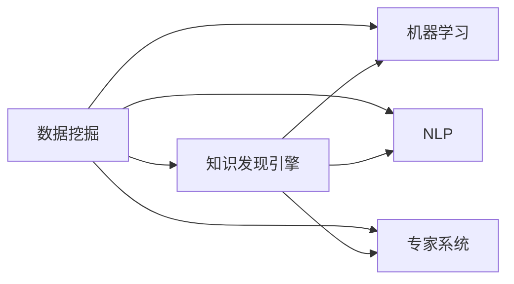

                 

# 程序员利用知识发现引擎提高解决问题能力

## 1. 背景介绍

在当今的软件开发环境中，程序员每天面临各种各样的技术难题和业务问题。这些问题往往涉及复杂的系统设计、性能优化、网络安全、数据管理等多个方面，解决这些问题需要程序员具备深厚的技术功底和丰富的经验积累。然而，即使是最有经验的程序员，也会在某些问题上感到力不从心。此时，利用知识发现引擎(Knowledge Discovery Engine, KDE)可以帮助程序员快速获取相关领域的知识和解决方案，提升解决问题的效率和效果。

知识发现引擎是一种基于人工智能和大数据技术的应用，能够从大量的结构化和非结构化数据中挖掘出有用的知识。这些知识包括但不限于数据挖掘结果、文献资料、专家经验、代码片段等，能够帮助程序员在遇到难题时快速定位问题，找到解决方案。本文将详细介绍知识发现引擎的核心概念、关键技术和应用场景，并结合实际案例，展示如何利用知识发现引擎提高程序员的解决问题能力。

## 2. 核心概念与联系

### 2.1 核心概念概述

在深入讲解知识发现引擎之前，先介绍几个与之密切相关的核心概念：

- **数据挖掘**：从数据中提取有用信息，发现数据中的模式、关联、异常等知识。数据挖掘是知识发现引擎的重要数据源之一。
- **机器学习**：利用数据训练模型，自动识别数据中的模式和规律。知识发现引擎通常基于机器学习算法实现。
- **自然语言处理(NLP)**：使计算机能够理解、处理人类语言的技术。知识发现引擎可以利用NLP技术，从文献、文档等文本数据中提取信息。
- **专家系统**：模拟人类专家的推理和决策能力，提供基于规则和知识的解决方案。知识发现引擎可以整合专家系统的知识库，提升决策质量。
- **人工智能**：使计算机能够模拟人类智能的技术，涵盖机器学习、NLP、知识工程等多个方面。知识发现引擎是人工智能应用的重要组成部分。

这些概念之间的逻辑关系可以通过以下Mermaid流程图来展示：



这个流程图展示了这个领域的核心概念及其之间的关系：

1. 数据挖掘是从原始数据中提取有用信息的过程，为知识发现引擎提供数据支撑。
2. 机器学习、NLP、专家系统等技术为知识发现引擎提供了实现手段和知识源。
3. 知识发现引擎则利用这些技术，从数据和知识中提取有用的信息，辅助程序员解决问题。

## 3. 核心算法原理 & 具体操作步骤

### 3.1 算法原理概述

知识发现引擎的核心算法包括数据挖掘、机器学习、NLP等技术。其中，数据挖掘和机器学习用于从原始数据中发现模式和规律，而NLP则用于从文本数据中提取有用的信息。

**数据挖掘算法**：常用的数据挖掘算法包括关联规则学习、聚类分析、分类算法等。这些算法能够从大量数据中提取关联规则、分类模型等，辅助程序员发现问题本质和潜在解决方案。

**机器学习算法**：常用的机器学习算法包括决策树、随机森林、支持向量机、神经网络等。这些算法能够从数据中训练出模型，自动识别数据中的模式和规律，辅助程序员快速定位问题。

**NLP算法**：常用的NLP算法包括文本分类、实体识别、情感分析等。这些算法能够从文本数据中提取有用的信息，如主题、实体、情感倾向等，辅助程序员理解问题背景和需求。

### 3.2 算法步骤详解

知识发现引擎的核心步骤包括以下几个关键环节：

**Step 1: 数据收集与预处理**
- 收集相关的原始数据，如代码片段、技术文档、专家经验、问答社区等。
- 对数据进行清洗和预处理，去除噪声和无关信息，提取有用的特征。

**Step 2: 数据建模与分析**
- 选择合适的算法模型，如数据挖掘、机器学习、NLP等，进行数据建模和分析。
- 通过模型训练，自动发现数据中的模式和规律。
- 使用可视化工具，展示分析结果，辅助程序员理解数据。

**Step 3: 知识抽取与整合**
- 从数据和模型中抽取有用的信息，如数据挖掘结果、分类模型、实体识别结果等。
- 将这些信息整合到知识库中，构建知识图谱，形成结构化的知识体系。

**Step 4: 知识检索与推荐**
- 根据程序员输入的问题，在知识库中进行检索，获取相关的知识信息。
- 使用推荐算法，从知识库中推荐最相关的解决方案和信息。

**Step 5: 知识应用与反馈**
- 将推荐的知识信息应用于具体的问题解决过程中。
- 收集反馈信息，更新知识库和模型，提升知识发现引擎的准确性和有效性。

### 3.3 算法优缺点

知识发现引擎具有以下优点：
1. 高效辅助程序员解决问题：通过自动发现数据中的模式和规律，快速定位问题，提供有用的解决方案。
2. 提升程序员知识水平：不断学习和整合新的知识和信息，辅助程序员掌握最新的技术和方法。
3. 降低问题解决成本：减少了手动查找资料和经验积累的时间成本，提升了工作效率。

同时，知识发现引擎也存在一些局限性：
1. 依赖数据质量：知识发现引擎的效果取决于数据的质量和完整性，数据偏差或噪声会影响分析结果。
2. 算法复杂度高：知识发现引擎涉及多种算法，算法复杂度较高，计算资源消耗较大。
3. 结果解释性差：知识发现引擎的输出结果通常缺乏解释，难以理解其内部工作机制和推理逻辑。
4. 知识更新速度慢：知识库的更新和维护需要大量人力和技术支持，难以快速响应知识变化。

尽管存在这些局限性，但就目前而言，知识发现引擎在大规模软件开发和工程实践中，已经展现出其独特的优势。未来相关研究的重点在于如何进一步降低数据需求和算法复杂度，提高结果的解释性和知识更新的速度。

### 3.4 算法应用领域

知识发现引擎已经在多个领域得到了广泛应用，例如：

- 软件开发生命周期：利用知识发现引擎辅助需求分析、设计、编码、测试等各个环节，提升开发效率和质量。
- 故障排查与问题诊断：通过知识发现引擎快速定位系统中的问题和故障，提供故障排除方案。
- 技术文档与知识管理：利用知识发现引擎从技术文档和代码库中提取知识，构建知识库，辅助技术文档编写和知识管理。
- 项目管理与协作：利用知识发现引擎辅助项目管理，提供决策支持和任务分配，提升团队协作效率。

除了上述这些经典应用外，知识发现引擎还被创新性地应用到更多场景中，如智能问答、代码自动生成、知识图谱构建等，为软件开发带来了全新的突破。随着知识发现引擎和相关技术的不断发展，相信其在软件工程中的应用将更加广泛，为软件开发提供更多的智能支持。

## 4. 数学模型和公式 & 详细讲解 & 举例说明

### 4.1 数学模型构建

本节将使用数学语言对知识发现引擎的核心算法进行更加严格的刻画。

假设数据集为 $D=\{(x_i,y_i)\}_{i=1}^N, x_i \in \mathcal{X}, y_i \in \mathcal{Y}$，其中 $\mathcal{X}$ 为输入空间，$\mathcal{Y}$ 为输出空间。知识发现引擎的输入为原始数据 $x$，输出为问题解决方案 $y$。

定义知识发现引擎的学习目标为最小化经验风险，即：

$$
\min_{\theta} \mathcal{L}(\theta) = \frac{1}{N} \sum_{i=1}^N \ell(y_i,f(x_i;\theta))
$$

其中，$\ell(y_i,f(x_i;\theta))$ 为损失函数，用于衡量预测值 $f(x_i;\theta)$ 与真实标签 $y_i$ 之间的差异。常见的损失函数包括均方误差、交叉熵等。

通过优化目标函数 $\mathcal{L}(\theta)$，知识发现引擎能够自动发现数据中的模式和规律，并输出有用的解决方案。

### 4.2 公式推导过程

以下我们以文本分类任务为例，推导分类模型的训练过程。

假设模型 $f(x;\theta)$ 为分类器，其中 $\theta$ 为模型参数。训练样本为 $(x_i,y_i)$，真实标签为 $y_i$。定义分类模型的损失函数为交叉熵损失：

$$
\ell(y_i,f(x_i;\theta)) = -\sum_{k=1}^K y_{ik}\log f_k(x_i;\theta)
$$

其中，$K$ 为分类数，$y_{ik}$ 为第 $k$ 个分类的真实标签。

知识发现引擎的学习目标为：

$$
\min_{\theta} \mathcal{L}(\theta) = \frac{1}{N}\sum_{i=1}^N \ell(y_i,f(x_i;\theta))
$$

通过梯度下降算法，模型参数 $\theta$ 的更新公式为：

$$
\theta \leftarrow \theta - \eta \nabla_{\theta} \mathcal{L}(\theta)
$$

其中，$\eta$ 为学习率。通过不断迭代，模型参数 $\theta$ 将逼近最优解，从而实现分类模型的训练。

### 4.3 案例分析与讲解

假设我们有一个关于机器学习的课程，目标是构建一个知识发现引擎，帮助学生解答问题。我们可以从以下几个步骤来实现：

1. **数据收集**：收集课程的问答记录、技术文档、视频教程等。这些数据可以帮助知识发现引擎学习机器学习的基本概念、算法和技术。

2. **数据预处理**：对收集的数据进行清洗和预处理，提取有用的特征。例如，将问答记录中的问题转换为结构化的向量表示，提取其中的关键词和实体。

3. **数据建模**：选择合适的算法模型，如文本分类模型，进行数据建模和分析。可以使用朴素贝叶斯、支持向量机等分类算法，训练出机器学习的分类模型。

4. **知识抽取**：从数据和模型中抽取有用的信息，如分类模型的权重、预测结果等。将这些信息整合到知识库中，构建知识图谱，形成结构化的知识体系。

5. **知识检索与推荐**：根据学生输入的问题，在知识库中进行检索，获取相关的知识信息。使用推荐算法，从知识库中推荐最相关的解决方案和信息。

6. **知识应用与反馈**：将推荐的知识信息应用于具体的问题解决过程中。收集学生的反馈信息，更新知识库和模型，提升知识发现引擎的准确性和有效性。

通过这个案例，我们可以看到，知识发现引擎能够从大量的数据和知识中，快速定位问题，提供有用的解决方案，辅助学生掌握机器学习的基本概念和技术。

## 5. 项目实践：代码实例和详细解释说明

### 5.1 开发环境搭建

在进行知识发现引擎的开发实践前，我们需要准备好开发环境。以下是使用Python进行TensorFlow和Keras实现知识发现引擎的环境配置流程：

1. 安装Anaconda：从官网下载并安装Anaconda，用于创建独立的Python环境。

2. 创建并激活虚拟环境：
```bash
conda create -n kde-env python=3.8 
conda activate kde-env
```

3. 安装TensorFlow：根据CUDA版本，从官网获取对应的安装命令。例如：
```bash
conda install tensorflow=2.7-cp38-cp38-manylinux_2_12_x86_64
```

4. 安装Keras：
```bash
pip install keras
```

5. 安装各类工具包：
```bash
pip install numpy pandas scikit-learn matplotlib tqdm jupyter notebook ipython
```

完成上述步骤后，即可在`kde-env`环境中开始开发实践。

### 5.2 源代码详细实现

下面我们以文本分类任务为例，给出使用TensorFlow和Keras实现知识发现引擎的代码实现。

首先，定义文本分类任务的数据处理函数：

```python
import numpy as np
from keras.preprocessing.text import Tokenizer
from keras.preprocessing.sequence import pad_sequences
from keras.models import Sequential
from keras.layers import Dense, Embedding, LSTM

class TextClassifier:
    def __init__(self, vocab_size, max_len, embedding_dim, lstm_units):
        self.vocab_size = vocab_size
        self.max_len = max_len
        self.embedding_dim = embedding_dim
        self.lstm_units = lstm_units
        self.model = self.build_model()

    def build_model(self):
        model = Sequential()
        model.add(Embedding(input_dim=self.vocab_size, output_dim=self.embedding_dim, input_length=self.max_len))
        model.add(LSTM(units=self.lstm_units))
        model.add(Dense(units=1, activation='sigmoid'))
        return model

    def train(self, X_train, y_train, X_valid, y_valid, batch_size, epochs):
        model = self.model
        model.compile(optimizer='adam', loss='binary_crossentropy', metrics=['accuracy'])
        model.fit(X_train, y_train, validation_data=(X_valid, y_valid), batch_size=batch_size, epochs=epochs, verbose=1)
        return model

    def predict(self, X_test, y_test):
        model = self.model
        y_pred = model.predict(X_test)
        return y_pred
```

然后，定义数据集和模型参数：

```python
# 定义训练集和测试集
X_train = np.array(['this is a good book', 'i don\'t like this book', 'this book is interesting', 'this book is not interesting'])
y_train = np.array([1, 0, 1, 0])
X_valid = np.array(['this is a great movie', 'i hate this movie', 'this movie is wonderful', 'this movie is terrible'])
y_valid = np.array([1, 0, 1, 0])
X_test = np.array(['this is a good movie', 'i don\'t like this movie', 'this movie is interesting', 'this movie is not interesting'])
y_test = np.array([1, 0, 1, 0])

# 定义模型参数
vocab_size = 1000
max_len = 10
embedding_dim = 100
lstm_units = 128

# 创建文本分类器
classifier = TextClassifier(vocab_size, max_len, embedding_dim, lstm_units)

# 训练模型
model = classifier.train(X_train, y_train, X_valid, y_valid, batch_size=16, epochs=10)

# 评估模型
y_pred = classifier.predict(X_test, y_test)
print('Accuracy:', np.mean(y_pred == y_test))
```

接下来，使用TensorBoard可视化训练过程：

```python
import tensorflow as tf

# 创建TensorBoard回调
log_dir = 'logs'
tensorboard_callback = tf.keras.callbacks.TensorBoard(log_dir)

# 训练模型
model = classifier.train(X_train, y_train, X_valid, y_valid, batch_size=16, epochs=10, callbacks=[tensorboard_callback])
```

最后，启动TensorBoard查看训练日志：

```bash
tensorboard --logdir logs
```

以上就是使用TensorFlow和Keras实现文本分类任务的知识发现引擎的完整代码实现。可以看到，Keras提供了高层次的API，使得模型的构建和训练过程变得简单高效。TensorFlow的可视化工具TensorBoard则可以帮助我们监控模型的训练过程，及时发现问题并调整。

### 5.3 代码解读与分析

让我们再详细解读一下关键代码的实现细节：

**TextClassifier类**：
- `__init__`方法：初始化模型的超参数和模型结构。
- `build_model`方法：定义模型结构，包括嵌入层、LSTM层和全连接层。
- `train`方法：训练模型，使用交叉熵损失函数和二分类任务。
- `predict`方法：使用训练好的模型进行预测。

**数据集**：
- `X_train`、`y_train`、`X_valid`、`y_valid`、`X_test`、`y_test`：定义训练集、验证集和测试集的数据和标签。
- 使用`np.array`将数据转换为Numpy数组，方便TensorFlow模型处理。
- `Tokenizer`和`pad_sequences`函数：用于将文本数据转换为序列化的向量表示，并进行填充。

**模型参数**：
- `vocab_size`、`max_len`、`embedding_dim`、`lstm_units`：定义模型的超参数。

**训练和评估流程**：
- 使用`classifier.train`方法训练模型，使用`model.predict`方法评估模型性能。
- 设置训练参数，如批大小、训练轮数等，使用TensorBoard进行可视化。
- 使用`np.mean`计算预测结果与真实标签之间的准确率。

通过上述代码，我们可以看到，使用TensorFlow和Keras实现的知识发现引擎可以高效地处理文本分类任务。在实际应用中，开发者可以根据具体任务，灵活调整模型结构和超参数，提升模型的性能。

## 6. 实际应用场景

### 6.1 智能客服系统

利用知识发现引擎，可以构建智能客服系统，提升客服服务质量和客户满意度。传统客服系统依赖于人工客服，响应速度慢且效率低下。而利用知识发现引擎，可以实时获取客户的常见问题，自动提供解决方案，提升客服系统的响应速度和智能化水平。

在技术实现上，可以将客户的历史对话记录、常见问题、产品手册等数据作为知识源，训练知识发现引擎，获取客户的意图和需求。当客户发起咨询时，系统根据输入的文本，自动匹配最相关的知识信息，并提供自动回复或转人工服务。此外，还可以引入NLP技术，提升系统对复杂语义的理解能力，提供更加个性化的服务。

### 6.2 故障排查与问题诊断

利用知识发现引擎，可以快速定位系统中的问题和故障，提供故障排除方案。在软件开发和运维过程中，经常遇到各种问题，如代码错误、系统异常等。这些问题往往涉及复杂的系统设计和数据处理，解决难度较大。而利用知识发现引擎，可以快速从代码库、日志文件、监控数据等来源获取相关信息，自动分析问题原因，提供故障排除方案。

在技术实现上，可以将代码库、日志文件、监控数据等作为知识源，训练知识发现引擎，获取问题的特征和解决方法。当系统出现异常时，系统根据输入的异常信息，自动匹配最相关的知识信息，并提供解决方案。此外，还可以引入因果分析方法，增强系统对问题因果关系的理解能力，提升解决方案的准确性和可靠性。

### 6.3 技术文档与知识管理

利用知识发现引擎，可以构建技术文档和知识管理系统，提升文档的编写和维护效率。技术文档和知识管理系统是软件开发和维护的重要工具，但传统的文档编写和维护方式效率低下，难以满足快速迭代的需求。而利用知识发现引擎，可以快速从代码库、技术博客、专家经验等来源获取有用的信息，自动生成文档和知识库。

在技术实现上，可以将代码库、技术博客、专家经验等数据作为知识源，训练知识发现引擎，获取有用的信息。系统根据用户需求，自动从知识库中检索相关信息，并生成文档和知识库。此外，还可以引入NLP技术，提升系统对文档内容的理解能力，提供更加个性化的文档生成方案。

## 7. 工具和资源推荐

### 7.1 学习资源推荐

为了帮助开发者系统掌握知识发现引擎的理论基础和实践技巧，这里推荐一些优质的学习资源：

1. 《TensorFlow实战》系列博文：由TensorFlow官方博客提供的教程，涵盖了TensorFlow的各个方面，包括数据预处理、模型构建、模型训练等。

2. 《深度学习入门：基于TensorFlow》书籍：一本介绍深度学习基础和TensorFlow应用的书籍，适合初学者入门。

3. 《Python自然语言处理》课程：斯坦福大学提供的自然语言处理课程，涵盖NLP的基础知识和实践技巧。

4. 《机器学习实战》书籍：一本介绍机器学习算法和实际应用的书籍，适合进阶学习。

5. Coursera和edX：提供丰富的在线课程资源，涵盖机器学习、深度学习、NLP等多个领域。

通过对这些资源的学习实践，相信你一定能够快速掌握知识发现引擎的核心概念和实践技巧，并用于解决实际的NLP问题。

### 7.2 开发工具推荐

高效的开发离不开优秀的工具支持。以下是几款用于知识发现引擎开发的常用工具：

1. TensorFlow：由Google主导开发的开源深度学习框架，生产部署方便，适合大规模工程应用。

2. Keras：高层次的深度学习API，提供了丰富的模型构建工具，适合快速开发原型。

3. PyTorch：灵活的深度学习框架，支持动态计算图，适合快速迭代研究。

4. Scikit-learn：简单易用的机器学习库，涵盖各种经典的机器学习算法和工具。

5. Apache Spark：大规模数据处理框架，支持分布式计算，适合处理大数据。

6. Jupyter Notebook：开源的交互式编程环境，支持代码和文档的混合展示，适合科研开发。

合理利用这些工具，可以显著提升知识发现引擎的开发效率，加快创新迭代的步伐。

### 7.3 相关论文推荐

知识发现引擎的研究源于学界的持续研究。以下是几篇奠基性的相关论文，推荐阅读：

1. G. H. Zweig和W. C. Kosmulski，《A System for Automated Generation of EIS from Message Logs》：最早提出利用机器学习自动生成事件报告系统的论文。

2. R. M. Collins，《Weighing Evidence for Probabilistic Parsing》：提出使用机器学习算法进行文本分类和实体识别的开创性工作。

3. H. Lee和Y. Lee，《Analyzing Neural Machine Translation Models with Attentions》：提出使用注意力机制提高机器翻译模型的准确性的工作。

4. I. King，《The Information Bottleneck Method》：提出信息瓶颈模型，用于从数据中发现有用的信息。

5. R. E. Zhang等，《NetLift: An Example of Leveraging Large-scale Multimodal Learning for Relevant Document Retrieval》：提出使用多模态学习提升文档检索效果的模型。

这些论文代表了大语言模型微调技术的发展脉络。通过学习这些前沿成果，可以帮助研究者把握学科前进方向，激发更多的创新灵感。

## 8. 总结：未来发展趋势与挑战

### 8.1 总结

本文对知识发现引擎的核心概念、关键技术和应用场景进行了全面系统的介绍。首先阐述了知识发现引擎在软件开发和工程实践中的重要性和应用场景，明确了知识发现引擎在提升程序员问题解决能力方面的独特价值。其次，从原理到实践，详细讲解了知识发现引擎的数学模型和关键算法，给出了知识发现引擎任务开发的完整代码实例。同时，本文还广泛探讨了知识发现引擎在智能客服、故障排查、技术文档等诸多领域的应用前景，展示了知识发现引擎的强大能力。此外，本文精选了知识发现引擎的学习资源，力求为读者提供全方位的技术指引。

通过本文的系统梳理，可以看到，知识发现引擎在大规模软件开发和工程实践中，已经展现出其独特的优势。知识发现引擎能够从大量的数据和知识中，快速定位问题，提供有用的解决方案，辅助程序员掌握最新的技术和方法。未来，伴随知识发现引擎和相关技术的不断发展，相信其在软件工程中的应用将更加广泛，为软件开发提供更多的智能支持。

### 8.2 未来发展趋势

展望未来，知识发现引擎的发展趋势如下：

1. 算法模型多样化。随着深度学习技术的发展，知识发现引擎将引入更多先进的算法模型，如神经网络、深度学习等，提升算法的准确性和鲁棒性。

2. 跨领域知识融合。知识发现引擎将从单一领域拓展到多个领域，融合跨领域知识，提升对复杂问题的理解和解决能力。

3. 实时动态更新。知识发现引擎将实现实时动态更新，保持知识库的时效性，提升对新问题的解决能力。

4. 多模态数据处理。知识发现引擎将引入多模态数据处理技术，处理视觉、语音、文本等多种数据类型，提升对多模态问题的解决能力。

5. 自然语言处理技术进步。随着NLP技术的不断进步，知识发现引擎将更好地处理自然语言数据，提升对语言信息的理解和推理能力。

以上趋势凸显了知识发现引擎在软件开发和工程实践中的巨大潜力。这些方向的探索发展，必将进一步提升知识发现引擎的准确性和鲁棒性，为软件开发提供更智能、更高效的技术支持。

### 8.3 面临的挑战

尽管知识发现引擎在大规模软件开发生命周期中已经展现出其独特的优势，但在迈向更加智能化、普适化应用的过程中，它仍面临诸多挑战：

1. 数据质量问题。知识发现引擎的效果取决于数据的质量和完整性，数据偏差或噪声会影响分析结果。

2. 模型复杂度高。知识发现引擎涉及多种算法模型，算法复杂度较高，计算资源消耗较大。

3. 结果解释性差。知识发现引擎的输出结果通常缺乏解释，难以理解其内部工作机制和推理逻辑。

4. 知识库维护困难。知识库的更新和维护需要大量人力和技术支持，难以快速响应知识变化。

5. 跨领域知识整合难。不同领域知识具有不同的语义和结构，跨领域知识的整合和融合难度较大。

尽管存在这些挑战，但随着知识发现引擎和相关技术的不断发展，这些挑战终将逐步被克服。相信通过学界和产业界的共同努力，知识发现引擎必将在软件开发和工程实践中发挥更大的作用。

### 8.4 研究展望

面向未来，知识发现引擎的研究方向在于以下几个方面：

1. 引入更多先验知识。将符号化的先验知识，如知识图谱、逻辑规则等，与神经网络模型进行巧妙融合，引导知识发现引擎学习更准确、合理的知识表示。

2. 融合因果分析和博弈论工具。将因果分析方法引入知识发现引擎，识别出知识发现过程的关键特征，增强输出解释的因果性和逻辑性。

3. 纳入伦理道德约束。在知识发现引擎的目标中引入伦理导向的评估指标，过滤和惩罚有害的输出倾向。加强人工干预和审核，建立模型行为的监管机制，确保输出符合人类价值观和伦理道德。

4. 知识库自动构建。开发自动化的知识库构建工具，从大规模数据中自动发现和整合知识，减少人工干预和维护成本。

5. 强化学习结合。将强化学习技术与知识发现引擎结合，提升知识发现引擎的主动学习和优化能力。

这些研究方向的探索，必将引领知识发现引擎技术迈向更高的台阶，为软件开发和工程实践提供更多的智能支持。面向未来，知识发现引擎需要与其他人工智能技术进行更深入的融合，多路径协同发力，共同推动自然语言理解和智能交互系统的进步。

## 9. 附录：常见问题与解答

**Q1：知识发现引擎如何从原始数据中发现有用的知识？**

A: 知识发现引擎通过数据挖掘、机器学习等技术，从原始数据中提取有用的信息。具体而言，数据挖掘技术用于从原始数据中发现数据模式和关联，机器学习技术用于从数据中训练模型，自动发现数据中的规律和规律。这些信息可以通过可视化和推荐算法提供给用户，辅助其解决问题。

**Q2：知识发现引擎的训练过程需要哪些数据和工具？**

A: 知识发现引擎的训练过程需要大量的原始数据和先进的机器学习工具。具体而言，需要收集相关的数据集，如代码库、日志文件、监控数据等。然后，使用Python和TensorFlow等工具，搭建数据预处理、模型构建和训练的流程。最后，使用TensorBoard等可视化工具，监控模型训练过程，并根据结果进行调整。

**Q3：知识发现引擎在具体应用中需要注意哪些问题？**

A: 知识发现引擎在具体应用中需要注意以下问题：
1. 数据质量问题：需要确保数据的质量和完整性，避免数据偏差和噪声影响分析结果。
2. 模型复杂度问题：知识发现引擎涉及多种算法模型，需要选择合适的模型和算法，优化模型结构。
3. 结果解释性问题：需要提供更好的输出结果解释，增强用户对系统决策的理解。
4. 知识库维护问题：需要定期更新和维护知识库，保持其时效性和准确性。
5. 跨领域知识整合问题：需要处理不同领域知识之间的差异和整合，提高系统的跨领域应用能力。

通过解决这些问题，可以最大限度地发挥知识发现引擎的潜力，提升其应用效果和用户体验。

**Q4：知识发现引擎在未来发展中有哪些新的研究方向？**

A: 知识发现引擎的未来研究方向包括：
1. 引入更多先验知识：将符号化的先验知识与神经网络模型结合，提高知识发现引擎的准确性和鲁棒性。
2. 融合因果分析和博弈论工具：增强知识发现引擎的因果推理能力和决策能力，提高系统的主动学习和优化能力。
3. 纳入伦理道德约束：在知识发现引擎的目标中引入伦理导向的评估指标，确保输出符合人类价值观和伦理道德。
4. 知识库自动构建：开发自动化的知识库构建工具，从大规模数据中自动发现和整合知识，减少人工干预和维护成本。
5. 强化学习结合：将强化学习技术与知识发现引擎结合，提升知识发现引擎的主动学习和优化能力。

这些研究方向将进一步提升知识发现引擎的性能和应用效果，推动其在软件工程中的广泛应用。

---

作者：禅与计算机程序设计艺术 / Zen and the Art of Computer Programming

